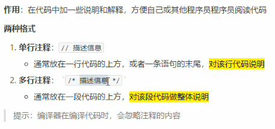

# C++ 学习笔记

## 1 前言

> C++ 学习笔记分为三部分：

* C++ 基本语法
* C++ 核心编程
  * 面向对象编程
* C++ 提高编程
  * 泛型编程思想以及 STL 的基本使用

## 2 基本语法

### 2.1 C++ 初识

#### 2.1.1 第一个 C++ 程序

> 编写一个 C++ 程序总共分为 4 个步骤：

* 创建项目
* 创建文件
* 编写代码
* 运行程序

> 第一个 C++ 程序：HelloWorld

```cpp
#include <iostream>
using namespace std;

int main() {
	cout << "HelloWorld" << endl;
	
	//system("pause");
	return 0;
}
```

#### 2.1.2 注释



#### 2.1.3 变量

作用：给一段指定的内存空间起名，方便操作这段内存。

举例：variable.cpp

```cpp
#include <iostream>
using namespace std;

int main() {
	//变量的定义：
	//语法：数据类型 变量名 = 初始值 
	int a = 10;
	cout << "a = " << a << endl;
	return 0;
}
```

#### 2.1.4 常量

作用：用于记录程序中不可更改的数据。

C++ 定义常量两种方式：

* #define 宏常量：#define 常量名 常量值
  * 通常在文件上方定义，表示一个常量
* const 修饰的变量：const 数据类型 常量名 = 常量值
  * 通常在变量定义前加关键字 const，修饰该变量为常量，不可修改

举例：constant.cpp

```cpp
#include <iostream>
using namespace std;

//宏常量
#define N 7
 
int main() {
	//N = 5; 不允许修改 
	cout << N << endl;
	//const修饰的变量
	const int month = 4;
	//month = 5; 不允许修改 
	cout << month << endl; 
	return 0;
}
```

#### 2.1.5 关键字

作用：关键字是 C++ 中预先保留的单词（标识符）。

| asm        | do           | if               | return      | typedef  |
| ---------- | ------------ | ---------------- | ----------- | -------- |
| auto       | double       | inline           | short       | typeid   |
| bool       | dynamic_cast | int              | signed      | typename |
| break      | else         | long             | sizeof      | union    |
| case       | enum         | mutable          | static      | unsigned |
| catch      | explict      | namespace        | static_cast | using    |
| char       | export       | new              | struct      | virtual  |
| class      | extern       | operator         | switch      | void     |
| const      | false        | private          | template    | volatile |
| const_cast | float        | protected        | this        | wchar_t  |
| continue   | for          | public           | throw       | while    |
| default    | friend       | register         | true        |          |
| delete     | goto         | reinterpret_cast | try         |          |

#### 2.1.6 标识符命名规则

作用：C++ 规定给标识符（变量、常量）命名时，有一套自己的规则。

* 标识符不能是关键字
* 标识符只能由字母、数字、下划线组成
* 第一个字符必须是字母或者下划线
* 标识符中字母区分大小写

> 建议：标识符命名时，尽量见名知意！


### 2.2 数据类型

> C++ 规定在创建一个变量或者常量时，必须要指定出相应的数据类型，否则无法给变量分配内存。

#### 2.2.1 整型

区别：数据类型所占内存大小不一样

| 数据类型  | 占用空间                                      | 取值范围       |
| --------- | --------------------------------------------- | -------------- |
| short     | 2 字节                                        | -2^15 - 2^15-1 |
| int       | 4 字节                                        | -2^31 - 2^31-1 |
| long      | win 4 字节，Linux  32 位 4 字节，64 位 8 字节 | -2^31 - 2^31-1 |
| long long | 8 字节                                        | -2^63 - 2^63-1 |

#### 2.2.2 sizeof 关键字

作用：利用 sizeof 关键字可以统计数据类型所占内存大小。

举例：sizeof.cpp

```cpp
#include <iostream>
using namespace std;
 
int main() {
	
	//利用sizeof求出数据类型占用内存大小
	//语法：sizeof(数据类型) 或 sizeof(变量)
	short a = 10;
	cout << sizeof(short) << endl;
	cout << sizeof(a); 
	return 0;
}
```

> short < int <= long < long long

#### 2.2.3 浮点型

> 浮点型，又称为实型

作用：用于表示小数。

浮点型变量分为两种：

* 单精度 float
* 双精度 double

两者的区别在于表示的有效数字范围不同。

默认情况下，输出一个小数，会显示出 6 位有效数字。

| 数据类型 | 占用空间 | 有效数字范围     |
| -------- | -------- | ---------------- |
| float    | 4 字节   | 7 位有效数字     |
| double   | 8 字节   | 15-16 位有效数字 |

举例：float.cpp

```cpp
#include <iostream>
using namespace std;
 
int main() {
	
	float f = 3.14f;
	double d = 3.14;
	cout << f << endl;
	cout << d;
	return 0;
}
```

> 科学计数法：

* float f = 3e2;  //表示 300
* float f = 3e-2;  //表示 0.03

#### 2.2.4 字符型

作用：字符型变量用于显示单个字符。

语法：char ch = 'a';

* C 和 C++ 中字符型变量只占用 1 个字节。
* 字符型变量并非把字符本身放到内存中存储，而是将对应的 ASCII 编码放入到存储单元。

#### 2.2.5 转义字符

作用：用于表示一些不能显示出来的 ASCII 字符。

现阶段常用的转义字符有：\ n，\ \，\ t

#### 2.2.6 字符串型

作用：用于表示一串字符

两种风格：

* C 风格字符串：char 变量名[ ] = "字符串值"
* C++ 风格字符串：string 变量名 = "字符串值"

```cpp
#include <iostream>
#include <string> //用于C++风格的字符串 
using namespace std;
 
int main() {
	
	char str[] = "Hello World";
	cout << str << endl;
	string a = "Hello World";
	cout << a; 
	return 0;
}
```

#### 2.2.7 布尔类型

作用：布尔数据类型（bool）代表真或假的值。

bool 类型只有两个值：

* true 真（本质是 1）
* false 假（本质是 0）

bool 类型占 1 个字节大小。

```cpp
#include <iostream>
using namespace std;
 
int main() {
	
	//创建bool数据类型
	bool flag = true;
	cout << flag << endl; 
	//查看内存空间大小 
	cout << sizeof(bool);
	return 0;
}
```

#### 2.2.8 数据的输入

作用：用于从键盘获取数据

关键字：cin

语法：cin >> 变量;

示例：

```cpp
#include <iostream>
using namespace std;
 
int main() {
	
	int x;
	cin >> x;
	cout << x;
	return 0;
}
```


### 2.3 运算符

作用：用于执行代码的运算


#### 2.3.1 算术运算符

作用：用于处理四则运算


示例：

```cpp
#include <iostream>
using namespace std;
 
int main() {
	//加减乘除
	int a = 10;
	int b = 3;
	cout << a + b << endl;
	cout << a - b << endl;
	cout << a * b << endl;
	cout << a / b << endl;
	cout << a % b << endl;
	return 0;
}
```

#### 2.3.2 赋值运算符

作用：用于将表达式的值赋给变量


#### 2.3.3 比较运算符

作用：用于表达式的比较，并返回一个真值或假值


示例：

```cpp
#include <iostream>
using namespace std;
 
int main() {
	
	int a = 10;
	int b = 3;
	//有优先级的运算，所以要加括号 
	cout << (a == b) << endl;
	return 0;
}
```

#### 2.3.4 逻辑运算符

作用：用于根据表达式的值返回真值或假值


### 2.4 程序流程控制

#### 2.4.1 选择结构

C / C++ 支持最基本的三种程序运行结构：顺序结构、选择结构、循环结构

##### 2.4.1.1 if 语句

作用：执行满足条件的语句

if 语句的三种方式：

* 单行格式 if 语句
* 多行格式 if 语句
* 多条件的 if 语句


示例：三只小猪称体重


【题目】有三只小猪 ABC，请分别输入三只小猪的体重，并且判断哪只小猪最重？

【代码】

```cpp
#include <iostream>
using namespace std;
 
int main() {
	//三只小猪称体重，判断哪只最重
	int num1 = 0;
	int num2 = 0;
	int num3 = 0;
	//用户输入重量
	cout << "请输入小猪A的体重" << endl; 
	cin >> num1;
	
	cout << "请输入小猪B的体重" << endl; 
	cin >> num2;
	
	cout << "请输入小猪C的体重" << endl; 
	cin >> num3;
	
	//判断 
	if (num1 > num2) {
		if (num1 > num3) {
			cout << "小猪A最重" << endl;
		} else {
			cout << "小猪C最重" << endl;
		}
	} else {
		if (num2 > num3) {
			cout << "小猪B最重" << endl;
		} else {
			cout << "小猪C最重" << endl;
		}
	}
	return 0;
}
```


##### 2.4.1.2 三目运算符

作用：通过三目运算符实现简单的判断

语法：表达式1？表达式2：表达式3

示例：

```cpp
#include <iostream>
using namespace std;
 
int main() {
	int a, b, c;
	cin >> a >> b >> c;
	cout << (a > b ? a : c); 
	return 0;
}
```


##### 2.4.1.3 switch 语句


#### 2.4.2 循环结构


#### 2.4.3 跳转语句


### 2.5 数组


### 2.6 函数


### 2.7 指针


### 2.8 结构体


