# C 程序设计基础

# 前言

* 1. C语言用在哪里？
  
  * 操作系统
  * 嵌入式系统
  * 驱动程序
  * 底层驱动
* 图形引擎、图像处理、声音效果
  
* 2. C需要被编译才能运行
  
  * 编辑器
  * 编译器
* 或者 `IDE` （集成开发环境）
  
* 3. 推荐的编程软件
  
  * [Dev-C++](https://sourceforge.net/projects/orwelldevcpp/?source=directory)

# 程序框架

## 程序结构

```C
#include <stdio.h>
int main()
{
    return 0;
}
```

一个C语言程序的结构有以下特点：

（1）一个程序由一个或者多个源程序文件组成

在一个源程序文件中包括3部分：预处理指令、全局声明、函数定义

（2）函数是C语言程序的主要组成部分

（3）一个函数包括两个部分：函数首部和函数体，函数体又包括声明部分和执行部分

（4）程序总是从main函数开始之执行的

（5）程序中对计算机的操作是由函数中的C语句完成的

（6）在每个数据声明和语句的最后必须有一个分号

（7）C语言本身不提供输入输出语句

（8）程序应当包含注释


## HelloWorld 

```c
#include <stdio.h>
int main()
{
    // 输出 Hello,World!
    printf("Hello,World!\n");
    return 0;
}
```
* 命令行编辑、编译、运行程序

> Example 01:

```c
ls -l
gcc hello.c
ls -l
./a.out
```

> Example 02：(默认在64位电脑上执行)

```c
gcc hello.c -o hello
./hello
```

> Example 03：(-m32 表示在32位电脑上执行)

```c
gcc hello.c -o hello -m32
./hello
```


## 注释

* 1. 单行注释：//注释内容

​     以//的单行注释，以换行符结束

* 2. 多行注释：/* 注释内容 */

​     这种注释可以跨越多行

注释内容可以用英文或者汉字


# 基本语法

## 数据的表现形式及其运算

1.常量

在程序运行过程中，其值不能被改变的量称为常量

常量有以下几类：

（1）整型常量：如1000，12345，0，-234等

（2）实型常量：十进制小数形式、指数形式

（3）字符常量：①普通字符，用单撇号括起来的一个字符，如'a','Z'等  ②转义字符，如'\'','\\'等

（4）字符串常量：用双引号引起来的多个字符，如"China"等

（5）符号常量：用#define指令，指定用一个符号名称代表一个常量，如#define PI 3.1416

> 符号常量的优点：含义清楚、一改全改


2.变量

变量代表一个有名字的、具有特定属性的一个存储单元，它用来存放数据，也就是存放变量的值。在程序运行期间，变量的值是可以改变的。

变量必须先定义，后使用。


3.常变量

 C99允许使用常变量：const int a=3;

常变量是有名字的不变量，而常量是没有名字的不变量。

常变量和符号常量有什么不同？

答：定义符号常量用#define指令，它是预编译指令，它知识用符号常量代表一个字符串，在预编译时仅是进行字符替换，在预编译后，符号常量就不存在了，对符号常量的名字是不分配存储单元的。而常变量要占用存储单元，有变量值，只是该值不改变。


4.标识符

 标识符就是一个对象的名字。如变量名、函数名等等

C语言规定标识符只能由字母、数字和下划线3种字符组成，且第一个字符必须为字母或下划线。


## 数据类型

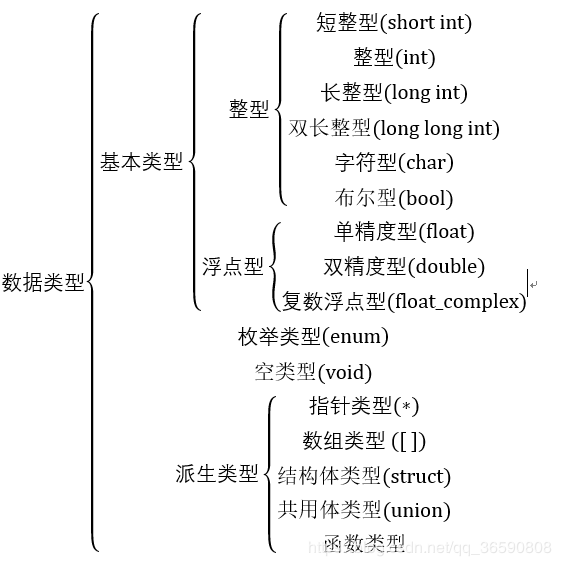

 为char类型分配1字节，为int型数据分配4个字节。

（1）int型

* 编译系统分配给int型数据2个字节或4个字节（VC++6.0就是分配4个字节）。
* 在存储单元中的存储方式：用整数的补码形式存放。

* int 表示一个寄存器的大小

（2）short int 型

* 分配2个字节

（3）long int 型

* 分配4个字节，在一个整数的末尾加大写字母L或小写字母l即可表示为long int型

（4）long long int 型

* 分配8个字节

（5）字符类型

* 分配1个字节

（6）float类型

* 分配4个字节

（7）double类型

* 分配8个字节


## 保留字

| auto     | break   | case   | char     | const  |
| -------- | ------- | ------ | -------- | ------ |
| continue | default | do     | double   | else   |
| enum     | extern  | float  | for      | goto   |
| if       | int     | long   | register | return |
| short    | signed  | sizeof | static   | struct |
| switch   | typedef | union  | unsigned | void   |
| volatile | while   | inline | restrict |        |


## 赋值和初始化

* 变量初始化
* <类型名称><变量名称> = <初始值>；
* eg.	int price = 0;


## 读整数

```c
scanf("%d",&price);
```

举例：plus.c

```c
#include "stdio.h" 

int main()
{
	int a = 0;
	int b = 0;
	
	printf("请输入两个整数："); 
	scanf("%d %d",&a,&b);
	printf("%d + %d = %d\n",a,b,a + b);
	
	return 0; 
}
 
```


## 常量

* 使用 `const` 定义常量，常量用大写字母表示

```c
const int AMOUNT = 100;
```

## 运算符和算子

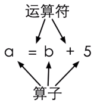

```c
eg.
    int a = b + 5;
```

* 计算时间差

```c
#include "stdio.h" 
/*计算时间差*/ 
int main()
{
	int hour1, minute1;
	int hour2, minute2;
	
	scanf("%d %d", &hour1, &minute1);
	scanf("%d %d", &hour2, &minute2);
	
	int t1 = hour1 * 60 + minute1;
	int t2 = hour2 * 60 + minute2;
	
	int t = t2 - t1;
	
	printf("时间差是 %d 小时 %d 分钟。",t/60, t%60); 
	
	return 0; 
}
```

* 运算符优先级

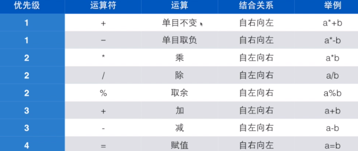

自增、自减运算符：

         ++i 、--i ：使用 i 之前，先使 i 的值加（减）1
    
         i++ 、i-- ：在使用i之后，使 i 的值加（减）1
    
         自增、自减运算符只能用于变量，而不能用于常量或表达式。

强制类型转换运算符：

         (类型名)(表达式)

求字节数运算符：

         sizeof


## 数据的输入输出

scanf (格式输入)、printf (格式输出)

getchar (输入字符)、putchar (输出字符)

gets (输入字符串)、puts (输出字符串)

在使用它们之前需要在开头用预处理指令 #include <stdio.h>

printf 函数的一般格式

printf (格式控制，输出列表)

例如：printf (" %f 约等于 %d ", i , c );

### 类型安全

* 强类型
* 早期语言强调类型，面向底层的语言强调类型
* C语言需要类型，但是对类型的安全检查并不足够


### sizeof

* 是一个静态运算符，给出某个类型或者变量在内存中所占据的字节数
* sizeof(int)
* sizeof(i)
* Example 01：

```c
#include <stdio.h>

int main()
{
	int a = 6;
	printf("sizeof(int)=%ld\n",sizeof(int));
	printf("sizeof(a)=%ld\n",sizeof(a));
	
    return 0;
}
```


### 补码

* Example 01：

```c
#include <stdio.h>

int main()
{
	char c = 255;
	int i = 255;
	printf("c=%d,i=%d\n",c,i);
	
    return 0;
}
```


### unsigned

* 无符号整数型（0-255）
* 255u
* 用 l 或 L 表示 long
* unsigned 的初衷并非是扩展数能表达的范围，而是为了做纯二进制运算，主要是为了移位


### 整数的输入输出

* 只有两种形式：int 或 long long
* %d：int
* %u：unsigned
* %ld：long long
* %lu：unsigned long long

* Example 01：

```c
#include <stdio.h>

int main()
{
	char c = -1;
	int i = -1;
	printf("c=%u,i=%u\n",c,i);
	
    return 0;
}
```

* Example 02：八进制和十六进制转换为十进制

```c
#include <stdio.h>

int main()
{
	char c = 012;//八进制 
	int i = 0x12;//十六进制 
	printf("c=%d,i=%d\n",c,i);
	
    return 0;
}
```

* Example 03：八进制和十六进制输出

```c
#include <stdio.h>

int main()
{
	char c = 012;//八进制 
	int i = 0x12;//十六进制 
	printf("c=0%o,i=0x%x\n",c,i);
	printf("c=0%o,i=0x%X\n",c,i);
	
    return 0;
}
```

 

### 浮点数的输入输出

* float （4字节） 输入 %f 格式，输出 %f 或 %e
* double （8字节）输入 %lf 格式，输出 %lf 或 %e

* 科学计数法：-5.67E+16
* 输出精度：
  * 在 % 和 f 之间加上 .n 可以指定输出小数点后几位，这样的输出是做4舍5入的
  * printf("%.3f\n",-0.0046);

```c
#include <stdio.h>

int main()
{
	printf("%.3f\n",-0.0046);
	printf("%.30f\n",-0.0046);
	printf("%.3f\n",-0.00046);
	
    return 0;
}
```

* 超过范围的浮点数:
  * printf 输出 inf 表示超过范围的浮点数：±∞
  * printf 输出 nan 表示不存在的浮点数

* Example 01:

```c
#include <stdio.h>

int main()
{
	printf("%f\n",12.0/0.0);
	printf("%f\n",-12.0/0.0);
	printf("%f\n",0.0/0.0);
	
    return 0;
}
```

* 浮点运算的精度
  * f1 == f2  可能值相等，但不等
  * 利用 fabs(f1-f2)<1e-12


### 字符的输入输出

* 如何输入 ‘1‘ 这个字符给 char c？

  * scanf("%c",&c);

  * ```c
    #include <stdio.h>
    
    int main()
    {
    	char c;
    	scanf("%c",&c);
    	printf("c=%d\n",c);
    	printf("c=%c\n",c);
    	
        return 0;
    }
    
    ```

* Example 01：

```c
#include <stdio.h>

int main()
{
	char c;
	char d;
	c = 1;
	d = '1';
	if(c == d){
		printf("相等\n"); 
	}else{
		printf("不相等\n");
	}
	printf("c=%d\n",c);
	printf("d=%d\n",d);
	
    return 0;
}
```

* 字母大小写转换
  * a+'a'-'A'   大写字母变成小写字母
  * a+'A'-'a'   小写字母变成大写字母

### 逃逸字符

| 字符 |      意义      | 字符 |    意义    |
| :--: | :------------: | :--: | :--------: |
|  \b  |    回退一格    | \ "  |   双引号   |
|  \t  | 到下一个表格位 | \ '  |   单引号   |
|  \n  |      换行      | \ \  | 反斜杠本身 |
|  \r  |      回车      |      |            |

* Example 01：

```c
#include <stdio.h>

int main()
{
	printf("123\bA\n456");
	
    return 0;
}
```


### 自动类型转换

* 当运算符的两边出现不一致的类型时，会自动转换成较大的类型
* char --> short --> int --> long --> long long
* int --> float --> double
* short ----- %hd
* long ------ %ld


### 强制类型转换

* Example 01：
* (int)10.2
* (short)32

* 反例1：

* ```c
  #include <stdio.h>
  
  int main()
  {
  	printf("%d\n",(short)32768);
  	
      return 0;
  }
  ```

* 结果：-32768

* 反例2：

* ```c
  #include <stdio.h>
  
  int main()
  {
  	printf("%d\n",(char)32768);
  	
      return 0;
  }
  ```

* 结果：0

> 注：`强制类型转换的优先级高于四则运算`


## 选择结构和条件判断

C语言有两种选择语句：

（1）if 语句，用来实现两个分支的选择结构

```c
if (表达式)
    语句1
else
    语句2
```

（2）switch 语句，用来实现多分支的选择结构

```c
switch(表达式)
{
case 常量1 ：语句1
case 常量2 ：语句2
        ...
case 常量n ：语句n
default: 语句n+1
```

## 循环结构

（1）用while语句实现循环

```c
while(表达式)
    语句
```

（2）用do...while 语句实现循环

```c
do
    语句
while(表达式);
```

（3）用for语句实现循环

```c
for(表达式1;表达式2;表达式3)
    语句
```

* 改变循环执行的状态

（1）用break语句提前终止循环

```c
一般形式：break;
```

注意：break语句还可以用来从循环体内跳出循环体，即提前结束循环，接着执行循环下面的语句。break语句只能用于循环语句和switch语句之中，而不能单独使用。

（2）用continue语句提前结束本次循环

```c
一般形式：continue;
```

注：作用为结束本次循环，即跳过循环体中下面尚未执行的语句，转到循环体结束点之前，然后进行下一次是否执行循环的判定。

## bool

* #include <stdbool.h>
* 之后就可以使用bool和true、false

```c
#include <stdio.h>
#include <stdbool.h> 

int main()
{
	bool b = 6>5;
	printf("%d",b);
    
    return 0;
}
```

## 随机数

* rand()

```c
#include <stdio.h>
#include <stdlib.h>
#include <time.h>

//主函数 
int main(){
	
	srand(time(0));
	int a = rand();
	
	printf("%d\n",a);
	
	return 0;
}
```

* x%n 的结果是[0,n-1]的一个整数

```c
printf("%d\n",a%100);
```

* Example：[猜数游戏](https://wugenqiang.github.io/CS-Notes/#/C/C-Notes?id=_004-猜数游戏)


* Example 01：

```c
#include <stdio.h>

int main()
{
	unsigned char c = 255;
	int i = 255;
	printf("c=%d,i=%d\n",c,i);
	
    return 0;
}
```


## 逻辑运算

| 运算符 |  描述  |   事例   |
| :----: | :----: | :------: |
|   ！   | 逻辑非 |    !a    |
|   &&   | 逻辑与 |  a && b  |
|  \|\|  | 逻辑或 | a \|\| b |

## 函数

* 函数是一块代码，接收零个或多个参数，做一件事情，并返回零个或一个值
* 函数原型，以分号结尾，即声明

* Example 01：判断素数

  ```c
  int isPrime(int i){
  	int result = 1;
  	int k;
  	for(k=2;k<i-1;k++){
  		if(i%k == 0){
  			result = 0;
  			break;
  		}
  	}
  	return result;
  }
  ```

* Example 02：求和函数 ==> 求1到10、20到30和36到45的三个和

* ```c
  void sum(int begin,int end){
  	int i;
  	int sum = 0;
  	for(i=begin;i<=end;i++){
  		sum += i;
  	}
  	printf("%d 到 %d 的和是 %d\n",begin,end,sum);
  }
  ```

* C 语言在调用函数时，永远只能传值给函数

### 局部变量

* 也叫：本地变量 ==> 定义在函数内部的变量
* 生存期和作用域 ==> 大括号内，即代码块


### 全局变量

* 定义在函数体外面

> `避免代码复制` 代码复制是代码不良的表现！


## 一维数组

### 数组大小

* const int number = 10;
* 使用 sizeof 给出整个数组所占据的内容的大小，单位是字节：`sizeof(a)/sizeof(a[0])`


### 初始化数组

* ```c
  for(i=0;i<number;i++){
  		count[i]=0;
  	}
  ```

### 集成初始化

```c
int a[] = {2,4,6,7,1};
```

* 集成初始化时的定位

```c
int a[10] = {[0] = 2,[2] = 3,6,};
```


### 定义数组

* < 类型 > 变量名称 [ 元素数量 ]
* int number[100];
* scanf("%d",&number[i]);
* int grades[100];
* double weight[20];
* 元素数量必须是整数

* 使用数组时放在[]中的数字叫做下标或索引，下标从0开始计数
* 有效的下标范围
  * [ 0 , 数组的大小 - 1 ]

### 数组的赋值

> 注：数组变量本身不能被赋值，要把一个数组的所有元素交给另一个数组，必须采用遍历

```c
for(i=0;i<length;i++){
    b[i] = a[i];
}
```


### 数组运算

* 案例：`代码训练 018`
* 案例：`代码训练 019`
* 案例：`代码训练 020`
* 案例：`代码训练 021`

### 遍历数组输出

```c
for(i=0;i<number;i++){
    printf("%d:%d\n",i,count[i]);
}
```


 ## 二维数组

* int a [ 3 ] [ 5 ] 理解为 a 是一个 3 行 5 列的矩阵

### 初始化

```c
int a[][5] = {
    {0,1,2,3,4},
    {2,3,4,5,6},
}
```

> 注：列数必须给出

### 数组运算

* 案例1：tic-tac-toe 游戏

## 指针

* 就是保存地址的变量
* %p 用来输出指针的值、输出地址符，以16进制的形式输出内存地址

```c
int i;
int* p = &i;
int* p,q;
int *p,q;
int *p,*q;
```

### 指针变量

* 指针变量的值是具有实际值的变量的地址

```c
void f(int *p);

int i=0;
f(&i);
```

* Example 01：

```c
#include <stdio.h>

void f(int *p);
 
int main(){
	int i = 6;
	printf("&i=%p\n",&i);
	f(&i);
	 
	return 0;
}

void f(int *p){
	printf("p=%p\n",p);
}
```

### 指针应用场景

* 场景一：交换两个变量的值 [ swap(&a,&b) ]

```c
void swap(int *pa,int *pb){
    int t = *pa;
    *pa = *pb;
    *pb = t;
}
```

* 场景二：求最大、最小值

```c
void minmax(int a[],int len,int *min,int *max){
    int i;
    *min = *max = a[0];
    for(i=1;i<len;i++){
        if(a[i]<*min){
            *min = a[i];
        }
        if(a[i]>*max){
            *max = a[i];
        }
    }
}
```

* 场景三：函数返回运算的状态，结果通过指针返回

```c
#include <stdio.h>

int divide(int a,int b,int *result);
 
int main(){
	int a = 5;
	int b = 2;
	int c;
	if(divide(a,b,&c)){
		printf("%d/%d=%d\n",a,b,c);
	}
	 
	return 0;
}

int divide(int a,int b,int *result){
	int ret = 1;
	if(b == 0){
		ret = 0;
	}else{
		*result = a/b;
	}
}
```

> 注：数组变量是特殊的指针

* 数组变量本身表达地址，所以
  * int a[10];int *p = a;	//  无需用&取地址
  * a == &a[0] 

### 指针计算

* Example 01：

```c
#include <stdio.h>
 
int main(){
	char ac[] = {0,1,2,3,4,5,6,7,8,9,};
	char *p = &ac[0];
	char *p1 = &ac[5];
	printf("p=%p\n",p);
	printf("p+1=%p\n",p+1);
	printf("p1-p=%d\n",p1-p);
	
	return 0;
}
```

> *p++

* *的优先级虽然高，但是没有++高
* 取出p所指的那个数据来，完事之后顺便把p移到下一个位置去

* Example 02：

```c
#include <stdio.h>
 
int main(){
	char ac[] = {0,1,2,3,4,5,6,7,8,9,-1};
	char *p = &ac[0];
	int i;
	for(i=0;i<sizeof(ac)/sizeof(ac[0]);i++){
		printf("%d\n",ac[i]);
	}
	while(*p != -1){
		printf("%d\n",*p++);
	}
	
	return 0;
}
```

>  0地址

* 内存中有0地址，但是不能随便碰
* 0地址用来表示特殊的事情：
  * 返回的指针是无效的
  * 指针没有被真正初始化(先初始化为0)
* NULL是一个预定定义的符号，表示0地址

### 动态内存分配

> 输入数据

* int * a = (int *)malloc(n * sizeof(int))
* 向 malloc 申请的空间的大小是以字节为单位的，返回的是void * ，需要类型转换为自己需要的类型 

* Example 01：

```c
#include <stdio.h>
#include <stdlib.h> 

int main(){
	int number;
	int *a;
	int i;
	printf("输入数量："); 
	scanf("%d",&number);
	a = (int *)malloc(number*sizeof(int));
	for(i=0;i<number;i++){
		scanf("%d",&a[i]);
	}
	for(i=number-1;i>=0;i--){
		printf("%d ",a[i]);
	}
    free(a);
    
	return 0;
}
```

## 字符串

> 字符数组：char word[] = {'H','e','l','l','o','!'};
>
> 字符串：char word[] = {'H','e','l','l','o','!','\0'};

* 字符串以0结尾的一串字符，以数组的形式存在，以数组或指针的形式访问

### 字符串变量和常量

* char * str = "Hello";
* char word[] = "Hello";
* char line[10] = "Hello";

* Example 01：

```c
#include <stdio.h> 

int main(){
	char *s = "Hello World\0";
	char s1[] = "Hello World\0";
	s1[0] = 'B';
	
	printf("s=%s\n",s);
	printf("s1=%s\n",s1);
	printf("Here!s1[0]=%c\n",s1[0]); 
	return 0;
}
```

### 字符串输入输出

* scanf 读入一个单词（到空格、tab或回车为止）

```c
char string[8];
scanf("%s",string);
printf("%s",string);
```

### 空字符串

* char buffer[100] = "";	//这是一个空的字符串，buffer[0] == '\0'；
* char buffer[] = "";     //这个数组的长度只有1

### 字符串数组


### 字符串函数

> putchar

* int putchar(int c);
* 向标准输出写一个字符
* 返回写了几个字符，EOF(-1)表示写失败

> getchar

* int getchar(void)
* 从标准输入读入一个字符
* 返回类型时int是为了返回EOF(-1)
* windows-----ctrl+Z
* linux-----------ctrl+D

> 案例：

* Example 01：

```c
#include <stdio.h> 

int main(){
	int ch;
	while((ch = getchar()) != EOF){
		putchar(ch);
	}
	printf("EOF\n");
	
	return 0;
}
```


`string.h` 标准库中包含函数：

> strlen

* size_t strlen(const char *s);
* 返回s的字符串长度（不包括结尾的0）

* Example 01：

```c
#include <stdio.h> 
#include <string.h>

int main(){
	char line[] = "Hello";
	printf("strlen=%lu\n",strlen(line));
	printf("sizeof=%lu\n",sizeof(line));
	
	return 0;
}
```

* Example 02：用mylen自定义函数，替代库中strlen

```c
#include <stdio.h> 
#include <string.h>

int mylen(const char *s){
	
	int idx = 0;
	while(s[idx]!='\0'){
		idx++;
	}
	return idx;
}

int main(){
	char line[] = "Hello";
	printf("strlen=%lu\n",mylen(line));
	printf("sizeof=%lu\n",sizeof(line));
	
	return 0;
}
```

> strcmp

* int strcmp(const char *s1,const char *s2);
* 比较两个字符串，返回：
  * 0：s1 == s2
  * 1：s1 > s2
  * -1：s1 < s2

* Example 01：

```c
#include <stdio.h> 
#include <string.h>

int main(){
	char s1[] = "abc";
	char s2[] = "abc";
	printf("%d\n",strcmp(s1,s2));
	
	return 0;
}
```

* Example 02：

```c
#include <stdio.h> 
#include <string.h>

int main(){
	char s1[] = "abc";
	char s2[] = "Abc";
	printf("%d\n",strcmp(s1,s2));
	printf("%d\n",'a'-'A');
	
	return 0;
}
```

* Example 03：

```c
#include <stdio.h> 
#include <string.h>

int mycmp(const char *s1,const char *s2){
	int idx = 0;
	while(s1[idx] == s2[idx] && s1[idx] != '\0'){
//		if(s1[idx] != s2[idx]){
//			break;
//		}else if(s1[idx] == '\0'){
//			break;			
//		}
		idx++;
	}
	return s1[idx] - s2[idx];
}

int main(){
	char s1[] = "abc";
	char s2[] = "Abc";
	printf("%d\n",mycmp(s1,s2));
	printf("%d\n",'a'-'A');
	
	return 0;
}
```

* Example 04：

```c
#include <stdio.h> 
#include <string.h>

int mycmp(const char *s1,const char *s2){
		while(*s1 == *s2 && *s1 != '\0'){
		s1++;
		s2++;
	}
	return *s1 - *s2;
}

int main(){
	char s1[] = "abc";
	char s2[] = "Abc";
	printf("%d\n",mycmp(s1,s2));
	printf("%d\n",'a'-'A');
	
	return 0;
}
```

> strcpy

* char *strcpy(char *restrict dst, const char *restrict src);
* 把src的字符串拷贝到dst
* restrict表明src和dst不重叠（C99）
* 返回dst，为了能链起代码

> 复制一个字符串

```c
//动态申请内存
char *dst = (char*)malloc(strlen(src)+1);
//拷贝src到dst
strcpy(dst,src);
```

* Example 01：自定义版本----数组

```c
#include <stdio.h> 
#include <string.h>

int mycpy(char *dst,char *src){
	int idx = 0;
	while(src[idx]){
		dst[idx] = src[idx];
		idx++;
	}
	//dst[idx] = src[idx];
	dst[idx] = '\0';
	return dst;
}

int main(){
	char s1[] = "abc";
	char s2[] = "Abc";
	printf("%s\n",strcpy(s1,s2));
	
	return 0;
}
```

* Example 02：自定义版本----指针

```c
#include <stdio.h> 
#include <string.h>

int mycpy(char *dst,char *src){
	char *ret = dst;
//	while(*src){
////		*dst = *src;
////		dst++;
////		src++;
//		*dst++ = *src++;	
//	}	
	while(*dst++ = *src++){
	}	
	*dst = '\0';
	return ret;
}

int main(){
	char s1[] = "abc";
	char s2[] = "Abc";
	printf("%s\n",strcpy(s1,s2));
	
	return 0;
}
```

> strcat

* char *strcat(char *restrict s1, const char *restrict s2);

* 把s2拷贝到s1的后面，接成一个长的字符串
* 返回s1
* s1必须具有足够的空间


> strchr

* 在字符串中找字符
* char * strchr(const char *s,int c);
* 返回NULL表示没有找到

* Example 01：

```c
#include <stdio.h> 
#include <string.h>

int main(){
	char s[] = "hello";
	char *p = strchr(s,'l');
	p = strchr(p+1,'l');
	printf("%s\n",p);
	
	return 0;
}
```

* Example 02：

```c
#include <stdio.h> 
#include <string.h>

int main(){
	char s[] = "hello";
	char *p = strchr(s,'l');
	char *t = (char*)malloc(strlen(p)+1);
	strcpy(t,p);
	printf("%s\n",t);
	free(t);
	
	return 0;
}
```

* Example 03：

```c
#include <stdio.h> 
#include <string.h>

int main(){
	char s[] = "hello";
	char *p = strchr(s,'l');
	char c = *p;
	*p = '\0';
	
	char *t = (char*)malloc(strlen(s)+1);
	strcpy(t,s);
	printf("%s\n",t);
	free(t);
	
	return 0;
}
```


> strrchr

* Example 01：

```c
#include <stdio.h> 
#include <string.h>

int main(){
	char s[] = "hello";
	char *p = strchr(s,'l');
	p = strrchr(p,'l');
	printf("%s\n",p);
	
	return 0;
}
```


> strstr

* 字符串中找字符串
* char *strstr(const char *s1, const char *s2);
* char *strcasestr(const char *s1, const char *s2);


### 安全问题

* 要考虑


## 结构类型

### 枚举

> 用枚举优化常量符号化，变得更加方便

* enum 枚举类型名字{名字0,...,名字n};

* Example 01：

```c
#include <stdio.h> 

enum color{
	red,
	yellow,
	green
};

void f(enum color c);

int main(){
	enum color t = red;
	scanf("%d",&t);
	f(t);
	
	return 0;
}

void f(enum color c){
	printf("%d\n",c);
}
```

> 枚举量

* 声明枚举量的时候可以指定值

* ```c
  enum color{
  	red = 1,
  	yellow,
  	green = 5
  };
  ```

> 枚举只是int
>
> 实际上很少用


### 结构体

> 声明结构类型

* Example 01：

```c
#include <stdio.h> 

struct date{
		int month;
		int day;
		int year;
	};
	
int main(){
	struct date today;
	today.month = 03;
	today.day = 05;
	today.year = 2020;
	printf("%i-%i-%i",today.year,today.month,today.day);
	//%i表示有符号十进制整数 
	return 0;
}
```

> 声明结构的形式

* 形式一：

```c
struct point{
    int x;
    int y;
};
struct point p1,p2;	// p1和p2都是point里面有x和y的值

```

* 形式二：

```c
struct{
    int x;
    int y;
}p1,p2;// p1和p2都是一种无名结构，里面有x和y
```

* 形式三：(推荐)

```c
struct point{
    int x;
    int y;
}p1,p2;
// p1和p2都是point里面有x和y的值
```

> 结构变量

```c
struct date today;
today.month = 03;
today.day = 05;
today.year = 2020;
```

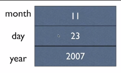

> 结构体的初始化

```c
struct date today = {03,05,2020};
```

> 结构成员

```c
today.day
```

> 结构运算

* 赋值、取地址、传递函数参数

* p1 = (struct point){5,10};  //相当于p1.x = 5,p1.y = 10;
* p1 = p2;  //相当于p1.x = p2.x; p1.y = p2.y;

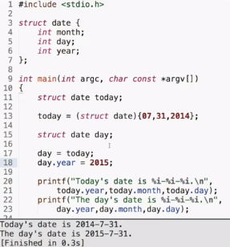

> 结构可作为函数参数

```c
bool isLeap(struct date d);
```

> 结构指针作为参数

* 指向结构的指针

```c
struct date{
    int month;
    int day;
    int year;
}myday;
struct date *p = &myday;
(*p).month = 12;
p -> month = 12;
```

`用->表示指针所指的结构变量中的成员`

> 结构数组

```c
struct date dates[100];
struct date dates[] = {{4,5,2005},{2,4,2005}};
```

> 结构中的结构

```c
struct dateAndTime{
    struct date sdate;
    struct time stime;
}
```

* Example 01：

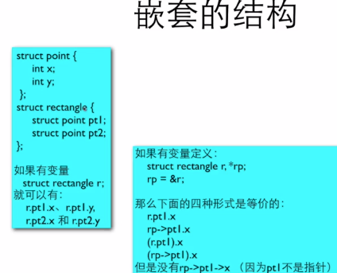


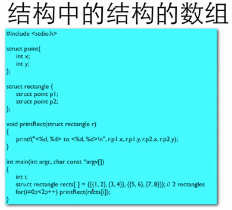

>  Typedef

* typedef 自定义数据类型

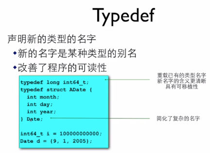

* ```c
  typedef struct{
      int month;
      int day;
      int year;
  }Date;
  ```

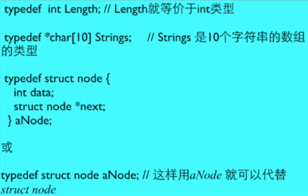


### 联合体

```c
union AnElt{
    int i;
    char c;
}elt1,elt2;
elt1.i = 4;
elt2.c = 'a';
```

* sizeof(union ...) = 	//  sizeof (每个成员) 的最大值

```c
#include <stdio.h> 

typedef union{
	int i;
	char ch[sizeof(int)];
}Data;

int main(){
	Data data;
	int i;
	data.i = 1234;
	for(i=0;i<sizeof(int);i++){
		//对于%02hhx，hhx已经以一个字节打印了，加上02限制，不够两位的补成两位。 
		printf("%02hhX",data.ch[i]);
	}
	printf("\n");
	
	return 0;
}
```

## 程序结构

### 全局变量

> 全局变量初始化

* 默认初始化为0，指针会得到NULL
* 尽量不要使用全局变量来在函数间传递参数和结果


### 静态本地变量

* static

* 使用全局变量和静态本地变量的函数是线程不安全的


### 编译预处理和宏

> 编译预处理指令

* #开头的是编译预处理指令

* 它们不是c语言的成分，但是c语言程序离不开它们

* #define 用来定义一个宏，原始的文本替换

* Example 01：

  * ```c
    #include <stdio.h> 
    //const double PI = 3.14159; 
    #define PI 3.14159
    
    int main(){
    	
    	printf("%f\n",2*PI);
    	
    	return 0;
    }
    ```

* Example 02：

  * ```c
    #include <stdio.h> 
    //const double PI = 3.14159; 
    #define PI 3.14159
    #define PI2 2*PI  // PI * 2
    #define PRT printf("%f ",PI); \
    			printf("%f\n",PI2)
    
    int main(){
    	
    //	printf("%f\n",PI);
    //	printf("%f\n",PI2);
    	PRT;
    	
    	return 0;
    }
    ```

> #define

* 有值的宏：参考上面 Example 02
* 没有值的宏：#define _DEBUG    //  这类宏适用于条件编译，后面有其他的编译预处理指令来检查这个宏是否已经被定义过了

> 预定义的宏

* _ _ LINE _ _
* _ _ FILE _ _
* _ _ DATE _ _
* _ _ TIME _ _
* _ _ STDC _ _

* Example 01：

  * ```c
    #include <stdio.h> 
    
    int main(){
    	printf("%s:%d\n",__FILE__,__LINE__);
    	printf("%s:%s\n",__DATE__,__LINE__);
    	
    	return 0;
    }
    ```

> 像函数的宏

* #define cube(x)  ( (x) * (x) * (x) )

* 宏可以带参数

* Example 01：

  * ```c
    #include <stdio.h> 
    
    #define cube(x) ((x)*(x)*(x)) 
    
    int main(int argc,char const *argv[]){
    	int i;
    	scanf("%d",&i);
    	printf("%d\n",cube(i));
    	
    	return 0;
    }
    ```

* 带参数的宏的原则：

  * 一切都要括号
    * 整个值要括号
    * 参数出现的每个地方都要括号
  * #define RADTODEG(x)  ( (x) * 57.29578 )

* 宏可以带多个参数：

  * #define MIN(a,b)  ((a)>(b)?(b):(a))

* 宏也可以组合(嵌套)使用其他宏


### 大程序结构

> 多个 .c 文件

* 在 Dev C++ 中新建一个项目，然后把几个源代码文件加入进去，然后编译和构建运行即可。

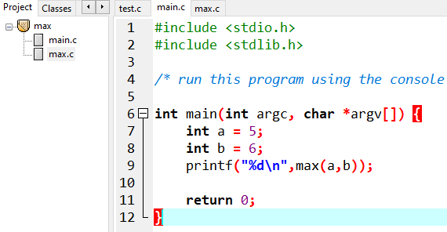

* 编译单元
  * 一个 .c 文件是一个编译单元
  * 编译器每次编译只处理一个编译单元

* 引入头文件
  * 把函数原型放在一个头文件(以 .h 结尾)中，在需要调用这个函数的源代码文件( .c 文件)中 #include 这个头文件，就可以让编译器在编译的时候知道函数的原型。

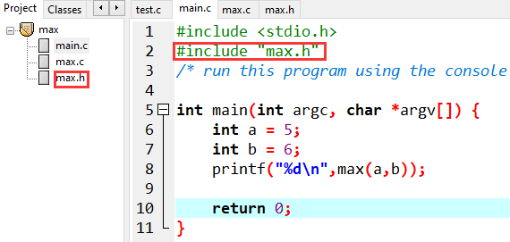

> 声明

在 .h 中添加 extern int gAll; 就能使用 gAll 了

* int i; //是变量的定义
* extern int i;  //是变量的声明

* 声明不产生代码，定义产生代码
* 声明包括：
  * 函数原型
  * 变量声明
  * 结构声明
  * 宏声明
  * 枚举声明
  * 类型声明
  * inline 声明
* 只有声明才能放在头文件中

> 标准头文件结构

* 条件编译指令

* #ifndef  _ MAX_H _  //如果没有定义
* #define  _ MAX_H _  //则定义
* #endif
* 避免了重复引用的情况

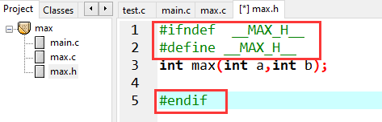

## 文件

### 文件输入输出

* linux 用 > 和 < 做重定向

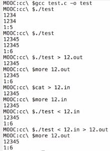

* 打开文件的标准代码：

  * ```c
    FILE *fp = fopen("file","r");
    if(fp){
        fscanf(fp,...);
        fclose(fp);
    }else{
        ...
    }
    ```

  * Example 01：

  * ```c
    #include <stdio.h> 
    
    int main(int argc,char const *argv[]){
    	FILE *fp = fopen("12.in","r");
    	if(fp){
    		int num;
    		fscanf(fp,"%d",&num);
    		printf("%d\n",num);
    		fclose(fp);
    	} else{
    		printf("无法打开文件\n");
    	}
    	
    	return 0;
    }
    ```

> fopen

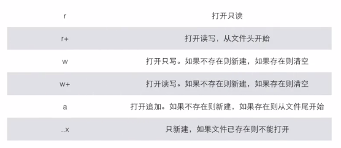


### 二进制文件

* 其实所有的文件最终都是二进制的
* 文本文件读写：
  * more、tail
  * cat
  * vi
* 二进制文件需要专门的程序来读写
* 文本文件的输入输出是格式化，可能经过转码


### 文件练习题

> 文件练习举例：

* Example 01：

  * student.h

  * ```c
    #ifndef _STUDENT_H_
    #define _STUDENT_H_
    
    //const int STR_LEN = 20;
    #define STR_LEN 20
    
    typedef struct _student{
    	char name[STR_LEN];
    	int gender;
    	int age;
    }Student;
    
    #endif
    ```

  * main.c

  * ```c
    #include <stdio.h>
    #include "student.h"
    
    void getList(Student aStu[],int number);
    int save(Student aStu[],int number);
    
    int main(int argc, char *argv[]) {
    	int number = 0;
    	printf("输入学生数量：");
    	scanf("%d",&number);
    	Student aStu[number];
    	
    	getList(aStu,number);
    	if(save(aStu,number)){
    		printf("保存成功\n");
    	}else{
    		printf("保存失败\n");
    	}
    	
    	return 0;
    }
    
    void getList(Student aStu[],int number){
    	char format[STR_LEN];
    	//向字符串输出 
    	sprintf(format,"%%%ds",STR_LEN-1);
    	//%19s 
    	int i;
    	for(i=0;i<number;i++){
    		printf("第%d个学生：\n",i);
    		printf("\t姓名：");
    		scanf(format,aStu[i].name); 
    		printf("\t性别(0-男，1-女，2-其他)：");
    		scanf("%d",&aStu[i].gender);
    		printf("\t年龄：");
    		scanf("%d",&aStu[i].age); 
    	}
    }
    
    int save(Student aStu[],int number){
    	int ret = -1;
    	FILE *fp = fopen("student.data","w");
    	if(fp){
    		ret = fwrite(aStu,sizeof(Student),number,fp);
    		fclose(fp);
    	}
    	return ret == number;
    }
    ```

* 测试结果：

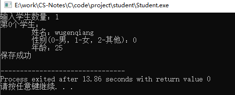

### 在文件中定位

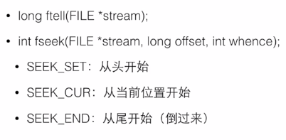

* Example 02：

  * read.c

  * ```c
    #include <stdio.h>
    #include "student.h"
    
    void read(FILE *fp,int index);
    
    int main(){
    	FILE *fp = fopen("student.data","r");
    	if(fp){
    		fseek(fp,0L,SEEK_END);
    		long size = ftell(fp);
    		int number = size / sizeof(Student);
    		int index = 0;
    		printf("有%d个数据，你要看第几个：",number);
    		scanf("%d",&index);
    		read(fp,index-1);
    		fclose(fp);
    	}
    	return 0;	
    }
    
    void read(FILE *fp,int index){
    	fseek(fp,index * sizeof(Student),SEEK_SET);
    	Student stu;
    	if(fread(&stu,sizeof(Student),1,fp) == 1){
    		printf("第%d个学生：",index+1);
    		printf("\t姓名：%s\n",stu.name);
    		printf("\t性别：");
    		switch(stu.gender) {
    			case 0:printf("男\n");break;
    			case 1:printf("女\n");break;
    			case 2:printf("其他\n");break;
    		}
    		printf("\t年龄：%d\n",stu.age);
    	}
    }
    ```

* Test Result:

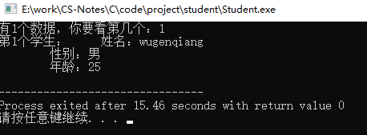

* 可移植性

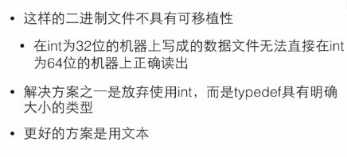

## 位运算

### 按位运算

* C 有这些按位运算的运算符：
  * &    按位与
  * |    按位或
  * ~    按位取反
  * ^    按位异或
  * <<   左移
  * `>>`  右移


### 移位运算

* 按位运算输出 int

* 左移

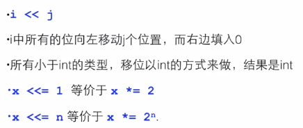

* 右移

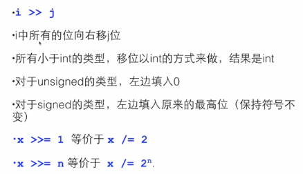

> 注：移位的位数不要用负数，这是没有定义的行为


### 位段

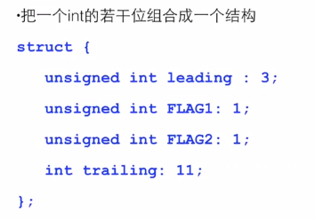

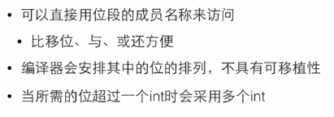

## 链表

### 可变数组

* Example 01：

  * array.h

  * ```c
    #ifndef _ARRAY_H_
    #define _ARRAY_H_
    
    typedef struct {
    	int *array;
    	int size;
    }Array;
    
    #define BLOCK_SIZE 20
    
    Array array_create(int init_size);
    void array_free(Array *a);
    int array_size(const Array *a);
    int *array_at(Array *a,int index);
    void array_inflate(Array *a,int more_size);
    int array_get(const Array *a,int index);
    void array_set(Array *a,int index,int value);
    
    #endif
    ```

  * array.c

  * ```c
    #include "array.h"
    #include <stdio.h>
    #include <stdlib.h>
    
    //typedef struct {
    //	int *array;
    //	int size;
    //}Array;
    
    Array array_create(int init_size){
    	Array a;
    	a.size = init_size;
    	a.array = (int *)malloc(sizeof(int)*a.size);
    	return a;
    }
    void array_free(Array *a){
    	free(a->array);
    	a->array = NULL;
    	a->size = 0;
    }
    int array_size(const Array *a){
    	return a->size;
    }
    int *array_at(Array *a,int index){
    	if(index>=a->size){
    		//array_inflate(a,index-a->size+1);
    		array_inflate(a,(index/BLOCK_SIZE +1)*BLOCK_SIZE-a->size);
    	}
    	return &(a->array[index]);
    }
    //可变字符自动按块增长 
    void array_inflate(Array *a,int more_size){
    	int *p = (int *)malloc(sizeof(int)*(a->size + more_size));
    	int i;
    	for(i=0;i<a->size;i++){
    		p[i] = a->array[i];
    	}
    	free(a->array);
    	a->array = p;
    	a->size += more_size;
    }
    int array_get(const Array *a,int index){
    	return a->array[index];
    }
    
    void array_set(Array *a,int index,int value){
    	a->array[index] = value;
    }
    
    int main(){
    	Array a = array_create(100);
    	printf("%d\n",array_size(&a));
    	printf("%d\n",a.size);
    	*array_at(&a,0) = 10;
    	printf("%d\n",*array_at(&a,0));
    	int number;
    	int cnt = 0;
    	while(number != -1){
    		scanf("%d",&number);
    		if(number!=-1){
    			*array_at(&a,cnt++) = number;
    		}
    	} 
    	
    	array_free(&a);
    	
    	return 0;
    }
    ```

> 可变数组的缺陷

* 要 copy，不能充分利用


### 链表存储数据

> 链表存储数据 add

* Example 01：

```c
#include <stdio.h> 
#include <stdlib.h>

typedef struct _node{
	int value;
	struct _node *next;
	
}Node; 

int main(){
	Node *head = NULL;
	int number;
	do{
		scanf("%d",&number);
		if(number != -1){
			//	add to linkList
			Node *p = (Node*)malloc(sizeof(Node));
			p->value = number;
			p->next = NULL;
			//	find the last
			Node *last = head;
			if(last){
				while(last->next){
			    	last = last->next;
				}
				//	attach
				last->next = p;
			}else{
				head = p;
			}
		}
	} while(number != -1);
	
	return 0;
}
```

* Example 02：对 01 进行改进

```c
#include <stdio.h> 
#include <stdlib.h>

typedef struct _node{
	int value;
	struct _node *next;
	
}Node; 

Node* add(Node *head, int number);

int main(){
	Node *head = NULL;
	int number;
	do{
		scanf("%d",&number);
		if(number != -1){
			head = add(head,number);
		}
	} while(number != -1);
	
	return 0;
}

Node* add(Node *head, int number){
	//	add to linkList
	Node *p = (Node*)malloc(sizeof(Node));
	p->value = number;
	p->next = NULL;
	//	find the last
	Node *last = head;
	if(last){
		while(last->next){
	    	last = last->next;
		}
		//	attach
		last->next = p;
	}else{
		head = p;
	}
	return head;
}
```

* Example 02：对 01 进行改进

```c
#include <stdio.h> 
#include <stdlib.h>

typedef struct _node{
	int value;
	struct _node *next;
	
}Node; 

Node* add(Node **pHead, int number);

int main(){
	Node *head = NULL;
	int number;
	do{
		scanf("%d",&number);
		if(number != -1){
			head = add(&head,number);
		}
	} while(number != -1);
	
	return 0;
}

Node* add(Node **pHead, int number){
	//	add to linkList
	Node *p = (Node*)malloc(sizeof(Node));
	p->value = number;
	p->next = NULL;
	//	find the last
	Node *last = *pHead;
	if(last){
		while(last->next){
	    	last = last->next;
		}
		//	attach
		last->next = p;
	}else{
		*pHead = p;
	}
	return *pHead;
}
```

* Example 03：对 02 进行改进

```c
#include <stdio.h> 
#include <stdlib.h>

typedef struct _node{
	int value;
	struct _node *next;
	
}Node; 

typedef struct _list{
	Node *head;
}List; 

void add(List *pList, int number);

int main(){
	List list;
	list.head = NULL;
	int number;
	do{
		scanf("%d",&number);
		if(number != -1){
			add(&list,number);
		}
	} while(number != -1);
	
	return 0;
}

void add(List *pList, int number){
	//	add to linkList
	Node *p = (Node*)malloc(sizeof(Node));
	p->value = number;
	p->next = NULL;
	//	find the last
	Node *last = pList->head;
	if(last){
		while(last->next){
	    	last = last->next;
		}
		//	attach
		last->next = p;
	}else{
		pList->head = p;
	}
}
```


* Example 04：对 03 进行改进

```c
typedef struct _node{
	int value;
	struct _node *next;
	
}Node; 

typedef struct _list{
	Node *head;
	Node *tail;
}List; 

void add(List *pList, int number);

int main(){
	List list;
	list.head = list.tail = NULL;
	int number;
	do{
		scanf("%d",&number);
		if(number != -1){
			add(&list,number);
		}
	} while(number != -1);
	
	return 0;
}
```

> 待完善：list.tail


### 链表输出数据

> 链表输出数据 print

* Example 01：

```c
#include <stdio.h> 
#include <stdlib.h>

typedef struct _node{
	int value;
	struct _node *next;
	
}Node; 

typedef struct _list{
	Node *head;
	Node *tail;
}List; 

void add(List *pList, int number);

int main(){
	List list;
	list.head = list.tail = NULL;
	int number;
	do{
		scanf("%d",&number);
		if(number != -1){
			add(&list,number);
		}
	} while(number != -1);
	Node *p;
	//遍历输出 
	for(p=list.head;p;p=p->next){
		printf("%d\t",p->value);
	}
	printf("\n");
	
	return 0;
}

void add(List *pList, int number){
	//	add to linkList
	Node *p = (Node*)malloc(sizeof(Node));
	p->value = number;
	p->next = NULL;
	//	find the last
	Node *last = pList->head;
	if(last){
		while(last->next){
	    	last = last->next;
		}
		//	attach
		last->next = p;
	}else{
		pList->head = p;
	}
}
```

* Example 02：对 01 进行优化

```c
#include <stdio.h> 
#include <stdlib.h>

typedef struct _node{
	int value;
	struct _node *next;
	
}Node; 

typedef struct _list{
	Node *head;
	//Node *tail;
}List; 

void add(List *pList, int number);
void print(List *pList);

int main(){
	List list;
	list.head = NULL;
	int number;
	do{
		scanf("%d",&number);
		if(number != -1){
			add(&list,number);
		}
	} while(number != -1);
	print(&list); 
	
	return 0;
}

void add(List *pList, int number){
	//	add to linkList
	Node *p = (Node*)malloc(sizeof(Node));
	p->value = number;
	p->next = NULL;
	//	find the last
	Node *last = pList->head;
	if(last){
		while(last->next){
	    	last = last->next;
		}
		//	attach
		last->next = p;
	}else{
		pList->head = p;
	}
}

void print(List *pList){
	Node *p;
	//遍历输出 
	for(p=pList->head;p;p=p->next){
		printf("%d\t",p->value);
	}
	printf("\n");
}
```

* Test Result

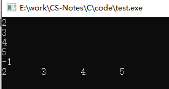

### 链表查找数据并删除

> 链表查找数据并删除

* Example 01：

```c
#include <stdio.h> 
#include <stdlib.h>

typedef struct _node{
	int value;
	struct _node *next;
	
}Node; 

typedef struct _list{
	Node *head;
	//Node *tail;
}List; 

void add(List *pList, int number);
void print(List *pList);

int main(){
	List list;
	list.head = NULL;
	int number;
	do{
		scanf("%d",&number);
		if(number != -1){
			add(&list,number);
		}
	} while(number != -1);
	print(&list); 
	
	//查找数据 
	scanf("%d",&number);
	Node *p;
	int isFound = 0;
	for(p=list.head;p;p=p->next){
		if(p->value == number){
			printf("找到了\n");
			isFound = 1;
			break;
		}
	}
	if(!isFound){
		printf("没有找到\n");
	}
	
	//删除某个数据 
	Node *q;
	for(q=NULL,p=list.head;p;q=p,p=p->next){
		if(p->value == number){
			if(q){
				q->next = p->next;
			}else{
				list.head = p->next;
			}
			
			free(p);
			break;
		}
	} 
	
	//删除所有数据
	for(p=list.head;p;p=q){
		q = p->next;
		free(p);
	} 
	
	return 0;
}

void add(List *pList, int number){
	//	add to linkList
	Node *p = (Node*)malloc(sizeof(Node));
	p->value = number;
	p->next = NULL;
	//	find the last
	Node *last = pList->head;
	if(last){
		while(last->next){
	    	last = last->next;
		}
		//	attach
		last->next = p;
	}else{
		pList->head = p;
	}
}

void print(List *pList){
	Node *p;
	//遍历输出 
	for(p=pList->head;p;p=p->next){
		printf("%d\t",p->value);
	}
	printf("\n");
}
```


# 代码训练

## 001 逆序的三位数

【题目】

程序每次读入一个正三位数，然后输出逆序的数字。

注意，当输入的数字含有结尾的 0 时，输出不应带有前导的 0 。比如输入 700 ，输出应该是 7 。

提示：用 %10 可以得到个位数，用 /100 可以得到百位数...。将这样得到的三个数字合起来：百位 * 100 + 十位 * 10 + 个位，就得到了结果。

【输入格式】

每个测试是一个3位的正整数。

【输出格式】

输出逆序的数。

【输入样例】

123

【输出样例】

321

【时间限制】

500ms内存限制：32000kb

【参考代码】

* C 版

```c
#include <stdio.h>
int main()
{
    int t1,t2,mt1,mt2,mt3;
    
    scanf("%d",&t1);	//输入
     
    mt1=t1/100; mt2=(t1-mt1*100)/10; mt3=t1%10;
    t2=mt3*100+mt2*10+mt1;
    
    printf("%d\n",t2);	//输出
     
    return 0;
}
```

## 002 数位数

* Example 01：先判断后执行
```c
int main()
{
	int x;
	int count = 0;
	
	printf("请输入一个任意数："); 
	scanf("%d",&x); 
	
	count++;
	x /= 10;
	while(x > 0)
	{
		count++;
		x /= 10;
	}
	
	printf("该数有 %d 位！\n",count);
    
    return 0;
}
```

* Example 02：先执行后判断
```c
#include <stdio.h>
//数位数 
int main()
{
	int x;
	int count = 0;
	
	printf("请输入一个任意数："); 
	scanf("%d",&x); 
	
	do
	{
		x /= 10;
		count++;
	}while(x>0);
	
	printf("该数有 %d 位！\n",count);
    
    return 0;
}
```

## 003 求阶乘n！

【题目】写一个程序，让用户输入n,然后计算输出n! 
【代码】

* `Example 01：`

``` c
#include <stdio.h>
//求阶乘n！ 
//题目：写一个程序，让用户输入n,然后计算输出n! 
int main()
{
	int n;
	int i=1;
	int fact = 1;//阶乘 
	
	printf("请输入一个任意数n："); 
	scanf("%d",&n); 
	
/*	while(i<=n)
	{
		fact *= i; 
		i++;
	}*/
	for(i=2;i<=n;i++)
	{
		fact *= i; 
	}
	
	printf("%d!= %d\n",n,fact);
    
    return 0;
}
```

* `Example 02:`

```c
#include <stdio.h>

int main()
{
	int n;
	int i=1;
	int fact = 1;//阶乘 
	
	printf("请输入一个任意数n："); 
	scanf("%d",&n); 
	
	for(i=n;i>1;i--)
	{
		fact *= i; 
	}
	
	printf("%d!= %d\n",n,fact);
    
    return 0;
}
```


## 004 猜数游戏

【题目】系统随机生成数字，猜数字

```c
#include <stdio.h>
#include <stdlib.h>
#include <time.h>

//主函数 
int main(){
	
	srand(time(0));
	int number = rand()%100 + 1;//[0,100]
	int count = 0;
	int a = 0;
	
	printf("我已经想好了一个1到100之间的数。");
	 
	do{
		printf("请猜这个1到100之间的数：");
		scanf("%d",&a);
		
		count++;
		if(a>number){
			printf("你猜的数大了\n"); 
		} else if(a<number){
			printf("你猜的数小了\n"); 
		}
	}while(a!=number);
	
	printf("太好了，你用了 %d 次就猜到了答案。\n",count);
	
	return 0;
}
```

## 005 整数逆序

* 跟 `001` 逻辑一样，但是这个地方用到了循环结构

```c
#include <stdio.h>

//主函数 
int main(){
	
	int x,digit;
	int result = 0;
	
	scanf("%d",&x);
	
	while(x>0){
		digit = x%10;
		result = result*10 + digit;
		x /= 10;
	}
	
	printf("%d",result);
	
	return 0;
}
```

## 006 判断素数

* `Example 01`

```c
#include <stdio.h>

//主函数 
int main(){
	
	int x;
	int i;
	
	scanf("%d",&x);
	
	for(i=2;i<x;i++){
		if(x%i == 0){
			break;
		}
	}
	
	if(i<x){
		printf("%d 不是素数",x);
	}else{
		printf("%d 是素数",x);
	}
	
	return 0;
}
```


* `Example 02` 

```c
#include <stdio.h>

//主函数 
int main(){
	
	int x;
	int i;
	int isPrime = 1;
	
	scanf("%d",&x);
	
	for(i=2;i<x;i++){
		if(x%i == 0){
			isPrime = 0;
            break;
		}
	}
	
	if(isPrime == 1){
		printf("%d 是素数",x);
	}else{
		printf("%d 不是素数",x);
	}
	
	return 0;
}
```


* Example 03：使用子函数调用的方式：去掉偶数，从3到x-1，每次加2

```c
int isPrime(int x){
    int result = 1;
    int i;
    if(x == 1 || (x%2 == 0 && x != 2)){
        result = 0;
    }
    for(i=3;i<x;i+=2){
        if(x%i == 0){
            result = 0;
            break;
        }
    }
    return result;
}
```


* Example 04：无须到x-1，到sqrt(x)就够了

```c
int isPrime(int x){
    int result = 1;
    int i;
    if(x == 1 || (x%2 == 0 && x != 2)){
        result = 0;
    }
    for(i=3;i<sqrt(x);i+=2){
        if(x%i == 0){
            result = 0;
            break;
        }
    }
    return result;
}
```

> 注：sqrt(x) 返回类型 double，引入 #include <math.h>


* Example 05：判断是否能被已知的且<x的素数整除

```c
#include <stdio.h>

int isPrime(int x,int knownPrimes[],int numberOfKnownPrimes);

int main(){
	
	const int number = 100;
	int prime[number];
	prime[0] = 2;
	int j;
	for(j=1;j<number;j++){
		prime[j] = 0;
	}
	int count = 1;
	int i = 3;
	while(count < number){
		if(isPrime(i,prime,count)){
			prime[count++] = i;
		}
		i++;
	} 
	for(i=0;i<number;i++){
		printf("%d",prime[i]);
		if((i+1)%5){
			printf("\t");
		}else{
			printf("\n");
		}
	}
	
	return 0;
}

int isPrime(int x,int knownPrimes[],int numberOfKnownPrimes){
	int result = 1;
	int i;
	for(i=0;i<numberOfKnownPrimes;i++){
		if(x%knownPrimes[i]==0){
			result = 0;
			break;
		}
	}
	return result; 
}
```


## 007 输出100以内的素数

```c
#include <stdio.h>

//主函数 
int main(){
	
	int x;
	
	for(x=2;x<100;x++){
		int i;
		int isPrime = 1;
		for(i=2;i<x;i++){
			if(x%i == 0){
				isPrime = 0;
				break;
			}
		}
	
		if(isPrime==1){
			printf("%d ",x);
		}
	}
	printf("\n");
		
	return 0;
}
```

## 008 凑硬币

【题目】如何用1角、2角和5角的硬币凑出10元以下的金额呢？

【代码】

```c
#include <stdio.h>

//主函数 
int main(){
	
	int x;
	int one,two,five;
	
	scanf("%d",&x);
	
	for(one=1;one<x*10;one++){
		for(two=1;two<x*10/2;two++){
			for(five=1;five<x*10/5;five++){
				if(one+two*2+five*5==x*10){
					printf("%d 个1角 + %d 个2角 + %d 个5角 = %d 元\n",one,two,five,x);
				}
			}
		}
	}
		
	return 0;
}
```


## 009 求平均数

* `Example 01：`

```c
#include <stdio.h>

int main(){
	
	int number;
	int sum = 0;
	int count = 0;
	do{
		scanf("%d",&number);
		
		if(number != -1){
			sum += number;
			count ++;
		}
	}while(number != -1);
	
	printf("%f\n",1.0*sum/count);	
	return 0;
}
```


* `Example 02:`

```c
#include <stdio.h>
 
int main(){
	
	int number;
	int sum = 0;
	int count = 0;
	
	scanf("%d",&number);
		
	while(number != -1){
		sum += number;
		count ++;
		scanf("%d",&number);
	}
	
	printf("%f\n",1.0*sum/count);	
	return 0;
}
```

## 010  水仙花数

【题目】计算所有N位水仙花数

【说明】水仙花数是指一个N位正整数（N>=3），它的每个位上的数字的N次幂之和等于它本身。

【输入格式】

输入在一行中给出一个正整数N（3<=N<=7）

【输出格式】

按递增顺序输出所有N位水仙花数，每个数字占一行

【代码】

* Example 01：

```c
#include <stdio.h>

int main()
{
	int n;
	int first = 1;
	int i = 1;	
	scanf("%d",&n);	
	while(i<n){
		first *= 10;
		i++;
	}
	//遍历100-999
	i = first;
	while(i<first*10){
		int t = i;
		int sum = 0;
		do{
			int d = t%10;
			t /= 10;
			int p = 1;
			int j = 0;
			//int p = d;
			//int j = 1;
			while(j<n){
				p *= d;
				j++;
			}
			sum += p;
		} while(t>0);
		if(sum == i){
			printf("%d\n",i);
		}
		i++;
	} 
    
    return 0;
}
```

## 011 打印九九乘法表

* Example 01：

```c
#include <stdio.h>

int main()
{
	int n;
	scanf("%d",&n); 
	int i,j;
	i=1;
	while(i<=n){
		j=1;
		while(j<=i){
			printf("%d*%d=%d",j,i,i*j);
			if(i*j<10){
				printf("   ");
			}else{
				printf("  ");
			}
			j++;
		}
		printf("\n");
		i++;
	}
    
    return 0;
}
```


## 012 统计素数并求和

【题目】要求统计给定整数M和N区间内素数的个数并对它们求和。

【代码】

* Example 01：

```c
#include <stdio.h>

int main()
{
	int m,n;
	int i;
	int count = 0;
	int sum = 0;
	
	scanf("%d %d",&m,&n); 
	
	if(m==1){
		m=2;
	}
	for(i=m;i<=n;i++){
		int isPrime = 1;
		int k;
		for(k=2;k<i-1;k++){
			if(i%k == 0){
				isPrime = 0;
				break;
			}
		}
		//判断i是否素数
		if(isPrime){
			count++;
			sum += i;
		}		
	}
	
	printf("%d %d\n",count,sum);
	
    return 0;
}
```

* Example 02：

```c
#include <stdio.h>

int isPrime(int i){
	int result = 1;
	int k;
	for(k=2;k<i-1;k++){
		if(i%k == 0){
			result = 0;
			break;
		}
	}
	return result;
}

int main(){
	int m,n;
	int i;
	int count = 0;
	int sum = 0;
	
	scanf("%d %d",&m,&n); 
	
	if(m==1){
		m=2;
	}
	for(i=m;i<=n;i++){
		
		//判断i是否素数
		if(isPrime(i)){
			count++;
			sum += i;
		}		
	}
	
	printf("%d %d\n",count,sum);
	
    return 0;
}
```


## 013 猜数游戏

【题目】

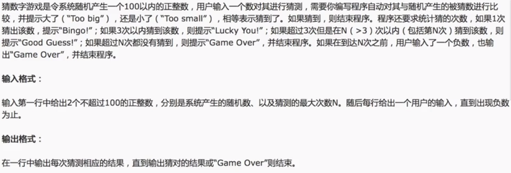

【代码】

* Example 01:

```c
#include <stdio.h>

int main()
{
	int number,n;
	int inp;
	int finished = 0;
	int cnt = 0;
	scanf("%d %d",&number,&n);
	do{
		scanf("%d",&inp);
		cnt++;
		if(inp<0){
			printf("Game Over\n");
			finished = 1;
		}else if(inp>number){
			printf("Too big\n");		
		}else if(inp<number){
			printf("Too small\n");
		}else{
			if(cnt==1){
				printf("Bingo!\n");
			} else if(cnt<=3){
				printf("Lucky You!\n");
			}else{
				printf("Good Guess!\n");
			}
			finished = 1;
		} 
		if(cnt==n){
			if(!finished){
				printf("Game Over\n");
				finished = 1;
			}
		}
	} while(!finished);
	
    return 0;
}
```


## 014 求序列前N项和

【题目】计算序列2/1+3/2+5/3+8/5+...的前N项之和。

【代码】

* Example 01:

```c
#include <stdio.h>

int main()
{
	int n;
	double dividend,divisor;
	double sum = 0.0;
	int i;
	double t;
	scanf("%d",&n);
	dividend = 2;
	divisor = 1;
	for(i=1;i<=n;i++){
		sum += dividend/divisor;
		t = dividend;
		dividend += divisor;
		divisor = t;
	} 
	printf("%.2f\n",sum);
	
    return 0;
}
```

## 015 约分最简分式

【代码】

* Example 01：

```c
#include <stdio.h>

int main()
{
	int dividend,divisor;
	scanf("%d/%d",&dividend,&divisor);
	int a = dividend;
	int b = divisor;
	int t;
	while(b>0){
		t = a%b;
		a = b;
		b = t;
	}
	printf("%d/%d\n",dividend/a,divisor/a);
	
    return 0;
}
```

## 016 念数字

【题目】输入一个整数，输出每个数字对应的拼音

【代码】

* Example 01：

```c
#include <stdio.h>

int main()
{
	int x;
	scanf("%d",&x);
	if(x<0){
		printf("fu ");
		x = -x;
	}
	int mask = 1;
	int t = x;
	while(t>9){
		t /= 10;
		mask *= 10;
	}
	do{
		int d = x / mask;
		switch(d){
			case 0: printf("ling");break;
			case 1: printf("yi");break;
			case 2: printf("er");break;
			case 3: printf("san");break;
			case 4: printf("si");break;
			case 5: printf("wu");break;
			case 6: printf("liu");break;
			case 7: printf("qi");break;
			case 8: printf("ba");break;
			case 9: printf("jiu");break;
		}
		if(mask>9){
			printf(" ");
		}
		x %= mask;
		mask /= 10;
	}while(mask>0);
	printf("\n"); 
	
    return 0;
}
```

## 017 求a的连续和

【题目】S = a + aa + aaa + ... +aaa...a（n个a）

例如：S = 2 + 22 + 222 （3个2）

【代码】

* Example 01：

```c
#include <stdio.h>

int main()
{
	int a,n;
	scanf("%d %d",&a,&n);
	int sum = 0;
	int i;
	int t = 0;
	for(i=0;i<n;i++){
		t = t*10 + a;
		sum += t;
	} 
	printf("%d\n",sum);
	
    return 0;
}
```


## 018 输出平均数和大于平均数的数

【代码】

* Example 01：

```c
#include <stdio.h>
 
int main(){
	
	int x;
	double sum = 0;
	int count = 0;
	int number[100];	
	scanf("%d",&x);		
	while(x != -1){
		number[count] = x;
		sum += x;
		count ++;
		scanf("%d",&x);
	}
	if(count>0){
		printf("%f\n",sum/count);
		int i;
		for(i=0;i<count;i++){
			if(number[i]>sum/count){
				printf("%d\n",number[i]);
			}
		}
	}
	
	return 0;
}
```

> 注：数据超过100时咋办？

* Plan A：采用动态的下标

* Plan B：进行说明，if 判断


  ## 019 统计个数

【题目】写一个程序，输入数量不确定的[0,9]范围内的整数，统计每一种数字出现的次数，输入-1表示结束

【代码】

* Example 01：

```c
#include <stdio.h>
 
int main(){
	
	int x;
	int count[10];
	int i;
	for(i=0;i<10;i++){
		count[i]=0;
	}
	scanf("%d",&x);
	while(x!=-1){
		if(x>=0&&x<=9){
			count[x]++;
		}
		scanf("%d",&x);
	}
	for(i=0;i<10;i++){
		printf("%d:%d\n",i,count[i]);
	}
	
	return 0;
}
```

* Example 02：

```c
#include <stdio.h>
 
int main(){
	
	const int number = 10;
	int x;
	int count[number];
	int i;
	for(i=0;i<number;i++){
		count[i]=0;
	}
	scanf("%d",&x);
	while(x!=-1){
		if(x>=0&&x<=9){
			count[x]++;
		}
		scanf("%d",&x);
	}
	for(i=0;i<number;i++){
		printf("%d:%d\n",i,count[i]);
	}
	
	return 0;
}
```

## 020 搜索数字

【题目】查找数字是否在数组中，找到返回在数组中的位置，找不到返回-1

 【代码】

* Example 01：使用数组

```c
#include <stdio.h>

int search(int key,int a[],int length);//声明 

int main(){
	
	int a[] = {2,4,6,7,1,3,};
	int x;
	int loc;
	printf("请输入一个数字：");
	scanf("%d",&x);
	loc = search(x,a,sizeof(a)/sizeof(a[0]));
	if(loc != -1){
		printf("%d在第%d个位置上\n",x,loc);
	} else{
		printf("%d不存在\n",x);
	}
	
	return 0;
}

int search(int key,int a[],int length){
	int result = -1;
	int i;
	for(i=0;i<length;i++){
		if(a[i] == key){
			result = i;
			break;
		}
	}
	return result;
} 
```

## 021 素数表

【代码】

* Example 01：

```c
#include <stdio.h>

int main(){
	
	const int maxNumber = 100;
	int isPrime[maxNumber];
	int i;
	int x;
	for(i=0;i<maxNumber;i++){
		isPrime[i] = 1;
	}
	for(x=2;x<maxNumber;x++){
		if(isPrime[x]){
			for(i=2;i*x<maxNumber;i++){
				isPrime[i*x] = 0;
			}
		}
	}
	for(i=2;i<maxNumber;i++){
		if(isPrime[i]){
			printf("%d\t",i);
		}
	}
	printf("\n");
	
	return 0;
}
```

## 022 tic-tac-toe游戏

【题目】

* 读入3×3的矩阵，矩阵中的数字为1表示该位置上有一个X，为0表示一个为O

* 程序判断这个矩阵中是否有获胜的一方，输出表示获胜一方的字符X或O，或输出无人获胜

【代码】

* Example 01：

```c
#include <stdio.h>

int main(){
	
	const int size = 3;
	int board[size][size];
	int i,j;
	int numOfX;
	int numOfO;
	int result = -1;//-1：没人赢 1：X赢 0：O赢 
	
	//读入矩阵 
	for(i=0;i<size;i++){
		for(j=0;j<size;j++){
			scanf("%d",&board[i][j]);
		}
	} 
	//检查行
	for(i=0;i<size && result == -1;i++){
		numOfO = numOfX = 0;
		for(j=0;j<size;j++){
			if(board[i][j] == 1){
				numOfX ++;
			}else{
				numOfO ++;
			}
		}
		if(numOfO == size){
			result = 0;
		}else if(numOfX == size){
			result = 1;
		}
	} 
	//检查列 
	if(result == -1){
		for(j=0;j<size && result == -1;j++){
			numOfO = numOfX = 0;
			for(i=0;i<size;i++){
				if(board[i][j] == 1){
					numOfX ++;
				}else{
					numOfO ++;
				}
			}
			if(numOfO == size){
				result = 0;
			}else if(numOfX == size){
				result = 1;
			}
		}
	}
	//检查对角线
    numOfO = numOfX = 0;
    for(i=0;i<size;i++){
		if(board[i][i] == 1){
			numOfX ++;
		}else{
			numOfO ++;
		}
	}
	if(numOfO == size){
		result = 0;
	}else if(numOfX == size){
		result = 1;
	}
	numOfO = numOfX = 0;
	for(i=0;i<size;i++){
		if(board[i][size-i-1] == 1){
			numOfX ++;
		}else{
			numOfO ++;
		}
	}
	 
	return 0;
}
```


---

更新笔记地址：[EnjoyToShare-C-Notes](https://wugenqiang.github.io/CS-Notes/#/C/C-Notes)

查阅更多笔记：[EnjoyToShare-CS-Notes](https://wugenqiang.github.io/CS-Notes/#/)

---

