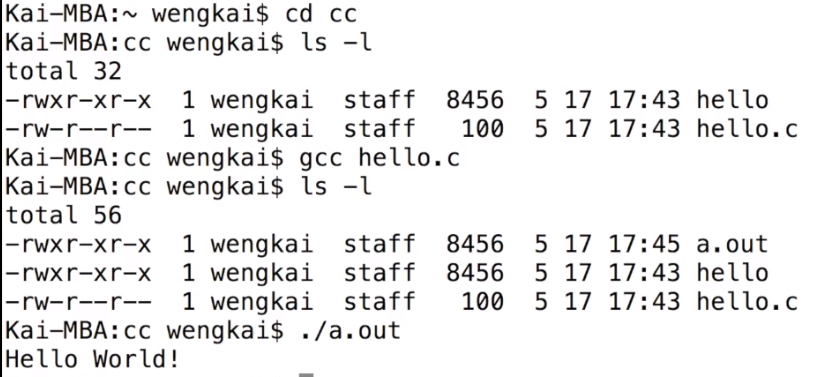
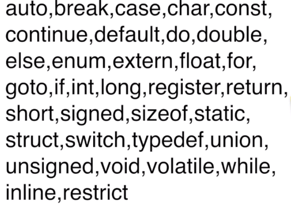
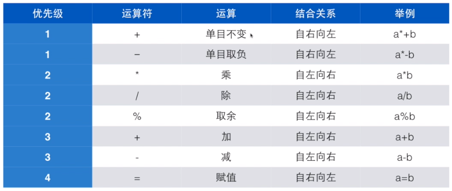

# C 程序设计

##  1.C语言用在哪里？

* 操作系统
* 嵌入式系统
* 驱动程序
* 底层驱动
* 图形引擎、图像处理、声音效果

> C需要被编译才能运行

* 编辑器
* 编译器
* 或者IDE（集成开发环境）


## 2.推荐的编程软件

* [Dev-C++](https://sourceforge.net/projects/orwelldevcpp/?source=directory)


## 3.程序框架

```C
#include <stdio.h>

int main()
{
    return 0;
}
```


## 4.命令行编辑、编译、运行程序




## 5.基本语法

### 变量

* 变量：存储数据的地方
* <类型名称><变量名称>
* eg.  int price;
* 变量叫标识符；


### 保留字





### 赋值和初始化

* 变量初始化
* <类型名称><变量名称> = <初始值>；
* eg.	int price = 0;


### 读整数

```c
scanf("%d",&price);
```

举例：plus.c

```c
#include "stdio.h" 

int main()
{
	int a = 0;
	int b = 0;
	
	printf("请输入两个整数："); 
	scanf("%d %d",&a,&b);
	printf("%d + %d = %d\n",a,b,a + b);
	
	return 0; 
}
 
```


### 常量

* 使用 `const` 定义常量，常量用大写字母表示

```c
const int AMOUNT = 100;
```

### 运算符和算子


```c
eg.
    int a = b + 5;
```

* 计算时间差

```c
#include "stdio.h" 
/*计算时间差*/ 
int main()
{
	int hour1, minute1;
	int hour2, minute2;
	
	scanf("%d %d", &hour1, &minute1);
	scanf("%d %d", &hour2, &minute2);
	
	int t1 = hour1 * 60 + minute1;
	int t2 = hour2 * 60 + minute2;
	
	int t = t2 - t1;
	
	printf("时间差是 %d 小时 %d 分钟。",t/60, t%60); 
	
	return 0; 
}
```

### 运算符优先级




