# Java 入门基础编程笔记

> [Java 入门基础编程视频](https://www.bilibili.com/video/BV1zE41197bw)
>
> 课件地址：[点击我啦哟](https://pan.baidu.com/s/12onOc3Q8ZD0tyO39YQ5_rQ) 提取码：50ME

## 1 前言

### 1.1 软件开发介绍

* 软件，即一系列按照特定顺序组织的计算机数据和指令的集合，分为：
  * 系统软件
  * 应用软件
* 人机交互方式分为：
  * 图形化界面（Graphical User Interface GUI）
  * 命令行方式（Command Line Interface CLI）

### 1.2 常用的 DOS 命令

* dir 列出当前目录下的文件以及文件夹
* md 创建目录
* rd 删除目录
* cd 进入指定目录
* cd.. 退回到上一级目录
* cd /退回到根目录
* del 删除文件
* exit 退出 dos 命令行

### 1.3 编程语言介绍

* 第一代语言
  * 机器语言，指令以二进制代码形式存在
* 第二代语言
  * 汇编语言，使用助记符表示一条机器指令

* 第三代语言：高级语言
  * C，Pascal，Fortran 面向过程的语言
  * C++ 面向过程/面向对象
  * Java 跨平台的纯面向对象的语言
  * .NET 跨语言的平台
  * Python，Scala，JS...

### 1.4 选择 Java 语言


* Java 面向对象，开发效率高
* Java 从业人多，框架丰富，优秀
* Java 市场需求好 【查看编程语言使用排名：[TIOBE](https://www.tiobe.com/tiobe-index//)】


## 2 Java 语言概述

* 是 SUN（Stanford University Network，斯坦福大学网络公司）1995 年退出的高级编程语言
* Java 成为 Web 应用程序的首选开发语言
* 后台开发：Java、PHP、Python、Go、Node.js

### 2.1 Java 技术体系平台

* Java SE（Java Standard Edition）标准版，以前称为 J2SE，支持面向桌面级应用，提供了完整的 Java 核心 API
* Java EE（Java Enterprise Edition）企业版，以前称为 J2EE，包含 Servlet、Jsp 等
* Java ME（Java Micro Edition）小型版，以前称为 J2ME，支持移动终端
* Java Card，支持 Java 小程序（Applets）运行在小内存设备（如智能卡）上的平台

### 2.2 Java 在各领域的应用

* 企业级应用：Java 后台开发
* Android 平台应用：客户端开发
* 大数据平台开发：提供 API 接口编程
* 移动领域应用：用于消费和嵌入式领域

### 2.3 Java 语言的特点

* 特点一：面向对象
  * 两个基本概念：类和对象
  * 三大特性：封装、集成和多态
* 特点二：健壮性
  * 去除指针、内存的申请与释放
  * 提供了一个相对安全的内存管理和访问机制
* 特点三：跨平台性
  * Write Once，Run Anywhere.
  * 原理：只要在需要运行 Java 应用程序的操作系统上，先安装一个 Java 虚拟机（Java Virtual Machine JVM）即可，由 JVM 来负责 Java 程序在该系统中的运行

### 2.4 Java 语言运行机制

* Java 虚拟机（Java Virtal Machine）
* 垃圾收集机制（Garbage Collection）

### 2.5 Java 基础知识图解

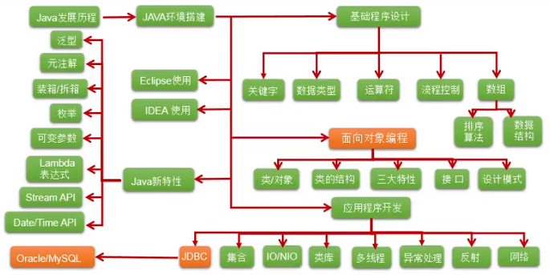


### 2.6 第一个程序：HelloWorld

```java
public class HelloWorld {  
    public static void main(String[] args){
        System.out.println("HelloWorld\n");
    }
}
```

## 3 Java 基本语法

### 3.1 关键字和保留字

* 关键字（Keyword）
  * 用做专门用途的字符串
  * 特点：关键字中所有字母都为小写


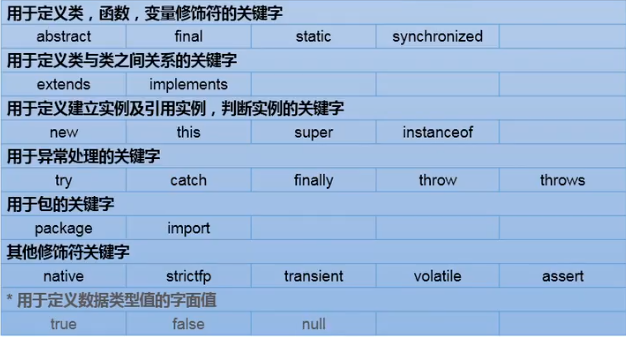

* 保留字（reserved word）
  * 现有 Java 版本尚未使用，但以后版本可能作为关键字使用，自己命名标识符时要避免使用这些保留字。
  * goto，const

### 3.2 标识符

* 标识符（identifier）
  * Java 对各种变量、方法和类等要素命名时使用的字符序列称为标识符。
* 定义合法标识符规则：

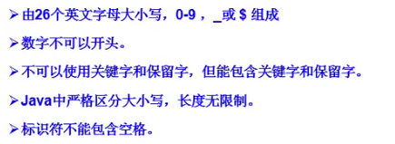

* 名称命名规范：

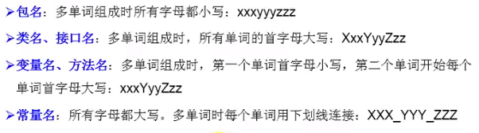

!> Java 采用 unicode 字符集，因此标识符也可以使用汉字声明，但是不建议使用。

### 3.3 变量

> 作用：用于在内存中保存数据
>
> Java 定义变量的格式：数据类型 变量名 = 变量值；

eg.

```java
public static void main(String[] args){
	//变量的定义
	int myAge = 12;
	//变量的使用
	System.out.println(myAge);
    //变量的声明
    int myNumber;
    //变量的赋值:初始化
    myNumber = 1001;
    System.out.println(myNumber);
}
```

!> 注：

* 变量必须先声明，后使用
* 变量都定义在其作用域内，只有在作用域内是有效的
* 同一作用域，不能声明两个同名的变量

#### 3.3.1数据类型

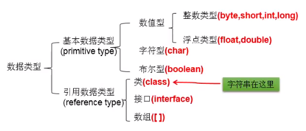

* 整数类型：

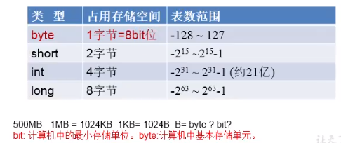

注：声明 long 型变量时，以“l” 或 “L” 结尾，开发中定义整型变量时，常使用 int

* 浮点型：

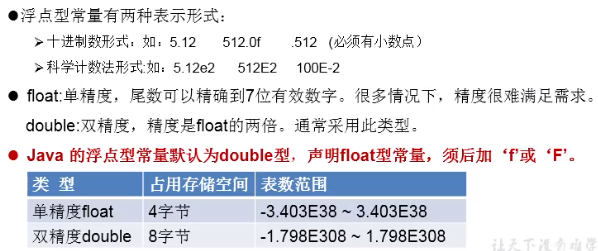

* 字符型：char 占 1 字符 = 2 字节
  * 定义 char 型变量，通常使用一对单引号，内部只能写一个字符
  * 表示方式：
    * （1）声明一个字符
    * （2）转义字符
    * （3）使用 Unicode 值来表示字符型常量

```java
public class HelloWorld {
    public static void main(String[] args){
        //System.out.println("HelloWorld\n");
        char c = '\n';//换行符
        c = '\t';//制表符
        System.out.print("Hello"+c);
        System.out.println("World");
        
        char c2 = '\u0043';//字符集 C
        System.out.println(c2);
    }
}
```

* 布尔型：boolean
  * 只能取两个值之一：true，false
  * 常常在条件判断、循环结构中使用

```java
boolean b = true;
System.out.print(b);

boolean isMarried = true;
if(isMarried){
    System.out.println("balabala...");
}else{
    System.out.println("Sadness");
}
```


#### 3.3.2 基本数据类型变量间转换

> 基本数据类型之间的运算规则：

（1）自动类型提升：

当容量小的数据类型的变量与容量大的数据类型的变量做运算时，结果自动提升为容量大的数据类型。

当 byte、char、short 三种类型的变量做运算时，结果为 int 型

```java
byte、char、short --> int --> long --> float --> double
```

容量大小指的是数的范围的大小，注意，float 比 long 的范围大

（2）强制类型转换：是自动类型提升运算的逆运算

* 需要使用强转符：()

```java
double d = 12.7;
int c = (int)d;//截断操作
```

* 强制类型转换，可能导致精度损失

```java
int a = 128;
byte b = (byte)a;
System.out.println(b);//-128
```


####  3.3.3 基本数据类型与 String 间转换

> String 不是基本数据类型，属于引用数据类型

* String 使用方式：String str = “abdce”;
* 一个字符串考可以串接另一个字符串，也可以直接串接其他类型的数据，因为 String 可以和 8 种基本数据类型变量做运算
* 运算的结果仍然是 String 类型

```java
String str= "abdce";
str = str + "xyz";//连接运算
int n = 100;
str = str + n;
```

* 字符串转 int 型

```java
String str = 123 + "";
int num = Integer.parseInt(str);
System.out.println(num);
```

#### 3.3.4 进制与进制间的转换

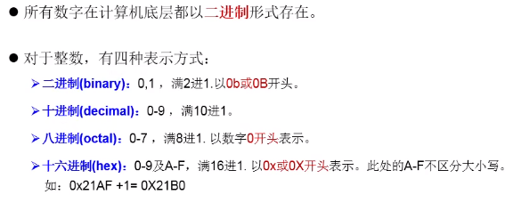

> 反码与补码举例：

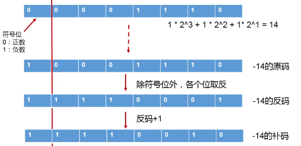

?> 注：计算机底层都以补码的方式来存储数据！

### 3.4 运算符

> 运算符是一种特殊的符号，用以表示数据的运算、赋值和比较。

* 算术运算符
* 赋值运算符
* 比较运算符（关系运算符）
* 逻辑运算符
* 位运算符
* 三元运算符

#### 3.4.1 算术运算符

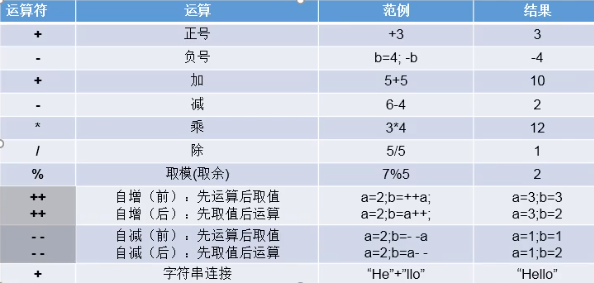

##### 例题：打印三位数逆序显示

```java
public void printNumber(int num){
	int res;
    int tmp = num;
    while(tmp > 0){
        System.out.print(tmp % 10);
        tmp /= 10;
    }
}
```

#### 3.4.2 赋值运算符

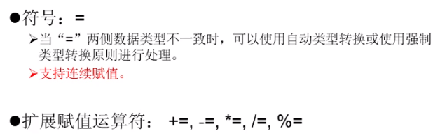

#### 3.4.3 比较运算符

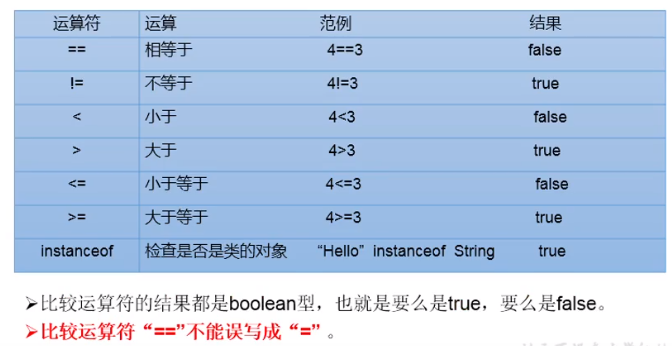

#### 3.4.4 逻辑运算符

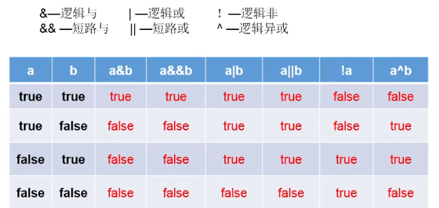

#### 3.4.5 位运算符

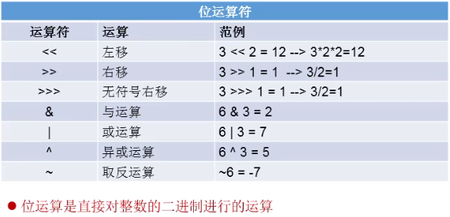

注明：最高效率计算 2 * 8

采用 2 << 3 或者 8 << 1

#### 3.4.6 三元运算符


##### 例题：获取最大者

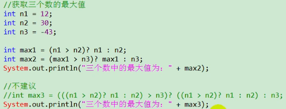

##### 例题：典型代码

（1）获取另两个整数的较大值

（2）获取三个数的最大值


### 3.5 程序流程控制

#### 3.5.1 顺序结构

> 程序从上到下执行


#### 3.5.2 分支结构

>  分为 if - else if - else 和 swith - case

##### 3.5.2.1 if - else 结构


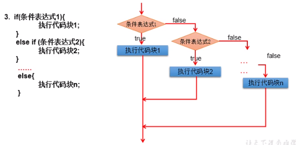


###### 测试：if - else 测试

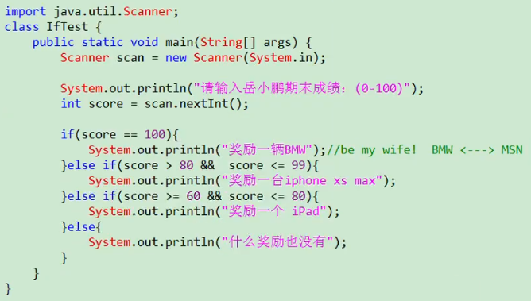


##### 3.5.2.2 switch - case 结构

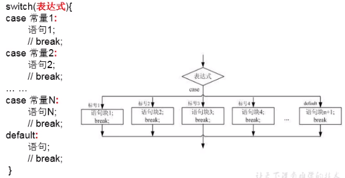

###### 测试：switch - case 测试

```java
public class SwitchCaseTest {
    public static void main(String[] args){
        int number = 2;
        switch(number){
            case 0:
                System.out.println("zero");
                break;
            case 1:
                System.out.println("one");
                break;
            case 2:
                System.out.println("two");
                break;
            default:
                System.out.println("other");
        }
    }
}
```

!> 说明：

* 根据 switch 表达式中的值，依次匹配各个 case 中的常量
* 一旦匹配成功，则进入 case 结构中执行相应语句，直至遇到 break 结束，跳出 switch - case 结构
* switch 结构中的表达式，只能是如下的 6 种数据类型之一：byte, short, char, int, 枚举类型（JDK 5.0 新增）, String 类型（JDK 7.0 新增）
* case 之后只能声明常量。不能声明范围
* break 在 switch - case 中是可选的

##### 3.5.2.3 总结归纳

* 凡是可以使用 switch - case 的结构，都可以转换为 if - case。反之，不成立。
* 我们写分支结构时，当发现即可以使用 switch - case，（同时，switch 中表达式的取值情况不太多），又可以使用 if - case 时，我们优先选择使用 switch - case。
* switch - case 执行效率稍微高一点。

#### 3.5.3 循环结构

> for、while 和 do - while 循环

定义：在某些条件满足的情况下，反复执行特定代码的功能。


##### 3.5.3.1 for 循环

**输出 5 遍 Hello,Java **

```java
for (int i = 0; i < 5; i++) { 
    System.out.println("Hello,Java");
}
```

**遍历 100 以内的偶数**

```java
for (int i = 1; i <= 100; i++) {
    if (i % 2 == 0) {
        System.out.println(i);
    }
}
```

**记录 100 以内所有偶数的和**

```java
int sum = 0;
for (int i = 1; i <= 100; i++) {
    if (i % 2 == 0) {
        System.out.println(i);
        sum += i;
    }
}
System.out.println(sum);
```

> 注：

* 循环条件是 boolean 类型
* 通常情况下，循环结束都是因为循环条件不满足返回 false

##### 3.5.3.2 while 循环

**遍历 100 以内的偶数**

```java
public class WhileTest {
    public static void main(String[] args){
        //遍历100以内的所有偶数
        int i = 1;
        while (i <= 100) {
            if (i % 2 == 0) {
                System.out.println(i);
            }
            i++;
        }
    }
}
```

> 注：

* 写 while 循环，不能丢了迭代条件
* 写程序，要避免出现死循环
* for 循环和 while 循环是可以相互转换的


##### 3.5.3.3 do - while 循环

**遍历 100 以内的偶数**

```java
public class DoWhileTest {
    public static void main(String[] args){
        //遍历100以内的所有偶数
        int i = 1;
        do {
            if (i % 2 == 0) {
                System.out.println(i);
            }
            i++;
        } while (i <= 100);
    }
}
```

> 注：

* do - while 循环至少会执行一次循环体

##### 3.5.3.4 嵌套循环

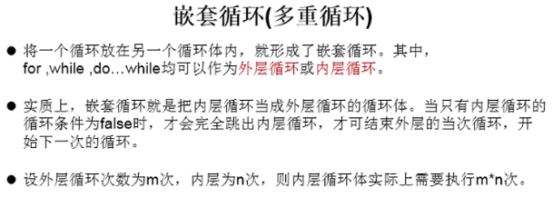

> 注意点：

* 嵌套循环：将一个循环结构 A 声明在另一个循环结构 B 的循环体中，就构成了嵌套循环
* 外层循环
* 内层循环
* 内层循环结构遍历一遍，只相当于外层循环的循环体执行了一次
* 技巧：
  * 外层循环控制行数，内层循环控制列数

举例 01：

```java
for (int j = 1; j <= 4; j++) {
 	for (int i = 1; i <= 6; i++) {
        System.out.println(i * j);
    }   
}
```

举例 02：

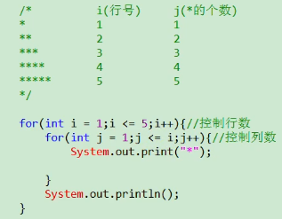

举例 03：

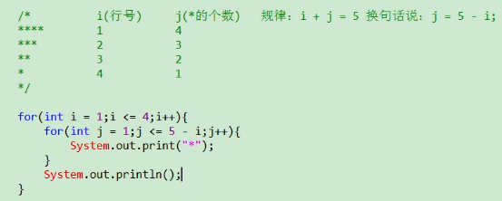

#### 3.5.4 特殊关键字的使用

##### 3.5.4.1 break

使用范围： switch - case 和循环结构中

循环中使用的作用：结束当前循环

##### 3.5.4.2 continue

使用范围： 循环结构中

循环中使用的作用：结束当次循环

> break 和 continue 的相同点：

* 关键字后面不能有执行语句

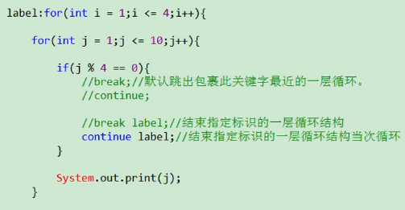

## 4 数组

### 4.1 数组的概述

数组（Array）的常见概念：

* 数组名
* 下标（或索引）
* 元素
* 数组的长度

数组的特点：

* 数组是有序排列的
* 数组属于引用数据类型的变量，数组的元素，即可以是基本数据类型，也可以是引用数据类型
* 创建数组对象一旦确定，就不能修改

数组的分类：

* 按照维数：一维数组、二维数组...
* 按照数组元素类型：基本数据类型元素的数组、引用数据类型元素的数组

### 4.2 一维数组

> 使用时考虑的问题：

（1）一维数组的声明和初始化

```java
//1.一维数组的声明和初始化
int num;//声明
num = 10;//初始化
int id = 1001;//声明 + 初始化

int[] ids;//声明
//静态初始化：数组的初始化和数组元素的赋值操作同时进行
ids = new int[]{1001,1002,1003,1004};
//动态初始化：数组的初始化和数组元素的赋值操作分开进行
String[] names = new String[5];
```

注意：这样写也可以，类型推断

```java
int[] arr4 = {1,2,3,4,5};//类型推断
```


（2）如何调用数组的指定位置的元素：通过角标的方式调用

```java
//2.如何调用数组的指定位置的元素：通过角标的方式调用
//数组的角标（或索引）从0开始的，到数组的长度-1结束
names[0] = "吴跟强";
names[1] = "吴奇隆";
names[2] = "吴尊";
names[3] = "胡歌";
names[4] = "孙杨";
```


（3）如何获取数组的长度

```java
//3.如何获取数组的长度
//属性：length
System.out.println(names.length);//5
System.out.println(ids.length);//4
```


（4）如何遍历数组

```java
//4.如何遍历数组
for (int i = 0; i < names.length; i++) {
	System.out.println(names[i]);
}
```


（5）数组元素的默认初始化值

* 数组元素是整型：0
* 数组元素是浮点型：0.0
* 数组元素是 char 型：0 或 ‘\u0000’，而非 ‘0’
* 数组元素是 boolean 型：false
* 数组元素是引用数据类型：null

```java
//5.数组元素的默认初始化值
int arr[] = new int[4];
for (int i = 0; i < arr.length; i++) {
	System.out.println(arr[i]);//0
}
```


（6）数组的内存解析

栈（stack）：局部变量

堆（heap）：new 出来的结构：对象、数组

方法区

常量池

静态域

> 内存的简化结构

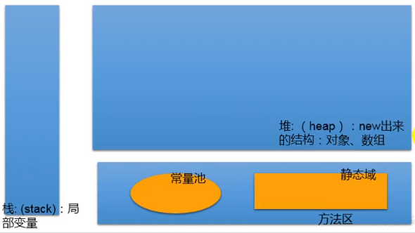

> 举例：一维数组的内存解析

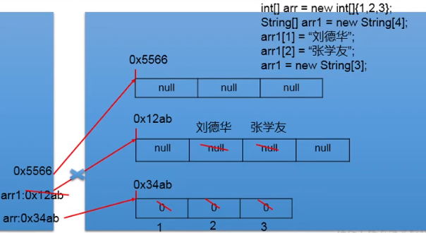

> 总结：数组一旦初始化完成，其长度就确定了。

### 4.3 二维数组

> 使用时考虑的问题：

（1）二维数组的声明和初始化

```java
//1.二维数组的声明和初始化
//静态初始化
int[][] arr1 = new int[][]{{1,2,3},{4,5},{6,7,8}};
//动态初始化1
String[][] arr2 = new String[3][2];
//动态初始化2
String[][] arr3 = new String[3][];
//也是正确的写法
int[] arr4[] = new int[][]{{1,2,3},{4,5,6,10},{4,6}};
```


（2）如何调用数组的指定位置的元素：通过角标的方式调用

```java
//2.如何调用数组的指定位置的元素：通过角标的方式调用
//数组的角标（或索引）从0开始的，到数组的长度-1结束
System.out.println(arr1[0][1]);//0
arr3[1] = new String[4];
System.out.println(arr3[1][0]);//null
```


（3）如何获取数组的长度

```java
//3.如何获取数组的长度
//属性：length
System.out.println(arr3.length);//3
System.out.println(arr3[1].length);//4
```


（4）如何遍历数组

```java
//4.如何遍历二维数组
for (int i = 0; i < arr4.length; i++) {
	for (int j = 0; j < arr4[i].length; j++) {
		System.out.print(arr4[i][j] + " ");
	}
	System.out.println();
}
```


（5）数组元素的默认初始化值

* 针对于初始化方式一：比如：int [ ] [ ] arr = new int [4] [3];
  * 外层元素的初始化值为：地址值
  * 内层元素的初始化值为：与一维数组初始化情况相同
* 针对于初始化方式二：比如：int [ ] [ ] arr = new int [4] [ ];
  * 外层元素的初始化值为：null
  * 内层元素的初始化值为：不能调用，否则报错

```java
//5.数组元素的默认初始化值
System.out.println(arr4[0]);//[I@7530d0a 地址值
System.out.println(arr4[0][0]);//1
System.out.println(arr4);//[[I@27bc2616
```


（6）数组的内存解析

栈（stack）：局部变量

堆（heap）：new 出来的结构：对象、数组

方法区

常量池

静态域

> 举例一：二维数组的内存解析

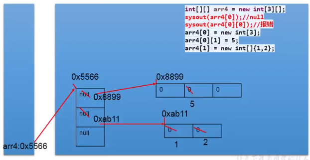

> 举例二：二维数组的内存解析

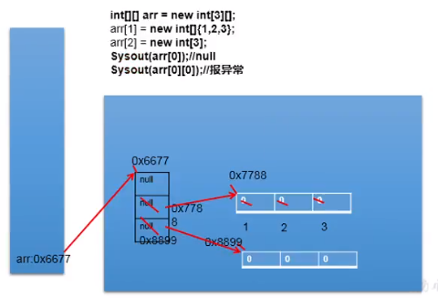

> 举例三：二维数组的内存解析

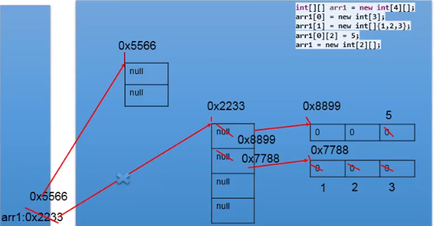

### 4.4 数组的常见算法

* 数组元素的赋值（杨辉三角、回形数等）
* 求数值型数组中元素的最大值、最小值、平均数、总和等
* 数组的赋值、复制、反转、查找（线性查找、二分法查找）
* 数组元素的排序算法

#### 4.4.1 数组元素的赋值

**杨辉三角**

```java
a[i][j] = a[i-1][j-1] + a[i-1][j];
```

#### 4.4.2 考查最大值、最小值、和值问题

【题目】

定义一个 int 型的一维数组，包含 10 个随机数（两位数），然后求出所有元素的最大值、最小值、和值。

【代码实现】

```java
package com.wugenqiang.array;

/**
 * @version v1.0
 * @ProjectName: Java-Basic
 * @ClassName: ArrayList
 * @Description: 考查数值型数组中元素的最大值、最小值、平均数、总和等
 * @Author: wugenqiang
 * @Date: 2020/4/10 10:19
 */
public class ArrayList {
    public static void main(String[] args) {
        int arr[] = new int[10];
        for (int i = 0; i < arr.length; i++) {
            arr[i] = (int)(Math.random() * (99 - 10 + 1) + 10);
            System.out.print(arr[i] + " ");
        }
        System.out.println();
        //求数组元素的最大值
        int maxValue = arr[0];
        for (int i = 1; i < arr.length; i++) {
            if (maxValue < arr[i]) {
                maxValue = arr[i];
            }
        }
        System.out.println("最大值为：" + maxValue);
        //求数组元素的最小值
        int minValue = arr[0];
        for (int i = 1; i < arr.length; i++) {
            if (minValue > arr[i]) {
                minValue = arr[i];
            }
        }
        System.out.println("最小值为：" + minValue);

        //求数组元素的总和
        int sum = 0;
        for (int i = 0; i < arr.length; i++) {
            sum += arr[i];
        }
        System.out.println("总和为：" + sum);
        //求数组元素的平均数
        double avgValue = (double)sum / arr.length;
        System.out.println("平均数为：" + avgValue);

    }
}
```

#### 4.4.3 数组的赋值

```java
package com.wugenqiang.array;

/**
 * @version v1.0
 * @ProjectName: Java-Basic
 * @ClassName: ArrayExec2
 * @Description: 数组的赋值
 * @Author: wugenqiang
 * @Date: 2020/4/10 10:19
 */
public class ArrayExec2 {
    public static void main(String[] args) {
        int[] array1, array2;
        array1 = new int[]{2,3,5,7,11,13,17,19};

        //显示array1的内容
        for (int i = 0; i < array1.length; i++) {
            System.out.print(array1[i] + " ");
        }
        System.out.println();

        //赋值array2变量等于array1
        array2 = array1;

        for (int i = 0; i < array2.length; i++) {
            System.out.print(array2[i] + " ");
        }
    }
}
```


#### 4.4.4 数组的复制

```java
package com.wugenqiang.array;

/**
 * @version v1.0
 * @ProjectName: Java-Basic
 * @ClassName: ArrayExec3
 * @Description: 数组的复制
 * @Author: wugenqiang
 * @Date: 2020/4/10 10:19
 */
public class ArrayExec3 {
    public static void main(String[] args) {
        int[] array1, array2;
        array1 = new int[]{2,3,5,7,11,13,17,19};

        //显示array1的内容
        for (int i = 0; i < array1.length; i++) {
            System.out.print(array1[i] + " ");
        }
        System.out.println();

        //数组的复制
        array2 = new int[array1.length];
        for (int i = 0; i < array2.length; i++) {
            array2[i] = array1[i];
        }

        for (int i = 0; i < array2.length; i++) {
            System.out.print(array2[i] + " ");
        }
    }
}
```

#### 4.4.5 数组的反转

```java
package com.wugenqiang.array;

/**
 * @version v1.0
 * @ProjectName: Java-Basic
 * @ClassName: ArrayExec4
 * @Description: 数组的反转
 * @Author: wugenqiang
 * @Date: 2020/4/10 10:56
 */
public class ArrayExec4 {

    public static void main(String[] args) {
        String[] arr = new String[]{"JJ","DD","MM"};

        //数组的反转
        for (int i = 0; i < arr.length / 2; i++) {
            String temp = arr[i];
            arr[i] = arr[arr.length - 1 - i];
            arr[arr.length - i - 1] = temp;
        }

        //遍历
        for (int i = 0; i < arr.length; i++) {
            System.out.print(arr[i] + " ");
        }
    }
}
```

#### 4.4.6 数组的查找

##### 4.4.6.1 线性查找

【实现思路】

通过遍历的方式，一个一个的数据进行比较、查找。

【适用性】

具有普遍适用性。

【代码实现】

```java
package com.wugenqiang.array;

/**
 * @version v1.0
 * @ProjectName: Java-Basic
 * @ClassName: ArrayExec5
 * @Description: 数组的线性查找
 * @Author: wugenqiang
 * @Date: 2020/4/10 10:56
 */
public class ArrayExec5 {

    public static void main(String[] args) {
        String[] arr = new String[]{"JJ","DD","MM"};
        
        //查找（或搜索）
        //线性查找：
        String dest = "DD";
        boolean isFlag = true;
        //遍历
        for (int i = 0; i < arr.length; i++) {
            if (dest.equals(arr[i])) {//内容相等
                System.out.println("找到指定的元素，位置为：" + i);
                isFlag = false;
                break;
            }
        }
        if (isFlag) {
            System.out.println("很遗憾，没有找到哦！");
        }
    }
}
```


##### 4.4.6.2 二分法查找

【实现思路】

每次比较中间值，折半的方式检索。

【适用性】

前提：所要查找的数组必须有序

【代码实现】

```java
package com.wugenqiang.array;

/**
 * @version v1.0
 * @ProjectName: Java-Basic
 * @ClassName: ArrayExec6
 * @Description: 数组的二分查找
 * @Author: wugenqiang
 * @Date: 2020/4/10 10:56
 */
public class ArrayExec6 {

    public static void main(String[] args) {
        //二分法查找：
        //前提：所要查找的数组必须有序
        int[] arr = new int[]{-98,-34,2,34,54,66,78,98,100};
        int dest = -34;
        int head = 0;//初始的首索引
        int end = arr.length - 1;//初始的末索引
        boolean isFlag = true;
        while (head <= end) {
            int middle = (head + end) / 2;
            if (dest == arr[middle]) {
                System.out.println("找到了，位置为：" + middle);
                isFlag = false;
                break;
            } else if (arr[middle] > dest) {
                end = middle - 1;
            } else {
                head = middle + 1;
            }
        }
        if (isFlag) {
            System.out.println("很遗憾，没有找到！");
        }
    }
}
```


#### 4.4.7 排序算法

> 理解：

* 排序的目的：快速查找

* 衡量排序算法的优劣
  * 时间复杂度：分析关键字的比较次数和记录的移动次数。
  * 空间复杂度：分析排序算法中需要多少辅助内存。
  * 稳定性：若两个记录 A 和 B 的关键字相等，但排序后 A 和 B 的先后次序保持不变，则称这种排序算法是稳定的。
* 排序的分类
  * 内部排序
    * 选择排序
      * 直接选择排序、堆排序
    * 交换排序
      * 冒泡排序、快速排序
    * 插入排序
      * 直接插入排序、折半插入排序、Shell 排序
    * 归并排序
    * 桶式排序
    * 基数排序
  * 外部排序（需要借助于磁盘）
    * 多路归并排序

##### 4.4.7.1 十大内部排序算法

* 选择排序
  * 直接选择排序、堆排序
* 交换排序
  * 冒泡排序、快速排序
* 插入排序
  * 直接插入排序、折半插入排序、Shell 排序
* 归并排序
* 桶式排序
* 基数排序

##### 4.4.7.2 冒泡排序

设计思想：从前往后，依次比较相邻元素的排序码

```java
package com.wugenqiang.array;

/**
 * @version v1.0
 * @ProjectName: Java-Basic
 * @ClassName: BubbleSort
 * @Description: 冒泡排序算法
 * @Author: wugenqiang
 * @Date: 2020/4/10 11:34
 */
public class BubbleSort {
    public static void main(String[] args) {
        int[] arr = new int[]{4,7,3,1,8};
        int temp = 0;
        for (int i = 0; i < arr.length - 1; i++) {//循环轮次
           for (int j = 0; j < arr.length - 1 - i; j++) {//每一轮次的数字对比排序
                if (arr[j] > arr[j + 1]) {
                    temp = arr[j];
                    arr[j] = arr[j + 1];
                    arr[j + 1] = temp;
                }
           }
        }
        //遍历输出
        for (int i = 0; i < arr.length; i++) {
            System.out.print(arr[i] + " ");
        }
    }
}
```

> 注意：

* 快排时间复杂度：O ( n log n )
* 冒泡事件复杂度：O ( n ^ 2 )
* 堆排序、归并排序

##### 4.4.7.3 快速排序

快速排序的设计思想：

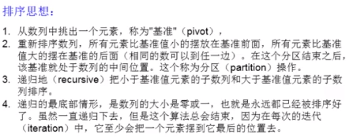

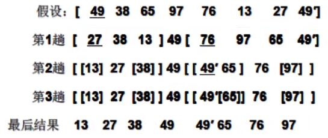

### 4.5 Arrays 工具类的使用

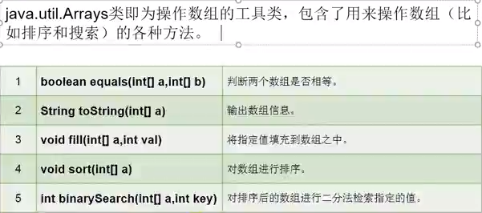

举例：

```java
package com.wugenqiang.array;

import java.util.Arrays;

/**
 * @version v1.0
 * @ProjectName: Java-Basic
 * @ClassName: ArraysTest
 * @Description: 测试Arrays工具类
 * @Author: wugenqiang
 * @Date: 2020/4/13 10:42
 */
public class ArraysTest {

    public static void main(String[] args) {
        int[] arr1 = new int[]{1,2,3,4};
        int[] arr2 = new int[]{1,5,3,4};
        boolean isEquals = Arrays.equals(arr1, arr2);
        System.out.println(isEquals);

        System.out.println(Arrays.toString(arr1));

        Arrays.fill(arr1, 10);
        System.out.println(Arrays.toString(arr1));

        Arrays.sort(arr2);
        System.out.println(Arrays.toString(arr2));
        
        int[] arr = new int[]{-98,-78,45,56,68,78,98,100};
        int index = Arrays.binarySearch(arr, 98);
        System.out.println(index);
    }
}
```


### 4.6 数组中常见的异常

```java
ArrayIndexOutOfBourdsException:数组角标越界异常
合理范围：[0, arr.length - 1]
越界：arr[-1], arr[arr.length]
    
NullPointException:空指针异常
eg.
    int[] arr = null;
	arr[0];
```

> 注意：一旦程序出现异常，未处理时，就终止执行。

## 5 面向对象编程（OOP）

> Java 面向对象学习的三条主线：

* Java 类及类的成员
  * 属性、方法、构造器（使用频率高）
  * 代码块、内部类
* 面向对象的三大特征
  * 封装性
  * 继承性
  * 多态性
  * 抽象性（可选，其他三个必选）
* 其他关键字
  * this 
  * super
  * static
  * final
  * abstract
  * interface
  * package
  * import
  * ......

### 5.1 面向过程与面向对象

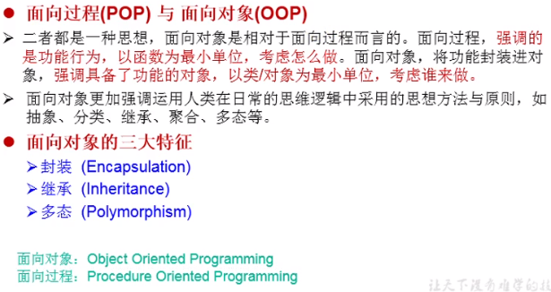


### 5.2 Java 语言的基本元素：类和对象

> 类（Class）和对象（Object）是面向对象的核心概念。

* 类是对一类事物的描述，是抽象的、概念上的定义。
* 对象是实际存在的该类事物的每个个体，因而也称为实例（instance）

#### 5.2.1 创建类以及设计类的成员

!> 面向对象程序设计的重点是类的设计，类的设计，其实就是类的成员的设计。

* 属性 = 成员变量 = field = 域、字段
* 方法 = 成员方法 = method = 函数
* 构造器（constructor）又称构造方法
* 代码块
* 内部类

Example：Person 类

```java
package com.wugenqiang.oop;

/**
 * @version v1.0
 * @ProjectName: Java-Basic
 * @ClassName: Person
 * @Description: Person类
 * @Author: wugenqiang
 * @Date: 2020/4/10 14:51
 */
public class Person {
    //属性
    String name;
    int age = 1;
    boolean isMale;

    //方法
    public void eat() {
        System.out.println("人可以吃饭");
    }

    public void sleep() {
        System.out.println("人可以睡觉");
    }

    public void talk(String language) {
        System.out.println("人可以说话，使用的是：" + language);
    }
}
```

#### 5.2.2 对象的创建和使用

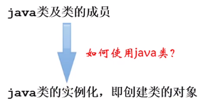

* 创建类的对象 = 类的实例化 = 实例化类

Example：测试类

```java
package com.wugenqiang.oop;

/**
 * @version v1.0
 * @ProjectName: Java-Basic
 * @ClassName: OOPTest
 * @Description: 面向对象编程测试类
 * @Author: wugenqiang
 * @Date: 2020/4/10 14:17
 */
public class OOPTest {
    public static void main(String[] args) {
        //创建Person类的对象：new + 构造器
        Person p1 = new Person();
        //调用对象的结构：属性、方法
        //调用属性：对象.属性
        p1.name = "wugenqiang";
        p1.isMale = true;
        System.out.println(p1.name);
        //调用方法：对象.方法
        p1.eat();
    }
}
```

!> 如果创建了一个类的多个对象，则每个对象都独立的拥有一套类的属性。（非 static 的）即意味着：如果我们修改一个对象的属性 a, 则不影响另外一个对象属性 a 的值。

#### 5.2.3 对象的内存解析

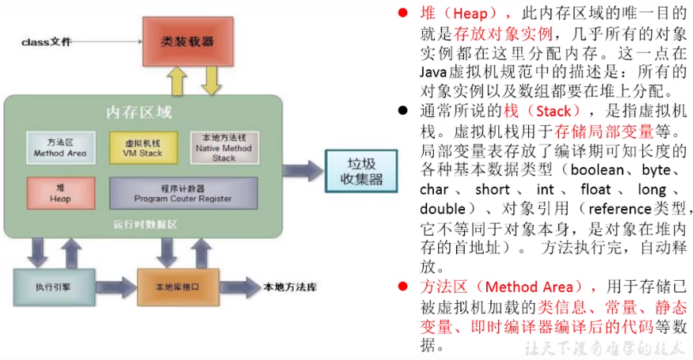

举例说明：

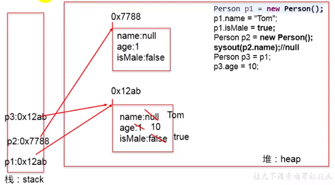

#### 5.2.4 类中属性的使用

> 属性（成员变量）VS 局部变量

* 相同点
  * 定义变量的格式一样：数据类型 变量名 = 变量值
  * 先声明，后使用
  * 变量都有其对应的作用域
* 不同点
  * 在类中声明的位置不同：
    * 属性是直接定义在类的一对 { } 内。
    * 而局部变量是声明在方法内、方法形参、代码块内、构造器形参、构造器内部的变量。
  * 关于权限修饰符的不同：
    * 属性可以在声明属性时，指明其权限，使用权限修饰符。常用的权限修饰符：private、public、缺省、protected --> 封装性。
    * 而局部变量是不可以使用权限修饰符的。
  * 默认初始化值的情况：
    * 属性：类的属性，根据其类型，都有默认初始化值。比如：整型（byte、short、int、long）--> 0，浮点型（float、double）--> 0.0，字符型（char）--> 0，布尔型（boolean）--> false，引用数据类型（类、数组、接口）--> null
    * 局部变量：没有默认初始化值，意味着我们在调用局部变量之前，一定要显示赋值。特别地：形参在调用的时候赋值即可。
  * 在内存中加载的位置不同：
    * 属性是加载到堆空间中。（非 static 的），static 的是放在方法区的。
    * 局部变量是加载到栈空间。

举例说明：

```java
package com.wugenqiang.oop;

/**
 * @version v1.0
 * @ProjectName: Java-Basic
 * @ClassName: User
 * @Description: User类
 * @Author: wugenqiang
 * @Date: 2020/4/10 15:42
 */
public class User {
    //属性（或成员变量）
    private String name;
    int age;
    boolean isMale;

    public void talk(String language) {//language:形参
        System.out.println("我们使用" + language + "进行交流");
    }

    public void eat() {
        String food = "pie";//局部变量
        System.out.println("北方人喜欢吃：" + food);
    }
}
```

> 总结：属性赋值的先后顺序：

* （1）默认初始化
* （2）显式初始化
* （3）构造器中初始化
* （4）通过 "对象.方法" 或 "对象.属性" 的方式，赋值。


#### 5.2.5 类中方法的声明和使用

方法：描述类应该具有的功能。

比如：

* Math 类：sqrt( ) \ random( ) \ ...
* Scanner 类：nextXxx( ) ...
* Arrays 类：sort( ) \ binarySearch( ) \ toString( ) \ equals( ) \ ...

方法的分类：

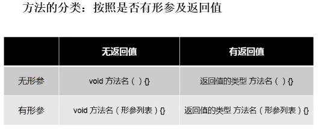

方法的声明：

```
权限修饰符 返回值类型 方法名(形参列表) {
	方法体
}
```

> 注：

* 关于权限修饰符（Java 规定的 4 种权限修饰符）：
  * private
  * public
  * 缺省
  * protected
* 关于返回值类型：有返回值 VS 没有返回值
  * 如果方法有返回值，则必须在方法声明时，指定返回值的类型。同时，方法中，需要使用 return 关键字来返回指定类型的变量或常量。
  * 如果方法没有返回值，则方法声明时，使用 void 来表示。通常，没有返回值的方法中，就不需要使用 return，但是如果使用的话，只能 “return ;” 表示结束此方法的意思。
  * 我们定义方法该不该有返回值？根据经验，哈哈哈，但是还是要从下面几个方面考虑：
    * 题目要求
    * 凭经验：具体问题具体分析
* 方法名：属于标识符，遵循标识符的规则和规范。
* 形参列表“方法可以声明 0 个，1 个，或多个形参。
* return 关键字的使用：
  * 使用范围：使用在方法体中
  * 作用：（1）结束方法（2）针对于有返回值类型的方法，使用 “return 数据” 方法返回所要的数据。
  * 注意点：return 关键字后面不可以声明执行语句。 
* 方法的使用中，可以调用当前类的属性或方法。特殊的：方法 A 中又调用了方法 A：递归方法。
  * 方法中不可以定义方法。

举例说明：

```java
package com.wugenqiang.oop;

/**
 * @version v1.0
 * @ProjectName: Java-Basic
 * @ClassName: Customer
 * @Description: Customer类
 * @Author: wugenqiang
 * @Date: 2020/4/10 16:14
 */
public class Customer {
    //属性
    String name;
    int age;
    boolean isMale;

    //方法
    public void eat() {//无形参，无返回值
        System.out.println("客户吃饭");
    }

    public  void sleep(int hour) {//有形参，无返回值
        System.out.println("休息了" + hour + "小时");
    }

    public String getName() {//无形参，有返回值
        return name;
    }

    public String getNation(String nation) {//有形参，有返回值
        String info = "我的国籍是：" + nation;
        return info;
    }
}
```

#### 5.26 类中构造器的使用

> 构造器（constructor）又称构造方法，也属于类的成员

构造器的特征：

* 它具有与类相同的名称
* 不声明返回值类型，与声明为 void 不同
* 不能被 static、final、synchronized、abstract、native 修饰，不能有 return 语句返回值。

构造器的作用：

* 创建对象：new + 构造器
* 初始化对象的信息


说明：

* 如果没有显式的定义类的构造器的话，则系统默认提供一个空参的构造器。
* 定义构造器的格式：权限修饰符 类名(形参列表) {}
* 一个类中定义的多个构造器，彼此构成重载。
* 一旦我们显式的定义了类的构造器之后，系统就不再提供默认的空参构造器。
* 一个类中，至少会有一个构造器。


举例：

```java
package com.wugenqiang.oop;

/**
 * @version v1.0
 * @ProjectName: Java-Basic
 * @ClassName: PersonTest
 * @Description: 构造器的使用
 * @Author: wugenqiang
 * @Date: 2020/4/12 17:19
 */
public class PersonTest {
    public static void main(String[] args) {
        //创建类的对象：new + 构造器
        Person p = new Person();
        p.study();
        Person p1 = new Person("Tom");
        System.out.println(p1.name);
    }
}
class Person {
    //属性
    String name;
    int age;
    boolean isMale;

    //构造器
    public Person() {
        System.out.println("lllllaaaa");
    }
    //构造器
    public Person(String n) {
        name = n;
    }
    //构造器
    public Person(String n, int a) {
        name = n;
        age = a;
    }

    public void study() {
        System.out.println("好好学习！");
    }
}
```


### 5.3 再谈方法

#### 5.3.1 方法的重载

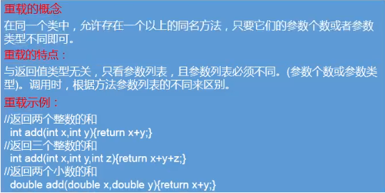


#### 5.3.2 可变个数形参的方法

格式：数据类型 ... 变量名

eg.

```java
package com.wugenqiang.oop;

/**
 * @version v1.0
 * @ProjectName: Java-Basic
 * @ClassName: MethodArgsTest
 * @Description: 可变个数形参的方法
 * @Author: wugenqiang
 * @Date: 2020/4/12 15:19
 */
public class MethodArgsTest {
    public static void main(String[] args) {
        MethodArgsTest test = new MethodArgsTest();
        test.show(12);
        test.show("hello");
        test.show("12","hello");
        test.show();
    }
    public void show(int i) {
        System.out.println(i);
    }
    public void show(String s) {
        System.out.println(s);
    }
    public void show(String ... strs) {
        System.out.println("hhha");
    }
}
```

!> 注意：

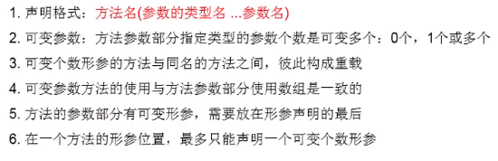

#### 5.3.3 方法参数的值传递机制

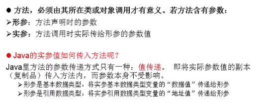

举例：

```java
package com.wugenqiang.oop;

/**
 * @version v1.0
 * @ProjectName: Java-Basic
 * @ClassName: MethodArgsTest
 * @Description: 可变个数形参的方法
 * @Author: wugenqiang
 * @Date: 2020/4/12 15:19
 */
public class MethodArgsTest {
    public static void main(String[] args) {
        Data d = new Data();
        System.out.println(d.m + " " + d.n);
        MethodArgsTest test = new MethodArgsTest();
        test.swap(d);
        System.out.println(d.m + " " + d.n);
    }
    public void swap(Data data) {
        int temp = data.m;
        data.m = data.n;
        data.n = temp;
    }
}

class Data {
    int m = 10;
    int n = 20;
}
```


#### 5.3.4 递归方法

> 递归（recursion）方法

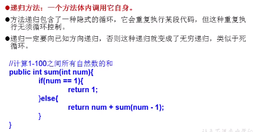

举例二：求 n!

```java
public int getFactorial(int n) {
    if (n == 1) {
        return 1;
    } else {
        return n * getFactorial(n - 1);
    }
}
```

举例三：f (0) = 1，f (1) = 4，f (n+2) = 2 * f (n+1) + f(n)

```java
public int function(int n) {
    if (n == 0) {
        return 1;
    } else if (n == 1) {
        return 4;
    } else {
        return 2 * f(n-1) + f(n-2);
    }
}
```

#### 5.3.5 方法的重写

> override / overwrite

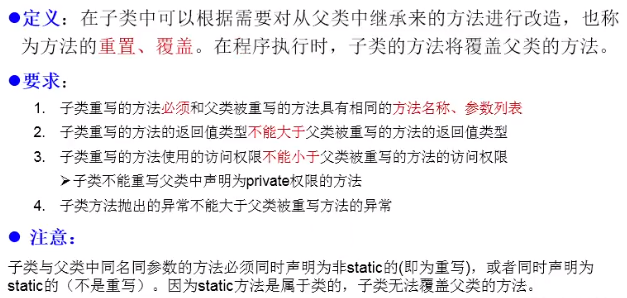

举例：

```
|- Person 类
|- Student 类
|- PersonTest 测试类
```

* Person 类：

```java
package com.wugenqiang.overwrite;

/**
 * @version v1.0
 * @ProjectName: Java-Basic
 * @ClassName: Person
 * @Description: Person类
 * @Author: wugenqiang
 * @Date: 2020/4/15 16:01
 */
public class Person {
    String name;
    int age;

    public Person() {

    }

    public Person(String name, int age) {
        this.name = name;
        this.age = age;
    }

    public void eat() {
        System.out.println("eat");
    }

    public void walk(int distance) {
        System.out.println(distance);
    }
}
```

* Student 类

```java
package com.wugenqiang.overwrite;

/**
 * @version v1.0
 * @ProjectName: Java-Basic
 * @ClassName: Student
 * @Description: 学生类
 * @Author: wugenqiang
 * @Date: 2020/4/15 16:01
 */
public class Student extends Person{
    String major;

    public Student() {

    }
    public Student(String major) {
        this.major = major;
    }
    public void study() {
        System.out.println(major);
    }

    @Override
    public void eat() {
        System.out.println("eat fish");
    }
}
```

* PersonTest 测试类

```java
package com.wugenqiang.overwrite;

/**
 * @version v1.0
 * @ProjectName: Java-Basic
 * @ClassName: PersonTest
 * @Description: main测试
 * @Author: wugenqiang
 * @Date: 2020/4/15 16:08
 */
public class PersonTest {
    public static void main(String[] args) {
        Student s = new Student("Software");
        s.eat();
        s.walk(10);

        s.study();
    }
}
```


### 5.4 面向对象特征

#### 5.4.1 封装性

> 封装性的设计思想“把该隐藏的隐藏起来，该暴露的暴露出来。

程序设计追求 "高内聚，低耦合"：

* 高内聚：类的内部数据操作细节自己完成，不允许外部干涉。
* 低耦合：仅对外暴露少量的方法用于使用。

封装性的体现：

* 体现一：将类的属性 xxx 私有化（private），同时，提供公共的（public）方法来获取（getXxx）和设置（setXxx）。
* 体现二：不对外暴露的私有的方法。
* 体现三：单例模式（将构造器私有化）。
* 体现四：如果不希望类在包外被调用，可以将类设置为缺省的。

举例：

```java
package com.wugenqiang.oop;

/**
 * @version v1.0
 * @ProjectName: Java-Basic
 * @ClassName: AnimalTest
 * @Description: 测试封装与隐藏
 * @Author: wugenqiang
 * @Date: 2020/4/12 16:36
 */
public class AnimalTest {
    public static void main(String[] args) {
        Animal a = new Animal();
        a.name = "dog";
        //a.age = 1;
        a.setAge(1);
        a.setLegs(6);
        a.show();
    }
}
class Animal {
    String name;
    private int age;
    private int legs;//腿的条数

    public void setLegs(int l) {
        if (l >= 0 && l % 2 == 0) {
            legs = l;
        } else {
            legs = 0;
            //抛出异常（暂时没有做）
        }

    }
    public int getLegs() {
        return legs;
    }
    public void show() {
        System.out.println("name = " + name + ",age = " + age + ",legs = " + legs);
    }
    public void setAge(int a) {
        age = a;
    }
    public int getAge() {
        return age;
    }
}
```

#### 5.4.2 继承性

> inheritance 继承性

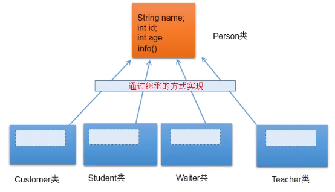

> 继承性的好处

* 减少了代码的冗余，提高了代码的复用性。
* 便于功能的扩展。

* 为之后多态性的使用，提供了前提。

> 继承性的格式

```java
class A extends B {
}
```

A：子类、派生类、subclass

B：父类、超类、基类、superclass

* 体现：一旦子类 A 继承父类 B 以后，子类 A 中就获取了父类 B 中声明的所有结构：属性和方法。

* 特别的，父类中声明为 private 的属性或方法，子类继承父类以后，仍然认为获取了父类中私有的结构，只是因为封装性的影响，使得子类不能直接调用父类的结构而已。

* 子类继承父类以后，还可以声明自己特有的属性或方法。实现功能的拓展。

* 子类和父类的关系，不同于子集和集合的关系。
* extends：延展、扩展、继承

> 举例：

```
|-- Person 类
|-- Student 类
|-- ExtendsTest 类
```

* Person 类

```java
package com.wugenqiang.test;

/**
 * @version v1.0
 * @ProjectName: Java-Basic
 * @ClassName: Person
 * @Description: 测试继承性
 * @Author: wugenqiang
 * @Date: 2020/4/13 17:19
 */
public class Person {
    //属性
    String name;
    int age;

    //构造器
    public Person() {

    }

    public Person(String name, int age) {
        this.name = name;
        this.age = age;
    }

    //方法
    public void eat() {
        System.out.println("打豆豆");
    }
}
```

* Student 类

```java
package com.wugenqiang.test;

/**
 * @version v1.0
 * @ProjectName: Java-Basic
 * @ClassName: Student
 * @Description: 学生类
 * @Author: wugenqiang
 * @Date: 2020/4/13 17:22
 */
public class Student extends Person{
    //String name;
    //int age;
    String major;

    public Student() {
    }

    public Student(String name, int age, String major) {
        this.name = name;
        this.age = age;
        this.major = major;
    }

    public void study() {
        System.out.println("day day up!");
    }
}
```

* ExtendsTest 类

```java
package com.wugenqiang.test;

/**
 * @version v1.0
 * @ProjectName: Java-Basic
 * @ClassName: ExtendsTest
 * @Description: 继承
 * @Author: wugenqiang
 * @Date: 2020/4/13 17:26
 */
public class ExtendsTest {
    public static void main(String[] args) {
        Person p1 = new Person();
        p1.age = 1;
        p1.eat();

        Student s1 = new Student();
        s1.study();
        s1.eat();
    }
}
```

> Java 中关于继承性的规定：

* 一个类可以被多个子类继承。
* Java 中类的单继承性：一个类只能有一个父类。

* 子父类是相对的概念。
* 子类直接继承的父类，称为直接父类。间接继承的父类，称为间接父类。
* 子类继承父类以后，就获取了直接父类以及所有间接父类中声明的属性和方法。

> 注：

* 如果我们没有显式的声明一个类的父类的话，则此类继承于 java.lang.Object 类。
* 所有的 java 类（除 java.lang.Object 类以外）都直接或间接的继承于 java.lang.Object 类。
* 意味着所有的 java 类具有 java.lang.Object 类声明的功能。

#### 5.4.3 多态性

理解：一个事物的多种形态。

* 对象的多态性：父类的引用指向子类的对象。或者说子类的对象赋给父类的引用。
* 多态的使用：当调用子父类同名同参数的方法时，实际执行的是子类重写父类的方法，叫做虚拟方法调用。
  * 有了对象的多态性以后，我们在编译期，只能调用父类中声明的方法，但是在运行期，我们实际执行的是子类重写父类的方法。
  * 总结：编译看左边，运行看右边。
* 多态性的使用前提：
  * 要有类的继承关系，没有继承就没有多态！
  * 要有方法的重写。
* 对象的多态性，只适用于方法，不适用于属性。

举例：

```
|-- Person 类
|-- Man 类
|-- Woman 类
|-- PersonTest 类
```

* Person 类

```java
package com.wugenqiang.polymorphism;

/**
 * @version v1.0
 * @ProjectName: Java-Basic
 * @ClassName: Person
 * @Description: Person
 * @Author: wugenqiang
 * @Date: 2020/4/15 22:07
 */
public class Person {
    String name;
    int age;

    public void eat() {
        System.out.println("人：吃饭");
    }
    public void walk() {
        System.out.println("人：走路");
    }
}
```


* Man 类

```java
package com.wugenqiang.polymorphism;

/**
 * @version v1.0
 * @ProjectName: Java-Basic
 * @ClassName: Man
 * @Description: Man
 * @Author: wugenqiang
 * @Date: 2020/4/15 22:09
 */
public class Man extends Person{
    boolean isSmoking;

    public void earnMoney() {
        System.out.println("男人负责挣钱养家");
    }

    @Override
    public void eat() {
        System.out.println("男人：吃饭");
    }
    @Override
    public void walk() {
        System.out.println("男人：走路");
    }
}
```


* Woman 类

```java
package com.wugenqiang.polymorphism;

/**
 * @version v1.0
 * @ProjectName: Java-Basic
 * @ClassName: Woman
 * @Description: Woman
 * @Author: wugenqiang
 * @Date: 2020/4/15 22:11
 */
public class Woman extends Person{
    boolean isBeauty;

    public void goShopping() {
        System.out.println("女人喜欢购物");
    }

    @Override
    public void eat() {
        System.out.println("女人：吃饭");
    }
    @Override
    public void walk() {
        System.out.println("女人：走路");
    }
}
```


* PersonTest 类

```java
package com.wugenqiang.polymorphism;

/**
 * @version v1.0
 * @ProjectName: Java-Basic
 * @ClassName: PersonTest
 * @Description: 测试多态性
 * @Author: wugenqiang
 * @Date: 2020/4/15 22:14
 */
public class PersonTest {
    public static void main(String[] args) {
        Person p1 = new Person();
        p1.eat();
        Man man = new Man();
        man.eat();
        man.age = 25;
        man.earnMoney();
        //对象的多态性：父类的引用指向子类的对象
        Person p2 = new Man();
        //Person p3 = new Woman();
        //多态的使用：当调用子父类同名同参数的方法时，实际执行的是子类重写父类的方法
        //叫做虚拟方法调用。
        p2.eat();
        p2.walk();
        //如何才能调用子类特有的属性和方法
        //向下转型，使用强制类型转换符
        Man m1 = (Man)p2;
        m1.earnMoney();
        //使用强转时，可能出现ClassCastException
        Woman w1 = (Woman)p2;
        w1.goShopping();
        //为避免这种错误，引入instanceof
        if (p2 instanceof Woman) {
            Woman w1 = (Woman)p2;
            w1.goShopping();
        }
    }
}
```


### 5.5 四种访问权限修饰符

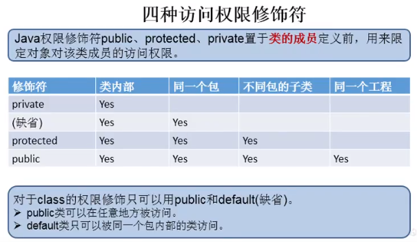


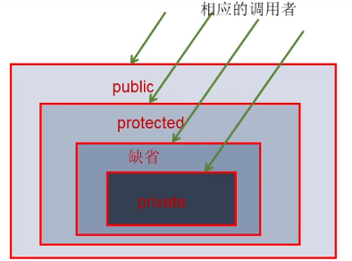

### 5.6 关键字的使用

#### 5.6.1 this 关键字的使用

this 关键字的使用：

* this 可以用来修饰或者调用：属性、方法、构造器
* this 调用属性和方法：
  * this 理解为：当前对象或者当前正在创建的对象
  * 在类的方法中，我们可以使用 "this.属性" 或者 "this.方法" 的方式，调用当前对象属性或者方法，但是，通常情况下，我们选择省略 "this."。特殊情况下，如果方法的形参和类的属性同名时，我们必须要显式的使用 "this.变量" 的方式，表明此变量是属性，而非形参。
  * 在类的构造器中，我们可以使用 "this.属性" 或者 "this.方法" 的方式，调用当前正在创建的对象属性或者方法，但是，通常情况下，我们选择省略 "this."。特殊情况下，如果构造器的形参和类的属性同名时，我们必须要显式的使用 "this.变量" 的方式，表明此变量是属性，而非形参。
* this 调用构造器
  * 我们在类的构造器中，可以显式的使用 "this(形参列表)" 方式，调用本类中指定的其他构造器。
  * 构造器中不能通过 ”this(形参列表)“ 方式调用自己。
  * 如果一个类中有 n 个构造器，则最多有 n - 1 构造器中使用了 ”this(形参列表)“。
  * 规定：”this(形参列表)“ 必须声明在当前构造器的首行。
  * 构造器内部，最多只能声明一个 ”this(形参列表)“，用来调用其他的构造器。

举例：

```java
package com.wugenqiang.oop;

/**
 * @version v1.0
 * @ProjectName: Java-Basic
 * @ClassName: PersonTest
 * @Description: this的使用
 * @Author: wugenqiang
 * @Date: 2020/4/12 17:19
 */
public class PersonTest {
    public static void main(String[] args) {
        //创建类的对象：new + 构造器
        Person p = new Person();
        p.setAge(1);
        System.out.println(p.getAge());
        Person p1 = new Person("wugenqiang", 25);
        System.out.println(p1.getName());
    }
}
class Person {
    //属性
    private String name;
    private int age;

    //构造器
    public Person() {
        this.study();
    }
    //构造器
    public Person(String name) {
        this();//避免冗余，调用Person()
        this.name = name;
    }
    //构造器
    public Person(String name, int age) {
        this(name);//避免冗余，调用Person(name)
        //this.name = name;
        this.age = age;
    }

    public void setName(String name) {
        //this理解为当前对象
        this.name = name;
    }
    public String getName() {
        return name;
    }
    public void setAge(int age) {
        this.age = age;
    }
    public int getAge() {
        return age;
    }
    public void study() {
        System.out.println("day day up!");
    }
}
```

#### 5.6.2 package 关键字的使用

（1）为了更好的实现项目中类的管理，提供包的概念。

（2）使用 package 声明类或接口所属的包，声明在源文件的首行。

（3）包属于标识符，遵循标识符的命名规则、规范（xxxyyyzz）、“见名知意”。

（4）每 ”.“ 一次，就代表一层文件目录。

> 注意：同一个包下，不能命名同名的接口、类。不同的包下，可以命名同名的接口、类。

**JDK 中主要的包介绍**

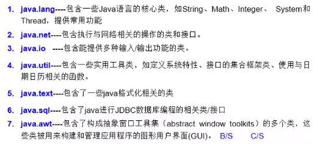

**MVC 设计模式**

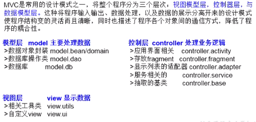

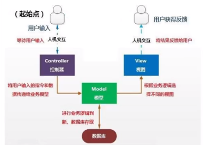

#### 5.6.3 import 关键字的使用

import 关键字的使用：

* 在源文件中显式的使用 import 结构导入指定包下的类、接口。
* 声明在包的声明和类的声明之间。
* 如果需要导入多个结构，则并列写出即可。
* 可以使用 "xxx.*" 的方式，来表示可以导入 xxx 包下的所有结构。 
* 如果使用的类或接口是 java.lang 包下定义的，则可以省略 import 结构。
* 如果使用的类或接口是本包下定义的，则可以省略 import 结构。
* 如果在源文件中，使用了不同包下的同名的类，则必须至少有一个类需要以全类名的方式显示。比如：com.wugenqiang.oop.Person
* 使用 "xxx.*" 方式表明可以调用 xxx 包下的所有结构。但是如果使用的是 xxx 子包下的结构，则仍需要显式导入。
* import static：导入指定类或接口中的静态结构：属性或者方法。

举例：

```java
package com.wugenqiang.oop;

//import java.util.ArrayList;
//import java.util.Arrays;
//import java.util.HashMap;
import java.util.ArrayList;
import java.util.Arrays;
import java.util.HashMap;
import java.util.Scanner;
import static java.lang.System.*;
import static java.lang.Math.*;

/**
 * @version v1.0
 * @ProjectName: Java-Basic
 * @ClassName: PacketImportTest
 * @Description: import的使用
 * @Author: wugenqiang
 * @Date: 2020/4/12 21:00
 */
public class PacketImportTest {
    public static void main(String[] args) {
        String info = Arrays.toString(new int[]{1,2,3});
        ArrayList list = new ArrayList<>();
        HashMap map = new HashMap();
        Scanner s = null;
        out.println("Hello!");
        long num = round(123.4);
        out.println(num);
    }
}
```

#### 5.6.4 return 关键字的使用

* 使用范围：使用在方法体中
* 作用：（1）结束方法（2）针对于有返回值类型的方法，使用 “return 数据” 方法返回所要的数据。
* 注意点：return 关键字后面不可以声明执行语句。 

#### 5.6.5 super 关键字的使用

* super 理解为父类的
* super 可以用来调用：属性、方法和构造器

* 我们可以在子类的方法或构造器中，通过使用 "super.属性" 或 "super.方法" 的方式，显式的调用父类中声明的属性或方法，但是，通常情况下，我们习惯性省略 "super"。
* 特殊情况：
  * 当子类和父类定义了同名的属性时，我们要想在子类中调用父类中声明的属性，则必须显式的使用 "super.属性" 的方式，表明调用的是父类中声明的属性。
  * 当子类重写了父类中的方法以后，我们想在子类的方法中调用父类中被重写的方法时，则必须使用 "super.方法" 的方式，表明调用的是父类中被重写的方法。
* super 调用构造器：
  * 我们可以在子类的构造器中显式的使用 "super(形参列表)" 的方式，调用父类中声明的指定的构造器。
  * "super(形参列表)" 的使用，必须声明在子类构造器的首行！
  * 我们在类的构造器中，针对于 "this(形参列表)" 或 "super(形参列表)" 只能二选一，不能同时出现。
  * 在构造器的首行，没有显式的声明 "this(形参列表)" 或 "super(形参列表)"，则默认调用的是父类中空参的构造器：super();

举例：

```
|- Person 类
|- Student 类
|- SuperTest 测试类
```

* Person 类：

```java
package com.wugenqiang.supertest;

/**
 * @version v1.0
 * @ProjectName: Java-Basic
 * @ClassName: Person
 * @Description: Person
 * @Author: wugenqiang
 * @Date: 2020/4/15 21:24
 */
public class Person {
    String name;
    int age;
    int id;//身份证号

    public Person() {
    }

    public Person(String name) {
        this.name = name;
    }

    public Person(String name, int age) {
        this.name = name;
        this.age = age;
    }

    public void work() {
        System.out.println("day day up!");
    }
}
```

* Student 类：

```java
package com.wugenqiang.supertest;

/**
 * @version v1.0
 * @ProjectName: Java-Basic
 * @ClassName: Student
 * @Description: Student
 * @Author: wugenqiang
 * @Date: 2020/4/15 21:24
 */
public class Student extends Person{
    String major;
    int id;//学号

    public Student() {

    }
    public Student(String major) {
        super();
        this.major = major;
    }

    @Override
    public void work() {
        System.out.println("EnjoyToShare");
    }

    public void study() {
        System.out.println("study");
        this.work();
        super.work();
    }

    public void show() {
        System.out.println("name = " + this.name + ", age = " + super.age);
        System.out.println(this.id);
        System.out.println(super.id);
    }
}
```

* SuperTest 测试类

```java
package com.wugenqiang.supertest;

/**
 * @version v1.0
 * @ProjectName: Java-Basic
 * @ClassName: SuperTest
 * @Description: 测试类
 * @Author: wugenqiang
 * @Date: 2020/4/15 21:24
 */
public class SuperTest {
    public static void main(String[] args) {
        Student s = new Student();
        s.show();
        s.study();
    }
}
```

#### 5.6.6 instanceof 关键字的使用

* a instanceof A：判断对象 a 是否是类 A 的实例，如果是，返回 true，如果不是，返回 false
* 如果 a instanceof A 返回 true，则 a instanceof B 也返回 true，其中，类 B 是类 A 的父类。

举例：

```java
if (p2 instanceof Woman) {
   Woman w1 = (Woman)p2;
   w1.goShopping();
}
```

#### 5.6.7 static 关键字的使用

static：静态的，用来修饰属性、方法、代码块和内部类，不能修饰构造器。

使用 static 修饰属性：静态变量（或类变量）

* 属性，按是否使用 static 修饰，又分为：静态属性和非静态属性（实例变量）
* 实例变量：我们创建了类的多个对象，每个对象都独立的拥有一套类中的非静态属性。当修改其他一个对象中的非静态属性时，不会导致其他对象中同样的属性值的修改。
* 静态变量：我们创建了类的多个对象，多个对象共享同一个静态变量，当通过某一个对象修改静态变量时，会导致其他对象调用此静态变量时，是修改过了的。
* static 修饰属性的其他说明：
  * 静态变量随着类的加载而加载。可以通过 "类.静态变量" 的方式进行调用
  * 静态变量的加载要早于对象的创建
* 静态属性举例：System.out; Math.PI;

|      | 类变量 | 实例变量 |
| :--: | :----: | :------: |
|  类  |  yes   |    no    |
| 对象 |  yes   |   yes    |

类变量 VS 实例变量的内存解析：


举例：

```java
package com.wugenqiang.s;

/**
 * @version v1.0
 * @ProjectName: Java-Basic
 * @ClassName: StaticTest
 * @Description: 测试Static关键字的使用
 * @Author: wugenqiang
 * @Date: 2020/4/18 17:24
 */
public class StaticTest {
    public static void main(String[] args) {
        Chinese.nation = "中国";
        Chinese c1 = new Chinese();
        c1.name = "wugenqiang";
        c1.age = 25;

        Chinese c2 = new Chinese();
        c2.name = "wugenqiang2";
        c2.age = 26;

        c1.nation = "CHN";
        System.out.println(c2.nation);
    }
}
class Chinese {
    String name;
    int age;
    static String nation;
}
```


使用 static 修饰方法：静态方法

* 静态变量随着类的加载而加载。可以通过 "类.静态方法" 的方式进行调用

|      | 静态方法 | 非静态方法 |
| :--: | :------: | :--------: |
|  类  |   yes    |     no     |
| 对象 |   yes    |    yes     |

* 静态方法中，只能调用静态的方法或属性
* 非静态方法中，即可以调用非静态的方法或属性，也可以调用静态的方法或属性
* 注意：
  * 在静态的方法内，不能使用 this 关键字、super 关键字

举例：

```java
public class StaticTest {
    public static void main(String[] args) {
        Chinese.show();
    }
}
class Chinese {

    public static void show() {
        System.out.println("I am an Chinese");
    }
}
```

> 在开发中如何确定一个属性是否要声明为 static？

* 属性是可以被多个对象所共享的，不会随着对象的不同而不同的


> 在开发中如何确定一个方法是否要声明为 static？

* 操作静态属性的方法，通常设置为 static 的
* 工具类中的方法，习惯上声明为 static 的，比如：Math、Arrays、Collections

> static 的应用：

##### 5.6.7.1 static 应用：单例模式


单例模式代码举例：

* 饿汉式

```java
package com.wugenqiang.oop;

/**
 * @version v1.0
 * @ProjectName: Java-Basic
 * @ClassName: SingletonTest1
 * @Description: 单例模式
 * @Author: wugenqiang
 * @Date: 2020/4/19 15:15
 */
public class SingletonTest1 {
    public static void main(String[] args) {
        Bank bank1 = Bank.getInstance();
        Bank bank2 = Bank.getInstance();
        System.out.println(bank1 == bank2);
    }
}
//饿汉式
class Bank {
    //1.私有化类的构造器
    private Bank() {

    }
    //2.内部创建类的对象
    //4.要求此对象也必须声明为静态的
    private static Bank instance = new Bank();
    //3.提供公共的静态方法，返回类的对象
    public static Bank getInstance() {
        return instance;
    }
}
```

* 懒汉式

```java
package com.wugenqiang.oop;

/**
 * @version v1.0
 * @ProjectName: Java-Basic
 * @ClassName: SingletonTest2
 * @Description: 单例模式的懒汉式实现
 * @Author: wugenqiang
 * @Date: 2020/4/19 15:23
 */
public class SingletonTest2 {
    public static void main(String[] args) {
        Order order1 = Order.getInstance();
        Order order2 = Order.getInstance();
        System.out.println(order1 == order2);
    }
}

class Order {
    //1.私有化类的构造器
    private Order() {

    }
    //2.声明当前类对象，没初始化
    //4.此对象也必须声明为static的
    private static Order instance = null;
    //3.声明public、static的返回当前类对象的方法
    public static Order getInstance() {
        if (instance == null) {
            instance = new Order();
        }
        return instance;
    }
}
```

> 区分饿汉式和懒汉式：

|        | 优点           | 缺点                     |
| ------ | -------------- | ------------------------ |
| 饿汉式 | 线程安全       | 对象加载时间过长         |
| 懒汉式 | 延迟对象的创建 | 目前的写法是线程不安全的 |


> 单例模式的应用场景：


### 5.7 JavaBean 组件的使用

> JavaBean 是一种 Java 语言写成的可重用组件。

JavaBean，是指符合如下标准的 Java 类：

* 类是公共的
* 有一个无参的公共的构造器
* 有属性，且有对应的 get、set 方法

举例：

```java
package com.wugenqiang.oop;

/**
 * @version v1.0
 * @ProjectName: Java-Basic
 * @ClassName: Customer
 * @Description: Customer类
 * @Author: wugenqiang
 * @Date: 2020/4/10 16:14
 */
public class Customer {
    private int id;
    private String name;

    public Customer() {
    }

    public int getId() {
        return id;
    }

    public void setId(int id) {
        this.id = id;
    }

    public String getName() {
        return name;
    }

    public void setName(String name) {
        this.name = name;
    }

    @Override
    public String toString() {
        return "Customer{" +
                "id=" + id +
                ", name='" + name + '\'' +
                '}';
    }
}
```

### 5.8 Object 类的使用

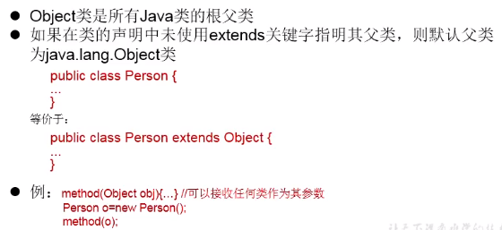

* Object 类只声明了一个空参的构造器

#### 5.8.1 Object 类中的主要结构

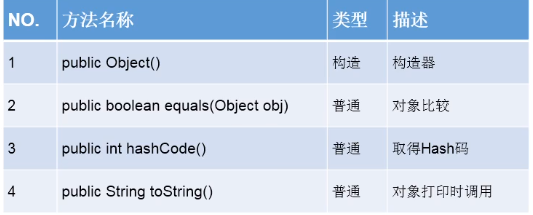

#### 5.8.2 == 和 equals 的区别

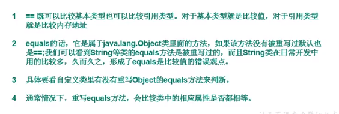

* 重写 equals() 方法的原则

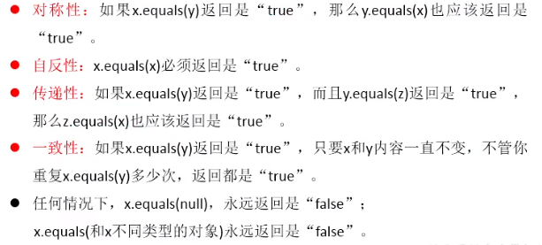

### 5.9 包装类的使用

> 包装类（Wrapper）也叫封装类


#### 5.9.1 基本类型、包装类与 String 类间的转换


（1）基本数据类型 -----> 包装类

* 使用举例：

```java
package com.wugenqiang.supertest;

import org.junit.Test;

/**
 * @version v1.0
 * @ProjectName: Java-Basic
 * @ClassName: WrapperTest
 * @Description: 包装类的测试
 * @Author: wugenqiang
 * @Date: 2020/4/17 10:23
 */
public class WrapperTest {
    @Test
    public void wrapperTest3() {
        int num1 = 10;
        //基本数据类型 -----> 包装类的对象
        method(num1);
    }

    public void method(Object obj) {
        System.out.println(obj);
    }
    
    //基本数据类型----->包装类，调用包装类的构造器
    @Test
    public void wrapperTest() {
        int num1 = 10;
        Integer in1 = new Integer(num1);
        System.out.println(in1.toString());
        Integer in2 = new Integer("123");
        System.out.println(in2.toString());
        Float f1 = new Float(12.3f);
        System.out.println(f1.toString());
        Boolean b1 = new Boolean(true);
        Boolean b2 = new Boolean("true");
        Boolean b3 = new Boolean("true123");
        System.out.println(b3);//false

        Order order = new Order();
        System.out.println(order.isMale);//false
        System.out.println(order.isFemale);//null
    }
}

class Order {
    boolean isMale;
    Boolean isFemale;
}
```

（2）包装类 -----> 基本数据类型

* 使用举例：

```java
public class WrapperTest {
    //包装类 -----> 基本数据类型：调用包装类的xxxValue()
    @Test
    public void wrapperTest2() {
        Integer in1 = new Integer(12);
        int i1 = in1.intValue();
        System.out.println(i1 + 1);
    }
}
```

（3）自动装箱与自动拆箱

* 使用举例：

```java
public class WrapperTest {
    //自动装箱与自动拆箱
    @Test
    public void wrapperTest3() {
        //自动装箱：基本数据类型 -----> 包装类
        int num2 = 10;
        Integer in1 = num2;

        boolean b1 = true;
        Boolean b2 = b1;

        //自动拆箱：包装类 -----> 基本数据类型
        System.out.println(in1.toString());
        int num3 = in1;

    }
}
```

（4）基本数据类型、包装类 -----> String 类型

* 使用举例：

```java
public class WrapperTest {
    //基本数据类型、包装类 -----> String 类型
    //调用String重载的valueOf(Xxx xxx)
    @Test
    public void wrapperTest4() {
        int num1 = 10;
        //方式一：连接运算
        String str1 = num1 + "";
        System.out.println(str1);
        //方式二：调用String的valueOf(Xxx xxx)
        float f1 = 12.3f;
        String str2 = String.valueOf(f1);//12.3

        Double d1 = new Double(12.4);
        String str3 = String.valueOf(d1);
        System.out.println(str2 + "," + str3);
    }
}
```

（5）String 类型 -----> 基本数据类型、包装类

*  使用举例：

```java
public class WrapperTest {
    //String 类型 -----> 基本数据类型、包装类
    //调用包装类的parseXxx()
    @Test
    public void wrapperTest5() {
        String str1 = "123";
        int i1 = Integer.parseInt(str1);
        System.out.println(i1);
        
        String str2 = "true";//true
        String str3 = "TrUe";//true
        boolean b1 = Boolean.parseBoolean(str2);
        System.out.println(b1);
    }
}
```


### 5.10 JUnit 单元测试 

* 创建 Java 类的要求：
  * 此类是 public 的，没有返回值，没有形参
  * 此类提供公共的无参的构造器
  * 需要声明注解：@Test，并在单元测试类中导入：import org.junit.Test;
* 声明好单元测试方法以后，就可以在方法体内测试相关的代码。

* 说明：
  * 如果执行结果无异常：绿 √，执行异常：红 ！
* 举例：

```java
package com.wugenqiang.supertest;

import org.junit.Test;

/**
 * @version v1.0
 * @ProjectName: Java-Basic
 * @ClassName: JUnitTest
 * @Description: JUnit 单元测试
 * @Author: wugenqiang
 * @Date: 2020/4/17 9:46
 */
public class JUnitTest {

    @Test
    public void testEquals(){
        String s1 = "MM";
        String s2 = "MM";
        System.out.println(s1.equals(s2));
        //报错：java.lang.ClassCastException
        //Object obj = new String("GG");
        //Date date = (Date)obj;
    }
}
```


### 5.11 抽象类与抽象方法

> abstract 关键字的使用

* abstract 抽象的
* 可以用来修饰的结构：类、方法

* abstract 修饰类：抽象类
  * 此类不能实例化
  * 抽象类中一定有构造器，便于子类实例化时调用
  * 开发中，都会提供抽象类的子类，让子类对象实例化，完成相关的操作。

* abstract 修饰方法：抽象方法
  * 抽象方法只有方法的声明，没有方法体
  * 包含抽象方法的类，一定是一个抽象类，反之，抽象类中可以没有抽象方法的。
  * 若子类重写了父类中的所有的抽象方法后，此子类方可实例化。
  * 若子类没有重写父类中的所有的抽象方法，则此子类也是一个抽象类，需要使用 abstract 修饰

举例：

```java
package com.wugenqiang.oop;

/**
 * @version v1.0
 * @ProjectName: Java-Basic
 * @ClassName: AbstractTest
 * @Description: 抽象类
 * @Author: wugenqiang
 * @Date: 2020/4/19 16:01
 */
public class AbstractTest {
    public static void main(String[] args) {
        //一旦Person类抽象了，就不可实例化
        //Person1 p1 = new Person1();
        //p1.eat();
    }
}

abstract class Person1 {
    String name;
    int age;

    public Person1() {

    }

    public Person1(String name, int age) {
        this.name = name;
        this.age = age;
    }

    //抽象方法
    public abstract void eat();

    /*public void eat(){
        System.out.println("吃");
    }*/
}

class Student1 extends Person1 {
    public Student1(String name, int age) {
        super(name, age);
    }

    @Override
    public void eat() {
        System.out.println("吃");
    }
}
```


### 5.12 接口

> 接口的使用：

* 接口使用 interface 来定义
* Java 中，接口和类是并列的两个结构
* 如何定义接口：定义接口中的成员
* 接口中是不能定义构造器的，意味着接口不可以实例化
* Java 开发中，接口通过让类去实现（implements）的方式来使用，如果实现类覆盖了接口中的所有抽象方法，则此实现类就可以实例化。如果实现类没有覆盖接口中所有的抽象方法，则此实现类仍为一个抽象类。
* Java 类可以实现多个接口 -----> 弥补了 Java 单继承性的局限性。
  * 格式：class AA extends BB implements CC, DD {}
* 接口与接口直接可以继承，而且可以多继承

举例：


```java
package com.wugenqiang.oop;

/**
 * @version v1.0
 * @ProjectName: Java-Basic
 * @ClassName: InterfaceTest
 * @Description: 接口
 * @Author: wugenqiang
 * @Date: 2020/4/19 16:26
 */
public class InterfaceTest {
    public static void main(String[] args) {
        System.out.println(Flyable.MAX_SPEED);
    }
}

interface Flyable {
    //全局常量
    public static final int MAX_SPEED = 7900;
    int MIN_SPEED = 1;//省略了public static final
    //抽象方法
    public abstract void fly();
    void stop();//省略了public abstract

}

interface Attackable {
    void fly();
}

class Plane implements Flyable {

    @Override
    public void fly() {

    }

    @Override
    public void stop() {

    }
}

class Bullet extends Object implements Flyable, Attackable {

    @Override
    public void fly() {

    }

    @Override
    public void stop() {

    }
}
```

> 接口的应用：代理模式、工厂模式

### 5.13 内部类


## 6 异常处理

### 6.1 异常概述与异常体系结构


举例：


## 7 Java 代码练习

考查量一个功能代码的优劣性：

> 注：衡量一个功能代码的优劣性：

* 1. 正确性
* 2. 可读性
* 3. 健壮性
* 4. 高效率与低存储：时间复杂度和空间复杂度（衡量算法的好坏）


### 7.1 Scanner 引入

注意：从键盘获取不同类型的变量，需要使用 Scanner 类

实现步骤：

* （1）导包：import java.util.Scanner;
* （2）Scanner 的实例化：Scanner scan = new Scanner(System.in);
* （3）调用 Scanner 类的相关方法，来获取指定类型的变量
* Scanner 演示代码：

```java
//1.导包：import java.util.Scanner;
import java.util.Scanner;
public class ScannerTest {
    public static void main(String[] args){
        //2.Scanner的实例化
        Scanner scan = new Scanner(System.in);
		//3.调用Scanner类的相关方法
        System.out.println("请输入你的姓名：");
        String name = scan.next();
        System.out.println(name);

        System.out.println("请输入你的年龄：");
        int age = scan.nextInt();
        System.out.println(age);

        System.out.println("请输入你的体重：");
        double weight = scan.nextDouble();
        System.out.println(weight);

        System.out.println("你是否相中我了哈哈？(true or false)：");
        boolean a = scan.nextBoolean();
        System.out.println(a);

        //对于char型的获取，Scanner没有提供相关的方法，只能获取字符串
        System.out.println("请输入你的性别(男 or 女)：");
        String gender = scan.next();
        System.out.println(gender);

        char genderChar = gender.charAt(0);//找到指定索引位上的字符，从0开始
        System.out.println(genderChar);
    }
}
```


### 7.2 随机数 random

> 使用方法：Math.random(); //返回 double 类型 [0.0,1.0)

#### 7.2.1 获取随机数 10 - 99

```java
double value = Math.random() * 90 + 10;//[0.0, 1.0) --> [0.0, 90) --> [0.0, 100)
int value2 = (int)(Math.random() * 90 + 10);//强制转换  [0.0, 100) --> [0, 99]
//公式：[a, b] : (int)(Math.random() * (b - a + 1) + a)
System.out.println(value);
System.out.println(value2);
```

### 7.3 日期类问题

#### 7.3.1 输出 2020 年的第几天

【题目】

```
编写程序：从键盘上输入2020年的“month”和“day”，要求通过程序输出输入的日期为2020年的第几天。
```

【代码实现】

```java
import java.util.Scanner;
/**
 * @version v1.0
 * @ProjectName: Java-Basic
 * @ClassName: DatePrint
 * @Description: 通过程序输出输入的日期为2019年的第几天。
 * @Author: wugenqiang
 * @Date: 2020/4/5 17:59
 */
public class DatePrint {
    public static void main(String[] args) {
        Scanner scan = new Scanner(System.in);
        System.out.println("请输入2020年的month：");
        int month = scan.nextInt();
        System.out.println("请输入2020年的day：");
        int day = scan.nextInt();

        //定义一个变量来保存总天数
        int sumDays = 0;
        switch (month){
            case 12:
                sumDays += 30;
            case 11:
                sumDays += 31;
            case 10:
                sumDays += 30;
            case 9:
                sumDays += 31;
            case 8:
                sumDays += 31;
            case 7:
                sumDays += 30;
            case 6:
                sumDays += 31;
            case 5:
                sumDays += 30;
            case 4:
                sumDays += 31;
            case 3:
                sumDays += 29;
            case 2:
                sumDays += 31;
            case 1:
                sumDays += day;
        }
        System.out.println(sumDays);
    }
}
```

#### 7.3.2 输出第几年的第几天

【题目】从键盘分别输入年、月、日，判断这一天是当年的第几天。

【思路】跟上面一题大体一样，但需要判断闰年和平年，判断思路如下：

* 判断一年是否是闰年的标准：
  * （1）可以被 4 整除，但不可被 100 整除
  * （2）可以被 400 整除

【代码】

```java
import java.util.Scanner;

/**
 * @version v1.0
 * @ProjectName: Java-Basic
 * @ClassName: DatePrint
 * @Description: 通过程序输出输入的日期第几天。
 * @Author: wugenqiang
 * @Date: 2020/4/5 17:59
 */
public class DatePrint2 {
    public static void main(String[] args) {
        Scanner scan = new Scanner(System.in);
        System.out.println("请输入year：");
        int year = scan.nextInt();
        System.out.println("请输入month：");
        int month = scan.nextInt();
        System.out.println("请输入day：");
        int day = scan.nextInt();

        //定义一个变量来保存总天数
        int sumDays = 0;
        switch (month){
            case 12:
                sumDays += 30;
            case 11:
                sumDays += 31;
            case 10:
                sumDays += 30;
            case 9:
                sumDays += 31;
            case 8:
                sumDays += 31;
            case 7:
                sumDays += 30;
            case 6:
                sumDays += 31;
            case 5:
                sumDays += 30;
            case 4:
                sumDays += 31;
            case 3:
                //sumDays += 29;
                //判断year是否是闰年
                if ((year % 4 == 0 && year % 100 != 0) || year % 400 == 0){
                    sumDays = 29;
                }else {
                    sumDays = 28;
                }
            case 2:
                sumDays += 31;
            case 1:
                sumDays += day;
        }
        System.out.println(year + "-" + month + "-" + day + " 是当年的第 " + sumDays + " 天");
    }
}
```

### 7.4 最大公约数

【题目】输入两个正整数 m 和 n，求最大公约数和最小公倍数。

【代码】

```java
import java.util.Scanner;
/**
 * @version v1.0
 * @ProjectName: Java-Basic
 * @ClassName: ForTest
 * @Description: 测试 for 循环
 * @Author: wugenqiang
 * @Date: 2020/4/1 15:48
 */
public class ForTest {
    public static void main(String[] args){
        Scanner scan = new Scanner(System.in);
        System.out.println("请输入第一个正整数：");
        int m = scan.nextInt();
        System.out.println("请输入第二个正整数：");
        int n = scan.nextInt();
        
        //获取最大公约数
        //1.获取两个数中的较小值
        int min = (m <= n) ? m : n;
        //2.遍历
        for (int i = min; i >= 1; i--) {
            if (m % i == 0 && n % i == 0){
                System.out.println("最大公约数为：" + i);
                break;//一旦找到第一个就跳出循环
            }
        }
        //获取最小公倍数
        //1.获取两个数中的较大值
        int max = (m >= n) ? m : n;
        //2.遍历
        for (int i = max; i <= m * n; i++) {
            if (i % m == 0 && i % n == 0) {
                System.out.println("最小公倍数为：" + i);
                break;//一旦找到第一个就跳出循环
            }
        }

    }
}
```

### 7.5 水仙花数

【题目】输出所有的水仙花数，所谓水仙花数就是指一个 3 位数，其各个位上数字立方和等于其本身。

【代码】

```java
int sum = 0;
for (int i = 100; i < 1000; i++) {
 	int j = i;
    while (j > 0) {
        int t = j % 10;
        sum += t * t * t;
        j /= 10;
    }
    if (sum == i) {
        System.out.println(i);
    } else {
        continue;
    }
}
```

### 7.6 完数

题目：找出 1000 以内的所有完数

讲解：完数，即这个数恰好等于它的因子之和，例如：6 = 1 + 2 + 3；

代码：

```java
int factor;
for (int i = 1; i <= 1000; i++) {
    factor = 0;
    for (int j = 1; j < i; j++) {
        if (i % j == 0) {
            factor += j;
        }
    }
    if (i == factor) {
        System.out.println(i);
    }
}
```

优化：

```java
int factor;
for (int i = 1; i <= 1000; i++) {
    factor = 0;
    for (int j = 1; j <= i/2; j++) {
        if (i % j == 0) {
            factor += j;
        }
    }
    if (i == factor) {
        System.out.println(i);
    }
}
```


### 7.7 读入整数并判断个数

 【题目】从键盘读入个数不确定的整数，并判断读入的正数和负数的个数，输入为 0 时结束程序。

【代码】

```java
import java.util.Scanner;

/**
 * @version v1.0
 * @ProjectName: Java-Basic
 * @ClassName: ForWhileTest
 * @Description: 判断读入正数和负数的个数
 * @Author: wugenqiang
 * @Date: 2020/4/7 14:51
 */
public class ForWhileTest {

    public static void main(String[] args) {
        Scanner scan = new Scanner(System.in);
        int positiveNumber = 0;//记录正数的个数
        int negativeNumber = 0;//记录负数的个数

        while (true) {
            int number = scan.nextInt();

            //判断number的正负情况
            if (number > 0) {
                positiveNumber++;
            } else if (number < 0) {
                negativeNumber++;
            } else {
                //一旦执行break，跳出循环
                break;
            }
        }
        System.out.println("输入的正数个数为：" + positiveNumber);
        System.out.println("输入的负数个数为：" + negativeNumber);
    }
}
```

> 注意：

* 不在循环条件部分限制次数的结构：for( ; ; ) 或者 while(true)
* 结束循环有几种方式：
  * 方式一：循环条件部分返回 false
  * 方式二：在循环体中执行 break

### 7.8 素数问题

#### 7.8.1 遍历输出 100 以内的素数

* 版本一：未优化状态

```java
public void isPrime(int n) {
    for (int i = 2; i <= n; i++) {
        boolean isFlag = true;
        for (int j = 2; j < i; j++) {
            if (i % j == 0) {
                isFlag = false;
            }
        }
        if (isFlag == true) {
            System.out.println(i);
        }
    }  
}
```

* 版本二：增加 break

```java
public void isPrime(int n) {
    for (int i = 2; i <= n; i++) {
        boolean isFlag = true;
        for (int j = 2; j < i; j++) {
            if (i % j == 0) {
                isFlag = false;
                break;
            }
        }
        if (isFlag == true) {
            System.out.println(i);
        }
    }  
}
```

* 版本三：增加 sqrt(i)

```java
public void isPrime(int n) {
    for (int i = 2; i <= n; i++) {
        boolean isFlag = true;
        for (int j = 2; j <= Math.sqrt(i); j++) {
            if (i % j == 0) {
                isFlag = false;
                break;
            }
        }
        if (isFlag == true) {
            System.out.println(i);
        }
    }  
}
```

### 7.9 面向对象

#### 7.9.1 计算圆的面积

【题目】

利用面向对象的编程方法，设计类 Circle 计算圆的面积。

【代码实现】

```java
package com.wugenqiang.oop;

/**
 * @version v1.0
 * @ProjectName: Java-Basic
 * @ClassName: CircleTest
 * @Description: Circle
 * @Author: wugenqiang
 * @Date: 2020/4/10 17:01
 */
//测试类
public class CircleTest {
    public static void main(String[] args) {
        //创建对象
        Circle c1 = new Circle();
        c1.radius = 2.1;
        //对应方式一：
        //System.out.println(c1.findArea());
        //对应方式二：
        c1.findArea();
    }
}

//圆
class Circle {
    //属性
    double radius;
    //求圆的面积
    //方式一：
    /*public double findArea() {
        double area = Math.PI * radius * radius;
        return  area;
    }*/
    //方式二：
    public void findArea() {
        double area = Math.PI * radius * radius;
        System.out.println("面积为：" + area);
    }
}
```

#### 7.9.2 对象数组：打印学生信息并排序

【题目】


【代码实现】

* 版本一：

```java
package com.wugenqiang.oop;

/**
 * @version v1.0
 * @ProjectName: Java-Basic
 * @ClassName: StudentTest
 * @Description: 对象数组练习
 * @Author: wugenqiang
 * @Date: 2020/4/11 21:11
 */
public class StudentTest {
    public static void main(String[] args) {
        //Student s1 = new Student();
        //声明Student类型的对象数组
        Student[] stus = new Student[20];

        for (int i = 0; i < stus.length; i++) {
            //给数组元素赋值
            stus[i] = new Student();
            //给Student对象的属性赋值
            stus[i].number = (i + 1);
            //年级：[1,6]
            stus[i].state = (int)(Math.random() * (6 - 1 + 1) + 1);
            //成绩：[0,100]
            stus[i].score = (int)(Math.random() * (100 - 0 + 1));
        }

        //遍历学生数组
        for (int i = 0; i < stus.length; i++) {
            //System.out.println(stus[i]);//输出地址值
            //System.out.println(stus[i].number + "," + stus[i].state + "," + stus[i].score);
            System.out.println(stus[i].info());
        }
        System.out.println("************");
        //问题1：打印出3年级的学生信息
        for (int i = 0; i < stus.length; i++) {
            if (stus[i].state == 3) {
                System.out.println(stus[i].info());
            }
        }
        System.out.println("************");
        //问题2：冒泡排序，按学生成绩排序
        for (int i = 0; i < stus.length - 1; i++) {
            for (int j = 0; j < stus.length - 1 - i; j++) {
                if (stus[j].score > stus[j + 1].score) {
                    Student temp = stus[j];
                    stus[j] = stus[j + 1];
                    stus[j + 1] = temp;
                }
            }
        }
        //遍历学生数组
        for (int i = 0; i < stus.length; i++) {
            System.out.println(stus[i].info());
        }
    }
}

class Student {
    int number;//学号
    int state;//年级
    int score;//成绩

    //显示学生信息的方法
    public String info() {
        return "学号：" + number + "，年级：" + state + "，成绩：" + score;
    }
}
```

* 版本二：优化版本一

```java
package com.wugenqiang.oop;

/**
 * @version v1.0
 * @ProjectName: Java-Basic
 * @ClassName: StudentTest
 * @Description: 对象数组练习
 * @Author: wugenqiang
 * @Date: 2020/4/11 21:11
 */
public class StudentTest {
    public static void main(String[] args) {
        //Student s1 = new Student();
        //声明Student类型的对象数组
        Student[] stus = new Student[20];

        for (int i = 0; i < stus.length; i++) {
            //给数组元素赋值
            stus[i] = new Student();
            //给Student对象的属性赋值
            stus[i].number = (i + 1);
            //年级：[1,6]
            stus[i].state = (int)(Math.random() * (6 - 1 + 1) + 1);
            //成绩：[0,100]
            stus[i].score = (int)(Math.random() * (100 - 0 + 1));
        }
        //造对象
        StudentTest test = new StudentTest();
        //遍历学生数组
        test.print(stus);

        System.out.println("************");

        //问题1：打印出3年级的学生信息
        test.searchState(stus, 3);

        System.out.println("************");

        //问题2：冒泡排序，按学生成绩排序
        test.sort(stus);
        test.print(stus);
    }

    //遍历Student[]数组的操作，封装到方法里
    public void print(Student[] stus) {
        //遍历学生数组
        for (int i = 0; i < stus.length; i++) {
            System.out.println(stus[i].info());
        }
    }

    /**
     * @Description 查找Student数组中指定年级的学生信息
     * @param stus 要查找的数组
     * @param state 要找的年级
     */
    public void searchState(Student[] stus, int state) {
        for (int i = 0; i < stus.length; i++) {
            if (stus[i].state == state) {
                System.out.println(stus[i].info());
            }
        }
    }

    /**
     * @Description 给Student数组排序
     * @param stus 要排序的数组
     */
    public void sort(Student[] stus) {
        for (int i = 0; i < stus.length - 1; i++) {
            for (int j = 0; j < stus.length - 1 - i; j++) {
                if (stus[j].score > stus[j + 1].score) {
                    Student temp = stus[j];
                    stus[j] = stus[j + 1];
                    stus[j + 1] = temp;
                }
            }
        }
    }
}

class Student {
    int number;//学号
    int state;//年级
    int score;//成绩

    //显示学生信息的方法
    public String info() {
        return "学号：" + number + "，年级：" + state + "，成绩：" + score;
    }
}
```

#### 7.9.3 基于文本界面的客户信息管理软件

##### 7.9.3.1 软件设计结构


##### 7.9.3.2 界面展示


##### 7.9.3.3 CMUtility 工具类的实现

```java
package com.wugenqiang.cm.util;

import java.util.Scanner;

/**
 * @version v1.0
 * @ProjectName: Java-Basic
 * @ClassName: CMUtility
 * @Description: 工具类
 * @Author: wugenqiang
 * @Date: 2020/4/13 11:45
 */
public class CMUtility {
    private static Scanner scanner = new Scanner(System.in);

    //用于界面菜单的选择，该方法读取键盘
    public static char readMenuSelection() {
        char c;
        for (; ; ) {
            String str = readKeyBoard(1, false);
            c = str.charAt(0);
            if (c != '1' && c != '2' && c != '3' && c != '4' && c != '5') {
                System.out.println("选择错误，请重新输入：");
            } else {
                break;
            }
        }
        return c;
    }
    //从键盘读取一个字符，并将其作为方法的返回值
    public static char readChar() {
        String str = readKeyBoard(1, false);
        return str.charAt(0);
    }
    //从键盘读取一个字符，并将其作为方法的返回值，若不输入，直接回车，方法将以defaultValue作为返回值
    public static char readChar(char defaultValue) {
        String str = readKeyBoard(1, true);
        return (str.length() == 0) ? defaultValue : str.charAt(0);
    }
    //从键盘读取一个长度不超过2位的正数，并将其作为方法的返回值
    public static int readInt() {
        int n;
        for (; ; ) {
            String str = readKeyBoard(2, false);
            try {
                n = Integer.parseInt(str);
                break;
            } catch (NumberFormatException e) {
                System.out.print("数字输入错误，请重新输入：");
            }
        }
        return n;
    }
    //从键盘读取一个长度不超过2位的正数，并将其作为方法的返回值，若不输入，直接回车，方法将以defaultValue作为返回值
    public static int readInt(int defaultValue) {
        int n;
        for (; ; ) {
            String str = readKeyBoard(2, true);
            if (str.equals("")) {
                return defaultValue;
            }
            try {
                n = Integer.parseInt(str);
                break;
            } catch (NumberFormatException e) {
                System.out.print("数字输入错误，请重新输入：");
            }
        }
        return n;
    }
    //从键盘读取一个长度不超过limit的字符串，并将其作为方法的返回值
    public static String readString(int limit) {
        return readKeyBoard(limit, false);
    }
    //从键盘读取一个长度不超过limit的字符串，并将其作为方法的返回值，若不输入，直接回车，方法将以defaultValue作为返回值
    public static String readString(int limit, String defaultValue) {
        String str = readKeyBoard(limit, true);
        return str.equals("") ? defaultValue : str;
    }
    //用于确定选择的输入，键盘读取‘Y’或‘N’，并将其作为方法的返回值
    public static char readConfirmSelection() {
        char c;
        for (; ; ) {
            String str = readKeyBoard(1, false).toUpperCase();
            c = str.charAt(0);
            if (c == 'Y' || c == 'N') {
                break;
            } else {
                System.out.print("选择错误，请重新输入：");
            }
        }
        return c;
    }

    private static String readKeyBoard(int limit, boolean blankReturn) {
        String line = "";
        while (scanner.hasNextLine()) {
            line = scanner.nextLine();
            if (line.length() == 0) {
                if (blankReturn) {
                    return line;
                } else {
                    continue;
                }
            }
            if (line.length() < 1 || line.length() > limit) {
                System.out.println("输入长度(不大于" + limit + ")错误，请重新输入：");
                continue;
            }
            break;
        }
        return line;
    }
}

```

##### 7.9.3.4 Customer 类的实现

```java
package com.wugenqiang.cm.bean;

/**
 * @version v1.0
 * @ProjectName: Java-Basic
 * @ClassName: Customer
 * @Description: Customer为实体对象，用来封装客户信息
 * @Author: wugenqiang
 * @Date: 2020/4/13 11:14
 */
public class Customer {
    private String name;//客户姓名
    private char gender;//性别
    private int age;//年龄
    private String phone;//电话号码
    private String email;//电子邮箱

    public Customer() {
    }

    public Customer(String name, char gender, int age, String phone, String email) {
        this.name = name;
        this.gender = gender;
        this.age = age;
        this.phone = phone;
        this.email = email;
    }

    public String getName() {
        return name;
    }

    public void setName(String name) {
        this.name = name;
    }

    public char getGender() {
        return gender;
    }

    public void setGender(char gender) {
        this.gender = gender;
    }

    public int getAge() {
        return age;
    }

    public void setAge(int age) {
        this.age = age;
    }

    public String getPhone() {
        return phone;
    }

    public void setPhone(String phone) {
        this.phone = phone;
    }

    public String getEmail() {
        return email;
    }

    public void setEmail(String email) {
        this.email = email;
    }
}
```

##### 7.9.3.5 CustomerList 类的实现

```java
package com.wugenqiang.cm.service;

import com.wugenqiang.cm.bean.Customer;

/**
 * @version v1.0
 * @ProjectName: Java-Basic
 * @ClassName: CustomerList
 * @Description: 为Customer对象提供管理模块，供CustomerView调用
 * @Author: wugenqiang
 * @Date: 2020/4/13 11:41
 */
public class CustomerList {
    private Customer[] customers;//用来保存客户对象的数组
    private int total = 0;//记录已保存客户对象的数量

    //构造器，用于初始化customers数组
    public CustomerList(int totalCustomer) {
        customers = new Customer[totalCustomer];
    }
    //将指定的客户添加到数组中
    public boolean addCustomer(Customer customer) {
        if (total >= customers.length) {
            return false;
        }
        customers[total++] = customer;
        return true;
    }
    //修改指定索引位置的客户信息
    public boolean replaceCustomer(int index, Customer cust) {
        if (index < 0 || index >= total) {
            return false;
        }
        customers[index] = cust;
        return true;
    }
    //删除指定索引位置上的客户
    public boolean deleteCustomer(int index) {
        if (index < 0 || index >= total) {
            return false;
        }
        for (int i = index; i < total - 1; i++) {
            customers[i] = customers[i + 1];
        }
        //最后有数据的元素需要置空
        //customers[total - 1] = null;
        //total--;
        customers[--total] = null;
        return true;
    }
    //获取所有的客户信息
    public Customer[] getAllCustomers() {
        Customer[] custs = new Customer[total];
        for (int i = 0; i < total; i++) {
            custs[i] = customers[i];//复制地址
        }
        return custs;
    }
    //获取指定索引位置上的客户
    public Customer getCustomer(int index) {
        if (index < 0 || index >= total) {
            return null;
        }
        return customers[index];
    }
    //获取存储客户的数量
    public int getTotal() {
        return total;
    }
}
```

##### 7.9.3.6 CustomerView 类的实现

```java
package com.wugenqiang.cm.ui;

import com.wugenqiang.cm.bean.Customer;
import com.wugenqiang.cm.service.CustomerList;
import com.wugenqiang.cm.util.CMUtility;

/**
 * @version v1.0
 * @ProjectName: Java-Basic
 * @ClassName: CustomerView
 * @Description: 主模块，负责菜单的显示和处理用户操作
 * @Author: wugenqiang
 * @Date: 2020/4/13 11:43
 */
public class CustomerView {
    private CustomerList customerList = new CustomerList(10);

    public CustomerView() {
        Customer customer = new Customer("吴跟强",'男',25,"18360861937","2422676183@qq.com");
        customerList.addCustomer(customer);
    }
    //显示目录界面
    public void enterMainMenu() {
        boolean isFlag = true;
        while (isFlag) {
            System.out.println("\n---------------客户信息管理软件----------------");
            System.out.println("                 1 添加客户");
            System.out.println("                 2 修改客户");
            System.out.println("                 3 删除客户");
            System.out.println("                 4 客户列表");
            System.out.println("                 5 退出\n");
            System.out.print("请选择(1-5)：");

            char menu = CMUtility.readMenuSelection();
            switch(menu) {
                case '1':
                    addNewCustomer();
                    break;
                case '2':
                    modifyCustomer();
                    break;
                case '3':
                    deleteCustomer();
                    break;
                case '4':
                    listAllCustomers();
                    break;
                case '5':
                    //System.out.println("退出");
                    System.out.print("确认是否退出(Y/N)：");
                    char isExit = CMUtility.readConfirmSelection();
                    if (isExit == 'Y') {
                        isFlag = false;
                        System.out.println("欢迎再次使用本软件！谢谢使用");
                    }
                    //break;
            }
            //isFlag = false;
        }
    }
    //添加客户
    private void addNewCustomer() {
        System.out.println("--------------添加客户----------------");
        System.out.print("姓名：");
        String name = CMUtility.readString(10);

        System.out.print("性别：");
        char gender = CMUtility.readChar();

        System.out.print("年龄：");
        int age = CMUtility.readInt();

        System.out.print("电话：");
        String phone = CMUtility.readString(13);

        System.out.print("邮箱：");
        String email = CMUtility.readString(30);

        //将上述数据封装到对象中
        Customer customer = new Customer(name, gender, age, phone, email);

        boolean isSuccess = customerList.addCustomer(customer);
        if (isSuccess) {
            System.out.println("-----------添加完成------------");
        } else {
            System.out.println("--------客户目录已满，添加失败---------");
        }
    }
    //修改客户
    private void modifyCustomer() {
        System.out.println("--------------修改客户----------------");
        Customer cust;
        int number;
        for (; ; ) {
            System.out.print("请选择待修改客户编号(-1退出)：");
            number = CMUtility.readInt();
            if (number == -1) {
                return ;
            }
            cust = customerList.getCustomer(number - 1);
            if (cust == null) {
                System.out.println("无法找到指定客户！");
            } else {//找到了相应编号的客户
                break;
            }
        }
        //修改客户信息
        System.out.print("姓名(" + cust.getName() + ")：");
        String name = CMUtility.readString(10, cust.getName());
        System.out.print("性别(" + cust.getGender() + ")：");
        char gender = CMUtility.readChar(cust.getGender());
        System.out.print("年龄(" + cust.getAge() + ")：");
        int age = CMUtility.readInt(cust.getAge());
        System.out.print("电话(" + cust.getPhone() + ")：");
        String phone = CMUtility.readString(13, cust.getPhone());
        System.out.print("邮箱(" + cust.getEmail() + ")：");
        String email = CMUtility.readString(30, cust.getEmail());

        Customer newCust = new Customer(name, gender, age, phone, email);
        boolean isRepalaced = customerList.replaceCustomer(number - 1, newCust);
        if (isRepalaced) {
            System.out.println("修改成功");
        } else {
            System.out.println("修改失败");
        }
    }
    //删除客户
    private void deleteCustomer() {
        System.out.println("------------删除客户--------------");
        int number;
        Customer customer;
        for ( ; ; ) {
            System.out.print("请选择待删除客户编号(-1退出)：");
            number = CMUtility.readInt();
            if (number == -1) {
                return ;
            }
            customer = customerList.getCustomer(number - 1);
            if (customer == null) {
                System.out.println("无法找到指定客户！");
            } else {
                break;
            }
        }
        //找到了指定的客户
        System.out.print("确认是否删除(Y/N)：");
        char isDelete = CMUtility.readConfirmSelection();
        if (isDelete == 'Y') {
            boolean deleteSuccess = customerList.deleteCustomer(number - 1);
            if (deleteSuccess) {
                System.out.println("删除完成");
            } else {
                System.out.println("删除失败");
            }
        } else {
            return ;
        }
    }
    //显示客户列表
    private void listAllCustomers() {
        System.out.println("--------------客户列表----------------");
        int total = customerList.getTotal();
        if (total == 0) {
            System.out.println("没有客户记录");
        } else {
            System.out.println("编号\t姓名\t\t性别\t年龄\t电话\t\t\t邮箱");
            Customer[] custs = customerList.getAllCustomers();
            for (int i = 0; i < custs.length; i++) {
                Customer cust = custs[i];
                System.out.println((i + 1) + "\t\t" + cust.getName() + "\t\t" +
                        cust.getGender() + "\t\t" + cust.getAge() + "\t\t" +
                        cust.getPhone() + "\t\t" + cust.getEmail());
            }
        }

        System.out.println("--------------客户列表完成----------------");

    }
    //主函数测试
    public static void main(String[] args) {
        CustomerView view = new CustomerView();
        view.enterMainMenu();
    }
}
```

