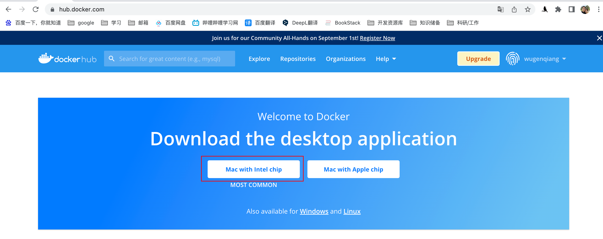
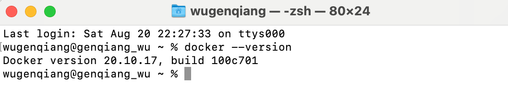
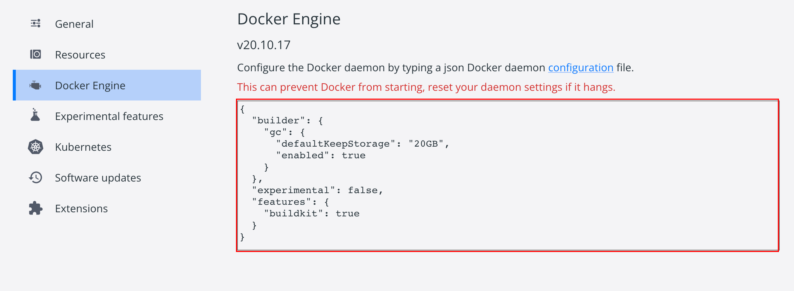
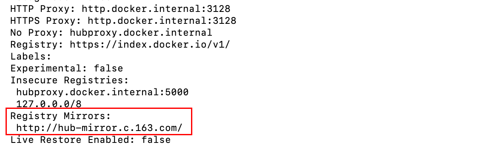

# Mac安装docker

> docker官网：https://hub.docker.com/

## docker简介

docker是一个开源的应用容器引擎，基于Go语言并遵从Apache2.0协议开源。

docker可以让开发者打包他们的应用以及依赖包到一个轻量级、可移植的容器中，然后发布到任何流行的Linux机器上，也可以实现虚拟化。

容器是完全使用沙箱机制，相互之间不会有任何接口，更重要的是容器性能开销极低。

## 安装步骤

1、下载docker

进入docker官网，点击图中按钮即可下载docker，



或者使用以下链接下载docker
[Intel Chip的Mac](https://desktop.docker.com/mac/main/amd64/Docker.dmg?utm_source=docker&utm_medium=webreferral&utm_campaign=dd-smartbutton&utm_location=module)
[Apple Chip的Mac](https://desktop.docker.com/mac/main/arm64/Docker.dmg?utm_source=docker&utm_medium=webreferral&utm_campaign=dd-smartbutton&utm_location=module)

2、安装docker

直接点击下载好的`Docker.dmg`即可。

安装成功后，可在终端检查docker版本，显示版本后，表示安装成功。

```shell
docker --version
```

如图所示：



3、镜像加速

如果因为网络问题拉取Docker镜像缓慢的话， 可以配置加速器。目前我是使用网易的。

```shell
http://hub-mirror.c.163.com
```

打开docker软件，点击设置图标进入，会出现下图所示的界面：



在红框处进行添加以下代码后，点击Apply & Restart 按钮：

```shell
{
  "builder": {
    "gc": {
      "enabled": true,
      "defaultKeepStorage": "20GB"
    }
  },
  "experimental": false,
  "features": {
    "buildkit": true
  },
  "registry-mirrors":[
    "http://hub-mirror.c.163.com"
  ]
}
```

查看是否应用镜像成功，红框内容就是上面配置的国内镜像：

```shell
docker info
```




> 附docker国内常用镜像：
>
> 1、中科大: https://docker.mirrors.ustc.edu.cn
>
> 2、网易: http://hub-mirror.c.163.com
>
> 3、Docker 官方中国区: https://registry.docker-cn.com
>
> 4、七牛云: https://reg-mirror.qiniu.com

