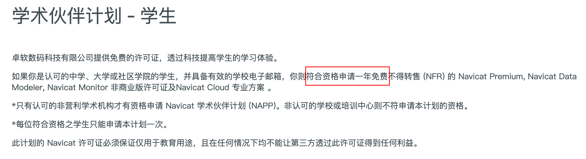
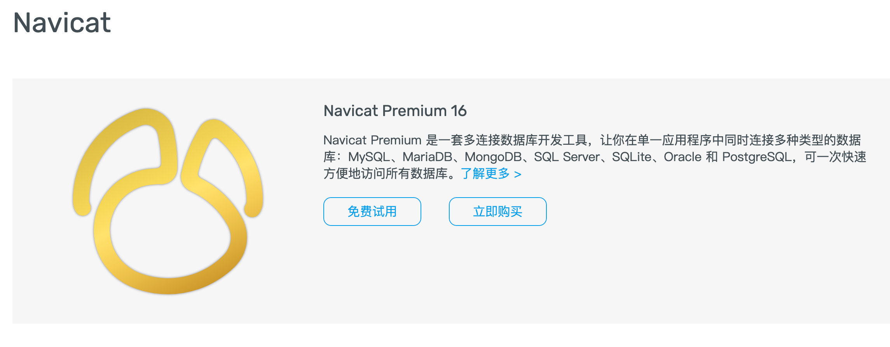
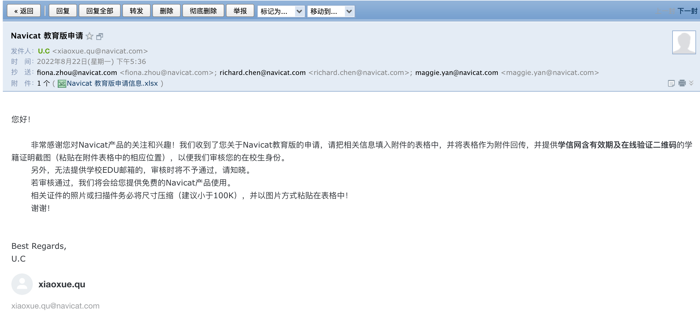

# Mac安装Navicat

> Navicat官网：http://www.navicat.com.cn/

申请许可证，学生可以申请学术伙伴计划，申请链接：http://www.navicat.com.cn/sponsorship/education/student

下载Navicat

官网下载即可，输入申请的许可证，即可免费使用一年

隔了两天就收到了填写信息的邮件：

填写教育版申请信息表，按照操作完成即可

