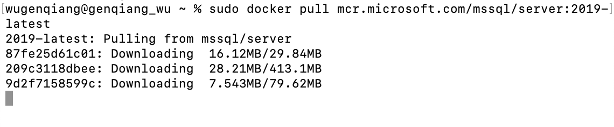
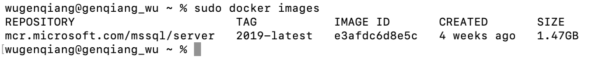
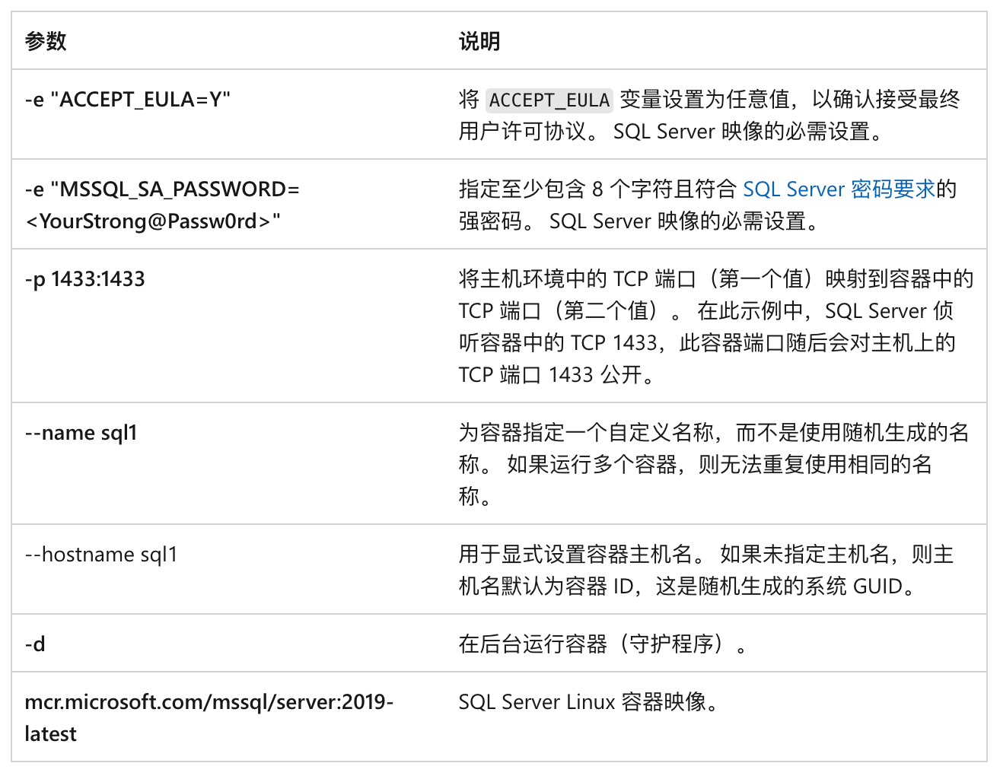
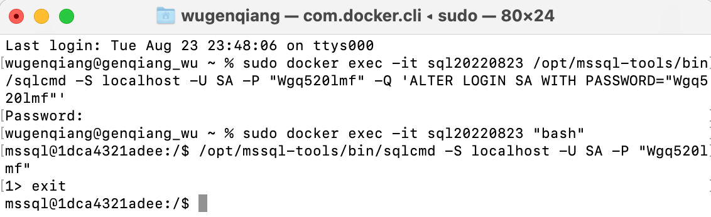
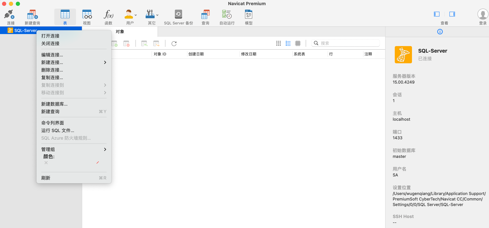

# 在Mac上如何使用SQL Server

> SQL Server一般是在Windows上使用，要是在mac中使用，需要借助`docker`来完成，接下来介绍如何通过docker来部署SQL Server。

## 1、拉取SQL Server 2019镜像

官方文档：https://docs.microsoft.com/zh-cn/sql/linux/quickstart-install-connect-docker?view=sql-server-linux-ver15&pivots=cs1-bash

从 Microsoft 容器注册表中请求 SQL Server 2019 (15.x) Linux 容器映像

```shell
sudo docker pull mcr.microsoft.com/mssql/server:2019-latest
```



查看下载的镜像

```shell
sudo docker images
```



就可以看到刚刚下载的SQL Server镜像了

## 2、使用docker运行SQL Server容器

```shell
sudo docker run -e "ACCEPT_EULA=Y" -e "MSSQL_SA_PASSWORD=<YourStrong@Passw0rd>"  -p 1433:1433 --name sql20220823  -d mcr.microsoft.com/mssql/server:2019-latest
```

> 注：密码应符合 SQL Server 默认密码策略，否则容器无法设置 SQL Server，将停止工作。 默认情况下，密码的长度必须至少为 8 个字符，并且必须包含以下四种字符中的三种：大写字母、小写字母、十进制数字和符号。 你可以通过执行 docker logs 命令检查错误日志。

下表对前一个 `docker run` 示例中的参数进行了说明：



要查看 Docker 容器，请使用 `docker ps` 命令

```shell
docker ps -a
```


更改SA密码：

SA 帐户是安装过程中在 SQL Server 实例上创建的系统管理员。 创建 SQL Server 容器后，通过在容器中运行 echo $SA_PASSWORD，可发现指定的 SA_PASSWORD 环境变量。 出于安全考虑，请考虑更改 SA 密码。

选择 SA 用户要使用的强密码。
使用 docker exec 运行sqlcmd ，以使用 Transact-SQL 更改密码。 在下面的示例中，将旧密码 `<YourStrong@Passw0rd>`和新密码 `<YourNewStrong@Passw0rd>` 替换为你自己的密码值。

```shell
sudo docker exec -it sql20220823 /opt/mssql-tools/bin/sqlcmd -S localhost -U SA -P "<YourStrong@Passw0rd>" -Q 'ALTER LOGIN SA WITH PASSWORD="<YourNewStrong@Passw0rd>"'
```

## 3、进入容器，连接到SQL Server

> 下列步骤在容器内部使用SQL Server命令行工具sqlcmd来连接SQL Server

进入容器：

```shell
sudo docker exec -it sql20220823 "bash"
```

> 使用 `docker exec -it` 命令在运行的容器内部启动交互式 Bash Shell

在容器内部使用 sqlcmd 进行本地连接。 默认情况下，sqlcmd 不在路径之中，因此需要指定完整路径。

```shell
/opt/mssql-tools/bin/sqlcmd -S localhost -U SA -P "输入你的密码"
```

如果成功，应会显示 sqlcmd 命令提示符：1>

在容器中退出交互式命令提示，请键入 `exit`。 退出交互式 Bash Shell 后，容器将继续运行。



## 4、使用Navicat连接

> Navicat是一套可创建多个连接的数据库管理工具，用以方便管理 [MySQL](https://baike.baidu.com/item/MySQL/471251)、[Oracle](https://baike.baidu.com/item/Oracle/301207)、[PostgreSQL](https://baike.baidu.com/item/PostgreSQL/530240)、[SQLite](https://baike.baidu.com/item/SQLite/375020)、[SQL Server](https://baike.baidu.com/item/SQL Server/245994)、[MariaDB](https://baike.baidu.com/item/MariaDB/6466119) 和 [MongoDB](https://baike.baidu.com/item/MongoDB/60411) 等不同类型的数据库

百度云链接: https://pan.baidu.com/s/1ZA4wibPZXTjuZ2Ra3XC3Rw?pwd=aa2h 提取码: aa2h

下载好后添加Sql Server数据库连接:


最后，连接成功！就可以进行数据库设计了，真棒！☘️

