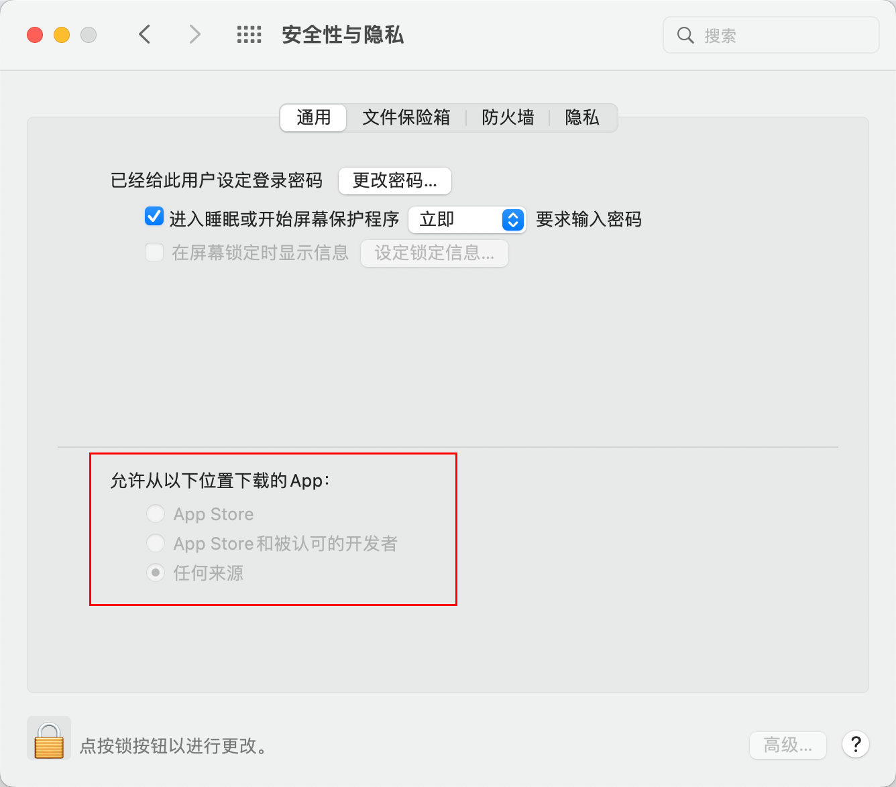

# 开启允许“任何来源”选项

> Mac从macOS Sierra 10.12开始，已经去除了允许“任何来源”的选项，如果不开启“任何来源”选项，会直接影响到无法运行第三方应用。比如出现这个问题：


开启方法如下：

1、打开终端，输入命令

```shell
sudo spctl --master-disable
```

2、打开系统偏好设置，进入安全性和隐私，会发现已经选定“任何来源”

