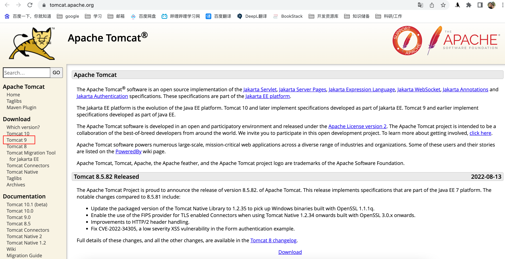
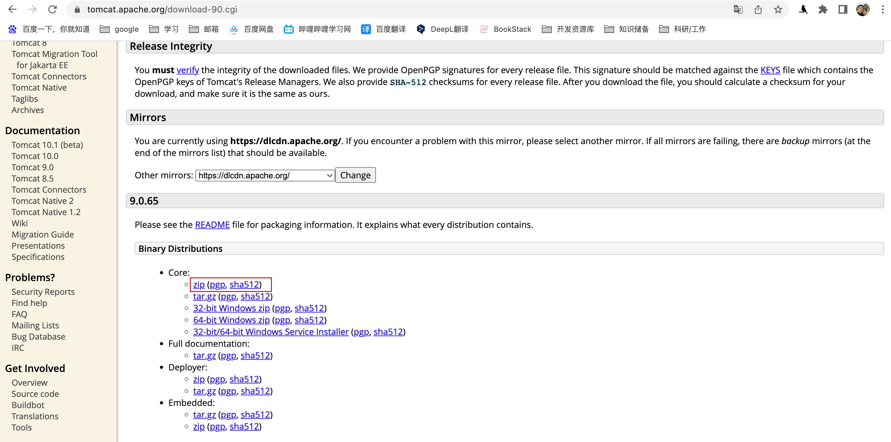
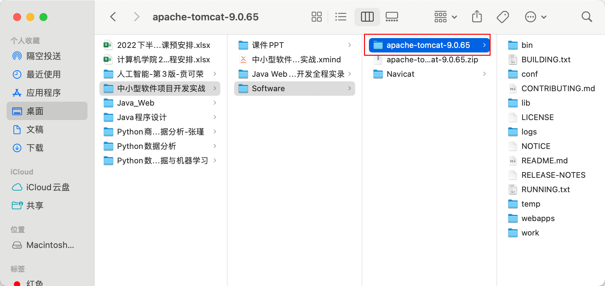
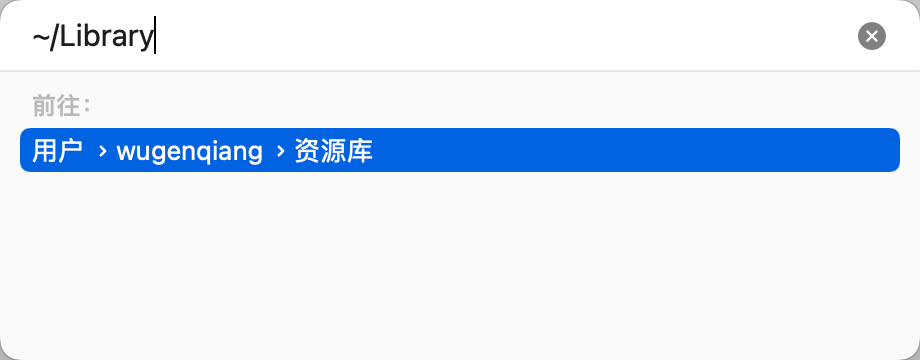
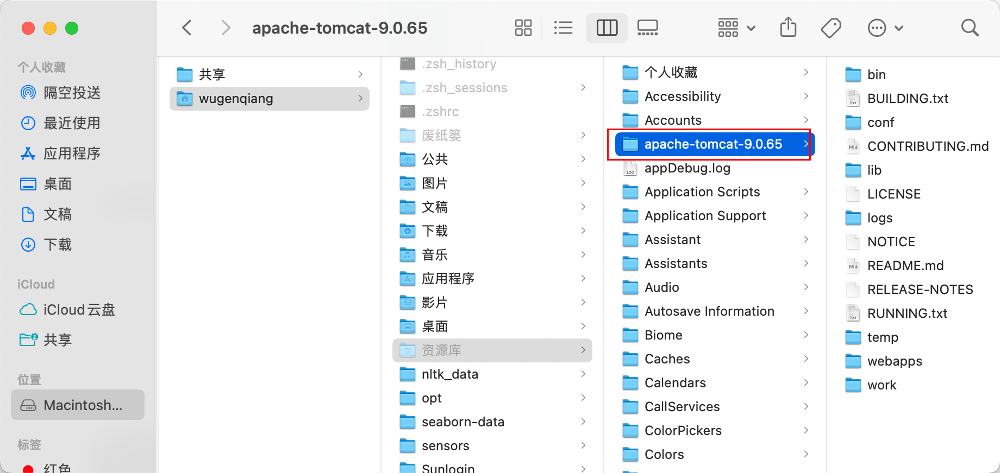
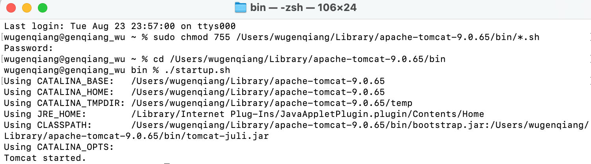
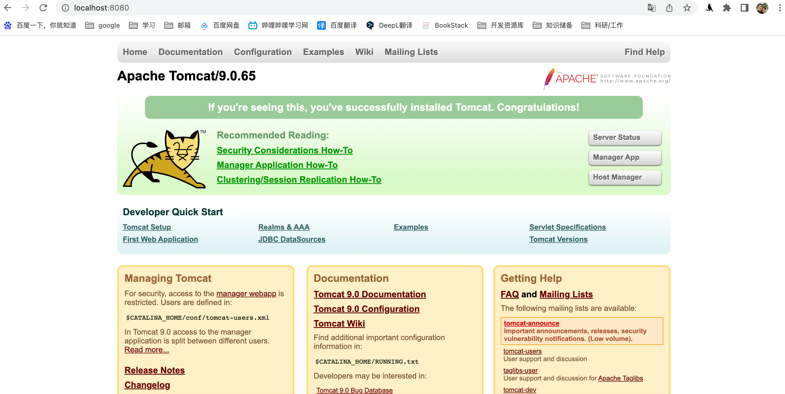

# 安装Tomcat

> Tomcat服务器是一个免费的开放源代码的Web应用服务器，属于轻量级应用服务器，在中小型系统和并发访问用户不是很多的场合下被普遍使用，是开发和调试JSP程序的首选。

## 1、下载Tomcat

首先，进Tomcat官网（https://tomcat.apache.org/），选择所需要的Tomcat版本，这里我选择的是Tomcat9。



点击进去，选择zip(pgp, sha512)下载。



## 2、解压

下载完成后，使用解压缩软件进行解压，并将文件放入/Library（资源库）中。



> 将上图的文件拷贝放在/Library(资源库中)：找到Tomcat文件并拷贝，然后按`shift+command+g` 弹出下面的窗口，在此窗口输入：~/Library，点击前往



把Tomcat文件粘贴到此目录下，如图所示：



## 3、配置Tomcat

打开终端，先给tomcat文件bin目录下的所有.sh文件赋予执行权限，输入命令：

```shell
sudo chmod 755 /Users/wugenqiang/Library/apache-tomcat-9.0.65/bin/*.sh
```

> chmod：改变一个或多个文件的存取模式
>
> 755：代表用户对该文件拥有读、写、执行的权限，同组的其他人员拥有执行和读的权限，没有写的权限，其他用户的权限和同组人员一样。
>
> 777：代表user, group,others，都具有读、写、执行的权限。

在终端中继续输入下面命令，进入bin目录下：

```shell
cd /Users/wugenqiang/Library/apache-tomcat-9.0.65/bin
```

## 4、启动Tomcat

```shell
./startup.sh
```

Tomcat顺利启动成功，终端操作过程如图所示：



在浏览器中输入：http://localhost:8080/，出现下面界面，表示Tomcat真正启动成功。



## 5、关闭Tomcat

终端中输入`./shutdown.sh`就可以关闭Tomcat服务器了。

```shell
./shutdown.sh
```

注意：启动Tomcat或关闭Tomcat都要在`bin`目录下进行。