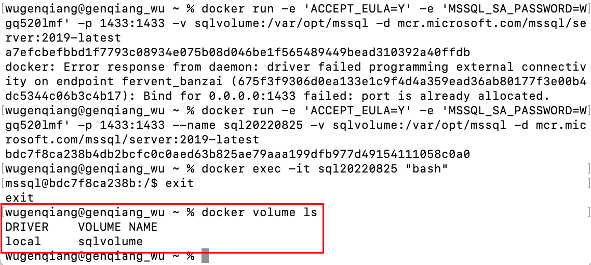
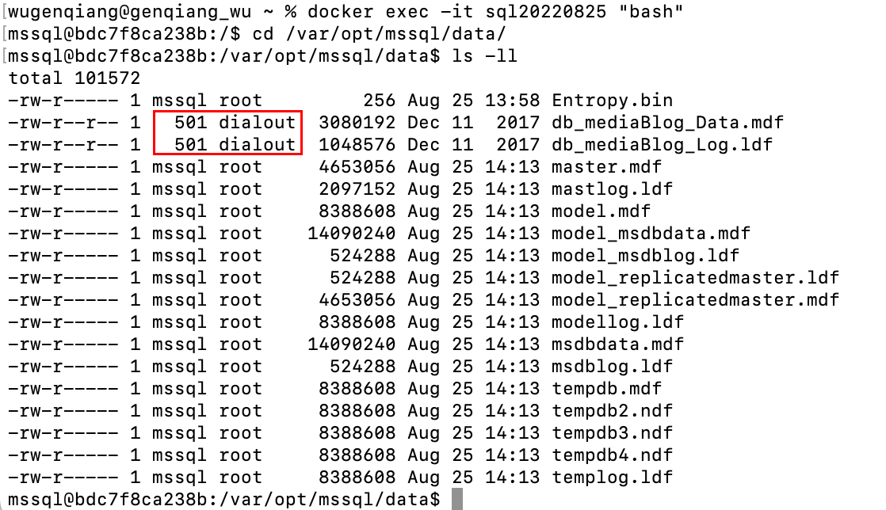
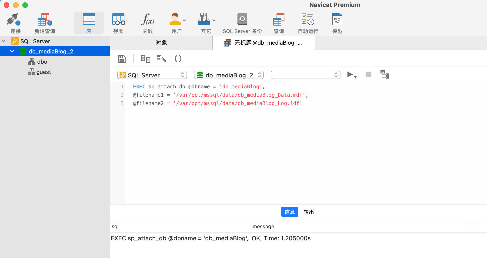
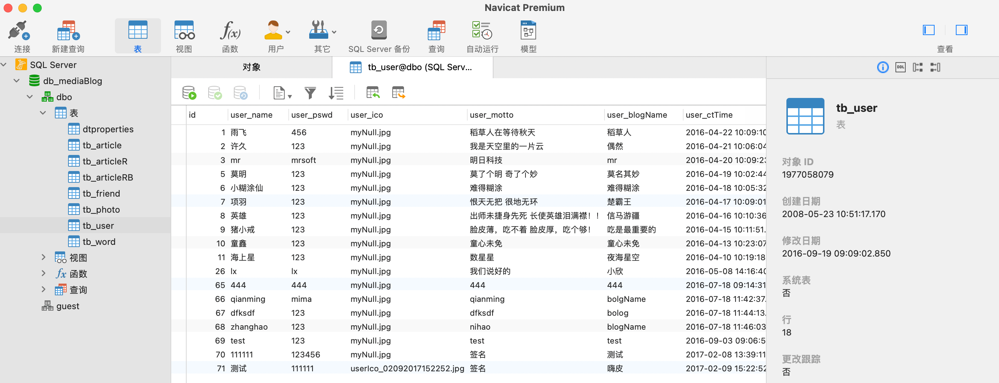

# Mac Docker SQL Server导入.mdf/.ldf文件

> 难受哇，之前用Navicat连接上了Docker SQL Server容器，但是导入不了`.mdf`和`.ldf`文件，今天搜集了好几个小时的资料，终于解决了这个问题：

1、创建带有数据卷的SQL Server容器

```shell
docker run -e 'ACCEPT_EULA=Y' -e 'MSSQL_SA_PASSWORD=Wgq520lmf' -p 1433:1433 --name sql20220825 -v sqlvolume:/var/opt/mssql -d mcr.microsoft.com/mssql/server:2019-latest
```

2、使用 `docker volume ls` 查看是否创建成功，成功的话会显示如图所示：



3、修改SA密码：

SA 帐户是安装过程中在 SQL Server 实例上创建的系统管理员。 创建 SQL Server 容器后，通过在容器中运行 echo $SA_PASSWORD，可发现指定的 SA_PASSWORD 环境变量。 出于安全考虑，需要更改 SA 密码。

```shell
sudo docker exec -it sql20220825 /opt/mssql-tools/bin/sqlcmd -S localhost -U SA -P "Wgq520lmf" -Q 'ALTER LOGIN SA WITH PASSWORD="Wgq520lmf"'
```

4、在docker容器中创建文件夹并把`.mdf`和`.ldf`文件复制进去：

```shell
docker exec -it sql20220825 mkdir /var/opt/mssql/data
docker cp /Users/wugenqiang/Desktop/sql/xx.mdf sql20220825:/var/opt/mssql/data/xx.mdf 
docker cp /Users/wugenqiang/Desktop/sql/xx.ldf sql20220825:/var/opt/mssql/data/xx.ldf
```

4、然后修改`.mdf`和`.ldf`文件的权限！会发现，复制进去的文件没有写权限！这一步一定要用root用户访问，不然没有修改权限！



使用root用户启动docker容器：

```shell
docker exec -it -u root sql20220825 "bash"
```

改权限可以用：

```shell
chmod 666 xx.ldf
chown -R root:root xx.ldf
```

5、接下来用Navicat Premium导入。

（1）先连接sql-server，然后新建数据库。

（2）双击数据库打开（变绿色），然后点击左上方的新建查询，输入下面代码(dbname无所谓)：

```shell
EXEC sp_attach_db @dbname = 'db_mediaBlog',
@filename1 = '/var/opt/mssql/data/db_mediaBlog_Data.mdf',
@filename2 = '/var/opt/mssql/data/db_mediaBlog_Log.ldf'
```

结果如下：



需要重启Navicat Premium才能看见，重启。

导入成功！



这一路太不容易了，还是要继续加油！