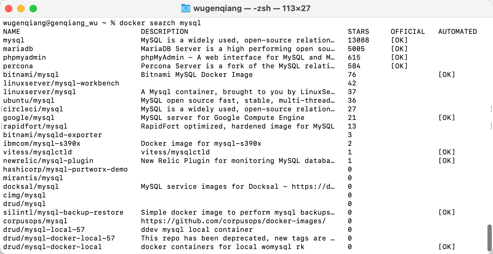
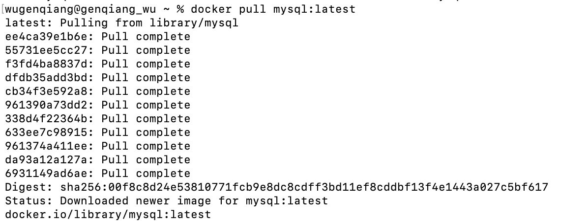
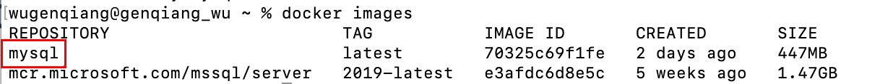
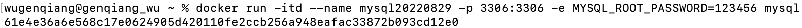
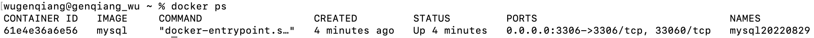
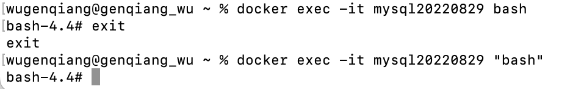
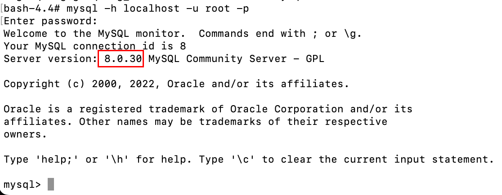
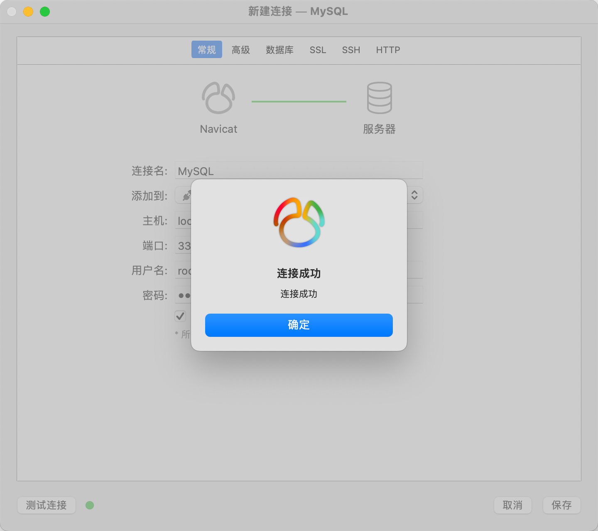
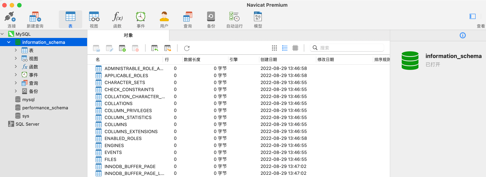

# Docker安装MySQL

> MySQL是世界上最受欢迎的开源数据库，凭借其可靠性、易用性和性能，MySQL已成为Web应用程序的数据库优先选择。

## 查看可用的MySQL版本

```shell
docker search mysql
```

如图所示：



## 拉取MySQL镜像

这里我们拉取官方的最新版本的镜像：

```shell
docker pull mysql:latest
```

如图所示：



## 查看本地镜像

查看是否已经安装了MySQL：

```shell
docker images
```

如图所示：



## 运行容器

安装完成后，使用下列命令来运行MySQL容器：

```shell
docker run -itd --name mysql20220829 -p 3306:3306 -e MYSQL_ROOT_PASSWORD=123456 mysql
```

参数说明：

* **-p 3306:3306** ：映射容器服务的 3306 端口到宿主机的 3306 端口，外部主机可以直接通过**宿主机ip:3306**访问到 MySQL 的服务。
* **MYSQL_ROOT_PASSWORD=123456**：设置 MySQL 服务 root 用户的密码。

运行结果如下：



## 安装成功

通过`docker ps`命令查看是否安装成功：



## 进入容器

```shell
docker exec -it mysql "bash"
```

如图：



## 登录MySQL

本机可以通过 root 和密码 123456 访问 MySQL 服务。

使用命令：

```shell
mysql -h localhost -u root -p
```

如图所示：



安装成功！

## 使用Navicat连接



这就说明咱们弄好啦！




