# Linux 学习笔记

## 1 前言

### 1.1 Linux 简介

Linux 有两种含义：

* 一种是 Linus 编写的开源操作系统的内核。
* 另一种是广义的操作系统。

### 1.2 环境准备

* 云主机
* 无数据的 PC（不推荐多系统混跑）
* 虚拟机（推荐方式）

### 1.3 Linux 版本

#### 1.3.1 内核版本

内核版本分为三部分：

* 主版本号
* 次版本号
  * 次版本号是奇数为开发版，偶数为稳定版
* 末版本号

下载地址：[https://www.kernel.org/](https://www.kernel.org/)

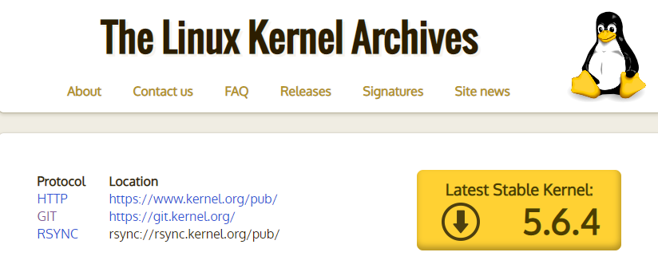


#### 1.3.2 发行版本

* 版本一：RedHat


* 版本二：Fedora


* 版本三：CentOS


* 版本四：Debian


* 版本五：Ubuntu


### 1.4 终端的使用

* 终端
  * 图形终端
  * 命令行终端
  * 远程终端（SSH、VNC）

### 1.5 常见目录介绍

```
/ 根目录
/root root用户的家目录
/home/username 普通用户的家目录
/etc 配置文件目录
/bin 命令目录
/sbin 管理命令目录
/usr/bin /usr/sbin 系统预装的其他命令
```

### 1.6 万能的帮助命令


#### 1.6.1 man 帮助

* man 是 manual 的缩写
* man 帮助用法演示
  * man ls
  * 获取第一章帮助信息：
    * man 1 ls  

```
[root@wugenqiang ~]# man ls
```

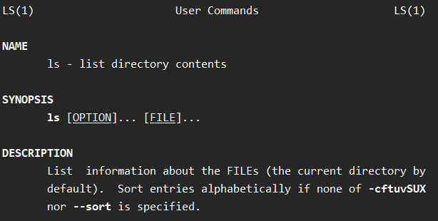

* man 也是一条命令，分为 9 章，可以使用 man 命令获取 man 的帮助
  * man man
  * man 7 man

```
[root@wugenqiang ~]# man man
[root@wugenqiang ~]# man 7 man
```


#### 1.6.2 help 帮助

* shell（命令解释器）自带的命令称为内部命令，其他的是外部命令。
* 内部命令使用 help 帮助
  * help cd
  * cd --help
* 外部命令使用 help 帮助
  * ls --help

> 使用 type 区分内部和外部命令：

举例：

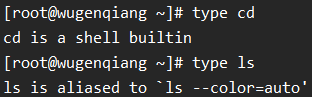


#### 1.6.3 info 帮助

* info 帮助比 help 更详细，作为 help 的补充
  * info ls


> 当然也可以使用网络资源（搜索引擎和文档）

## 2 系统操作

### 2.1 基础操作

> 一切皆文件

* 目录文件的创建与删除
* 通配符（*，？，...）
* 文件操作
* 文件查看
* ...

#### 2.1.1 显示当前的目录名称

* pwd 显示当前的目录名称

```
[root@wugenqiang ~]# pwd
/root
```


#### 2.1.2 更改当前的操作目录

* cd 更改当前的操作目录
  * cd /path/to... 绝对路径
  * cd ./path/to/... 相对路径
  * cd ../path/to/... 相对路径

#### 2.1.3 查看当前目录下的文件

* ls 查看当前目录下的文件
  * ls [选项，选项...] 参数...
  * ls file* 显示以 file 开头的文件
* 常用参数
  * -l 长格式显示文件
  * -a 显示隐藏文件
  * -r 逆序显示
  * -t 按照时间顺序显示
  * -R 递归显示

* 举例：

```
[root@wugenqiang ~]# ls /
bin   dev  home  lib64  mnt  proc  run   srv  @System.solv  usr
boot  etc  lib   media  opt  root  sbin  sys  tmp           var
[root@wugenqiang ~]# ls /root
anaconda-ks.cfg  initial-setup-ks.cfg  公共  文档  模板  音乐
enjoytoshare     下载                  图片  桌面  视频
[root@wugenqiang ~]# ls /usr
bin    include  lib64    local  share  tmp
games  lib      libexec  sbin   src
[root@wugenqiang ~]# ls /root /
/:
bin   dev  home  lib64  mnt  proc  run   srv  @System.solv  usr
boot  etc  lib   media  opt  root  sbin  sys  tmp           var

/root:
公共  视频  文档  音乐  anaconda-ks.cfg  initial-setup-ks.cfg
模板  图片  下载  桌面  enjoytoshare
[root@wugenqiang ~]# ls -l
总用量 8
drwxr-xr-x. 2 root root    6 4月  14 21:02 公共
drwxr-xr-x. 2 root root    6 4月  14 21:02 模板
drwxr-xr-x. 2 root root    6 4月  14 21:02 视频
drwxr-xr-x. 2 root root    6 4月  14 21:02 图片
drwxr-xr-x. 2 root root    6 4月  14 21:02 文档
drwxr-xr-x. 2 root root    6 4月  14 21:02 下载
drwxr-xr-x. 2 root root    6 4月  14 21:02 音乐
drwxr-xr-x. 2 root root    6 4月  14 21:02 桌面
-rw-------. 1 root root 1676 4月  14 20:57 anaconda-ks.cfg
drwxr-xr-x. 3 root root   23 4月  14 22:12 enjoytoshare
-rw-r--r--. 1 root root 1831 4月  14 21:01 initial-setup-ks.cfg
[root@wugenqiang ~]# ls -a
.     下载             .bashrc       .ICEauthority
..    音乐             .cache        initial-setup-ks.cfg
公共  桌面             .config       .local
模板  anaconda-ks.cfg  .cshrc        .pki
视频  .bash_history    .dbus         .tcshrc
图片  .bash_logout     enjoytoshare  .Xauthority
文档  .bash_profile    .esd_auth
[root@wugenqiang ~]# ls -l -r
总用量 8
-rw-r--r--. 1 root root 1831 4月  14 21:01 initial-setup-ks.cfg
drwxr-xr-x. 3 root root   23 4月  14 22:12 enjoytoshare
-rw-------. 1 root root 1676 4月  14 20:57 anaconda-ks.cfg
drwxr-xr-x. 2 root root    6 4月  14 21:02 桌面
drwxr-xr-x. 2 root root    6 4月  14 21:02 音乐
drwxr-xr-x. 2 root root    6 4月  14 21:02 下载
drwxr-xr-x. 2 root root    6 4月  14 21:02 文档
drwxr-xr-x. 2 root root    6 4月  14 21:02 图片
drwxr-xr-x. 2 root root    6 4月  14 21:02 视频
drwxr-xr-x. 2 root root    6 4月  14 21:02 模板
drwxr-xr-x. 2 root root    6 4月  14 21:02 公共
[root@wugenqiang ~]# ls -l -t
总用量 8
drwxr-xr-x. 3 root root   23 4月  14 22:12 enjoytoshare
drwxr-xr-x. 2 root root    6 4月  14 21:02 公共
drwxr-xr-x. 2 root root    6 4月  14 21:02 模板
drwxr-xr-x. 2 root root    6 4月  14 21:02 视频
drwxr-xr-x. 2 root root    6 4月  14 21:02 图片
drwxr-xr-x. 2 root root    6 4月  14 21:02 文档
drwxr-xr-x. 2 root root    6 4月  14 21:02 下载
drwxr-xr-x. 2 root root    6 4月  14 21:02 音乐
drwxr-xr-x. 2 root root    6 4月  14 21:02 桌面
-rw-r--r--. 1 root root 1831 4月  14 21:01 initial-setup-ks.cfg
-rw-------. 1 root root 1676 4月  14 20:57 anaconda-ks.cfg
```

多条命令可以简化操作：

比如：ls -l -r -t 等价于 ls -lrt


#### 2.1.4 用户切换

* su - root 切换为 root 用户

```
[root@wugenqiang ~]# su - root
```

* su 切换用户
  * su - username 使用 login shell 方式切换用户
* sudo 以其他用户身份执行命令
  * visudo 设置需要使用 sudo 的用户（组）

#### 2.1.5 清屏操作

* clear 命令 ：清屏操作或者 Ctrl + l

```
[root@wugenqiang ~]# clear
```

#### 2.1.6 创建和删除目录

* mkdir 建立空目录
* rmdir 删除空白目录
* rm -r  删除非空目录或者空目录，但是会提示是否删除
* rm -rf 不提示直接删除目录（rm -r -f  xxx）

#### 2.1.7 复制、移动和重命名

* cp -r /root/a /tmp 复制目录
* touch file.txt 创建文件
* cp file.txt /tmp 复制文件
* cp -v file.txt /tmp 复制文件并且显示复制过程

* cp -p  复制保留原有的时间，保留用户、权限、时间等文件属性
* cp -a 复制保留所有信息不变，等同于 cp -dpR
* cp file* / 复制以 file 开头的文件到根目录
* cp file? / 复制单个字符任意的文件到根目录
* mv 源文件 目标文件   移动文件
  * mv filea  /tmp/fileb 移动文件并重命名
* mv  /dir /tmp 移动文件夹
* mv * 移动所有文件

#### 2.1.8 通配符

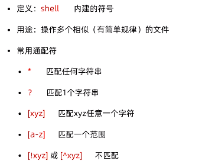

#### 2.1.9 文本查看

* cat 文本内容显示到终端
* head 查看文件开头，默认显示开头 10 行
  * head -5 /tmp 查看文件前 5 行
* tail 查看文件结尾，默认显示结尾 10 行
  * tail -3 /tmp  查看文件后 3 行
  * 常用参数 -f 文件内容更新后，显示信息同步更新，进行跟踪
* wc 统计文件内容信息
  * wc -l /tmp 查看文件有多少行

* less 和 more 显示文件内容
  * less /temp
  * more /tmp

#### 2.1.10 打包、压缩、解包和解压缩

* tar 打包命令
* 常用参数
  * c 打包
  * x 解包
  * f 指定操作类型为文件

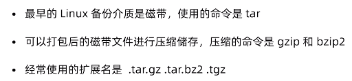

> 打包

* tar cf enjoytoshare.tar enjoytoshare

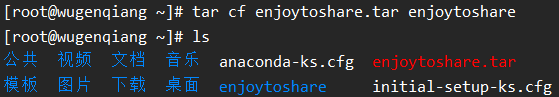

* 查看打包文件大小

```
[root@wugenqiang ~]# ls -l enjoytoshare.tar 
-rw-r--r--. 1 root root 51200 4月  16 11:34 enjoytoshare.tar
[root@wugenqiang ~]# ls -lh enjoytoshare.tar 
-rw-r--r--. 1 root root 50K 4月  16 11:34 enjoytoshare.tar
```

> 压缩

* gizp 或者 bzip2，tar 集成了这两个操作

> 故，打包并压缩的操作为：

* tar czf enjoytoshare.tar

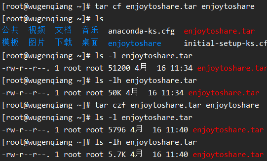

为了让别人知道是进行哪种压缩的，一般采用双扩展名的形式：

* tar czf enjoytoshare.tar.gz enjoytoshare

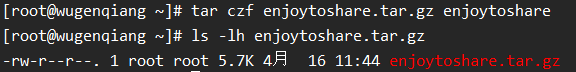

* tar cjf enjoytoshare.tar.bzip2 enjoytoshare
* 缩写为：tar cjf enjoytoshare.tar.bz2 enjoytoshare

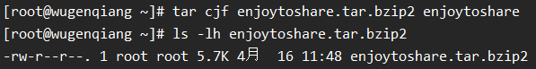

注：gz 速度比 bz2 好，压缩效果 gz 不如 bz2 好。

> 解包

* tar xf enjoytoshare.tar  -C  /root

> 解压缩

* tar zxf enjoytoshare.tar.gz  -C  /root
* tar jxf enjoytoshare.tar.bz2  -C  /root

注意：双扩展名为方便使用可以写成：

* .tar.bz2 ==> .tbz2  
* .tar.gz ==> .tgz

### 2.2 文本编辑器

#### 2.2.1 vi 多模式文本编辑器

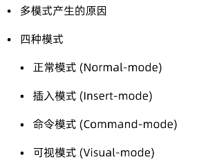

命令行输入 vi 显示：

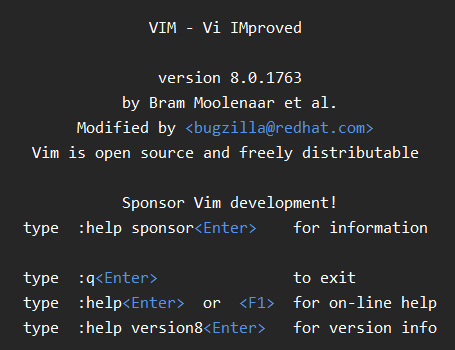

下面通过 vim 一起学习 vi 的四种模式。

#### 2.2.2 vim 文本编辑器

> 正常模式

* vi

> 插入模式

* 按 i 键，进入插入模式，可以编辑文本内容，按 esc 回到命令模式
* shift + i 会进入插入模式光标那一行的开头
* a 和 A，o 和 O 同样可以从命令模式进入到插入模式

> 命令模式

* vim xxx 即可进入命令模式

> 可视模式

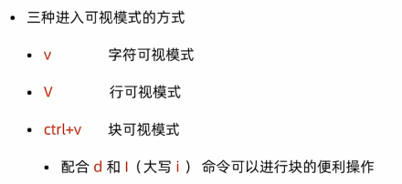

### 2.3 用户和权限管理

#### 2.3.1 新建用户

多用户包括 root 用户和普通用户

* useradd 用户名

* id 用户名 （可以查看是否存在该用户）

#### 2.3.2 设置密码

* passwd 用户名（修改指定用户的密码）
* passwd （修改当前用户的密码）

#### 2.3.3 删除用户

* userdel 用户名 （删除指定用户但是会保留家目录）
* userdel -r 用户名 （删除指定用户，不保留家目录）

#### 2.3.4 修改用户

* usermod  选项 用户名（修改用户属性）
  * usermod -d /home/xxx 用户名（修改用户家目录）
  * usermod -g group1 用户名 （修改用户的用户组）
* chage （修改用户生命周期）

#### 2.3.5 组管理命令

* groupadd （新建用户组）
* groupdel （删除用户组）


## 3 服务管理


## 4 Shell 脚本


## 5 文本操作


## 6 常用服务搭建


