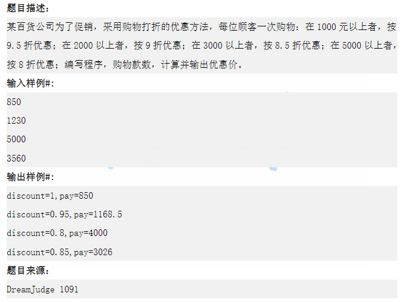

# 机试指南

## 第一章 从零开始

### OJ 网站

* [OJ-Websites](OJ/OJ-websites.md)

### 做题结果反馈

* Accepted
  * 答案正确
* Wrong Answer
  * 答案错误：程序实现或者思路出现问题，也可能是数据范围边界没有考虑到
* Runtime Error
  * 运行时错误：数组越界或者递归过深导致栈溢出
* Presentation Error
  * 输出格式错误：一般是末尾多了或少了空格或少了换行
* Time Limit Exceeded
  * 程序运行超时：算法不够优秀，程序运行时间过长
* Memory Limit Exceeded
  * 运行内存超限：程序申请太大了空间，超过了题目规定的空间大小

* Compile Error
  * 编译错误：代码存在语法错误，检查是不是选择错误的语言提交了
* Output Limit Exceeded
  * 输出超限：程序输出过多的内容，一般是循环出了问题导致多次输出或者调试信息忘记删除了
* Submitting
  * 提交中，等待题目结果的返回，由于判题机有性能差异所以返回结果也不一样

### 输入输出技巧

```c
//输入int型变量
scanf("%d",&x);
//输入double型变量
scanf("%lf",&x);//不用float直接double
//输入char类型变量
scanf("%c",&x);
//输入字符串数组
scanf("%s",s);
//输出与输入表示方式一致
printf("%s\n",s);
```

* scanf 输入解析

  * 输入日期 2020 - 03 - 21

  * ```c
    int year,month,day;
    scanf("%d-%d-%d",&year,&month,&day);
    printf("%d %d %d\n",year,month,day);
    ```

  * 输入时间 18 : 21 : 30

  * ```c
    int hour,minute,second;
    scanf("%d:%d:%d",&hour,&minute,&second);
    printf("%d %d %d\n",hour,minute,second);
    ```

* scanf 和 gets

输入一行字符串带空格的话，使用 gets，scanf 遇到空格会自动结束

```c
char s[105];
gets(s);
printf("%s\n",s);
```

* getchar 和 putchar

读入单个字符和输出单个字符，一般在 scanf 和 gets 中间使用 getchar 用于消除回车 '\n' 的影响

* 输出进制转换

```c
int a = 10;
printf("%x\n",a);//小写十六进制输出a
printf("%X\n",a);//大写十六进制输出A
printf("%o\n",a);//八进制输出答案12
```

* 输出增加前置0

```c
int a = 5;
printf("%02d\n",a);//2代表宽度，不足的地方用0补充
输出结果 05
printf("%04d\n",a);
输出结果 0005
```

* 输出保留小数

```c
double a = 3.6;
printf("%.2lf\n",a);//2表示保留两位小数
输出结果 3.60
```

注：有小数输出小数，没小数输出整数，前提是输入的类型浮点类型

```c
%g
```

Example：

```c
#include <stdio.h>
int main(){
	
	double a = 2;
	double b = 2.5467;
	printf("a = %g\n",a);
	printf("b = %g\n",b);
	
	return 0;
} 
```

Test Result：


* long long 的使用

很多情况下的计算会超过 int，比如求 N!，N 比较大的时候 int 就存不下了，这个时候我们就要使用 long long。

注：int 取值范围：-1e9 到 1e9，long long 取值范围：-1e18 到 1e18

```c
long long x;
scanf("%11d",&x);
printf("%lld\n",x);
```

* 字符的 ASCII 码

```c
printf("%d\n",'a');
```

注：若遇到需要 ASCII 码的题目，记住 char 字符和 int 值是可以相互转化的。

* cin 和 cout

很多时候使用 c++ 的输入输出更简单，在应对输入输出量不是很大的题目的时候，我们会采用 cin 和 cout 来提高我们的解题速度。

Example：求两个数之和

 ```cpp
#include <iostream>//输入输出函数的头文件 
using namespace std;

int main(){
	
	int a,b;
	cin >> a >> b;
	cout << a + b;
	
	return 0;
} 
 ```

> 注：平时练习的时候不要排斥混合编程，即 C 与 C++ 混用，然后用 C++ 提交。但是注意：printf 尽量不要和 cout 同时使用，会发生一些不可控的意外。

### 头文件技巧

cpp 文件中推荐一个万能头文件：

```cpp
#include <bits/stdc++.h>
using namespace std;
```

注：要看考试的评测机型支不支持，绝大部分都是支持的，当然准备一个完整的头文件还是有必要的，作为备用。

```cpp
#include <stdio.h>
#include <string.h>
#include <math.h>
#include <stdlib.h>
#include <time.h>
#include <algorithm>
#include <iostream>
#include <queue>
#include <stack>
#include <vector>
#include <string>
using namespace std;

int main(){
	
	return 0;
} 
```

注：头文件可以多，但是不能少

### 数组使用技巧

> 数组除了可以存储数据以外，还可以用来进行标记

例题 01：


【代码实现】

```cpp
#include <bits/stdc++.h>//万能头文件 
using namespace std;

int f[105]={0};//注意：尽量将数组开在全局 
int main(){
	int n,x;
	scanf("%d",&n);
	for(int i=0;i<n;i++){
		scanf("%d",&x);
		f[x]++;
	} 
	for(int i=1;i<=100;i++){
		if(f[i]>0){
			printf("%d %d\n",i,f[i]);
		}
	}
	return 0;
} 
```

例题 02：


【代码实现】

```cpp
#include <bits/stdc++.h>//万能头文件 
using namespace std;

int f[105] = {0};//注意：尽量将数组开在全局 
int p[105] = {0};//p[i]表示有 i个这样的数的最大值是多少 
int main(){
	int n,x;
	scanf("%d",&n);
	for(int i=0;i<n;i++){
		scanf("%d",&x);
		f[x]++;
	} 
	for(int i=0;i<100;i++){
		p[f[i]] = i;
	} 
	for(int i=1;i<=100;i++){
		if(p[i]>0){
			printf("%d %d\n",p[i],i);
		}
	}
	return 0;
} 
```


例题 03：

【题目】二维数组实现存储地图

```
####
#.##
##@#
####
```

【代码实现】

```cpp
#include <bits/stdc++.h>//万能头文件 
using namespace std;

char mpt[10][10];
int main(){
	for(int i=0;i<4;i++){
		scanf("%s",mpt[i]);
	}
	for(int i=0;i<4;i++){
		for(int j=0;j<4;j++){
			printf("%c",mpt[i][j]);
		}
		printf("\n");
	}

	return 0;
} 
```

### 复杂度与是否可做

> 做好审时度势

|   算法   |   循环嵌套    | 时间复杂度 | 空间复杂度 |
| :------: | :-----------: | :--------: | ---------- |
| 冒泡排序 | 两个 for 循环 |   O(N^2​)   |            |

注：空间复杂度一般不会限制，如果遇到了再想办法优化空间。

> 时限 1 s 情况下的复杂度：

| 时间复杂度 | N 取值（时限 1 s） |
| ---------- | ------------------ |
| O(N)       | N 最大在 500w 左右 |
| O(NlogN​)   | N 最大在 20w 左右  |
| O(N^2​)     | N 最大在 2000 左右 |
| O(N^2logN​) | N 最大在 700 左右  |
| O(N^3​)     | N 最大在 200 左右  |
| O(N^4​)     | N 最大在 50 左右   |
| O(2^N​)     | N 最大在 24 左右   |
| O(N!)​      | N 最大在 10 左右   |

注：如果是 2S、3S 对应的乘以 2 和 3 就可以。

### C++ STL 的使用

?> C++ 的算法头文件里有很多实用的函数，我们可以直接拿来用。

```cpp
#include <algorithm>
```

#### 排序函数 

* sort()

* 依次传入三个参数，要排序区间的起点，要排序区间的终点+1，比较函数。比较函数可以不填，则默认为从小到大排序

* 示例：

* ```cpp
  #include <bits/stdc++.h>
  using namespace std;
  
  int a[105];
  int main(){
      int n;
      scanf("%d",&n);
      for(int i=0;i<n;i++){
      	scanf("%d",&a[i]);
  	}
  	sort(a,a+n);
  	for(int i=0;i<n;i++){
  		printf("%d ",a[i]);
  	}
      return 0;
  }
  ```


#### 查找函数

* lower_bound() 函数

* upper_bound() 函数

* lower_bound() 和 upper_bound() 都是利用二分查找的方法在一个排好序的数组中进行查找的。

* 在从小到大的排序数组中：

* lower_bound(begin,end,num)：从数组的 begin 位置到 end-1 位置二分查找第一个大于或等于 num 的数字，找到返回该数字的地址，不存在则返回 end。通过返回的地址减去起始地址 begin,得到找到数字在数组中的下标

* upper_bound(begin,end,num)：从数组的 begin 位置到 end-1 位置二分查找第一个大于 num 的数字，找到返回该数字的地址，不存在则返回 end。通过返回的地址减去起始地址 begin,得到找到数字在数组中的下标

* 重载 lower_bound() 和 upper_bound() 

* lower_bound(begin,end,num,greater< type >()):

* 从数组的 begin 位置到 end-1 位置二分查找第一个小于或等于 num 的数字，找到返回该数字的地址，不存在则返回 end。通过返回的地址减去起始地址 begin,得到找到数字在数组中的下标

* upper_bound(begin,end,num,greater< type >()):

* 从数组的 begin 位置到 end-1 位置二分查找第一个小于 num 的数字，找到返回该数字的地址，不存在则返回 end。通过返回的地址减去起始地址 begin,得到找到数字在数组中的下标

* 示例：

* ```cpp
  //查找函数
  #include <bits/stdc++.h>
  using namespace std;
  
  int cmp(int a,int b);
  int main(){
      int num[6]={1,2,4,7,15,34};
      sort(num,num+6);//按从小到大排序
      //返回数组中第一个大于或等于被查数的值
  	int pos1 = lower_bound(num,num+6,7)-num;
  	//返回数组中第一个大于被查数的值
  	int pos2 = upper_bound(num,num+6,7)-num;
  	cout<<pos1<<" "<<num[pos1]<<endl;
  	cout<<pos2<<" "<<num[pos2]<<endl;
  	sort(num,num+6,cmp);//按从大到小排序
  	//返回数组中第一个小于或等于被查数的值
  	int pos3 = lower_bound(num,num+6,7,greater<int>())-num;
  	//返回数组中第一个小于被查数的值
  	int pos4 = upper_bound(num,num+6,7,greater<int>())-num;
  	cout<<pos3<<" "<<num[pos3]<<endl;
  	cout<<pos4<<" "<<num[pos4]<<endl;
  	 
      return 0;
  }
  
  int cmp(int a,int b){
  	return a>b;
  }
  ```


#### 优先队列

* 通过 priority_queue< int >q 来定义一个储存整数的空的 priority_queue。当然 priority_queue 可以存任何类型的数据，比如 priority_queue< string >q 等等。

* 示例：

* ```cpp
  //#include <bits/stdc++.h>
  #include <iostream>
  #include <queue>
  using namespace std;
  
  int main(){
      priority_queue<int> q;//定义一个优先队列
  	q.push(1);//入队 
  	q.push(2);
  	q.push(3);
  	while(!q.empty()){//判读队列不为空 
  		cout << q.top() << endl; //队首元素 
  		q.pop();//出队 
  	} 
      return 0;
  }
  ```

> C++ 的 STL (标准模板库)是一个非常重要的东西，可以极大的帮助更快速的解决题目

#### vector

* 通过 vector< int >v 来定义一个储存整数的空的 vector。当然 vector 可以存任何类型的数据，比如 vector< string >v 等等

* 示例：

* ```cpp
  //#include <bits/stdc++.h>
  #include <iostream>
  #include <vector>
  using namespace std;
  
  int main(){
      vector<int> v;//定义一个空的 vector
  	for(int i=1;i<=10;i++){
  		v.push_back(i*i);//加入到 vector 中 
  	} 
  	for(int i=0;i<v.size();i++){
  		cout<<v[i]<<" ";//访问 vector 元素 
  	} 
  	cout << endl; 
      return 0;
  }
  ```

* Result：


#### queue

* 通过 queue< int >q 来定义一个储存整数的空的 queue。当然 queue 可以存任何类型的数据，比如 queue< string >q 等等

* 示例：

* ```cpp
  #include <iostream>
  #include <queue>
  using namespace std;
  int main()
  {
  	queue<int> q;//定义一个队列
  	q.push(1);
  	q.push(2);
  	q.push(3);
  	while(!q.empty()){//当队列不为空 
  		cout << q.front() << endl;//取出队首元素
  		q.pop();//出队 
  	} 
  	
  	return 0;
  }
  ```

#### stack

* 通过 stack< int >S 来定义一个全局栈来储存整数的空的 stack。当然 stack 可以存任何类型的数据，比如 stack< string >S 等等。

* 示例：

* ```cpp
  #include <iostream>
  #include <stack>
  using namespace std;
  int main()
  {
  	stack<int> s;//定义一个栈 
  	s.push(1);
  	s.push(10);
  	s.push(7);
  	while(!s.empty()){//当栈不为空 
  		cout << s.top() << endl;//取出栈顶元素
  		s.pop();//出栈 
  	} 
  	
  	return 0;
  }
  ```

#### map

* 通过 map< string, int >dict 来定义一个 key:value 映射关系的空的 map。当然 map 可以存任何类型的数据，比如 map< int, int >m 等等

* 示例：

* ```cpp
  #include <iostream>
  #include <string>
  #include <map>
  
  using namespace std;
  int main()
  {
  	map<string, int> dict;//定义一个 map
  	dict["Tom"] = 1;//定义映射关系
  	dict["Jone"] = 2;
  	dict["Mary"] = 1;
  	if(dict.count("Mary")){//查找 map
  		cout << "Mary is in class " << dict["Mary"]; 
  	} 
  	//使用迭代器遍历map和value
  	for(map<string, int>::iterator it = dict.begin();it != dict.end();++it){
  		cout << it->first << " is in class " << it->second << endl;
  	} 
  	dict.clear();//清空 map 
  	return 0;
  }
  ```

#### set

* 通过 set< string >country 来定义一个储存字符串的空的 set。当然 set 可以存任何类型的数据，比如 set< int >s 等等。

* ```cpp
  #include<iostream>
  #include<set>
  using namespace std;
  int main(){
  	set<string> country;//定义一个存放string的集合
  	country.insert("China");//插入操作
  	country.insert("America");
  	country.insert("France");
  	set<string>::iterator it;
  	//使用迭代器遍历集合元素
  	for(it=country.begin();it!=country.end();++it){
  		cout<<*it<<" ";
  	}
  	cout<<endl;
  	country.erase("American");//删除集合内的元素
  	country.erase("England");
  	if(country.count("China")){//统计元素个数
  		cout<<"China in country."<<endl;
  	}
  	country.clear();//清空集合
  	return 0;
  }
  ```

### 多组输入的问题

> 即循环输入输出结果

【题目描述】输入两个数，输出两个数的和，要求多组输入

【代码实现】

* Example 01：C 循环读入代码

```cpp
#include <bits/stdc++.h> 
using namespace std;
int main(){
	int a,b;
	while(scanf("%d%d",&a,&b)!=EOF){
		printf("%d\n",a+b);
	}
	return 0;
}
```

!> 不能使用 while(1) 这样死循环，!=EOF 的意思一直读取到文件末尾（Endoffile）另外，多组输入一定要注意初始化问题，数组和变量的初始化要放在 while 循环内，否则上一次的运算的结果会影响当前的结果。

* Example 02：C++ 循环读入代码

```cpp
#include <bits/stdc++.h> 
using namespace std;
int main(){
	int a,b;
	while(cin >> a >> b){
		cout << a + b << endl;
	}
	return 0;
}
```

* Example 03：Java 循环读入代码

```java
Scanner stdin = new Scanner(System.in);
while(stdin.hasnext()){
    String s = stdin.next();
    int n = stdin.nextInt();
    double b = stdin.nextDouble();
}
```

* Example 04：Python 循环读入代码

```python
while true:
    try:
        a, b = map(int, input().split())
        c = a + b
        print(c)
    except:#读到文件末尾抛出异常结束循环
        break
```

## 第二章 入门经典

### 简单模拟

> 不需要考虑什么算法，直接按照题目的意思进行模拟计算就可以了

举例：促销计算



【代码实现】

```cpp
#include <bits/stdc++.h> //万能头文件 
using namespace std;
int main(){
	double a;
	scanf("%lf",&a);
	//使用%g可以自动去掉小数点后多余的0，如果是整数则显示整数
	if (a<1000){
		printf("discount=1,pay=%g\n",a);
	} 
	if (a>=1000 && a<2000){
		printf("discount=0.95,pay=%g\n",a*0.95);
	}
	if (a>=2000 && a<3000){
		printf("discount=0.9,pay=%g\n",a*0.9);
	}  
	if (a>=3000 && a<5000){
		printf("discount=0.85,pay=%g\n",a*0.85);
	}  
	if (a>=5000){
		printf("discount=0.8,pay=%g\n",a*0.8);
	} 	
	
	return 0;
}
```

!> 简单模拟这类题目在考试中很常见，属于送分签到的题目，一定要确保做对。

### 进制转换

* 题型如下：
  * 反序数：输入一个整数如 123，将其转换为反序之后的整数 321
  * 10 进制转 2 进制：将一个 10 进制整数转化为一个 2 进制的整数
    * 如：7 转换为 111
  * 10 进制转 16 进制：将一个 10 进制整数转化为一个 16 进制的整数
    * 如：10 转换为 A
  * 10 进制转 x 进制：将一个 10 进制整数转化为一个 x 进制的整数
  * x 进制转 10 进制：将一个 x 进制整数转化为一个 10 进制的整数
  * x 进制转 y 进制：将一个 x 进制整数转化为一个 y 进制的整数
  * 字符串转浮点数
    * 如：31.25  先转整数部分，再转小数部分，最后相加即可
  * 浮点数转字符串
    * 如：23.45  将整数和小数拆开再合并成一个字符串
  * 字符串转整型和整型转字符串
    * 直接用 atoi 函数和 itoa 函数即可


## 暴力求解


## 排序与查找


## 字符串


## 数据结构一


## 数学问题


## 贪心策略


## 递归与分治


## 搜索


## 数据结构二


## 图论


## 动态规划


