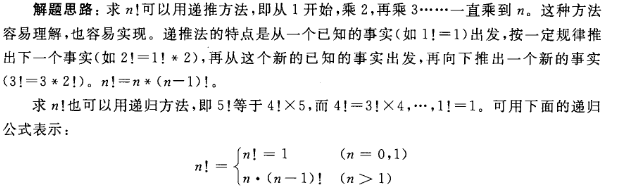
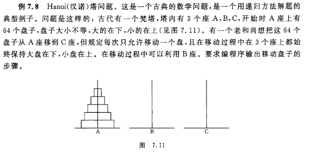

# C-Code

> C语言程序设计第四版——谭浩强著，此书中的代码题大部分已经在本文中展示，如果有作答不正确的地方或者可优化的地方，欢迎指正，谢谢！

## 001 屏幕输出指定信息

【题目】要求再屏幕上输出以下一行信息

This is a C program.

【代码】

```c
#include <stdio.h> 

int main(){
	printf("This is a C program.\n");
	return 0;
} 
```

## 002 求两个整数之和

【题目】a + b = ?

【代码】

```c
#include <stdio.h> 

int main(){
	int a,b,sum;
	a = 123;
	b = 456;
	sum = a + b;
	printf("sum = %d\n",sum); 
	return 0;
} 
```

## 003 求两个整数中较大者

【题目】求两个整数中较大者

【代码】

```c
#include <stdio.h> 

int max(int x,int y);

int main(){
	int a,b,c;
	scanf("%d,%d",&a,&b);
	c = max(a,b);
	printf("max = %d\n",c);
	return 0;
} 
//求两个整数中较大者 
int max(int x,int y){
	return x>y?x:y; 
}
```

## 004 求三个整数中的最大者

【题目】编写一个 C 程序，输入 a，b，c 三个整数，输出其中最大者

【代码】

* Example 01：

```c
#include <stdio.h> 

int max(int x,int y,int z);

int main(){
	int a,b,c,d;
	scanf("%d,%d,%d",&a,&b,&c);
	d = max(a,b,c);
	printf("max = %d\n",d);
	return 0;
} 
//求3个整数中较大者 
int max(int x,int y,int z){
	int t;
	if(x>y) {
		if(x>z){
			t = x;
		}else {
			t = z;
		}
	}else if(y<z){
			t = z;
		}else{
			t = y;
		}
	return t; 
}
```

* Example 02：对 01 代码进行了优化

```c
#include <stdio.h> 

int max(int x,int y,int z);

int main(){
	int a,b,c,d;
	scanf("%d,%d,%d",&a,&b,&c);
	d = max(a,b,c);
	printf("max = %d\n",d);
	return 0;
} 
//求3个整数中较大者 
int max(int x,int y,int z){
	int max = x;
	if(max<y){
		max = y;
	}
	if(max<z){
		max = z;
	}
	return max; 
}
```

## 005 求1×2×3×4×5

【题目】求1×2×3×4×5

【代码】

```c
#include <stdio.h> 

int factorial(int n);

int main(){
	int result;
	result = factorial(5); 
	printf("1×2×3×4×5 = %d\n",result);
	return 0;
} 
//求1×2×3×4×5 (5! 阶乘)
int factorial(int n){
	int i=2,t=1;
	while(i<=n){
		t *= i;
		i++;
	}
	return t; 
}
```

## 006 求多项式1-1/2+1/3-1/4+...+1/99-1/100

【题目】求多项式1-1/2+1/3-1/4+...+1/99-1/100

【代码】

```c
#include <stdio.h> 

double sum(int n);

int main(){
	printf("%lf\n",sum(100));
	return 0;
}

double sum(int n){
	int sign = 1;
	double result = 1.0;
	int i = 2;
	while(i<=n){
		sign = -sign;
		result += (double)sign/i;
		i++;
	}
	return result;
}
```

## 007 输出给定小写字母

【题目】给定一个大写字母，要求用小写字母输出

【代码】

```c
#include <stdio.h> 

int main(){
	char c1,c2;
	c1 = 'A';
	c2 = c1 + 32;
	printf("%c\n",c2);
	printf("%d\n",c2);
	return 0;
}
```

## 008 从键盘输入字符输出

【题目】从键盘输入BOY 3个字符，然后把他们输出到屏幕

【代码】

```c
#include <stdio.h> 

int main(){
	char a,b,c;
	a = getchar();
	b = getchar();
	c = getchar();
	putchar(a);
	putchar(b);
	putchar(c);
	putchar('\n');
	return 0;
}
```

## 009 输出任意小写字母

【题目】`改写 007`，从键盘上输入一个大写字母，在显示屏上显示对应的小写字母

【代码】

```c
#include <stdio.h> 

int main(){
	char c1,c2;
	c1 = getchar();
	c2 = c1 + 32;
	putchar(c2);
	putchar('\n');
	return 0;
}
```

## 010 判别是否为大写字母

【题目】输入一个字符，判别它是否为大写字母，如果是，将它转换成小写字母；如果不是，则不转换。然后输出最后得到的字符

【代码】

```c
#include <stdio.h> 

int main(){
	char c;
	scanf("%c",&c);
	c = (c>='A'&&c<='Z')?(c+32):c;
	printf("%c\n",c); 
	return 0;
}
```

## 011 成绩按等级输出

【题目】要求按照考试成绩的等级输出百分制分数段，A等为85分以上，B等为70 ~ 84，C等60 ~ 69，D等为60分以下。成绩的等级由键盘输入

【代码】

```c
#include <stdio.h> 

int main(){
	char grade;
	scanf("%c",&grade);
	printf("Your score：");
	switch(grade){
		case 'A': printf("85-100\n");break;
		case 'B': printf("70-84\n");break;
		case 'C': printf("60-69\n");break;
		case 'D': printf("<60\n");break;
		default:  printf("enter data error！\n");
	}
	 
	return 0;
}
```

## 012 判断闰年

【题目】写一程序，判断某一年是否为闰年

【代码】

```c
#include <stdio.h> 
#include <stdbool.h>

bool isLeap(int year);

int main(){
	int year;
	scanf("%d",&year);
	if(isLeap(year)){
		printf("%d is ",year);
	}else{
		printf("%d is not ",year);
	}
	printf("a leap year.\n");
	 
	return 0;
}

bool isLeap(int year){
	bool leap = false;
	if((year%4==0 && year%100!=0)||(year%400==0)){
		leap = true;
	}
	return leap;
}
```

## 013 求1+2+3+...+100

【题目】

【代码】

* Example 01：[ while 语句实现 ]

```c
#include <stdio.h> 

int sum(int n);

int main(){
	printf("%d\n",sum(100));
	return 0;
}

int sum(int n){
	int result = 0;
	int i = 1;
	while(i<=n){
		result += i;
		i++;
	}
	return result;
}
```

* Example 02：[ do...while 语句实现 ]

```c
#include <stdio.h> 

int sum(int n);

int main(){
	printf("%d\n",sum(100));
	return 0;
}

int sum(int n){
	int result = 0;
	int i = 1;
	do{
		result += i;
		i++;
	}while(i<=n);
	return result;
}
```

* Example 03：[ for 语句实现 ]

```c
#include <stdio.h> 

int sum(int n);

int main(){
	printf("%d\n",sum(100));
	return 0;
}

int sum(int n){
	int result = 0;
	int i;
	for(i=1;i<=n;i++){
		result += i;
	}
	return result;
}
```

## 014 输出以下4*5的矩阵

【题目】输出以下4*5的矩阵

1		2		  3	     4		   5

2		4		  6		  8		10

3		6		  9		12		15

4		8		12	    16		20

【代码】

```c
#include <stdio.h> 

int main(){
	int i,j;
	for(i=1;i<=4;i++){
		for(j=1;j<=5;j++){
			printf("%d\t",i*j);
			if(j%5 == 0){
				printf("\n");
			}		
		}
		printf("\n");
	}
	return 0;
}
```

## 015 求最大公约数和最小公倍数

【题目】输入两个正整数m和n，求其最大公约数和最小公倍数

【思路】

* 思路一：辗转相除法
  * 有两整数a和b：
  * ① a%b得余数c
  * ② 若c=0，则b即为两数的最大公约数
  * ③ 若c≠0，则a=b，b=c，再回去执行①
* 思路二：相减法
  * 有两整数a和b：
  * ① 若a>b，则a=a-b
  * ② 若a<b，则b=b-a
  * ③ 若a=b，则a（或b）即为两数的最大公约数
  * ④ 若a≠b，则再回去执行①
* 思路三：穷举法
  * ① i= a(或b)
  * ② 若a，b能同时被i整除，则i即为最大公约数，结束
  * ③ i–，再回去执行②

【代码】

* Example 01：[ 辗转相除法求最大公约数 ] 

```c
#include <stdio.h> 

int main(){
	int m,n,a,b,c;
	scanf("%d,%d",&m,&n);
	a = m;
	b = n;
	// 辗转相除法求最大公约数 
	while(b){
		c = a%b;
		a = b;
		b = c;
	}
	printf("最大公约数为%d\n",a);
	//最小公倍数=两整数的乘积÷最大公约数
	printf("最小公倍数为%d\n",m*n/a);
	
	return 0;
}
```

* Example 02：

```c
#include <stdio.h> 

int gcd(int a,int b);
 
int main(){
	int m,n;
	scanf("%d,%d",&m,&n);
	int a = gcd(m,n);
	printf("最大公约数为%d\n",a);
	//最小公倍数=两整数的乘积÷最大公约数
	printf("最小公倍数为%d\n",m*n/a);
	
	return 0;
}
//求最大公约数
int gcd(int a,int b)
{
	int c;
	// 辗转相除法求最大公约数 
	while(b){
		c = a%b;
		a = b;
		b = c;
	}
	return a;
}
```

* Example 03：

```c
#include <stdio.h> 

int gcd(int a,int b);
 
int main(){
	int m,n;
	scanf("%d,%d",&m,&n);
	int a = gcd(m,n);
	printf("最大公约数为%d\n",a);
	//最小公倍数=两整数的乘积÷最大公约数
	printf("最小公倍数为%d\n",m*n/a);
	
	return 0;
}
//求最大公约数
int gcd(int a,int b)
{
	int g;
	if(b==0)g=a;
	else g=gcd(b,a%b);
	return g;
}
```

* Example 04：[相减法]

```c
#include <stdio.h> 

int gcd(int a,int b);
 
int main(){
	int m,n;
	scanf("%d,%d",&m,&n);
	int a = gcd(m,n);
	printf("最大公约数为%d\n",a);
	//最小公倍数=两整数的乘积÷最大公约数
	printf("最小公倍数为%d\n",m*n/a);
	
	return 0;
}
//求最大公约数
int gcd(int a,int b)
{
	// 相减法求最大公约数 
	while(a != b){
		if(a>b){
			a -= b;
		}else{
			b -= a;
		}
	}
	return a;
}
```

* Example 05：[穷举法]

```c
#include <stdio.h> 

int gcd(int a,int b);
 
int main(){
	int m,n;
	scanf("%d,%d",&m,&n);
	int a = gcd(m,n);
	printf("最大公约数为%d\n",a);
	//最小公倍数=两整数的乘积÷最大公约数
	printf("最小公倍数为%d\n",m*n/a);
	
	return 0;
}
//求最大公约数
int gcd(int a,int b)
{
	int c;
	// 穷举法求最大公约数 
	for(c=a;c>0;c--){
		if(a%c==0&&b%c==0){
			break;
		}
	}
	return c;
}
```

## 016 数组元素逆序输出

【题目】对10个数组元素依次赋值为0,1,2,3,4,5,6,7,8,9 要求按逆序输出

【代码】

* Example 01：( 直接赋初值)

```c
#include <stdio.h> 

int main(){
	int i,a[10]={0,1,2,3,4,5,6,7,8,9};
	
	for(i=9;i>=0;i--){
		printf("%d ",a[i]);
	}
	printf("\n");
	
	return 0;
}
```

* Example 02：( for 循环赋初值)

```c
#include <stdio.h> 

int main(){
	int i,a[10];
	for(i=0;i<10;i++){
		a[i] = i;
	}
	for(i=9;i>=0;i--){
		printf("%d ",a[i]);
	}
	printf("\n");
	
	return 0;
}
```

 ## 017 数组求Fibonacci数列问题

【题目】使用数组求Fibonacci数列问题

【代码】

```c
#include <stdio.h> 
#define _Max 20

int main(){
	int i;
	int f[_Max]={1,1};
	for(i=2;i<_Max;i++){
		f[i] = f[i-2] + f[i-1];
	}
	for(i=0;i<_Max;i++){
		if(i%5==0){
			printf("\n");
		}
		printf("%12d",f[i]);
	}
	printf("\n");
	
	return 0;
}
```

## 018 对n个数升序排序

【题目】对n个数按升序排序

【代码】

* Example 01：( 冒泡法排序 )

```c
#include <stdio.h> 
#define N 5

int main(){
	int a[N];
	int i,j,t;
	printf("input %d numbers:\n",N);
	for(i=0;i<N;i++){
		scanf("%d",&a[i]);
	}
	printf("\n");
	for(i=0;i<N-1;i++){
		for(j=0;j<N-1-i;j++){
			if(a[j]>a[j+1]){
				t = a[j];
				a[j] = a[j+1];
				a[j+1] = t;
			}
		}
	}
	for(i=0;i<N;i++){
		printf("%d ",a[i]);
	}
	printf("\n");
	
	return 0;
}
```

## 019 二维数组行列元素互换

【题目】将一个二维数组行与列的元素互换，存到另一个二维数组中，比如：
$$
a = 
\left[
\begin{matrix}
1 & 2 & 3 \\
4 & 5 & 6 
\end{matrix}
\right]

b =
\left[
\begin{matrix}
1 & 4 \\
2 & 5 \\
3 & 6
\end{matrix}
\right]
$$
 【代码】     

```c
#include <stdio.h> 
#define M 2
#define N 3

int main(){
	
	int a[M][N] = {{1,2,3},{4,5,6}};
	int b[N][M];
	int i,j;
	printf("array a：\n");
	for(i=0;i<M;i++){
		for(j=0;j<N;j++){
			printf("%5d",a[i][j]);
			b[j][i] = a[i][j];
		}
		printf("\n");
	}
	printf("array b：\n");
	for(i=0;i<N;i++){
		for(j=0;j<M;j++){
			printf("%5d",b[i][j]);
		}
		printf("\n");
	}
	return 0;
}
```

## 020 输出已知的字符串

【题目】输出一个已知的字符串。

【代码】

* Example 01：利用字符数组

```c
#include <stdio.h>

int main(){
	char c[15] = {'I',' ','a','m'};
	int i;
	for(i=0;i<15;i++){
		printf("%c",c[i]);
	}
	printf("\n");
	return 0;
} 
```

* Example 02：

```c
#include <stdio.h>

int main(){
	char c[15] = {"I am"};
	printf("%s\n",c);
	return 0;
} 
```

* Example 03：使用 puts(str);

```c
#include <stdio.h>

int main(){
	char c[15] = {"I am"};
	puts(c);
	return 0;
} 
```

## 021 统计单词个数

【题目】输入一行字符，统计其中有多少个单词，单词之间用空格分隔开。

【思路】


【代码】

```c
#include <stdio.h> 

int main(){
	char string[81];
	int i,num = 0,word = 0;
	char c;
	gets(string);
	for(i=0;(c=string[i])!='\0';i++){
		if(c == ' '){
			word = 0;
		}else if(word == 0){
			word = 1;
			num++;
		}
	}
	printf("There are %d words in this line.\n",num);
	
	return 0;
}
```

## 022 字符串中找最大者

【题目】有3个字符串，要求找出其中最大者

【思路】


【代码】

```c
#include <stdio.h>
#include <string.h> 

int main(){
	char str[3][20];	//定义二维字符数组 
	char string[20];	//定义一维字符数组，作为交换字符串时候的临时字符数组	 
	int i;
	for(i=0;i<3;i++){
		gets(str[i]);
	}
	if(strcmp(str[0],str[1])>0){
		strcpy(string,str[0]);
	}else{
		strcpy(string,str[1]);
	}
	if(strcmp(str[2],string)>0){
		strcpy(string,str[2]);
	}
	printf("\nThe largest string is：%s\n",string);
	
	return 0;
}
```

## 023 筛选法求素数

【题目】用筛选法求 100 之内的素数

【代码】

```c
#include <string.h> 

int main(){
	int i,j,a[100];
	for(i=2;i<100;i++){
		a[i] = i;
		for(j=2;j<=i;j++){
			if(j<i && a[i]%j==0){
				break;
			}
			if(a[i] == j){
				printf("%5d",a[i]);
			}
		}
		
	}
	return 0;
}
```

## 024 选择法排序

【题目】用选择法对 10 个整数排序

【代码】

* Example 01：

```c
#include <stdio.h>
#include <string.h> 

int main(){
	int i,j,a[10],t;
	for(i=0;i<10;i++){
		scanf("%d",&a[i]);
	}
	for(j=1;j<10;j++){
		for(i=0;i<10-j;i++){
			if(a[i]>a[i+1]){
				t = a[i];
				a[i] = a[i+1];
				a[i+1] = t;
			}
		}
	}
	for(i=0;i<10;i++){
		printf("%5d",a[i]);
	}
	return 0;
}
```

* Example 02：

```c
#include <stdio.h>
#define N 10

void sort(int array[],int n);

int main(){
	int a[N];
	int i;
	for(i=0;i<N;i++){
		scanf("%d",&a[i]);
	}
	sort(a,N);
	for(i=0;i<N;i++){
		printf("%d ",a[i]);
	}
	printf("\n");
	return 0;
}

void sort(int array[],int n){
	int i,j,k,t;
	for(i=0;i<n-1;i++){
		k = i;
		for(j=i+1;j<n;j++){
			if(array[j]<array[k]){
				k = j;
			}
		}
		t = array[k];
		array[k] = array[i];
		array[i] = t;
	}
}
```


## 025 对角线元素之和

【题目】求一个3×3矩阵对角线元素之和

【代码】

```c
#include <stdio.h>
#include <string.h> 

int main(){
	int i,j,a[3][3],s1,s2;
	for(i=0;i<3;i++){
		for(j=0;j<3;j++){
			scanf("%d",&a[i][j]);
		}
	} 
	s1 = a[0][0] + a[1][1] + a[2][2];
	s2 = a[0][2] + a[1][1] + a[2][0];
	printf("s1 = %d, s2 = %d\n",s1,s2);
	
	return 0;
}
```

## 026 用递归方法求 n！

【题目】用递归方法求 n！

【思路】



【代码】

```c
#include <stdio.h>
int fac(int n); 

int main(){
	int n;
	int y;
	scanf("%d",&n);
	y = fac(n);
	printf("%d!=%d\n",n,y);
	
	return 0;
}

int fac(int n){
	int f;
	if(n<0){
		printf("n<0,data error!");
	}else if(n==0||n==1){
		f = 1;
	}else{
		f = fac(n-1)*n;
	}
}
```

## 027 Hanoi(汉诺)塔问题

【题目】



【代码】

```c
#include <stdio.h>
void hanoi(int n,char one,char two,char three);
void move(char x,char y);
 
int main(){
	int m;
	scanf("%d",&m);
	hanoi(m,'A','B','C');
	
	return 0;
}

void hanoi(int n,char one,char two,char three){
	if(n == 1){
		move(one,three);
	}else{
		hanoi(n-1,one,three,two);
		move(one,three);
		hanoi(n-1,two,one,three);
	}
}
void move(char x,char y){
	printf("%c->%c\n",x,y);
}
```

## 028 数组输出元素

【题目】输入10个数，要求输出其中值最大的元素和该数是第几个数。

【代码】

```c
#include <stdio.h>
#define N 10

int max(int x,int y);

int main(){
	int a[N];
	int i,t,number = 0;
	printf("enter 10 integer numbers：");
	for(i=0;i<N;i++){
		scanf("%d",&a[i]);
	} 
	printf("\n");
	t = a[0];
	for(i=1;i<N;i++){
		if(max(t,a[i])>t){
			t = max(t,a[i]);
			number = i;
		}
	}
	printf("The largest number is %d\nit is the %d number.\n",t,number+1);
	return 0;
}

int max(int x,int y){
	return x>y?x:y;
}
```

## 029 删除字符串中指定字符

【题目】有一个字符串，内有若干个字符，现输入一个字符，要求程序将字符串中该字符删去。

【代码】

```c
#include <stdio.h>
#define N 80

void enterString(char str[]);
void deleteString(char str[],char ch);
void printString(char str[]);

int main(){
	char c,str[N];
	enterString(str);
	scanf("%c",&c);  //要求删的字符
	deleteString(str,c);
	printString(str);
	 
	return 0;
}

void enterString(char str[]){
	gets(str);
}

void deleteString(char str[],char ch){
	int i,j;
	for(i=0,j=0;str[i]!='\0';i++){
		if(str[i]!=ch){
			str[j++] = str[i];
		}
	}
	str[j] = '\0';
}

void printString(char str[]){
	printf("%s\n",str);
}
```

