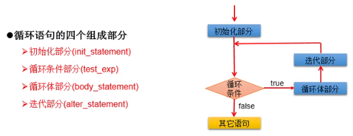

# Java 入门基础编程笔记

> [Java 入门基础编程视频](https://www.bilibili.com/video/BV1zE41197bw)

## 1 前言

### 1.1 软件开发介绍

* 软件，即一系列按照特定顺序组织的计算机数据和指令的集合，分为：
  * 系统软件
  * 应用软件
* 人机交互方式分为：
  * 图形化界面（Graphical User Interface GUI）
  * 命令行方式（Command Line Interface CLI）

### 1.2 常用的 DOS 命令

* dir 列出当前目录下的文件以及文件夹
* md 创建目录
* rd 删除目录
* cd 进入指定目录
* cd.. 退回到上一级目录
* cd /退回到根目录
* del 删除文件
* exit 退出 dos 命令行

### 1.3 编程语言介绍

* 第一代语言
  * 机器语言，指令以二进制代码形式存在
* 第二代语言
  * 汇编语言，使用助记符表示一条机器指令

* 第三代语言：高级语言
  * C，Pascal，Fortran 面向过程的语言
  * C++ 面向过程/面向对象
  * Java 跨平台的纯面向对象的语言
  * .NET 跨语言的平台
  * Python，Scala，JS...

### 1.4 选择 Java 语言


* Java 面向对象，开发效率高
* Java 从业人多，框架丰富，优秀
* Java 市场需求好 【查看编程语言使用排名：[TIOBE](https://www.tiobe.com/tiobe-index//)】


## 2 Java 语言概述

* 是 SUN（Stanford University Network，斯坦福大学网络公司）1995 年退出的高级编程语言
* Java 成为 Web 应用程序的首选开发语言
* 后台开发：Java、PHP、Python、Go、Node.js

### 2.1 Java 技术体系平台

* Java SE（Java Standard Edition）标准版，以前称为 J2SE，支持面向桌面级应用，提供了完整的 Java 核心 API
* Java EE（Java Enterprise Edition）企业版，以前称为 J2EE，包含 Servlet、Jsp 等
* Java ME（Java Micro Edition）小型版，以前称为 J2ME，支持移动终端
* Java Card，支持 Java 小程序（Applets）运行在小内存设备（如智能卡）上的平台

### 2.2 Java 在各领域的应用

* 企业级应用：Java 后台开发
* Android 平台应用：客户端开发
* 大数据平台开发：提供 API 接口编程
* 移动领域应用：用于消费和嵌入式领域

### 2.3 Java 语言的特点

* 特点一：面向对象
  * 两个基本概念：类和对象
  * 三大特性：封装、集成和多态
* 特点二：健壮性
  * 去除指针、内存的申请与释放
  * 提供了一个相对安全的内存管理和访问机制
* 特点三：跨平台性
  * Write Once，Run Anywhere.
  * 原理：只要在需要运行 Java 应用程序的操作系统上，先安装一个 Java 虚拟机（Java Virtual Machine JVM）即可，由 JVM 来负责 Java 程序在该系统中的运行

### 2.4 Java 语言运行机制

* Java 虚拟机（Java Virtal Machine）
* 垃圾收集机制（Garbage Collection）

### 2.5 Java 基础知识图解


### 2.6 第一个程序：HelloWorld

```java
public class HelloWorld {  
    public static void main(String[] args){
        System.out.println("HelloWorld\n");
    }
}
```

## 3 Java 基本语法

### 3.1 关键字和保留字

* 关键字（Keyword）
  * 用做专门用途的字符串
  * 特点：关键字中所有字母都为小写


* 保留字（reserved word）
  * 现有 Java 版本尚未使用，但以后版本可能作为关键字使用，自己命名标识符时要避免使用这些保留字。
  * goto，const

### 3.2 标识符

* 标识符（identifier）
  * Java 对各种变量、方法和类等要素命名时使用的字符序列称为标识符。
* 定义合法标识符规则：


* 名称命名规范：


!> Java 采用 unicode 字符集，因此标识符也可以使用汉字声明，但是不建议使用。

### 3.3 变量

> 作用：用于在内存中保存数据
>
> Java 定义变量的格式：数据类型 变量名 = 变量值；

eg.

```java
public static void main(String[] args){
	//变量的定义
	int myAge = 12;
	//变量的使用
	System.out.println(myAge);
    //变量的声明
    int myNumber;
    //变量的赋值:初始化
    myNumber = 1001;
    System.out.println(myNumber);
}
```

!> 注：

* 变量必须先声明，后使用
* 变量都定义在其作用域内，只有在作用域内是有效的
* 同一作用域，不能声明两个同名的变量

#### 3.3.1数据类型


* 整数类型：


注：声明 long 型变量时，以“l” 或 “L” 结尾，开发中定义整型变量时，常使用 int

* 浮点型：


* 字符型：char 占 1 字符 = 2 字节
  * 定义 char 型变量，通常使用一对单引号，内部只能写一个字符
  * 表示方式：
    * （1）声明一个字符
    * （2）转义字符
    * （3）使用 Unicode 值来表示字符型常量

```java
public class HelloWorld {
    public static void main(String[] args){
        //System.out.println("HelloWorld\n");
        char c = '\n';//换行符
        c = '\t';//制表符
        System.out.print("Hello"+c);
        System.out.println("World");
        
        char c2 = '\u0043';//字符集 C
        System.out.println(c2);
    }
}
```

* 布尔型：boolean
  * 只能取两个值之一：true，false
  * 常常在条件判断、循环结构中使用

```java
boolean b = true;
System.out.print(b);

boolean isMarried = true;
if(isMarried){
    System.out.println("balabala...");
}else{
    System.out.println("Sadness");
}
```


#### 3.3.2 基本数据类型变量间转换

> 基本数据类型之间的运算规则：

（1）自动类型提升：

当容量小的数据类型的变量与容量大的数据类型的变量做运算时，结果自动提升为容量大的数据类型。

当 byte、char、short 三种类型的变量做运算时，结果为 int 型

```java
byte、char、short --> int --> long --> float --> double
```

容量大小指的是数的范围的大小，注意，float 比 long 的范围大

（2）强制类型转换：是自动类型提升运算的逆运算

* 需要使用强转符：()

```java
double d = 12.7;
int c = (int)d;//截断操作
```

* 强制类型转换，可能导致精度损失

```java
int a = 128;
byte b = (byte)a;
System.out.println(b);//-128
```


####  3.3.3 基本数据类型与 String 间转换

> String 不是基本数据类型，属于引用数据类型

* String 使用方式：String str = “abdce”;
* 一个字符串考可以串接另一个字符串，也可以直接串接其他类型的数据，因为 String 可以和 8 种基本数据类型变量做运算
* 运算的结果仍然是 String 类型

```java
String str= "abdce";
str = str + "xyz";//连接运算
int n = 100;
str = str + n;
```

* 字符串转 int 型

```java
String str = 123 + "";
int num = Integer.parseInt(str);
System.out.println(num);
```

#### 3.3.4 进制与进制间的转换


> 反码与补码举例：


?> 注：计算机底层都以补码的方式来存储数据！

### 3.4 运算符

> 运算符是一种特殊的符号，用以表示数据的运算、赋值和比较。

* 算术运算符
* 赋值运算符
* 比较运算符（关系运算符）
* 逻辑运算符
* 位运算符
* 三元运算符

#### 3.4.1 算术运算符


##### 例题：打印三位数逆序显示

```java
public void printNumber(int num){
	int res;
    int tmp = num;
    while(tmp > 0){
        System.out.print(tmp % 10);
        tmp /= 10;
    }
}
```

#### 3.4.2 赋值运算符


#### 3.4.3 比较运算符


#### 3.4.4 逻辑运算符


#### 3.4.5 位运算符


注明：最高效率计算 2 * 8

采用 2 << 3 或者 8 << 1

#### 3.4.6 三元运算符


##### 例题：获取最大者


##### 例题：典型代码

（1）获取另两个整数的较大值

（2）获取三个数的最大值


### 3.5 程序流程控制

#### 3.5.1 顺序结构

> 程序从上到下执行


#### 3.5.2 分支结构

>  分为 if - else if - else 和 swith - case

##### 3.5.2.1 if - else 结构


###### 测试：if - else 测试


##### 3.5.2.2 switch - case 结构


###### 测试：switch - case 测试

```java
public class SwitchCaseTest {
    public static void main(String[] args){
        int number = 2;
        switch(number){
            case 0:
                System.out.println("zero");
                break;
            case 1:
                System.out.println("one");
                break;
            case 2:
                System.out.println("two");
                break;
            default:
                System.out.println("other");
        }
    }
}
```

!> 说明：

* 根据 switch 表达式中的值，依次匹配各个 case 中的常量
* 一旦匹配成功，则进入 case 结构中执行相应语句，直至遇到 break 结束，跳出 switch - case 结构
* switch 结构中的表达式，只能是如下的 6 种数据类型之一：byte, short, char, int, 枚举类型（JDK 5.0 新增）, String 类型（JDK 7.0 新增）
* case 之后只能声明常量。不能声明范围
* break 在 switch - case 中是可选的

##### 3.5.2.3 总结归纳

* 凡是可以使用 switch - case 的结构，都可以转换为 if - case。反之，不成立。
* 我们写分支结构时，当发现即可以使用 switch - case，（同时，switch 中表达式的取值情况不太多），又可以使用 if - case 时，我们优先选择使用 switch - case。
* switch - case 执行效率稍微高一点。

#### 3.5.3 循环结构

> for、while 和 do - while 循环

定义：在某些条件满足的情况下，反复执行特定代码的功能。



##### 3.5.3.1 for 循环

**输出 5 遍 Hello,Java **

```java
for (int i = 0; i < 5; i++) { 
    System.out.println("Hello,Java");
}
```

**遍历 100 以内的偶数**

```java
for (int i = 1; i <= 100; i++) {
    if (i % 2 == 0) {
        System.out.println(i);
    }
}
```

**记录 100 以内所有偶数的和**

```java
int sum = 0;
for (int i = 1; i <= 100; i++) {
    if (i % 2 == 0) {
        System.out.println(i);
        sum += i;
    }
}
System.out.println(sum);
```

> 注：

* 循环条件是 boolean 类型
* 通常情况下，循环结束都是因为循环条件不满足返回 false

##### 3.5.3.2 while 循环

**遍历 100 以内的偶数**

```java
public class WhileTest {
    public static void main(String[] args){
        //遍历100以内的所有偶数
        int i = 1;
        while (i <= 100) {
            if (i % 2 == 0) {
                System.out.println(i);
            }
            i++;
        }
    }
}
```

> 注：

* 写 while 循环，不能丢了迭代条件
* 写程序，要避免出现死循环
* for 循环和 while 循环是可以相互转换的


##### 3.5.3.3 do - while 循环

**遍历 100 以内的偶数**

```java
public class DoWhileTest {
    public static void main(String[] args){
        //遍历100以内的所有偶数
        int i = 1;
        do {
            if (i % 2 == 0) {
                System.out.println(i);
            }
            i++;
        } while (i <= 100);
    }
}
```

> 注：

* do - while 循环至少会执行一次循环体

##### 3.5.3.4 嵌套循环


> 注意点：

* 嵌套循环：将一个循环结构 A 声明在另一个循环结构 B 的循环体中，就构成了嵌套循环
* 外层循环
* 内层循环
* 内层循环结构遍历一遍，只相当于外层循环的循环体执行了一次
* 技巧：
  * 外层循环控制行数，内层循环控制列数

举例 01：

```java
for (int j = 1; j <= 4; j++) {
 	for (int i = 1; i <= 6; i++) {
        System.out.println(i * j);
    }   
}
```

举例 02：


举例 03：


#### 3.5.4 特殊关键字的使用

##### 3.5.4.1 break

使用范围： switch - case 和循环结构中

循环中使用的作用：结束当前循环

##### 3.5.4.2 continue

使用范围： 循环结构中

循环中使用的作用：结束当次循环

> break 和 continue 的相同点：

* 关键字后面不能有执行语句


### 3.6 数组

数组（Array）的常见概念：

* 数组名
* 下标（或索引）
* 元素
* 数组的长度

数组的特点：

* 数组是有序排列的
* 数组属于引用数据类型的变量，数组的元素，即可以是基本数据类型，也可以是引用数据类型
* 创建数组对象一旦确定，就不能修改

数组的分类：

* 按照维数：一维数组、二维数组...
* 按照数组元素类型：基本数据类型元素的数组、引用数据类型元素的数组

#### 3.6.1 一维数组

> 使用时考虑的问题：

（1）一维数组的声明和初始化

```java
//1.一维数组的声明和初始化
int num;//声明
num = 10;//初始化
int id = 1001;//声明 + 初始化

int[] ids;//声明
//静态初始化：数组的初始化和数组元素的赋值操作同时进行
ids = new int[]{1001,1002,1003,1004};
//动态初始化：数组的初始化和数组元素的赋值操作分开进行
String[] names = new String[5];
```

注意：这样写也可以，类型推断

```java
int[] arr4 = {1,2,3,4,5};//类型推断
```


（2）如何调用数组的指定位置的元素：通过角标的方式调用

```java
//2.如何调用数组的指定位置的元素：通过角标的方式调用
//数组的角标（或索引）从0开始的，到数组的长度-1结束
names[0] = "吴跟强";
names[1] = "吴奇隆";
names[2] = "吴尊";
names[3] = "胡歌";
names[4] = "孙杨";
```


（3）如何获取数组的长度

```java
//3.如何获取数组的长度
//属性：length
System.out.println(names.length);//5
System.out.println(ids.length);//4
```


（4）如何遍历数组

```java
//4.如何遍历数组
for (int i = 0; i < names.length; i++) {
	System.out.println(names[i]);
}
```


（5）数组元素的默认初始化值

* 数组元素是整型：0
* 数组元素是浮点型：0.0
* 数组元素是 char 型：0 或 ‘\u0000’，而非 ‘0’
* 数组元素是 boolean 型：false
* 数组元素是引用数据类型：null

```java
//5.数组元素的默认初始化值
int arr[] = new int[4];
for (int i = 0; i < arr.length; i++) {
	System.out.println(arr[i]);//0
}
```


（6）数组的内存解析

栈（stack）：局部变量

堆（heap）：new 出来的结构：对象、数组

方法区

常量池

静态域

> 内存的简化结构


> 举例：一维数组的内存解析


> 总结：数组一旦初始化完成，其长度就确定了。

#### 3.6.2 二维数组

> 使用时考虑的问题：

（1）二维数组的声明和初始化

```java
//1.二维数组的声明和初始化
//静态初始化
int[][] arr1 = new int[][]{{1,2,3},{4,5},{6,7,8}};
//动态初始化1
String[][] arr2 = new String[3][2];
//动态初始化2
String[][] arr3 = new String[3][];
//也是正确的写法
int[] arr4[] = new int[][]{{1,2,3},{4,5,6,10},{4,6}};
```


（2）如何调用数组的指定位置的元素：通过角标的方式调用

```java
//2.如何调用数组的指定位置的元素：通过角标的方式调用
//数组的角标（或索引）从0开始的，到数组的长度-1结束
System.out.println(arr1[0][1]);//0
arr3[1] = new String[4];
System.out.println(arr3[1][0]);//null
```


（3）如何获取数组的长度

```java
//3.如何获取数组的长度
//属性：length
System.out.println(arr3.length);//3
System.out.println(arr3[1].length);//4
```


（4）如何遍历数组

```java
//4.如何遍历二维数组
for (int i = 0; i < arr4.length; i++) {
	for (int j = 0; j < arr4[i].length; j++) {
		System.out.print(arr4[i][j] + " ");
	}
	System.out.println();
}
```


（5）数组元素的默认初始化值

* 针对于初始化方式一：比如：int [ ] [ ] arr = new int [4] [3];
  * 外层元素的初始化值为：地址值
  * 内层元素的初始化值为：与一维数组初始化情况相同
* 针对于初始化方式二：比如：int [ ] [ ] arr = new int [4] [ ];
  * 外层元素的初始化值为：null
  * 内层元素的初始化值为：不能调用，否则报错

```java
//5.数组元素的默认初始化值
System.out.println(arr4[0]);//[I@7530d0a 地址值
System.out.println(arr4[0][0]);//1
System.out.println(arr4);//[[I@27bc2616
```


（6）数组的内存解析

栈（stack）：局部变量

堆（heap）：new 出来的结构：对象、数组

方法区

常量池

静态域

> 举例一：二维数组的内存解析


> 举例二：二维数组的内存解析


> 举例三：二维数组的内存解析


## 4 Java 代码练习

> 注：衡量一个功能代码的优劣性：

* 1. 正确性
* 2. 可读性
* 3. 健壮性
* 4. 高效率与低存储：时间复杂度和空间复杂度（衡量算法的好坏）


### 4.1 Scanner 引入

注意：从键盘获取不同类型的变量，需要使用 Scanner 类

实现步骤：

* （1）导包：import java.util.Scanner;
* （2）Scanner 的实例化：Scanner scan = new Scanner(System.in);
* （3）调用 Scanner 类的相关方法，来获取指定类型的变量
* Scanner 演示代码：

```java
//1.导包：import java.util.Scanner;
import java.util.Scanner;
public class ScannerTest {
    public static void main(String[] args){
        //2.Scanner的实例化
        Scanner scan = new Scanner(System.in);
		//3.调用Scanner类的相关方法
        System.out.println("请输入你的姓名：");
        String name = scan.next();
        System.out.println(name);

        System.out.println("请输入你的年龄：");
        int age = scan.nextInt();
        System.out.println(age);

        System.out.println("请输入你的体重：");
        double weight = scan.nextDouble();
        System.out.println(weight);

        System.out.println("你是否相中我了哈哈？(true or false)：");
        boolean a = scan.nextBoolean();
        System.out.println(a);

        //对于char型的获取，Scanner没有提供相关的方法，只能获取字符串
        System.out.println("请输入你的性别(男 or 女)：");
        String gender = scan.next();
        System.out.println(gender);

        char genderChar = gender.charAt(0);//找到指定索引位上的字符，从0开始
        System.out.println(genderChar);
    }
}
```


### 4.2 随机数 random

> 使用方法：Math.random(); //返回 double 类型 [0.0,1.0)

#### 4.2.1 获取随机数 10 - 99

```java
double value = Math.random() * 90 + 10;//[0.0, 1.0) --> [0.0, 90) --> [0.0, 100)
int value2 = (int)(Math.random() * 90 + 10);//强制转换  [0.0, 100) --> [0, 99]
//公式：[a, b] : (int)(Math.random() * (b - a + 1) + a)
System.out.println(value);
System.out.println(value2);
```

### 4.3 日期类问题

#### 4.3.1 输出 2020 年的第几天

【题目】

```
编写程序：从键盘上输入2020年的“month”和“day”，要求通过程序输出输入的日期为2020年的第几天。
```

【代码实现】

```java
import java.util.Scanner;
/**
 * @version v1.0
 * @ProjectName: Java-Basic
 * @ClassName: DatePrint
 * @Description: 通过程序输出输入的日期为2019年的第几天。
 * @Author: wugenqiang
 * @Date: 2020/4/5 17:59
 */
public class DatePrint {
    public static void main(String[] args) {
        Scanner scan = new Scanner(System.in);
        System.out.println("请输入2020年的month：");
        int month = scan.nextInt();
        System.out.println("请输入2020年的day：");
        int day = scan.nextInt();

        //定义一个变量来保存总天数
        int sumDays = 0;
        switch (month){
            case 12:
                sumDays += 30;
            case 11:
                sumDays += 31;
            case 10:
                sumDays += 30;
            case 9:
                sumDays += 31;
            case 8:
                sumDays += 31;
            case 7:
                sumDays += 30;
            case 6:
                sumDays += 31;
            case 5:
                sumDays += 30;
            case 4:
                sumDays += 31;
            case 3:
                sumDays += 29;
            case 2:
                sumDays += 31;
            case 1:
                sumDays += day;
        }
        System.out.println(sumDays);
    }
}
```

#### 4.3.2 输出第几年的第几天

【题目】从键盘分别输入年、月、日，判断这一天是当年的第几天。

【思路】跟上面一题大体一样，但需要判断闰年和平年，判断思路如下：

* 判断一年是否是闰年的标准：
  * （1）可以被 4 整除，但不可被 100 整除
  * （2）可以被 400 整除

【代码】

```java
import java.util.Scanner;

/**
 * @version v1.0
 * @ProjectName: Java-Basic
 * @ClassName: DatePrint
 * @Description: 通过程序输出输入的日期第几天。
 * @Author: wugenqiang
 * @Date: 2020/4/5 17:59
 */
public class DatePrint2 {
    public static void main(String[] args) {
        Scanner scan = new Scanner(System.in);
        System.out.println("请输入year：");
        int year = scan.nextInt();
        System.out.println("请输入month：");
        int month = scan.nextInt();
        System.out.println("请输入day：");
        int day = scan.nextInt();

        //定义一个变量来保存总天数
        int sumDays = 0;
        switch (month){
            case 12:
                sumDays += 30;
            case 11:
                sumDays += 31;
            case 10:
                sumDays += 30;
            case 9:
                sumDays += 31;
            case 8:
                sumDays += 31;
            case 7:
                sumDays += 30;
            case 6:
                sumDays += 31;
            case 5:
                sumDays += 30;
            case 4:
                sumDays += 31;
            case 3:
                //sumDays += 29;
                //判断year是否是闰年
                if ((year % 4 == 0 && year % 100 != 0) || year % 400 == 0){
                    sumDays = 29;
                }else {
                    sumDays = 28;
                }
            case 2:
                sumDays += 31;
            case 1:
                sumDays += day;
        }
        System.out.println(year + "-" + month + "-" + day + " 是当年的第 " + sumDays + " 天");
    }
}
```

### 4.4 最大公约数

【题目】输入两个正整数 m 和 n，求最大公约数和最小公倍数。

【代码】

```java
import java.util.Scanner;
/**
 * @version v1.0
 * @ProjectName: Java-Basic
 * @ClassName: ForTest
 * @Description: 测试 for 循环
 * @Author: wugenqiang
 * @Date: 2020/4/1 15:48
 */
public class ForTest {
    public static void main(String[] args){
        Scanner scan = new Scanner(System.in);
        System.out.println("请输入第一个正整数：");
        int m = scan.nextInt();
        System.out.println("请输入第二个正整数：");
        int n = scan.nextInt();
        
        //获取最大公约数
        //1.获取两个数中的较小值
        int min = (m <= n) ? m : n;
        //2.遍历
        for (int i = min; i >= 1; i--) {
            if (m % i == 0 && n % i == 0){
                System.out.println("最大公约数为：" + i);
                break;//一旦找到第一个就跳出循环
            }
        }
        //获取最小公倍数
        //1.获取两个数中的较大值
        int max = (m >= n) ? m : n;
        //2.遍历
        for (int i = max; i <= m * n; i++) {
            if (i % m == 0 && i % n == 0) {
                System.out.println("最小公倍数为：" + i);
                break;//一旦找到第一个就跳出循环
            }
        }

    }
}
```

### 4.5 水仙花数

【题目】输出所有的水仙花数，所谓水仙花数就是指一个 3 位数，其各个位上数字立方和等于其本身。

【代码】

```java
int sum = 0;
for (int i = 100; i < 1000; i++) {
 	int j = i;
    while (j > 0) {
        int t = j % 10;
        sum += t * t * t;
        j /= 10;
    }
    if (sum == i) {
        System.out.println(i);
    } else {
        continue;
    }
}
```

### 4.6 完数

题目：找出 1000 以内的所有完数

讲解：完数，即这个数恰好等于它的因子之和，例如：6 = 1 + 2 + 3；

代码：

```java
int factor;
for (int i = 1; i <= 1000; i++) {
    factor = 0;
    for (int j = 1; j < i; j++) {
        if (i % j == 0) {
            factor += j;
        }
    }
    if (i == factor) {
        System.out.println(i);
    }
}
```

优化：

```java
int factor;
for (int i = 1; i <= 1000; i++) {
    factor = 0;
    for (int j = 1; j <= i/2; j++) {
        if (i % j == 0) {
            factor += j;
        }
    }
    if (i == factor) {
        System.out.println(i);
    }
}
```


### 4.7 读入整数并判断个数

 【题目】从键盘读入个数不确定的整数，并判断读入的正数和负数的个数，输入为 0 时结束程序。

【代码】

```java
import java.util.Scanner;

/**
 * @version v1.0
 * @ProjectName: Java-Basic
 * @ClassName: ForWhileTest
 * @Description: 判断读入正数和负数的个数
 * @Author: wugenqiang
 * @Date: 2020/4/7 14:51
 */
public class ForWhileTest {

    public static void main(String[] args) {
        Scanner scan = new Scanner(System.in);
        int positiveNumber = 0;//记录正数的个数
        int negativeNumber = 0;//记录负数的个数

        while (true) {
            int number = scan.nextInt();

            //判断number的正负情况
            if (number > 0) {
                positiveNumber++;
            } else if (number < 0) {
                negativeNumber++;
            } else {
                //一旦执行break，跳出循环
                break;
            }
        }
        System.out.println("输入的正数个数为：" + positiveNumber);
        System.out.println("输入的负数个数为：" + negativeNumber);
    }
}
```

> 注意：

* 不在循环条件部分限制次数的结构：for( ; ; ) 或者 while(true)
* 结束循环有几种方式：
  * 方式一：循环条件部分返回 false
  * 方式二：在循环体中执行 break

### 4.8 素数问题

#### 4.8.1 遍历输出 100 以内的素数

* 版本一：未优化状态

```java
public void isPrime(int n) {
    for (int i = 2; i <= n; i++) {
        boolean isFlag = true;
        for (int j = 2; j < i; j++) {
            if (i % j == 0) {
                isFlag = false;
            }
        }
        if (isFlag == true) {
            System.out.println(i);
        }
    }  
}
```

* 版本二：增加 break

```java
public void isPrime(int n) {
    for (int i = 2; i <= n; i++) {
        boolean isFlag = true;
        for (int j = 2; j < i; j++) {
            if (i % j == 0) {
                isFlag = false;
                break;
            }
        }
        if (isFlag == true) {
            System.out.println(i);
        }
    }  
}
```

* 版本三：增加 sqrt(i)

```java
public void isPrime(int n) {
    for (int i = 2; i <= n; i++) {
        boolean isFlag = true;
        for (int j = 2; j <= Math.sqrt(i); j++) {
            if (i % j == 0) {
                isFlag = false;
                break;
            }
        }
        if (isFlag == true) {
            System.out.println(i);
        }
    }  
}
```


