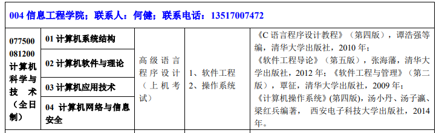

2020计算机考研调剂

* 2月20出成绩

# 1.一志愿情况

* （1）历年情况
* （2）成绩复核
* （3）校内调剂
* （4）破格复试
* （5）联系导师
* （6）校外调剂

# 2.确定调剂

* （1）联系专业课老师询问情况
* （2）找学长学姐
* （3）搜集信息，往年调剂情况

研招网寻找招生计算机专业的学校

然后到该学校研究生院看调剂信息、导师信息（邮箱以及导师的研究方向）

知网搜索院校，查导师论文信息

* 华南师范大学
* 中山大学

211

* 海南大学
* 云南大学
* 南昌大学
* 安徽大学

一本

* 东华理工大学
* 南京财经大学

34所出线在国家线之前

3.15之前出国家线

> 联系导师

* （1）一定要联系

* （2）如何联系

  > 面谈、邮件

* （3）发邮件：准备邮件模板

国家线公布之后陆续公布调剂信息：

小木虫

# 3.调剂系统开放之前，如何查找往年调剂信息

方法一：关注公众号：小白考研

查询成绩——获取调剂神器

方法二：利用研招网手动查询

学校官网搜索框搜索”调剂“

或者在研究生招生工作里面找调剂公告里看

> 注：往年招调剂的学校今年也有较大概率招调剂

调剂学校信息：

|     学校     |     学院     |           官网            |  研招办电话   |                          导师                           | 邮箱                    | 研究方向                               | 电话        |
| :----------: | :----------: | :-----------------------: | :-----------: | :-----------------------------------------------------: | ----------------------- | -------------------------------------- | ----------- |
| 东华理工大学 | 信息工程学院 | https://yjsy.ecut.edu.cn/ | 0791-83898509 | 张军 https://ies.ecut.edu.cn/0d/b3/c2315a69043/page.htm | zhangjun_whu@whu.edu.cn | 计算机体系结构、高性能计算、大数据处理 | 15979129591 |
| 江西财经大学 | 信息管理学院 |   http://grs.jxufe.cn/    | 0791-83816805 |                                                         |                         |                                        |             |
|              |              |                           |               |                                                         |                         |                                        |             |
|              |              |                           |               |                                                         |                         |                                        |             |

3月20日调剂系统开放，卡36小时

问研招办：要求，是否符合条件

* 搜索：**大学计算机专业导师情况
* 找有行政职位的导师，若是想搞学术，可以找学术性导师
* 招生办——入场券
* 看导师近几年论文发表情况

# 4.写邮件和做简历

## 4.1.写邮件技巧

（1）简洁明了，突出优势

（2）你的优势：一志愿、专业课分数、技能、经历、奖项、本科专业课

（3）三段式

第一段：个人信息+目的

第二段：个人优势、考研目的、研究方向、为何联系这位导师

第三段：我要读博！

## 4.2.发邮件技巧

（1）使用163邮箱：回执功能

（2）字体颜色、插入表格

（3）一些小细节：邮箱命名；附上电话

（4）附上简历

## 4.3.做简历技巧

（1）简介、重点突出

（2）真实（所写项目要了如指掌）

（3）简历模板：超级简历app或者锤子简历在线制作

（4）输出成PDF

（5）简历命名：本科院校+姓名

# 5.调剂复试准备

## 5.1.调剂复试怎么准备？

（1）调剂复试可准备时间很短。3-7天

（2）准备英语口语、复试常问问题、个人简历、中英文自我介绍等【可以看考虫】

（3）复习许多院校统考的科目；或选可能性最大的一所院校准备

（4）一般调剂复试在一志愿后。确定调剂复试后，联系调剂院校一志愿的学生，询问复试内容

## 5.2.如何联系导师

（1）看职位

（2）看研究方向

（3）看科研实力

（4）联系老师不建议3个以上

 ## 5.3.联系导师有什么用？

* 招生办给了入场券，才有机会进复试
* 复试面试过程中联系的导师会起作用

询问调剂复试名额和调剂复试比

《软件工程导论》（第六版）张海潘，清华大学出版社2013年版

# 6.复试

## 6.1 复试专业课

