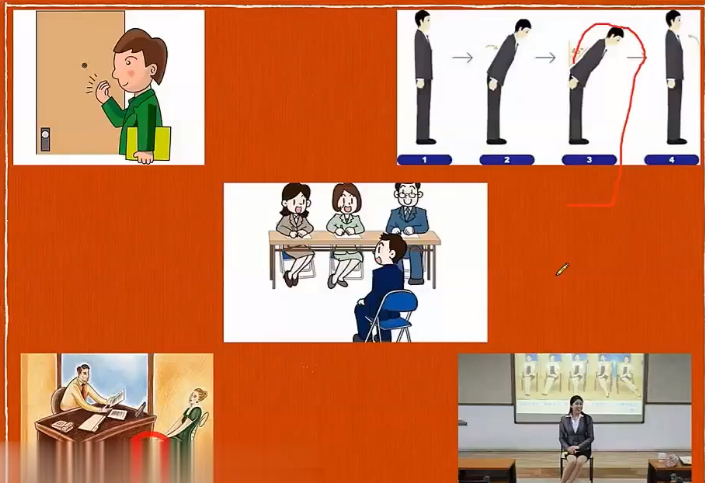
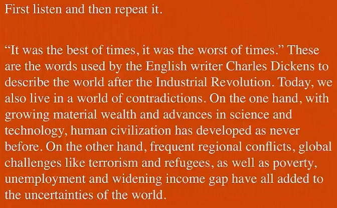

# 英语面试和口语

**使用前需知（拒绝白嫖，如果对你有帮助，你只需点个赞就行）**

> 需要 pdf 直接打印版，可在公众号 "码客 E 分享" 回复 **复试口语**  即可获取（会持续更新）  

> 声明：个人整理，不可用于商业用途，转载请注明出处！

> 最后祝愿大家都能上岸！让我们一起努力！考研 QQ 资源共享群：647430671

---

[TOC]

## 前言

> 复试主要考察应试者什么能力？

* 专业基础知识（专业课或政治理论）
* 英语知识（英语综合知识 + 专业词汇）
* 交流能力（英语口头表达 + 肢体语言）
* 心理素质及仪容仪表

## 面试始末

### 从面试初始到结束的过程及细节

* 提前去学校的城市熟悉一下或者查一下学校周围情况
* 衣着：得体就好
* 面试的前一天最好洗头洗澡，小清新
* 指甲修整一下，护手霜和大宝 SOD 蜜
* 白鞋保证擦干净，保证清洁卫生
* 刮胡子，面部整洁，牙白一点
* 面试时先敲门，敲三下，进门就开始面试了...保持微笑，各位老师好( 边走边说 )
* 手机静音
* 简历准备10份，从左到右一个个发
* 鞠躬​ :heart:
* 正式开始之前注意寒暄：Hello, Professors! 或 Hello, Teachers! I am very glad to be here.
* Good morning, Professors! I am very glad to be here.
* Hello, Professors! It's my honor to be here. 若老师点头示意，则问：Shall we begin？
* 若老师先主动说 Hi，别慌！Nice to meet you!
* Nice to meet you too!

* 老师说 sit down 时，及时说 well，thank you
* 老师说 Are you ready？Shall we begin？及时回复 Yes，Please 面带微笑 :smile:
* 坐椅子坐一半，手放在腿上，腿端正，空1.5米-2米的安全距离，有手势但是不要太大！
* 老师夸奖时，说 Well，really？Thank you
* Thank you，I appreciate it.

* 没听清老师说的内容时，说：
  * Excuse me. I‘m so sorry, but I didn't catch you clearly. Could you please say that again?
  * Excuse me. I‘m so sorry, but I didn't catch you clearly. Could you please say that more slowly?
  * Excuse me. I‘m so sorry, but I didn't catch you clearly. Could you please speak the question more slowly?
  * Excuse me. I‘m so sorry, but I didn't catch you clearly. I would really appreciate it if you could say that again.
* 面试结束时老师可能说：That’s all
  * 首先鞠躬表示感谢，说老师辛苦了
  * 或者说英文：Thank you for your time.
  * 转身离开，保持微笑，把门轻轻关上

### 面试过程中的相关问题回答

* 主动问好，自报姓名
  * Good morning, Dear professors. My name is WuGenQiang.
* 表达进入复试的荣幸
  * I'm very happy and honor to be here.
  * It is really my privilege to be here and delighted to obtain this opportunity to attend this interview.
* 是否自我介绍
  * 坐定之后要看导师有无指令，若导师说：Please introduce yourself. 之后再开始。
  * 若坐定之后没有人理你，开始之前加上一句话：Please allow me to introduce myself briefly.

### 面试过程中的宜与忌

> 宜

* 精准到每一秒，认真对待

> 忌

## 口语之自我介绍

> 关于学习及生活的日常用语

* 个人及家庭基本情况、学习生活、考研原因、研究生期间计划等
* Aspects
  * Name
  * Age
  * University & Major
  * School & Course
  * Family
  * Hometown
  * Hobby
  * Character & Personality
  * Goal & Dream

> 自我介绍的原则

* 若面面俱到，势必只能泛泛而谈
* 重点突出才是核心原则
* MTV 原则：
  * M：Me（我是谁）姓名 + 含义、家乡 + 特征、兴趣 + 影响（T + S 的逻辑表达）
  * T：Thing（你做过什么成就事件）
  * V：Value（你能提供什么价值）

> 自我介绍的准备

* 逐字稿写好
* 反复修改（长度、逻辑、表达）
* 掐时间练习（1~2分钟）
* 音量和速度

> 老师提问角度或者说方向

* Would you please make a brief introduction of  yourself?
* What do you do for a living?
* What can you tell me about yourself?
* When and where did you graduate?
* What qualifications have you obtained?

### 自我介绍（T+S）

> T + S 

* Topic Sentence（主题句）

* Supporting Sentence（支撑句）1-3句

> 几点要求：

* 先简短的，然后看老师的意思，若没有停，则继续长版的
* 不能死背，会有痕迹，会紧张忘记，会一片空白
* 必按照思维图进行灵活组合，不断操练至完美。
* 学会口语表达的逻辑：T + S

> 根据不同方面来学习 T + S 的逻辑表达：

* Name：

* What's your name?
  * My name is WuGenQiang. And you can call me Oliver. It's my English name which was given by my teacher.
* My name is WuGenQiang. GengQiang in Chinese, means success. Maybe my parents want me to be successful in life and career. I hope this name can bring me good luck today.
  
* Age：

* How old are you?
  * I'm 25 years old, Actually I graduated from Jinling Institute of technology one year ago.
  * I'm 25 years old, Actually I graduated from Jinling Institute of technology one year ago. I have been working for one year.

* University & Major：

* University
  * I graduated from Jinling Institute of technology.
  * I'm a graduate of Jinling Institute of technology.
* Major
  * My major was software engineering.
  * I majored in software engineering.
* School
  * I've just graduated from school.
  * I'm almost straight out of school.

* Hobby：

* Do you like travelling？
    * I like travelling very much. Actually I travel with my family once or twice a year.

 * listening to music
    * I enjoy listening to music. To be frank. a lot of music can make me feel relaxed
    * I am fond of music mainly because it can cheer me up greatly when I feel down. Besides, I also believe that music is an indispensable part of culture through which I could have a better understanding of different cultures.

* reading books
  * I like reading very much. Actually I read everyday. Because reading can open up  my horizons and broaden thinking. it can also fulfill my life, relax myself, and help me be a better man.
  * I enjoy reading primarily because it can cultivate my critical thinking, diversify my knowledge and enrich my mind.
  * relax myself and release the pressure.

* watch the film
  
  * I like watching the film very much. Actually I watch with my family once or twice a week.

> 将上述点结合起来阐述：What to say?（logically）

* Personal information

* Learning experience in college

* Certificates and Honors

* Practical experience

* Self-evaluation （自我评价）

* Personality and Character / Strength or Weakness

* The reason why be here

* Goal or dream / Future plan in postgraduate

> 注：尽量不要深入聊一个点，点到为止

> 口语小味精（润色）

* （1）Well
* （2）I mean / what I mean is...
* （3）you know / As you know
* （4）What is more / Actually / However
* （5）To be frank / Frankly speaking / To be honest
* （6）That's to say / let me put it in this way
* （7）If I may say so...

!> 自我介绍要点：

* （1）20s 姓名、年龄和学校
* （2）大学取得的成绩和工作经历
* （3）性格、爱好
* （4）That's all, thank you! If I were admitted by your university. 提高我的专业能力、实践能力和沟通合作能力！

### 自我介绍（60s）

My name is WuGenQiang,

### 自我介绍（90s）

## 口语之自由问答

> 自由问答回答标准：言之有物，言之有理

### Hobby

* Do you have any hobbies?  or What things interest you most?
  * I like reading very much. Actually I read everyday. Because reading can open up  my horizons and broaden thinking. it can also fulfill my life, relax myself, and help me be a better man.
  * Yes, I have lots of hobbies. In my spare time. I like playing basketball,reading novels, collecting stamps, communicating with my friends and so on. I also like English very much, because I am fond of watching English moves and listening to English songs. So I have passed CET-4 and -6 with flying colors.(出色的) But I do believe that there is still a long way for me to improve my English skills.
* What are some of your biggest hobbies?
  * Well, I'm crazy about reading. What I mean is, compared with novels and fictions, I'm more into poetry and autobiographies. Reading on a comfortable sofa in an afternoon with the sun shining brightly is my coziest time.
  * I'm also a sucker for travelling. I mean, travelling fills me with great passion and the inner desire to explore. During the journey, not only can I enjoy great scenery, experience different cultures, but also make new friends.
* Where have you traverled to recently?
* What did you do during this Spring Festival?
* What do you often do in your spare time?
* What dre your spare time interests?

|                               |          可替换          |                                 |
| :---------------------------: | :----------------------: | :-----------------------------: |
|       In my spare time        |     In my free time      |                                 |
| communicating with my friends | chatting with my friends | chatting online with my friends |
|           除此之外            |      also, besides       |           what's more           |
|       coziest 最舒适的        |                          |                                 |

### Family

* Could you tell me something about your family?
  * In my family, there are four members, my father,my mother, my brother and I. My parents are workers. My father works very hard and he is always fully occupied. So most of the housework is done by my mother. Of course, I would like to help her if I am at home.I love my parents, and they love me too. When I make progress or get some achievement, they are more excited than me and encourage me to do better. So I will try my best to repay them.
  * My family is warm and harmonious, my parents are both kind and hard-working. They teach me how to tell right from wrong and how to be independent and persistent. During my preparation for this interview, my parents' support has always been the source of my power.
* What does your family usually do for the weekend?
  * Well, climbing/hiking... at weekends is our common interest.The fresh air and natural beauty can help us get rid of tiredness. They can strengthen our relation, too.
  * still work.
* What do you think about living together with your parents?
  * Well, It's really good to live together with parents. We or they need support when we or they can't live by ourselves or themselves. We should help each other. We are family. 
  *  It's not good for the young to stay with parents all the time. They have to learn to live alone. They need the ability to solve problems by themselves.
* What help do your families offer you?
* Do your families support your decision on studying?

### Hometown

* Where are you from?
  * My hometown is located in the eastern part of China. It stands besides *** and abundant in rice and bean.
* Talk about the landscape of your hometown.
* Talk about a tourist site of your hometown.
* Talk about the customs of your hometown.
* How long have you lived there?
* How dou you like it? why?
* What's your impression about this city?
* What do you think are the good points about living in this city?
  * My hometown is ..., a ... city of ... Province. It is famous for its ... and ...
  * There are also many beautiful scenes, for example, ... Each year many people come here for tour, sightseeing, and vacation. It's really ... to live in here.

!> 介绍要点：

* 地理位置
  * My hometown is located in the northern part of China. It stands besides SongHua river and abundant in rice and bean.
* 城市大小
  * 小村庄：My hometown is a small village with beautiful natural landscape.
  * 小城市：My hometown is a small city with honest and kind-hearted people.
  * 中等城市：My hometown is a medium city with well-developed facilities.
  * 大城市：My hometown is metropolitan with millions of dwellers.
* 最大特征
  * 旅游景点
  * 名人名事
  * 特产
    * When it comes to my hometown XuYi, lobster (龙虾) will be the first thing that comes into people's mind.

* 谈到家乡的结尾邀请：欢迎老师前往
  * If you get a chance to come here, it's my pleasure to be your guide.

### University

* Where is your university?
* How big is it?
* Are there many departments? Is it comprehensive?
* What are some advantages of  studying in your university?
  * ... University is one of the oldest / biggest / most beautiful universities in China.
  * It was founded in ... and covers large areas in ...
  * It develops into a comprehensive university with joint efforts of generations, especially after the reform and opening up policy.（:smile:）
  * It takes the lead with very professional teaching and outstanding scientific research ability.
  * I love and feel proud of my university.（and would like to continue to study ... in this university）

### Major

> 本专业考研

* Why do you choose this major?

* What is your major? How do you like your major?
* What have you learned from your major?
* How do you define your bachelor major?
* What is the difference between the major in our school and your school?

> 跨考专业考研

* Why do you change your major?

### Study plans and experience

* Do you have any plans in your postgraduate life?
  * Of course / Sure / Absolutely, there must be many things to learn if I were enrolled into my ideal research field. First of all, I hope I can build up a systematic view of my major, especially have a better command of comprehensive knowledge in the field.Secondly, I hope I can participate in some relevant projects to get more experiences in practice. And what's more, if it is possible, I hope I can continue my study for a doctor degree. In a word, I am looking forword to laying a very solid foundation of my future profession.
  * First, a systematic view of ... is my first and most important goal in the postgraduate study. Second, I would like to take more social activities to promote myself in every possible way. Third, if possible, I will go on with my study for doctorate degree. In a word, I am looking forword to makinga solid foundation for my future profession and life after two / three years study here.
  * It's necessary to make a good plan both for my academic research and future career. First, I will try my best to grasp the theoretical knowledge and set the solid foundation for my further study. Second, if time permits, I will do some part-time job relevant to my major and in this way I can put the theory into practice. Third, I will apply for a doctor degree and if impossible I will find a job related to my major and become an expert in this field.
* What are your favorite subjects?
* What did you enjoy most about your campus life?
* What do you expect to achieve during your study if you are enrolled into this institute?
* Do you think English is important for your future plans? In what aspects is it important?  

| 词组                        | 翻译           |
| --------------------------- | -------------- |
| lay a very solid foundation | 打下坚实的基础 |
| join in projects            | 参加项目       |

### Reasons for being a postgraduate

* reasons for taking postgraduate entrance examination.（考研的原因）
  * Well, during the past four years, I have learned professional knowledge and practical skills. But I gradually realize that it is not enough. I believe that further education is urgent for me to realize my dream and achieve self-value. With the rapid development of the society, for us, it is necessary to seize / catch precious opportunities for self-development. So I prefer to further my education.
  * Through four years' studies in university, I find the knowledge that I have mastered not enough to solve some particular problems even though I got pleasing marks in all subjects. Therefore, I need to choose a bigger platform to improve myself. I think my potential in this field can be fully reached under the guidance of you erudite professors.
* Why do you choose to study at our institute / in this university? / Why did you choose our university?
  * Well, to be honest, I should say I love this university very much. When I came here for the first time I have been deeply impressed by the academic atmosphere and the excellent faculty of this university. / I have a long- lasting love of the atmosphere of campus. It is full of passion and youthful spirit. All the things can inspire me to form some fantastic thoughts and excellent ideas. This kind of atmosphere is very helpful for study. In a word, this university enjoys a good reputation in this field, I love it.
* Why do you want to go to graduate school instead of finding a job? 
  * Firstly, through four years' study in university I find the knowledge I have mastered is not enough, So I decide to further my education. Secondly, I want to take ...(专业) as my life long career, therefore, further study in this field is necessary. I can broaden my horizon and enrich the knowledge in this field through the postgraduate education. It is an indispensable(不可或缺的，必不可少的) step for my self-development in the future as well. So I prefer to further my education.

* Why did you choose our major?
  * Well, I chose this major mainly for two reasons. First, I believe... is a very promising industry, and many talents are needed in this field. I mean, studying in this major could enable me to be competitive in job hunting after graduation. Second, I have laid a solid foundation in ... / I like ... and what I have learnt would be my advantage and help me to do better in this major.
* Why do you change your major?
  * I have shifted my major from ... to ... for some reasons. This is mainly because I am really fond of it. During the holidays, I got the chance to work for a company as an internship, when I first acquainted myself with the knowledge of ... , and I was attracted deeply by it. What's more, what I have learned can be applied very well to this subject. So gradualy, I got the idea that I should try my best to learn ...

| 词组 / 单词                          | 翻译                 |
| ------------------------------------ | -------------------- |
| postgraduate entrance examination    | 研究生考试           |
| graduate school entrance examination | 研究生考试           |
| erudite                              | adj. 博学的;有学问的 |
| graduate school                      | 研究生学校           |

### Plans after graduation

* What would you like to be doing within five years after graduation?
  * Five years are quite a long time, I would like to divide it into two parts for my future plan. In the three years of postgraduate in this university, if I am admitted, I will spend my efforts on the knowledge of my major and skills concerned, and try to learn more interpersonal skills at the same time. After equipping myself full, when I will get my master's degree, I will find a job which I love and specialize in so that I can make a contribution to our nation as well as the society.
  * After my grauduation, I will find a job which I love and specialize in so that I can make a contribution to our nation as well as the society.

### Strength

* What is your greatest strength?
  * As for my strongest strength, I think it is my conscientiousness in work and learning, which promotes me to develop unceasingly and devote myself in my work and do a good job. I think it is helpful for my future work.
  * As a college student, I firmly believe that persistence and optimism are my strengths. Example, When I was making preparation for the National Extrance Examination for postgraduate, the strengths of persistence and optimism help me out quite some times, especially when I was discouraged and felt disappointed. That's exactly why I could sit in front of you right now, having the chance of taking the interview. I also believe that these two strengths will help me pass the interview.

| conscientiousness | 自觉性; 责任心; 尽责性  |
| ----------------- | ----------------------- |
| unceasingly       | 不停地; 不断            |
| cease             | v. (使)停止，终止，结束 |
| persistence       | 坚持                    |

 

### Weaknesses

* What are your weaknesses?
  * Well, first, we have to admit that everyone has his or her own weaknesses. As far as I am concerned, I am a little shy when communicating with strangers. Second, I often feel upset when I am busy. However, after four years' studying in college, I improved myself a lot. Though I am still shy and upset sometimes, I am much better than how I was four years ago. I hope I can perform well in this interview, go on to another stage in my life and overcome my weaknesses eventually.

### Progress

* How do you feel about your progress today?
  * To be frank, I made a great progress in the past few years with the help of my classmates and friends and under the guidance of my teachers. In academic aspect, I acquired much basic knowledge of this field from text books and learnt how to solve problems with them. In other aspects, I got along well with all my classmates and gained their friendship and respect. What is more important is that I learnt to work with the others and now I have a good sense of teamwork. All in all, the last few years are really important for me.

| academic aspect | 学术方面 |
| --------------- | -------- |
| progress        | 进步     |
| field           | 领域     |
| guidance        | 指导     |

### Role model

* Who is your role model in life? Why?
  * When it comes to my role model, I'll never hesitate to talk about... He/She is.../ used to be my ... and he is the most energetic person I've ever seen. He is so passionate and enthusiastic about life/ the course he is teaching, his students and life. Although he is over 40, he has a very young hreat, which makes him seem as if he was in his twenties. I really admire his passion for life, his youthful energy and charming personality.

| charm  | 魅力                      |
| ------ | ------------------------- |
| admire | V. 钦佩; 赞赏; 仰慕; 欣赏 |

### Greatest accomplishment

* What has been your greatest accomplishment?
  * 奖学金：I have won the ××× scholarship.
  * 国家奖学金：National scholarship
  * 国家励志奖学金：National Encouragement scholarship
  * 一等奖学金：first-class/prize scholarship
  * 学生干部：I was elected as Excellent Student leader in Student union. During my term as the president of Student Union, I have read some classical books concerning management and leadership. From zero to one, I have known how to organize a program, how to communicate with different types of person, how to explore the potential of myself and others, and how to appreciate myself and others' merits.（merit 优点、美德）It is not only the experience of Student Union, but also what I learn from those books and what I apply to practice that polish（polish 润色） my mind and bring me the sense of fulfillment.（fulfillment 满足感，成就感）
  * 志愿者服务：（volunteer activities）To be the member and organizer of volunteer activities has been my greatest accomplishment. It greatly delivers me to touch the real world rather than staying in the college all day long. The environmental protection activity, community service, and caring for the old exposed me to as much communication, devotion, and the value of youth as possible. It is not what we call the visible accomplishments, but the invaluable and irreplaceable wisdom that I can't obtain from the college.

## 口语之话题讨论

流程：先读一篇短文，测试下你的发音，然后是抽话题跟搭档对话(有的老师要求说几句就可以，我那个老师我们说了好久就是不喊停)，然后老师提问(基本是1-2个问题，但是我被问了4个，比较悲剧)，基本上不要冷场，及格是没有问题的。

　　我知道的口语话题有：

　　大学恋爱

　　房价问题

　　出国留学

　　减肥问题

　　中国教育

　　社会问题

　　网恋问题

　　环境保护

　　低碳经济

　　旅游问题

　　气候变化

　　....

### 个人相关话题

family

hometown

university

favorite book

plan about future

most impressive teacher

unforgettable experience

job

greatest accomplishment in solving a problem? Use a specific example to demonstrate.

### 传统相关话题

Scenic spots and historic sites

Generation Gap

Taking Part-Time Jobs

What's a Friend for?

Does money equal happiness?

What does happiness mean to you? [important]

Is Honesty Always the Best Virtue?

What's your view on the gap between rich and poor?

Explain your understanding on the old saying "practice makes perfect".

### 热点相关话题

> Going abroad

* Wealthy Chinese want kinds to study abroad?
  * Advantages: 
    * better educational concept and system
    * all-round development
    * quality-oriented education
    * broaden their horizons
    * the chance to be independent
  * Disadvantages:
    * language barriers
    * cultural shock
    * homesickness can occur frequently
    * psychological challenges (loneliness, hard to make friends)
    * high expense

Online learning

information age

your view on microblog

> Smoking

* what do you think about smoking?
  * To be honest, we should try to stop it. Every year, more than 2 million people died from smoking and more than 600 thousand people died from secondhand smoking. So smoking is banned in public place in lots of countries We all know that smoking is bad for our health. It may cause many diseases such as cough, lung cancer and so on. Smoking is especially harmful to our teenagers. So we must do something to keep away from smoking. If someone offers a cigarette, we should refuse it. And if anyone smokes nearly, we should try to stop it.

what is your point of view about the hot debate of private housing?

what are the main problems in our society/ of college education, and how to solve them?

Somebody thinks that it is necessary for every university student to take, do yu agree or disagree?

### 举例相关话题

* Is honesty always the best virtue?
  * Yes, honesty is a good virtue. There is an English proverb saying "Honesty is the best policy." which signifies the importance of honesty. If you are honest all the time, you will be trusted and respected by others. Once you lie, people will never believe you even if you speak the truth. Honest, your reputation will become great; dishonest, your name will be spoiled and your personality degraged. Do you still remember the boy who cried wolf for several times so no one would trust him? At last all the sheep were eaten by the wolf. His dishonesty brought him shame as well as damage. To sum up, honesty not only brings us honor and friendshil, but also material gains. Honesty is the best virtue.

## 口语之抽题演讲

!> 拿到演讲题目后立刻审题，找好切入点，把框架打好腹稿，通常分为三个部分，即引言部分、正文部分和结尾部分

模板一：

模板二：

常考问题：

模板作答：

\1.    谷歌事件:In my opinion, it is necessary to regulate the Internet according to law. Google is useful. I often used it to study. for its exit, Im sorry. Teacher, this is some of my ideas.

\2.    世博会: This is an exciting thing. It is an important and a long history of event. It will display cultural and scientific achievements and so on. I am proud of our country to hold such an event. Teacher, this is some of my ideas.

\3.    当前中国教育制度: Chinas education system is examination-oriented education. Therefore, the scores become very important and leading students to rigid. I hope that our country can improve this aspect .Teacher, this is some of my ideas.

\4.    犀利哥现象: He was just a poor man. If it is not because of the media reports, he may have been begging. Poor man like him, there are many needs to be concerned. I hope that our country can improve this aspect. Teacher, this is some of my ideas.

\5.    男女平等: This is a difficult topic for us. But, I think that women want to be equal. it is not enough that Just a man to respect a woman. Women should be independent. Teacher, this is some of my ideas.

\6.    留学: If they go abroad in order to knowledge, I support it. And I hope that they will be able to serve China. If it is for fame, I feel that there is no need to go abroad. Teacher, this is some of my ideas.

\7.    出国: This is a difficult topic for me. But, I think that everyone has their own ideas. If he wants to go abroad, we do not have the right to oppose. He can do what they want to do. Teacher, this is some of my ideas.

\8.    减肥: We all love beautiful, especially the women like to lose weight. it is good that as long as they do not affect health . Weight loss is not wrong, but there should be an good means. Teacher, this is some of my ideas.

\9.    关于广告: There are a lot of false advertising. And these ads are vulgar. I do not understand that TV still play them every day. I hope that our country can improve this aspect .Teacher, this is some of my ideas.

\10.    上网: Network is a tool. It is good or bad, the key lies in how we use it. Network is useful, if it is used to learn .But many people indulge online games and neglect their studies. I hope that our country can improve this aspect .Teacher, this is some of my ideas.

\11.    人生目标:My ideal is that I can become a Doctor. I hope I can serve the community and realize self-value. In addition, I wish I could have a happy family. Everyone is healthy. Teacher, this is some of my ideas.

\12.    电视节目: So far, I have a long time did not watch TV. Because I do not like those programs .Many TV programs are boring .And there are too many vulgar advertisement on TV. Teacher, this is some of my ideas.

\13.    朋友: For us, friends are very important. There may be some misunderstanding between friends, so we need to understand each other. I think it is not important that how many friends you have. but that how many good friends you have. Teacher, this is some of my ideas.

\14.    体育: I know that sports is very good, but I still do not like it. My friends like play basketball. Sometimes I play badminton. Teacher, this is some of my ideas.
\15.    生态问题: I have heard the news that the southern drought is very serious. This is the consequence of destroying the ecological environment. "Earth Hour" is just a show. I hope that there is a practical action .I hope that our country can improve this aspect.

\16.    网络流行语的态度: I think ,as long as not too much, network buzzword is permitted . I often surf the Internet .But i do not like the Internet buzzword .Because It can not become a cultural. And although some people think it is a culture, but I think it is not. Teacher, this is some of my ideas.

\17.    童年生活: My childhood was not happy. This was largely caused by my parents. But I do not complain .So I always told myself I want to build a happy family .Teacher, this is some of my ideas.

\18.    旅游:Travel is good for relax. I have a dream to travel around the world. But now I am just a student .I do not have enough money .And So this is the future thing. Teacher, this is some of my ideas.

\19.    人生最重要的抉择与你经常做出抉择吗:I do not often make a decision. In my life there is an important choice, that is taking the entrance exams for postgraduate schools. This is the best way to realize self-value. Teacher, this is some of my ideas.

\20.    最敬佩的人: There are many people who I admire, he was not a person but a group of people. I admire the people who have contributed to human society. I would also like to be that person through my learning and hard work. Teacher, this is some of my ideas.

\21.    对钱的看法: “Thats all the fault of the money”. We can often hear such words. I think not like that. That is our fault. This relates to our attitude to money and earning way. We should be proper to make money and save money. Teacher, this is some of my ideas.

\22.    研究生就业与薪水: Salaries are not unimportant. More importantly, I hope that I can learn something in the work process. I want my salary and my abilities are the same. Teacher, this is some of my ideas.

\23.    喜欢的歌曲: I like a lot of songs. But the favorite is " a new day has come" Its melody is beautiful, and give people inspiration. a new day has come, I was waiting for so long for the miracles come. So do I .Teacher, this is some of my ideas.

\24.    喜欢的电影:My favorite movie is Shawshank Redemption. When I watched the film, I am very excited to watch again and again. I like Andy, for his talent. And the most important thing that I like is his spirit that never giving up. Teacher, this is some of my ideas.

\25.    我的家乡: My home is Linchuan. I think many people should know WangAnShi. Economy is not developed enough, but the landscape very well, no contamination. It had my family and friends, in my eyes, it is the best hometown. Teacher, this is some of my ideas.

\26.    男女未婚同居: I do not want people to do that. Among them, many people have no sense of marriage. Unmarried cohabitation is both irresponsible. That would make the woman suffer great harm. Of course, everyone has the right to choose their own way of life. Teacher, this is some of my ideas.

\27.    网恋: Internet Love is too unreal. From the network, you can not fully understand him. I hope that people can pay more attention to the reality. I do not know the attitude of others .But I do not want internet love. Teacher, this is some of my ideas.

\28.    小沈阳: In the spring night, he showed well. Only once, people may feel funny. However, he does so for a long time, then, it is not very good. I hope that he will try other ways. Teacher, this is some of my ideas.

\29.    现代生活问题: Today, we have rich material life. But we are not happy. And there are a lot of problems. We do not have faith, and our spiritual life is not enough. We have too many pressures. Teacher, this is some of my ideas.

\30.    金融危机:Housing prices are very high now. Government in this area is not good. If do not improve, the consequences are serious. GDP is just a number. I hope our country can understand this and improve this aspect .Teacher, this is some of my ideas.

\31.    天气:Todays weather is not bad. But I do not know what the weather it was in my heart. My heart is very nervous.No matter what the weather it was, it was only temporary. Teacher, this is some of my ideas.

\32.    机会:I think that Who prepared and who can have a chance. People who are not ready and the opportunity will pass. Now I have a chance. I w**, just do not know what will happen.Teacher, this is some of my ideas.

\33.    校园恋爱: I think it is possible.Now, love is everywhere,its popular,including on the campus,between the young boys and girls. All in all, In most time,I hope that students should hard study.

## 听力策略

### 听力实际能力

* 词汇积累
* 发音改善
* 精听复述

### 听力考试能力

* 读法不会的时候，按照拼读法
* 单词记忆

| negotiation   | n. 谈判; 磋商; 协商                                     |
| ------------- | ------------------------------------------------------- |
| preparation   | n. 准备; 预备; 准备工作                                 |
| troublesome   | adj. 令人烦恼的; 讨厌的; 令人痛苦的                     |
| client        | n. 委托人; 当事人; (连接在服务器上的)客户机             |
| wrap          | n. 包，裹(礼物等)                                       |
| colleague     | n. 同事; 同僚; 同人                                     |
| flatter       | v. 奉承; 讨好; 向…谄媚; 自命不凡;                       |
| hesitant      | adj. 犹豫的; 踌躇的; 不情愿的                           |
| bakery        | n. 面包(糕饼)店; 面包(糕饼)烘房; 面包厂                 |
| baking skill  | 烘焙技巧                                                |
| contradiction | n. (事实、看法、行动等的)不一致，矛盾，对立; 反驳 ;驳斥 |
|               |                                                         |
|               |                                                         |
|               |                                                         |
|               |                                                         |

!> 准备6套6级试卷听力真题，听力练习地址：[可可英语 6 级听力](http://www.kekenet.com/cet6/ljtl/cet6zhenti/)

[英语笔记地址](course/英语学习笔记.md)

## 朗读和翻译

| material wealth       | 物质财富                   |
| --------------------- | -------------------------- |
| Industrial Revolution | 工业革命                   |
| terrorism             | n. 恐怖主义                |
| regional conflicts    | 地区冲突                   |
| refugee               | n. 避难者; 逃亡者; 难民    |
| widening income gap   | 贫富差距扩大               |
| uncertainty           | n. 犹豫; 迟疑; 拿不定的事; |

> 关于朗读：

学术类、经济类、文学类、生活类

诗歌散文类

## 词汇润色

### 性格类

|      修饰词      |      释义      | 修饰词 | 释义 |
| :--------------: | :------------: | ------ | ---- |
|   open-minded    | 虚心的、开明的 |        |      |
| quick in thought |    思维敏捷    |        |      |
|    adaptable     |   适应性强的   |        |      |
|     outgoing     |     外向的     |        |      |
|    easygoing     |   容易相处的   |        |      |
|    optimistic    |     乐观的     |        |      |
|    aggressive    | 主动的、积极的 |        |      |
|   enterprising   | 主动的、积极的 |        |      |
| ambitious active | 主动的、积极的 |        |      |
|    motivated     | 主动的、积极的 |        |      |
|      humble      |     谦逊的     |        |      |
|    expressive    |    善于表达    |        |      |
|       just       |     正直的     |        |      |
|   kind-hearted   |     好心的     |        |      |
|  knowledgeable   |    有见识的    |        |      |
|    slowcoach     |     慢性子     |        |      |
|   quick temper   |     急性子     |        |      |
|  happy-go-lucky  |   随遇而安的   |        |      |
|      honest      |                |        |      |
|     reliable     |                |        |      |
|   trustworthy    |                |        |      |
|    committed     |                |        |      |
|    determined    |                |        |      |
|      steady      |                |        |      |
|   responsible    |                |        |      |
|    dependable    |                |        |      |
|    efficient     |                |        |      |
|    attentive     |                |        |      |
| detail-oriented  |   关注细节的   |        |      |
|    persistent    |                |        |      |
|     dynamic      |                |        |      |
|    versatile     |                |        |      |
|    passionate    |                |        |      |
|    energetic     |                |        |      |
|   enthusiastic   |                |        |      |
|     diligent     |                |        |      |
|   intelligent    |                |        |      |
|                  |                |        |      |
|                  |                |        |      |

> honest / reliable / trustworthy 

eg. Some of my friends said, I am an honest,reliable and trustworthy guy . If I promise something.I will keep my promise.

（guy	n. 男人，小伙子）

### 词组

Problem solver	善于解决问题的人

Team player	团队协作者

eg1. I am a team player. I can collaborate(合作) well with my teammates.

eg2. I am a team player. I can get well with my teammates.

Self-starter	主观能动性强的

eg. I am a self-starter. I need only little supervision.

  

