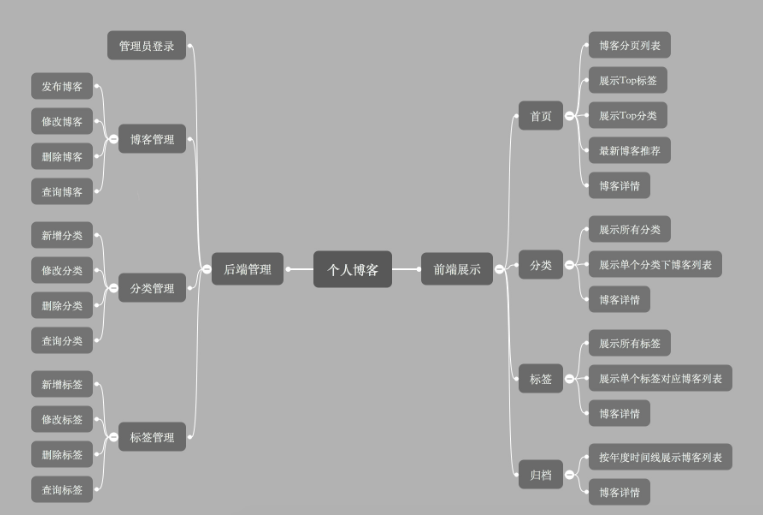

# 基于 SpringBoot 开发的个人博客

**个人博客功能：**



**技术组合：**

*  后端：Spring Boot + JPA + thymeleaf 模板
*  数据库：MySQL
*  前端UI：Semantic UI 框架

**工具与环境：**

*  [IDEA 2019.3.4](https://wugenqiang.github.io/CS-Notes/#/ToolBox/IDEA?id=idea-201934)
*  [Maven 3.6.3](https://wugenqiang.github.io/CS-Notes/#/ToolBox/IDEA?id=idea-maven-配置)
*  JDK 8

**内容模块：**

*  需求分析与功能规划
*  页面设计与开发
*  技术框架搭建
*  后端管理功能实现
*  前端管理功能实现

## 1、需求与功能

### 1.1 用户故事

用户故事是敏捷框架中的一种开发方法。可以帮助开发者转换视角，以用户的角度更好的把握需求，从而实现具有商业价值的功能。

>  用户故事最好是用户团队编写

**用户故事模板**：

-  As a (role of user), I want (some feature) so that (some business value).
-  作为一个(某个角色) 使用者，我可以做(某个功能) 事情，如此可以有(某个商业价值) 的好处

**关键点**：角色、功能、商业价值

**举例**：

-  作为一个招聘网站**注册用户**，我想**查看最近3天发布的招聘信息**，以便于**了解最新的招聘信息**。
-  作为公司，可以张贴新工作。


个人博客系统的用户故事：

角色：**普通访客**，**管理员（我）**

*  访客，可以分页查看所有的博客
*  访客，可以快速查看博客数最多的6个分类
*  访客，可以查看所有的分类
*  访客，可以查看某个分类下的博客列表
*  访客，可以快速查看标记博客最多的10个标签
*  访客，可以查看所有的标签
*  访客，可以查看某个标签下的博客列表
*  访客，可以根据年度时间线查看博客列表
*  访客，可以快速查看最新的推荐博客
*  访客，可以用关键字全局搜索博客
*  访客，可以查看单个博客内容
*  访客，可以对博客内容进行评论
*  访客，可以赞赏博客内容
*  访客，可以微信扫码阅读博客内容
*  访客，可以在首页扫描公众号二维码关注我
*  我，可以用户名和密码登录后台管理
*  我，可以管理博客
   *  我，可以发布新博客
   *  我，可以对博客进行分类
   *  我，可以对博客打标签
   *  我，可以修改博客
   *  我，可以删除博客
   *  我，可以根据标题，分类，标签查询博客
*  我，可以管理博客分类
   *  我，可以新增一个分类
   *  我，可以修改一个分类
   *  我，可以删除一个分类
   *  我，可以根据分类名称查询分类
*  我，可以管理标签
   *  我，可以新增一个标签
   *  我，可以修改一个标签
   *  我，可以删除一个标签
   *  我，可以根据名称查询标签

### 1.2 功能规划


## 2、页面设计与开发

### 2.1 设计

**页面规划：**

前端展示：首页、详情页、分类、标签、归档、关于我

后台管理：模板页

### 2.2 页面开发


[Semantic UI官网](https://semantic-ui.com/)

[背景图片资源](https://www.toptal.com/designers/subtlepatterns/)

### 2.3 插件集成


[编辑器 Markdown](https://pandao.github.io/editor.md/)

[内容排版 typo.css](https://github.com/sofish/typo.css)

[动画 animate.css](https://daneden.github.io/animate.css/)

[代码高亮 prism](https://github.com/PrismJS/prism)

[目录生成 Tocbot](https://tscanlin.github.io/tocbot/)

[滚动侦测 waypoints](http://imakewebthings.com/waypoints/)

[平滑滚动 jquery.scrollTo](https://github.com/flesler/jquery.scrollTo)

[二维码生成 qrcode.js](https://davidshimjs.github.io/qrcodejs/)

## 3、框架搭建

>  [IDEA下载 https://www.jetbrains.com/idea/](https://www.jetbrains.com/idea/)

### 3.1 构建与配置

**1、引入Spring Boot模块：**

*  web
*  Thymeleaf
*  JPA
*  MySQL
*  Aspects
*  DevTools

**2、application.yml配置**

*  使用 thymeleaf 3

   pom.xml:

```xml
<thymeleaf.version>3.0.2.RELEASE</thymeleaf.version>
<thymeleaf-layout-dialect.version>2.1.1</thymeleaf-layout-dialect.version>
```


  	application.yml:

```yaml
spring:
  thymeleaf:
    mode: HTML
```

*  数据库连接配置

```yaml
spring:
  datasource:
    driver-class-name: com.mysql.jdbc.Driver
    url: jdbc:mysql://localhost:3306/blog?useUnicode=true&characterEncoding=utf-8
    username: root
    password: root
  jpa:
    hibernate:
      ddl-auto: update
    show-sql: true
```

*  日志配置

   application.yml:

```yaml
logging:
  level:
    root: info
    com.imcoding: debug
  file: log/imcoding.log
```

​	logback-spring.xml：

```xml
<?xml version="1.0" encoding="UTF-8" ?>
<configuration>
    <!--包含Spring boot对logback日志的默认配置-->
    <include resource="org/springframework/boot/logging/logback/defaults.xml" />
    <property name="LOG_FILE" value="${LOG_FILE:-${LOG_PATH:-${LOG_TEMP:-${java.io.tmpdir:-/tmp}}}/spring.log}"/>
    <include resource="org/springframework/boot/logging/logback/console-appender.xml" />

    <!--重写了Spring Boot框架 org/springframework/boot/logging/logback/file-appender.xml 配置-->
    <appender name="TIME_FILE"
              class="ch.qos.logback.core.rolling.RollingFileAppender">
        <encoder>
            <pattern>${FILE_LOG_PATTERN}</pattern>
        </encoder>
        <file>${LOG_FILE}</file>
        <rollingPolicy class="ch.qos.logback.core.rolling.TimeBasedRollingPolicy">
            <fileNamePattern>${LOG_FILE}.%d{yyyy-MM-dd}.%i</fileNamePattern>
            <!--保留历史日志一个月的时间-->
            <maxHistory>30</maxHistory>
            <!--
            Spring Boot默认情况下，日志文件10M时，会切分日志文件,这样设置日志文件会在100M时切分日志
            -->
            <timeBasedFileNamingAndTriggeringPolicy class="ch.qos.logback.core.rolling.SizeAndTimeBasedFNATP">
                <maxFileSize>10MB</maxFileSize>
            </timeBasedFileNamingAndTriggeringPolicy>

        </rollingPolicy>
    </appender>

    <root level="INFO">
        <appender-ref ref="CONSOLE" />
        <appender-ref ref="TIME_FILE" />
    </root>

</configuration>
<!--
    1、继承Spring boot logback设置（可以在appliaction.yml或者application.properties设置logging.*属性）
    2、重写了默认配置，设置日志文件大小在100MB时，按日期切分日志，切分后目录：

        my.2017-08-01.0   80MB
        my.2017-08-01.1   10MB
        my.2017-08-02.0   56MB
        my.2017-08-03.0   53MB
        ......
-->
```

*  生产环境与开发环境配置
   *  application-dev.yml
   *  application-pro.yml

### 3.2 异常处理

**1、定义错误页面**

*  404
*  500
*  error

**2、全局处理异常**

统一处理异常：

```java
@ControllerAdvice
public class ControllerExceptionHandler {

    private final Logger logger = LoggerFactory.getLogger(ControllerExceptionHandler.class);
    /**
     * 异常处理
     * @param request
     * @param e
     * @return
     */
    @ExceptionHandler({Exception.class})
    public ModelAndView handleException(HttpServletRequest request, Exception e) throws Exception {

        logger.error("Request URL : {} , Exception : {}", request.getRequestURL(), e);

        if (AnnotationUtils.findAnnotation(e.getClass(), ResponseStatus.class) != null) {
            throw e;
        }
        ModelAndView mav = new ModelAndView();
        mav.addObject("url", request.getRequestURL());
        mav.addObject("exception", e);
        mav.setViewName("error/error");

        return mav;
    }
}
```


错误页面异常信息显示处理：

```html
<div>
    <div th:utext="'&lt;!--'" th:remove="tag"></div>
    <div th:utext="'Failed Request URL : ' + ${url}" th:remove="tag"></div>
    <div th:utext="'Exception message : ' + ${exception.message}" th:remove="tag"></div>
    <ul th:remove="tag">
        <li th:each="st : ${exception.stackTrace}" th:remove="tag"><span th:utext="${st}" th:remove="tag"></span></li>
    </ul>
    <div th:utext="'--&gt;'" th:remove="tag"></div>
</div>
```


**3、资源找不到异常**

```java
@ResponseStatus(HttpStatus.NOT_FOUND)
public class NotFoundExcepiton extends RuntimeException {

    public NotFoundExcepiton() {
    }

    public NotFoundExcepiton(String message) {
        super(message);
    }

    public NotFoundExcepiton(String message, Throwable cause) {
        super(message, cause);
    }
}
```


### 3.3 日志处理

**1、记录日志内容**

*  请求 url
*  访问者 ip
*  调用方法 classMethod
*  参数 args
*  返回内容

**2、记录日志类：**

```java
@Aspect
@Component
public class LogAspect {

    private final Logger logger = LoggerFactory.getLogger(this.getClass());

    /**
     * 定义切面
     */
    @Pointcut("execution(* com.imcoding.web.*.*(..))")
    public void log() {
    }

    @Before("log()")
    public void doBefore(JoinPoint joinPoint) {
        ServletRequestAttributes attributes = (ServletRequestAttributes) RequestContextHolder.getRequestAttributes();
        HttpServletRequest request = attributes.getRequest();
        String classMethod = joinPoint.getSignature().getDeclaringTypeName() + "." + joinPoint.getSignature().getName();
        ReqeustLog reqeustLog = new ReqeustLog(
                request.getRequestURL().toString(),
                request.getRemoteAddr(),
                classMethod,
                joinPoint.getArgs()
        );
        logger.info("Rquest  ----- {}",reqeustLog);
    }

    @After("log()")
    public void doAfter() {
        //logger.info("---------- doAfter 2 ----------");
    }

    @AfterReturning(returning = "result",pointcut = "log()")
    public void doAtfertRturning(Object result) {
        logger.info("Return ------ {}",result );
    }


    private class ReqeustLog {
        private String url;
        private String ip;
        private String classMethod;
        private Object[] args;

        public ReqeustLog(String url, String ip, String classMethod, Object[] args) {
            this.url = url;
            this.ip = ip;
            this.classMethod = classMethod;
            this.args = args;
        }

        @Override
        public String toString() {
            return "ReqeustLog{" +
                    "url='" + url + '\'' +
                    ", ip='" + ip + '\'' +
                    ", classMethod='" + classMethod + '\'' +
                    ", args=" + Arrays.toString(args) +
                    '}';
        }
    }

}
```


### 3.4 页面处理


**1、静态页面导入project**

**2、thymeleaf布局**

*  定义fragment
*  使用fragment布局

**3、错误页面美化**

4、设计与规范

### 4.1 实体设计

**实体类：**

*  博客 Blog
*  博客分类 Type
*  博客标签 Tag
*  博客评论 Comment
*  用户 User


**实体关系：**


**评论类自关联关系：**


**Blog类：**


**Type类：**


**Tag类：**


**Comment类：**


**User类：**


### 4.2 应用分层


### 4.3 命名约定

**Service/DAO层命名约定：**

*  获取单个对象的方法用get做前缀。
*  获取多个对象的方法用list做前缀。
*  获取统计值的方法用count做前缀。
*  插入的方法用save(推荐)或insert做前缀。
*  删除的方法用remove(推荐)或delete做前缀。
*  修改的方法用update做前缀。


## 5、后台管理功能实现

### 5.1 登录


**1、构建登录页面和后台管理首页**

**2、UserService和UserRepository**

**3、LoginController实现登录**

**4、MD5加密**

**5、登录拦截器**

### 5.2 分类管理


**1、分类管理页面**

**2、分类列表分页**

````javascript
{
  "content":[
    {"id":123,"title":"blog122","content":"this is blog content"},
    {"id":122,"title":"blog121","content":"this is blog content"},
    {"id":121,"title":"blog120","content":"this is blog content"},
    {"id":120,"title":"blog119","content":"this is blog content"},
    {"id":119,"title":"blog118","content":"this is blog content"},
    {"id":118,"title":"blog117","content":"this is blog content"},
    {"id":117,"title":"blog116","content":"this is blog content"},
    {"id":116,"title":"blog115","content":"this is blog content"},
    {"id":115,"title":"blog114","content":"this is blog content"},
    {"id":114,"title":"blog113","content":"this is blog content"},
    {"id":113,"title":"blog112","content":"this is blog content"},
    {"id":112,"title":"blog111","content":"this is blog content"},
    {"id":111,"title":"blog110","content":"this is blog content"},
    {"id":110,"title":"blog109","content":"this is blog content"},
    {"id":109,"title":"blog108","content":"this is blog content"}],
  "last":false,
  "totalPages":9,
  "totalElements":123,
  "size":15,
  "number":0,
  "first":true,
  "sort":[{
    "direction":"DESC",
    "property":"id",
    "ignoreCase":false,
    "nullHandling":"NATIVE",
    "ascending":false
  }],
  "numberOfElements":15
}
````


**3、分类新增、修改、删除**

### 5.3 标签管理

### 5.4 博客管理


**1、博客分页查询**

**2、博客新增**

**3、博客修改**

**4、博客删除**

## 6、前端展示功能实现

### 6.1 首页展示


**1、博客列表**

**2、top分类**

**3、top标签**

**4、最新博客推荐**

**5、博客详情**

**1、Markdown 转换 HTML**

*  [commonmark-java  https://github.com/atlassian/commonmark-java](https://github.com/atlassian/commonmark-java)
*  pom.xml引用commonmark和扩展插件

```xml
<dependency>
   <groupId>com.atlassian.commonmark</groupId>
   <artifactId>commonmark</artifactId>
   <version>0.10.0</version>
</dependency>
<dependency>
   <groupId>com.atlassian.commonmark</groupId>
   <artifactId>commonmark-ext-heading-anchor</artifactId>
   <version>0.10.0</version>
</dependency>
<dependency>
   <groupId>com.atlassian.commonmark</groupId>
   <artifactId>commonmark-ext-gfm-tables</artifactId>
   <version>0.10.0</version>
</dependency>
```


**2、评论功能**


*  评论信息提交与回复功能
*  评论信息列表展示功能
*  管理员回复评论功能


### 6.2 分类页

### 6.3 标签页

### 6.4 归档页

### 6.5 关于我


