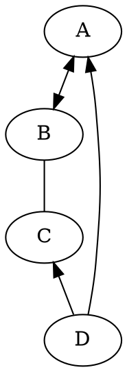

# Docsify 文档构建说明书

## 1 引言

在软件开发过程中，编程人员经常需要写文档，如开发文档、接口 `API` 文档、软件使用手册等，也会编写 `Blog` 记录开发过程，技术感悟（比如我的博客：[EnjoyToShare](https://wugenqiang.github.io/) ）。对于这些文档，一般情况下编写人员有以下几种需求：编写简单、对外发布、格式友好、形式专业。而编写的工具则有好多，包括以下几类：

> 文档编写工具 

* word工具类：如 office word，wps，txt 等

* 平台博客类：csdn，简书，oschina 等

* 自建网站类：github，hexo，gitbook，markdown 等

* 知识工具类：confluence，语雀，看云等

当然，各种工具有各自的优缺点，简单一点的话，使用语雀、看云来写长系列文章或者书籍也比较适合，但作为一个开发人员，希望找一个能属于自己的，简单的，有点逼格的文档工具，特别是针对开源软件文档编写，放个 `pdf` 或者 `doc` 文档，不便于维护，最好能跟 `github` 关联，即时可看，又方便维护，如此，则非 `docsify` 莫属了（当然 `gitbook` 也行）。如下可以截图看一下基于 `docsify` 构建的文档。本文针对如何使用 `docsify` 实现文档构建进行讲解，希望能帮助到想构建自己的文档网站的同仁。

## 2 Docsify 简介

按 [Docsify](https://docsify.js.org) 官网的介绍，一句话:一个神奇的文档网站生成工具，使用它，可以使用简单的方式，构建一个专业的文档网站。如果使用过 `GitBook` 和 `Hexo` 的同仁，可以继续使用 `markdown` 编写文档，然后转为 `html` 进行显示。而 `docsify` 是一个动态生成文档网站的工具。不同于 `GitBook`、`Hexo` 的地方是它不会生成将 `.md` 转成 `.html` 文件，所有转换工作都是在运行时进行。只需要创建一个 `index.html` ，就可以开始写文档而且直接部署在 `GitHub Pages` 进行发布，方便、快捷、格式友好，样式不错。

> 基于 Docsify 设计文档预览链接：[EnjoyToShare 项目笔记](https://notebook.js.org/)

## 3 使用 docsify 构建文档

> 本章节将对如何使用 `docsify` 构建文档进行详细描述。

### 3.1 构建 docsify 目录结构

> (1) 安装 `npm`  

* git：[http://git-scm.com/](http://git-scm.com/)   安装 git 即可

> (2) 安装 `nodejs`

* node.js：[http://nodejs.org/](https://nodejs.org/en/docs/)

> (3) 安装 `docsify`

* 安装 `docsify-cli` 工具，方便创建及本地预览文档网站。

```
npm i docsify-cli -g
```

> (4) 初始化项目

* 进入指定文件目录，进行初始化操作

``` 
docsify init ./docs
```

`docsify` 有其规范的目录结构,初始化成功后，可以看到 `./docs` 目录下最基本的结构如下：

* `index.html`  # 入口文件
* `README.md`   # 会做为主页内容渲染
* `.nojekyll`   # 用于阻止 GitHub Pages 会忽略掉下划线开头的文件


> (5) 本地预览网站

* 运行一个本地服务器通过 `docsify serve` 可以方便的预览效果，而且提供 LiveReload 功能，可以让实时的预览。默认访问 http://localhost:3000/#/ 和 http://127.0.0.1:3000/#/

```
docsify serve docs
```

* 预览图：(由于 README.md 文件被我增加了内容，故显示修改后的内容)


一个基本的文档网站就搭建好了，`docsify` 还可以自定义导航栏，自定义侧边栏以及背景图和一些开发插件等等。更多配置请参考官方文档 https://docsify.js.org

> 期待继续优化，，，go on

### 3.2 添加文档标题名

* 在页面左上角添加文档标题名(自定义)，显示如下图所示：


* 操作如下：在 index.html 文件里添加 name 字段：

```html
<script>
    window.$docsify = {
      name: 'EnjoyToShare',
    }
  </script>
```

> 若想在点击文档标题的时候链接到想要的地址，可进行如下操作：

* 操作如下：在 index.html 文件里添加 nameLink 字段：

```html
<script>
    window.$docsify = {
      nameLink: 'https://wugenqiang.gitee.io',
    }
  </script>
```

### 3.3 添加 GitHub 图标

* 在页面右上角添加 GitHub 图标，显示如下图所示：


* 操作如下：在 index.html 文件里添加 repo 字段：

```html
<script>
    window.$docsify = {
      repo: 'wugenqiang/CS-Notes',
    }
  </script>
```

### 3.4 添加编辑文档按钮

* 操作如下：在 index.html 文件里添加：

```html
<script>
    window.$docsify = {
      formatUpdated: '{YYYY}/{MM}/{DD} {HH}:{mm}',
      plugins: [
        function(hook, vm) {
          hook.beforeEach(function (html) {
            var url = 'https://github.com/wugenqiang/CS-Notes/tree/master/' + vm.route.file
              var editHtml = '[📝 EDIT DOCUMENT](' + url + ')\n'
              var editHtml_end = '[🖊 Edit Document](' + url + ')\n'
              return editHtml
                   + html
                   + '\n----\n'
                   + '> Last Modified {docsify-updated} '
                   + editHtml_end
          })
        }
      ],
    }
  </script>
```

* 注意：记得将代码中的 `'> Last Modified {docsify-updated}'`中{docsify-updated}改成 { docsify-updated },括号和字母之间没有空格！！
* `formatUpdated` 字段为更新时间格式，若不加这一字段，则{ docsify-updated }字段内容不显示

### 3.5 添加页脚

```js
<script src="//unpkg.com/docsify-footer-enh/dist/docsify-footer-enh.min.js"></script>
```

`window.$docsify`中添加

```js
footer: {
	copy: '<span>Copyright &copy; 2019 - 2020</span>',
    auth: ' <a href="https://wugenqiang.github.io/" target="_blank">🏷️ EnjoyToShare Blog</a>',
    pre: '<hr/>',
    style: 'text-align: left;',
},//添加页脚
```

效果图：


### 3.6 添加搜索功能

在 index.html 中添加：

```js
<script src="https://cdn.jsdelivr.net/gh/wugenqiang/NoteBook@master/plugin/search.min.js"></script>
```

`window.$docsify`中添加：

```html
search: {
        paths: 'auto',
        placeholder: '🔍 搜索',
        noData: '😒 找不到结果',
        // Headline depth, 1 - 6
        depth: 6,
        maxAge: 86400000, // 过期时间，单位毫秒，默认一天
      },//添加搜索框
```

效果图：


## 4 定制功能

### 4.1 支持 DOT 语言作图

> DOT 语言是贝尔实验室开发的用于作图的脚本语言，最初在桌面端程序 Graphviz 中支持。后来有人开发了 Viz.js 使得浏览器端也能支持 DOT 语言作图的渲染。我们的目的如下：当 Markdown 渲染器识别到一处语言名为 dot 代码块时，就调用 Viz.js 渲染代码块中的语句，使它们成为 DOT 语言定义的矢量图。

> 具体操作如下：（以下所有操作都在 docsify 项目的 index.html 文件中进行）

* （1）首先，引入 Viz.js 文件，只要在 head 中添加一条语句就行：

```js
  <script src="https://cdn.jsdelivr.net/npm/viz.js@1.8.0/viz.js"></script>
```

* （2）添加如下部分：

```js
<script>
    window.$docsify = {
      markdown: {
        renderer: {
          code: function(code, lang) {
            if (lang === "dot") {
              return (
                      '<div class="viz">'+ Viz(code, "SVG")+'</div>'
              );
            }
            return this.origin.code.apply(this, arguments);
          }
        }
      }
    }
  </script>
```

> 下面看看具体实现：

* 操作：

```
​```dot
digraph demo{
    A->B[dir=both];
    B->C[dir=none];
    C->D[dir=back];
    D->A[dir=forward];
}
​```
```

* 效果图：



### 4.2 支持 LaTex 数学公式

> LaTeX 是大门鼎鼎的文档排版软件，它对于数学公式的支持非常好。和 DOT 语言类似，一开始也是只有桌面端程序支持，但是后来同样有人开发了各种各样的 .js 来在浏览器端进行支持。

> 具体操作如下：（以下所有操作都在 docsify 项目的 index.html 文件中进行）

* （1）引入 docsify-katex.js，head 中添加：

```js
<!-- CDN files for docsify-katex -->
<script src="//cdn.jsdelivr.net/npm/docsify-katex@latest/dist/docsify-katex.js"></script>
<!-- or <script src="//cdn.jsdelivr.net/gh/upupming/docsify-katex@latest/dist/docsify-katex.js"></script> -->
<link rel="stylesheet" href="//cdn.jsdelivr.net/npm/katex@latest/dist/katex.min.css"/>
```

> 下面看看具体实现：

* 操作：

```
$$
\left[
\begin{matrix}
 1      & 2      & \cdots & 4      \\
 7      & 6      & \cdots & 5      \\
 \vdots & \vdots & \ddots & \vdots \\
 8      & 9      & \cdots & 0      \\
\end{matrix}
\right]
$$
```

* 效果图：

$$
\left[
\begin{matrix}
 1      & 2      & \cdots & 4      \\
 7      & 6      & \cdots & 5      \\
 \vdots & \vdots & \ddots & \vdots \\
 8      & 9      & \cdots & 0      \\
\end{matrix}
\right]
$$


> 更多 Latex 矩阵样式请参考 [使用 Latex 写矩阵](https://wugenqiang.github.io/NoteBook/#/Project/Docsify/mdNotes?id=_16-使用-latex-写矩阵)

### 4.3 支持 PDF 页面展示

* （1）在 index.html 中添加插件：

```js
<!-- PDFObject.js is a required dependency of this plugin -->
<script src="//cdnjs.cloudflare.com/ajax/libs/pdfobject/2.1.1/pdfobject.min.js"></script> 
<!-- docsify-pdf-embed.js  -->
<script src="//unpkg.com/docsify-pdf-embed-plugin/src/docsify-pdf-embed.js"></script>
```

* （2）在 index.html 中添加代码：

```js
markdown: {
        renderer: {
          code: function(code, lang, base=null) {

            /* if (lang === "dot") {
              return (
                      '<div class="viz">'+ Viz(code, "SVG")+'</div>'
              );
            } */

            var pdf_renderer = function(code, lang, verify) {
              function unique_id_generator(){
                function rand_gen(){
                  return Math.floor((Math.random()+1) * 65536).toString(16).substring(1);
                }
                return rand_gen() + rand_gen() + '-' + rand_gen() + '-' + rand_gen() + '-' + rand_gen() + '-' + rand_gen() + rand_gen() + rand_gen();
              }
              if(lang && !lang.localeCompare('pdf', 'en', {sensitivity: 'base'})){
                if(verify){
                  return true;
                }else{
                  var divId = "markdown_code_pdf_container_" + unique_id_generator().toString();
                  var container_list = new Array();
                  if(localStorage.getItem('pdf_container_list')){
                    container_list = JSON.parse(localStorage.getItem('pdf_container_list'));
                  }
                  container_list.push({"pdf_location": code, "div_id": divId});
                  localStorage.setItem('pdf_container_list', JSON.stringify(container_list));
                  return (
                          '<div style="margin-top:'+ PDF_MARGIN_TOP +'; margin-bottom:'+ PDF_MARGIN_BOTTOM +';" id="'+ divId +'">'
                          + '<a href="'+ code + '"> Link </a> to ' + code +
                          '</div>'
                  );
                }
              }
              return false;
            }
            if(pdf_renderer(code, lang, true)){
              return pdf_renderer(code, lang, false);
            }
            //return this.origin.code.apply(this, arguments);
            return (base ? base : this.origin.code.apply(this, arguments));
          }
        }
      }
```

* （3）使用命令：

```
​```pdf
path-to-the-pdf-file,,,example: https://wugenqiang.gitee.io/file-storage/pdf.js/web/viewer.html?file=../../%E6%B7%B1%E5%BA%A6%E5%AD%A6%E4%B9%A0/%E6%B7%B1%E5%BA%A6%E5%AD%A6%E4%B9%A0%E5%9F%BA%E7%A1%80%E6%95%99%E7%A8%8B.pdf
​```
```

> 结果展示：

```pdf
https://wugenqiang.gitee.io/file-storage/pdf.js/web/viewer.html?file=../../%E6%B7%B1%E5%BA%A6%E5%AD%A6%E4%B9%A0/%E6%B7%B1%E5%BA%A6%E5%AD%A6%E4%B9%A0%E5%9F%BA%E7%A1%80%E6%95%99%E7%A8%8B.pdf
```

### 4.4 支持回到顶部

> 方法：通过 jQuery 定义插件 jQuery GoUp 实现点击回到顶部功能。

* 效果图如下：


> 操作如下：

* （1）引用 jquery 库和 jquery.goup.js 到 index.html

```js
  <script src="https://wugenqiang.github.io/CS-Notes/plugin/jquery.js"></script>
  <script src="https://wugenqiang.github.io/CS-Notes/plugin/jquery.goup.js"></script>
```

* 在调用下插件：

```js
<script type="text/javascript">
    $(document).ready(function () {
      $.goup({
        trigger: 100,
        bottomOffset: 32,
        locationOffset: 32,
        title: 'TOP',
        titleAsText: true
      });
    });
  </script>
```

### 4.5 点击页面出现爱心

在 index.html 中复制下面代码：

```js
<!-- mouse click -->
<script src="//cdn.jsdelivr.net/gh/jerryc127/butterfly_cdn@2.1.0/js/click_heart.js"></script>
```

### 4.6 定制评论功能

#### 4.6.1 来必力评论

在 index.html 中 `window.$docsify`中添加代码：

```html
plugins: [
        /*来必力评论*/
        function (hook, vm) {
          // load livere
          hook.beforeEach(function(content) {
            var comment = "<div id='lv-container' data-id='city' data-uid='MTAyMC80MzA4MC8xOTYyNg=='></div>\n\n----\n"
            return content + comment;
          });

          hook.doneEach(function() {
            (function(d, s) {
              var j, e = d.getElementsByTagName(s)[0];
              if (typeof LivereTower === 'function') { return; }
              j = d.createElement(s);
              j.src = 'https://cdn-city.livere.com/js/embed.dist.js';
              j.async = true;
              e.parentNode.insertBefore(j, e);
            })(document, 'script');
          });
        },
      ]
```

效果图：


#### 4.6.2 Gitalk 评论

* （1）申请 Gitalk

申请网址：[https://github.com/settings/applications/new](https://github.com/settings/applications/new)

要是觉得自己填的不好或者填错了，没关系，这个后面是可以改的


注册完毕之后，会进入这个界面：


在这里，你就能看到 `clientID` 和 `clientSecret` 啦，页面不要关闭，先记录一下这两个值，下面有用。

* （2）修改 index.html

添加下面代码：(以我的举例，适当修改)

```html
<!-- Gitalk 评论系统 -->
<link rel="stylesheet" href="https://wugenqiang.gitee.io/notebook/plugin/gitalk.css">
<!-- Gitalk 评论系统 -->
<script src="https://wugenqiang.gitee.io/notebook/plugin/gitalk.js"></script>
<script src="https://wugenqiang.gitee.io/notebook/plugin/gitalk.min.js"></script>
<script src="https://wugenqiang.gitee.io/notebook/plugin/md5.min.js"></script>
<script>
  // title_id需要初始化
  window.title_id = window.location.hash.match(/#(.*?)([?]|$)/) ? window.location.hash.match(/#(.*?)([?]|$)/)[1] : '/';
  const gitalk = new Gitalk({
    clientID: 'b631e65d2e0ceb90837c',
    clientSecret: 'ff821461c12519b13271850829c32e5842cf9619',
    repo: 'NoteBook',
    owner: 'wugenqiang',
    admin: ['wugenqiang'],
    title: decodeURI(window.title_id),
    distractionFreeMode: false,	// 是否添加全屏遮罩
    id: md5(window.location.hash),	// 页面的唯一标识，gitalk 会根据这个标识自动创建的issue的标签,我们使用页面的相对路径作为标识
    enableHotKey: true,	// 提交评论快捷键(cmd/ctrl + enter)
  })
  // 监听URL中hash的变化，如果发现换了一个MD文件，那么刷新页面，解决整个网站使用一个gitalk评论issues的问题。
  window.onhashchange = function (event) {
    if (event.newURL.split('?')[0] !== event.oldURL.split('?')[0]) {
      location.reload()
    }
  }
</script>
```

* （3）效果图：


#### 4.6.3 Disqus 评论

在 index.html 中添加：

```js
<script>
  window.$docsify = {
    disqus: 'shortname'
  }
</script>
<script src="//cdn.jsdelivr.net/npm/docsify/lib/plugins/disqus.min.js"></script>

```

效果图：


#### 4.6.4 Valine 评论

> 第一步：获取APP_ID和APP_Key

[单击此处](https://leancloud.cn/dashboard/login.html#/signup)注册或登录`leancloud`。

[单击此处](https://leancloud.cn/dashboard/applist.html#/newapp)创建新应用程序`Leancloud`，您将获得`APP ID`/ `APP Key`。

具体使用可参考：[https://wugenqiang.github.io/articles/Hexo-NexT-Valine.html](https://wugenqiang.github.io/articles/Hexo-NexT-Valine.html)  以及官网 [https://valine.js.org](https://valine.js.org)

> 第二步：在 index.html 中添加：

```html
<body>
    ...
    <script>
        window.$docsify = {
          // docsify-valine (defaults)
          Valine: {
              appId: '<APP_ID>',
              appKey: '<APP_Key>',
              avatar: 'monsterid',
              path: window.location.href,
              placeholder: "你是我一生只会遇见一次的惊喜 ...",
          }
        }
    </script>
    ...
    <script src='//unpkg.com/valine/dist/Valine.min.js'></script>
    <script src="//unpkg.com/docsify-valine/dist/docsify-valine.min.js"></script>
</body>
```

效果：


> 优化界面显示：

效果如下：


css 代码如下：

```css
<style>
    /* Valine 评论样式 */
    #veditor {
      background-image: url(https://gitee.com/wugenqiang/PictureBed/raw/master/NoteBook/20200704172531.webp);
      background-size: contain;
      background-repeat: no-repeat;
      background-position: right;
      background-color: rgba(255, 255, 255, 0);
      resize: vertical
    }

    .v .vsubmit.vbtn {
      color: #fff;
      background: #49B1F5;
    }
    .vat {
      color: #49B1F5 !important;
      font-size: 14px !important;
    }
    .vcopy.txt-right {
      display: none;
    }
    .v .at {
      color: #7bc549 !important;
      font-size: 14px !important;
    }

    /*鼠标放在头像上头像旋转 start*/
    img.vimg {
      transition: all 1s   /* 旋转时间为 1s */
    }

    img.vimg:hover {
      transform: rotate(360deg);
      -webkit-transform: rotate(360deg);
      -moz-transform: rotate(360deg);
      -o-transform: rotate(360deg);
      -ms-transform: rotate(360deg);
    }
    /*鼠标放在头像上头像旋转 end*/

    /*评论卡片式背景 start*/
    #vcomments .vcards .vcard {
      padding: 15px 20px 0 20px;
      border-radius: 10px;
      margin-bottom: 15px;
      box-shadow: 0 0 4px 1px rgba(0, 0, 0, .12);
      transition: all .3s
    }

    #vcomments .vcards .vcard:hover {
      box-shadow: 0 0 8px 3px rgba(0, 0, 0, .12)
    }

    #vcomments .vcards .vcard .vh .vcard {
      border: none;
      box-shadow: none;
    }
    /*评论卡片式背景 end*/

    #vcomments .vcards .vcard .vh .vhead .vnick {
      font-size: 15px !important;
      color: #f3a109 !important;
      font-weight: bold !important;
    }

    #vcomments .vcards .vcard .vh .vhead .vsys {
      border-style:solid;
      border-color: #7ec152;
      border-width:0.3px;
    }

    #vcomments .vpanel .vwrap {
      border-radius: 10px;
      box-shadow: 0 0 4px 1px rgba(0, 0, 0, .12);
    }
  </style>
```


### 4.7 复制文章弹窗提示

在 index.html 中写入：

```js
<!-- alert 样式 -->
<link rel="stylesheet" href="https://cdn.bootcss.com/sweetalert/1.1.3/sweetalert.min.css" type='text/css' media='all' />

<!-- 复制提醒 -->
<script src="https://cdn.bootcss.com/sweetalert/1.1.3/sweetalert.min.js"></script>
<script>
  document.body.oncopy = function () {
    swal("复制成功 🎉",
            "若要转载或引用请务必保留原文链接，并申明来源。如果你觉得本仓库不错，那就来 GitHub 给个 Star 吧 😊   - by 吴跟强",
            "success"); };
</script>
```

效果图：


### 4.8 添加网站运行时间

在 index.html 页面中写入：

```html
<!-- 访问量统计 -->
<script async src="//busuanzi.ibruce.info/busuanzi/2.3/busuanzi.pure.mini.js"></script>

<!-- 运行时间统计 -->
<script language=javascript>
  function siteTime() {
    window.setTimeout("siteTime()", 1000);
    var seconds = 1000;
    var minutes = seconds * 60;
    var hours = minutes * 60;
    var days = hours * 24;
    var years = days * 365;
    var today = new Date();
    var todayYear = today.getFullYear();
    var todayMonth = today.getMonth() + 1;
    var todayDate = today.getDate();
    var todayHour = today.getHours();
    var todayMinute = today.getMinutes();
    var todaySecond = today.getSeconds();
    /* Date.UTC() -- 返回date对象距世界标准时间(UTC)1970年1月1日午夜之间的毫秒数(时间戳)
    year - 作为date对象的年份，为4位年份值
    month - 0-11之间的整数，做为date对象的月份
    day - 1-31之间的整数，做为date对象的天数
    hours - 0(午夜24点)-23之间的整数，做为date对象的小时数
    minutes - 0-59之间的整数，做为date对象的分钟数
    seconds - 0-59之间的整数，做为date对象的秒数
    microseconds - 0-999之间的整数，做为date对象的毫秒数 */
    var t1 = Date.UTC(2020, 02, 10, 00, 00, 00); //北京时间2020-02-10 00:00:00
    var t2 = Date.UTC(todayYear, todayMonth, todayDate, todayHour, todayMinute, todaySecond);
    var diff = t2 - t1;
    var diffYears = Math.floor(diff / years);
    var diffDays = Math.floor((diff / days) - diffYears * 365);
    var diffHours = Math.floor((diff - (diffYears * 365 + diffDays) * days) / hours);
    var diffMinutes = Math.floor((diff - (diffYears * 365 + diffDays) * days - diffHours * hours) / minutes);
    var diffSeconds = Math.floor((diff - (diffYears * 365 + diffDays) * days - diffHours * hours - diffMinutes * minutes) / seconds);
    document.getElementById("sitetime").innerHTML = " 本网站已运行 " + diffYears + " 年 " + diffDays + " 天 " + diffHours + " 小时 " + diffMinutes + " 分钟 " + diffSeconds + " 秒 ";
  }
  siteTime();
</script>
```

然后嵌入代码：

```html
<span id="sitetime"></span>
```

如果和我一样嵌入在页脚部分，可以如图设置：


效果图如下：


### 4.9 美化提示样式

[Docsify-alerts](https://github.com/fzankl/docsify-plugin-flexible-alerts)

效果图：


（1）在 index.html 页面中写入：

```js
<!-- Latest -->
<script src="https://unpkg.com/docsify-plugin-flexible-alerts"></script>
```

默认情况下，样式 `flat` 和 `callout`（默认值：`callout`）和类型 `NOTE`，`TIP`，`WARNING` 和 `DANGER` 支持。在类型和标题之间使用以下映射：

| Type    | Heading   |
| ------- | --------- |
| NOTE    | Note      |
| TIP     | Tip       |
| WARNING | Warning   |
| DANGER  | Attention |

如果想效果是这样：


可以在 index.html 页面中添加：

```js
<script>
  window.$docsify = {
    'flexible-alerts': {
      style: 'flat'
    }
  };
</script>
```

本人习惯这样的格式，所以选择默认：


（3）使用示例：

* 示例一：

```
> [!NOTE]
> An alert of type 'note' using global style 'callout'.
```

效果：


* 示例二：

```
> [!TIP]
> An alert of type 'tip' using global style 'callout'.
```

效果：


* 示例三：

```
> [!WARNING]
> An alert of type 'warning' using global style 'callout'.
```

效果：


* 示例四：

```
> [!DANGER]
> An alert of type 'danger' using global style 'callout'.
```

效果：


* 示例五：

```
> [!NOTE|style:flat]
> An alert of type 'note' using alert specific style 'flat' which overrides global style 'callout'.
```

效果：


* 示例六：

```
> [!TIP|style:flat|label:My own heading|iconVisibility:hidden]
> An alert of type 'tip' using alert specific style 'flat' which overrides global style 'callout'.
> In addition, this alert uses an own heading and hides specific icon.
```

效果：


（4）使用自定义类型 COMMENT

```
<script>
  window.$docsify = {
    'flexible-alerts': {
      comment: {
        label: "Comment",

        // localization
        label: {
          '/en-GB/': 'Comment',
          '/': 'Kommentar'
        },

        // Assuming that we use Font Awesome
        icon: "fas fa-comment",
        className: "info"
      }
    }
  };
</script>
```

* 示例：

```
> [!COMMENT]
> An alert of type 'comment' using style 'callout' with default settings.
```

效果：


### 4.10 实现旧域名跳转

在 index.html 页面中写入：

```js
<!-- 旧域名跳转 -->
<script>
    if (location.host != "notebook.js.org") {
        alert("本网站已迁移到新网址：notebook.js.org，请按确定前往新网址");
        window.location.href ="https://notebook.js.org/";
    }
</script>
```

效果：


当然不能让测试的地址出现跳转啊，所以进行下面优化：

```js
<!-- 旧域名跳转 -->
<script>
    if (location.host != "notebook.js.org" && location.host != "127.0.0.1:3000") {
        alert('本站已迁移至新网址：notebook.js.org，请按"确定"键前往新网址');
        window.location.href ="https://notebook.js.org/";
    }
</script>
```

效果：


### 4.11 Social Share 分享插件

经过测试，无法直接在 `index.html` 中嵌入代码
需要先安装上面的外链脚本插件：

```js
<script src="//cdn.jsdelivr.net/npm/docsify/lib/plugins/external-script.min.js"></script>
```

后在 `.md` 文件中写下：

```
<link rel="stylesheet" href="https://cdnjs.cloudflare.com/ajax/libs/social-share.js/1.0.16/css/share.min.css">
<div class="social-share"></div>
<script type="text/javascript" src="https://cdnjs.cloudflare.com/ajax/libs/social-share.js/1.0.16/js/social-share.min.js"></script>
```

效果：


### 4.12 右下角添加 live2d

效果图：


在 index.html 中添加：

```js
<script src="https://eqcn.ajz.miesnfu.com/wp-content/plugins/wp-3d-pony/live2dw/lib/L2Dwidget.min.js"></script>
<script>
  L2Dwidget.init({
    "model": {
      //jsonpath控制显示那个小萝莉模型，
      //(切换模型需要改动)
      jsonPath: "https://unpkg.com/live2d-widget-model-koharu@1.0.5/assets/koharu.model.json",
      "scale": 1
    },
    "display": {
      "position": "right", //看板娘的表现位置
      "width": 70,  //小萝莉的宽度
      "height": 140, //小萝莉的高度
      "hOffset": 35,
      "vOffset": -20
    },
    "mobile": {
      "show": true,
      "scale": 0.5
    },
    "react": {
      "opacityDefault": 0.7,
      "opacityOnHover": 0.2
    }
  });
</script>
```

即可。

当然你可以通过修改模型切换显示不同的小萝莉，以下是模型列表：

通过替换上面 jsonPath 中的 live2d-widget-model-koharu 来修改小萝莉，

替换的小萝莉效果可以参考这里，[点我](https://huaji8.top/post/live2d-plugin-2.0/)（引用下大佬的链接，笔芯）

- live2d-widget-model-chitose
- live2d-widget-model-epsilon2_1
- live2d-widget-model-gf
- live2d-widget-model-haru/01 (use npm install --save live2d-widget-model-haru)
- live2d-widget-model-haru/02 (use npm install --save live2d-widget-model-haru)
- live2d-widget-model-haruto
- live2d-widget-model-hibiki
- live2d-widget-model-hijiki
- live2d-widget-model-izumi
- live2d-widget-model-koharu
- live2d-widget-model-miku
- live2d-widget-model-ni-j
- live2d-widget-model-nico
- live2d-widget-model-nietzsche
- live2d-widget-model-nipsilon
- live2d-widget-model-nito
- live2d-widget-model-shizuku
- live2d-widget-model-tororo
- live2d-widget-model-tsumiki
- live2d-widget-model-unitychan
- live2d-widget-model-wanko
- live2d-widget-model-z16

!> 另一个更强大一些，有 7 个模型，直接那旁边的按钮就可以切换，但是切换有点慢（第一个模型有 70+ 的衣服，其他模型没试）

如果想体验这种动态效果：


仅仅需要在 index.html 中添加下面语句即可：

```js
<script src="https://cdn.jsdelivr.net/gh/stevenjoezhang/live2d-widget/autoload.js"></script>
```

### 4.13 访问量统计

在 index.html 中添加：

```js
<!-- 访问量统计 -->
<script async src="//busuanzi.ibruce.info/busuanzi/2.3/busuanzi.pure.mini.js"></script>
```

在想添加的 md 文件中添加：

```html
<br>

<span id="busuanzi_container_site_pv" style='display:none'>
    👀 本站总访问量：<span id="busuanzi_value_site_pv"></span> 次
</span>
<span id="busuanzi_container_site_uv" style='display:none'>
    | 🚴‍♂️ 本站总访客数：<span id="busuanzi_value_site_uv"></span> 人
</span>

<br>
```

效果图：


### 4.14 阅读时间和字数统计

效果图：


如何实现呢？仅需要在 index.html 中添加：

```js
<!-- 阅读时间和字数统计 -->
<script src="//unpkg.com/docsify-count/dist/countable.js"></script>
```


## 5 离线模式

> 渐进式 Web 应用程序（PWA）是将最好的网络与最好的应用程序结合在一起的体验。我们可以与服务人员一起增强我们的网站，以使其脱机工作或使用低质量的网络。

### 5.1 创建 serviceWorker

在文档根目录中创建一个文件：`pwa.js`，然后复制以下代码：

```js
/* ===========================================================
 * docsify pwa.js
 * ===========================================================
 * Copyright 2016 @huxpro
 * Licensed under Apache 2.0
 * Register service worker.
 * ========================================================== */

const RUNTIME = 'docsify'
const HOSTNAME_WHITELIST = [
  self.location.hostname,
  'fonts.gstatic.com',
  'fonts.googleapis.com',
  'cdn.jsdelivr.net'
]

// The Util Function to hack URLs of intercepted requests
const getFixedUrl = (req) => {
  var now = Date.now()
  var url = new URL(req.url)

  // 1. fixed http URL
  // Just keep syncing with location.protocol
  // fetch(httpURL) belongs to active mixed content.
  // And fetch(httpRequest) is not supported yet.
  url.protocol = self.location.protocol

  // 2. add query for caching-busting.
  // Github Pages served with Cache-Control: max-age=600
  // max-age on mutable content is error-prone, with SW life of bugs can even extend.
  // Until cache mode of Fetch API landed, we have to workaround cache-busting with query string.
  // Cache-Control-Bug: https://bugs.chromium.org/p/chromium/issues/detail?id=453190
  if (url.hostname === self.location.hostname) {
    url.search += (url.search ? '&' : '?') + 'cache-bust=' + now
  }
  return url.href
}

/**
 *  @Lifecycle Activate
 *  New one activated when old isnt being used.
 *
 *  waitUntil(): activating ====> activated
 */
self.addEventListener('activate', event => {
  event.waitUntil(self.clients.claim())
})

/**
 *  @Functional Fetch
 *  All network requests are being intercepted here.
 *
 *  void respondWith(Promise<Response> r)
 */
self.addEventListener('fetch', event => {
  // Skip some of cross-origin requests, like those for Google Analytics.
  if (HOSTNAME_WHITELIST.indexOf(new URL(event.request.url).hostname) > -1) {
    // Stale-while-revalidate
    // similar to HTTP's stale-while-revalidate: https://www.mnot.net/blog/2007/12/12/stale
    // Upgrade from Jake's to Surma's: https://gist.github.com/surma/eb441223daaedf880801ad80006389f1
    const cached = caches.match(event.request)
    const fixedUrl = getFixedUrl(event.request)
    const fetched = fetch(fixedUrl, { cache: 'no-store' })
    const fetchedCopy = fetched.then(resp => resp.clone())

    // Call respondWith() with whatever we get first.
    // If the fetch fails (e.g disconnected), wait for the cache.
    // If there’s nothing in cache, wait for the fetch.
    // If neither yields a response, return offline pages.
    event.respondWith(
      Promise.race([fetched.catch(_ => cached), cached])
        .then(resp => resp || fetched)
        .catch(_ => { /* eat any errors */ })
    )

    // Update the cache with the version we fetched (only for ok status)
    event.waitUntil(
      Promise.all([fetchedCopy, caches.open(RUNTIME)])
        .then(([response, cache]) => response.ok && cache.put(event.request, response))
        .catch(_ => { /* eat any errors */ })
    )
  }
})
```

### 5.2 寄存器

现在，在 index.html 中添加下面代码。由于它仅在某些现代浏览器上有效，因此我们需要判断：

```js
  <!-- 实现离线化 -->
  <script>
    if (typeof navigator.serviceWorker !== 'undefined') {
      navigator.serviceWorker.register('pwa.js')
    }
  </script>
```

发布您的网站并开始体验神奇的离线功能。👻您可以关闭Wi-Fi并刷新当前站点以进行体验。

## 6 赞助作者图片设置

### 6.1 方案一

在文末写入：

```
<div ></div>
```

效果图：

<div ></div>

### 6.2 方案二

在 index.html 中插件中添加代码：

```
plugins: [
        function (hook) {
          /*添加打赏模块*/
          hook.beforeEach(function (html) {
            return html
                    + '<h2> 🎅 赞赏作者 </h2>'
                    + '如果觉得文章有帮助, 可以打赏作者哟 ❤️\n'
                    + '<iframe src="https://wugenqiang.js.org/sponsor/" style="overflow-x:hidden;overflow-y:hidden; border:0xp none #fff; min-height:240px; width:100%;"  frameborder="0" scrolling="no"></iframe>'
          });
        }
      ]
```

效果图：


支付图片设置成自己的，可以 fork 我的仓库进行修改使用：[点击 fork](https://github.com/wugenqiang/Sponsor)

### 6.3 方案三

跟 artitalk 大佬学的一招：

**捐赠**

如果觉得本项目对你有帮助，或者是单纯的想鼓励我，欢迎打赏~谢谢你的支持

| 支付宝                                                       | 微信                                                         |
| ------------------------------------------------------------ | ------------------------------------------------------------ |
|  |  |


