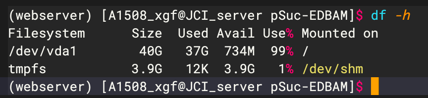
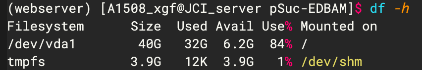
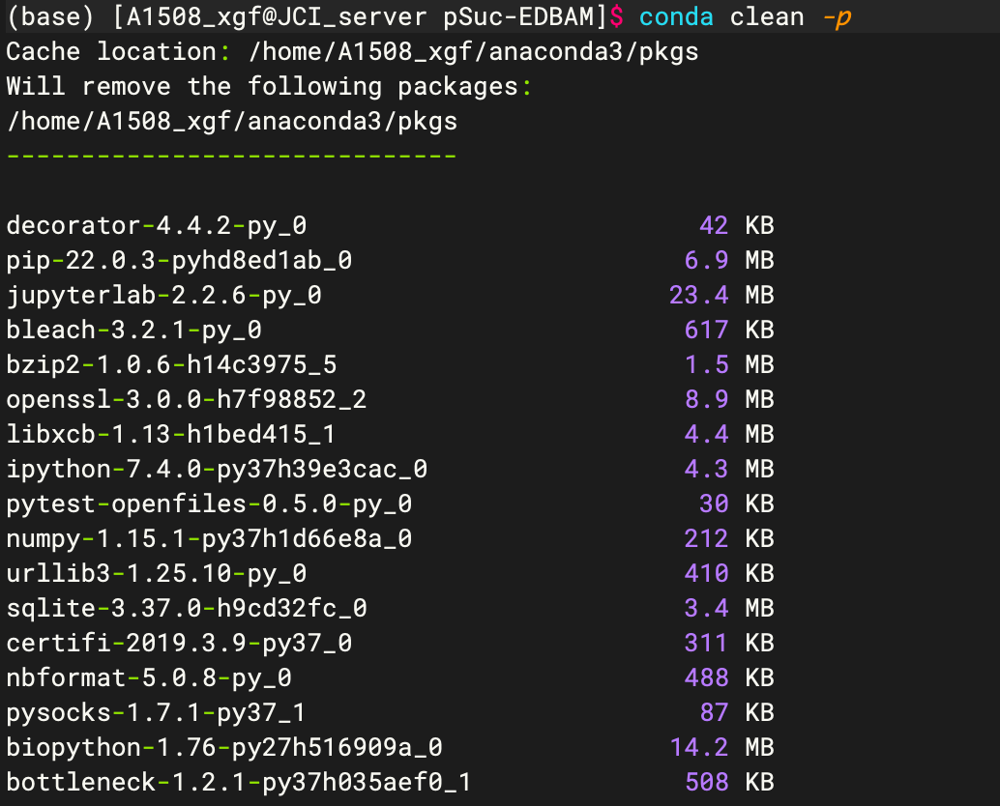
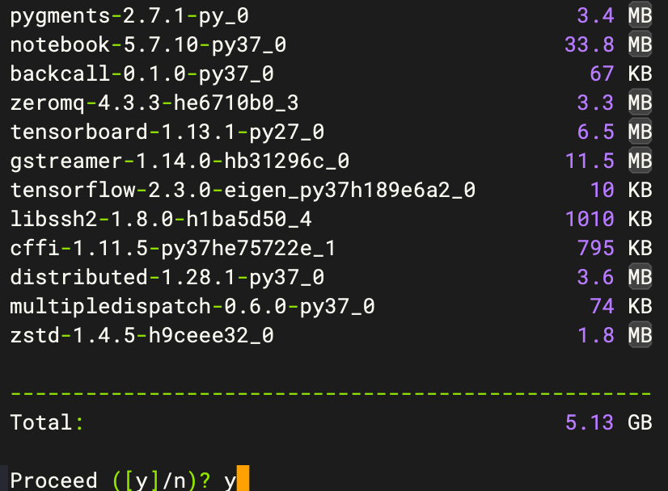
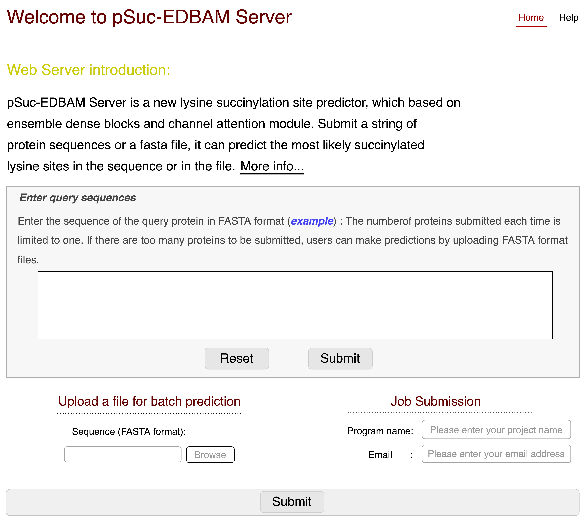

# Conda命令清理pkgs，一次完美的“瘦身”之旅

> 随着Python编程学习的不断深入，Anaconda所占的空间也越来越大，这几天在弄预测器部署到云服务器的事情，因为`内存空间不足`的问题导致我配置环境的依赖包根据安装不了，所以开始萌生出`把服务器瘦身`的冲动。

下图是清理前的服务器状态：



我们发现，随着部署服务器上的预测器越来越多，可用的空间越来越少了！！！那这么少的空间，我咋部署我的呢，着实头疼，问了实验室好几个人，都没办法解决，就更头疼了，也是很巧，睡了一觉起来，今早就解决了这个问题，着实很开心 ☘️ 撒花 🎉

效果如下图所示，成功将内存使用率降到了84%。



下面来介绍一下如何操作的吧：

首先，查阅资料发现，Anaconda文件夹下有一个pkgs文件夹，里面存放着各种包的使用过的各个版本及其压缩包，当你执行更新操作的时候，新版本和旧版本都会存在在pkgs文件夹里，同时我们知道，真正对Anaconda有用的文件夹是`lib/site-packages`，所以我大胆猜测，pkgs文件夹下的文件能删！！！

于是萌生一种想法：执行以下命令操作：

```shell
# 删除pkgs
rm -rf pkgs
# 创建pkgs文件夹
mkdir pkgs
```

但是，想想这样太粗暴了，万一删出问题，可就goodbye了 💥 毕竟云服务器是课题组的共有财产，删出问题可不得了哇！于是找到了一种稳妥的删除方式，亲测有效，如下：

那就是使用`conda`命令进行清理，有如下3种方式：

```shell
conda clean -p # 删除没有使用的包（非常推荐，我就是用的这种）
conda clean -t # 清理缓存的压缩包文件，可以试试，我没操作这个
conda clean -y -all # 删除全部的安装包及cache，可以试试，我没操作这个
```

推荐直接使用`conda clean -p`即可，这个命令已经可以清理出很大的空间了

执行这条命令：`conda clean -p`，会自动检查Anaconda中哪些包没有在包缓存中被硬依赖到其他地方：



我们会看到，总共检查到足足5.13G的缓存！！赶紧输入`y`，迫切的将其删除～～



然后就清理出5.13G的可用空间，真香，然后顺顺利利的将预测器部署到了服务器上，希望可以帮助到你 ✨

下面附一张手画的预测器主页面图，作为本文的结尾，希望可以给你以启迪，给你带来帮助 🌈




