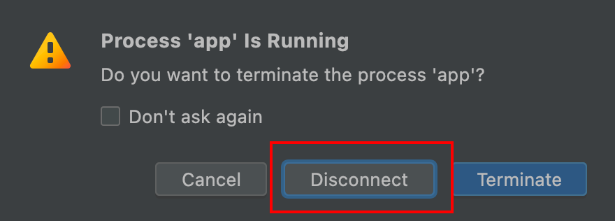
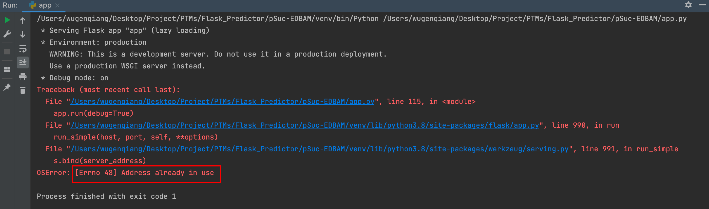
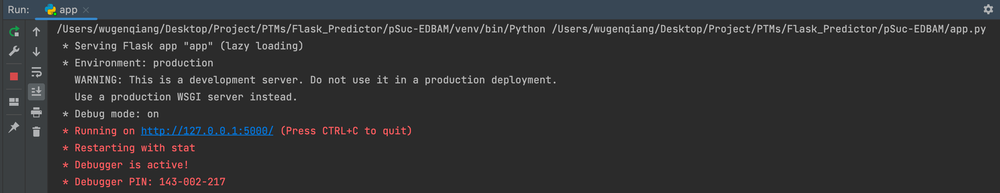
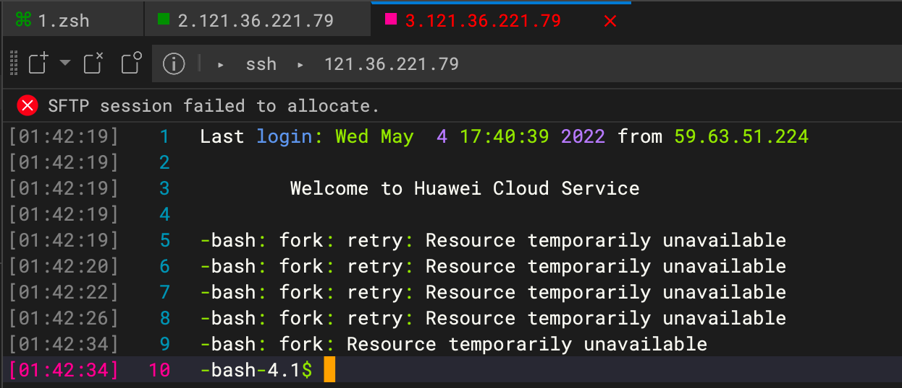
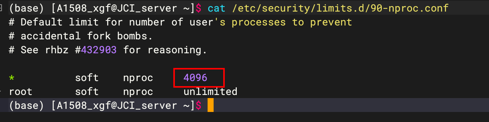

# 基于Flask构建预测器遇到的问题

> 本文操作基于编程平台：PyCharm，如使用其他编程平台，请根据实际情况进行解决。

## 问题一：预测器报错：OSError: [Errno 48] Address already in use

> 昨天在构建`pSuc-EDBAM`预测器的时候，预测器正在运行时，准备关闭PyCharm，这时提示下图所示，不小心点到了`Disconnect`，重新运行报错：`OSError: [Errno 48] Address already in use`

重新运行报错：

🍀 那如何解决呢？请看下面：

使用`lsof -i:端口号`可以查看占用某个端口的进程，我们在基于Flask框架构建预测器的时候，默认网址：127.0.0.1:5000，端口号是5000，所以解决方案如下：

步骤一：打开PyCharm中Terminal命令行，输入：`lsof -i:5000`，查看占用5000端口的PID；

步骤二：然后执行`kill -9 PID`即可杀掉该进程。

重新运行程序，即可运行成功：

## 问题二：云服务器出现-bash: fork: retry: Resource temporarily unavailable错误

> 在云服务器上操作时，出现`-bash: fork: retry: Resource temporarily unavailable`错误，继而登陆不了服务器，The server refused to start a shell.

起因是啥呢，是因为我在登陆服务器后执行ls命令，导致`-bash: fork: retry: Resource temporarily unavailable`

本质原因就是因为Linux操作系统无法创建更多进程，导致出错，所以我需要解决的就是扩大用户的进程，就要去修改Linux最大进程数：

步骤一：通过**ulimit -a**来查看当前Linux系统的一些系统参数，然后发现默认的`max user processes`只有1024

步骤二：执行` sudo vim /etc/security/limits.d/90-nproc.conf`操作，修改`max user processes`的值，我把它修改成了4096，看你还嫌少不，哼～

还好，最后pSuc-EDBAM预测器构建成功了，fighting！希望可以帮助到你 ☘️