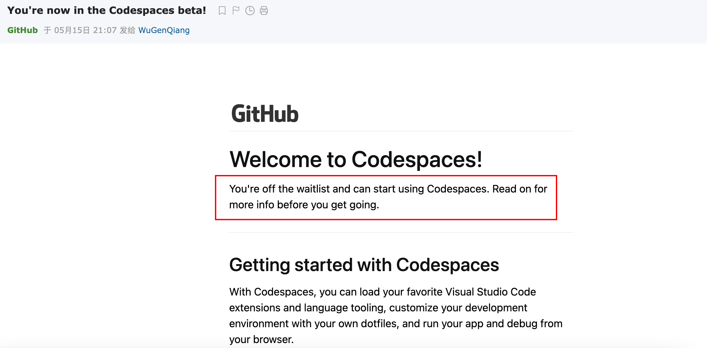
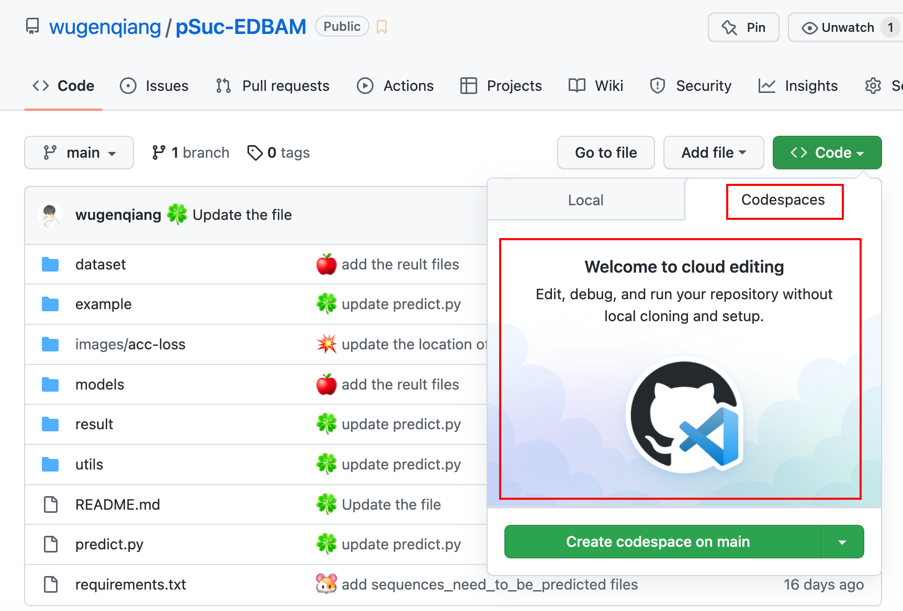
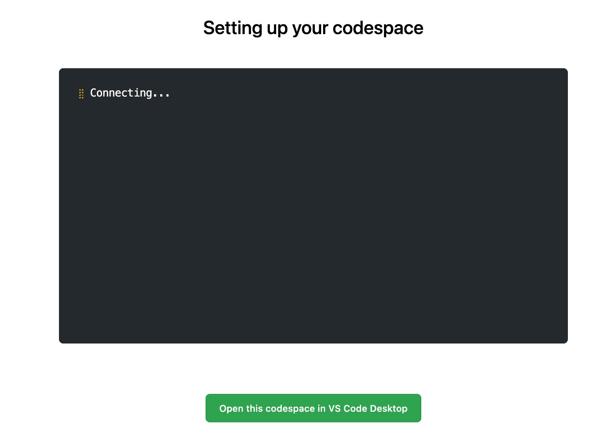
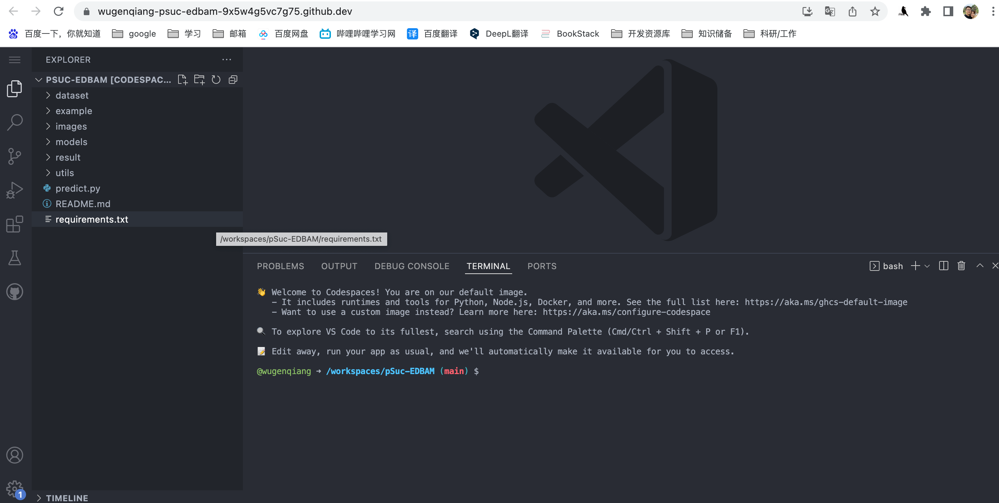
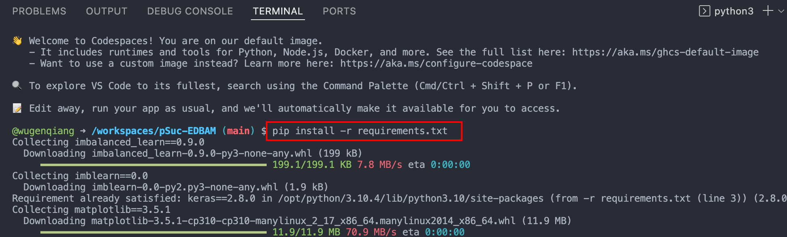
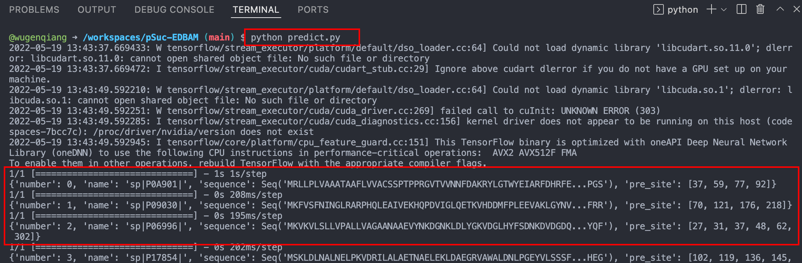
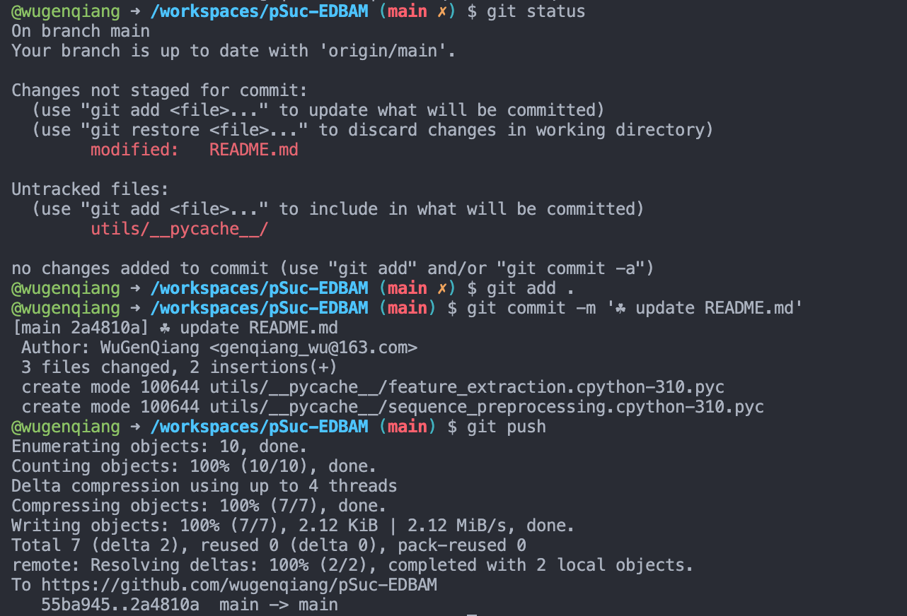
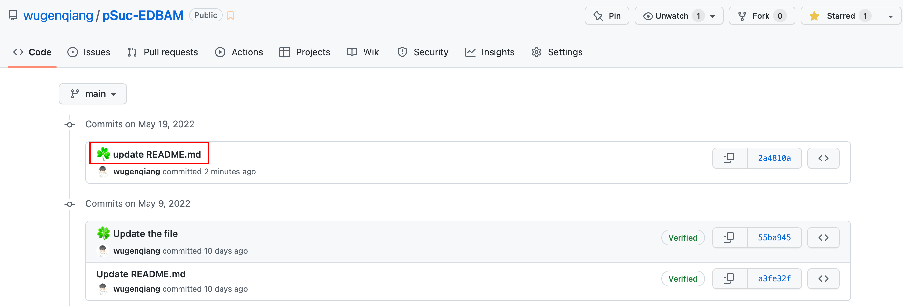

# Codespaces ——GitHub官方在线IDE

> GitHub 新功能：Codespaces，支持随时随地编写代码

其实在2020年5月，GitHub就已经推出了Codespaces功能，作为GitHub功能的云托管开发环境。提供线上的编程环境，可以编写或者运行GitHub仓库中的代码，但是这功能一直以来处于`内测阶段，未对外开放`，只有满足资格的用户才可以使用Codespaces功能。

幸运的是，前几天，GitHub给我发了邮件，告知我我已经可以使用这个功能了，很开心 ☘️



举例：随机打开GitHub中一个项目，比如：pSuc-EDBAM

链接：https://github.com/wugenqiang/pSuc-EDBAM

会发现，点击绿色的Code按钮，会出现Codespaces的提示，那么按照提示进行创建Codespaces操作。



然后系统会自动进行配置环境：



配置完成后，会进入到如下操作界面，这是GitHub官网提供的在线IDE界面，显然，这是我们常用的VS Code编辑器，熟悉吧 🌾



会发现，这就是完整版的`Online VS Code`，所有功能都能用，可以运行代码，可以使用Terminal，一切都是那么完美。

测试一下试试：

Step 1: 首先，加载依赖，在命令行中输入：

```python
pip install -r requirements.txt
```

如图所示：



Step 2: 运行predict.py文件

```python
python predict.py
```

执行如图所示：



是不是很完美，Online操作，`运行代码、修改代码完全没有问题`！当我们在GitHub中遇到一个想运行的代码，根本不再需要下载到本地然后再运行，现在直接可以通过Codespaces构建在线项目进行编辑即可。

或许你会问，那么可以把修改后的代码Push到GitHub仓库中嘛，可以确切的告诉你，完全可行！

跟本地操作，过程完全一样，还是add、commit、push操作，我们来试试看：

Step 1: 修改一个文件，比如修改README.md，可以使用`git status`查看修改情况

Step 2: 执行下列代码：

```python
git add .
git commit -m '☘️ update README.md'
git push
```

如图所示：



回到仓库看看，有没有更新成功，发现成功啦！



舒服了，看来这个 Codespaces 不仅仅是把代码 Clone 下来了，而且还做好了很多权限配置，知道我当前账号登录的情况下是可以直接 Push 代码的。

这样一来，我们以后似乎真的很多时候真的不需要本地 IDE了，看代码、写代码、测代码、推代码直接在Codespaces上就可以完成啦！

希望可以帮助到你 ☘️

