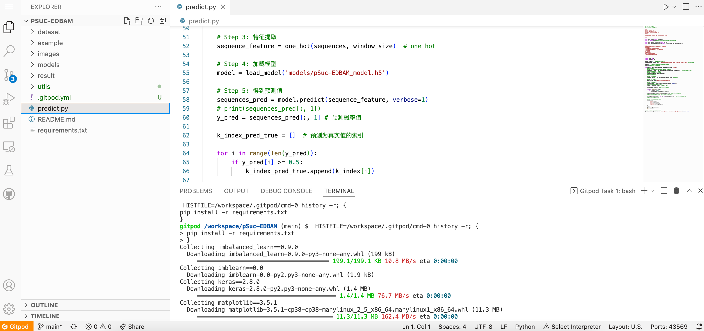
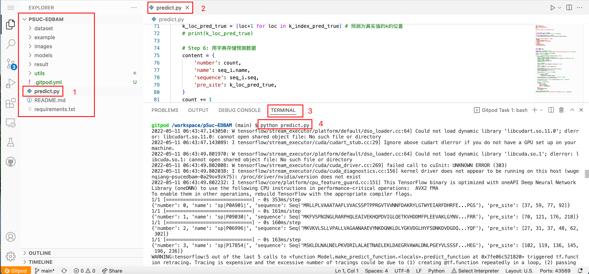

# Gitpod——强大的在线IDE

> Gitpod是一个强大的在线IDE（集成编程环境），提供了VSCode风格的编辑器，允许在线编写代码完成开发。Gitpod基于容器技术，可以帮助我们一键编译、构建、运行任何Github项目，而且每个项目的运行都是相互隔离的，随用随创建、用完可随时回收，非常灵活。

界面如下图所示：

注：如果是看中了一个Github项目，但是不想在本地去搭建各种环境去查看项目的运行效果，那么最好的方式就可以利用Gitpod来构建在线的IDE。

Gitpod中的IDE基于Theia，这是一个开源项目，我们可以将其视为VS Code的在线版本。Theia是一个真正的开源项目，由Eclipse Foundation托管，由TypeFox，Ericsson，Red Hat，Arm等的各类工程师开发。Theia基于VS Code及其语言服务协议，支持大多数主流编程语言。

### 如何使用Gitpod

（示例）在Chrome浏览器中输入：

https://gitpod.io/#/github.com/wugenqiang/pSuc-EDBAM

注意，`github.com/wugenqiang/pSuc-EDBAM`代表你要运行的Github项目。

即可进入到相应的运行界面啦，具体的可以自行操作看看。

### 如何运行项目

以`pSuc-EDBAM`举例：

这个项目里面有一个`predict.py`文件，这是我构建好的预测琥珀酰化的文件，在命令行执行`python predict.py`即可运行，得出想要的预测结果。

希望可以帮助到你 ☘️

