# IDEA 的使用

## IDEA 前言提要

本人在学习计算机专业知识的过程中，深知学习笔记的重要性，所以整理了相关学习笔记，为了在需要的时候方便查看，目前正在逐渐完善和补充中，如果本学习笔记有幸被您光顾和使用，在使用中出现任何疑问或者有更好的见解的话，可以右下角 OPEN CHAT 我，也可以右上角 邮我，当然还可以加入我的讨论组，如果觉得本书对你有帮助，可以打赏我，以鼓励我更好的创作，下面附赞助二维码，再次谢谢您的大力支持！

<div ></div>

> 觉得文章好，不妨请我喝杯 Coffee，祝福好心人年年高升！

## IDEA 更新使用

### IDEA 2019.3.3

> 官网下载之后，采用[激活方式](/ToolBox/IDEA?id=idea-201934)才能激活！百度云链接下载直接激活！推荐使用百度云链接下载，集成了很多好用的插件和功能！

* 下载一：[官网下载 https://www.jetbrains.com/idea/](https://www.jetbrains.com/idea/)

* 下载二：百度云链接：https://pan.baidu.com/s/1z_Z1wigY0Yt3xfTIg_Idhg 
  提取码：4clm

* 汉化包链接：https://pan.baidu.com/s/1KMkgzFPdxcd_Kinv65yZmg 
  提取码：pldz 

### IDEA 2019.3.4

> IDEA 2019.3.3 和 IDEA 2019.3.4 激活方式如下：

* 下载 jetbrainsCrack.jar 

下载链接：https://pan.baidu.com/s/1ADriYJLu1S5BLR1XSMMbSg 
提取码：kpjy

* 将 jetbrainsCrack.jar 放入 bin 目录下

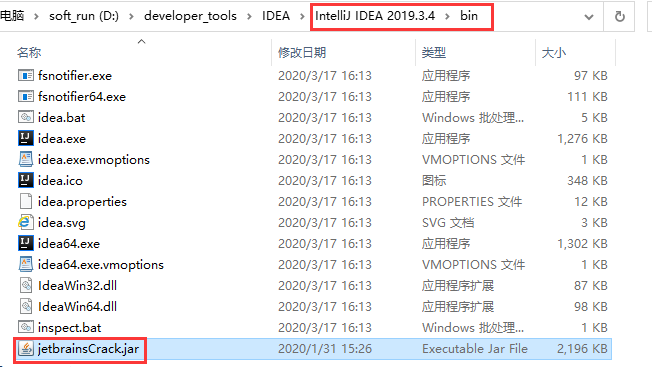

* 启动 IDEA，点击 Configure --> Edit Custom VM Options，将下面命令复制到文件中，然后重新启动 IDEA

```
-javaagent:..\..\bin\JetbrainsCrack.jar
```

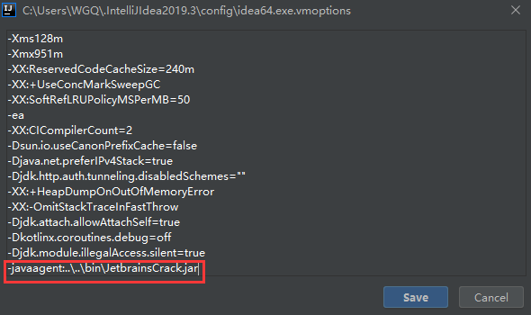

* 点击 IDEA 菜单 Configure --> Manage License --> License Server，在 License Server 中输入 http://jetbrains-license-server 到 License Server Address 中，然后先点击 Discover Server，等待后点击下面 Actuvate 即可，接着退出重启 IDEA

```
http://jetbrains-license-server
```

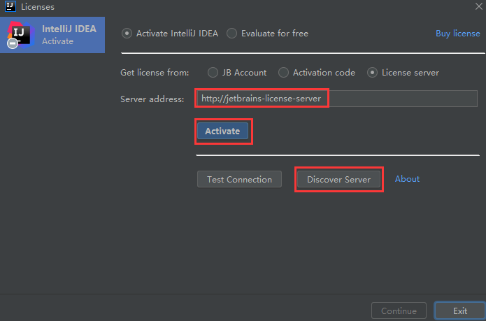

* 重新进入 IDEA 菜单 Configure --> Manage License，此时会发现 IDEA 已经给我们生成了服务器地址：

```
http://fls.jetbrains-agent.com
```

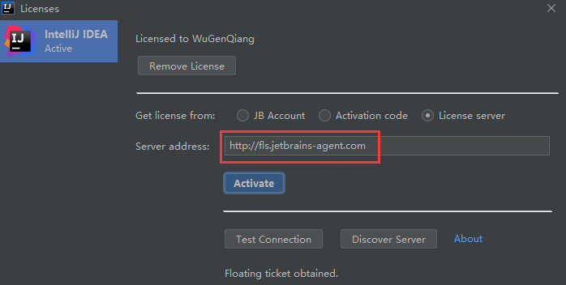

完美撒花！

!> 不过，可能会提醒下面信息：

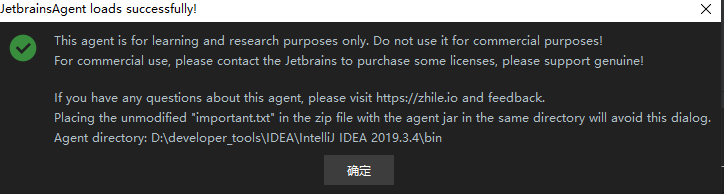

解决方案：

下载文件 important.txt 放在与 JetbrainsCrack.jar 同目录 bin 下：

百度云下载链接：https://pan.baidu.com/s/1beei7a6wVFSWDrPIQeQCLA 
提取码：7ybo 

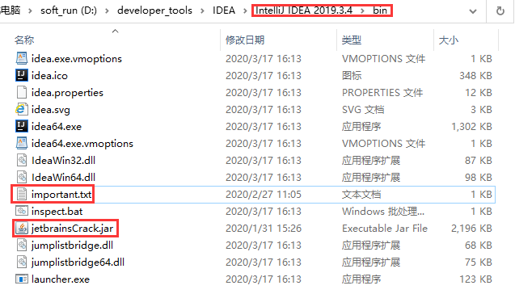

重新打开 IDEA 刚刚提示信息就没啦，完美撒花！

## IDEA maven 配置

> maven 如今是 idea 当中必不可少的工具了，这里主要说明一下如何进行maven 配置。虽然 idea 有一些默认的 maven 配置，但是如果想要好用，最好还是自己配置一个 maven。

idea maven配置的方法和步骤如下：

* （1）官方下载一个 maven：

下载地址：http://maven.apache.org/download.html

找到 Binary zip archive => apache-maven-3.6.3-bin.zip，然后点击 apache-maven-3.6.3-bin.zip 进行下载，也可以直接点击下面的地址进行下载：

[apache-maven-3.6.3-bin.zip](https://mirror.bit.edu.cn/apache/maven/maven-3/3.6.3/binaries/apache-maven-3.6.3-bin.zip)

* （2）将下载的文件解压到自己的安装目录，比如：

D:\developer_tools\maven\apache-maven-3.6.3

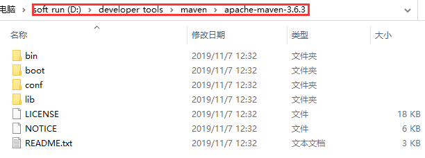

* （3）配置maven：

用编辑器打开文件 D:\developer_tools\maven\apache-maven-3.6.3\conf\settings.xml，并对文件里面的内容进行修改：

在 settings 的节点下增加镜像配置：

```xml
<mirrors>
    <mirror>
      <id>alimaven</id>
      <name>aliyun maven</name>      
      <url>http://maven.aliyun.com/nexus/content/groups/public/</url>
      <mirrorOf>central</mirrorOf>
    </mirror>
    <mirror>
       <id>repo2</id>
       <name>repo2 maven</name>      
       <url>http://repo2.maven.org/maven2</url>
       <mirrorOf>central</mirrorOf>
     </mirror>
  </mirrors>
```

* （4）修改 idea 自带maven：

打开 idea 界面的 setting 配置，配置路径如下：

File --> Settings --> Build, Execution, Deployment --> Build Tools --> Maven

将 Maven home directory 修改为 D:\developer_tools\maven\apache-maven-3.6.3，User settings file 修改为 D:\developer_tools\maven\apache-maven-3.6.3\conf\settings.xml，并将 User settings file 后面的Override进行勾选（否则不生效），然后点击Apply或OK，保存一下。

> 注：local repository 想改就改哈，就是镜像存的位置，如果要改 local repository，记得回 setting.xml 里添加：

```xml
<!--配置本地仓库路径-->
<localRepository>D:\developer_tools\maven\my_maven_local_repository</localRepository>
```

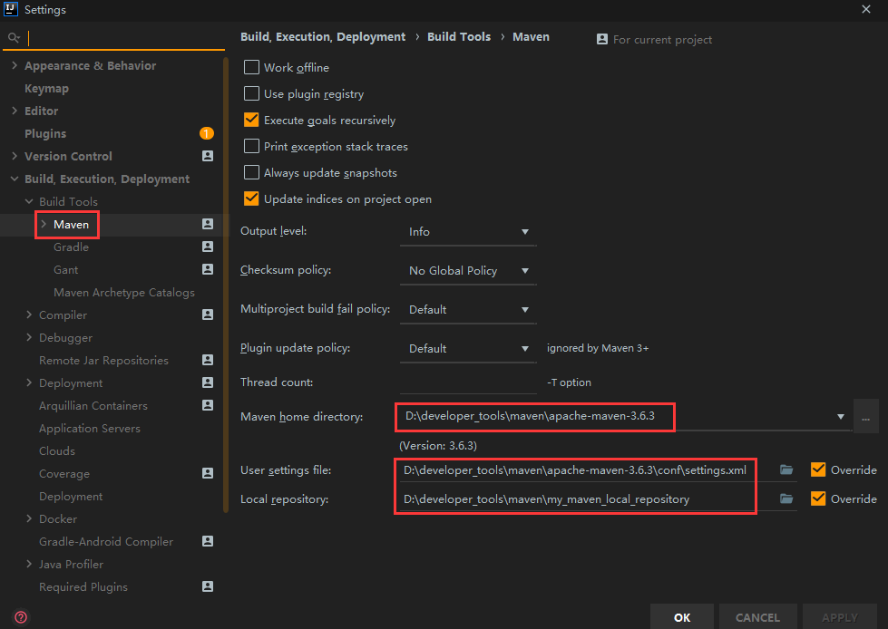

到这里 maven 配置成功

## IDEA 注释模板设置

### 设置类注释

file --> settings --> Editor --> File and Code Templates --> Includes

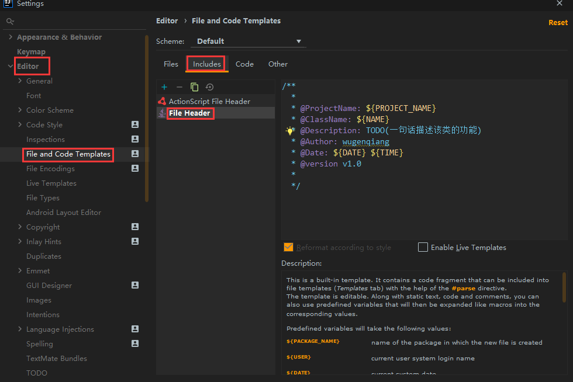

```
/**
  * @ProjectName: ${PROJECT_NAME}
  * @ClassName: ${NAME}
  * @Description: TODO(一句话描述该类的功能)
  * @Author: ${USER}
  * @Date: ${DATE} ${TIME}
  * @version v1.0
  */
```

### 设置方法注释

file --> settings --> Editor --> Live Templates

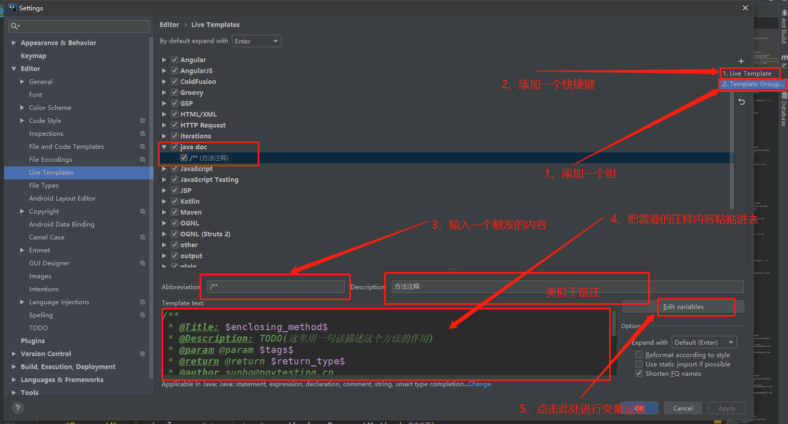

```
/**
 * @Title: $enclosing_method$
 * @Description: TODO(这里用一句话描述这个方法的作用)
 * @param @param $tags$
 * @return @return $return_type$
 * @author $user$
 * @throws
 * @date $date$ $time$
 */
```

## IDEA 插件推荐安装

### **Stackoverflow** 

> 这个插件其实是最实用的插件，程序猿遇到的问题，基本都能找到回答，但是它使用的是 google 搜索引擎，需要使用 vpn 来进行操作

选中需要搜索的问题，然后，右键点击


### TranslationPlugin

> 对于不经常使用英语的同学来说，对类，变量，方法想取一个合适的名字，此时发现自己的词汇早已还给老师 ，怎么办，这个插件能帮到你~

直接选中你想要翻译的词，然后右键选择

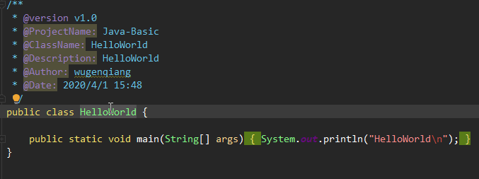


### Mybatis-Log-plugin

> 开发的项目一般都少不了日志系统，而我们在书写 mysql 语句的时候，参数的对应，往往有时候会忽略，mybatis 自己控制的参数编译对应，个人感觉有点反人类，我们可以使用这个插件变成自己比较直观的对应~

选中需要转换的 mybatis log 日志，然后点击右键，选择 Restore sql from slection

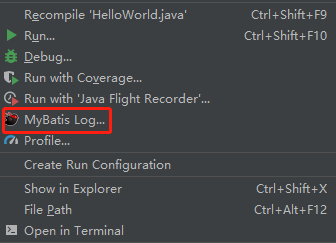

### GsonFormat

> 在与组外或者不同部门对接接口时候发现，有时候对方返回的是 JSON 对象，自己想要用一个对象去接受，以便于处理后续，此时，需要自己一个个手动去输入属性么，肯定很抓狂，不过咱们可以使用这个插件来解决这个尴尬问题，当然也可以使用外部网址解决，比如 bejson 这个网站~ 

### IdeaJad

> 以前查看 class 文件形式的时候或者 jar，都会使用一个外部反编译工具，这样操作明显不方便，使用此插件可以一直在 idea 中查看文件~ ps：其实 Inteli Idea这个编译器已经自带了反编译功能，老夫~~~~~~

选择 class 文件，右键 Decompile, 完成反编译

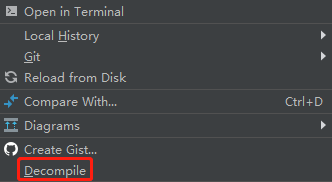

### Free-idea-mybatis

> mybatis xml 和对应的 mapper 之间来回切换的时候，有时候不同人开发，放置的位置又不同，使用此插件后，来回切换的时候异常方便，和所放置的位置无关~

### CodeGlance

> 再也不用疯狂拖拽到底去找一遍啦，多不方便呀，使用此插件可以查看缩略图一样，快速切换到自己需要去的地方~

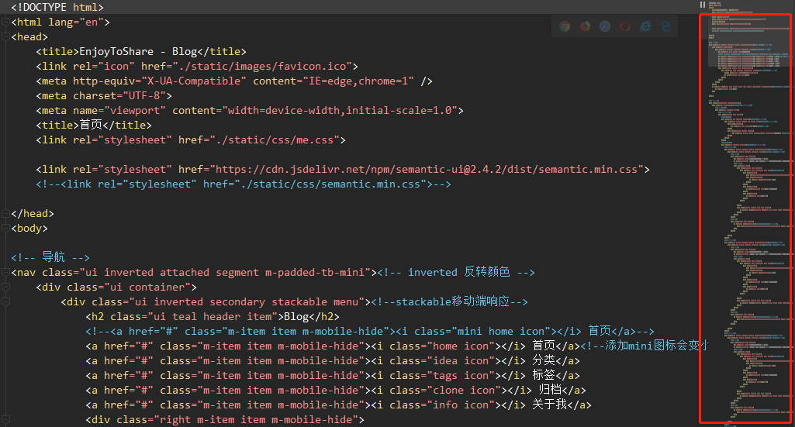

### Alibaba Java Coding Guidelines

> 一款阿里巴巴公司试行的开发设计规范~ 

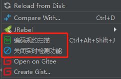

### Lombok

> Lombok 能以简单的注解形式来简化 java 代码，提高开发人员的开发效率。例如开发中经常需要写的 javabean，都需要花时间去添加相应的 getter/setter，也许还要去写构造器、equals 等方法，而且需要维护，当属性多时会出现大量的 getter/setter 方法，这些显得很冗长也没有太多技术含量，一旦修改属性，就容易出现忘记修改对应方法的失误。Lombok 能通过注解的方式，在编译时自动为属性生成构造器、getter/setter、equals、hashcode、toString 方法。

### JRebel

> 热部署插件，在修改完代码后，不用再重新启动，很实用！但是，不是免费的

热部署只是针对 class 文件,源文件这些。对于属性文件 .xml 或 .properties，只要修改了，都需要重启服务器，因为属性文件是在服务器启动的时候加载的，不可能被热部署识别到。

安装好，检查几个必要的设置看是否已配置，否则热部署可能没效果：

1）设置项目自动编译

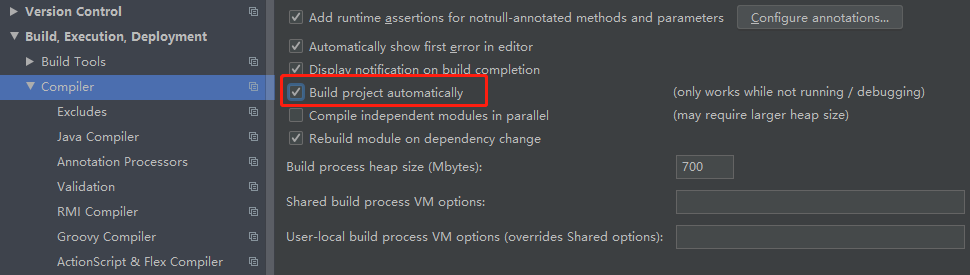

2）设置 compiler.automake.allow.when.app.running 

快捷键 ctrl+shift+A 或者 菜单 help->find action… 打开搜索框搜索 “registry”，像图中勾选

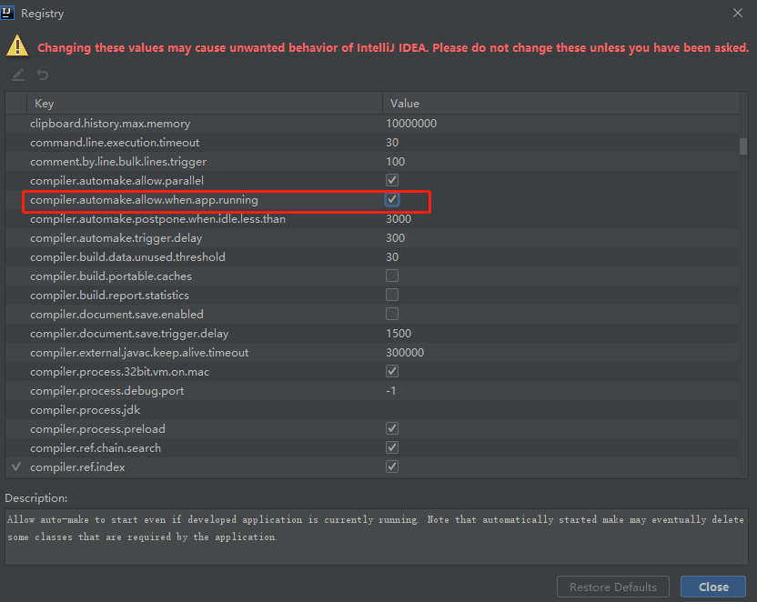

3）需要热部署的项目在此处是否勾选

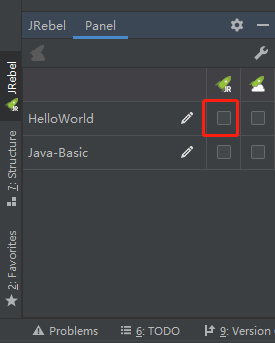

4）可能很多人想要知道破解方法，在此参考了[这篇博客](https://blog.csdn.net/qierkang/article/details/95095954)，方法如下：

* 点击 [JRebel](https://jrebel.qekang.com/) 自动获取 GUID 地址，复制红框内地址：

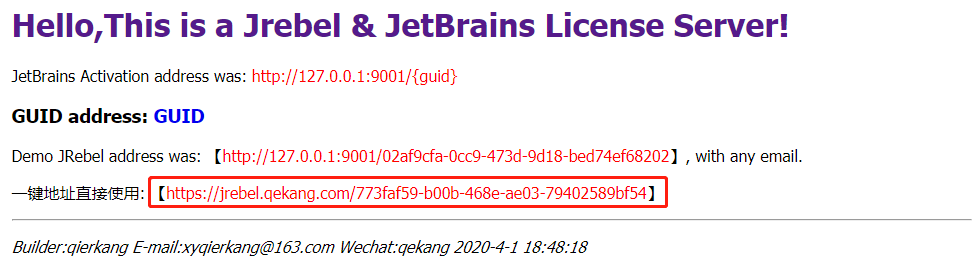

点击此处：

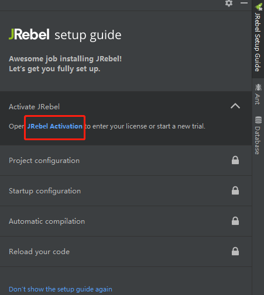

输入刚刚复制的地址，邮箱默认输入：xyqierkang@163.com 若改变，就是到刚刚那个网站地址下面一行寻找即可

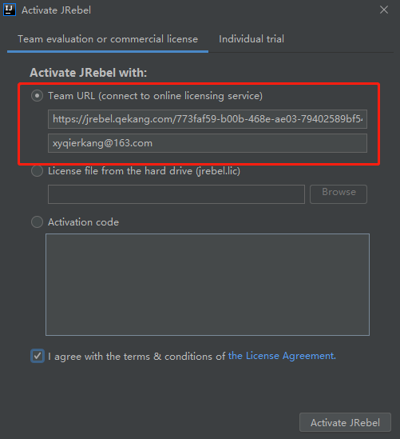

出现这个说明成功激活！

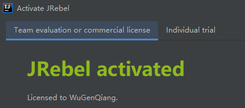

接着根据提示信息操作即可：

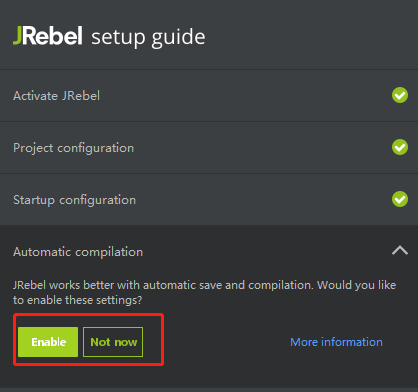


### Key promoter X

> 快捷键提示工具：`Key Promoter X` 是一个提示插件，当你在 `IDEA` 里面使用鼠标的时候，如果这个鼠标操作是能够用快捷键替代的，那么 `Key Promoter X` 会弹出一个提示框，告知你这个鼠标操作可以用什么快捷键替代。对于想完全使用快捷键在 `IDEA` 的，这个插件就很有用。

比如会这样提示：


