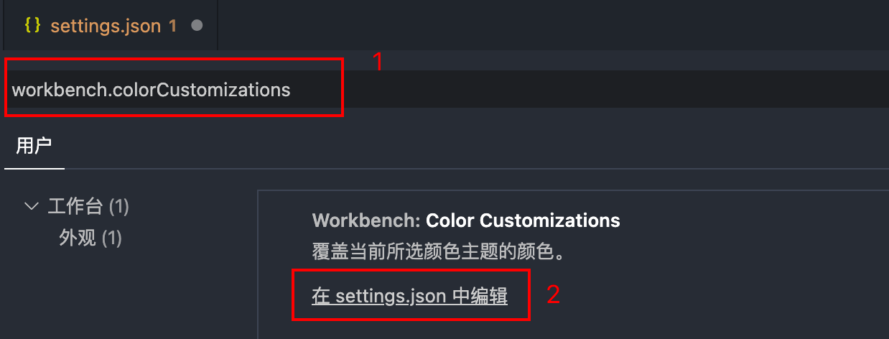
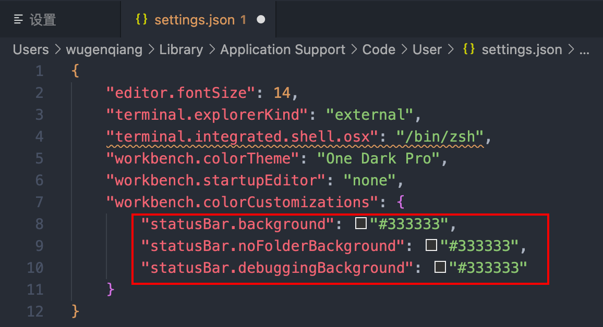

# 修改VSCode底部状态栏颜色

Step 1: 首先，点击左下角齿轮⚙️，点击设置；

Step 2: 搜索：`workbench.colorCustomizations`，然后点击在`settings.json中编辑`;



Step 3: 修改`settings.json`内容，在 `workbench.colorCustomizations`中添加三行代码即可，颜色自定义，设置为自己喜欢的就可以：

```json
"statusBar.background": "#333333",
"statusBar.noFolderBackground": "#333333",
"statusBar.debuggingBackground": "#333333"
```

如图所示添加：



效果图如下：


不知道怎么修改的可以来试试看，希望可以帮助到你 ☘️

