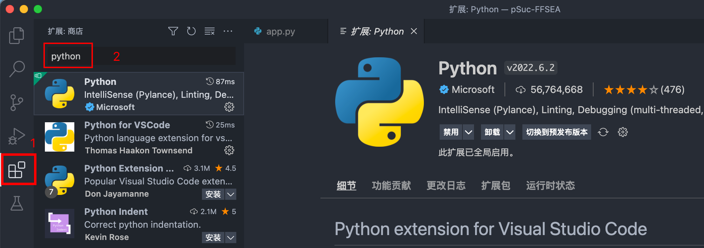
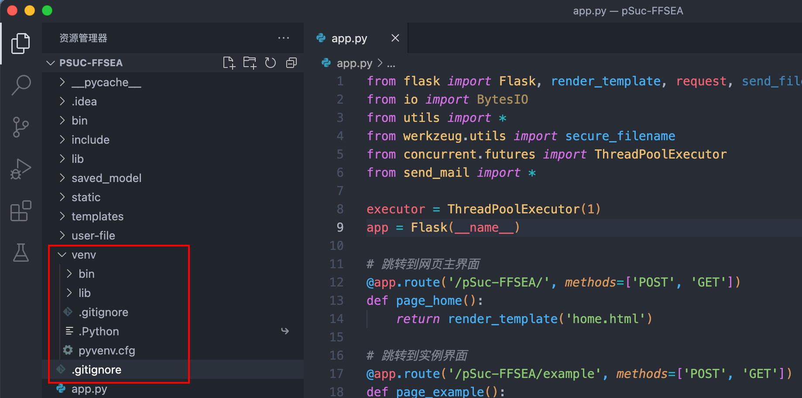
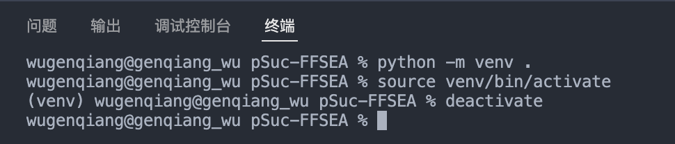
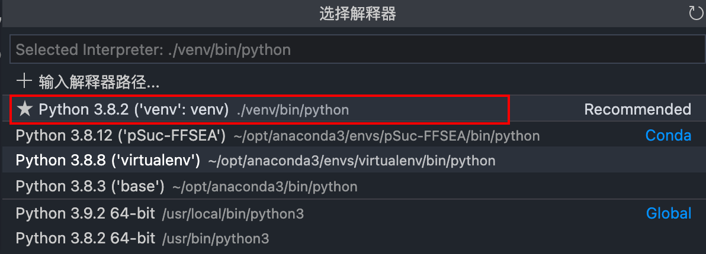
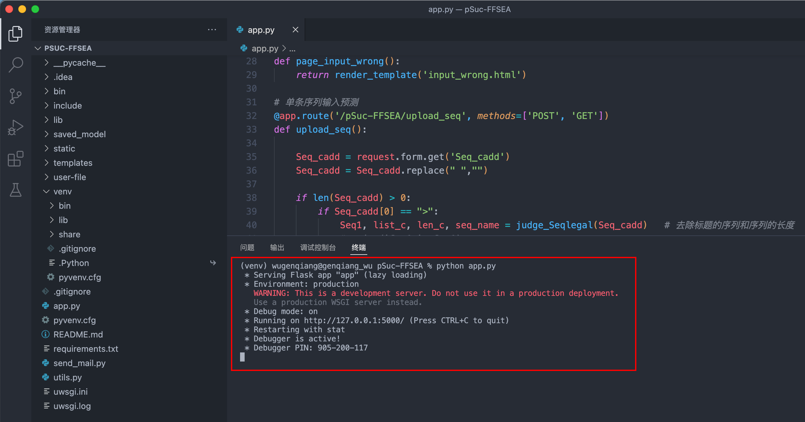

# VSCode搭建Python虚拟环境

Step 1: VSCode下载Python插件并安装



Step 2: 在项目文件夹下执行命令：

```python
python -m venv .
```

则会在文件夹中创建一个venv文件夹，这就是Python的虚拟环境



Step 3: 激活虚拟环境

```python
source venv/bin/activate
```

激活虚拟环境之后，pip安装的依赖库都会安装在虚拟环境中，而不会安装在全局环境中，这样可以减少不同项目之间同名库的不同版本需求的冲突。

注：如需关闭虚拟环境，执行命令：

```python
deactivate
```

如图所示：



> 注意，Python的虚拟环境创建之后，如果想要使用该虚拟环境，则需要指定解释器为虚拟环境中的解释器。

`指定虚拟环境中解释器`的操作步骤如下：

Step 1: ctrl + shift + p (Mac: command + shift + p)

输入：Python: Select Interpreter

选择自己需要的解释器即可，如图所示：



完成。

测试一下，发现，正常运行即可：



希望可以帮助到你 ☘️