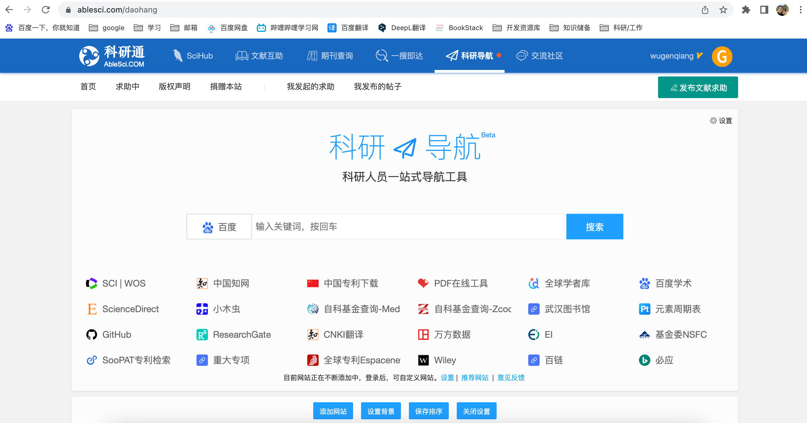
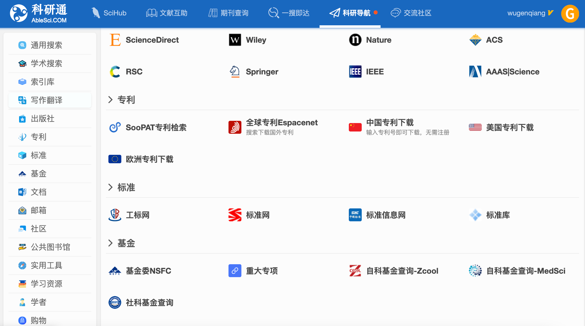
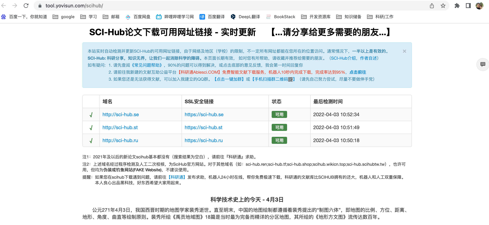
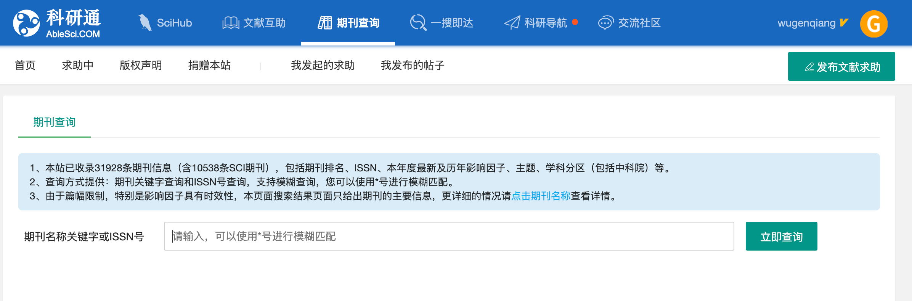
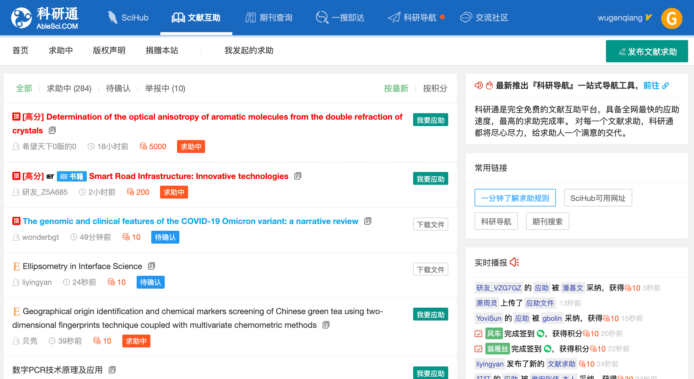
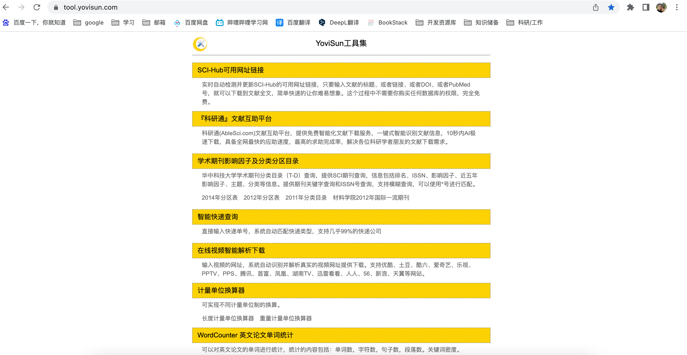
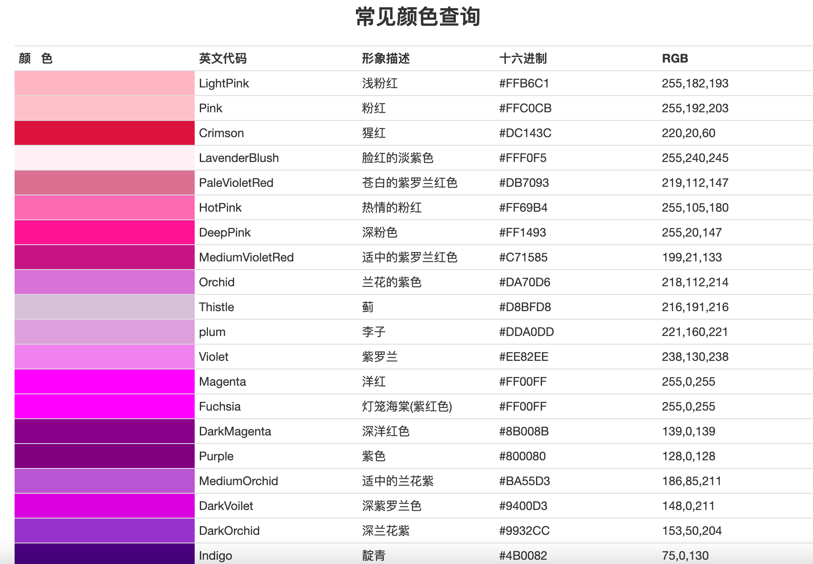

# 科研通: 科研导航+文献互助+好用的工具集

> 🌾 最近我发现一款比较好用的科研导航网站——科研通，分享给爱学习的大家～～☘️

很偶然的机会，让我遇见了科研通，这是一个非常棒的文献互助、导航网站，当你需要进行相关文献搜索、期刊查询、文献互助等等，都可以求助Ta。

`科研通网址:` https://www.ablesci.com/

这是科研通的科研导航界面，提供了一些比较常用的学术网站，简洁明了，很直观，并且我们可以根据自己的需求自定义网站，是不是很nice 🌹。

并且提供了相当丰富的检索网站，可以去看看，有没有自己需要的：

最值得肯定的是，科研通帮我们过滤掉了SCI-Hub论文下载中伪装的或者钓鱼网站，比如sci-hub.ren;sci-hub.tf;sci-hub.shop;scihub.wikicn.top;sci-hub.scihubtw.tw，会发现这些网站进入之后都会有广告，虽说也可以下载，但还是有点不放心，下面列举几个比较稳定的官方SCI-Hub：

* [http://sci-hub.se](http://sci-hub.se/)
* [http://sci-hub.st](http://sci-hub.st/)
* [http://sci-hub.ru](http://sci-hub.ru/)

日常科研通会进行检测，并提供能用的SCI-Hub网址，从这里进行查看：

网址: https://tool.yovisun.com/scihub/

也可以进行期刊查询

当然，文献求助也是有的啦，应该会操作，这界面一目了然哈哈哈

下面放大招 ☘️

科研通提供了一个工具集网站，里面提供了很多好用的工具，对你有用的可以拿来试试看。

网址: https://tool.yovisun.com/

截图里的工具也只是一部分工具，可以登陆网址去查看，另外，里面提供了一个“RGB在线拾取颜色”的网址: https://tool.yovisun.com/rgbcolor/ 

不仅可以手动提取颜色，还提供了常用颜色查询，使用起来很方便。

就说这么多啦，喜欢的可以自己去看看哈 🌾