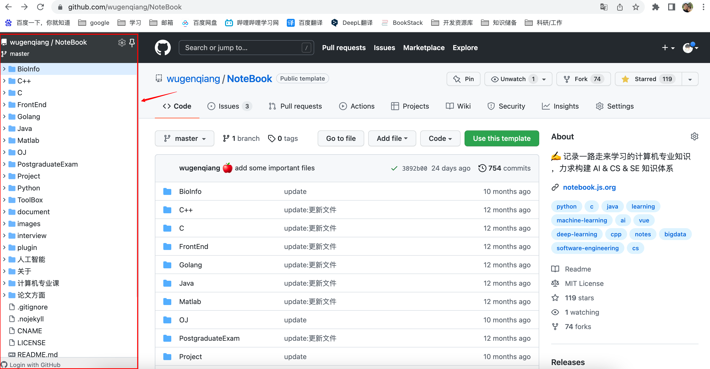
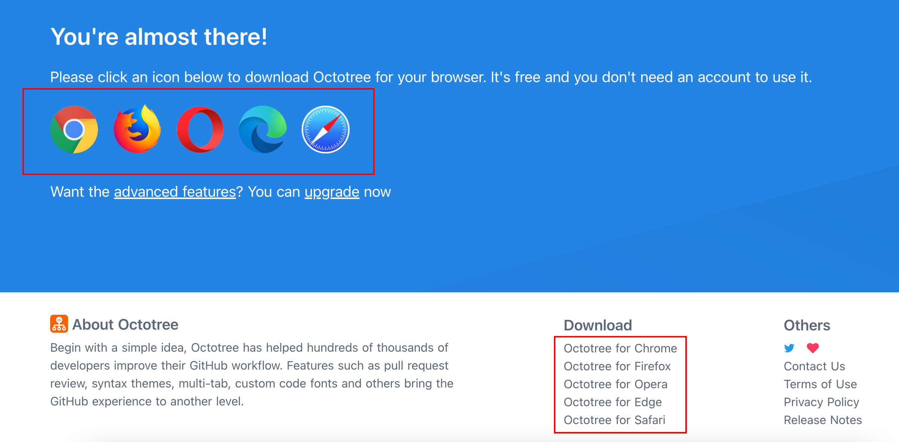
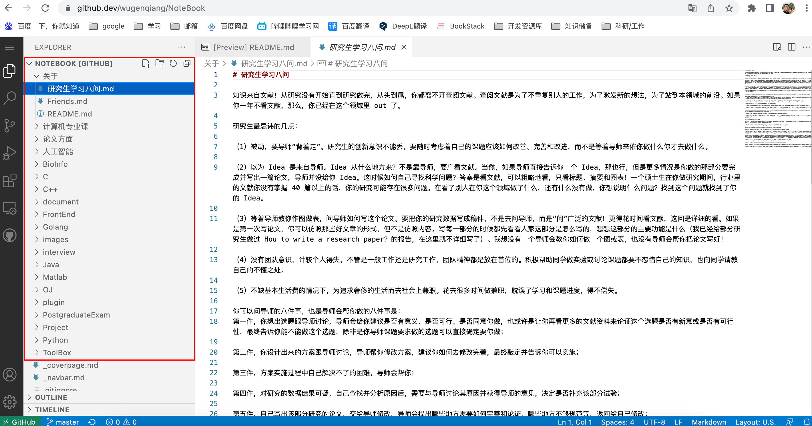

# Octotree——Github设置目录树结构的最佳方案

> 浏览器插件: Octotree，这是增强 GitHub 代码审查和探索的浏览器扩展，可以显示Github目录树

效果如图所示：

目前支持以下几款浏览器，可以试试看：

浏览器插件可以从官网下载，官网地址：https://www.octotree.io/download

可能谷歌插件需要翻墙才能去应用商店安装扩展，所以在这里我把这个插件下载下来，方便没办法翻墙的同学使用，将crx文件拖进扩展程序页面即可，扩展程序网址如下：chrome://extensions/

希望可以帮助到你 ☘️

昨天从好朋友那里了解到，Github官方也有自己的目录树，方法如下：

首先，打开Github中的代码库，例如：https://github.com/wugenqiang/NoteBook

然后将网址中的`com`改成`dev`，即：https://github.dev/wugenqiang/NoteBook

效果如图所示：

今天就分享到这里，希望可以给你带来帮助 🍁 感恩 🌸