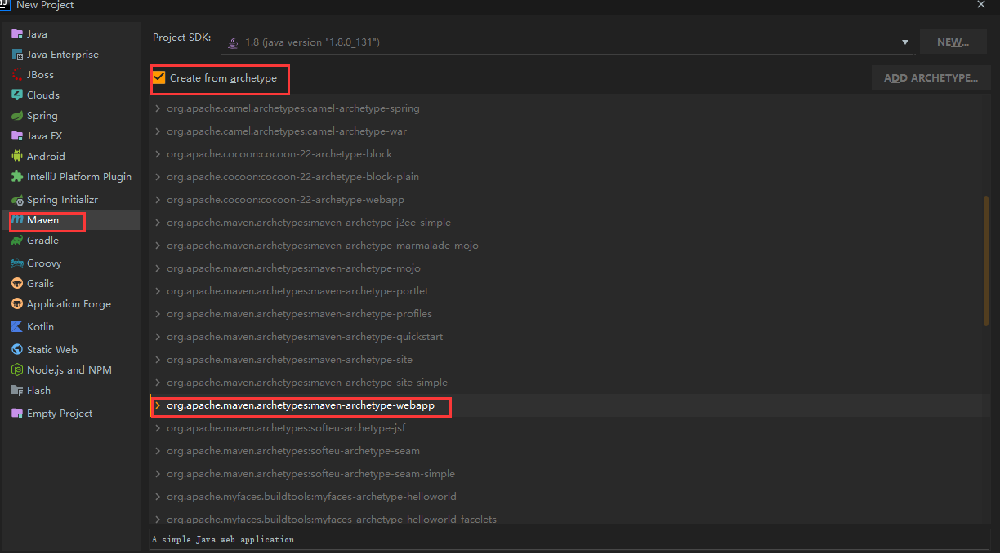
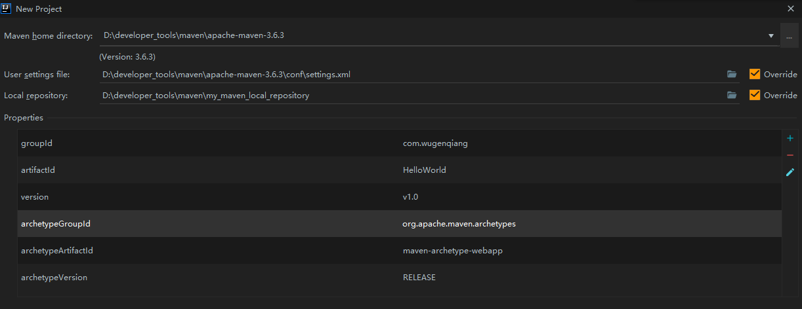

# SpringBoot

## 前言

> SpringBoot 是由 Pivotal 团队提供的全新框架，其设计目的是用来简化新 Spring 应用的初始搭建以及开发过程。该框架使用了特定的方式来进行配置，从而使开发人员不再需要定义样板化的配置。通过这种方式，Spring Boot 致力于在蓬勃发展的快速应用开发领域( rapid application development )成为领导者。

优点：

- 快速创建独立运行的 Spring 项目以及与主流框架集成
- 使用嵌入式的 Servlet 容器，应用无需打成 WAR 包
- starters 自动依赖与版本控制
- 大量的自动配置，简化开发，也可修改默认值
- 无需配置 XML，无代码生成，开箱即用
- 准生产环境的运行时应用监控
- 与云计算的天然集成

版本约束：

| 软件     | 版本                         |
| -------- | ---------------------------- |
| jdk1.8   | Spring Boot 推荐jdk1.7及以上 |
| maven3.x | maven 3.3以上版本            |
| IDEA     | 2019.3.3（本人）             |

## Hello World

> 创建 maven 项目，以 Hello World 项目进行入门



正常情况下 maven 设置默认即可，若需配置 maven 请移步：[IDEA maven 配置](ToolBox/IDEA?id=idea-maven-配置)    



* （1）在 pom.xml 中导入 SpringBoot 相关的依赖：

```xml
<parent>
        <groupId>org.springframework.boot</groupId>
        <artifactId>spring-boot-starter-parent</artifactId>
        <version>2.2.1.RELEASE</version>
        <relativePath/>
    </parent>

    <dependencies>
        <dependency>
            <groupId>org.springframework.boot</groupId>
            <artifactId>spring-boot-starter-web</artifactId>
        </dependency>
    </dependencies>
```

* （2）编写一个主程序，启动 SpringBoot 应用


* （3）编写一个 Controller