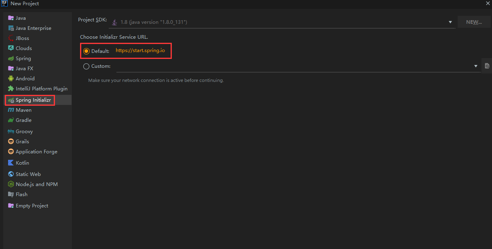
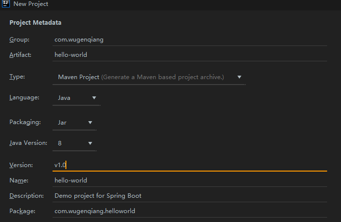
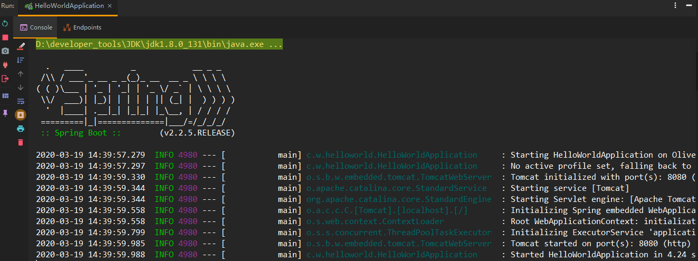
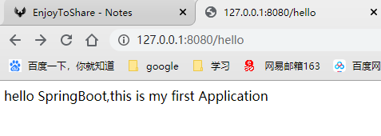
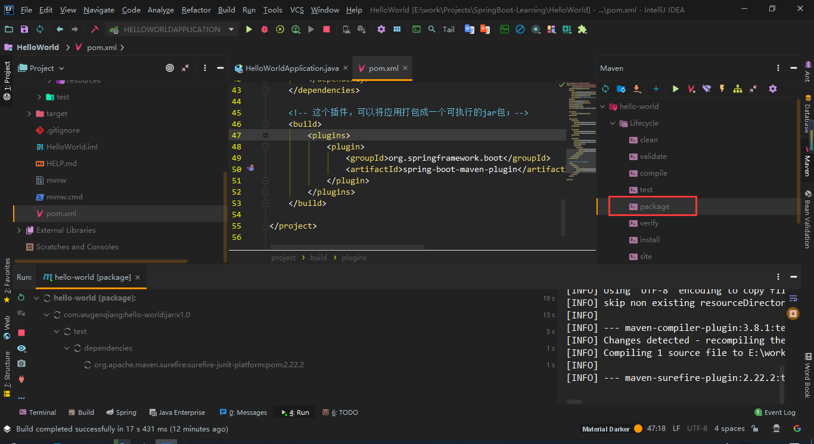
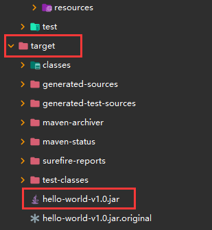
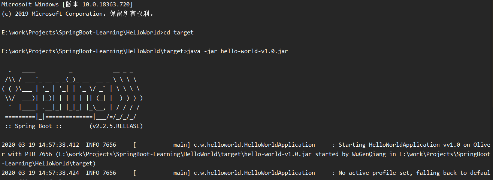
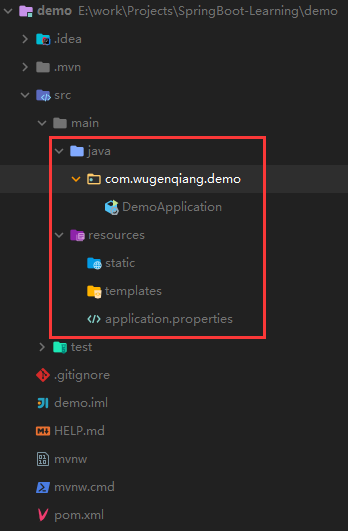

# SpringBoot

## 前言

> SpringBoot 是由 Pivotal 团队提供的全新框架，其设计目的是用来简化新 Spring 应用的初始搭建以及开发过程。该框架使用了特定的方式来进行配置，从而使开发人员不再需要定义样板化的配置。通过这种方式，Spring Boot 致力于在蓬勃发展的快速应用开发领域( rapid application development )成为领导者。

优点：

- 快速创建独立运行的 Spring 项目以及与主流框架集成
- 使用嵌入式的 Servlet 容器，应用无需打成 WAR 包
- starters 自动依赖与版本控制
- 大量的自动配置，简化开发，也可修改默认值
- 无需配置 XML，无代码生成，开箱即用
- 准生产环境的运行时应用监控
- 与云计算的天然集成

版本约束：

| 软件      | 版本                                                         |
| --------- | ------------------------------------------------------------ |
| jdk 1.8   | Spring Boot 推荐 jdk 1.7 及以上                              |
| maven 3.x | [maven 3.3 以上版本](https://wugenqiang.github.io/CS-Notes/#/ToolBox/IDEA?id=idea-maven-配置) |
| IDEA      | [2019.3.4](https://wugenqiang.github.io/CS-Notes/#/ToolBox/IDEA?id=idea-201934)（本人） |

## Hello World

> 以 Hello World 项目进行入门



如下图设置：



正常情况下 maven 设置默认即可，若需配置 maven 请移步：[IDEA maven 配置](ToolBox/IDEA?id=idea-maven-配置)    


* （1）在 pom.xml 中导入 SpringBoot 相关的依赖：

若已经存在，则不用添加：

```xml
<parent>     
    <groupId>org.springframework.boot</groupId>
    <artifactId>spring-boot-starter-parent</artifactId>
    <version>2.2.5.RELEASE</version>
    <relativePath/> <!-- lookup parent from repository -->
</parent>

<dependencies>
    <dependency>
    	<groupId>org.springframework.boot</groupId>
    	<artifactId>spring-boot-starter-web</artifactId>
    </dependency>
</dependencies>
```

* （2）编写一个主程序，启动 SpringBoot 应用

HelloWorldMainApplication.java

```java
package com.wugenqiang.helloworld;

import org.springframework.boot.SpringApplication;
import org.springframework.boot.autoconfigure.SpringBootApplication;

@SpringBootApplication
public class HelloWorldApplication {

    public static void main(String[] args) {
        //启动
        SpringApplication.run(HelloWorldApplication.class, args);
    }
}

```

* （3）编写一个 Controller

HelloWorldController.java

```java
package com.wugenqiang.helloworld.controller;

import org.springframework.web.bind.annotation.RequestMapping;
import org.springframework.web.bind.annotation.RestController;

@RestController
public class HelloWorldController {
    @RequestMapping("/hello")
    public String hello(){
        return "hello SpringBoot,this is my first Application";
    }
}
```

* （4）运行主程序 Main 方法测试



* （5）访问 [localhost:8080/hello](http://localhost:8080/hello)  或者 [127.0.0.1:8080/hello](http://127.0.0.1:8080/hello) 



## 简化部署（jar）

* （1）在 pom.xml 中添加 maven 插件：

若已经存在，则不用添加：

```xml
 <!-- 这个插件，可以将应用打包成一个可执行的jar包；-->
    <build>
        <plugins>
            <plugin>
                <groupId>org.springframework.boot</groupId>
                <artifactId>spring-boot-maven-plugin</artifactId>
            </plugin>
        </plugins>
    </build>
```

* （2）使用 mvn package 进行打包



* （3）进入打包好的 jar 包所在目录 target



```
E:\work\Projects\SpringBoot-Learning\HelloWorld>cd target
```

* （4）使用 `java -jar jar包名称` 运行

```
E:\work\Projects\SpringBoot-Learning\HelloWorld\target>java -jar hello-world-v1.0.jar
```



成功运行，jar包部署的形式为后面在服务器中运行程序做了很好的铺垫。

## 目录结构

> Spring Boot 项目目录结构：



```java
- java
    - com.wugenqiang.xxx
    	- 按照逻辑
- resources
    - static
	- templates
	- application.properties	
```

说明：

* static：保存所有的静态资源； js、css、images；
* templates：保存所有的模板页面；（Spring Boot默认jar包使用嵌入式的Tomcat，`默认`不支持JSP页面）；可以使用模板引擎（freemarker、thymeleaf）；
* application.properties：Spring Boot应用的配置文件；可以修改一些默认设置 

> 接下来聊聊配置文件：

## 配置文件

SpringBoot 使用一个全局的配置文件，配置文件名 `application` 是固定的；

- application.properties
- application.yml
- application.yaml

配置文件的作用：修改 SpringBoot 自动配置的默认值；SpringBoot 在底层都给我们自动配置好；

### YAML

YAML（YAML Ain't Markup Language）

 YAML A Markup Language：是一个标记语言

 YAML isn't Markup Language：不是一个标记语言；

标记语言：

 以前的配置文件；大多都使用的是 **xxxx.xml**文件；

 YAML：**以数据为中心**，比json、xml等更适合做配置文件；

#### YAML 语法

以`空格`的缩进来控制层级关系；只要是左对齐的一列数据，都是同一个层级的

次等级的前面是空格，不能使用制表符(tab)

冒号之后如果有值，那么冒号和值之间至少有一个空格，不能紧贴着

#### 字面量

即普通的值（数字，字符串，布尔）

`k: v`

字符串默认不用加上单引号或者双引号；

`""`：双引号；不会转义字符串里面的特殊字符；特殊字符会作为本身想表示的意思

eg：name: "zhangsan \n lisi"：输出；zhangsan 换行 lisi

`''`：单引号；会转义特殊字符，特殊字符最终只是一个普通的字符串数据

eg： name: ‘zhangsan \n lisi’：输出；zhangsan \n lisi

#### 对象、Map（属性和值）

`k: v` 在下一行来写对象的属性和值的关系；注意缩进

1. ```yaml
   person:
     name: 张三
     gender: 男
     age: 22
   ```

2. 行内写法

   ```yaml
   person: {name: 张三,gender: 男,age: 22}
   ```

#### 数组（List、Set）

1. ```
   fruits: 
     - 苹果
     - 桃子
     - 香蕉
   ```

2. 行内写法

   ```
   fruits: [苹果,桃子,香蕉]
   ```


