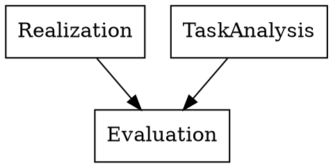

---
toc:
  depth_from: 1
  depth_to: 6
  ordered: false
---

## 参考书
About Face 4交互设计精髓

## Chapter 1 Introduction
### 关键词
* HCI: Human-Computer Interaction
* GUI: Graphical User Interface
* User Centered Design
* User Experience
* Usability

### HCI
交叉学科领域

### User interface
人和机器交互的空间

* 更有效率地操作和控制机器

### What's GUI
Graphical user interface 图形用户界面（而不是纯文本界面），是UI的一种

#### GUI之父
Douglas Engelbart

### HCI和SE的关系

### 可用性的定义
可用性：评估用户能多好地使用系统功能

* 易学习性
* 效率
* 可记忆性
* 容错性
* 满意性

#### 取决于用户
* 新手用户需要易学习性
* 专家需要效率

### 以用户为中心的设计
不分散用户过多的精力，没必要的内容可以删除

### 错误的代价

### 用户界面难以设计
* 你不是用户
* 用户通常是对的
* 用户不总是对的
用户不是设计者

用户界面设计会消耗软件开发相当一部分的时间
相当于整个编码时间的一半

## Chapter 2 交互设计过程
### 基本活动和特征
#### 什么是设计
* 在一定约束下到达某种目的
#### 关注
* 目的
* 约束

#### 目标

### 设计过程中的问题
* 如何选择用户
* 如何确定需求
* 如何提出备选设计方案
* 如何选择一个合适的设计方案

#### 如何选择用户
* 利益相关者$\neq$用户
* 客户可能不是用户
* 用户应当分类
  * 主要用户 Primary
    经常使用系统的
  * 二级用户 Secondary
  * 三级用户 Tertiary
  * 促进用户 Facilitating

#### 知道用户
* 交谈
* 观察
* 想象

#### 怎样提供备选设计方案
* 思考其他类似设计
* 考虑到设计约束

#### 如何选择设计方案
* 外部因素
* 内部因素

考虑用户的体验和改进建议  
考虑质量

### 交互设计生命周期模型
IxD
#### 瀑布模型（传统的）
最开始的瀑布模型没有用户参与，没有验证环节
#### 螺旋模型（传统的）
#### RAD（传统的）
极速开发
#### 原型法（传统的）
最早的以用户为中心设计
* 抛弃型
* 改进型
#### Star life cycle model(IxD)

### Interaction Design Process
需要什么

让用户选择设计方案
### 基本特征
* 用户为中心
* 稳定性
* 迭代

## Chapter 3 User Analysis & Task Analysis
### 定量研究 vs 定性研究 Quantitative versus Qualitative
像物理这样的硬核科学通常是定量的，人文学科通常是定性的

定量研究只能研究有限的范围内 how much 或 how many的问题

定性研究可以告诉你怎么做

### 定性研究的价值

### 目标导向设计研究
#### 启动会 Kickoff meeting
问题
* 产品是什么
* 谁使用
* 用户需要什么
... 

#### Literature Review 文献综述
内部文档
产业报告
网络搜索

#### 产品原型和竞争者审核

#### 利益相关者访谈
特定类型的信息
* 产品初期设想
* 预算和日程计划
* 技术限制和机遇
* 商业驱动
* 利益相关者对用户的看法

#### 主题专家访谈 Subject Matter Expert Interviews
缩写SME
* 主题专家通常是专业用户
* 知识渊博但不是设计师
* 在复杂领域或专业领域必不可少
* 确保能得到他们的帮助
#### 客户访谈

#### 用户访谈

#### 用户观察
大多数用户不能准确描述自己的行为

#### 观察和访谈用户相结合
##### 情境调查 Contextual Inquiry
徒弟带师傅

改进的情境调查
##### 准备人种学访谈
个体产品相关的交互行为和习惯 

* 确定候选人
* 做一些人物模型假设

##### 开展情境调查
基本方法——避免固定类型的问题

可以问
* 用户开心的问题
* 系统导向型问题
* 工作流导向问题
* 态度导向型问题

假装成门外汉而非专家
* 不要害怕问幼稚的问题
* 有同理心**sympathetic**

采取开放式和封闭式结合的问题去引导讨论

避免把用户当作设计师

避免讨论技术问题
* 避免把用户当成软件工程师

### 3.2 用户建模
Personas人物模型

代表最广大用户

#### 人物模型扩展了用户行为的范围

##### 用户角色
或称角色模型是一个抽象概念

用户角色的限制
* 完全专注于任务
* 将用户交流转换为抽象行为很困难

用户轮廓 vs 人物模型

##### 了解用户目标
* 本能 用户怎么感受
* 行为 用户想要干什么
* 反思 用户想要成为什么

##### 非用户目标
* 商业目标
* 技术目标

**以满足用户目标为首要**

#### 次要模型

#### 补充模型

#### 客户人物模型

#### 反面人物模型
也称反人物
与产品相冲突的，不是产品的用户

#### 实践中的人物模型
##### 一些误解
* 设计者虚构一个人物模型
* 人物模型不如引入真人有用
* 人物模型是可溯源的

##### 对人物模型的量化

### 理解场景和设计需求

#### Bridging the Research-Design Gap
##### 四个主要活动

#### 场景：叙述作为一个设计工具

#### 了解用户期望

## Chapter 3 example
以用户为中心的设计

### 了解用户
* 年龄、性别
* 受教育程度

### How we perceive the world
个体的一切行动都和神经系统相关

### 记忆的属性
* 编码
* 大小
* 消退时间

短时记忆
长时记忆
工作内存

### Chunking
记忆单元

长期记忆只能通过Working memory交互

### Working memory
* 有意识的思考
* 存储容量小：7个chunk左右
* 快速衰退
* 持续的维护可以减少衰退

### Long-term memory
* 容量大
* 不容易衰退

### 感知合并
* 一个周期内两个刺激同时出现
* 影响
  * 计算机反应的时间上限要小于T，不然就感觉不流畅

#### 什么是注意力
#### 认知处理
* Skill-based
* Rule-based
* Knowledge-based

### Hick-Hyman low of choice Reaction Time
RT=c+dH
RT=c+dlog2(N)

### 分散注意力（多任务）
资源分配

### 好的图形设计的准则
* Simplicity 简单原则
* Contrast & Visual Variables 对比原则
* White Space 空白

#### Simplicity
Less is more
去掉不必要的元素