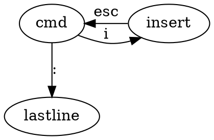
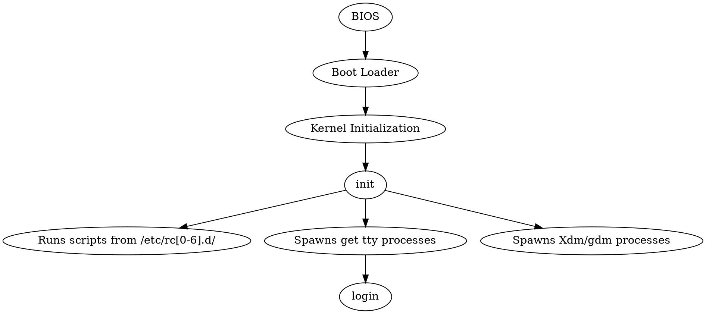

## Find answers:Man

## Basic Commands
CMD OPTION ARGS

ls -l /home 

ls --all 两横加全称

ls -a -l 两个都使用
### ls 列出目录信息
* ls -l (列出完整信息)
* ls -a （列出隐藏文件）

### cd

### pwd（列出工作目录的绝对路径）
print working directory
* pwd

### ~
该用户的主目录

### which
定位命令位置
which java

### whereis 

### locate
定位文件

### rpm

### find

### echo

### cat
查看一个纯文本

### cp
复制粘贴

cp 源目录 目标目录

cp haha .  (.代表当前目录)

### mv
剪切粘贴

### mkdir
创建一个目录

### rm
删除

* rm 文件名 （不能删除目录）
* rm -R 目录 （递归删除）
* rm -Rf （强制删除，不会报错）

rm -Rf / （危险）

### tar

## Vi

* 命令模式
* 编辑模式
* last line 模式



:wq 保存退出

# Chapter 2 用户管理
## Add an account

/etc存放着配置文件

/etc/passwd

tom:x :501:502::/home/tom:/bin/bash

### useradd 新用户名

在/etc/passwd增加一行，在home增加目录。但这是不能登录，因为没有设置密码

### passwd 用户名
设置密码

/etc/shadow 保存密码。不能用明文存储密码

## 删除一个用户
###  userdel 用户名
只删除用户条目
### userdel -r 用户名
把用户目录也删除

用户在已登录时无法直接删除

## /etc/shadow
冒号作分割，Windows下一般用分号

.csv文件用逗号分割

共有9个域

* 用户名
* 加密过的密码
* 上一次密码修改日期
* 两次修改密码的最短时间
* 两次修改密码的最大时间
* 多少天之后警告密码过期
* 多少天之后密码过期
* 过期日期
* 保留域

一般情况下只有用户名和密码就够了

### usermod
修改用户配置

usermod -e 修改账户过期时间，日期格式是YYYY-MM-DD

usermod -L 锁定用户，在加密密码之前加!

### Root 账户
UID为0

密码一定要保护好

尽量不要用root用户，在需要时使用su切换用户

使用sudo，用别的用户权限做一件事

kill -9 进程号 杀死进程

### root权力下放
修改 /etc/sudoers  
visudo命令

# shell编程
把重复的命令放到文件

一定要先写#!/bin/sh

“#” 代表注释
## 一般变量和环境变量
fork 由父进程生成子进程

执行脚本时会有新进程，新进程会有变量。环境变量是变量的一个子集。进程创建子进程时，环境变量会传给子进程，一般变量不会

### 变量使用
不用声明，直接赋值就可以

shell里面赋的值只有string类型，等号左右都不能有空格


#### 引用变量
* echo $变量名  
* 完整的写法：echo ${变量名}
* echo ${变量名:开始索引:结束索引} 截取子字符串

set命令显示出所有变量

set|grep 变量名 选取特定变量

unset 变量名 删除变量名

### 特殊的变量
$# 参数的数量
$数字 具体参数
$$ 显示PID
$? 上一条命令状态：0代表没有错，其他数字代表出错

### 字符串合并
直接写在一起就行

### 路径用变量名存
必须使用绝对路径

### 环境变量设置
配置环境变量的方法
* export 变量名 该变量就变成环境变量，父进程直接用就可以（env命令可以看环境变量）

删除环境变量
* unset

### 测试条件
语法：  
* test condition 
* [ condition ] 方括号前后要加空格

#### 退出状态
$?   
0代表正常

### 字符串判断
* =
* !=
* -z 为空

### 数字判断
* -eq
* -ne
* -gt
* -lt

### 流程控制
#### for
##### for each
```bash
for i in 结果集
do
语句
done
```

反引号``可以表示命令的结果集，比如\`ls\`

##### for

#### while & until 循环
##### while
``` bash
while [ 条件 ] 
do
echo $i
i=$(($i+1))
echo $i
done
```

#### if
```bash
if [ $score -ge 60 ];
then
echo "pass"
elif [];then

fi
```

#### case

## I/O
### read
相当于scanf

read 变量名

### 文件重定向
把终端上显示的结果写入文件
需要写入的内容 > 写入的文件名

## 引号
单引号内的内容会直接打出

双引号会进行变量解释

反引号等价于$()，相当于变量的结果

反斜杠转义特殊字符

## 函数
```bash
message(){

}
message
# 调用的时候直接输函数名就行
```
如果要加参数，不需要在()内加形参，直接在{}中使用$1,$2即可

引用其他sh文件
```bash
. ./fun.sh #.相当于include

message
```

# 启动和关闭
## 启动过程


BIOS指定从哪启动

Boot Loader指定去哪执行初始化内核

/etc/rcx.d 都是一些链接

httpd： Apache服务器

## Boot Loaders :GRUB

## 运行级别
run level

0：关机
1：单用户模式（只能超级用户登录，不需要密码，网络关闭）
2：断网启动
3：正常网络启动

6：重启

rc0.d 里面都K开头，代表stop

rc6.d 前面都以K开头，最后有S开头启动

rc3.d 关闭一些服务，启动一些服务

* chkconfig 列出所有启动选项
* chkconfig 服务名 off 在所有级别关闭

## 重启和关机命令
### 重启
* shutdown -r now -r代表重启，后面可以写时间
* reboot
* init 6

### 关机
* shutdown -h now
* halt
* init 0
* poweroff

# systemd
用来代替原先的init
提升了性能

有争议的，破坏了UNIX哲学

## systemctl
一个命令管很多

* systemctl start [name.service]
* systemctl stop 
* systemctl restart
* systemctl is-active
* systemctl list-units --type service --all

# 访问控制
## 传统UNIX访问控制
* 任何对象都有主人，主人有完全的权限
* 谁创建谁就是主人
* root有任何对象的所有权
* 只有root能够执行特定的一些操作

## 文件系统访问控制
rwx 

r:可读 w:可写 x:可记录

希望能给每个用户独一无二的权限

### access control list 访问控制列表

在文件的内容里面附一个list用来说清楚每个用户拥有哪些权限

一个特例 /etc/shadow 所有用户没有权限，但都能修改自己的密码

/usr/bin/passwd 执行者可以暂时获取到root权限，所以能够修改密码

## 安全问题
0day attack

SELinux：安全增强型Linux。规定哪些用户和应用可以访问哪些资源。默认情况下任何操作都不允许。

## 真实世界中的管理
* 选择好的用户密码
* 不能以root用户直接登录
* su -
* sudo：limited su 

### sudo
visudo 修改/tec/sudoers

# 进程控制
## 进程概念
一个执行的程序

ps命令查看进程

ps -el可以查看所有进程

UID用户ID
PID进程ID
PPID父进程ID
PRI优先级越小越好
NI Nice Number计算优先级
ADDR 地址

## setuid process
如何找
find /bin -perm -4000|xarg ls -l

希望一般用户运行一个超级用户才有权限的程序

## 杀死进程
SIGKILL
kill -l查看信号列表

kill -9 进程号 强制杀死

ctrl+c强制退出程序本质上是kill -2
如果程序里面忽视了2号信号，则无效

这时候用ctrl+z可以挂起进程

kill -命令 进程号 默认是15号信号

## 进程状态
Runnable(R)
Sleeping(S)等待CPU
Zombie(Z)僵尸进程：子进程比父进程先结束，而父进程又没有回收子进程，释放子进程占用的资源，此时子进程将成为一个僵尸进程
Stopped(T)挂起

如果一直没释放，可能导致内存泄漏，最简单的方法是定时重启进程
## Niceness
NI范围从-20 （最高优先级值）到19 （最低优先级值）

renice命令改变NI
renice -新数值 进程号
一般用户只能变大，不能变小，只有root用户可以变小

## 监视进程
ps -e

top命令 统计进程占用

strace
追踪进程的系统调用
strace -p pid

lsof
列出所有打开的文件，包括连接

uptime

## 后台执行
### &
命令后加&命令在后台执行
比如 vi &

killall -9 程序名字 杀死所有同名进程

### fg和bg
fg命令使一个挂起(ctrl-z)的进程在前台恢复(无法输入其他命令)
bg命令使一个挂起的进程在后台执行（不影响其他操作）

### 多个后台进程
jobs命令查看

# 文件系统
## 磁盘
* IDE
* SCSI
* 可移动磁盘

fdisk分区

## Make Filesystem
mkfs

## mount
把新的文件系统挂在到原有的树

## fuser
查看文件系统用户使用情况

## disk use
df命令报告所以文件系统的磁盘使用

du命令报告所以文件目录的磁盘使用

du -s /home 总计

## LVM逻辑卷管理
多块硬盘合成一个逻辑硬盘
## Snapshots快照

## Disk quota 磁盘配额

## sort 命令

## at命令

## cron
多次周期性备份

## anacron
防止执行任务时关机

## 经验
1. 集中式备份