# 数据库系统概论

> [数据库系统概论学习视频](https://www.bilibili.com/video/BV13J411J7Vu)
>
> 参考教程：数据库系统概论第五版（王珊、萨师煊）[PPT](https://github.com/wugenqiang/CS-Notes/tree/master/Resource/数据库系统概论/PPT)

## 1 绪论

### 1.1 数据库系统概述

#### 1.1.1 四个基本概念

##### 1.1.1.1 数据

数据 Data

* 数据是数据库中存储的基本对象
* 数据的定义：描述事物的符号记录
* 数据的种类：数字、文字、图形、图像、音频、视频、学生的档案记录等
* 数据的含义称为数据的语义，数据与其语义是不可分的

##### 1.1.1.2 数据库

数据库 DataBase 简称 DB

* 数据库的定义：是长期储存在计算机内、有组织的、可共享的大量数据的集合
* 数据库的基本特征：
  * 数据按一定的数据模型组织、描述和储存
  * 可为各种用户共享
  * 冗余度较小
  * 数据独立性较高
  * 易扩展

##### 1.1.1.3 数据库管理系统

数据库管理系统 DataBase Management System 简称 DBMS

* 数据库管理系统的定义：位于用户与操作系统之间的一层数据管理软件，是基础软件，是一个大型复杂的软件系统 
* 用途：科学地组织和存储数据、高效地获取和维护数据

* 数据库在计算机系统中的位置：


* 数据库管理系统的主要功能：

  * （1）数据定义功能

    * 提供数据定义语言（DDL）
    * 定义数据库中的数据对象
  * （2）数据组织、存储和管理
    * 分类组织、存储和管理各种数据	
    * 确定组织数据的文件结构和存取方式
    * 实现数据之间的联系
  
    * 提供多种存取方法提高存取效率
  * （3）数据操纵功能
    * 提供数据操纵语言（DML）
    * 实现对数据库的基本操作  （查询、插入、删除和修改）
  * （4）数据库的事务管理和运行管理
    * 数据库在建立、运行和维护时由数据库管理系统统一管理和控制
    * 保证数据的安全性、完整性、多用户对数据的并发使用
    * 发生故障后的系统恢复
  * （5）数据库的建立和维护功能
    * 提供实用程序、工具，完成数据库初始数据的装载和转换
    * 数据库转储、恢复功能
    * 数据库的重组织
    * 性能监视、分析等
  * （6）其它功能
    * 数据库管理系统与网络中其它软件系统的通信
    * 数据库管理系统系统之间的数据转换
    * 异构数据库之间的互访和互操作

##### 1.1.1.4 数据库系统

数据库系统 DataBase 简称 DBS

* 数据库系统的定义：是指在计算机系统中引入数据库后的系统构成
* 在不引起混淆的情况下，常常把数据库系统简称为数据库
* 数据库系统的构成：
  * 数据库
  * 数据库管理系统（及其应用开发工具）
  * 应用程序
  * 数据库管理员 (DataBase Administrator，简称 DBA)


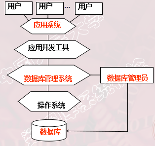

#### 1.1.2 数据管理技术的产生和发展

##### 1.1.2.1 数据管理

数据管理的定义：

* 对数据进行分类、组织、编码、存储、检索和维护
* 数据处理的中心问题

数据管理技术的发展过程

* 人工管理阶段（20 世纪 50 年代中之前）
* 文件系统阶段（20 世纪 50 年代末 -- 60 年代中）
* 数据库系统阶段（20 世纪 60 年代末 -- 现在）

三个发展阶段的比较：

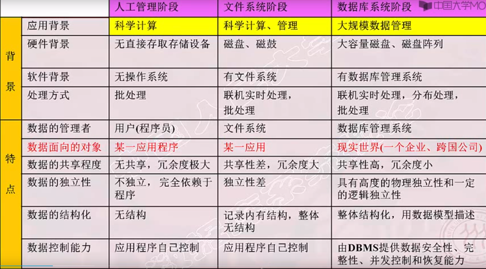

#### 1.1.3 数据库系统的特点

* 数据结构化
* 数据的共享性高，冗余度低且易扩充
* 数据独立性高
* 数据由数据库管理系统统一管理和控制

举例：用数据库系统实现学籍管理

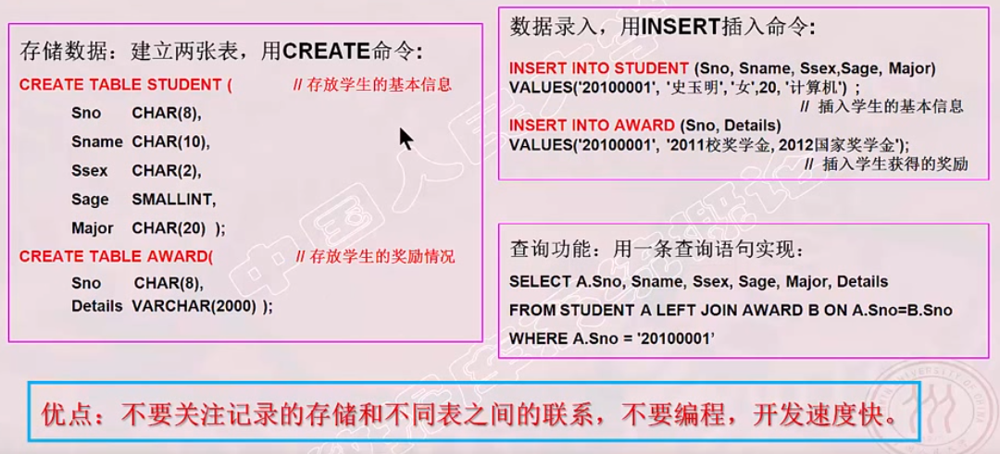


### 1.2 数据模型

* 数据模型是对现实世界数据特征的抽象。

* 通俗地讲数据模型就是现实世界的模拟。
* 数据模型应满足三方面要求
  * 能比较真实地模拟现实世界
  * 容易为人所理解
  * 便于在计算机上实现
* 数据模型是数据库系统的核心和基础

#### 1.2.1 两类数据模型

数据模型分为两类（两个不同的层次）

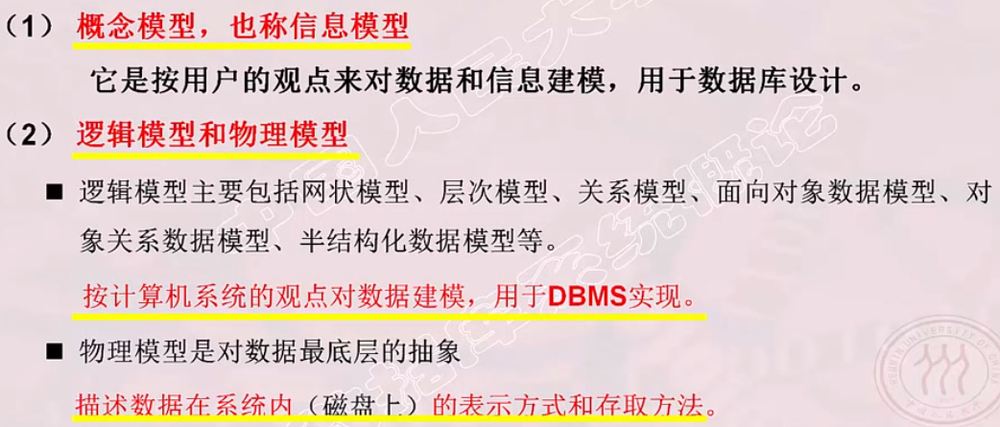

#### 1.2.2 概念模型

概念模型的用途

* 概念模型用于信息世界的建模
* 是现实世界到机器世界的一个中间层次
* 是数据库设计的有力工具
* 数据库设计人员和用户之间进行交流的语言

对概念模型的基本要求

* 较强的语义表达能力
* 简单、清晰、易于用户理解

概念模型的一种表示方法：`实体-联系方法`

##### 1.2.2.1 信息世界中的基本概念

（1）实体（Entity） 

客观存在并可相互区别的事物称为实体。

可以是具体的人、事、物或抽象的概念。

（2）属性（Attribute） 

实体所具有的某一特性称为属性。

一个实体可以由若干个属性来刻画。  

（3）码（Key） 

唯一标识实体的属性集称为码。

（4）实体型（Entity Type） 

用实体名及其属性名集合来抽象和刻画同类实体称为实体型

（5）实体集（Entity Set） 

同一类型实体的集合称为实体集

（6）联系（Relationship）  

现实世界中事物内部以及事物之间的联系在信息世界中反映为实体（型）内部的联系和实体（型）之间的联系。

实体内部的联系通常是指组成实体的各属性之间的联系

实体之间的联系通常是指不同实体集之间的联系

实体之间的联系有一对一（1:1）、一对多（1：m）和多对多（m：n）等多种类型

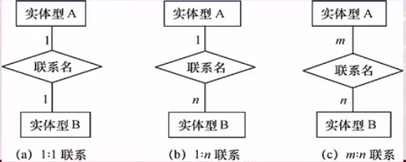

##### 1.2.2.2 实体 - 联系方法

实体-联系方法（Entity-Relationship Approach）

* 用E-R图来描述现实世界的概念模型
* E-R方法也称为E-R模型

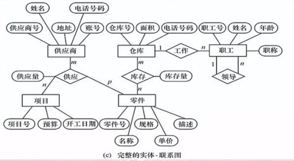

#### 1.2.3 数据模型的组成要素

* 数据结构：描述系统的静态特性
* 数据操作 ：描述系统的动态特性
* 数据的完整性约束条件

##### 1.2.3.1 数据结构

描述数据库的组成对象，以及对象之间的联系

描述的内容

* 与对象的类型、内容、性质有关
* 与数据之间联系有关


##### 1.2.3.2 数据操作

数据操作

* 对数据库中各种对象（型）的实例（值）允许执行的操作的集合，包括操作及有关的操作规则

数据操作的类型

* 查询
* 更新（包括插入、删除、修改）

数据模型对操作的定义

* 操作的确切含义
* 操作符号
* 操作规则（如优先级）
* 实现操作的语言

##### 1.2.3.3 数据的完整性约束条件

数据的完整性约束条件

* 一组完整性规则的集合
  * 完整性规则：给定的数据模型中数据及其联系所具有的制约和依存规则
  * 用以限定符合数据模型的数据库状态以及状态的变化，以保证数据的正确、有效和相容
* 数据模型对完整性约束条件的定义
  * 反映和规定必须遵守的基本的通用的完整性约束条件。
  * 提供定义完整性约束条件的机制，以反映具体应用所涉及的数据必须遵守的特定的语义约束条件。

#### 1.2.4 常用的数据模型

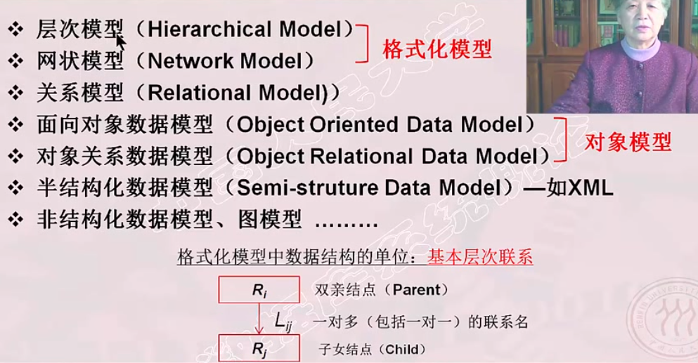

#### 1.2.5 层次模型

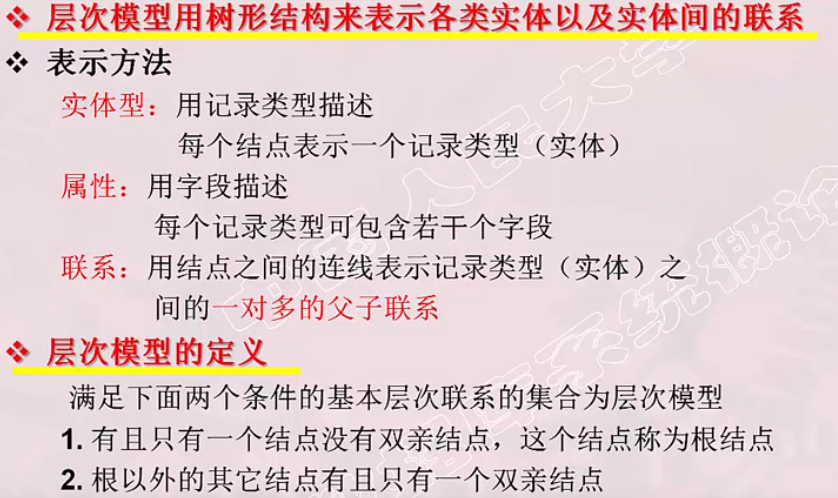

##### 1.2.5.1 层次模型的数据结构

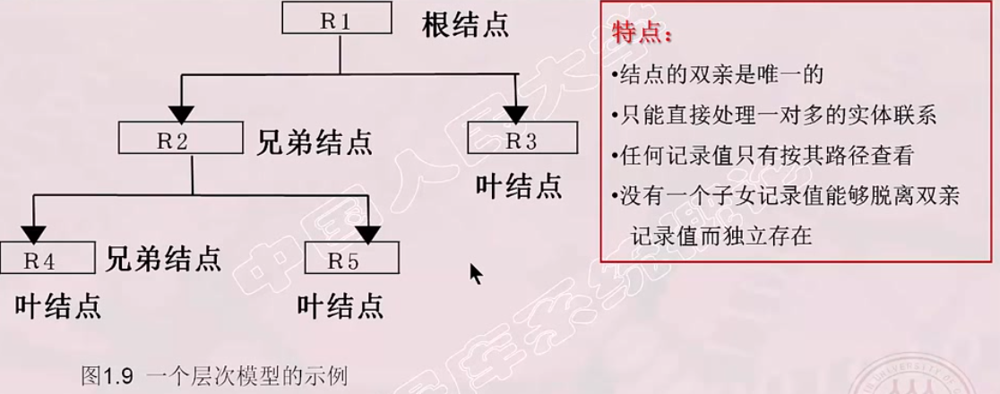

##### 1.2.5.2 数据操纵与完整性约束

层次模型的数据操纵

* 查询
* 插入
* 删除
* 更新 

层次模型的完整性约束条件 

* 无相应的双亲结点值就不能插入子女结点值
* 如果删除双亲结点值，则相应的子女结点值也被同时删除
* 更新操作时，应更新所有相应记录，以保证数据的一致性

##### 1.2.5.3 层次结构的优缺点

优点

* 层次模型的数据结构比较简单清晰 
* 查询效率高，性能优于关系模型，不低于网状模型
* 层次数据模型提供了良好的完整性支持

缺点

* 结点之间的多对多联系表示不自然
* 对插入和删除操作的限制多，应用程序的编写比较复杂 
* 查询子女结点必须通过双亲结点
* 层次命令趋于程序化 

#### 1.2.6 网状模型

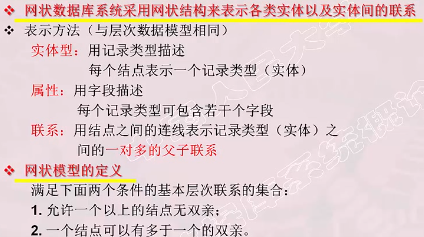

##### 1.2.6.1 网状模型的数据结构

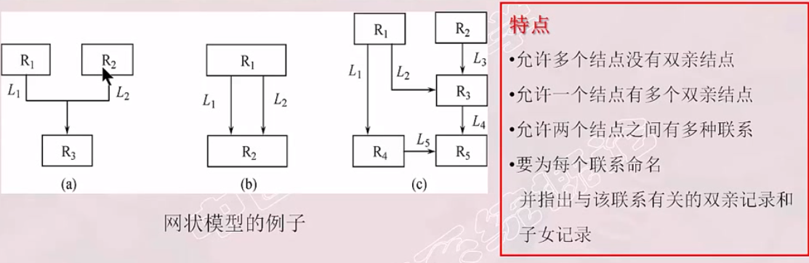

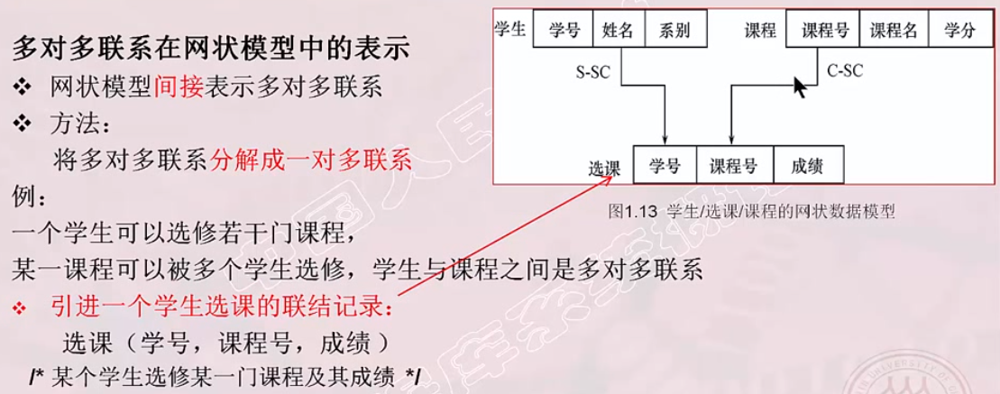

##### 1.2.6.2 操纵与完整性约束

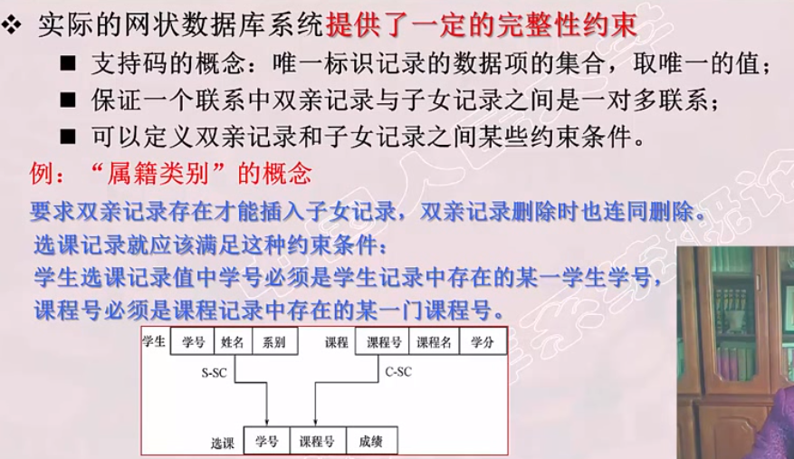

##### 1.2.6.3 网状模型的优缺点

优点

* 能够更为直接地描述现实世界，如一个结点可以有多个双亲
* 具有良好的性能，存取效率较高

缺点

* 结构比较复杂，而且随着应用环境的扩大，数据库的结构就变得越来越复杂，不利于最终用户掌握
* DDL、DML语言复杂，用户不容易使用
  记录之间联系是通过存取路径实现的，用户必须了解系统结构的细节

#### 1.2.7 关系模型

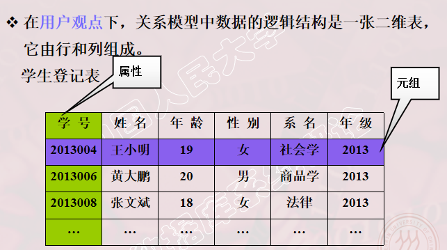

##### 1.2.7.1 关系模型的数据结构

关系（Relation）

* 一个关系对应通常说的一张表

元组（Tuple）

* 表中的一行即为一个元组

属性（Attribute）

* 表中的一列即为一个属性，给每一个属性起一个名称即属性名

主码（Key）

* 也称码键。表中的某个属性组，它可以唯一确定一个元组

域（Domain）

* 是一组具有相同数据类型的值的集合。属性的取值范围来自某个域。

分量

* 元组中的一个属性值。

关系模式

* 对关系的描述
* 关系名（属性1，属性2，…，属性n）
* 学生（学号，姓名，年龄，性别，系名，年级）

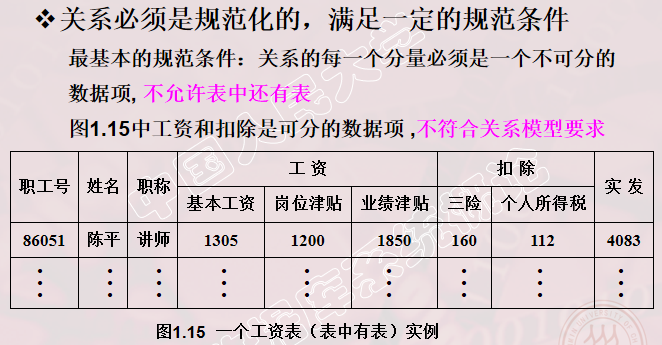

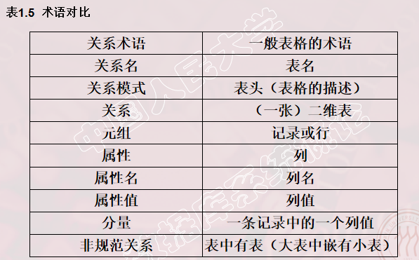

##### 1.2.7.2 操纵与完整性约束

数据操作是集合操作，操作对象和操作结果都是关系

* 查询
* 插入
* 删除
* 更新

存取路径对用户隐蔽，用户只要指出“干什么”，不必详细说明“怎么干”


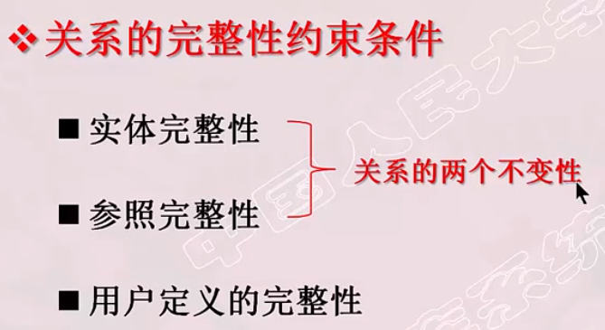

##### 1.2.7.3 关系模型的优缺点

优点

* 建立在严格的数学概念的基础上
* 概念单一
  * 实体和各类联系都用关系来表示
  * 对数据的检索结果也是关系
* 关系模型的存取路径对用户透明
  * 具有更高的数据独立性，更好的安全保密性
  * 简化了程序员的工作和数据库开发建立的工作

缺点

* 存取路径对用户透明，查询效率往往不如格式化数据模型
* 为提高性能，必须对用户的查询请求进行优化，增加了开发数据库管理系统的难度


### 1.3 数据库系统的结构

* 从数据库应用开发人员角度看，数据库系统通常采用三级模式结构，是数据库系统内部的系统结构 

* 从数据库最终用户角度看，数据库系统的结构分为:
  * 单用户结构
  * 主从式结构
  * 分布式结构
  * 客户-服务器
  * 浏览器-应用服务器／数据库服务器多层结构等

#### 1.3.1 数据库系统模式的概念

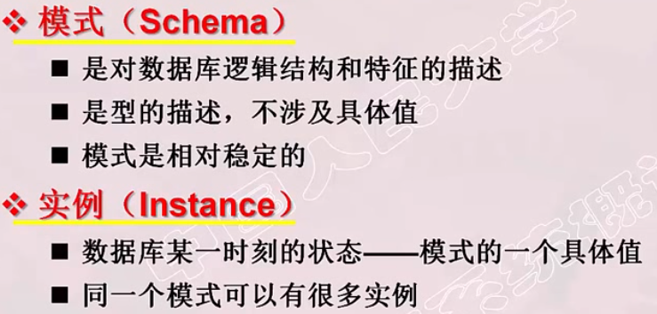

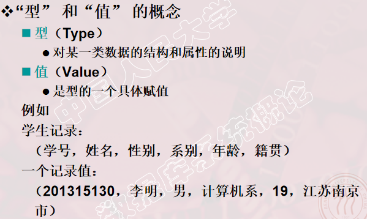

举例：

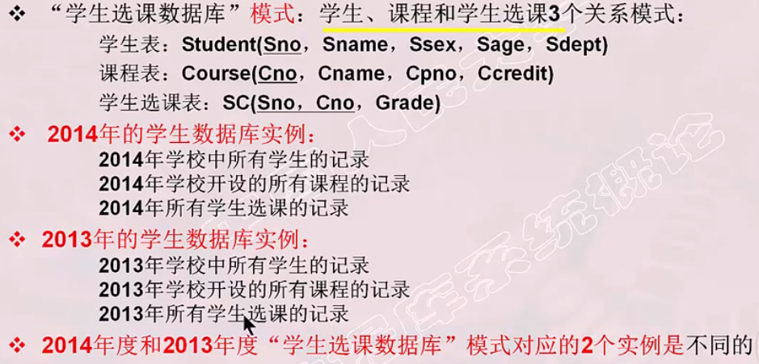

#### 1.3.2 三级模式结构

* 模式（Schema） 
* 外模式（External Schema）
* 内模式（Internal Schema） 

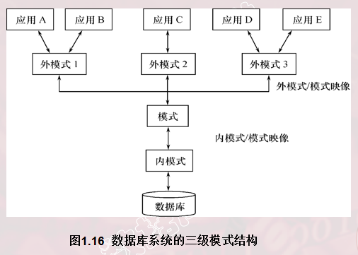

##### 1.3.2.1 模式（Schema）

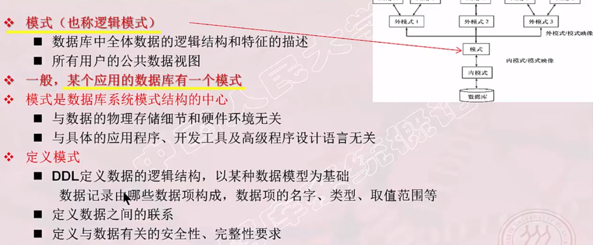

##### 1.3.2.2 外模式（External Schema）

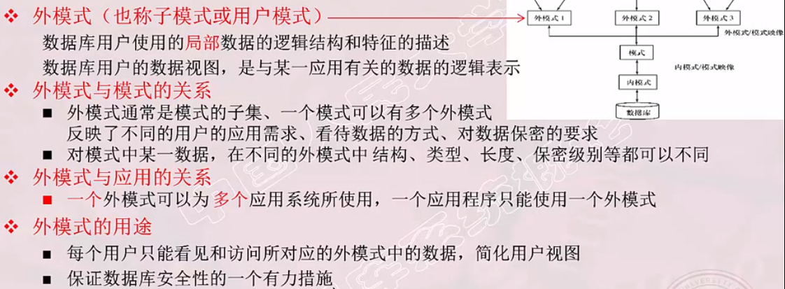

##### 1.3.2.3 内模式（Internal Schema） 

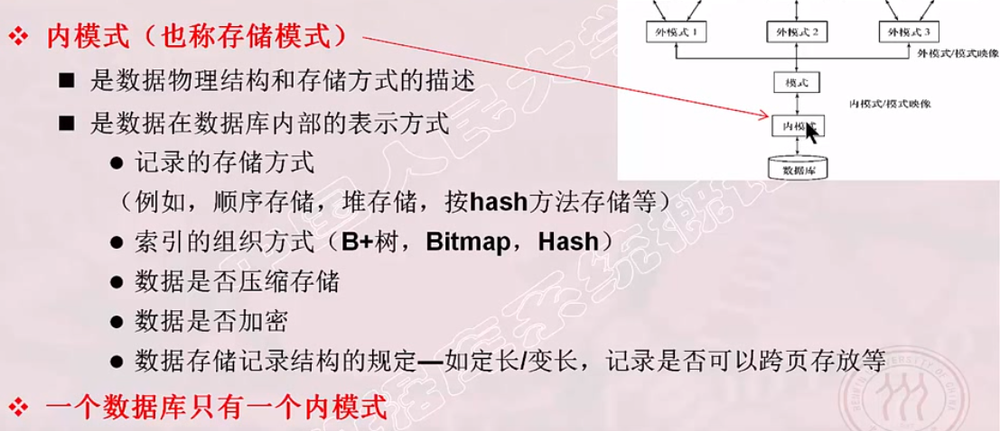

#### 1.3.3 数据库的二级映像功能与数据独立性 

> 映像（mapping）

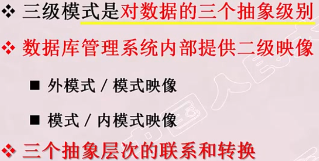

##### 1.3.3.1 外模式／模式映像

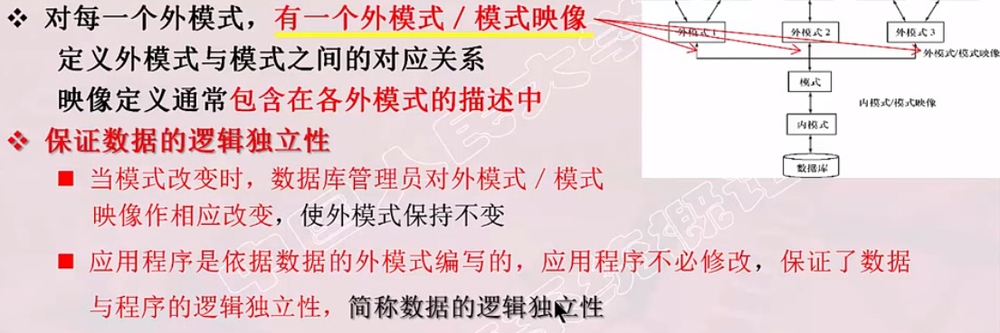

##### 1.3.3.2 模式／内模式映像

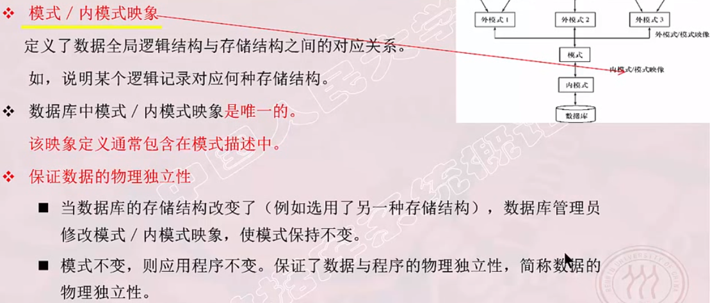

##### 1.3.3.3 总结

数据库的二级映像功能与数据独立性特点：

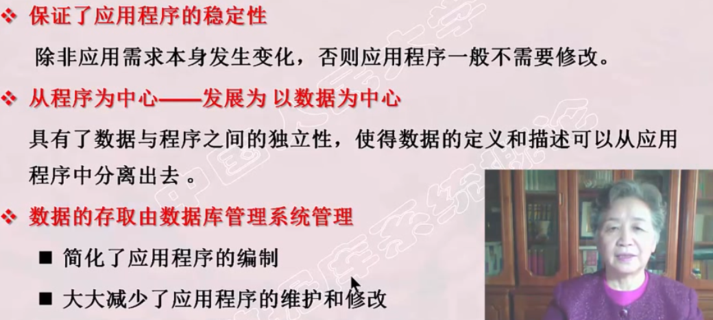

### 1.4 数据库系统的组成

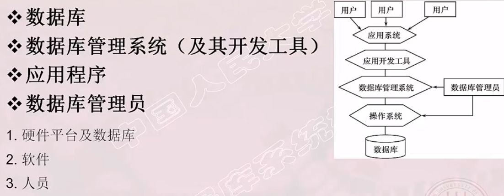

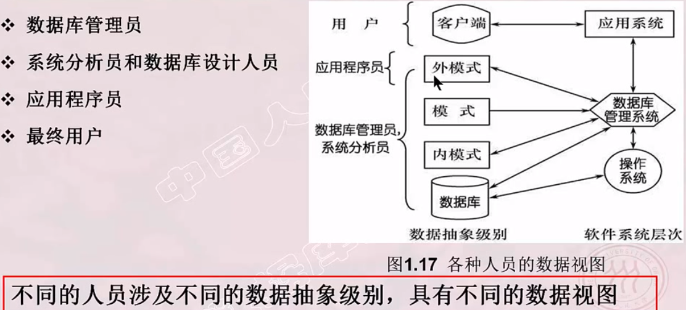

数据库管理员（DBA）

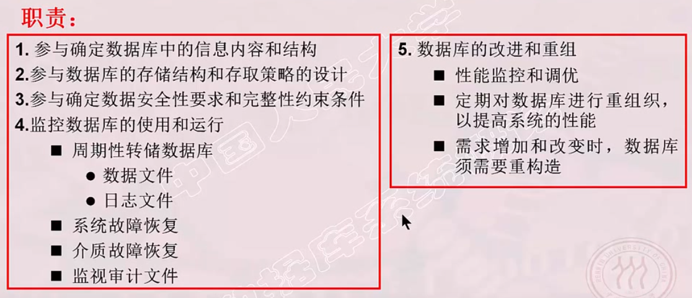

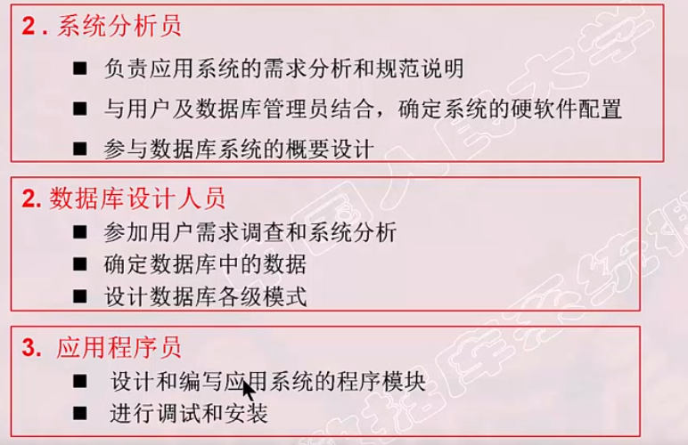

用户：

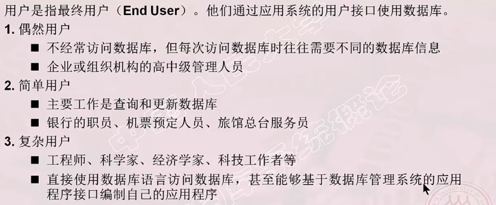


## 2 关系数据库

### 2.1 关系数据库及形式化定义


#### 2.1.1 关系

单一的数据结构----关系

* 现实世界的实体以及实体间的各种联系均用关系来表示

逻辑结构----二维表 

* 从用户角度，关系模型中数据的逻辑结构是一张二维表

建立在集合代数的基础上

##### 2.1.1.1 域（Domain）

域是一组具有相同数据类型的值的集合。例:

* 整数
* 实数
* 介于某个取值范围的整数
* 指定长度的字符串集合
* {‘男’，‘女’}
* ……………..

##### 2.1.1.2 笛卡尔积（Cartesian Product）


举例：


##### 2.1.1.3 关系（Relation）


#### 2.1.2 关系模式

##### 2.1.2.1 什么是关系模式


##### 2.1.2.2 定义关系模式


##### 2.1.2.3 关系模式与关系


#### 2.1.3 关系数据库


#### 2.1.4 关系模型的存储结构


### 2.2 关系操作

#### 2.2.1 基本的关系操作


#### 2.2.2 关系数据库语言的分类


### 2.3 关系的完整性

> 关系的三类完整性约束


#### 2.3.1 实体完整性


#### 2.3.2 参照完整性

##### 2.3.2.1 关系间的引用


##### 2.3.2.2 外码（Foreign Key）


##### 2.3.2.3 参照完整性规则


#### 2.3.3 用户定义的完整性


### 2.4 关系代数


#### 2.4.1 传统的集合运算

##### 2.4.1.1 并（Union）


##### 2.4.1.2 差（Difference）


##### 2.4.1.3 交（Intersection）


##### 2.4.1.4 笛卡尔积（Cartesian Product）


#### 2.4.2 专门的关系运算


##### 2.4.2.1 选择（Selection）


##### 2.4.2.2 投影（Projection） 


##### 2.4.2.3 连接（Join） 


##### 2.4.2.4 除运算（Division）


#### 2.4 3 综合举例


### 2.5 关系演算（*）

> 这部分了解即可，无需深入

* 关系演算语言
  * 元组关系演算语言：ALPHA
  * 域关系演算语言：QBE


#### 2.5.1 元组关系演算语言：ALPHA


##### 2.5.1.1 简单检索


W 指的是工作空间名

##### 2.5.1.2 限定的检索


##### 2.5.1.3 带排序的检索


##### 2.5.1.4 带定额的检索


##### 2.5.1.5 用元组变量的检索


##### 2.5.1.6 用存在量词的检索


##### 2.5.1.7 带有多个关系的表达式的检索


##### 2.5.1.8 用量词的检索


* 用全称量词的检索


##### 2.5.1.9 用两种量词的检索


##### 2.5.1.10 用蕴含（Implication）的检索


##### 2.5.1.11 聚集函数


#### 2.5.2 域关系演算语言：QBE


## 3 SQL 语言

> 关系数据库标准语言 SQL


### 3.1 SQL 概述

SQL（Structured Query Language）

* 结构化查询语言，是关系数据库的标准语言

SQL 是一个通用的、功能极强的关系数据库语言


#### 3.1.1  SQL 的产生与发展


#### 3.1.2  SQL 的特点

（1）特点一：综合统一


（2）特点二：高度非过程化


（3）特点三：面向集合的操作方式


（4）特点四：以同一种语法结构提供多种使用方式


（5）特点五：语言简洁，易学易用


#### 3.1.3  SQL 的基本概念


SQL 的简单说明：

模式定义了数据如何存储、存储什么样的数据以及数据如何分解等信息，数据库和表都有模式。

主键的值不允许修改，也不允许复用（不能使用已经删除的主键值赋给新数据行的主键）。

SQL（Structured Query Language)，标准 SQL 由 ANSI 标准委员会管理，从而称为 ANSI SQL。各个 DBMS 都有自己的实现，如 PL/SQL、Transact-SQL 等。

SQL 语句不区分大小写，但是数据库表名、列名和值是否区分依赖于具体的 DBMS 以及配置。

SQL 支持以下三种注释：

```sql
# 注释
SELECT *
FROM mytable; -- 注释
/* 注释1
   注释2 */
```

数据库创建与使用：

```sql
CREATE DATABASE test;
USE test;
```


### 3.2 学生 - 课程数据库


Student 表


Course 表


SC 表


### 3.3 数据定义


模式：


#### 3.3.1 模式定义与删除

（1）定义模式


（2）删除模式


#### 3.3.2 基本表的定义与基本操作

##### 3.3.2.1 创建表


```sql
CREATE TABLE mytable (
  id INT NOT NULL AUTO_INCREMENT,
  col1 INT NOT NULL DEFAULT 1,
  col2 VARCHAR(45) NULL,
  col3 DATE NULL,
  PRIMARY KEY (`id`));
```


学生表 Student


课程表 Course


学生选课表 SC


##### 3.3.2.2 数据类型


##### 3.3.2.3 模式与表


##### 3.3.2.4 修改表


添加列

```sql
ALTER TABLE mytable
ADD col CHAR(20);
```

删除列

```sql
ALTER TABLE mytable
DROP COLUMN col;
```

删除表

```sql
DROP TABLE mytable;
```


##### 3.3.2.5 插入表

普通插入

```sql
INSERT INTO mytable(col1, col2)
VALUES(val1, val2);
```

插入检索出来的数据

```sql
INSERT INTO mytable1(col1, col2)
SELECT col1, col2
FROM mytable2;
```

将一个表的内容插入到一个新表

```sql
CREATE TABLE newtable AS
SELECT * FROM mytable;
```

##### 3.3.2.6 更新表

```sql
UPDATE mytable
SET col = val
WHERE id = 1;
```


##### 3.3.2.7 删除表


```sql
DELETE FROM mytable
WHERE id = 1;
```

**TRUNCATE TABLE**  可以清空表，也就是删除所有行。

```sql
TRUNCATE TABLE mytable;
```

使用更新和删除操作时一定要用 WHERE 子句，不然会把整张表的数据都破坏。可以先用 SELECT 语句进行测试，防止错误删除。


##### 3.3.2.8 查询表

> DISTINCT

相同值只会出现一次。它作用于所有列，也就是说所有列的值都相同才算相同。

```sql
SELECT DISTINCT col1, col2
FROM mytable;
```

> LIMIT

限制返回的行数。可以有两个参数，第一个参数为起始行，从 0 开始；第二个参数为返回的总行数。

返回前 5 行：

```sql
SELECT *
FROM mytable
LIMIT 5;
```

```sql
SELECT *
FROM mytable
LIMIT 0, 5;
```

返回第 3 \~ 5 行：

```sql
SELECT *
FROM mytable
LIMIT 2, 3;
```

##### 3.3.2.9 排序

-  **ASC** ：升序（默认）
-  **DESC** ：降序

可以按多个列进行排序，并且为每个列指定不同的排序方式：

```sql
SELECT *
FROM mytable
ORDER BY col1 DESC, col2 ASC;
```

#### 3.3.3 索引的建立、修改与删除


##### 3.3.3.1 建立索引


##### 3.3.3.2 修改索引


##### 3.3.3.3 删除索引


#### 3.3.4 数据字典


### 3.4 数据查询


#### 3.4.1 单表查询


##### 3.4.1.1 选择表中的若干列


##### 3.4.1.2 选择表中的若干元组


* 比较大小


* 确定范围


* 确定集合


* 字符匹配


* 涉及空值的查询


* 多重条件查询


##### 3.4.1.3 ORDER BY 子句


##### 3.4.1.4 聚集函数


##### 3.4.1.5 GROUP BY 子句 


#### 3.4.2 连接查询


##### 3.4.2.1 等值与非等值连接查询 


#### 3.4.3 嵌套查询

#### 3.4.4 集合查询

#### 3.4.5基于派生表的查询

#### 3.4.6 Select语句的一般形式 


## 4 数据库安全性


## 5 数据库完整性


## 6 关系数据理论


## 7 数据库设计


## 8 数据库编程


## 9 关系查询处理和查询优化


## 10 数据库恢复技术


## 11 并发控制


# 一、事务

## 概念

事务指的是满足 ACID 特性的一组操作，可以通过 Commit 提交一个事务，也可以使用 Rollback 进行回滚。

<div align="center">  </div>

## ACID

### 1. 原子性（Atomicity）

事务被视为不可分割的最小单元，事务的所有操作要么全部提交成功，要么全部失败回滚。

回滚可以用回滚日志来实现，回滚日志记录着事务所执行的修改操作，在回滚时反向执行这些修改操作即可。

### 2. 一致性（Consistency）

数据库在事务执行前后都保持一致性状态。在一致性状态下，所有事务对一个数据的读取结果都是相同的。

### 3. 隔离性（Isolation）

一个事务所做的修改在最终提交以前，对其它事务是不可见的。

### 4. 持久性（Durability）

一旦事务提交，则其所做的修改将会永远保存到数据库中。即使系统发生崩溃，事务执行的结果也不能丢失。

使用重做日志来保证持久性。

----

事务的 ACID 特性概念简单，但不是很好理解，主要是因为这几个特性不是一种平级关系：

- 只有满足一致性，事务的执行结果才是正确的。
- 在无并发的情况下，事务串行执行，隔离性一定能够满足。此时只要能满足原子性，就一定能满足一致性。
- 在并发的情况下，多个事务并行执行，事务不仅要满足原子性，还需要满足隔离性，才能满足一致性。
- 事务满足持久化是为了能应对数据库崩溃的情况。

<div align="center">  </div>

## AUTOCOMMIT

MySQL 默认采用自动提交模式。也就是说，如果不显式使用`START TRANSACTION`语句来开始一个事务，那么每个查询都会被当做一个事务自动提交。

# 二、并发一致性问题

在并发环境下，事务的隔离性很难保证，因此会出现很多并发一致性问题。

## 丢失修改

T<sub>1</sub> 和 T<sub>2</sub> 两个事务都对一个数据进行修改，T<sub>1</sub> 先修改，T<sub>2</sub> 随后修改，T<sub>2</sub> 的修改覆盖了 T<sub>1</sub> 的修改。

<div align="center">  </div>

## 读脏数据

T<sub>1</sub> 修改一个数据，T<sub>2</sub> 随后读取这个数据。如果 T<sub>1</sub> 撤销了这次修改，那么 T<sub>2</sub> 读取的数据是脏数据。

<div align="center">  </div>

## 不可重复读

T<sub>2</sub> 读取一个数据，T<sub>1</sub> 对该数据做了修改。如果 T<sub>2</sub> 再次读取这个数据，此时读取的结果和第一次读取的结果不同。

<div align="center">  </div>


## 幻影读

T<sub>1</sub> 读取某个范围的数据，T<sub>2</sub> 在这个范围内插入新的数据，T<sub>1</sub> 再次读取这个范围的数据，此时读取的结果和和第一次读取的结果不同。

<div align="center">  </div>

----

产生并发不一致性问题主要原因是破坏了事务的隔离性，解决方法是通过并发控制来保证隔离性。并发控制可以通过封锁来实现，但是封锁操作需要用户自己控制，相当复杂。数据库管理系统提供了事务的隔离级别，让用户以一种更轻松的方式处理并发一致性问题。

# 三、封锁

## 封锁粒度

MySQL 中提供了两种封锁粒度：行级锁以及表级锁。

应该尽量只锁定需要修改的那部分数据，而不是所有的资源。锁定的数据量越少，发生锁争用的可能就越小，系统的并发程度就越高。

但是加锁需要消耗资源，锁的各种操作（包括获取锁、释放锁、以及检查锁状态）都会增加系统开销。因此封锁粒度越小，系统开销就越大。

在选择封锁粒度时，需要在锁开销和并发程度之间做一个权衡。

<div align="center">  </div>

## 封锁类型

### 1. 读写锁

- 排它锁（Exclusive），简写为 X 锁，又称写锁。
- 共享锁（Shared），简写为 S 锁，又称读锁。

有以下两个规定：

- 一个事务对数据对象 A 加了 X 锁，就可以对 A 进行读取和更新。加锁期间其它事务不能对 A 加任何锁。
- 一个事务对数据对象 A 加了 S 锁，可以对 A 进行读取操作，但是不能进行更新操作。加锁期间其它事务能对 A 加 S 锁，但是不能加 X 锁。

锁的兼容关系如下：

| - | X | S |
| :--: | :--: | :--: |
|X|×|×|
|S|×|√|

### 2. 意向锁

使用意向锁（Intention Locks）可以更容易地支持多粒度封锁。

在存在行级锁和表级锁的情况下，事务 T 想要对表 A 加 X 锁，就需要先检测是否有其它事务对表 A 或者表 A 中的任意一行加了锁，那么就需要对表 A 的每一行都检测一次，这是非常耗时的。

意向锁在原来的 X/S 锁之上引入了 IX/IS，IX/IS 都是表锁，用来表示一个事务想要在表中的某个数据行上加 X 锁或 S 锁。有以下两个规定：

- 一个事务在获得某个数据行对象的 S 锁之前，必须先获得表的 IS 锁或者更强的锁；
- 一个事务在获得某个数据行对象的 X 锁之前，必须先获得表的 IX 锁。

通过引入意向锁，事务 T 想要对表 A 加 X 锁，只需要先检测是否有其它事务对表 A 加了 X/IX/S/IS 锁，如果加了就表示有其它事务正在使用这个表或者表中某一行的锁，因此事务 T 加 X 锁失败。

各种锁的兼容关系如下：

| - | X | IX | S | IS |
| :--: | :--: | :--: | :--: | :--: |
|X     |×    |×    |×   | ×|
|IX    |×    |√   |×   | √|
|S     |×    |×    |√  | √|
|IS    |×    |√  |√  | √|

解释如下：

- 任意 IS/IX 锁之间都是兼容的，因为它们只是表示想要对表加锁，而不是真正加锁；
- S 锁只与 S 锁和 IS 锁兼容，也就是说事务 T 想要对数据行加 S 锁，其它事务可以已经获得对表或者表中的行的 S 锁。

## 封锁协议

### 1. 三级封锁协议

**一级封锁协议** 

事务 T 要修改数据 A 时必须加 X 锁，直到 T 结束才释放锁。

可以解决丢失修改问题，因为不能同时有两个事务对同一个数据进行修改，那么事务的修改就不会被覆盖。

| T<sub>1</sub> | T<sub>2</sub> |
| :--: | :--: |
| lock-x(A) | |
| read A=20 | |
| | lock-x(A) |
|  | wait |
| write A=19 |. |
| commit |. |
| unlock-x(A) |. |
| | obtain |
| | read A=19 |
| | write A=21 |
| | commit |
| | unlock-x(A)|

**二级封锁协议** 

在一级的基础上，要求读取数据 A 时必须加 S 锁，读取完马上释放 S 锁。

可以解决读脏数据问题，因为如果一个事务在对数据 A 进行修改，根据 1 级封锁协议，会加 X 锁，那么就不能再加 S 锁了，也就是不会读入数据。

| T<sub>1</sub> | T<sub>2</sub> |
| :--: | :--: |
| lock-x(A) | |
| read A=20 | |
| write A=19 | |
| | lock-s(A) |
|  | wait |
| rollback | .|
| A=20 |. |
| unlock-x(A) |. |
| | obtain |
| | read A=20 |
| | unlock-s(A)|
| | commit |

**三级封锁协议** 

在二级的基础上，要求读取数据 A 时必须加 S 锁，直到事务结束了才能释放 S 锁。

可以解决不可重复读的问题，因为读 A 时，其它事务不能对 A 加 X 锁，从而避免了在读的期间数据发生改变。

| T<sub>1</sub> | T<sub>2</sub> |
| :--: | :--: |
| lock-s(A) | |
| read A=20 | |
|  |lock-x(A) |
| | wait |
|  read A=20| . |
| commit | .|
| unlock-s(A) |. |
| | obtain |
| | read A=20 |
| | write A=19|
| | commit |
| | unlock-X(A)|

### 2. 两段锁协议

加锁和解锁分为两个阶段进行。

可串行化调度是指，通过并发控制，使得并发执行的事务结果与某个串行执行的事务结果相同。

事务遵循两段锁协议是保证可串行化调度的充分条件。例如以下操作满足两段锁协议，它是可串行化调度。

```html
lock-x(A)...lock-s(B)...lock-s(C)...unlock(A)...unlock(C)...unlock(B)
```

但不是必要条件，例如以下操作不满足两段锁协议，但是它还是可串行化调度。

```html
lock-x(A)...unlock(A)...lock-s(B)...unlock(B)...lock-s(C)...unlock(C)
```

## MySQL 隐式与显示锁定

MySQL 的 InnoDB 存储引擎采用两段锁协议，会根据隔离级别在需要的时候自动加锁，并且所有的锁都是在同一时刻被释放，这被称为隐式锁定。

InnoDB 也可以使用特定的语句进行显示锁定：

```sql
SELECT ... LOCK In SHARE MODE;
SELECT ... FOR UPDATE;
```

# 四、隔离级别

## 未提交读（READ UNCOMMITTED）

事务中的修改，即使没有提交，对其它事务也是可见的。

## 提交读（READ COMMITTED）

一个事务只能读取已经提交的事务所做的修改。换句话说，一个事务所做的修改在提交之前对其它事务是不可见的。

## 可重复读（REPEATABLE READ）

保证在同一个事务中多次读取同样数据的结果是一样的。

## 可串行化（SERIALIZABLE）

强制事务串行执行。

----

| 隔离级别 | 脏读 | 不可重复读 | 幻影读 | 加锁读 |
| :---: | :---: | :---:| :---: | :---: |
| 未提交读 | √ | √ | √ | × |
| 提交读 | × | √ | √ | × |
| 可重复读 | × | × | √ | × |
| 可串行化 | × | × | × | √ |

# 五、多版本并发控制

多版本并发控制（Multi-Version Concurrency Control, MVCC）是 MySQL 的 InnoDB 存储引擎实现隔离级别的一种具体方式，用于实现提交读和可重复读这两种隔离级别。而未提交读隔离级别总是读取最新的数据行，无需使用 MVCC。可串行化隔离级别需要对所有读取的行都加锁，单纯使用 MVCC 无法实现。

## 版本号

- 系统版本号：是一个递增的数字，每开始一个新的事务，系统版本号就会自动递增。
- 事务版本号：事务开始时的系统版本号。

## 隐藏的列

MVCC 在每行记录后面都保存着两个隐藏的列，用来存储两个版本号：

- 创建版本号：指示创建一个数据行的快照时的系统版本号；
- 删除版本号：如果该快照的删除版本号大于当前事务版本号表示该快照有效，否则表示该快照已经被删除了。

## Undo 日志

MVCC 使用到的快照存储在 Undo 日志中，该日志通过回滚指针把一个数据行（Record）的所有快照连接起来。

<div align="center">  </div>

## 实现过程

以下实现过程针对可重复读隔离级别。

当开始新一个事务时，该事务的版本号肯定会大于当前所有数据行快照的创建版本号，理解这一点很关键。

### 1. SELECT

多个事务必须读取到同一个数据行的快照，并且这个快照是距离现在最近的一个有效快照。但是也有例外，如果有一个事务正在修改该数据行，那么它可以读取事务本身所做的修改，而不用和其它事务的读取结果一致。

把没有对一个数据行做修改的事务称为 T，T 所要读取的数据行快照的创建版本号必须小于 T 的版本号，因为如果大于或者等于 T 的版本号，那么表示该数据行快照是其它事务的最新修改，因此不能去读取它。除此之外，T 所要读取的数据行快照的删除版本号必须大于 T 的版本号，因为如果小于等于 T 的版本号，那么表示该数据行快照是已经被删除的，不应该去读取它。

### 2. INSERT

将当前系统版本号作为数据行快照的创建版本号。

### 3. DELETE

将当前系统版本号作为数据行快照的删除版本号。

### 4. UPDATE

将当前系统版本号作为更新前的数据行快照的删除版本号，并将当前系统版本号作为更新后的数据行快照的创建版本号。可以理解为先执行 DELETE 后执行 INSERT。

## 快照读与当前读

### 1. 快照读

使用 MVCC 读取的是快照中的数据，这样可以减少加锁所带来的开销。

```sql
select * from table ...;
```

### 2. 当前读

读取的是最新的数据，需要加锁。以下第一个语句需要加 S 锁，其它都需要加 X 锁。

```sql
select * from table where ? lock in share mode;
select * from table where ? for update;
insert;
update;
delete;
```

# 六、Next-Key Locks

Next-Key Locks 是 MySQL 的 InnoDB 存储引擎的一种锁实现。

MVCC 不能解决幻读的问题，Next-Key Locks 就是为了解决这个问题而存在的。在可重复读（REPEATABLE READ）隔离级别下，使用 MVCC + Next-Key Locks 可以解决幻读问题。

## Record Locks

锁定一个记录上的索引，而不是记录本身。

如果表没有设置索引，InnoDB 会自动在主键上创建隐藏的聚簇索引，因此 Record Locks 依然可以使用。

## Gap Locks

锁定索引之间的间隙，但是不包含索引本身。例如当一个事务执行以下语句，其它事务就不能在 t.c 中插入 15。

```sql
SELECT c FROM t WHERE c BETWEEN 10 and 20 FOR UPDATE;
```

## Next-Key Locks

它是 Record Locks 和 Gap Locks 的结合，不仅锁定一个记录上的索引，也锁定索引之间的间隙。例如一个索引包含以下值：10, 11, 13, and 20，那么就需要锁定以下区间：

```sql
(negative infinity, 10]
(10, 11]
(11, 13]
(13, 20]
(20, positive infinity)
```

# 七、关系数据库设计理论

## 函数依赖

记 A->B 表示 A 函数决定 B，也可以说 B 函数依赖于 A。

如果 {A1，A2，... ，An} 是关系的一个或多个属性的集合，该集合函数决定了关系的其它所有属性并且是最小的，那么该集合就称为键码。

对于 A->B，如果能找到 A 的真子集 A'，使得 A'-> B，那么 A->B 就是部分函数依赖，否则就是完全函数依赖。

对于 A->B，B->C，则 A->C 是一个传递函数依赖。

## 异常

以下的学生课程关系的函数依赖为 Sno, Cname -> Sname, Sdept, Mname, Grade，键码为 {Sno, Cname}。也就是说，确定学生和课程之后，就能确定其它信息。

| Sno | Sname | Sdept | Mname | Cname | Grade |
| :---: | :---: | :---: | :---: | :---: |:---:|
| 1 | 学生-1 | 学院-1 | 院长-1 | 课程-1 | 90 |
| 2 | 学生-2 | 学院-2 | 院长-2 | 课程-2 | 80 |
| 2 | 学生-2 | 学院-2 | 院长-2 | 课程-1 | 100 |
| 3 | 学生-3 | 学院-2 | 院长-2 | 课程-2 | 95 |

不符合范式的关系，会产生很多异常，主要有以下四种异常：

- 冗余数据：例如 `学生-2` 出现了两次。
- 修改异常：修改了一个记录中的信息，但是另一个记录中相同的信息却没有被修改。
- 删除异常：删除一个信息，那么也会丢失其它信息。例如删除了 `课程-1` 需要删除第一行和第三行，那么 `学生-1` 的信息就会丢失。
- 插入异常：例如想要插入一个学生的信息，如果这个学生还没选课，那么就无法插入。

## 范式

范式理论是为了解决以上提到四种异常。

高级别范式的依赖于低级别的范式，1NF 是最低级别的范式。

<div align="center">  </div>

### 1. 第一范式 (1NF)

属性不可分。

### 2. 第二范式 (2NF)

每个非主属性完全函数依赖于键码。

可以通过分解来满足。

<font size=4> **分解前** </font><br>

| Sno | Sname | Sdept | Mname | Cname | Grade |
| :---: | :---: | :---: | :---: | :---: |:---:|
| 1 | 学生-1 | 学院-1 | 院长-1 | 课程-1 | 90 |
| 2 | 学生-2 | 学院-2 | 院长-2 | 课程-2 | 80 |
| 2 | 学生-2 | 学院-2 | 院长-2 | 课程-1 | 100 |
| 3 | 学生-3 | 学院-2 | 院长-2 | 课程-2 | 95 |

以上学生课程关系中，{Sno, Cname} 为键码，有如下函数依赖：

- Sno -> Sname, Sdept
- Sdept -> Mname
- Sno, Cname-> Grade

Grade 完全函数依赖于键码，它没有任何冗余数据，每个学生的每门课都有特定的成绩。

Sname, Sdept 和 Mname 都部分依赖于键码，当一个学生选修了多门课时，这些数据就会出现多次，造成大量冗余数据。

<font size=4> **分解后** </font><br>

关系-1

| Sno | Sname | Sdept | Mname |
| :---: | :---: | :---: | :---: |
| 1 | 学生-1 | 学院-1 | 院长-1 |
| 2 | 学生-2 | 学院-2 | 院长-2 |
| 3 | 学生-3 | 学院-2 | 院长-2 |

有以下函数依赖：

- Sno -> Sname, Sdept
- Sdept -> Mname

关系-2

| Sno | Cname | Grade |
| :---: | :---: |:---:|
| 1 | 课程-1 | 90 |
| 2 | 课程-2 | 80 |
| 2 | 课程-1 | 100 |
| 3 | 课程-2 | 95 |

有以下函数依赖：

- Sno, Cname ->  Grade

### 3. 第三范式 (3NF)

非主属性不传递函数依赖于键码。

上面的 关系-1 中存在以下传递函数依赖：

- Sno -> Sdept -> Mname

可以进行以下分解：

关系-11

| Sno | Sname | Sdept |
| :---: | :---: | :---: |
| 1 | 学生-1 | 学院-1 |
| 2 | 学生-2 | 学院-2 |
| 3 | 学生-3 | 学院-2 |

关系-12

| Sdept | Mname |
| :---: | :---: |
| 学院-1 | 院长-1 |
| 学院-2 | 院长-2 |

# 八、ER 图

Entity-Relationship，有三个组成部分：实体、属性、联系。

用来进行关系型数据库系统的概念设计。

## 实体的三种联系

包含一对一，一对多，多对多三种。

- 如果 A 到 B 是一对多关系，那么画个带箭头的线段指向 B；
- 如果是一对一，画两个带箭头的线段；
- 如果是多对多，画两个不带箭头的线段。

下图的 Course 和 Student 是一对多的关系。

<div align="center">  </div>

## 表示出现多次的关系

一个实体在联系出现几次，就要用几条线连接。

下图表示一个课程的先修关系，先修关系出现两个 Course 实体，第一个是先修课程，后一个是后修课程，因此需要用两条线来表示这种关系。

<div align="center">  </div>

## 联系的多向性

虽然老师可以开设多门课，并且可以教授多名学生，但是对于特定的学生和课程，只有一个老师教授，这就构成了一个三元联系。

<div align="center">  </div>

一般只使用二元联系，可以把多元联系转换为二元联系。

<div align="center">  </div>

## 表示子类

用一个三角形和两条线来连接类和子类，与子类有关的属性和联系都连到子类上，而与父类和子类都有关的连到父类上。


# SQL


# 


# 


# 九、过滤

不进行过滤的数据非常大，导致通过网络传输了多余的数据，从而浪费了网络带宽。因此尽量使用 SQL 语句来过滤不必要的数据，而不是传输所有的数据到客户端中然后由客户端进行过滤。

```sql
SELECT *
FROM mytable
WHERE col IS NULL;
```

下表显示了 WHERE 子句可用的操作符

|   操作符    |     说明     |
| :---------: | :----------: |
|      =      |     等于     |
|    &lt;     |     小于     |
|    &gt;     |     大于     |
| &lt;&gt; != |    不等于    |
| &lt;= !&gt; |   小于等于   |
| &gt;= !&lt; |   大于等于   |
|   BETWEEN   | 在两个值之间 |
|   IS NULL   |  为 NULL 值  |

应该注意到，NULL 与 0、空字符串都不同。

**AND 和 OR**  用于连接多个过滤条件。优先处理 AND，当一个过滤表达式涉及到多个 AND 和 OR 时，可以使用 () 来决定优先级，使得优先级关系更清晰。

**IN**  操作符用于匹配一组值，其后也可以接一个 SELECT 子句，从而匹配子查询得到的一组值。

**NOT**  操作符用于否定一个条件。

# 十、通配符

通配符也是用在过滤语句中，但它只能用于文本字段。

-  **%**  匹配 >=0 个任意字符；

-  **\_**  匹配 ==1 个任意字符；

-  **[ ]**  可以匹配集合内的字符，例如 [ab] 将匹配字符 a 或者 b。用脱字符 ^ 可以对其进行否定，也就是不匹配集合内的字符。

使用 Like 来进行通配符匹配。

```sql
SELECT *
FROM mytable
WHERE col LIKE '[^AB]%'; -- 不以 A 和 B 开头的任意文本
```

不要滥用通配符，通配符位于开头处匹配会非常慢。

# 十一、计算字段

在数据库服务器上完成数据的转换和格式化的工作往往比客户端上快得多，并且转换和格式化后的数据量更少的话可以减少网络通信量。

计算字段通常需要使用  **AS**  来取别名，否则输出的时候字段名为计算表达式。

```sql
SELECT col1 * col2 AS alias
FROM mytable;
```

**CONCAT()**  用于连接两个字段。许多数据库会使用空格把一个值填充为列宽，因此连接的结果会出现一些不必要的空格，使用 **TRIM()** 可以去除首尾空格。

```sql
SELECT CONCAT(TRIM(col1), '(', TRIM(col2), ')') AS concat_col
FROM mytable;
```

# 十二、函数

各个 DBMS 的函数都是不相同的，因此不可移植，以下主要是 MySQL 的函数。

## 汇总

|  函 数  |      说 明       |
| :-----: | :--------------: |
|  AVG()  | 返回某列的平均值 |
| COUNT() |  返回某列的行数  |
|  MAX()  | 返回某列的最大值 |
|  MIN()  | 返回某列的最小值 |
|  SUM()  |  返回某列值之和  |

AVG() 会忽略 NULL 行。

使用 DISTINCT 可以让汇总函数值汇总不同的值。

```sql
SELECT AVG(DISTINCT col1) AS avg_col
FROM mytable;
```

## 文本处理

|   函数    |      说明      |
| :-------: | :------------: |
|  LEFT()   |   左边的字符   |
|  RIGHT()  |   右边的字符   |
|  LOWER()  | 转换为小写字符 |
|  UPPER()  | 转换为大写字符 |
|  LTRIM()  | 去除左边的空格 |
|  RTRIM()  | 去除右边的空格 |
| LENGTH()  |      长度      |
| SOUNDEX() |  转换为语音值  |

其中， **SOUNDEX()**  可以将一个字符串转换为描述其语音表示的字母数字模式。

```sql
SELECT *
FROM mytable
WHERE SOUNDEX(col1) = SOUNDEX('apple')
```

## 日期和时间处理

- 日期格式：YYYY-MM-DD
- 时间格式：HH:MM:SS

|     函 数     |             说 明              |
| :-----------: | :----------------------------: |
|   AddDate()   |    增加一个日期（天、周等）    |
|   AddTime()   |    增加一个时间（时、分等）    |
|   CurDate()   |          返回当前日期          |
|   CurTime()   |          返回当前时间          |
|    Date()     |     返回日期时间的日期部分     |
|  DateDiff()   |        计算两个日期之差        |
|  Date_Add()   |     高度灵活的日期运算函数     |
| Date_Format() |  返回一个格式化的日期或时间串  |
|     Day()     |     返回一个日期的天数部分     |
|  DayOfWeek()  | 对于一个日期，返回对应的星期几 |
|    Hour()     |     返回一个时间的小时部分     |
|   Minute()    |     返回一个时间的分钟部分     |
|    Month()    |     返回一个日期的月份部分     |
|     Now()     |       返回当前日期和时间       |
|   Second()    |      返回一个时间的秒部分      |
|    Time()     |   返回一个日期时间的时间部分   |
|    Year()     |     返回一个日期的年份部分     |

```sql
mysql> SELECT NOW();
```

```
2018-4-14 20:25:11
```

## 数值处理

|  函数  |  说明  |
| :----: | :----: |
| SIN()  |  正弦  |
| COS()  |  余弦  |
| TAN()  |  正切  |
| ABS()  | 绝对值 |
| SQRT() | 平方根 |
| MOD()  |  余数  |
| EXP()  |  指数  |
|  PI()  | 圆周率 |
| RAND() | 随机数 |

# 十三、分组

分组就是把具有相同的数据值的行放在同一组中。

可以对同一分组数据使用汇总函数进行处理，例如求分组数据的平均值等。

指定的分组字段除了能按该字段进行分组，也会自动按该字段进行排序。

```sql
SELECT col, COUNT(*) AS num
FROM mytable
GROUP BY col;
```

GROUP BY 自动按分组字段进行排序，ORDER BY 也可以按汇总字段来进行排序。

```sql
SELECT col, COUNT(*) AS num
FROM mytable
GROUP BY col
ORDER BY num;
```

WHERE 过滤行，HAVING 过滤分组，行过滤应当先于分组过滤。

```sql
SELECT col, COUNT(*) AS num
FROM mytable
WHERE col > 2
GROUP BY col
HAVING num >= 2;
```

分组规定：

- GROUP BY 子句出现在 WHERE 子句之后，ORDER BY 子句之前；
- 除了汇总字段外，SELECT 语句中的每一字段都必须在 GROUP BY 子句中给出；
- NULL 的行会单独分为一组；
- 大多数 SQL 实现不支持 GROUP BY 列具有可变长度的数据类型。

# 十四、子查询

子查询中只能返回一个字段的数据。

可以将子查询的结果作为 WHRER 语句的过滤条件：

```sql
SELECT *
FROM mytable1
WHERE col1 IN (SELECT col2
               FROM mytable2);
```

下面的语句可以检索出客户的订单数量，子查询语句会对第一个查询检索出的每个客户执行一次：

```sql
SELECT cust_name, (SELECT COUNT(*)
                   FROM Orders
                   WHERE Orders.cust_id = Customers.cust_id)
                   AS orders_num
FROM Customers
ORDER BY cust_name;
```

# 十五、连接

连接用于连接多个表，使用 JOIN 关键字，并且条件语句使用 ON 而不是 WHERE。

连接可以替换子查询，并且比子查询的效率一般会更快。

可以用 AS 给列名、计算字段和表名取别名，给表名取别名是为了简化 SQL 语句以及连接相同表。

## 内连接

内连接又称等值连接，使用 INNER JOIN 关键字。

```sql
SELECT A.value, B.value
FROM tablea AS A INNER JOIN tableb AS B
ON A.key = B.key;
```

可以不明确使用 INNER JOIN，而使用普通查询并在 WHERE 中将两个表中要连接的列用等值方法连接起来。

```sql
SELECT A.value, B.value
FROM tablea AS A, tableb AS B
WHERE A.key = B.key;
```

在没有条件语句的情况下返回笛卡尔积。

## 自连接

自连接可以看成内连接的一种，只是连接的表是自身而已。

一张员工表，包含员工姓名和员工所属部门，要找出与 Jim 处在同一部门的所有员工姓名。

子查询版本

```sql
SELECT name
FROM employee
WHERE department = (
      SELECT department
      FROM employee
      WHERE name = "Jim");
```

自连接版本

```sql
SELECT e1.name
FROM employee AS e1 INNER JOIN employee AS e2
ON e1.department = e2.department
      AND e2.name = "Jim";
```

## 自然连接

自然连接是把同名列通过等值测试连接起来的，同名列可以有多个。

内连接和自然连接的区别：内连接提供连接的列，而自然连接自动连接所有同名列。

```sql
SELECT A.value, B.value
FROM tablea AS A NATURAL JOIN tableb AS B;
```

## 外连接

外连接保留了没有关联的那些行。分为左外连接，右外连接以及全外连接，左外连接就是保留左表没有关联的行。

检索所有顾客的订单信息，包括还没有订单信息的顾客。

```sql
SELECT Customers.cust_id, Orders.order_num
FROM Customers LEFT OUTER JOIN Orders
ON Customers.cust_id = Orders.cust_id;
```

customers 表：

| cust_id | cust_name |
| :-----: | :-------: |
|    1    |     a     |
|    2    |     b     |
|    3    |     c     |

orders 表：

| order_id | cust_id |
| :------: | :-----: |
|    1     |    1    |
|    2     |    1    |
|    3     |    3    |
|    4     |    3    |

结果：

| cust_id | cust_name | order_id |
| :-----: | :-------: | :------: |
|    1    |     a     |    1     |
|    1    |     a     |    2     |
|    3    |     c     |    3     |
|    3    |     c     |    4     |
|    2    |     b     |   Null   |

# 十六、组合查询

使用  **UNION**  来组合两个查询，如果第一个查询返回 M 行，第二个查询返回 N 行，那么组合查询的结果一般为 M+N 行。

每个查询必须包含相同的列、表达式和聚集函数。

默认会去除相同行，如果需要保留相同行，使用 UNION ALL。

只能包含一个 ORDER BY 子句，并且必须位于语句的最后。

```sql
SELECT col
FROM mytable
WHERE col = 1
UNION
SELECT col
FROM mytable
WHERE col =2;
```

# 十七、视图

视图是虚拟的表，本身不包含数据，也就不能对其进行索引操作。

对视图的操作和对普通表的操作一样。

视图具有如下好处：

- 简化复杂的 SQL 操作，比如复杂的连接；
- 只使用实际表的一部分数据；
- 通过只给用户访问视图的权限，保证数据的安全性；
- 更改数据格式和表示。

```sql
CREATE VIEW myview AS
SELECT Concat(col1, col2) AS concat_col, col3*col4 AS compute_col
FROM mytable
WHERE col5 = val;
```

# 十八、存储过程

存储过程可以看成是对一系列 SQL 操作的批处理。

使用存储过程的好处：

- 代码封装，保证了一定的安全性；
- 代码复用；
- 由于是预先编译，因此具有很高的性能。

命令行中创建存储过程需要自定义分隔符，因为命令行是以 ; 为结束符，而存储过程中也包含了分号，因此会错误把这部分分号当成是结束符，造成语法错误。

包含 in、out 和 inout 三种参数。

给变量赋值都需要用 select into 语句。

每次只能给一个变量赋值，不支持集合的操作。

```sql
delimiter //

create procedure myprocedure( out ret int )
    begin
        declare y int;
        select sum(col1)
        from mytable
        into y;
        select y*y into ret;
    end //

delimiter ;
```

```sql
call myprocedure(@ret);
select @ret;
```

# 十九、游标

在存储过程中使用游标可以对一个结果集进行移动遍历。

游标主要用于交互式应用，其中用户需要对数据集中的任意行进行浏览和修改。

使用游标的四个步骤：

1. 声明游标，这个过程没有实际检索出数据；
2. 打开游标；
3. 取出数据；
4. 关闭游标；

```sql
delimiter //
create procedure myprocedure(out ret int)
    begin
        declare done boolean default 0;

        declare mycursor cursor for
        select col1 from mytable;
        # 定义了一个 continue handler，当 sqlstate '02000' 这个条件出现时，会执行 set done = 1
        declare continue handler for sqlstate '02000' set done = 1;

        open mycursor;

        repeat
            fetch mycursor into ret;
            select ret;
        until done end repeat;

        close mycursor;
    end //
 delimiter ;
```

# 二十、触发器

触发器会在某个表执行以下语句时而自动执行：DELETE、INSERT、UPDATE。

触发器必须指定在语句执行之前还是之后自动执行，之前执行使用 BEFORE 关键字，之后执行使用 AFTER 关键字。BEFORE 用于数据验证和净化，AFTER 用于审计跟踪，将修改记录到另外一张表中。

INSERT 触发器包含一个名为 NEW 的虚拟表。

```sql
CREATE TRIGGER mytrigger AFTER INSERT ON mytable
FOR EACH ROW SELECT NEW.col into @result;

SELECT @result; -- 获取结果
```

DELETE 触发器包含一个名为 OLD 的虚拟表，并且是只读的。

UPDATE 触发器包含一个名为 NEW 和一个名为 OLD 的虚拟表，其中 NEW 是可以被修改的，而 OLD 是只读的。

MySQL 不允许在触发器中使用 CALL 语句，也就是不能调用存储过程。

# 二十一、事务管理

基本术语：

- 事务（transaction）指一组 SQL 语句；
- 回退（rollback）指撤销指定 SQL 语句的过程；
- 提交（commit）指将未存储的 SQL 语句结果写入数据库表；
- 保留点（savepoint）指事务处理中设置的临时占位符（placeholder），你可以对它发布回退（与回退整个事务处理不同）。

不能回退 SELECT 语句，回退 SELECT 语句也没意义；也不能回退 CREATE 和 DROP 语句。

MySQL 的事务提交默认是隐式提交，每执行一条语句就把这条语句当成一个事务然后进行提交。当出现 START TRANSACTION 语句时，会关闭隐式提交；当 COMMIT 或 ROLLBACK 语句执行后，事务会自动关闭，重新恢复隐式提交。

通过设置 autocommit 为 0 可以取消自动提交；autocommit 标记是针对每个连接而不是针对服务器的。

如果没有设置保留点，ROLLBACK 会回退到 START TRANSACTION 语句处；如果设置了保留点，并且在 ROLLBACK 中指定该保留点，则会回退到该保留点。

```sql
START TRANSACTION
// ...
SAVEPOINT delete1
// ...
ROLLBACK TO delete1
// ...
COMMIT
```

# 二十二、字符集

基本术语：

- 字符集为字母和符号的集合；
- 编码为某个字符集成员的内部表示；
- 校对字符指定如何比较，主要用于排序和分组。

除了给表指定字符集和校对外，也可以给列指定：

```sql
CREATE TABLE mytable
(col VARCHAR(10) CHARACTER SET latin COLLATE latin1_general_ci )
DEFAULT CHARACTER SET hebrew COLLATE hebrew_general_ci;
```

可以在排序、分组时指定校对：

```sql
SELECT *
FROM mytable
ORDER BY col COLLATE latin1_general_ci;
```

# 二十三、权限管理

MySQL 的账户信息保存在 mysql 这个数据库中。

```sql
USE mysql;
SELECT user FROM user;
```

**创建账户** 

新创建的账户没有任何权限。

```sql
CREATE USER myuser IDENTIFIED BY 'mypassword';
```

**修改账户名** 

```sql
RENAME myuser TO newuser;
```

**删除账户** 

```sql
DROP USER myuser;
```

**查看权限** 

```sql
SHOW GRANTS FOR myuser;
```

**授予权限** 

账户用 username@host 的形式定义，username@% 使用的是默认主机名。

```sql
GRANT SELECT, INSERT ON mydatabase.* TO myuser;
```

**删除权限** 

GRANT 和 REVOKE 可在几个层次上控制访问权限：

- 整个服务器，使用 GRANT ALL 和 REVOKE ALL；
- 整个数据库，使用 ON database.\*；
- 特定的表，使用 ON database.table；
- 特定的列；
- 特定的存储过程。

```sql
REVOKE SELECT, INSERT ON mydatabase.* FROM myuser;
```

**更改密码** 

必须使用 Password() 函数

```sql
SET PASSWROD FOR myuser = Password('new_password');
```

