# 数据结构与算法笔记

> 参考书：[数据结构与算法分析 第二版](https://wugenqiang.github.io/CS-Books/pdf.js/web/viewer.html?file=../../pdf-book/数据结构与算法分析-C语言描述-第二版.pdf)

## 第 1 章 引论

### 数学知识复习

#### 指数

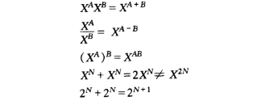

#### 对数

> 在计算机科学中，除非有特别的声明，所有的对数都是以 2 为底的

记住：log 1 = 0，log 2 = 1，log 1024 = 10， log 1048576 = 20

#### 级数


#### 模运算

如果 N 整除 A - B，那么就说 A 与 B 模 N 同余，记为 A ≡ B（mod N）

#### 证明方法

> 证明数据结构分析中的结论的两个最常用的方法是归纳法和反证法，证明一个定理不成立的最好的方法是举出一个反例。

* 归纳法证明

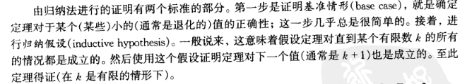

* 反证法证明

### 递归简论

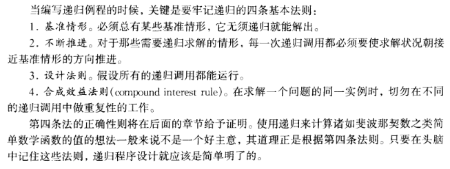

#### 打印输出数

```c
#include <stdio.h>

void printOut(int n){
	if(n >= 10){
		printOut(n / 10);
	}
	printf("%d", n % 10);
}

int main(){
	int n, result;
	scanf("%d", &n);
	printOut(n);
	
	return 0;
}
```

### 数据结构的概念


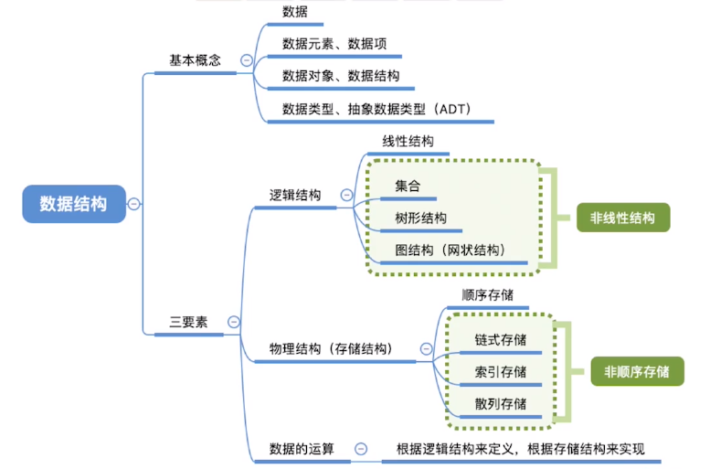

> 理解下面三点：

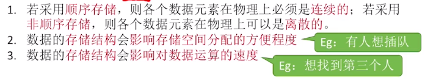


## 第 2 章 算法分析

> 算法（algorithm）是为求解一个问题需要遵循的、被清楚地指定的简单指令的集合。对于一个问题，一旦给定某种算法并且（以某种方式）确定其是正确的，那么重要的一步就是确定该算法将需要多少诸如时间或者空间等资源量的问题。

### 算法的概念


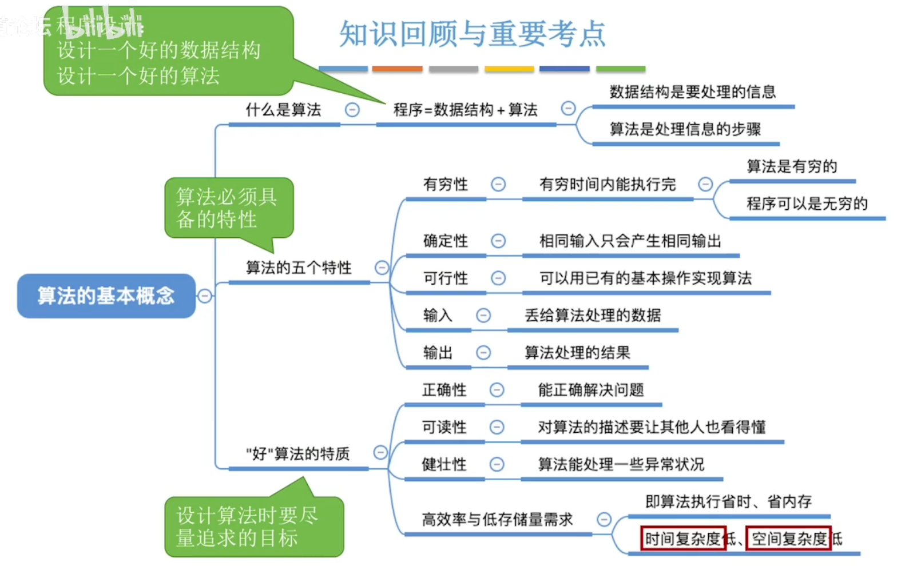


### 数学基础

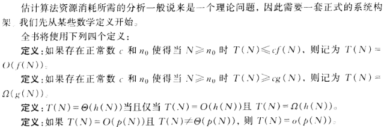


### 计算模型

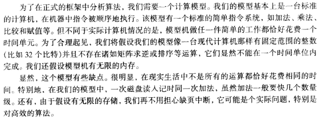


### 算法效率的度量

#### 时间复杂度

!> 如何评估算法时间开销？

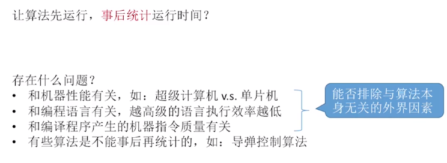

所以要进行事前预估，事前预估算法时间开销 T(n) 与问题规模n的关系 (T表示“time”)

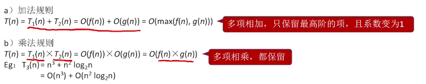

**时间复杂度量级比较**
$$
O(1)<O(log_2n)<O(n)<O(nlog_2n)<O(n^2)<O(n^3)<O(2^n)<O(n!)<O(n^n)
$$
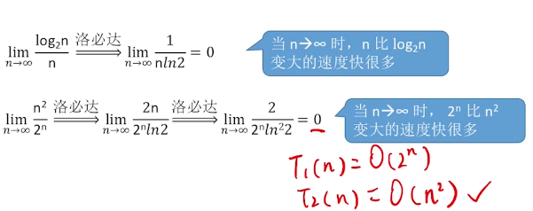


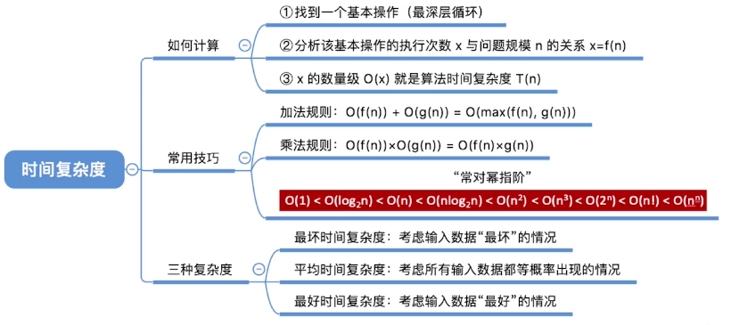

#### 空间复杂度

算法可以**原地工作**——S(n)=O(1)

计算规则与时间复杂度类似


递归型算法

空间复杂度=递归调用的深度


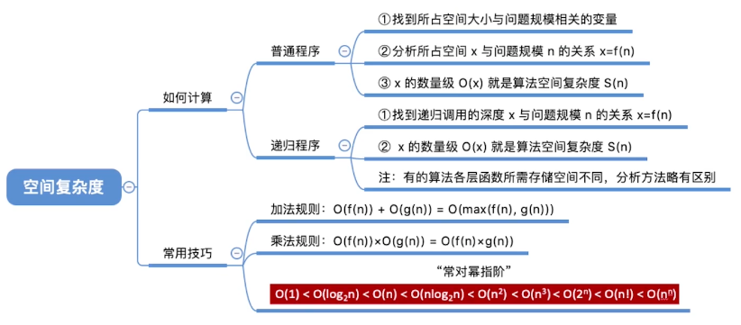

### 分析问题

#### 最大子序列和

【题目】

```
给定（可能有负数）整数a(1)、a(2)、……a(n)，求 a(1)+a(2)+……+a(j)的最大值。
为方便起见，若所有的整数为负数，则最大子序列和为0.

也就是：在一系列整数中，找出连续的若干个整数，这若干个整数之和 最大。
```

【代码实现】

* 方法一：穷举法
  * 穷举所有可能，由于嵌套三层 for 循环，运行时间 O(N^3)
  * 算法思想：算出每个子序列的和，即算出序列中第 i 个到第 j 个数的和 (j >= i) ，并进行比较
* C 语言版：函数原型为 int maxSubSum(int a[]);

```c
#include <stdio.h>

int maxSubSum(int a[]){
	int maxSum = 0;
	int sum, i, j, k;
    int len = sizeof(a) / sizeof(int);
	for(i = 0; i < len; i++){
		for(j = i; j < len; j++){
			sum = 0;
			for(k = i; k <= j; k++){
				sum += a[k];//计算 a[i] 到 a[j] 的和 
			}
			if(sum > maxSum){
				maxSum = sum;
			} 
		}
	}
	return maxSum;
}

int main(){
	int a[] = {-2, 11, -4, 13, -5, -2};
	int max = maxSubSum(a);
	printf("%d\n",max);
	return 0;
}
```

* C 语言版：函数原型为 int maxSubSum(int a[], int n);

```c
#include <stdio.h>

int maxSubSum(int a[], int n){
	int maxSum = 0;
	int sum, i, j, k;
	for(i = 0; i < n; i++){
		for(j = i; j < n; j++){
			sum = 0;
			for(k = i; k <= j; k++){
				sum += a[k];//计算 a[i] 到 a[j] 的和 
			}
			if(sum > maxSum){
				maxSum = sum;
			} 
		}
	}
	return maxSum;
}

int main(){
	//int a[] = {-2, 11, -4, 13, -5, -2};
	int a[] = { -2, 4, -3, 5, 7, -1, 8, 1 };
	int len = sizeof(a) / sizeof(int);//有负数所以 strlen(a) 不能用 
	int max = maxSubSum(a, len);
	printf("%d\n",max);	
	return 0;
}
```

* 方法二：
  * 在第一种的基础上简化，撤除一层 for 循环，运行时间 O(N^2)
  * 算法思想：第一个算法的第三个 for 循环中有大量不必要的重复计算，如：计算 i 到 j 的和，然而 i 到 j-1 的和在前一次的循环中已经计算过，无需重复计算，故该 for 循环可以去掉

* C 语言版

```c
#include <stdio.h>

int maxSubSum(int a[], int n){
	int maxSum = 0;
	int sum, i, j;
	for(i = 0; i < n; i++){
		sum = 0;
		for(j = i; j < n; j++){
			sum += a[j];
			if(sum > maxSum){
				maxSum = sum;
			} 
		}
	}
	return maxSum;
}

int main(){
	//int a[] = {-2, 11, -4, 13, -5, -2};
	int a[] = { -2, 4, -3, 5, 7, -1, 8, 1 };
	int len = sizeof(a) / sizeof(int);//有负数所以 strlen(a) 不能用 
	int max = maxSubSum(a, len);
	printf("%d\n",max);	
	return 0;
}
```

* 方法三：分而治之
  * 算法思想：把问题分成两个大致相等的子问题，然后递归地对它们求解，这是“分”的部分。“治”阶段将两个子问题的解修补到一起并可能再做些少量的附加工作，最后得到整个问题的解。
  * 在该问题中，如果把序列从中间分为两部分，那么最大子序列和可能在三处出现，要么整个出现在输入数据的左半部，要么整个出现在右半部，要么跨越分界线。前两种情况可以递归求解，第三种情况的最大和可以通过求出前半部分（包括前半部分的最后一个元素）的最大和以及后半部分（包含后半部分的第一个元素）的最大和而得到，此时将两个和相加。
  * 运行时间 O( N log N )
* C 语言版

```c
#include <stdio.h>

int maxSubSum(int a[], int left, int right){
	// 判断是否只有一个元素
    if (left == right) {
        if (a[left] > 0) {
            return a[left];
        } else {
            return 0;
        }
    }
    int center = (left + right) / 2;
    int maxLeftSum = maxSubSum(a, left, center);
    int maxRightSum = maxSubSum(a, center + 1, right);
    // 左端处理
    int maxLeftBorderSum = 0;
    int leftBorderSum = 0;
    int i;
    for (i = center; i >= left; i--) {
    	leftBorderSum += a[i];
        if (leftBorderSum > maxLeftBorderSum) {
            maxLeftBorderSum = leftBorderSum;
        }
    }

    // 右端处理
    int maxRightBorderSum = 0;
    int rightBorderSum = 0;
    for (i = center + 1; i <= right; i++) {
        rightBorderSum += a[i];
        if (rightBorderSum > maxRightBorderSum) {
            maxRightBorderSum = rightBorderSum;
        }
    }
    // 返回最大值
    int maxBorderSum = maxLeftBorderSum + maxRightBorderSum;
	return maxBorderSum > maxLeftSum ? maxBorderSum > maxRightSum ? maxBorderSum : maxRightSum
				: maxLeftSum > maxRightSum ? maxLeftSum : maxRightSum;
}

int main(){
	//int a[] = {-2, 11, -4, 13, -5, -2};
	int a[] = { -2, 4, -3, 5, 7, -1, 8, 1 };
	int max = maxSubSum(a, 0, sizeof(a) / sizeof(int) - 1);
	printf("%d\n",max);
	return 0;
}
```

* 方法四：最优起点，扫描法
  * 算法思想：设 a[i] 为和最大序列的起点，则如果 a[i] 是负的，那么它不可能代表最优序列的起点，因为任何包含 a[i] 作为起点的子序列都可以通过 a[i+1] 作起点而得到改进。
  * 类似的，任何负的子序列也不可能是最优子序列的前缀。
  * 运行时间：O(N)

* C 语言版

```c
#include <stdio.h>

int maxSubSum(int a[], int n){
	int maxSum = 0;
	int sum = a[0], i;
	/*考虑如果全是负数，那么返回最大的负数，
	如果最后的和为正，那么就使用扫描法*/
	for(i = 1; i < n; i++){
		if(sum < 0){//当前数小于0，换为下一个数
			sum = a[i];
		}else{
			sum += a[i];
		}
		if(sum > maxSum){
			maxSum = sum;
		}
	}
	return maxSum;
}

int main(){
	//int a[] = {-2, 11, -4, 13, -5, -2};
	int a[] = { -2, 4, -3, 5, 7, -1, 8, 1 };
	int len = sizeof(a) / sizeof(int);//有负数所以 strlen(a) 不能用 
	int max = maxSubSum(a, len);
	printf("%d\n",max);	
	return 0;
}
```


#### 对分查找

> binary search 又叫对半查找，时间复杂度 O(log N)

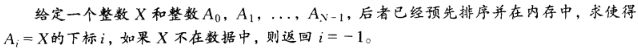

【代码实现】

* C 语言版

```c
#include <stdio.h>

int binarySearch(int a[], int n, int x){
    int low, mid, high;
    low = 0;
    high = n - 1;
    while(low <= high){
    	mid = (low + high) / 2;
    	if(a[mid] < x){
    		low = mid + 1;
		}else if(a[mid] > x){
			high = mid - 1;
		}else{
			return mid;
		}
	}
	return -1;
}

int main(){
    int a[] = { 1, 2, 3, 4, 5, 6 };
    int len = sizeof(a) / sizeof(int);
    int x;
    scanf("%d",&x);
	if(binarySearch(a, len, x) != -1){
		printf("Found %d.\n",x);
	}else{
		printf("NotFound %d.\n",x);
	}

    return 0;
}
```


#### 最大公约数

> 又叫欧几里德算法 gcd(M, N) 

【代码实现】

* C 语言版：使用 while 循环

```c
#include <stdio.h>

int gcd(int a, int b){
	int tmp;
	while(b > 0){
		tmp = a % b;
		a = b;
		b = tmp;
	}
	return a;
}

int main(){
	int x, y;
	scanf("%d%d",&x, &y);
	printf("%d\n", gcd(x, y));
	return 0;
}
```


* C 语言版：使用递归

```c
#include <stdio.h>

int gcd(int a, int b){
	if(b == 0){
		return a;
	}else{
		return gcd(b, a % b);
	}
}

int main(){
	int x, y;
	scanf("%d%d",&x, &y);
	printf("%d\n", gcd(x, y));
	return 0;
}
```


#### 幂运算

【题目】

求 x^n 

【代码实现】

* C 语言版：递归

```c
#include <stdio.h>

int pow(int x, int n){
	if(n == 0){
		return 1;
	}
	if(n == 1){
		return x;
	}
	if(n % 2 == 0){
		return pow(x * x, n / 2);
	}else{
		return pow(x * x, n / 2) * x;
	}
}

int main(){
	printf("%d\n", pow(2, 5));//2^5
	return 0;
}
```


## 第 3 章 表、栈和队列

### 线性表

> 线性表是具有相同类型的 n（n>=0）个元素的有限序列，其中 n 为表长，当 n=0 时，该表为空表。

线性表的特点：

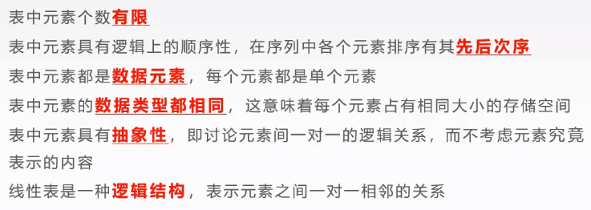

#### 抽象数据类型(ADT)

```
ADT 线性表(SeqList)
Data
    线性表的数据对象集合为{a1,a2,....,an},每个元素的类型均为DataType。
    其中，除了第一个元素a1外，每一个元素有且只有一个直接前驱元素，除最后一个元素an外，
    每一个元素有且只有一个直接后继元素。数据元素之间的关系是一对一的关系。

Operation
    InitList(*L):初始化操作，建立一个空的线性表。
    ListEmpty(L):若线性表为空，返回true，否则返回false。
    ClearList(*L):线性表清空。
    GetElem(L,i,*e):将线性表L中第i个位置元素返回给e。
    LocateElem(L,e):在线性表L中查找与给定值e相等的元素，如果查找成功,返回该元素在表中的序列号；
    否则，返回0表示失败。
    InsertList(*L,i,e):在线性表的第i个位置插入元素e。
    DeleteList(*L,i,*e):删除线性表L中的第i个元素，并用e返回其值
    ListLength(L):返回线性表L的元素个数。
    PrintList(L):打印线性表
```

#### 顺序表

> **是指将线性表中的各个元素依次存放在一组地址连续的存储单元中，通常将这种方法存储的线性表称为顺序表**。

* 线性表中第 i 个元素的存储位置与第一个元素的 a1 的存储位置满足以下关系，location(ai)  = location(a1) + (i-1) * m。其中，第一个元素的位置 location(a1) 称为起始地址或基地址。
* 顺序表逻辑上相邻的元素在物理上也是相邻的。每一个数据元素的存储位置都和线性表的起始位置相差一个和数据元素在线性表中的位序成正比的常数。只要确定了第一个元素的起始位置，线性表中的任一个元素都可以随机存取，因此，线性表的顺序存储结构是一种随机存取的存储结构。由于 C 语言的数组具有随机存储特别，因此采用数组来描述顺序表。
* 定义顺序表结构体：

```c
typedef struct{
    DataType list[MaxSize];
    int length;
}SeqList;
```

其中，DataType 表示数据元素类型，list 用于存储线性表中的数据元素，length 用来表示线性表中数据元素的个数，SeqList 是结构体类型名。定义一个顺序表代码：SeqList L;  指向顺序表的指针：SeqList *L;

> 顺序表的基本运算如下：

（1）初始化线性表

```c
void InitList(SeqList *L){
    L->length =0; //把线性表的长度设为0
}
```

（2）线性表非空判断

```c
int ListEmpty(SeqList *L){
    if(L->length == 0)
        return 1;
    else
        return 0;
}
```

（3）线性表清空

```
void ClearList(SeqList *L){//线性表清空。
	L->length =0; //把线性表的长度设为0
}
```


（4）按序号查找

```c
int GetElem(SeqList *L, int i, DataType *e){
//查找线性表中第i个元素，查找成功将该值返回给e，并返回1表示成功，反正返回-1表失败。
    if(i < 1 || i > L->length){
    	return -1;
	}
    *e = L->list[i - 1];
    return 1;
}
```


（5）按内容查找

```c
int LocateElem(SeqList *L, DataType e){
//查找线性表中元素值为e的元素
    int i;
    for (i = 0; i < L->length ; i++)
        if(L->list[i] == e){
        	return i + 1;
		}   
    return 0;//找不到返回0
}
```


（6）插入操作

```c
//在顺序表的第i个位置插入元素e，成功返回1，
//失败返回-1，顺序表满了返回0
int InsertList(SeqList *L, int i, DataType e){
    int j;
    if(i < 1 || i > L->length + 1){
        return -1;
    }
    else if(L->length >= MaxSize){
        return 0;
    }else{
        for(j = L->length; j >= i; j--){
            L->list[j] = L->list[j-1];
        }
        L->list[i-1] =e ;//插入元素到i个位置
        L->length = L->length + 1;
        return 1;
    }
}
```


（7）删除操作

```c
int DeleteList(SeqList *L, int i, DataType *e){
    int j;
    if(L->length <= 0){
        return 0;
    }
    else if(i < 1 || i > L->length){
        return -1;
    }else{
        *e = L->list[i-1];
        for(j = i;j <= L->length-1; j++){
            L->list[j-1] = L->list[j];
        }
        L->length = L->length - 1;
        return 1;
     }
}
```


（8）返回线性表个数

```c
int ListLength(SeqList *L){//返回线性表L的元素个数。
	return L->length;
}
```


（9）打印线性表

```c
void PrintList(SeqList *L){//打印线性表,即顺序表遍历
	int i;
	for(i = 0; i < L->length; i++){
		printf("%d\n", L->list[i]);
	}
} 
```


（10）主函数调用测试 main()

```c
int main(){	
	SeqList *L;
	L = (SeqList *)malloc(sizeof(SeqList));//申请内存空间
	//L->length = 10;
	printf("初始化数组------\n");
	//测试初始化数组长度为0 
	InitList(L);
	printf("插入节点------\n");
	//测试插入数据元素
	InsertList(L, 1, 55);
	InsertList(L, 2, 57);	
	InsertList(L, 3, 78);
	InsertList(L, 2, 89);
	//查看线性表是否为空 
	if(ListEmpty(L) == 1){
		printf("线性表为空\n"); 
	}else{
		printf("线性表不为空\n"); 
	}
	//测试 打印线性表
	PrintList(L) ;
	int a = 123;
	int *p = &a;
	printf("删除节点------\n");
	//删除测试
	DeleteList(L, 2, p); 
	printf("%d\n",*p);
	printf("删除节点后------\n");
	//测试 打印线性表
	PrintList(L) ;
	int l = ListLength(L);
	printf("线性表长度为%d\n",l);
	//查找元素
	//按内容查找 
	if(LocateElem(L, 55)){
		printf("找到\n"); 
	} 
	//按序号查找 
	GetElem(L, 2, p);
	printf("%d\n",*p); 
	return 0;
}
```

> 提供另一种方式写顺序表，不申请内存空间 malloc

```c
#include <stdio.h>
#define MaxSize 100
//定义数据类型 
typedef int DataType;
typedef struct{
	//线性数组 
    DataType list[MaxSize];
    //数组长度 
    int length;
}SeqList;
//初始化线性表 
void InitList(SeqList *L){
    L->length =0; //把线性表的长度设为0
}

int ListEmpty(SeqList L){
    if(L.length == 0)
        return 1;
    else
        return 0;
}

void ClearList(SeqList *L){//线性表清空。
	L->length =0; //把线性表的长度设为0
}

int GetElem(SeqList L, int i, DataType *e){
//查找线性表中第i个元素，查找成功将该值返回给e，并返回1表示成功，反正返回-1表失败。
    if(i < 1 || i > L.length){
    	return -1;
	}
    *e = L.list[i - 1];
    return 1;
}

int LocateElem(SeqList L, DataType e){
//查找线性表中元素值为e的元素
    int i;
    for (i = 0; i < L.length ; i++)
        if(L.list[i] == e){
        	return i + 1;
		}   
    return 0;//找不到返回0
}

//在顺序表的第i个位置插入元素e，成功返回1，失败返回-1，顺序表满了返回0
int InsertList(SeqList *L, int i, DataType e){
    int j;
    if(i < 1 || i > L->length + 1){
        return -1;
    }
    else if(L->length >= MaxSize){
        return 0;
    }else{
        for(j = L->length; j >= i; j--){
            L->list[j] = L->list[j-1];
        }
        L->list[i-1] =e ;//插入元素到i个位置
        L->length = L->length + 1;
        return 1;
    }
}

int DeleteList(SeqList *L, int i, DataType *e){
    int j;
    if(L->length <= 0){
        return 0;
    }
    else if(i < 1 || i > L->length){
        return -1;
    }else{
        *e = L->list[i-1];
        for(j = i;j <= L->length-1; j++){
            L->list[j-1] = L->list[j];
        }
        L->length = L->length - 1;
        return 1;
     }
}

int ListLength(SeqList L){//返回线性表L的元素个数。
	return L.length;
}

void PrintList(SeqList L){//打印线性表,即顺序表遍历
	int i;
	for(i = 0; i < L.length; i++){
		printf("%d\n", L.list[i]);
	}
} 
    
int main(){
	
	SeqList L;
	//L.length = 0;
	//L = (SeqList *)malloc(sizeof(SeqList));//申请内存空间
	//L->length = 10;
	printf("初始化数组------\n");
	//测试初始化数组长度为0 
	InitList(&L);
	printf("插入节点------\n");
	//测试插入数据元素
	InsertList(&L, 1, 55);
	InsertList(&L, 2, 57);	
	InsertList(&L, 3, 78);
	InsertList(&L, 2, 89);
	//查看线性表是否为空 
	if(ListEmpty(L) == 1){
		printf("线性表为空\n"); 
	}else{
		printf("线性表不为空\n"); 
	}
	
	//测试 打印线性表
	PrintList(L) ;
	int a = 123;
	int *p = &a;
	printf("删除节点------\n");
	//删除测试
	DeleteList(&L, 2, p); 
	printf("%d\n",*p);
	printf("删除节点后------\n");
	//测试 打印线性表
	PrintList(L) ;
	int l = ListLength(L);
	printf("线性表长度为%d\n",l);
	//查找元素
	//按内容查找 
	if(LocateElem(L, 55)){
		printf("找到\n"); 
	} 
	//按序号查找 
	GetElem(L, 2, p);
	printf("%d\n",*p); 
	return 0;
}
```

!> 小结：顺序表的优缺点。

（1）优点：无须关心表中元素之间的关系，所以不用增加额外的存储空间；可以快速地取表中任意位置的元素。

（2）缺点：插入和删除操作需要移动大量元素。使用前需事先分配好内存空间，当线性表长度变化较大时，难以确定存储空间的容量。分配空间过大会造成存储空间的巨大浪费，分配的空间过小，难以适应问题的需求

#### 链式表

> 链式表包括单链表、双链表、循环链表、循环单链表等等等

#### 单链表

单链表的存储结构用C语言描述：

```c
typedef int DataType;
typedef struct Node{
    DataType data;//创建数据域 
    struct Node *next;//创建指针域 
}LinkList;
```

其中，LinkList 是链表的结点类型。

> 单链表的基本运算如下：

（1）初始化单链表

```c
LinkList * InitList(LinkList *p){
	p = (LinkList *)malloc(sizeof(LinkList));
	if(!p){
		exit(-1);//exit函数，退出程序。
	}
	p->next = NULL;
	return p;
}
```

!> 真正使用的时候，直接在 CreateList 中定义即可，如下写法，根据实际需求使用：

```c
LinkList *q = (LinkList *)malloc(sizeof(LinkList));
if (!q){
	exit(-1); //exit函数，退出程序。
}	
LinkList * r = q; //创建尾指针指向尾节点
r->next = NULL;
```

或者：

```c
LinkList *q = (LinkList *)malloc(sizeof(LinkList));
if (!q){
	exit(-1); //exit函数，退出程序。
}	
q = NULL;
```

或者：

```c
LinkList *q = (LinkList *)malloc(sizeof(LinkList));
if (!q){
	exit(-1); //exit函数，退出程序。
}	
q->next = NULL;
```

（2）单链表非空判断

```c
int ListEmpty(LinkList *p){
	int flag = 0;
	if(!p){
		flag = 1;
	}
	return flag;
}
```

（3）按序号查询操作

```c
//按序号查找单链表中第i个结点
LinkList *GetElem(LinkList *head,int i){
    LinkList *p;
    int j = 0;
    if(ListEmpty(head)||i<1){ //如果链表为空
        return NULL;
    }
    p = head;
    while(p->next !=NULL && j<i-1){//保证p的下个结点不为空
        p = p->next;
        j++;
    }
    if(j==i-1)//找到第i个结点
        return p;
    else
        return NULL;
}
```


（4）按内容查找操作

```c
//按内容查找单链表中元素值为e的元素
int LocateElem(LinkList *head,DataType e){
	int flag = 0;
    LinkList *p;
    p = head->next; //指针p指向第一个结点
    while(p){
        if(p->data != e){
            p=p->next;//继续下一个
        }else{
        	flag = 1;
            break;
        }
    }
    return flag;
}
```


（5）定位操作

```c
int LocatePos(LinkList *head,DataType e){
    LinkList *p;//定义一个指向单链表的结点的指针p
    int i;
    if(ListEmpty(head))//非空判断
        return 0;
    p = head->next;//指针p指向一个结点
    i =1;
    while(p){
        if(p->data==e)
            return i;
        else
        {
            p=p->next;//指向下一个结点
            i++;
        }
    }
    if(!p)//如果没有找到与e相等的元素
         return 0;
} 
```


（6）插入新数据元素 e 到 i 位置

```c
int InsertList(LinkList *head,int i,DataType e){
    LinkList *pre,*p;//定义第i个元素的前驱结点指针pre，新生结点指针p
    int j = 0;
    pre = head; //指针pre指向头结点
    while(pre->next != NULL && j < i-1){ //循环直到直到i元素前驱结点
        pre = pre->next;
        j++;
    }
    if(j != i-1)//如果没找到，插入位置出错
        return 0;
    //新生一个结点
    p = (LinkList *)malloc(sizeof(LinkList));
    if(!p){
        exit(-1);
    }
    p->data =e; //将e赋值给结点的数据域
    p->next = pre->next;
    pre->next =p;
    return 1;
}
```


（7）删除第 i 个结点

```c
int DeleteList(LinkList *head,int i,DataType *e){
    LinkList *pre,*p;
    int j = 0;
    pre = head;
    while(pre->next!=NULL && pre->next->next != NULL && j<i-1){
        pre = pre->next;    
        j++;
    }
    if(j!=i-1){
        return 0;
    }
    //指针p指向单链表中的第i个结点,并将该结点数据域值赋值给e
    p = pre->next;
    *e =p->data;
    //将前驱结点的指针域指向要删除结点的下一个结点
    pre->next =p->next;
    free(p);//释放p指向的结点
    return 1; 
}
```


（8）打印单链表

```c
void PrintList(LinkList * p){//遍历输出
	LinkList *q;
	if (ListEmpty(p)){
		printf("链表为空！\n");
	}else{
		q = p->next; //使指针指向下一个节点
		printf("链表中的数据为：\n");
		while (q){//q!=NULL
			//printf("%d ", q->data);
			if(q->next){
				printf("%d->", q->data);
			}else{
				printf("%d", q->data);
			}
			q = q->next;
		}
		printf("\n");
	}
}
```


（9）主函数调用测试 main()


> 简单的单链表创建输出数据：

```c
#include <stdio.h>
#include <stdlib.h>

//定义数据类型 
typedef int DataType;
typedef struct Node{
    DataType data;//创建数据域 
    struct Node *next;//创建指针域 
}LinkList;

LinkList * CreateList(){ 
    //函数返回值为LinkList * 类型。
	int len, i, x;
	LinkList *q = (LinkList *)malloc(sizeof(LinkList));
	if (!q){
		printf("分配头结点空间失败，程序终止！\n");
		exit(-1); //exit函数，退出程序。
	}	
	LinkList * r = q; //创建尾指针指向尾节点
	r->next = NULL;
	printf("请输入链表的节点个数：len = ");
	scanf("%d", &len);
	for (i=0; i<len; ++i){
		printf("请输入第%d个节点的值：", i+1);
		scanf("%d", &x);
		LinkList *p = (LinkList *)malloc(sizeof(LinkList)); 
		//链表的不连续性在于它的内存空间在不断地一个个分配
		if (!p){
			printf("分配空间失败，程序终止！\n");
			exit(-1);
		}
		p->data = x;
		r->next = p;
		p->next = NULL;
		r = p; //递归
	}
	return q;
}

void PrintList(LinkList * p){//遍历输出
	LinkList *q;
	if (isEmpty(p)){
		printf("链表为空！\n");
	}else{
		q = p->next; //使指针指向下一个节点
		printf("链表中的数据为：\n");
		while (q){//q!=NULL
			printf("%d  ", q->data);
			q = q->next;
		}
		printf("\n");
	}
}
 
int isEmpty(LinkList *p){
	int flag = 0;
	if(!p){
		flag = 1;
	}
	return flag;
}

int main(){
	LinkList * p; //创建头指针，用来存放头结点的地址。
	p = CreateList(); //CreateList()函数动态创建链表并返回头结点的地址。	
	PrintList(p); //打印单链表数据 
	return 0;
}
```


## 栈和队列

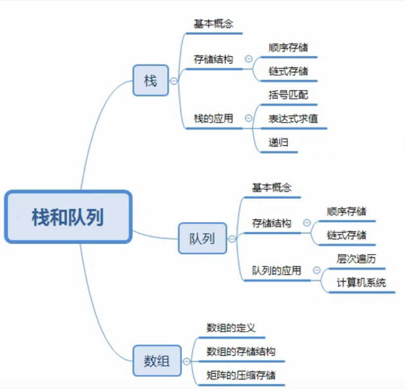


## 矩阵的压缩存储


### 对称矩阵

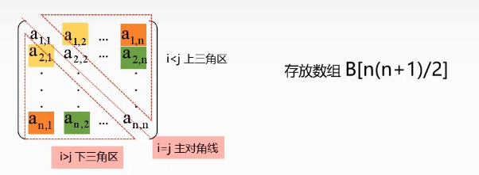

计算$$\large a_{i,j}$$在压缩矩阵中的下标

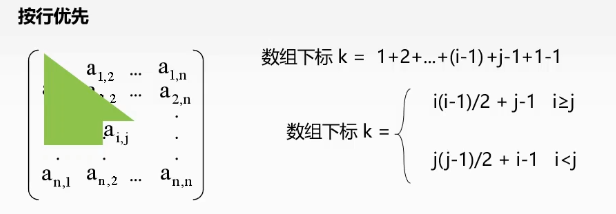

### 三角矩阵


+1个空间是为了存储这个常数c

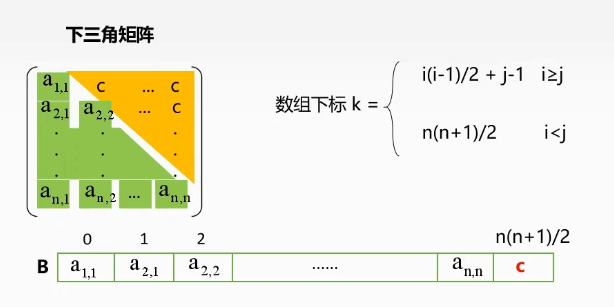

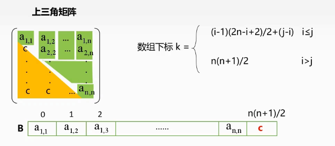

### 三对角矩阵

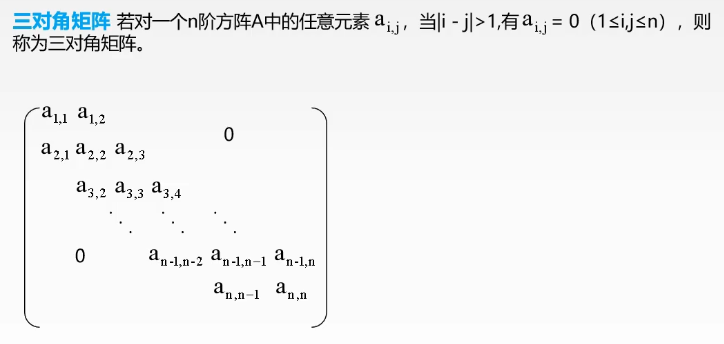

数组下标$$k=3*(i-1)-1+j-i+1=2*i+j-3$$

$$i = (k+1)/3 + 1$$

$$j = k-2*i+3$$

### 稀疏矩阵

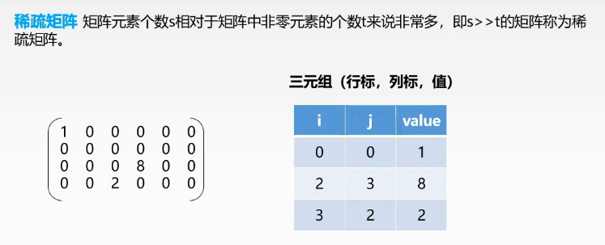

> 稀疏矩阵在采用压缩存储后将会**失去随机存储的功能**。因为在这种矩阵中，非零元素的分布是没有规律的，为了压缩存储，就将每一个非零元素的值和它所在的行、列号做为一个结点存放在一起，这样的结点组成的线性表中叫三元组表，它已不是简单的向量，所以无法用下标直接存取矩阵中的元素。


## KMP算法

理解三个概念：前缀、后缀、部分匹配值

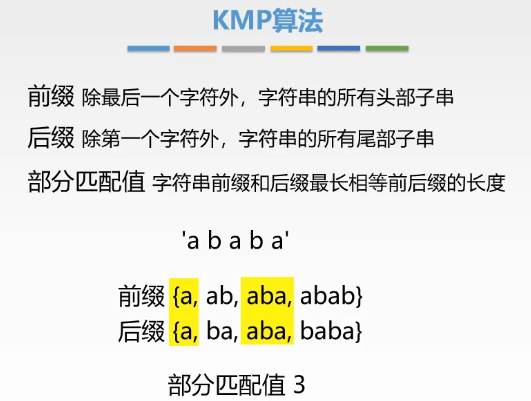

### 手搓步骤

计算模式串中所有前缀的部分匹配值

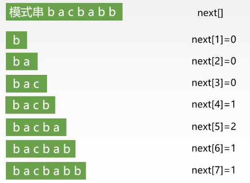

匹配成功则向后推进，匹配失败则根据next[]数组回退（j-1 - next[j-1]）步。


### 算法实现

```java
public class KMP2 {
    private int next[];
    private String pat;

    public static void main(String[] args) {
        KMP2 kmp = new KMP2("issip");
        int res = kmp.search("mississippi");
        System.out.println("res: " + res);
    }

    public KMP2(String pat) {
        this.pat = pat;
        getNext(pat);
    }

    public void getNext(String pat) {
        char[] p = pat.toCharArray();
        next = new int[p.length];
        next[0] = -1;
        int j = 0;
        int k = -1;
    
        while (j < p.length - 1) {
            if (k == -1 || p[j] == p[k]) {
                next[++j] = ++k;
            } else {
                k = next[k];
            }
        }
    }

    public int search(String text) {
        char[] t = text.toCharArray();
        char[] p = pat.toCharArray();
        int i = 0; // 主串位置
        int j = 0; // 模式串位置
        while (i < t.length && j < p.length) {
            if (j == -1 || t[i] == p[j]) {
                i++; j++;
            } else {
                j = next[j]; // j回退
            }
        }
        if (j == p.length) {
            return i-j;
        } else {
            return -1;
        }
    }


}
```


利用动态规划 二维dp 实现KMP算法

[有限状态机](https://www.zhihu.com/question/31634405)

[labuladong KMP算法详解](https://zhuanlan.zhihu.com/p/83334559)

```java
public class KMP {
    private int[][] dp;
    private String pat;

    public static void main(String[] args) {
        KMP kmp = new KMP("issip");
        int res = kmp.search("mississippi");
        System.out.println("res: " + res);
    }

    public KMP(String pat) {
        this.pat = pat;
        int M = pat.length();
        // dp[状态][字符] = 下个状态
        dp = new int[M][256];
        // base case
        dp[0][pat.charAt(0)] = 1;
        // 影子状态 X 初始为 0
        int X = 0;
        // 构建状态转移图（稍改的更紧凑了）
        for (int j = 1; j < M; j++) {
            for (int c = 0; c < 256; c++) {
                if (pat.charAt(j) == c) {
                    dp[j][c] = j + 1;
                } else {
                    dp[j][c] = dp[X][c];
                }
            }
            // 更新影子状态
            X = dp[X][pat.charAt(j)];
        }
    }

    public int search(String txt) {
        int M = pat.length();
        int N = txt.length();
        // pat 的初始态为 0
        int j = 0;
        for (int i = 0; i < N; i++) {
            // 计算 pat 的下一个状态
            j = dp[j][txt.charAt(i)];
            // 到达终止态，返回结果
            if (j == M) return i - M + 1;
        }
        // 没到达终止态，匹配失败
        return -1;
    }
}
```

## 树

### 基本概念

**n个结点，有n-1个边**

树中一个结点的子结点的个数称为该**结点的度**

树种最大度数称为**树的度**

度大于0的结点为**分支结点**

度为0的结点为**叶子结点**

有序树与无序树

**路径**：树中两个结点之间的路径，且一定是自上而下的。

**路径长度**：路径上所经历边的个数

**森林**：m课互不相交的树的集合

### 树的性质

1. 树中的结点数等于所有结点的度数加1
2. 度为m的树中第i层上至多有$m^{i-1}$个结点($i \ge 1$)
3. 高度为h的m叉树至多有$(m^b-1)/(m-1)$个结点
4. 具有n个结点的m叉树的最小高度为$log_m[n(m-1)+1]$

### 二叉树定义

**二叉树**：每个结点最多有2个子结点

度为2的有序树：每个结点最多有2个子结点 且 必须有一个结点具有2个子结点

二叉树可以为空，而度为2的有序树至少有三个结点。

二叉树的孩子结点始终有左右之分，而度为2的有序树的孩子结点次序是相对的。

---

**满二叉树**：一棵高度为h，且含有$2^h-1$个结点的二叉树为满二叉树。对于编号为i的结点，若存在，其双亲编号为[i/2]，左孩子为2i，右孩子为2i+1。


---

**完全二叉树**：设一个高度为h，有n个结点的二叉树，当且仅当其每个结点都与高度为h的满二叉树中编号1~n的结点一一对应时，称为完全二叉树。

性质：

1. 若$i \le [n/2]$，则结点i为分支结点，否则为叶子结点。
2. 叶子结点只可能在层次最大的两层出现。对于最大层次的叶子接待你，都依次排列在最左边的位置上。
3. 度为1的结点若存在，则可能有一个，且是编号最大的分支结点，并且孩子结点一定是左节点。


---

**二叉排序树**：一棵二叉树，若树非空则具有如下性质：对于任意结点若存在左子树或右子树，则其左子树上所有结点的关键字均小于该结点，右子树上所有结点的关键字均大于该结点。


---

**平衡二叉树**：树上任意结点的左子树和右子树的深度之差不超过1。


### 二叉树性质

1. 非空二叉树上的叶子结点数等于度为2的结点数加1，即$n_0=n_2+1$

   如何推导：

   $①. n=n_0+n_1+n_2$ 结点总数=$\sum\limits_{i=0}^{2}$度为i的结点数

   $②. n=n_1+2n_2+1$ 结点总数= 边数+1 = $\sum\limits_{i=0}^{2}$度为i的结点数*该结点的出度i

2. 非空二叉树上第k层上至多有$2^{k-1}$个结点($k \ge 1$)

3. 高度为h的二叉树至多有$2^h-1$个结点($h \ge 1$)

4. 结点i所在层次为$[log_2i]+1$

5. 具有n个($n \ge 1$)结点的完全二叉树的高度为$[log_2n]+1$ (由4得)或$[log_2(n+1)]$ (由3得)


### 二叉树存储

**顺序存储**：用一组连续的存储单元依次自上而下、自左至右存储完全二叉树上的结点元素。

- 适合完全二叉树。

- 最坏情况下会非常浪费存储空间。

```c
ElementType tree[MAXSIZE] = {};
```

**链式存储**：用链表来存放二叉树，二叉树中每个结点用链表的一个链结点来存储。

- 含有n个结点的二叉链表，有n+1个空链域。
- 2n-(n-1) = n+1  
- 2n表示总链域数，n个结点，每个结点有两个指针域
- n-1表示非空链域，每个链域指向一个孩子结点，所以n-1个孩子结点就有n-1个非空链域。除了根节点，每个结点都能作为孩子结点，所以是n-1个孩子结点。

```c
typedef struct Node {
	ElementType data;
	struct Node *lchild, *rchild;
} Node, *BiTree;
```


### 二叉树遍历

先序遍历：根，左子树，右子树

中序遍历：左子树，根，右子树

后序遍历：左子树，右子树，根

层次遍历：从左至右，从上至下


递归实现

```c
void PreOrder(BiTree T) {
    if (T != NULL) {
        visit(T);
        PreOrder(T->lchild);
        PreOrder(T->rchild);
    }
}

void InOrder(BiTree T) {
    if (T != NULL) {
        InOrder(T->lchild);
        visit(T);
        InOrder(T->rchild);
    }
}

void PostOrder(BiTree T) {
    if (T != NULL) {
        PostOrder(T->lchild);
        PostOrder(T->rchild);
        visit(T);
    }
}
```


**中序遍历非递归实现**

1. 初始时依次扫描根节点的所有左侧结点并将他们一一入栈；
2. 出栈一个结点，访问它；
3. 扫描该结点的右孩子结点并将其入栈；
4. 依次扫描右孩子结点的所有左侧结点并一一入栈；
5. 反复该过程直到栈空为止。

```c
void InOrderTraverse(BiTree T) {
    Node *S;
    InitStack(S);
    BiTree p = T;
    while (p || !IsEmpty(S)) {
        if (p) {
            Push(S, p);
            p = p->lchild;
        } else {
            Pop(S, p); visit(p);
            p = p->rchild;
        }
    }
}

void PreOrderTraverse(BiTree T) {
    Node *S;
    InitStack(S);
    BiTree p = T;
    Push(S, p);
    while (p != NULL || !IsEmpty(S)) {
        Pop(S, p);
        visit(p);
        if (p->rchild != NULL) {
            Push(S, p->rchild);
        }
        if (p->lchild != NULL) {
            Push(S, p->lchild);
        }
    }
}
```

**后序遍历非递归实现**

待定。


**层次遍历**

1. 初始时将根入队并访问根节点
2. 若有左子树，则将左子树的根入队
3. 若有右子树，则将右子树的根入队
4. 然后出队，访问该结点
5. 反复该过程直到队列为空

```c
void levelOrder(BiTree T) {
    InitQueue(Q);
    BiTree p;
    EnQueue(Q, T);
    while (!isEmpty(Q)) {
        DeQueue(Q, p);
        visit(p);
        if (p->lchild != NULL)
            EnQueue(Q, p->lchild);
        if (p->rchild != NULL)
            EnQueue(Q, p->rchild);
    }
}
```


### 遍历序列构造二叉树

先（后）序遍历序列和中序遍历序列可以确定一棵二叉树。

而后序遍历序列和先序遍历序列不可以确定一棵二叉树。


### 线索二叉树

线索化：

- 若无左子树，则将左指针指向其前驱结点；
- 若无右子树，则将右指针指向其后继结点。

```c
typedef struct ThreadNode {
	ElementType data;
	struct Node *lchild, *rchild;
    int ltag, rtag;
} ThreadNode, *ThreadTree;
// l(r)tag :
// 0: l(r)child域指向的是孩子结点
// 1: l(r)child域指向的是前驱(后继)结点
```


中序线索二叉树寻找对应结点的前驱与后继更加方便。我们主要研究中序线索二叉树。


**中序线索二叉树**

- 前驱结点
  - 若左指针为线索，则其指向的结点为前驱结点
  - 若左指针为左孩子，则其左子树的最右侧结点为前驱结点
- 后继结点
  - 若右指针为线索，则其指向的结点为后继结点
  - 若右指针为右孩子，则其右子树的最左侧结点为后继结点

**中序线索二叉树的线索化实现**

```c
void InThread(ThreadTree &p, ThreadTree &pre) {
    if (p == NULL) return;
    InThread(p->lchild, pre);
    if (p->lchild == NULL) {
        p->lchild = pre;
        p->ltag = 1;
    }
    if (pre != NULL && pre->rchild == NULL) {
        pre->rchild = p;
        pre->rtag = 1;
    }
    pre = p;
    InThread(p->rchild, pre);
}
```

得到的中序线索二叉树：


还可以将剩余两个指针利用起来，指向一个头节点的前驱与后继。


**中序线索二叉树遍历**

```c
// 找到中序遍历的第一个结点
ThreadNode* FirstNode(ThreadNode *p) {
    while (p->ltag == 0)
        p = p->lchild;
    return p;
}
// 找下一个结点
ThreadNode* NextNode(ThreadNode *p) {
    if (p->rtag == 0) // 如果右指针是孩子结点
        return FirstNode(p->rchild); // 找右孩子的左子树中第一个结点，为我们要的后继结点
    else // 如果右指针是线索
        return p->rchild; // rchild就是我们要的后继结点
}

// 中序线索树的遍历
void InOrder(ThreadNode *T) {
    for (ThreadNode *p=FirstNode(T); p != NULL; p = NextNode(p)) {
        visit(p);
    }
}
```

### 树的存储

- 双亲表示法

  采用一组连续的存储空间来存储每个结点，同时在每个节点中增设一个伪指针，指示双亲结点在数组中的位置。根结点的下标为0，其伪指针域为-1。

  ```c
  typedef struct {
      ElemType data;
      int parent;
  } PTNode;
  
  typedef struct {
      PTNode nodes[MAX_TREE_SIZE];
      int n;
  } PTree;
  ```

  

- 孩子表示法

  将每个结点的孩子结点都用单链表连接起来形成一个线性结构，n个结点具有n个孩子链表。

  ```c
  // 孩子结点
  typedef struct {
      int child; // 孩子结点的下标
      struct CNode *next;
  } CNode;
  
  // 根节点
  typedef struct {
      ElemType data;
      struct CNode *child;
  } PNode;
  
  typedef struct {
      PNode nodes[MAX_TREE_SIZE];
      int n;
  } CTree;
  ```

  

- 孩子兄弟表示法

  以二叉链表作为树的存储结构，又称二叉树表示法。

  左孩子，右兄弟

  

  ```c
  typedef strct CSNode {
      ElemType data;
      struct CSNode *firstchild, *nextsibling;
  } CSNode, CSTree;
  ```

  


**优缺点比较**

|                | 优点                                             | 缺点                     |
| -------------- | ------------------------------------------------ | ------------------------ |
| 双亲表示法     | 寻找结点的双亲结点效率高                         | 寻找结点的孩子结点效率低 |
| 孩子表示法     | 寻找结点的孩子结点效率高                         | 寻找结点的双亲结点效率低 |
| 孩子兄弟表示法 | 寻找结点的孩子结点效率高，方便实现树转换成二叉树 | 寻找结点的双亲结点效率低 |


### 树、森林与二叉树的转换

**树与二叉树的转换**

规则：每个结点左指针指向它的第一个孩子结点，右指针指向它在树中的相邻兄弟结点。

**森林与二叉树的转换**

规则：将每一棵树转换为二叉树，将每棵二叉树的根依次作为上一棵二叉树的右子树。


转换是唯一的


### 树的遍历

- 先根遍历

  若树非空，先访问根节点，再按从左至右的顺序遍历根节点的每棵子树。

- 后根遍历

  若树非空，则先按从左到右的顺序遍历根节点的每棵子树，再访问根节点。

- 层次遍历


⭐树的先根遍历序列与这棵树对应二叉树的先序遍历序列相同。

⭐树的后根遍历序列与这棵树对应二叉树的**中序**遍历序列相同。


### 森林的遍历

- 先序遍历

  若森林非空，则，

  - 访问森林中第一棵树的根节点

  - 先序遍历第一棵树的子树森林

  - 先序遍历除去第一棵树之后的剩余的树构成的森林

- 中序遍历

  若森林非空，则，

  - 中序遍历第一棵树的根节点的子树森林
  - 访问第一棵树的根节点
  - 中序遍历除去第一棵树之后剩余的树构成的子树森林


⭐森林的先序遍历序列与森林对应二叉树的先序遍历序列相同。

⭐森林的中序遍历序列与森林对应二叉树的中序遍历序列相同。


### 遍历序列的对应关系


## 树的应用-并查集

并查集是一种简单的集合表示。

通常用树的**双亲表示法**作为并查集的存储结构。

定义以下几个方法：

- Initial(S) 将集合S中的每个元素都初始化为只有一个单元素的子集合

- Union(S, Root1, Root2)

  把集合S中的子集合（互不相交）Root2并入子集合Root1

- Find(S, X)

  查找集合S中单元素x所在子集合，并返回该子集合的名字。


```c
int UFSets[SIZE];
void Initial(int S[]) {
    for (int i = 0; i < size; i++)
        s[i] = -1;
}

int Find(int S[], int x) {
    while(S[x] >= 0)
        x = S[x];
    return x;
}

void Union(int S[], int Root1, int Root2) {
    S[Root1] += S[Root2]; //更新Root1的根节点值
    S[Root2] = Root1; //更新Root2的根节点值
}
```


## 树的应用-二叉排序树

BST，也称二叉查找树。

二叉排序树或者为空树，或者为非空树，当为非空树时有如下特点：

1. 若左子树非空，则左子树上所有结点关键字均**小于**根节点的关键字。
2. 若右子树非空，则右子树上所有结点关键字均**大于**根节点的关键字。

3. 左右子树本身也分别是一棵二叉排序树。


⭐中序遍历二叉排序树，得到的是一个递增的有序序列。


**查找**

二叉树非空时，查找根节点，若相等则查找成功；

若不等，则当小于根节点值时，查找左子树；当大于根节点值时，查找右子树。

当查找到叶节点仍没查找到相应的值，则查找失败。

**非递归算法实现查找算法**

```c
BSTNode *BST_Search(BiTree T, ElemType key, BSTNode *&p) {
    p = NULL;
    while (T!=NULL && key!=T->data) {
        p = T;
        if (key < T->data)
            T=T->lchild;
        else
            T=T->rchild;
    }
    return T;
}
```

**插入操作**

若二叉排序树为空，则直接插入结点；

若二叉排序树非空，

​	当值小于根节点时，插入左子树；

​	当值大于根节点时，插入右子树；

​	当值等于根节点时，不进行插入；

```c
int BST_Insert(BiTree &T, KeyType k) {
    if (T == NULL) {
        T = (BiTree)malloc(sizeof(BSTNode));
        T->key = k;
        T->lchild = T->rchild = NULL;
        return 1;
    } else if (k == T->key)
        return 0;
    else if (k < T->key)
        return BST_Insert(T->lchild, k);
    else
        return BST_Insert(T->rchild, k);
}
```

**构造二叉排序树**

不断调用插入函数来构造。

```c
void Create_BST(BiTree &T, KeyType str[], int n) {
    T = NULL;
    int i = 0;
    while (i < n) {
        BST_Insert(T, str[i]);
        i++;
    }
}
```

**删除操作**

若被删结点是叶子结点，则可以直接删除。

若被删结点z只有一棵子树，则让z的子树成为z父结点的子树，代替z结点。

若被删除结点z有两棵子树，则让z的中序序列直接后继代替z，并删去直接后继结点。


在二叉排序树中删除并插入某个结点，得到的二叉排序树不一定相同。


**查找效率**

平均查找长度ASL取决于树的高度。


## 回溯算法

### 八皇后问题

该问题是十九世纪著名的数学家高斯1850年提出：
在8*8格的国际象棋上摆放八个皇后，使其不能互相攻击，即任意两个皇后都不能处于同一行、同一列或同一斜线上，问有多少种摆法。


