# 离散数学笔记

## 前言

离散数学第三版前七章加最后一章看完就行，课后习题多刷几遍

**笔试--离散数学**
一:计算题:

这大题都比较简单,主要是一些基本概念的考察,今年主要是:范式,集合,图论,序的一些基本概念,其中个人觉得复习容易忽视的是最后一题良序的概念考察,这题10分,书上的原题,但是我复习的时候忽略掉了.

这大题共40分,相对比较简单.只要把一些基本概念搞清楚就不会有什么问题.今年大概的具体知识点如下(能记起的):
前束范式 书上原题,好像这节练习题第一题
序里面的极大极小元,最大最小元: 也是书上原题
还原哈斯图为关系图: 这题好像答案就在卷子上
补图,生成图的考察:
良序,序关系判断: 书上这节最后一题的四个图

这大题能记起的就这些了.

二:简答题(15)

1;问你一个谓词公式的合取范式的任意两项在同一真值指派下析取为真,析取范式的任意两项合取为假.
2:是一个很实际的问题:
 有7个人,列举了他们会哪些语言,问他们之间是不是能够自由交流,必要时可通过他人做翻译.

三:证明题(50)

 1,苏哥拉底论证的公式化,并推理.(我估计这道题很多人答不出来,因为我估计是不知道这个论证是什么东西)
 2,证完全图的边是1/2N(N+1)
 3;一个集合的证明题:证如果A属于{{b}},则A={b}
 4:证两函数相等
 5:这个题是群那章的知识点,好像也是书上原题
 一张表,通过这张表证是循环独异点,然后求生成元.

这上面就是今年笔试--离散数学的大概的题,怕以后忘了,现在把他贴上来,供以后的考生参考.

**笔试篇：**

　　科目：离散数学

　　10道大题，每题10分。

　　教材是左孝凌的离散数学。

　　复习的时候我放弃了最后一章。

　　考完我发现：格与布尔代数，还有代数系统环与域后面的东西都不出的(出的话会比较变态)。

　　重点在第一部分(占了一半)，然后有两个图论证明(个人认为比较简单)。

　　书上的原题比较多(可惜哥原题都没怎么看，把很多心思放到了最终没考的部分)

　　1、给你几个原子命题和他们的符号，给你一个复合命题，让你用符号表示这个复合命题，并说明什么时候这个命题为真。(这个应该都会的)

　　2、如果R和S都是自反的/对称的/反对称的/传递的，问他们的复合关系R。S是否也满足同样的性质，并证明。(这题我悲剧了，4小题)

　　3、把命题公式化简成主合取/析取范式，然后判断命题的真假。(2小题)

　　4、把一个公式化成主合取/析取范式。(式子相对复杂)

　　5、给你一个谓词公式，化简成前束范式。(简单)

　　6、判断某谓词公式的真假。(简单)

　　7、已知A为非空集合，A * B=A * C，证明：B==C(反证法)

　　8、一道群论的证明题：(G，* ) 为群，(H1，* )和(H2，* ) 为群，证明：H1和H2的并和*构成的代数系统也是群。(原题)

　　9、图论证明：假设一个图无环路，但是随便加一条边后必构成环路，则该图必定是树。(反证法，设不是树，有k个连通分量，得出矛盾)

　　10、图论证明：连通图的两条最长路径必有交点。(反证法，通过证明若无交点则存在更长的路)

## 第一章 命题逻辑

### 1.1 命题及联结词

#### 1.1.1 命题的基本概念

命题：在数理逻辑中把能判断真假的陈述句称为命题。

一般用小写英文字母或小写英文字母带下标表示。

命题的概念包含了以下3个要素：

* （1）只有陈述句才有可能成为命题，而其它的语句，如：感叹句、祈使句、疑问句等都不是命题。
* （2）一个语句虽是陈述句,但不能判断真假不是命题。
* （3）虽然要求命题能判断真假，但不要求现在就能确定真假，将来可以确定真假也可以。

命题的真值：一个命题表达的判断结果称为命题的真值。

命题的真值有“真”和“假”两种，分别用 True、T、1(真) 和 False、F、0(假) 来表示。

* 真值为真的命题称为真命题，
* 真值为假的命题称为假命题。
* 任何命题的真值是惟一的。

!> 在命题逻辑中对命题不再细分，因而命题是数理逻辑中最基本的也是最小的研究单位。

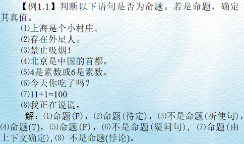

 命题标识符：表示命题的小写英文字母或带下标的小写英文字母常称为命题标识符。

命题常元：如果命题标识符表示一个具体、确定的命题，称为命题常元。

命题变元：如果命题标识符表示任意一个命题，称为命题变元。

注意：

* 命题变元无确定的真值。
* 命题是能判断真假的陈述句，而命题变元代表任意的命题，其真值是不确定的，因而不是命题。

原子命题：如果一个命题不能再分解成更简单的命题，则称该命题为原子命题。

复合命题：如果一个命题不是原子命题，称该命题为复合命题。

原子变元：如果命题变元表示原子命题时，该命题变元称为原子变元。

在自然语言中，可以通过“如果…，那么…”，“不但…，而且…”这样的连词将简单的陈述句联结成复合语句，同样在命题逻辑当中，也可以通过命题联结词将原子变元联结起来表示复合命题。

#### 1.1.2 命题联结词

> 常用的逻辑联结词有五种：否定联结词、合取联结词、析取联结词、条件联结词和双条件联结词。

##### 1.1.2.1 否定联结词

定义：设 p 为命题，则 p 的否定是一个复合命题，记作：¬ p，读作“非 p ”或“ p 的否定”。定义为：若 P 为 T，则 ¬ p 为 F；若 p 为 F，则 ¬ p 的真值为 T。

p 和 ¬ p 的关系如表 1.1 所示，表 1.1 叫做否定联结词“ ¬ ”的真值表(下同)。联结词“ ¬ ”也可以看作逻辑运算，它是一元运算。

表 1.1

|  p   | ¬ p  |
| :--: | :--: |
|  0   |  1   |
|  1   |  0   |

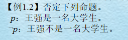

##### 1.1.2.2 合取联结词

定义：设 p 和 q 均为命题，则 p 和 q 的合取是一个复合命题，记作 p ∧ q，读作“ p 与 q ”或“ p 合取 q ”。定义为：当且仅当 p 和 q 均为 T 时，p ∧ q 的才为 T。

联结词“ ∧ ”的真值表如表 1.2 所示。联结词“ ∧ ”也可以看成逻辑运算，它是二元逻辑运算。 

表 1.2

|  p   |  q   | p ∧ q |
| :--: | :--: | :---: |
|  0   |  0   |   0   |
|  0   |  1   |   0   |
|  1   |  0   |   0   |
|  1   |  1   |   1   |

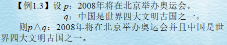

##### 1.1.2.3 析取联结词

定义：设 p 和 q 均为命题，则 p 和 q 的析取是一个复合命题，记作 p ∨ q，读作“ p 或 q ”或者“ p 析取 q ”。定义为：当且仅当 p 和 q 均为 F 时，p ∨ q 才为 F。

联结词“ ∨ ”的真值表如表 1.3 所示。联结词“ ∨ ”也可以看成逻辑运算，它是二元逻辑运算。

“ ∨ ”与汉语中的“或”相似，但又不相同。汉语中的或有可兼或与不可兼或(排斥或)的区分。

表 1.3

|  p   |  q   | p ∨ q |
| :--: | :--: | :---: |
|  0   |  0   |   0   |
|  0   |  1   |   1   |
|  1   |  0   |   1   |
|  1   |  1   |   1   |

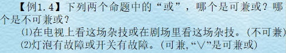

##### 1.1.2.4 条件联结词

定义：设 p 和 q 均为命题，其条件命题是个复合命题，记为：p → q。读作“如果 p，那么 q ”或“若 p，则 q ”。定义为：当且仅当 p 为 T，q 为 F 时，p → q才为 F。p 称为条件命题 p → q 的前件，q 称为条件命题 p → q 的后件。

联结词“ → ”真值表如表 1.4 所示。联结词“ → ”也可以看成逻辑运算，它是二元逻辑运算。 

表 1.4

|  p   |  q   | p → q |
| :--: | :--: | :---: |
|  0   |  0   |   1   |
|  0   |  1   |   1   |
|  1   |  0   |   0   |
|  1   |  1   |   1   |

##### 1.1.2.5 双条件联结词

定义：设 p 和 q 均为命题，其复合命题 p ↔ q称为双条件命题，读作：“ p 双条件 q ”或者“ p 当且仅当 q ”。定义为：当且仅当 p 和 q 的真值相同时，p ↔ q 为 T。

联结词“ ↔ ”的真值表如表 1.5 所示。联结词“ ↔ ”也可以理解成逻辑运算，它是二元逻辑运算。

双条件联结词表示的是一个充分必要关系，与前面所述相同，也可以不必顾及其前因后果，而只根据联结词的定义来确定其真值。

表 1.5

|  p   |  q   | p ↔ q |
| :--: | :--: | :---: |
|  0   |  0   |   1   |
|  0   |  1   |   0   |
|  1   |  0   |   0   |
|  1   |  1   |   1   |

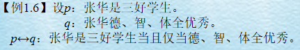

### 1.2 命题公式与翻译

命题公式：把命题常量，命题变量按照一定的逻辑顺序用命题联结词连接起来就构成了命题演算的合式公式，也叫命题公式。

当使用联结词集 { ¬，∧，∨，→，↔ }时，合式公式定义如下：

定义 1.2.1：按下列规则构成的符号串称为命题演算的合式公式，也称为命题公式，简称公式。

* （1）单个命题变元和常元是合式公式。
* （2）如果 A 是合式公式，那么 ¬ A 是合式公式。
* （3）如果 A 和 B 是合式公式，那么 ( A ∧ B )、( A ∨ B )、( A → B ) 和 ( A ↔ B ) 是合式公式。
* （4）当且仅当有限次地应用了（1）、（2）、（3）所得到的符号串是合式公式。

命题公式一般的用大写的英文字母 A，B，C，… 表示。
依照这个定义，下列符号串是合式公式：

* ¬ ( p ∨ q )，¬ ( p ∧ q )，( p → ( p ∨ ¬ q ) )，
*  ( ( ( p → q ) ∧ ( q → r ) ) ↔ ( s ↔ t ) )

下列符号串不是合式公式：

* ( p → q ) → ( ∧ q )，
* ( p → q，( p ∧ q ) → q )

归纳定义 1.2.2：给出合式公式定义的方法称为归纳定义，它包括三部分：基础，归纳和界限。

定义 1.2.1 中的（1）是基础，（2）和（3）是归纳，（4）是界限。下文中还将多次出现这种形式的定义。

为方便起见，对命题公式约定如下：

* （1）最外层括号可以省略。
* （2）规定联结词的优先级由高到低依次为 ¬，∧，∨，→，↔。按此优先级别，如果去掉括号，不改变原公式运算次序，也可以省掉这些括号。

一般地说，命题公式中包含命题变元，因而无法计算其真值，所以不是命题。命题公式中的命题变元，也叫命题公式的分量。

有了命题公式的概念，就可以用命题公式表示复合命题，常将这个过程称为命题的符号化。命题的符号化可按如下步骤进行：

* （1）找出复合命题中的原子命题。
* （2）用小写的英文字母或带下标的小写的英文字母表示这些原子命题。
* （3）使用命题联结词将这些小写的英文字母或带下标的小写的英文字母连接起来。

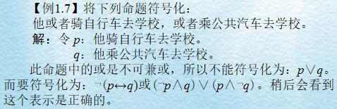

### 1.3 真值表和等价公式

#### 1.3.1 命题公式的真值表

定义 1.3.1：设 pl，p2，…，pn 是出现在公式 A 中的全部命题变元，给 pl，p2，…，pn 各指定一个真值，称为对公式 A 的一个赋值或解释。若指定的赋值使 A 的真值为 T，则称这个赋值为 A 的成真赋值，若使 A 的真值为 F，则称这个赋值为 A 的成假赋值。

例如，给公式 ( p ∨ q → r ) 赋值 011 是指 p = 0，q = 1，r = 1，它是该公式的成真赋值；赋值 110 是指 p = 1，q = 1，r = 0，它是该公式的成假赋值。 

定义 1.3.2：在命题公式 A 中，对 A 的每一个赋值，就确定了 A 的一个真值，把它们汇列成表，称该表为命题公式 A 的真值表。 

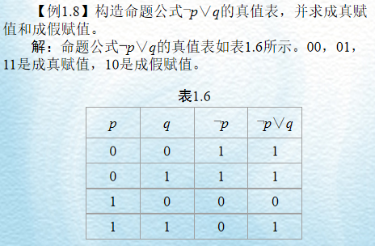

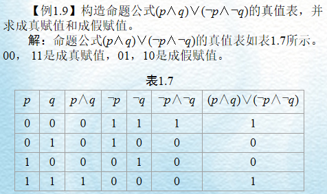

#### 1.3.2 命题公式的等价

定义 1.3.3：设 A 和 B 是两个命题公式，对 A 和 B 的任一赋值，A 和 B 的真值都相同，则称 A 和 B 是等价的或逻辑相等的，记为 A ⇔ B

可以证明，命题公式等价有下面的三条性质：

* （1）自反性，即对任意命题公式 A， A ⇔ A 
* （2）对称性，即对任意命题公式 A 和 B，若 A ⇔ B，则 B ⇔ A
* （3）传递性，即对任意命题公式 A，B 和 C，若 A ⇔ B，B ⇔ C，则 A ⇔ C

根据定义 1.3.3，可以用真值表证明命题公式是等价的，请看下面的例题。

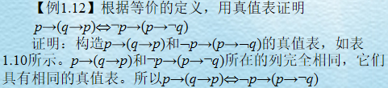

证明等价的另外一种方法叫做等价演算法，其基本思想是：先用真值表证明一组基本等价式，以它们为基础进行公式之间的演算。基本等价式常叫命题定律。下面是常用的命题定律：

* 双重否定律：A ⇔ ¬ ¬ A
* 交换律：A ∨ B ⇔ B ∨ A，A∧ B ⇔ B ∧ A
* 结合律： ( A ∨ B ) ∨ C ⇔ A ∨ ( B ∨ C )，( A ∧ B ) ∧ C ⇔ A ∧ ( B ∧ C )
* 分配律：A ∧ ( B ∨ C ) ⇔ ( A ∧ B ) ∨ ( A ∧ C )，A ∨ ( B ∧ C ) ⇔ ( A ∨ B ) ∧ ( A ∨ C )
* 德摩根律：¬ ( A ∨ B ) ⇔ ¬ A ∧ ¬ B，¬ ( A ∧ B ) ⇔ ¬ A ∨ ¬ B
* 幂等律：A ∧ A ⇔ A，A ∨ A ⇔ A
* 吸收律：A ∨ ( A ∧ B ) ⇔ A，A ∧ ( A ∨ B ) ⇔ A
* 零律：A ∨ 1 ⇔ 1，A ∧ 0 ⇔ 0
* 同一律：A ∨ 0 ⇔ A，A ∧ 1 ⇔ A
* 排中律：A ∨ ¬ A ⇔ 1
* 矛盾律：A ∧ ¬ A ⇔ 0
* 条件等价式：A → B ⇔ ¬ A ∨ B 
* 双条件等价式：A ↔ B ⇔ ( A → B ) ∧ ( B → A )
* 假言易位式：A → B ⇔ ¬ B → ¬ A
* 双条件否定等价式：A ↔ B ⇔ ¬ A ↔ ¬B

以上共 23 个等价式，原则上说，这些公式都可以用真值表证明。下面仅验证德摩根律。 

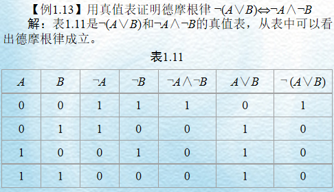

定义 1.3.4：如果 X 是合式公式 A 的一部分且 X 本身也是合式公式，则称 X 为公式 A 的子公式。
例如，A ⇔ q → ( p ∨ ( p ∧ q ) )，X ⇔ p ∧ q，则 X 是 A 的子公式。

定理 1.3.1：设 X 是合式公式 A 的子公式，若 X ⇔ Y，如果将 A 中的 X 用 Y 来置换，得到的公式记为 B，则 B 与 A 等价，即 A ⇔ B 
证明：对 A、B 的任一赋值，X 与 Y 的真值相同，而 A、B 的其它部分完全相同，公式 B 与公式 A 的真值必相同，A ⇔ B，满足此定理的置换叫做等价置换。

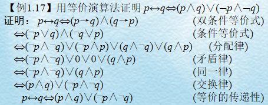

### 1.4 重言式

定义 1.4.1：设 A 是任一命题公式。

* （1）若对 A 的任意赋值，其真值永为真，则称命题公式 A 为重言式或永真式。
* （2）若对 A 的任意赋值，其真值永为假，则称命题公式 A 为矛盾式或永假式。
* （3）若 A 不是矛盾式，则称命题公式 A 为可满足的。

由定义 1.4.1 可以看出，任何重言式都是可满足的。显然，重言式的真值表的最后一列全为 1，矛盾式的真值表的最后一列全为 0，可满足的公式真值表的最后一列至少有一个 1。根据这个结论借助于真值表可以判断一个公式是否为重言式，矛盾式或可满足的。当然也可以用等价演算法判断公式的类型。

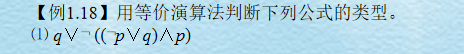

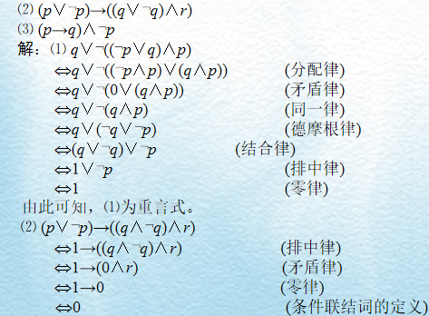

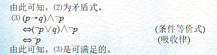

定理 1.4.1：任何两个重言式的合取或析取都是重言式。
证明：设 A、B 是重言式，对 A 和 B 的任何赋值，总有 A 为 1，B 为 1，所以  A ∧ B ⇔ 1，A ∨ B ⇔ 1，故 A ∧ B 和 A ∨ B 都是重言式。

推论：任何两个矛盾式的合取或析取是矛盾式。

定理 1.4.2：一个重言式，对同一分量出现的每一处都用同一合式公式置换，其结果仍是重言式。

推论：一个矛盾式，对同一分量出现的每一处都用同一合式公式置换，其结果仍是矛盾式。

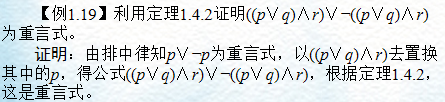

定理 1.4.3：设 A、B 为两个命题公式，A ⇔ B 当且仅当 A↔B 是重言式。

证明：设 A ⇔ B，下证 A ↔ B 是重言式。

给 A，B 的任何赋值，因为 A ⇔ B，所以 A，B 具有相同的真值，由双条件联结词的定义知 A ↔ B 为真，所以 A ↔ B 为重言式。
设 A ↔ B 为重言式，下证 A ⇔ B
给 A，B 的任何赋值，因为 A ↔ B 为重言式，故 A，B 的真值相同，由命题公式等价的定义知 A ⇔ B

### 1.5 范式

#### 1.5.1 析取范式与合取范式

定义 1.5.1：由一些命题变元或其否定构成的析取式称为基本和，也叫简单析取式。约定单个变元或其否定是基本和。

例如，¬ p ∨ q、p ∨ ¬ q、p ∨ q、¬ q、¬ p、q 都是基本和。 

定义 1.5.2：由一些命题变元或其否定构成的合取式称为基本积，也叫简单合取式。约定单个变元或其否定是基本积。

例如，¬ p ∧ q、p ∧ ¬ q、p ∧ q、¬ p、¬q、p 都是基本积。 

定义 1.5.3：由基本和的合取构成的公式叫做合取范式。约定单个基本和是合取范式。

定义 1.5.4：由基本积的析取构成的公式叫做析取范式。约定单个基本积是析取范式。

任何命题公式都可以化成与其等价的析取范式或合取范式。求析取范式和合取范式的步骤如下：

* 消去联结词“→”和“↔”
* 利用双重否定律消去否定联结词“¬”或利用德摩根律将否定联结词“¬”移到各命题变元前( ¬ 内移)。
* 利用分配律，结合律将公式归约为合取范式和析取范式。

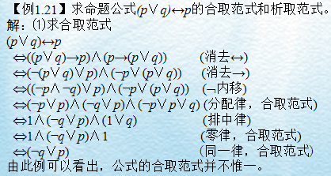

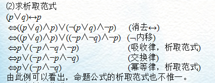

#### 1.5.2 主析取范式

由于析取范式和合取范式不惟一，所以使用起来很不方便。为此，引入主析取范式和主合取范式的概念。当命题变元的顺序约定以后，主析取范式和主合取范式是惟一的。

析取范式和合取范式的基本成分是基本积和基本和，而主析取范式和主合取范式的基本成分是极小项和极大项，它们分别是特殊的基本积和基本和。     

