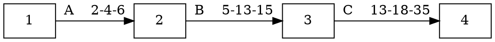

# CPM (Critical Path Method) 关键路径法
存在很强的依赖关系（主要是FS依赖关系）
## 概念
对于一个项目而言，只有项目网络中最长的或耗时最多的活动完成之后，项目才能结束，这条最长的活动路线就叫关键路径。组成关键路径的活动称为**关键活动**。

**关键路径上的活动持续时间决定了项目的工期**，关键路径上所有活动的持续时间总和就是项目的工期。

**关键路径上的任何一个活动都是关键活动**，其中任何一个活动的延迟都会导致整个项目完工时间的延迟。

## 做法
1. 用有方向的线段标出各结点的紧前活动和紧后活动的关系，使之成为一个有方向的网络图；
2. 用正推法和逆推法计算出各个活动的最早开始时间，最晚开始时间，最早完工时间和最迟完工时间，并计算出各个活动的自由时差；
3. 找出所有时差为零的活动所组成的路线，即为关键路径；
4. 识别出准关键路径，为网络优化提供约束条件；
## 算法
* **活动最早开始时间**=指向它的所有前置活动的最早结束时间中的最大值
              EF=ES+T（作业时间）**沿网络前通法来计算**
* **活动最迟结束时间**=它指向的所有后续活动的最迟开时间中的最小值
      LS=LF-T（作业时间） **沿网络倒序朝前法来计算**
* **松闲时间（总时差）**=LS-ES（LF-EF）
最早与最迟日期两者之间正的差值叫做“总时差”。关键路线有零或负值总时差
* **浮动时间（自由时差）**：
 没有延误任何后续活动的最早开始日期情况下，活动可以被推迟的时间
* **自由时差=0 的路径为关键路径**

## 例子

**关键路径活动为：A-B-F-G-H
关键路径时间为235天**
## 关键路径的其他信息
* 如果关键路径中的一个活动延迟了,就要采取正确措施来处理,否则整个项目进度计划将被推迟
* 常使人迷惑的地方
    * 关键路径并不包含所有重要的活动，它只是考虑时间问题
    * 如果有两个或两个以上关键路径一样,就可能有多个关键路径
    * 关键路径可随项目的进展而改变

# PERT (计划评审技术)（三点估算法）
PERT主要应用于对单个活动的时间进行估计
PERT对于每一种活动都采用三种估算
1. 乐观时间
2. 悲观时间
3. 最可能的时间

每种活动的时间取决于加权值
## 算法
**每个活动的期望工期=（乐观值+4最可能值+悲观值）/6**
$T_{e}=(O+4M+P)/6$

**每个活动工期的方差（$\sigma^{2}$)=$((悲观值-乐观值)/6)^{2}$**

**每个活动工期的标准差$(\sigma)=\sqrt{每个活动工期方差}$**

项目期望工期为PDM图中关键路径上的所有活动期望工期之和，并且期望工期总概率分布为一个正态分布，
即：
项目期望工期平均值 =关键路径上各项活动期望工期之和       
项目期望工期方差  =关键路径上各项活动方差之和

## 例子
假定每项工期的概率分布如图:

### 1. 期望工期的计算：
项目总期望工期36天
活动A 期望工期=      （2+4\*4+6 ）/6=4
活动B 期望工期=   （5+4\*13+15）/6=12
活动C 期望工期= （13+4\*18+35）/6=20
SUM = 36
### 2. 方差计算
$\sigma^{2}_{A}=(\frac{6-2}{6})^{2}=0.444$

$\sigma^{2}_{B}=(\frac{15-5}{6})^{2}=2.778$

$\sigma^{2}_{C}=(\frac{35-13}{6})^{2}=13.444$

$总方差=0.444+2.778+13.444 = 16.6666$
### 3. 标准差
项目工期的标准差：

$\sigma=\sqrt{\sigma^{2}}=\sqrt{16.666}=4.08$

# 项目成本估算控制
## 挣值分析相关的术语
### PV（计划工作量的预算费用）
* PV=计划工作量X预算金额
* PV主要反映进度计划用费用值表示的应当完成的工作量，而不是反映消耗的成本（工时，费用）
例如：某项目打算安装一台WEB接入服务器，预计硬件、软件、安装等工作计划用一周时间完成，购买软硬件及请人安装等的成本预算，批准了3万元。即这一周的计划工作量预算费用就是3万元

### AC（已完成工作量的实际费用）
* 指项目实施过程中，实际完成的工作量所消耗的工时（或费用）
* 反映的是项目在给定的时间内，某阶段实际某活动所发生的实际消耗
* 即完成挣值所发生的成本
* 例如：上例中，最后实际用了两周时间，完成了服务器的购买和安装。在第一周花2.5万购买了服务器，在第二周花了0.5万完成了安装，则
第一周结束时，AC=2.5万元
第二周结束时，AC=0.5万元

### EV（已完成工作量的预算成本）
* 即实际完成的工作
* 用费用值来表示完成的工作量
* EV=已完成的工作量x预算定额
* 例如：上例中，第一周购买了服务器和软件，是完成总计划工作的70%，计划成本是3万元，则
第一周的挣值是EV=70%X3万元=2.1万元
即在第一周挣得了2.1万元

## 两个差异
### 成本偏差
* CV=EV-AC（挣值-实际成本）
* CV为负值时，表示执行效果不佳，即实际人工超过预算值，即超支
* CV为正值时，表示有节余
* CV=0，符合进度和计划	
### 进度偏差
* SV=EV-PV（挣值-计划成本）
* SV为负值时，表示进度落后
* SV为正值时，表示进度提前
* SV=0，表示实际与计划进度一致
## 两个绩效指数
* 成本绩效指数 CPI =EV/AC (>1好)
* 进度绩效指数 SPI=EV/PV（>1好）
### 例子
PV    |EV   |AC
------|-----|---
1000  |800  |900
* CPI=800/900=0.89
意味着：每花1元产生的工作价值是0.89元
* SPI=800/1000=0.8
意味着：实际进度是计划进度的80%
## 挣值曲线

## 两个完成指数
* 任务完成指数（PC）=EV/BAC
* 成本消耗指数（PS）=AC/BAC
## 完成时的估算EAC
* 当前情况下，完成项目的总费用
* 根据目前的进展状况来预测项目完成时的总成本
* 三种方法
    * EAC=BAC/CPI
    * EAC=AC+（BAC-EV）实际费用+（总预算成本BAC-EV）
    * EAC=AC+ETC
## 完工尚需估算
* ETC=EAC-AC（或BAC-EAC）

# 管理术语

**PV[Planned Value]计划值**：应该完成多少工作？

**EV[Earned Value]挣值**：完成了多少预算工作？

**AC[Actual Cost]实际成本**:完成工作的实际成本是多少？

**BAC[Budget cost at completion]完工预算**：全部工作的预算是多少？不改变成本基准，BAC就不会发生变化

**EAC[Estimate at completion]完成预估**：全部工作的成本是多少？是根据项目的绩效和风险量化对项目最可能的总成本所做的一种预测。

**ETC 完工尚需估算**：剩余工作在当前的估算是多少？

**CPI 成本绩效指数：CPI=EV/AC&nbsp;&nbsp;&nbsp;&nbsp;&nbsp;&nbsp;&nbsp;&nbsp;&nbsp;&nbsp;&nbsp;&nbsp;&nbsp;&nbsp;&nbsp;&nbsp;&nbsp;_CPI&gt;1代表工作价值高，好_**

**SPI 进度绩效指数：SPI=EV/PV&nbsp;&nbsp;&nbsp;&nbsp;&nbsp;&nbsp;&nbsp;&nbsp;&nbsp;&nbsp;&nbsp;&nbsp;&nbsp;&nbsp;&nbsp;&nbsp;&nbsp;_SPI&gt;1代表实际进度快，好_**

**PC 任务完成指数：PC=EV/BA**

**CV 成本差异：CV=EV-AC&nbsp;&nbsp;&nbsp;&nbsp;&nbsp;&nbsp;&nbsp;&nbsp;&nbsp;&nbsp;&nbsp;&nbsp;&nbsp;&nbsp;&nbsp;&nbsp;&nbsp;_CV&gt;0代表成本节约，好_**

**成本差异比例%=CV/EV=(EV-AC)/EV=1-1/CPI**

**SV 进度差异：SV=EV-PV&nbsp;&nbsp;&nbsp;&nbsp;&nbsp;&nbsp;&nbsp;&nbsp;&nbsp;&nbsp;&nbsp;&nbsp;&nbsp;&nbsp;&nbsp;&nbsp;&nbsp;_SV&gt;0代表进度提前，好_**

**成本差异比例%=SV/PV=(EV-PV)/PV=SPI-1**

EAC=BAC+AC-EV=BAC-CV

EAC=BAC/CPI

EAC=ETC+AC

**其他用词：**

**BCWS[Budgeted Cost of Worked Scheduled]：计划完成工作的预算费用**

**BCWP[Budgeted Cost of Work Performed]**：实际完成工作的预算成本或已完成工作的预算成本[**只关心项目实际完成量，不关心项目进度**]

如果一个工程任务一的预算是100元，完成了40%，那你的BCWP就是100*40%，等于40.

**ACWP[Actual Cost of Work Performed]**：完成工作的实际成本

## 举例

**BCWP**：如果一个项目任务一的预算是500元，完成了30%，那BCWP=500*30%=150；
**BCWS**：而BCWS是指你的预算是多少，和你完成的量无关，只和时间有关系。比如第二个任务分3天完成，每天完成100，从工程的第4天开始。设第5天BCWP完成20%，那么计算前5天的BCWP就是（100+100+100）*20%=60，BCWS就是100.

# 软件项目工作量和进度估算
## 进度估算
### 项目进度表
* 供货计划、硬件计划、软件开发计划、项目管理计划
### 每项任务的估算时间
* 任务分解责任人确定
* 估算任务单元的可支配时间
* 考虑任务估算的制约和影响因素
   * 时间
   * 资源
* 对任务单元进行计划安排

# 项目风险管理概念
## 所有软件项目共通的风险
* 进度安排的先天错误
* 需求的膨胀（变更）
* 人员流失
* 合同解除
* 低生产率
* 市场定位
* 技术方案不足
* 管理

### 风险分类
#### 按未知性分类
* 已知-未知风险
    * 已知:风险名称
    * 未知:发生的时机、发生的概率、影响程度
* 未知-未知风险
    * 无法想象
#### 其他分类法
* 内部风险、外部风险
* 技术风险、管理风险、质量风险
* 直接风险、间接风险
* 社会、政治、法律风险、自然及不可抗力风险

### 风险的组织内外属性
#### 组织外部的不确定性
* 来自于客户、外部社会、政治经济、技术的环境
* 组织内无法控制且必须要接受的
* 产生原因
    * 目标不确定性
    * 需求不确定
    * 项目的外部利益相关都有的影响和作用不确定
    * 自然、经济、政治、法律、技术等环境的不确定性
#### 组织内部的不确定性
* 体现在施加项目的行为和后果的不确定性
* 可能是受到外部影响而产生的
* 可能是组织自身的因素构成的
* 可以在一定程度上控制，主观上可以避免的
* 产生原因
    * 目标不确定性
    * 变更不确定性
    * 管理不确定性
    * 技术不确定性
### 风险一般属性
* 普遍性
* 随机性
* 相对性
* 可变性
* 可管理性

## 防范风险的重要性
* 既然项目风险确实是不可避免的，组织就必须了解风险来源、性质和发生规律，通过有组织、计划的、有效的项目管理活动，抓住机会风险的机会并导致成功。
* 如果把风险防范和风险管理，看成是实质上类似于一种“保险”的活动，我们就会以一种比较平和的心态，来面对风险。投资当然需要成本，成本因素取决于项目的性质、规模、企业的经验和资源，也取决于项目的风险管理，包括风险的识别、规避、控制等。

## 风险管理的目的
1. 试图系统化地瓦解不确定因素对项目计划（质量、预算、进度、资源分配等）的威胁
2. 通过风险的管理变被动的面对风险，即消防状态为主动面对风险
3. 知道什么是紧急事件，让我们能够依据FIRST  THING FIRST 的原则处理紧急事件

## 风险管理的思路
* 不论主观因素还是客观原因
* 风险 = 损失×可能性
* 所以，风险管理（识别、分析、评估、应对风险）的基本思路，也可以从风险发生的概率（可能性）和危害的影响（损失）二个方面着手。

## 风险管理过程是一个反复迭代的过程

## PMBOK的风险管理过程
**利用科学的方法去识别风险、评价风险并设计、实施有效的方法去控制风险的过程，就是风险管理过程。**
1. 风险计划编制：决定如何采取和计划一个项目的风险管理活动。
2. 风险识别：确认哪些风险有可能会影响项目，并把这些风险的特性整理成文档。
3. 风险定性分析：对项目风险和条件进行定性分析，将它们对项目可能产生的影响进行排序。
4. 风险定量分析：测量风险出现的概率和结果，并评估它们对项目的影响。
5. 风险应对计划编制：开发和制定一些程序和技术手段，用来提高实现项目目标的机会和减少风险对项目的目标的威胁。
6. 风险监控：在项目的整个生命周期中，监视残余风险、识别新风险，执行降低风险计划，以及评价这些工作的有效性。 

## 风险管理过程

## 风险管理的关键指标
* 风险事件
    * 可能对项目带来正面或负面影响的离散事件
    * 意味着机会或威胁
* 风险概率
    * 一种未知的状态
    * 风险发生的可能性，即概率
* 风险量
    * 风险的影响程度
* 预期值
    * 量化的风险影响的评估指数
    * EVM=风险概率X风险量
* 权变措施
    * 对负面风险事件的一种反应
    * 与应急计划不同之处在于，权变措施没有在风险事件之前计划

## 风险管理与项目管理的关系
* 整体管理
* 需求范围管理
    * 需求变更和控制不当，是项目风险的一个重大风险
    * 变更时，分析和评估，界定范围，控制在可接受的范围
* 时间管理
    * 风险管理的结果是时间管理的依据
    * 不确定因素的分析和预测，是时间计划可行性和准确性的依据
* 成本管理
    * 风险需要成本及相应储备
    * 应急储备：已知-未知风险
    * 管理储备：未知-未知风险

## 项目风险管理计划方案
### 风险计划
* 是项目计划的一部分
* 风险管理计划
    * 是一个总体性、根本性、综全性的计划，是决定和规划对一个项目进行风险管理活动的过程
    * 是对不同类别风险的应对
    * 方法：定义风险管理的方法，工具，技术和数据来源
    * 岗位和职责：明确具体风险应对行动的责任人和职责
    * 时间：定义在整个项目生命周期内实施风险管理过程的频率
    * 承受程度：风险承受的限度标准
    * 报告格式：定义风险应对计划的格式和内容
    * 追踪方法：
        * 风险是如何识别的
        * 风险是如何测量的
        * 应对措施是如何制定的
        * 风险是如何监测的
* 风险应对计划
    * 是对某一具体风险的应对措施

## 项目风险识别
### 风险识别内容
* 确定何种风险事件可能影响项目，并识别哪些是可能影响项目进展的暴* 露的和潜在的风险
* 对识别出的风险，描述它们的特性并记录下来
* 严格地说，风险仅仅指遭受创作和损失的可能性
* 对软件项目而言，风险识别还牵涉机会选择（积极成本）和不利因素威胁（消极结果）
### 风险识别过程中需确定的因素
* 风险可能的因素
* 可能的风险事件
* 风险征兆
* 三者之间是相互联系的
### 风险识别过程
* 是一个多次重复的迭代过程
* 输入
    * 风险管理计划
    * 项目计划的输出
        *项目章程、ＷＢＳ、产品描述、进度计划和成本估算、资源计划、采购计划、假设和约束条件
* 风险分类
* 历史资料
    * 项目档案
    * 公开发布的资料
#### 工具和技术
* 文件审核
    *整体计划审核
    * 详细计划审核
* 信息收集手段：头脑风暴，德菲尔技术，访谈法，ＳＷＯＴ（实力、弱点、机会、威胁）分析法
* 核对表
    * 根据风险要素编写
    * 应用领域广泛应用的分类图表作为风险原始资料的一部分
* 假设分析
    * 对项目的假设进行有效性分析
    * 找出不完整、不连贯、不准确的地方就是风险
* 图解技术--鱼刺图
    * 又称因果图
    * 质量管理中应用技术
    * 帮助把问题回溯到发生问题的最基本部位，找到根本原因帮助项目组理解风险的缘由和影响

* 图解技术-系统或过程流程图
    * 帮助团队预测可能发生哪些风险，哪些环节发生
    * 因而有助于使解决问题的手段更高明

#### 输出
* 风险
    * 风险因素:一系列可能影响项目向好或坏的方向发展的风险事件的总和
    * 一般的风险因素包括:
        1. 需求变化；
        2. 设计遗漏、错误和理解错误；
        3. 狭隘定义或理解角色和责任；
        4. 不充分估计的工作量；
        5. 不胜任的技术人员
    * 风险因素描述包括:
        1. 由一个因素产生的风险事件发生的可能
        2. 可能的结果范围；
        3. 预期发生的时间；
        4. 一个风险因素所产生的风险事件的发生概率。
    * 风险事件:潜在风险事件是指如自然灾害或团队特殊人员出走等能影响项目的不连续事件,对潜在风险的描述应包括
        1. 风险事件发生的可能性
        2. 可选择的可能结果
        3. 事件发生的时间
        4. 发生频率的估计

* 触发器
    * 也叫风险征兆，是一种实际风险事件的间接显示
* 对其他过程的输入
    * 风险识别可作为对另一个相关领域的输入，决定是否采取进一步的风险控制动作
#### 风险识别过程的特点
##### 关注过程
* 依靠风险核对表、阶段评审、过程审查等手段实现
##### 关注控制
* 按风险点，用需求管理、质量管理、配置管理工具等，进行全程跟踪的方法和控制来实现风险管理
##### 制定软件风险识别检查表
* 根据风险概率及影响进行综合分析
* 策略
    * 高影响但低概率的风险因素不应当占用太多风险管理时间
    * 中到高的概率、高影响的风险及高概率低影响的概率应该进行风险分析和处理
### 软件项目的主要风险
项目规模风险
需求风险
外部因素风险
管理风险
技术风险
### 风险识别结果的整理
根据风险点，导出风险识别表
根据风险事件，对风险进行分类
根据风险将要发生的症状，描述风险触发点
根据项目的具体情况将项目实施的假设条件作为风险列入风险清单
根据风险识别阶段的结果，提出各阶段工作的改进要求。
### 风险定性分析定义
评估已识别风险的影响和概率的过程
根据他们对项目目标的影响按顺序排列
以明确特定风险和指导风险应对
### 风险的等级模式
#### 评估风险的影响
* 风险影响受风险的性质、范围和持续时间这三个因素制约
#### 评估风险概率
* 按权重确定风险等级
* 在风险程度等级中选择
* 采用经验标准
    * 规模风险度=（代码改变量/规模复杂度）X测试完成级别X系统可测试性
    * 代码改变量：新增代码行+更改代码行数+删除代码行
    * 规模复杂度：代码的行数或参与的人员数，行数或人员数增加，风险系数加大
    * 测试完成级别：是否同时作回归测试，如果不作，则风险系统增大
    * 系统可测试性：问题可再现程度
#### 风险评估值的判断
* 同一个项目在不同时期、相同的分析因素和分析标准下的得分变化，反映了风险状态
* 风险检查表的严重项是风险触发器的报警
* 风险值越高，风险越大
#### 项目的风险排序表
* 根据概率及影响进行排序
* 项目经理依据已经排序的表，并定义一条控制线，过线的风险会得到进一步关注，线下的风险需要再评估以完成二次排序

## 项目风险定量分析
### 风险定量分析目标
* 量化分析每一风险的概率及对项目目标造成的影响，分析项目整体风险的程度，以便
    * 测定达到某一特定项目目标的概率
    * 量化项目的风险，决定可能需要的成本和进度应急储备的数量
    * 通过量化各风险对项目的相对影响，确定最需要关注的风险
    * 找出现实的和可实现的成本、进度及工作范围目标
### 风险量化分析的工具和方法
#### 访谈
* 专家判断最先采用
* 风险事件被分为高、中、低三种概率
####敏感度分析
* 确定哪些风险对项目的潜在影响最大
* 当所有其他不确定因素被子控制在基线值时，敏感性分析可检查每个项目要素的不确定性对所检查目标的影响程度
### 风险定量分析工具
#### 交汇点法
* 单代号图网络图中，任何路线都会出现进度交汇点
* 交汇点处每个工程延期，都会造成工期延期
* 根据完成时间概率计算方法计算每个任务的概率
* 风险的总概率为交汇点各个工程完成概率的乘积

#### 决策树法：
决策树是一种便于决策者理解的，来说明不同决策之间和相关偶发事件之间的相互作用的图表。决策树的分支或代表决策（用方格表示）或代表偶发事件（用圆圈表示），如下图系一个典型的决策树图。

EMV:预期货币价值

## 项目风险应对计划
### 项目风险应对计划概述
风险应对计划编制是一个开发方案和制定措施的过程
目的是为了提升实现项目目标的机会、降低对项目目标的威胁
### 项目风险对策
#### 规避
* 通过消除风险的成因或产生风险的条件，或保护项目的目标不受风险的影响
* 减小范围以避免高风险活动，增加时间或资源，采用熟悉的方法而不使用创新的方法，可避免使用不熟悉的分包商
#### 转移
* 把风险的后果与应对措施的所有权一起转移给第三方
* 如保险、担保和保证。签定合约是转移职责的常用方法
#### 减轻
使用成熟技术来降低成本或进度风险
通过降低风险事件的概率，减少风险对项目的实际损失
拿风险的投入换取风险的损失
如设备的备份，人员的储备
#### 接受
主动方法：应急计划
被动方法：接受较低利润
最常见的接受措施是：为了应对已知的风险，建立一项应急补助或储备，包括一定量的时间、资金或其他资源。
如，容灾系统，向用户支出违约金
### 项目风险应对措施
* 外包
* 预防性计划
* 替代战略
* 投保
### 风险管理计划与应对计划
#### 建立风险管理计划
* 针对整个项目过程中可能出现的风险，描述了相应的管理程序、措施、责任、资源
* 计划中明确
    * 风险对项目目标的影响
    * 项目存在的具体风险
    * 风险如何被减轻，减轻的方法是什么，需要的资源是多少，如何保障
    * 负责实施风险管理计划的责任人
#### 建立全过程风险控制机制
在项目计划和项目进度中，标识出可能的风险
建立项目需求定义过程中，标识出需求不确定或不足的风险，并建立补救措施计划
在最初发布的版本中，标识出缺陷风险
当风险逐渐显著并需要被跟踪时，应在定期工作报告中加入风险跟踪表，以便于跟踪
每次评审后，项目经理要修正风险级别
#### 风险应对计划
是一种在识别的风险事件发生时，将采取的事先拟定好的行动
是风险管理计划的一部分

### 项目风险的跟踪与控制
#### 一般意义下的风险监控的依据
* 风险管理计划
* 风险应对计划
* 项目沟通
* 附加风险识别和分析
* 范围变更
#### 软件项目的风险监控依据
* 可以从一般项目监控规律中得到依据
* 项目关键点的项目表现评估
* 项目过程中的沟通与交流
* 项目阶段评审
#### 风险管理的原理
* 不断地识别新的风险
* 不断地分析风险产生的概率
* 不断整理风险表
* 不断的规避优先级别最高的风险
#### 风险跟踪与控制的工具与方法
* 项目风险应对审计
* 定期项目风险审核
* 挣值分析
* 技术执行情况测量
* 附加风险应对计划编制
#### 软件项目风险跟踪重点关注：
* 有软件开发全过程的文件记录
* 建立一套系统化的风险管理过程来识别、分析、评估、监视、应对、控制、记录并沟通风险
* 可靠、准确的历史数据
* 争取高级管理层的更多支持
#### 风险跟踪与控制的结果
* 权变措施
    * 为了应对那些出现的，先前又未曾识别或接受的风险而采取的未经计划的应对行为
* 纠正措施
    * 包括应急计划和权变措施
* 项目变更申请
* 风险应对计划输出
* 风险数据库
* 风险识别检查表更新

1. 不断的识别新的风险
2. 不断的分析风险的产生概率
3. 不断的整理风险表
4. 不断的规避优先级别最高的风险

**直到风险消亡**

# SWOT分析法
从整体上看，SWOT可以分为两部分：第一部分为SW，主要用来分析内部条件；第二部分为OT，主要用来分析外部条件。利用这种方法可以从中找出对自己有利的、值得发扬的因素，以及对自己不利的、要避开的东西，发现存在的问题，找出解决办法，并明确以后的发展方向。根据这个分析，可以将问题按轻重缓急分类，明确哪些是急需解决的问题，哪些是可以稍微拖后一点儿的事情，哪些属于战略目标上的障碍，哪些属于战术上的问题，并将这些研究对象列举出来，依照矩阵形式排列，然后用系统分析的所想，把各种因素相互匹配起来加以分析，从中得出一系列相应的结论而结论通常带有一定的决策性，有利于领导者和管理者做出较正确的决策和规划。

## 分析环境因素
运用各种调查研究方法，分析出公司所处的各种环境因素，即外部环境因素和内部能力因素。外部环境因素包括机会因素和威胁因素，它们是外部环境对公司的发展直接有影响的有利和不利因素，属于客观因素，内部环境因素包括优势因素和弱点因素，它们是公司在其发展中自身存在的积极和消极因素，属主观因素，在调查分析这些因素时，不仅要考虑到历史与现状，而且更要考虑未来发展问题。
优势，是组织机构的内部因素，具体包括：有利的竞争态势；充足的财政来源；良好的企业形象；技术力量；规模经济；产品质量；市场份额；成本优势；广告攻势等。
swot分析模型

劣势，也是组织机构的内部因素，具体包括：设备老化；管理混乱；缺少关键技术；研究开发落后；资金短缺；经营不善；产品积压；竞争力差等。
机会，是组织机构的外部因素，具体包括：新产品；新市场；新需求；外国市场壁垒解除；竞争对手失误等。
威胁，也是组织机构的外部因素，具体包括：新的竞争对手；替代产品增多；市场紧缩；行业政策变化；经济衰退；客户偏好改变；突发事件等。
SWOT方法的优点在于考虑问题全面，是一种系统思维，而且可以把对问题的“诊断”和“开处方”紧密结合在一起，条理清楚，便于检验。
## 构造SWOT矩阵
将调查得出的各种因素根据轻重缓急或影响程度等排序方式，构造SWOT矩阵。在此过程中，将那些对公司发展有直接的、重要的、大量的、迫切的、久远的影响因素优先排列出来，而将那些间接的、次要的、少许的、不急的、短暂的影响因素排列在后面。
## 制定行动计划
在完成环境因素分析和SWOT矩阵的构造后，便可以制定出相应的行动计划。制定计划的基本思路是：发挥优势因素，克服弱点因素，利用机会因素，化解威胁因素；考虑过去，立足当前，着眼未来。运用系统分析的综合分析方法，将排列与考虑的各种环境因素相互匹配起来加以组合，得出一系列公司未来发展的可选择对策。

# PDCA
### P.D.C.A.的定义

P.D.C.A.即Plan(计划)、Do(实施)、Check(查核)、Action(处置)，是从事持续改进（改善）所应遵行的基本步骤。

1. 计划：是指建立改善的目标及行动方案。

2. 实施：又称执行，是指依照计划推行。

3. 查核：指确认是否依计划的进度在实行，以及是否达成预定的计划。

4. 处置：指新作业程序的实施及标准化，以防止原来的问题再次发生。(或设定新的改进目标)。

P.D.C.A.不断地旋转循环，一旦达成改善的目标，改善后的现状，便随即成为下一个改善的目标。P.D.C.A.的意义就是永远不满足现状，因为员工通常较喜欢停留在现状，而不会主动去改善。所以管理者必须持续不断地设定新的挑战目标，以带动P.D.C.A.循环。 

# CMMI概念模型
## Capability Maturity Model Integration (能力成熟度模型综合)
Include:
* System engineering
* Software engineering
* Integrated Product and Process Development
* Supplier Sourcing
## CMMI
* CMMI is committed to the software development process management and engineering capabilities and assessment
* Divided into five Level: the initial level, management level, has been defined level, quantitative, optimization level
* CMMI presentation
    * Stage
    * Continuous
## 五级
1、初始级：软件过程是无序的，有时甚至是混乱的，对过程几乎没有定义，成功取决于个人努力。管理是反应式的。
2、可管理级：建立了基本的项目管理过程来跟踪费用、进度和功能特性。制定了必要的过程纪律，能重复早先类似应用项目取得的成功经验。
3、已定义级：已将软件管理和工程两方面的过程文档化、标准化，并综合成该组织的标准软件过程。所有项目均使用经批准、剪裁的标准软件过程来开发和维护软件，软件产品的生产在整个软件过程是可见的。
4、量化管理级：分析对软件过程和产品质量的详细度量数据，对软件过程和产品都有定量的理解与控制。管理有一个作出结论的客观依据，管理能够在定量的范围内预测性能。
5、 优化管理级：过程的量化反馈和先进的新思想、新技术促使过程持续不断改进。
## CMMI vs ISO9000
### Contact
Quality management Standard
Some elements of ISO 9001, CMM can be found at the corresponding part of the total, and some elements are more dispersed corresponding  
### Difference
CMMI was developed specifically for software products and services, while ISO9000 is a much wider range.
CMMI stresses the maturity of the software development process, that process of continuous improvement and enhancement, the only description of ISO9000 quality system can receive the minimum standards 
CMM3 coverage level is greater than the coverage of ISO9000 
## Total Quality Management (TQM)
### Facilitator guide
To provide support and training
Focus on team building and teamwork
Focus on mutual trust and respect
The PDCA management tools into a working habits, to create such an atmosphere, to improve all the processes.

## Concept
* Each level contains a few to a dozen PA 
Process Area
* What is "process area" ？
    * Simply do a thing is one aspect
    * For the corresponding software development is one good aspect of software development 
* If the level of all the PA to meet the requirement, and that the level reached on 
* How to determine the PA to meet the requirement？
    * Each PA contains several goals
    * If the number of targets to meet the requirement, and to meet the requirement that the PA 
* How to determine the Goal to meet the requirement ？
    * Each Goal contains several Practice
    * If the number of targets to meet the requirement, and to meet the requirement that the Practice
## 过程域
除了成熟度等级，CMMI还有一个重要的概念是过程域（Process Area）。过程域指出了达到某个成熟度等级必须要解决的一族问题。除了初始级以外，每个成熟度等级都有若干个过程域，如表5-1所示。由于成熟度等级是循序渐进的，如果想达到某个成熟度等级，例如CMMI 3级，除了满足CMMI 3级本身11过程域之外，还要满足CMMI 2级的7个过程域，依此类推。
### 过程域分类
#### 一、过程管理： 
1． OPD：（Organizational Process Definition）组织级过程定义。建立和维护有用的组织过程资产。 
2． OPF：（Organizational Process Focus）组织级过程焦点。在理解现有过程强项和弱项的基础上计划和实施组织过程改善。 
3． OT：（Organizational Training）组织培训管理。增加组织各级人员的技能和知识，使他们能有效地执行他们的任务。 
#### 二、项目管理： 
4． PP：（Project Plan）项目计划。保证在正确的时间有正确的资源可用。为每个人员分配任务。协调人员。根据实际情况，调整项目。 
5． PMC：（Project Monitoring and Control）项目监督与控制。通过项目的跟踪与监控活动，及时反映项目的进度、费用、风险、规模、关键计算机资源及工作量等情况，通过对跟踪结果的分析，依据跟踪与监控策略采取有效的行动，使项目组能在既定的时间、费用、质量要求等情况下完成项目。 
6．SAM：（Supplier Agreement Management）供应商协议管理。旨在对以正式协定的形式从项目之外的供方采办的产品和服务实施管理。 
7．IPM：（Integrated Project Management）集成项目管理。根据从组织标准过程剪裁而来的集成的、定义的过程对项目和利益相关者的介入进行管理。 
8． RSKM：（Risk Management）风险管理。识别潜在的问题，以便策划应对风险的活动和必要时在整个项目生存周期中实施这些活动，缓解不利的影响，实现目标。 
#### 三、工程管理: 
9．RD：（Requirement Development）需求开发。需求开发的目的在于定义系统的边界和功能、非功能需求，以便涉众(客户、最终用户)和项目组对所开发的内容达成一致。 
10．REQM（Requirement Management）需求管理。需求管理的目的是在客户和软件项目之间就需要满足的需求建立和 维护一致的约定。 
11．TS：（Technical Solution）技术解决方案。在开发。设计和实现满足需求的解决方案。解决方案的设计和实现等都围绕产品、产品组件和与过程有关的产品。 
12．PI：（Product Integration）产品集成。从产品部件组装产品，确保集成产品功能正确并交付产品。 
13．VAL：（Validation）验证。确认证明产品或产品部件在实际应用下满足应用要求。 
14．VER：（Verification）确认。验证确保选定的工作产品满足需求规格。 
#### 四、支持管理： 
15． CM：（Configuration Management）配置管理。建立和维护在项目的整个软件生存周期中软件项目产品的完整性 。 
16．PPQA：（Process and Product Quality Assurance）过程和产品质量保证。为项目组和管理层提供项目过程和相关工作产品的客观信息。 
17．MA：（Measurement and Analysis）测量与分析。开发和维持度量的能力，以便支持对管理信息的需要。作为改进、了解、控制决策。 
18． DAR：（Decision Analysis and Resolution）决策分析与解决。应用正式的评估过程依据指标评估候选方案，在此基础上进行决策。 
第4级除第2、3级所涵盖的18个流程领域外，增加 
19. OPP ：（Organizational Process Preformace）组织过程性能。建立与维护组织过程性能的量化标准，以便使用量化方式的管理项目。 
20. QPM（Quantitative Project Management) 量化的项目管理，量化管理项目已定义的项目过程，以达成项目既定的质量和过程性能目标。。 
第5级包含第2级到第4级的20个流程领域外，增加， 
21. OID：(Organizational Innovation and Deployment）组织的创新与推展，选择并推展渐进创新的组织过程和技术改善，改善应是可度量的，所选择及推展的改善需支持基于组织业务目的的质量及过程执行目标。 
22. CAR：（Causal Analysis and Resolution），识别缺失的原因并进行矫正进一步的防止未来再次发生。

## 概念系统

## 各种术语简称
CMMI（Capability Maturity Model Integration）：能力成熟度模型整合——是用来改进开发与维护过程的最佳模式。
PA  （Process Area）：过程域；
EPG （Engineering Process Group）：工程过程小组；
PM （Project Manager）：项目经理；
PP （Project Plan）：项目规划；
PMC （Project Monitoring and Control）：项目监控；
RM （Requirements Management）：需求管理；
MA （Measurement and Analysis）：度量；
CM （Configuration Management）：配置管理（文档与代码管理）；
QA （quality assurance）：质量保证；
PPQA （Process and Product Quality Assurance）：流程与产品质量保证；
RD （Requirements Development）：需求开发；
REQM （Requirements ManagementTS ）：需求管理；
TS （Technical Solution）：技术解决方案（设计和实现）；
PI （Product Integration）：产品整合；
VER （Verification）：验证（评审和测试）；
VAL （Validation）： 确认（验收）；
IPM （Integrated Project Management）： 集成项目管理；
RSKM （Risk Management）：风险管理；
OPF （Organizational Process Focus）：组织过程焦点；
OPD （Organizational Process Definition）： 组织过程定义；
OT （Organizational Training）：组织培训；
DAR （Decision Analysis and Resolution）：决策分析与制定；
## CMMI的提出
### CMM模型存在缺陷
执行工程的环境变得更加复杂
执行工程任务的方式已经发生变化
CMM的成功导致了各种模型的衍生
### 开发和应用CMMI的主要原因
软件项目复杂性的快速增长使过程改进难度增大
软件工程的并行与多学科组合
实现过程改进的最佳实践
## CMMI模型的应用
### 软件过程改进
组织策划、设计和实施对其软件过程的更改 
### 软件过程评估
关注   组织自身的软件过程改善
过程   在开放与合作的环境中进行
目的   暴露软件过程中存在的问题，帮助组织实施过程的改善
### 软件能力评价
关注   软件承包商的过程成熟度
过程   在面向审计的环境中进行
目的   选择合格的承包商，降低由于承包商选择不当而引发的风险
## CMM与CMMI的比较
### 可扩展性
CMM模型不可扩展
CMMI模型可扩展
### 学科兼容性
CMM为协调不同学科之间关系,设置了”组间协调”过程域
CMMI可解决工程的并行工作问题
### 表示法
CMM只有阶段式表示法
CMMI有阶段式表示法和连续式表示法
### 评估模型
CMM进行评估, 需要大量花费
CMMI连续式表示法可对组织内单个过程的改进提供帮助, 不必花费大量费用
## CMMI表示方法比较
### 连续式
强调的是单个过程域的能力
### 阶段式
强调的是组织的过程域集合的成熟度
## 两种表达方式中的过程域组织方式
### 在连续式表达方式中，过程域以过程域分类的方式组织：
过程管理 Process Management
项目管理 Project Management
工程 Engineering
支持 Support

### 在阶段式表达方式中，过程域以成熟度等级的方式组织（Level1~Level5）
## 能力等级是累进的
高层能力等级是建立在较低的能力等级上的，不能跨越次高能力等级而达到更高能力等级；换言之，能力等级之间不能有空隙。
## CMMI 1级（初始级）
随意、混沌、不可预计
### 项目的状况：
 -专门化、无序的
 -组织不能提供一个稳定的开发环境
 -项目成功依赖个人能力
 -不可预期
## CMMI 2级（受管理级）
基本的项目管理
### 项目在受控状态下运行：
-有关过程在项目一级得到策划
-形成了文件，得以执行
-受到监督和控制
-能够实现过程目标
### 引入
 - 需求管理（RM）
 - 项目策划（PP）
 - 项目监督和控制（PMC）
 - 配置管理（CM）
 - 过程与产品质量保证（PPQA）
 - 度量与分析（MA）
 - 供应商协议管理(SAM)
## CMMI 3级（已定义级）
过程标准化
### 特点
具有组织级标准过程集合(OSSP)和财富库
构造了软件开发生命周期
项目使用的过程是从OSSP中裁剪而来
导入了一系列的软件工程方法和技术
### 引入
 - 需求开发（RD）
 - 技术解决（TS）
 - 产品集成（PI）
 - 验证（VER）
 - 确认（VAL）
 - 组织过程聚焦（OPF）
 - 组织过程定义（OPD）+ IPPD
 - 组织培训（OT）
 - 决策分析与决定（DAR）
 - 风险管理（RSKM）
 - 集成项目管理 (IPM) + IPPD
## CMMI 4级（定量管理级）
量化管理
### 特点
将产品质量、服务质量、过程性能的度量纳入组织度量数据库
过程性能具有统计意义上的可预见性
### 引入
 - 组织过程性能（OPP）
 - 量化项目管理（QPM）
## CMMI 5级（持续优化）
优化过程
### 特点
识别和处理共性原因和定量改进的建议
过程性能持续改进
使过程改进成为每个员工的本职工作的一部分
### 引入
 - 组织革新与部署（OID）
 - 原因分析与决策（CAR）
 
# 项目管理中的过程组
1）启动过程
2）规划过程
3）执行过程
4）监控过程
5）收尾过程

## 过程裁减
结合项目特点对组织级质量保证过程进行裁减
在QA的指导下进行
利于项目达成质量目标
裁减结果需经主管领导批准

# 九大知识域

1）项目整合管理
2）项目范围管理
3）项目时间管理
4）项目成本管理
5）项目质量管理
6）项目人力资源管理
7）项目沟通管理
8）项目风险管理
9）项目采购管理

## 项目整体管理
　　􀁺 制定项目章程–制定正式核准项目的项目章程。
　　􀁺 制定项目初步范围说明书–制定从高层次说明范围的项目初步范围说明书。
　　􀁺 制定项目管理计划–将确定、编写、协调与组合所有部分计划所需要的行动形成文件，使其成为项目管理计划。 F
　　􀁺 指导与管理项目执行–执行项目管理计划所确定的工作，实现项目范围说明书明确的项目要求。
　　􀁺 监控项目工作–监视和控制启动、规划、执行和结束项目所必需的各个过程，以便满足项目管理计划中确定的实施目标。
　　􀁺 整体变更控制–审查所有的变更请求，批准变更并控制可交付成果和组织过程资产。
　　􀁺 项目收尾–最终完成所有项目过程组的所有活动，正式结束项目或项目阶段。
## 项目范围管理
　　􀁺范围规划 制定项目范围管理计划，记载如何确定、核实与控制项目范围，以及如何制定与定义工作分解结构（WBS）。
　　􀁺范围定义 制定详细的项目范围说明书，作为将来项目决策的根据。
　　􀁺制作工作分解结构 将项目大的可交付成果与项目工作划分为较小和更易管理的组成部分。
　　􀁺范围核实 正式验收已经完成的项目可交付成果。
　　􀁺范围控制 控制项目范围的变更。

## 项目时间管理
　　􀁺活动定义确定为产生项目各种可交付成果而必须进行的具体计划活动。
　　􀁺活动排序确定各计划活动之间的依存关系，并形成文件。
　　􀁺活动资源估算估算完成各计划活动所需资源的种类与数量。
　　􀁺活动持续时间估算估算完成各计划活动所需工时单位数。
　　􀁺制定进度表分析活动顺序、活动持续时间、资源要求，以及进度制约因素，从而制定项目进度表。
　　􀁺进度控制控制项目进度表变更。

## 项目费用管理
　　􀁺费用估算估算完成项目各项活动所需资源的费用近似值。
　　􀁺费用预算汇总各单个活动或工作细目的估算费用，确定一个费用基准。
　　􀁺费用控制对造成费用偏差的因素施加影响，并控制项目预算的变更。

## 项目质量管理
　　􀁺质量规划明确哪些质量标准适用于本项目，并确定应如何达到这些质量标准。
　　􀁺实施质量保证开展经过规划和系统化的质量活动，确保项目使用为满足要求而需要的所有过程。
　　􀁺实施质量控制监视具体的项目结果，判断这些结果是否符合有关的质量标准，并识别适当的方式消除造成实施结果不令人满意的原因。

## 项目人力资源管理

　　􀁺人力资源规划明确、记载并分派项目的角色、责任和互相通报的关系，并制定人员配备管理计划。
　　􀁺项目团队组建取得完成项目所需要的人力资源。
　　􀁺项目团队建设提高团队成员个人的能力，改善成员之间的合作与配合，以便增强项目的实施效果。
　　􀁺项目团队管理跟踪团队成员的表现，提供反馈，解决问题，并协调各种变动，以便增强项目的实施效果。

## 项目沟通管理

　　􀁺沟通规划确定项目利害相关者的信息与沟通需要。
　　􀁺信息发布为项目利害相关者及时地提供他们所需要的信息。
　　􀁺绩效报告收集与分发绩效信息，包括状态报告、绩效测量与预测。
　　􀁺利害相关者管理对沟通进行管理，满足项目利害相关者的要求，解决他们提出的问题。

## 项目风险管理

　　􀁺风险管理规划决定如何对待、规划和开展项目的风险管理活动。
　　􀁺风险识别明确有哪些风险会影响到本项目，并记载这些风险的各项特征。
　　􀁺定性风险分析估计风险发生的概率和造成的后果，并将其结合起来，确定风险的重要性大小顺序，以便日后进一步分析或采取行动。
　　􀁺定量风险分析在数值上分析已识别风险对项目总体目标的影响大小。
　　􀁺风险应对规划对于为项目目标带来机会和造成威胁的风险，提出和制定可供选择的方案与行动。
　　􀁺风险监控整个项目生命期自始至终跟踪已识别的风险，监视残余风险，识别新风险，执行风险应对计划并评价其有效性。

## 项目采购管理

　　􀁺采购规划确定购买或获取何物，以及何时以何种方式购买或获取。
　　􀁺发包规划将产品、服务和成果要求形成文件并识别潜在的卖主。
　　􀁺询价根据情况取得信息、报价、标书、邀约或建议书。
　　􀁺卖方选择审查邀约，挑选潜在的卖主并与卖主就书面合同进行谈判。
　　􀁺合同管理管理合同与买卖双方之间的关系，审查并记载卖主过去和现在如何履行合同，据此确定必要的纠正措施，并为确定将来与卖主的关系奠定基础，管理与合同有关的变更，并在适当的时候管理同项目以外买主的合同关系。
　　􀁺合同收尾完成并解决每一个合同，包括解决所有的未决事项，并结束每一个合同。 

# 知识域 过程组关系

# 需求管理
## 需求管理的质量保证
### 需求验证
#### 验证过程
* 审查需求文档
* 依据需求写测试用例
* 编写用户手册
* 确定合格标准
#### 验证内容
* 有效性、一致性、完整性、可读性、可测试性、现实性、可跟踪性
### 需求评审
#### 方式
* 技术评审
* 非技术评审
#### 注意事项
* 控制时间
* 分段进行
* 避免争吵
* 有主题，避免跑题

# 配置管理（CM）
## 目的:
通过配置标识、配置控制、配置状态报告和配置审计等手段，建立和维护工作产品的完整性
## 配置管理概述
识别在指定时间形成基线的产品配置
控制配置项变更
由配置库构建和发布产品
维护基线的完整性
提供精确的配置状态
## CM的基本概念IEEE1042 987的标准定义
### 软件配置项
为了配置管理的目的而作为一个单位来看待的软件要素的集合
### 基线
软件开发过程中的里程碑，它以一或多个软件配置项的交付为标志。基线由已经通过正式评审和批准的某规约或产品组成，它因此可以作为进一步开发的基础，并且只能通过正式的变更控制过程才能够改变
### 版本
版本是一个基线或一个软件配置项特殊的事例
### 配置控制委员会CCB
CCB负责评审和批准对基线的变更。CCB通常由项目组选出的代表组成
## 软件配置库的要求
### 安全可靠性
保证软件配置库中的内容不被任意删除、修改
保证软件配置库不被非法用户获取
### 完整性
保证各阶段基线各配置项的完整性
### 备份和恢复
## 配置库的备份
### 定期备份配置库是缓解配置风险的关键步骤
### 在配置管理计划中要规定备份的日程
需要备份的条目
频率
介质
保存期
存放地点
## 配置状态报告
配置状态报告(CSA, Configuration Status Accounting)是一种配置管理活动，它提供了已批准的基线和过程的当前状态，也提供已提出并批准的请求变更的状态。
## 配置审计
配置审计是指对于存储配置项及相关记录的软件基线库的结构、内容和设施进行检验，其目的在于验证基线是否符合描述基线的文档。

配置审核工作主要集中在两个方面，即：
* 功能配置审核(FCA)——验证配置项的实际功效是与其软件需求一致的。
* 物理配置审核(PCA)——确定配置项符合预期的物理特性，即特定的媒体形式。
## 配置管理的三个目标
### SG 1 Establish Baselines
Baselines of identified work products are established.
识别出了工作产品的基线
### SG 2 Track and Control Changes
Changes to the work products under configuration management are tracked and controlled.
在配置管理之下的配置项变更得到跟踪和控制
### SG 3 Establish Integrity
Integrity of baselines is established and maintained.
基线的完整性得到了建立和维护

## 配置管理 – SG/活动之间的关系

## 配置管理－SG1
### SP 1.1  Identify Configuration Items
* Identify the configuration items, components, and related work products that will be placed under configuration management.
* 识别出需要置于配置管理之下的的配置项，组件和相关的工作产品
    * 源自WBS
## SP 1.2  Establish a Configuration Management System
* Establish and maintain a configuration management and change management system for controlling work products.
* 建立和维护配置管理和变更管理的系统以控制工作产品
    * 协同开发的基础:控制进度、质量
    * 公司资产的生命线
    * 要求开发人员改变一些工作习惯
## SP 1.3  Create or Release Baselines
* Create or release baselines for internal use and for delivery to the customer.
* 创建和发布了内部使用以及发布给客户的基线
### 常见的基线

## 特配置管理－目标2
### SP 2.1  Track Change Requests
* Track change requests for the configuration items.
* 跟踪配置项的变更请求
### SP 2.2  Control Configuration Items
* Control changes to the configuration items.
* 控制配置项的变更
    * 组建CCB
    * 要规定控制级别！
    * 要确认变更实施

###  控制基线的变更
#### 目的
识别变更授权人
维护配置的稳定性和完整性
确保变更控制的有效性

### 定义变更权威
正式基线（如客户需求）通常在软件配置控制委员会CCB的控制之下（Formal）

工程过程中的基线(如设计、源代码基线)一般由项目经理或者项目技术主管进行控制(less formally)

细分管理级别，避免官僚主义
### CCB主席的职责
设立接收变更的标准
发起对请求的变更的评估
从CCB成员获取建议的行动方案
解决关于变更请求的争议
做出CCB负责的裁决的最终决策
记录CCB会议纪要，记录 CCB对变更请求的处理行动
### 配置变更控制
变更是不可避免的
* 错误更正
* 产品改进
* 需求变更

变更控制的目的不是为了防止变更，而是管理变更

### 配置变更控制过程

## 配置管理－目标3
### SP 3.1  Establish Configuration Management Records
* Establish and maintain records describing configuration items.
* 建立和维护描述配置项的配置记录
    * 记录变更
    * 记录基线状态
    * 发布状态报告
### SP 3.2  Perform Configuration Audits
* Perform configuration audits to maintain integrity of the configuration baselines.
* 执行了配置审计以维护配置基线的完整性
    * 功能审计和物理审计
    * 产品/基线出门前的保证	
#### 配置分区及配置活动

## 配置管理的价值
确保产品版本正确
项目组沟通的平台
有利于建立知识库
控制变更/缓冲变更
提高工作效率
质量控制点
项目进展控制点
产品安全控制点
## 有效的CM活动的特征
需求、工作产品和软件得到控制而且稳定
能够在项目的任何一个时间点知道系统的准确状态
能够向上和向下追溯需求
发布的产品的内容是清楚的
在实施变更之前能够知道该变更的影响
能够重新创建系统的先前版本
## 实施CM的障碍
项目成员意识不到配置管理的好处
时间压力大，赶快交活儿！
工具使用的培训不足
不愿意配备配置管理人员
## Summary
协作开发的必备手段
“组装车间”
CM的工作过程：制订计划、建立配置库、控制变更和产品发布，配置审计、发布配置状态
用CCB管理变更
配置审计：功能＋物理

 

# 需求变更管理
## 变更的原因
## 变更管理的过程
* 变更描述
* 变更分析
    * 评估风险
    * 评估工作量、成本
## 变更控制流程

## 变更控制关心的是
* 对引起的因素施加影响,以保证这些变更是征得同意的
* 确定变更已经发生
* 当变更实际发生时进行管理

注意:以上三点选用于具体变更控制过程,如SCOPE,COST,TIME…
## 要做的是:
* 维护performance meassurement baseline完整性
* 确保product scope  的变更在Project Scope中反映
* 协调各知识领域的变更
## 通过
* 拒绝新的变更
* 批准变更并修订项目基线
## 需求文档的版本
专人管理、更新
统一版本
变更文档更新及时
保证变更通知到每一个相关人员
需求管理工具
## 需求跟踪
### 必要性
* 避免“以讹传讹”
* 保证各阶段成果与需求的一致性
### 需求跟踪的实现
* 采用需求跟踪矩阵
    * 正向跟踪
    * 逆向跟踪
### 需求跟踪的作用
减少风险、便于变更分析、便于项目跟踪、测试基准、易于软件复用等

# 重点
## 计算题
* CPM
* PERT（三点估算法）
* 项目成本估算
    * PV EV……
    * 绩效指数
* 项目进度估算
## 简答题
* 风险管理
* SWOT PDC
* CMMI概念 模型 多少个域
* 项目管理五大过程域 九大知识域
## 选择题 判断题
* 风险管理
* 需求管理
* 配置管理
* 变更管理
* CMMI过程改进

