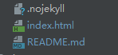
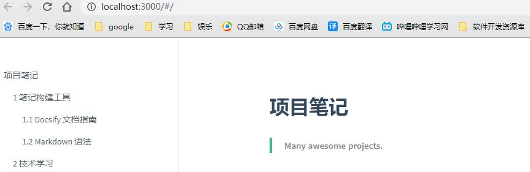
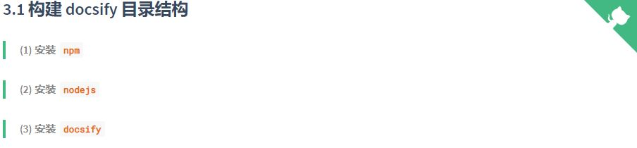
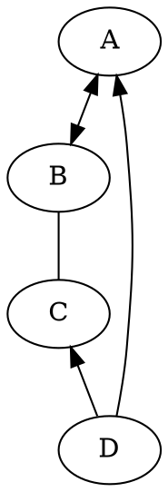

# Docsify 文档构建说明书

## 1 引言

在软件开发过程中，编程人员经常需要写文档，如开发文档、接口 `API` 文档、软件使用手册等，也会编写 `Blog` 记录开发过程，技术感悟（比如我的博客：[EnjoyToShare](https://wugenqiang.gitee.io/) ）。对于这些文档，一般情况下编写人员有以下几种需求：编写简单、对外发布、格式友好、形式专业。而编写的工具则有好多，包括以下几类：

> 文档编写工具 

* word工具类：如 office word，wps，txt 等

* 平台博客类：csdn，简书，oschina 等

* 自建网站类：github，hexo，gitbook，markdown 等

* 知识工具类：confluence，语雀，看云等

当然，各种工具有各自的优缺点，简单一点的话，使用语雀、看云来写长系列文章或者书籍也比较适合，但作为一个开发人员，希望找一个能属于自己的，简单的，有点逼格的文档工具，特别是针对开源软件文档编写，放个 `pdf` 或者 `doc` 文档，不便于维护，最好能跟 `github` 关联，即时可看，又方便维护，如此，则非 `docsify` 莫属了（当然 `gitbook` 也行）。如下可以截图看一下基于 `docsify` 构建的文档。本文针对如何使用 `docsify` 实现文档构建进行讲解，希望能帮助到想构建自己的文档网站的同仁。

## 2 Docsify 简介

按 [Docsify](https://docsify.js.org) 官网的介绍，一句话:一个神奇的文档网站生成工具，使用它，可以使用简单的方式，构建一个专业的文档网站。如果使用过 `GitBook` 和 `Hexo` 的同仁，可以继续使用 `markdown` 编写文档，然后转为 `html` 进行显示。而 `docsify` 是一个动态生成文档网站的工具。不同于 `GitBook`、`Hexo` 的地方是它不会生成将 `.md` 转成 `.html` 文件，所有转换工作都是在运行时进行。只需要创建一个 `index.html` ，就可以开始写文档而且直接部署在 `GitHub Pages` 进行发布，方便、快捷、格式友好，样式不错。

> 基于 Docsify 设计文档预览链接：[EnjoyToShare 项目笔记]()

## 3 使用 docsify 构建文档

> 本章节将对如何使用 `docsify` 构建文档进行详细描述。

### 3.1 构建 docsify 目录结构

> (1) 安装 `npm`  

* git：[http://git-scm.com/](https://link.jianshu.com/?t=http://git-scm.com/)   安装 git 即可

> (2) 安装 `nodejs`

* node.js：[http://nodejs.org/](https://link.jianshu.com/?t=http://nodejs.org/)

> (3) 安装 `docsify`

* 安装 `docsify-cli` 工具，方便创建及本地预览文档网站。

```
npm i docsify-cli -g
```

> (4) 初始化项目

* 进入指定文件目录，进行初始化操作

``` 
docsify init ./docs
```

`docsify` 有其规范的目录结构,初始化成功后，可以看到 `./docs` 目录下最基本的结构如下：

* `index.html`  # 入口文件
* `README.md`   # 会做为主页内容渲染
* `.nojekyll`   # 用于阻止 GitHub Pages 会忽略掉下划线开头的文件




> (5) 本地预览网站

* 运行一个本地服务器通过 `docsify serve` 可以方便的预览效果，而且提供 LiveReload 功能，可以让实时的预览。默认访问 http://localhost:3000/#/ 和 http://127.0.0.1:3000/#/

```
docsify serve docs
```

* 预览图：(由于 README.md 文件被我增加了内容，故显示修改后的内容)



一个基本的文档网站就搭建好了，`docsify` 还可以自定义导航栏，自定义侧边栏以及背景图和一些开发插件等等。更多配置请参考官方文档 https://docsify.js.org

> 期待继续优化，，，go on

### 3.2 添加文档标题名

* 在页面左上角添加文档标题名(自定义)，显示如下图所示：


* 操作如下：在 index.html 文件里添加 name 字段：

```html
<script>
    window.$docsify = {
      name: 'EnjoyToShare',
    }
  </script>
```

> 若想在点击文档标题的时候链接到想要的地址，可进行如下操作：

* 操作如下：在 index.html 文件里添加 nameLink 字段：

```html
<script>
    window.$docsify = {
      nameLink: 'https://wugenqiang.gitee.io',
    }
  </script>
```

### 3.3 添加 GitHub 图标

* 在页面右上角添加 GitHub 图标，显示如下图所示：



* 操作如下：在 index.html 文件里添加 repo 字段：

```html
<script>
    window.$docsify = {
      repo: 'wugenqiang/CS-Notes',
    }
  </script>
```

### 3.4 添加编辑文档按钮

* 操作如下：在 index.html 文件里添加：

```html
<script>
    window.$docsify = {
      formatUpdated: '{YYYY}/{MM}/{DD} {HH}:{mm}',
      plugins: [
        function(hook, vm) {
          hook.beforeEach(function (html) {
            var url = 'https://github.com/wugenqiang/CS-Notes/tree/master/' + vm.route.file
              var editHtml = '[📝 EDIT DOCUMENT](' + url + ')\n'
              var editHtml_end = '[🖊 Edit Document](' + url + ')\n'
              return editHtml
                   + html
                   + '\n----\n'
                   + '> Last Modified {docsify-updated} '
                   + editHtml_end
          })
        }
      ],
    }
  </script>
```

* 注意：记得将代码中的 `'> Last Modified {docsify-updated}'`中{docsify-updated}改成 { docsify-updated },括号和字母之间没有空格！！

* `formatUpdated` 字段为更新时间格式，若不加这一字段，则{ docsify-updated }字段内容不显示

## 4 定制功能

### 4.1 支持 DOT 语言作图

> DOT 语言是贝尔实验室开发的用于作图的脚本语言，最初在桌面端程序 Graphviz 中支持。后来有人开发了 Viz.js 使得浏览器端也能支持 DOT 语言作图的渲染。我们的目的如下：当 Markdown 渲染器识别到一处语言名为 dot 代码块时，就调用 Viz.js 渲染代码块中的语句，使它们成为 DOT 语言定义的矢量图。

> 具体操作如下：（以下所有操作都在 docsify 项目的 index.html 文件中进行）

* （1）首先，引入 Viz.js 文件，只要在 head 中添加一条语句就行：

```js
  <script src="https://cdn.jsdelivr.net/npm/viz.js@1.8.0/viz.js"></script>
```

* （2）添加如下部分：

```js
<script>
    window.$docsify = {
      markdown: {
        renderer: {
          code: function(code, lang) {
            if (lang === "dot") {
              return (
                      '<div class="viz">'+ Viz(code, "SVG")+'</div>'
              );
            }
            return this.origin.code.apply(this, arguments);
          }
        }
      }
    }
  </script>
```

> 下面看看具体实现：

* 操作：

```
​```dot
digraph demo{
    A->B[dir=both];
    B->C[dir=none];
    C->D[dir=back];
    D->A[dir=forward];
}
​```
```

* 效果图：



### 4.2 支持 LaTex 数学公式

> LaTeX 是大门鼎鼎的文档排版软件，它对于数学公式的支持非常好。和 DOT 语言类似，一开始也是只有桌面端程序支持，但是后来同样有人开发了各种各样的 .js 来在浏览器端进行支持。

> 具体操作如下：（以下所有操作都在 docsify 项目的 index.html 文件中进行）

* （1）引入 docsify-katex.js，head 中添加：

```js
<!-- CDN files for docsify-katex -->
<script src="//cdn.jsdelivr.net/npm/docsify-katex@latest/dist/docsify-katex.js"></script>
<!-- or <script src="//cdn.jsdelivr.net/gh/upupming/docsify-katex@latest/dist/docsify-katex.js"></script> -->
<link rel="stylesheet" href="//cdn.jsdelivr.net/npm/katex@latest/dist/katex.min.css"/>
```

> 下面看看具体实现：

* 操作：

```
$$
\left[
\begin{matrix}
 1      & 2      & \cdots & 4      \\
 7      & 6      & \cdots & 5      \\
 \vdots & \vdots & \ddots & \vdots \\
 8      & 9      & \cdots & 0      \\
\end{matrix}
\right]
$$
```

* 效果图：

$$
\left[
\begin{matrix}
 1      & 2      & \cdots & 4      \\
 7      & 6      & \cdots & 5      \\
 \vdots & \vdots & \ddots & \vdots \\
 8      & 9      & \cdots & 0      \\
\end{matrix}
\right]
$$


> 更多 Latex 矩阵样式请参考 [使用 Latex 写矩阵](https://wugenqiang.github.io/CS-Notes/#/markdown/mdNotes?id=_16-使用-latex-写矩阵)

### 4.3 支持 PDF 页面展示

* （1）在 index.html 中添加插件：

```js
<!-- PDFObject.js is a required dependency of this plugin -->
<script src="//cdnjs.cloudflare.com/ajax/libs/pdfobject/2.1.1/pdfobject.min.js"></script> 
<!-- docsify-pdf-embed.js  -->
<script src="//unpkg.com/docsify-pdf-embed-plugin/src/docsify-pdf-embed.js"></script>
```

* （2）在 index.html 中添加代码：

```js
markdown: {
        renderer: {
          code: function(code, lang, base=null) {

            /* if (lang === "dot") {
              return (
                      '<div class="viz">'+ Viz(code, "SVG")+'</div>'
              );
            } */

            var pdf_renderer = function(code, lang, verify) {
              function unique_id_generator(){
                function rand_gen(){
                  return Math.floor((Math.random()+1) * 65536).toString(16).substring(1);
                }
                return rand_gen() + rand_gen() + '-' + rand_gen() + '-' + rand_gen() + '-' + rand_gen() + '-' + rand_gen() + rand_gen() + rand_gen();
              }
              if(lang && !lang.localeCompare('pdf', 'en', {sensitivity: 'base'})){
                if(verify){
                  return true;
                }else{
                  var divId = "markdown_code_pdf_container_" + unique_id_generator().toString();
                  var container_list = new Array();
                  if(localStorage.getItem('pdf_container_list')){
                    container_list = JSON.parse(localStorage.getItem('pdf_container_list'));
                  }
                  container_list.push({"pdf_location": code, "div_id": divId});
                  localStorage.setItem('pdf_container_list', JSON.stringify(container_list));
                  return (
                          '<div style="margin-top:'+ PDF_MARGIN_TOP +'; margin-bottom:'+ PDF_MARGIN_BOTTOM +';" id="'+ divId +'">'
                          + '<a href="'+ code + '"> Link </a> to ' + code +
                          '</div>'
                  );
                }
              }
              return false;
            }
            if(pdf_renderer(code, lang, true)){
              return pdf_renderer(code, lang, false);
            }
            //return this.origin.code.apply(this, arguments);
            return (base ? base : this.origin.code.apply(this, arguments));
          }
        }
      }
```

* （3）使用命令：

```
​```pdf
path-to-the-pdf-file,,,example: https://wugenqiang.github.io/ibooks/web/viewer.html?file=../pdf-book/leetcode-cpp.pdf
​```
```

> 结果展示：

```pdf
https://wugenqiang.github.io/ibooks/web/viewer.html?file=../pdf-book/leetcode-cpp.pdf
```

### 4.4 支持回到顶部

> 方法：通过 jQuery 定义插件 jQuery GoUp 实现点击回到顶部功能。

* 效果图如下：


> 操作如下：

* （1）引用 jquery 库和 jquery.goup.min.js 到 index.html

```js
  <script src="https://wugenqiang.github.io/CS-Notes/plugin/jquery.js"></script>
  <script src="https://wugenqiang.github.io/CS-Notes/plugin/jquery.goup.js"></script>
```

* 在调用下插件：

```js
<script type="text/javascript">
    $(document).ready(function () {
      $.goup({
        trigger: 100,
        bottomOffset: 32,
        locationOffset: 32,
        title: 'TOP',
        titleAsText: true
      });
    });
  </script>
```

