# CentOS 遇到的那些事儿

## 升级 CentOS 系统内核至最新

* （1）检查系统内核版本

```
cat /etc/centos-release
```

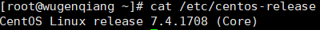

* （2）备份重要数据（例如/etc, /var,/opt）

如果centos是安装在虚拟机上，那么可以使用快照进行备份。像VMware虚拟机可以快照备份，当然更奢侈一点是备份整个虚拟机。也可以针对重要程序数据进行备份，例如MySQL, Appache, Nginx, DNS等等。

* （3）检查可更新的软件

```
yum check-update
```

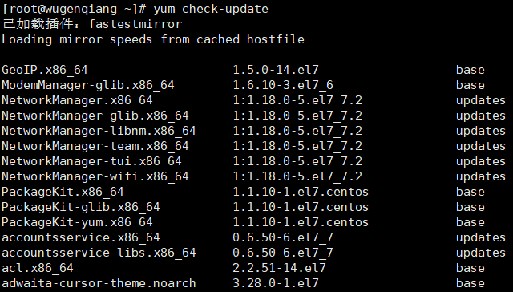

在列表中找到想要更新的部分

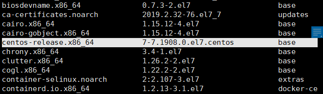

* （4）运行 yum 命令升级

```
yum update /etc/centos-release
```
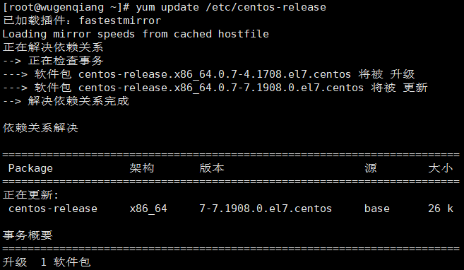

* （5）重启系统

```
reboot
```

* （6）查看现在系统内核版本

```
cat /etc/centos-release
```

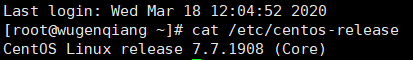

## 安装 CentOS 8

* （1）下载 CentOS 8 ISO 文件

在 [CentOS 官方网站](https://www.centos.org/download/)  下载 CentOS 8 ISO 文件。

* （2）VMware 安装 CentOS 8

参考教程：[VMware 安装 CentOS 8](https://www.cnblogs.com/Dear-XiaoLe/articles/12201099.html) 很棒的教程

## 安装和使用花生壳服务

> 如果想外网可以访问本地服务器，可以考虑这种方式。

### version-2.0.2

* （1）安装必要的开发包

```
yum install gcc gcc-c++ autoconf automake
```

* （2）下载 ph[ddns](https://hsk.oray.com/)-2.0.2.16556.tar.gz 到某一个目录

```
wget http://download.oray.com/peanuthull/phddns-2.0.2.16556.tar.gz
```

* （3）解压所有文件

```
tar zxvf phddns-2.0.2.16556.tar.gz
```

* （4）进入目录并编译

```
[root@wugenqiang ~]# cd /wugenqiang/software/hsk/phddns-2.0.2.16556
[root@wugenqiang phddns-2.0.2.16556]# aclocal
[root@wugenqiang phddns-2.0.2.16556]# autoconf
[root@wugenqiang phddns-2.0.2.16556]# automake
[root@wugenqiang phddns-2.0.2.16556]# ./configure
[root@wugenqiang phddns-2.0.2.16556]# make
[root@wugenqiang phddns-2.0.2.16556]# cd src
[root@wugenqiang src]# ls -l phddns
-rwxr-xr-x. 1 root root 47768 3月  18 12:38 phddns
```

* （5）执行编译好的程序并配置（默认使用 /etc/phlinux.conf，如果不存在这个文件则自动进入交互配置）

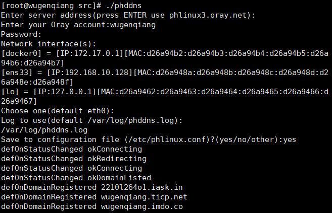

* （6）将 phddns 拷贝到你希望的位置

```
[root@wugenqiang src]# cp phddns /usr/bin/

```

* （7）以后台模式启动

```
[root@wugenqiang src]# cd ~
[root@wugenqiang ~]# /usr/bin/phddns -c /etc/phlinux.conf -d
[root@wugenqiang ~]# tail /var/log/phddns.log
```

* （8）退出花生壳

查看进程ID：

```
[root@wugenqiang ~]# ps -A | grep phddns
```

让后台进程退出：

```
[root@wugenqiang ~]#  kill -9 74635
```

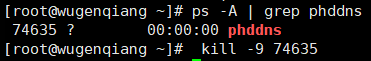

* （9）花生壳加到系统启动时运行

```
[root@wugenqiang ~]# vim /etc/rc.local
在文件的末尾加上一行：/usr/bin/phddns -c /etc/phlinux.conf -d
```

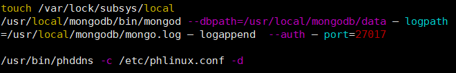

### version-3.0.2

* （1）花生壳官网下载最新的版本 https://hsk.oray.com/download/

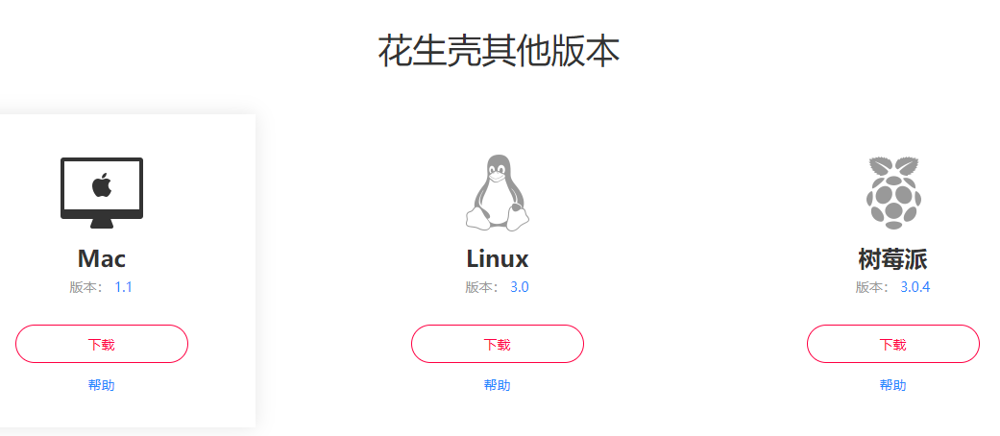

最新版：

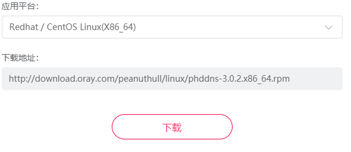

* （2）使用 wget 下载

```
[root@wugenqiang ~]# wget http://download.oray.com/peanuthull/linux/phddns-3.0.2.x86_64.rpm
```

* （3）花生壳安装命令

```
[root@wugenqiang ~]# rpm -ivh phddns-3.0.2.x86_64.rpm
```

* （4）启动花生壳

```
[root@wugenqiang ~]# phddns start
```

当看到下述信息时说明花生壳已经启动成功：

```
Start Phddns Service Success ! 
```

* （5）设置开机自启动

在linux中安装好花生壳后，进入目录：

```
[root@wugenqiang ~]# cd /etc/systemd/system
```

创建启动文件：

```
[root@wugenqiang system]# touch phddns.service
```

编辑文件：

```
[root@wugenqiang system]# vim phddns.service 
```

在文件中加入如下内容：

```
[Unit]
Description=phddns Service
Wants=network-online.target
After=network.target
 
[Service]
Type=simple
# default start cmd
ExecStart=/usr/sbin/phddns start
# Suppress stderr to eliminate duplicated messages in syslog. NM calls openlog()
# with LOG_PERROR when run in foreground. But systemd redirects stderr to
# syslog by default, which results in logging each message twice.
StandardOutput=syslog
StandardError=null
 
[Install]
WantedBy=multi-user.target
```

添加好后保存文件退出。

执行命令：

```
systemctl enable phddns.service
```

若出现如下提示，则说明设置启动项成功：

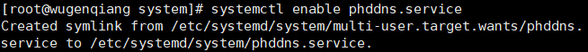

查看启动项命令：

```
[root@wugenqiang system]# systemctl list-unit-files | grep phdd
```

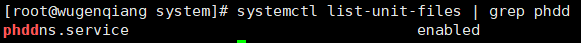

可以看见我们刚刚添加的启动服务已经是 enabled 状态了。

* （6）重启linux

```
[root@wugenqiang system]# shutdown -r now
```

启动完成后执行：

```
[root@wugenqiang ~]# /usr/sbin/phddns status
```

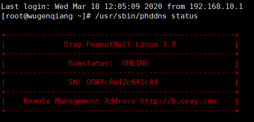

* （7）登录花生壳 https://b.oray.com/

使用上面的 SN 进行登录，密码默认写 admin

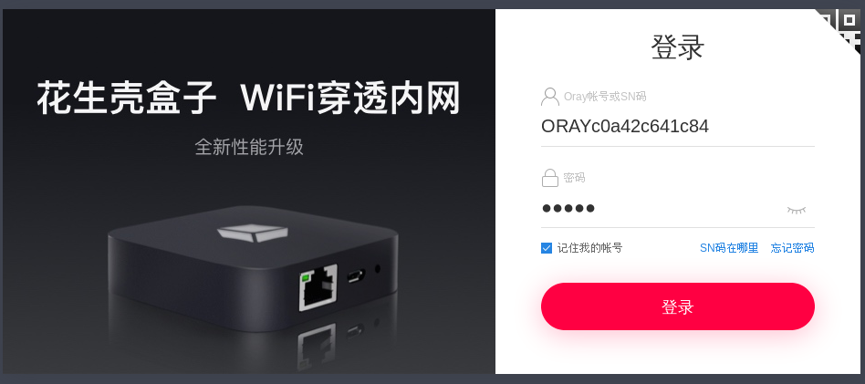

进入系统后会有要求和自己的账号进行绑定，然后设置内网穿透：


* 测试外网连接

首先要让 127.0.0.1 能够访问，可以使用我写的这个：[docker安装nginx静态文件服务器](https://blog.csdn.net/wugenqiang/article/details/86513257)

浏览器输入：https://wugenqiang.imdo.co/

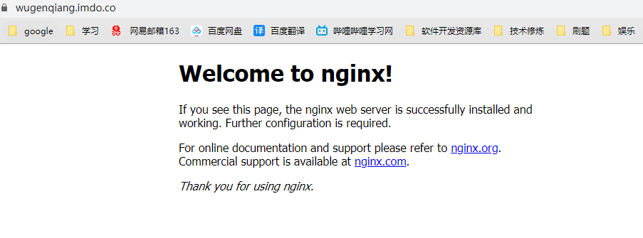


