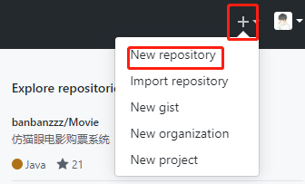
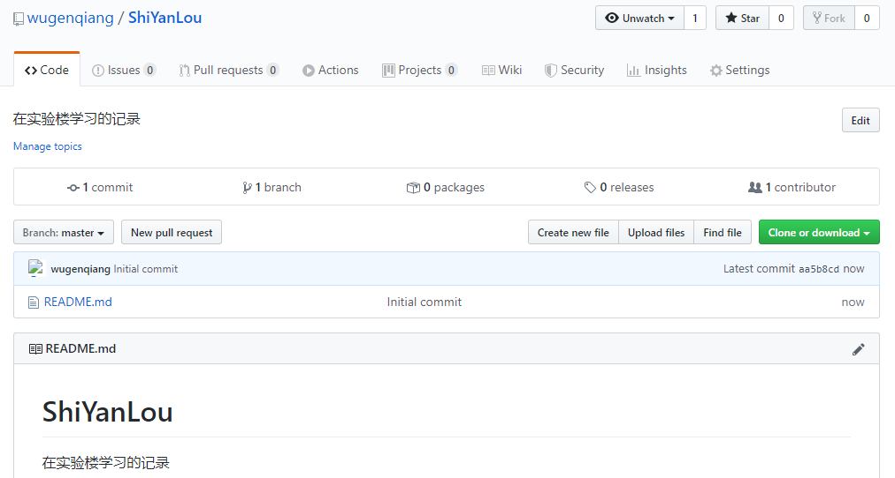
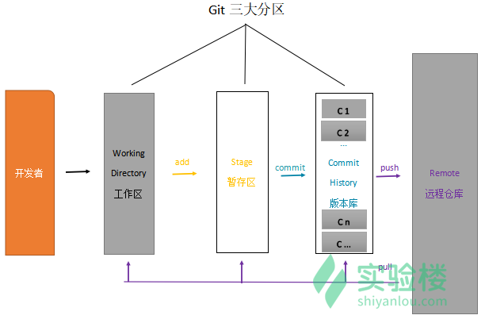
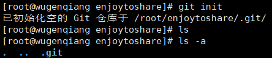
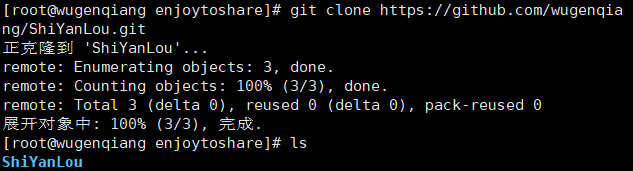
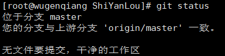

# Git 的使用

## 1 前言

### 1.1 Git 与 GitHub 的来历

Linux 之父 Linus 在 1991 年创建开源的 Linux 操作系统之后，多年来依靠全世界广大热心志愿者的共同建设，经过长足发展，现已成为世界上最大的服务器系统。系统创建之初，代码贡献者将源码文件发送给 Linus，由其手动合并。这种方式维持多年后，代码量已经庞大到人工合并难以为继，于是深恶集中式版本控制系统的 Linus 选择了一个分布式商业版本控制系统 BitKeeper，不过 Linux 社区的建设者们可以免费使用它。BitKeeper 改变了 Linus 对版本控制的认识，同时 Linus 发现 BitKeeper 有一些不足，而且有个关键性的问题使之不能被广泛使用，就是不开源。

在 2005 年，BitKeeper 所在公司发现 Linux 社区有人企图破解它，BitKeeper 决定收回 Linux 社区的免费使用权。Linus 对此事调节数周无果，找遍了当时已知的各种版本控制系统，没有一个看上眼的，一怒之下决定自己搞一个。Linus 花了十天时间用 C 语言写好了一个开源的版本控制系统，就是著名的 Git。

2007 年旧金山三个年轻人觉得 Git 是个好东西，就搞了一个公司名字叫 GitHub，第二年上线了使用 Ruby 编写的同名网站 GitHub，这是一个基于 Git 的免费代码托管网站（有付费服务）。十年间，该网站迅速蹿红，击败了实力雄厚的 Google Code，成为全世界最受欢迎的代码托管网站。2018 年 6 月，GitHub 被财大气粗的 Microsoft 收购。2019 年 1 月 GitHub 宣布用户可以免费创建私有仓库。根据 2018 年 10 月的 GitHub 年度报告显示，目前有 3100 万开发者创建了 9600 万个项目仓库，有 210 万企业入驻。

### 1.2 在 GitHub 上创建仓库

首先，打开 [GitHub](https://github.com/) 注册个人账户并登录。登录后，在个人主页的右上角点击 `New repository` 创建新的仓库：



打开页面如下图所示，填入相关信息。注意下图红色框中有两个下拉按钮，左边的用来选择忽略文件，右边的用来选择所属协议，这两项可以不选，后面会讲到。


点击绿色按钮创建新的仓库，成功后自动跳转到新建仓库的主页面，如下图所示：



> 注：本人 CentOS 已经更新至 CentOS 8，目前在适应阶段，趁巩固 Git 操作来熟悉一下 Centos 8，加油！

### 1.3 Git 仓库的三大区域

Git 本地仓库有三大区域：工作区、暂存区、版本区。



### 1.4 Git 的工作流程

一般工作流程如下：

- 克隆 Git 资源作为工作目录。
- 在克隆的资源上添加或修改文件。
- 如果其他人修改了，你可以更新资源。
- 在提交前查看修改。
- 提交修改。
- 在修改完成后，如果发现错误，可以撤回提交并再次修改并提交。

下图展示了 Git 的工作流程：


## 2 Git 基础操作

### 2.1 安装 Git

```
[root@wugenqiang ~]# yum install git
```

### 2.2 查看 Git 版本号

```
[root@wugenqiang ~]# git --version
```

### 2.3 创建 Git 仓库

#### 2.3.1 初始化 Git 仓库

Git 使用 **git init** 命令来初始化一个 Git 仓库，Git 的很多命令都需要在 Git 的仓库中运行，所以 **git init** 是使用 Git 的第一个命令。

在执行完成 **git init** 命令后，Git 仓库会生成一个 .git 目录，该目录包含了资源的所有元数据，其他的项目目录保持不变。

```
[root@wugenqiang enjoytoshare]# git init
```



#### 2.3.2 Git 提交到 GitHub

* （1）git add 文件名称/.
  * "." 代表全部
* （2）git commit -m  '本次修改注释'
  * 提交到版本库
* （3）git push -u origin master 
  * 推送到远程仓库

### 2.4 克隆仓库

克隆仓库的命令格式为：

```
git clone <repo>
```

举例：



### 2.5 查看仓库状态

```
[root@wugenqiang ShiYanLou]# git status
```




## 3 Git 特殊需求命令

### 3.1 指定不上传的文件夹

* touch .gitignore 

* 编辑器打开生成的 .gitignore 文件，加入:

```
.idea
/*以及其他你想要忽略的文件或文件夹*/
```

* 保存。

* 以后再 add 到暂存区的时候就会忽略配置的文件或文件夹了

> 忽略具体的文件或文件夹：

```
/target/  // 忽略这个target 目录
log/*     // 忽略log下的所有文件
css/*.css // 忽略css目录下的.css文件
```

### 3.2 撤销提交

* 已暂存 未提交

```
git reset
git checkout .
```

### 3.3 遇到 push rejected

问题：


解决办法：

```
git pull --rebase origin master
```

即可。

