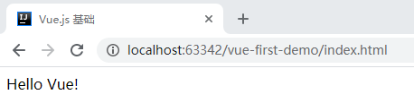
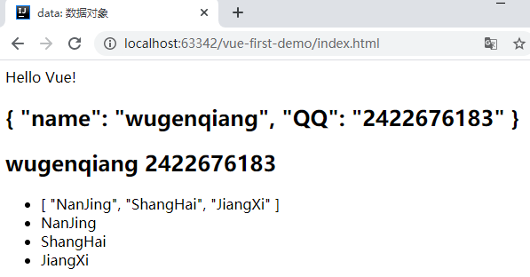

# Vue.js 学习笔记

> 渐进式 JavaScript 框架  

## 前言

* 前端三件套

!> HTML + CSS + JavaScript + AJAX

* 开发工具
  * [IDEA 2019.3.4](ToolBox/IDEA?id=idea-201934)
* 准备
  * [使用 IDEA 搭建 Vue 项目 Demo](frontend/idea-to-vue.md)
* 学习文档
  * [Vue.js 官网：https://cn.vuejs.org](https://cn.vuejs.org)


## Vue.js 基础

### Vue.js 优点

* Vue 是渐进式 JavaScript 框架
* 体积小
  * 压缩后 33 k
* 更高的运行效率
  * 基于虚拟 Dom，一种可以预先通过 JavaScript 进行各种计算，把最终的 Dom 操作计算出来并优化的技术，由于 Dom 操作属于预处理操作，并没有真实的操作 Dom，所以叫做虚拟 Dom
* 双向数据绑定
  * 简化 Dom 操作，把更多的精力投入到业务逻辑上
* 响应式数据驱动
* 生态丰富，学习成本低
  * 市场上 vue.js 的 UI 框架以及常用组件，太丰富了，可以实现快速开发
  * 对初学者友好、入门容易且学习资料多


### 第一个 Vue 程序

> 以我个人为例，在 IDEA 中创建一个文件夹，叫 vue-first-demo，作为我学习 Vue 的第一个手敲学习项目

#### Hello Vue！

* 创建 index.html 添加以下内容：

```html
<!DOCTYPE html>
<html lang="en">
<head>
    <meta charset="UTF-8">
    <meta name="viewport" content="width=device-width,initial-scale=1.0">
    <meta http-equiv="X-UA-Compatible" content="ie=edge">
    <title>Vue.js 基础</title>
</head>
<body>
    <div id="app">
        {{ message }}
    </div>
    <!-- 开发环境版本，包含了有帮助的命令行警告 -->
    <script src="https://cdn.jsdelivr.net/npm/vue/dist/vue.js"></script>
    <script>
        var app = new Vue({
            el:"#app",//el:挂载点
            data:{//data:数据对象
                message:"Hello Vue!"
            }
        })
    </script>
</body>
</html>
```

* 在浏览器中打开 index.html 看效果



#### 总结归纳

> 在 html 中写 Vue 程序需要完成三步：

* （1）导入开发版本的 Vue.js
* （2）创建 Vue 实例对象，设置 el 属性和 data 属性
* （3）使用简洁的模板语法把数据渲染到页面上

### 设置 el 挂载点

> el 作用：设置 Vue 实例挂载（管理）的元素

#### id 选择器

```vue
<div id="app">
    {{ message }}
</div>  
<script>
    var app = new Vue({
        el:"#app",//el:挂载点
        data:{//data:数据对象
            message:"Hello Vue!"
        }
    })
</script>
```

#### class 选择器

```vue
<div class="app">
    {{ message }}
</div>
<script>
    var app = new Vue({
        el:".app",//el:挂载点 class选择器
        data:{//data:数据对象
            message:"Hello Vue!"
        }
    })
</script>
```

#### 标签选择器

```vue
<div>
    {{ message }}
</div>
<script>
    var app = new Vue({
        el:"div",//标签选择器
        data:{//data:数据对象
            message:"Hello Vue!"
        }
    })
</script>
```

!> 标签选择可以有很多，div, p, h2... 都可以，但建议使用 div 作为挂载元素，因为 div 没有额外的样式

#### 总结归纳

* Vue 实例的作用范围是什么呢？
  * Vue 会管理 el 选项命中的元素及其内部的后代元素
* 推荐使用 id 选择器，开发时唯一。
* 支持双标签。可以使用其他双标签，不能使用 html 和 body

### 设置 data 数据对象

> 复制 index.html 到自己的项目中即可浏览效果：

```html
<!DOCTYPE html>
<html lang="en">
<head>
    <meta charset="UTF-8">
    <meta name="viewport" content="width=device-width,initial-scale=1.0">
    <meta http-equiv="X-UA-Compatible" content="ie=edge">
    <title>data: 数据对象</title>
</head>
<body>
    <div id="app">
        {{ message }}
        <h2>{{ senior }}</h2>
        <h2>{{ senior.name }} {{ senior.QQ }}</h2>
        <!--获取数组标签-->
        <ul>
            <li>{{ campus }}</li>
            <li>{{ campus[0] }}</li>
            <li>{{ campus[1] }}</li>
            <li>{{ campus[2] }}</li>
        </ul>
    </div>
    <!-- 开发环境版本，包含了有帮助的命令行警告 -->
    <script src="https://cdn.jsdelivr.net/npm/vue/dist/vue.js"></script>
    <script>
        var app = new Vue({
            el:"#app",//el:挂载点 id选择器
            data:{//data:数据对象
                message:"Hello Vue!",
                senior:{
                    name:"wugenqiang",
                    QQ: "2422676183",
                },
                campus:["NanJing","ShangHai","JiangXi"],
            }
        })
    </script>
</body>
</html>
```

效果：



#### 总结归纳

* Vue 中用到的数据定义在 data 中
* data 中可以写复杂类型的数据
* 渲染复杂类型数据时，遵守 js 的语法即可


## 本地应用

cffv 


## 网络应用


## 综合应用


