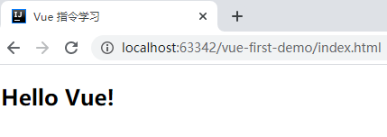
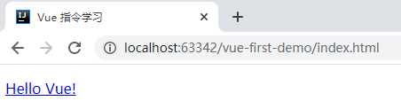
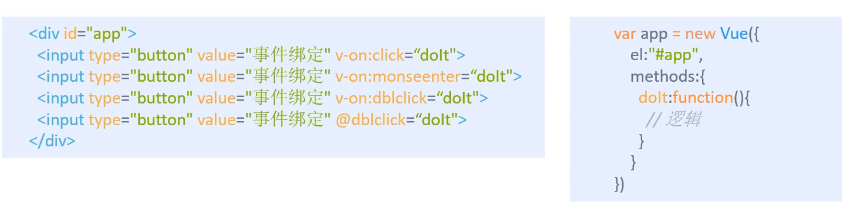
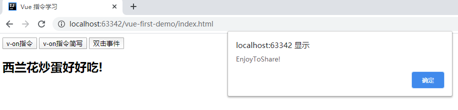
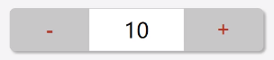
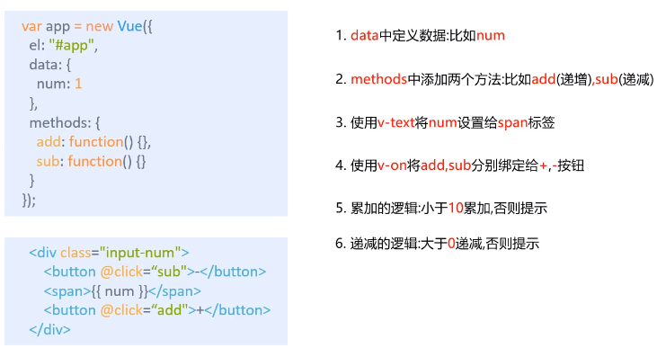

# Vue.js 学习笔记

> 渐进式 JavaScript 框架  

## 前言

* 前端三件套

!> HTML + CSS + JavaScript + AJAX

* 开发工具
  * [IDEA 2019.3.4](ToolBox/IDEA?id=idea-201934)
* 准备
  * [使用 IDEA 搭建 Vue 项目 Demo](frontend/idea-to-vue.md)
* 学习文档
  * [Vue.js 官网：https://cn.vuejs.org](https://cn.vuejs.org)


## Vue.js 基础

### Vue.js 优点

* Vue 是渐进式 JavaScript 框架
* 体积小
  * 压缩后 33 k
* 更高的运行效率
  * 基于虚拟 Dom，一种可以预先通过 JavaScript 进行各种计算，把最终的 Dom 操作计算出来并优化的技术，由于 Dom 操作属于预处理操作，并没有真实的操作 Dom，所以叫做虚拟 Dom
* 双向数据绑定
  * 简化 Dom 操作，把更多的精力投入到业务逻辑上
* 响应式数据驱动
* 生态丰富，学习成本低
  * 市场上 vue.js 的 UI 框架以及常用组件，太丰富了，可以实现快速开发
  * 对初学者友好、入门容易且学习资料多


### 第一个 Vue 程序

> 以我个人为例，在 IDEA 中创建一个文件夹，叫 vue-first-demo，作为我学习 Vue 的第一个手敲学习项目

#### Hello Vue！

* 创建 index.html 添加以下内容：

```html
<!DOCTYPE html>
<html lang="en">
<head>
    <meta charset="UTF-8">
    <meta name="viewport" content="width=device-width,initial-scale=1.0">
    <meta http-equiv="X-UA-Compatible" content="ie=edge">
    <title>Vue.js 基础</title>
</head>
<body>
    <div id="app">
        {{ message }}
    </div>
    <!-- 开发环境版本，包含了有帮助的命令行警告 -->
    <script src="https://cdn.jsdelivr.net/npm/vue/dist/vue.js"></script>
    <script>
        var app = new Vue({
            el:"#app",//el:挂载点
            data:{//data:数据对象
                message:"Hello Vue!"
            }
        })
    </script>
</body>
</html>
```

* 在浏览器中打开 index.html 看效果


#### 总结归纳

> 在 html 中写 Vue 程序需要完成三步：

* （1）导入开发版本的 Vue.js
* （2）创建 Vue 实例对象，设置 el 属性和 data 属性
* （3）使用简洁的模板语法把数据渲染到页面上

### 设置 el 挂载点

> el 作用：设置 Vue 实例挂载（管理）的元素

#### id 选择器

```vue
<div id="app">
    {{ message }}
</div>  
<script>
    var app = new Vue({
        el:"#app",//el:挂载点
        data:{//data:数据对象
            message:"Hello Vue!"
        }
    })
</script>
```

#### class 选择器

```vue
<div class="app">
    {{ message }}
</div>
<script>
    var app = new Vue({
        el:".app",//el:挂载点 class选择器
        data:{//data:数据对象
            message:"Hello Vue!"
        }
    })
</script>
```

#### 标签选择器

```vue
<div>
    {{ message }}
</div>
<script>
    var app = new Vue({
        el:"div",//标签选择器
        data:{//data:数据对象
            message:"Hello Vue!"
        }
    })
</script>
```

!> 标签选择可以有很多，div, p, h2... 都可以，但建议使用 div 作为挂载元素，因为 div 没有额外的样式

#### 总结归纳

* Vue 实例的作用范围是什么呢？
  * Vue 会管理 el 选项命中的元素及其内部的后代元素
* 推荐使用 id 选择器，开发时唯一。
* 支持双标签。可以使用其他双标签，不能使用 html 和 body

### 设置 data 数据对象

> 复制 index.html 到自己的项目中即可浏览效果：

```html
<!DOCTYPE html>
<html lang="en">
<head>
    <meta charset="UTF-8">
    <meta name="viewport" content="width=device-width,initial-scale=1.0">
    <meta http-equiv="X-UA-Compatible" content="ie=edge">
    <title>data: 数据对象</title>
</head>
<body>
    <div id="app">
        {{ message }}
        <h2>{{ senior }}</h2>
        <h2>{{ senior.name }} {{ senior.QQ }}</h2>
        <!--获取数组标签-->
        <ul>
            <li>{{ campus }}</li>
            <li>{{ campus[0] }}</li>
            <li>{{ campus[1] }}</li>
            <li>{{ campus[2] }}</li>
        </ul>
    </div>
    <!-- 开发环境版本，包含了有帮助的命令行警告 -->
    <script src="https://cdn.jsdelivr.net/npm/vue/dist/vue.js"></script>
    <script>
        var app = new Vue({
            el:"#app",//el:挂载点 id选择器
            data:{//data:数据对象
                message:"Hello Vue!",
                senior:{
                    name:"wugenqiang",
                    QQ: "2422676183",
                },
                campus:["NanJing","ShangHai","JiangXi"],
            }
        })
    </script>
</body>
</html>
```

效果：


#### 总结归纳

* Vue 中用到的数据定义在 data 中
* data 中可以写复杂类型的数据
* 渲染复杂类型数据时，遵守 js 的语法即可


## 本地应用

> 使用 Vue 开发网页效果

### Vue 指令

- 内容绑定，事件绑定
  - v-text
  - v-html
  - v-on
- 显示切换，属性绑定
  - v-show
  - v-if
  - v-bind
- 列表循环，表单元绑定
  - v-for
  - v-on补充
  - v-model

> 下面具体来谈谈 Vue 指令：

#### v-text

* 作用：设置标签的文本值（textContent）


```vue
<body>
      <div id="app">
          <h2 v-text="message"></h2>
      </div>
      <!-- 开发环境版本，包含了有帮助的命令行警告 -->
      <script src="https://cdn.jsdelivr.net/npm/vue/dist/vue.js"></script>
      <script>
          var app = new Vue({
              el:"#app",//el:挂载点 id选择器
              data:{//data:数据对象
                  message:"Hello Vue!",
              }
          })
      </script>
  </body>
```

* 效果如下：



* 替换指定内容的推荐表达：

```vue
<body>
    <div id="app">
        <!--<h2 v-text="message">hello</h2>-->
        <h2 >{{ message }} hello</h2><!-- 推荐表达 -->
    </div>
    <!-- 开发环境版本，包含了有帮助的命令行警告 -->
    <script src="https://cdn.jsdelivr.net/npm/vue/dist/vue.js"></script>
    <script>
        var app = new Vue({
            el:"#app",//el:挂载点 id选择器
            data:{//data:数据对象
                message:"Hello Vue!",
            }
        })
    </script>
</body>
```

* 实现字符串拼接！

```vue
<body>
    <div id="app">
        <h2 v-text="message + '!'"></h2>
        <h2 >{{ message + "!" }}</h2>
        <h2 >{{ message + '!' }}</h2>
    </div>
    <!-- 开发环境版本，包含了有帮助的命令行警告 -->
    <script src="https://cdn.jsdelivr.net/npm/vue/dist/vue.js"></script>
    <script>
        var app = new Vue({
            el:"#app",//el:挂载点 id选择器
            data:{//data:数据对象
                message:"Hello Vue!",
            }
        })
    </script>
</body>
```

!> 总结归纳一下：

* v-text 指令的作用是：设置标签的内容（textContent）
* 默认写法会替换全部内容，使用差值表达式 { { } } 可以替换指定内容
* 内部支持写表达式

#### v-html

* 作用：设置标签的 innerHTML

```vue
<body>
    <!-- 2.html结构 -->
    <div id="app">
        <p v-html="content"></p>
    </div>
    <!-- 1.开发环境版本，包含了有帮助的命令行警告 -->
    <script src="https://cdn.jsdelivr.net/npm/vue/dist/vue.js"></script>
    <script>
        //  3.创建Vue实例
        var app = new Vue({
            el:"#app",//el:挂载点 id选择器
            data:{//data:数据对象
                content:"<a href='#'>Hello Vue!</a>",
            }
        })
    </script>
</body>
```

* 效果如下：



!> 总结归纳一下：

* v-html 指令的作用是：设置元素的 innerHTML
* 内容中有 html 结构会被解析为标签
* v-text 指令无论内容是什么，只会解析为文本
* 解析文本使用 v-text，需要解析 html 结构使用 v-html

#### v-on

* 作用：为元素绑定事件



* 演示代码：

```vue
<body>
    <!-- 2.html结构 -->
    <div id="app">
        <!-- click 点击 -->
        <input type="button" value="v-on指令" v-on:click="dolt">
        <input type="button" value="v-on指令简写" @click="dolt">
        <!-- 双击事件 -->
        <input type="button" value="双击事件" @dblclick="dolt">
        <!-- 点击事件 -->
        <h2 @click="changeFood">{{ food }}</h2>
    </div>
    <!-- 1.开发环境版本，包含了有帮助的命令行警告 -->
    <script src="https://cdn.jsdelivr.net/npm/vue/dist/vue.js"></script>
    <script>
        //  3.创建Vue实例
        var app = new Vue({
            el:"#app",//el:挂载点 id选择器
            data:{
              food:"西兰花炒蛋"
            },
            methods:{
                dolt:function(){
                    alert("EnjoyToShare!");
                },
                changeFood:function(){
                    //console.log(this.food);
                    this.food += "好好吃!";
                }
            }
        })
    </script>
</body>
```

* 效果如下：



!> 总结归纳如下：

* v-on 指令的作用：为元素绑定事件
* 事件名不需要写 on
* 指令可以简写为 @
* 绑定的方法定义在 methods 属性中
* 方法内部通过通过 this 关键字可以访问定义在 data 中数据


#### v-show

* 作用：根据表达值的真假，切换元素的显示和隐藏

#### v-if

#### v-bind

#### v-for

#### v-model


### 开发小 Demo

#### 计数器

> demo 样式




* 开发逻辑



* 代码实现：

```vue
<!DOCTYPE html>
<html lang="en" xmlns:v-on="http://www.w3.org/1999/xhtml">
<head>
    <meta charset="UTF-8">
    <meta name="viewport" content="width=device-width,initial-scale=1.0">
    <meta http-equiv="X-UA-Compatible" content="ie=edge">
    <title>计数器小Demo</title>
    <link rel="stylesheet" href="./static/css/index.css">
</head>
<body>
    <!-- 2.html结构 -->
    <div id="app">
        <!-- 计数器功能区域 -->
        <div class="input-num">
            <button @click="sub">
                -
            </button>
            <span>{{ num }}</span>
            <button @click="add">
                +
            </button>
        </div>
    </div>
    <!-- 1.开发环境版本，包含了有帮助的命令行警告 -->
    <script src="https://cdn.jsdelivr.net/npm/vue/dist/vue.js"></script>
    <script>
        //  3.创建Vue实例
        var app = new Vue({
            el:"#app",//el:挂载点 id选择器
            data:{
              num:1,
            },
            methods:{
                add:function () {
                    if(this.num<10){
                        this.num++;
                    }else {
                        alert("不能再加了");
                    }
                },
                sub:function () {
                    if(this.num>1){
                        this.num--;
                    }else {
                        alert("不能再减了啊！")
                    }
                },
            }
        })
    </script>
</body>
</html>
```

* 附 index.css 部分代码：

```css
body{
  background-color: #f5f5f5;
}
#app {
  width: 480px;
  height: 80px;
  margin: 200px auto;
}
.input-num {
  margin-top:20px;
  height: 100%;
  display: flex;
  border-radius: 10px;
  overflow: hidden;
  box-shadow: 4px 4px 4px #adadad;
  border: 1px solid #c7c7c7;
  background-color: #c7c7c7;
}
.input-num button {
  width: 150px;
  height: 100%;
  font-size: 40px;
  color: #ad2a27;
  cursor: pointer;
  border: none;
  outline: none;
  background-color:rgba(0, 0, 0, 0);
}
.input-num span {
  height: 100%;
  font-size: 40px;
  flex: 1;
  text-align: center;
  line-height: 80px;
  font-family:auto;
  background-color: white;
}
```


## 网络应用


## 综合应用


