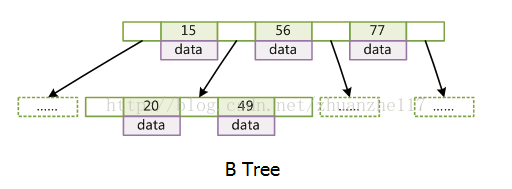
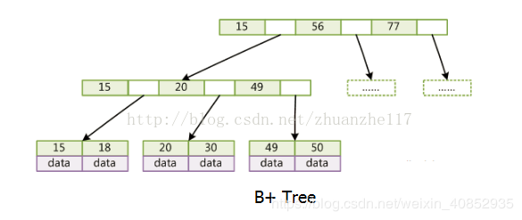

# 算法与数据结构面试题

---

加油！

---


## 考查数据结构本身

### 什么是数据结构

简单地说，数据结构是以某种特定的布局方式存储数据的容器。这种“布局方式”决定了数据结构对于某些操作是高效的，而对于其他操作则是低效的。首先我们需要理解各种数据结构，才能在处理实际问题时选取最合适的数据结构。

### 为什么要使用数据结构

数据是计算机科学当中最关键的实体，而数据结构则可以将数据以某种组织形式存储，因此，数据结构的价值不言而喻。

无论你以何种方式解决何种问题，你都需要处理数据——无论是涉及员工薪水、股票价格、购物清单，还是只是简单的电话簿问题。

数据需要根据不同的场景，按照特定的格式进行存储。有很多数据结构能够满足以不同格式存储数据的需求。

### 常见的数据结构

首先列出一些最常见的数据结构，我们将逐一说明：

- 数组
  - 数组是最简单、也是使用最广泛的数据结构。栈、队列等其他数据结构均由数组演变而来。
  - 每个数据元素都关联一个正数值，我们称之为索引，它表明数组中每个元素所在的位置。大部分语言将初始索引定义为零。
  - 以下是数组的两种类型：
    -  一维数组
    - 多维数组（数组的数组）
  - 数组的基本操作：
    - Insert——在指定索引位置插入一个元素
    - Get——返回指定索引位置的元素
    - Delete——删除指定索引位置的元素
    - Size——得到数组所有元素的数量
- 栈
  - 后进先出
  - 栈的基本操作
    - Push——在顶部插入一个元素
    - Pop——返回并移除栈顶元素
    - isEmpty——如果栈为空，则返回true
    - Top——返回顶部元素，但并不移除它
- 队列
  - 与栈相似，队列是另一种顺序存储元素的线性数据结构。栈与队列的最大差别在于栈是LIFO（后进先出），而队列是FIFO，即先进先出。
  - 队列的基本操作
    - Enqueue() —— 在队列尾部插入元素
    - Dequeue() ——移除队列头部的元素
    - isEmpty()——如果队列为空，则返回true
    - Top() ——返回队列的第一个元素
- 链表
  - 链表是另一个重要的线性数据结构，乍一看可能有点像数组，但在内存分配、内部结构以及数据插入和删除的基本操作方面均有所不同。
  - 链表就像一个节点链，其中每个节点包含着数据和指向后续节点的指针。 链表还包含一个头指针，它指向链表的第一个元素，但当列表为空时，它指向null或无具体内容。
  - 链表一般用于实现文件系统、哈希表和邻接表。
  - 链表包括以下类型：
    - 单链表（单向）
    - 双向链表（双向）
  - 链表的基本操作
    - InsertAtEnd - 在链表的末尾插入指定元素
    - InsertAtHead - 在链接列表的开头/头部插入指定元素
    - Delete  - 从链接列表中删除指定元素
    - DeleteAtHead - 删除链接列表的第一个元素
    - Search  - 从链表中返回指定元素
    - isEmpty - 如果链表为空，则返回true
- 树
  - 树形结构是一种层级式的数据结构，由顶点（节点）和连接它们的边组成。 树类似于图，但区分树和图的重要特征是树中不存在环路。
  - 树形结构被广泛应用于人工智能和复杂算法，它可以提供解决问题的有效存储机制。
  - 树的基本术语
    - Root - 根节点
    - Parent - 父节点
    - Child - 子节点
    - Leaf - 叶子节点
    - Sibling - 兄弟节点
  - 树型结构的基本类型
    - N元树
    - 平衡树
    - 二叉树
    - 二叉搜索树
    - AVL树
    - 红黑树
    - 2-3树
  - 其中，二叉树和二叉搜索树是最常用的树
- 图
  - 图是一组以网络形式相互连接的节点。节点也称为顶点。 一对节点（x，y）称为边（edge），表示顶点x连接到顶点y。边可以包含权重/成本，显示从顶点x到y所需的成本。
  - **图的类型**
    - 无向图
    - 有向图
  - **在程序语言中，图可以用两种形式表示：**
    - 邻接矩阵
    - 邻接表
  - **常见图遍历算法**
    - 广度优先搜索
    - 深度优先搜索

- 字典树（Trie）（这是一种高效的树形结构，但值得单独说明）
  - 字典树，也称为“前缀树”，是一种特殊的树状数据结构，对于解决字符串相关问题非常有效。它能够提供快速检索，主要用于搜索字典中的单词，在搜索引擎中自动提供建议，甚至被用于IP的路由。
- 散列表（哈希表）
  - 哈希法（Hashing）是一个用于唯一标识对象并将每个对象存储在一些预先计算的唯一索引（称为“键（key）”）中的过程。因此，对象以键值对的形式存储，这些键值对的集合被称为“字典”。可以使用键搜索每个对象。基于哈希法有很多不同的数据结构，但最常用的数据结构是哈希表。
  - 哈希表通常使用数组实现。
  - **散列数据结构的性能取决于以下三个因素：**
    - 哈希函数
    - 哈希表的大小
    - 碰撞处理方法

!> 简单谈谈常见的数据结构

a、数组：顺序存储，随机访问 链表：链表存储，顺序访问

b、栈，分为栈顶和栈底，遵循先进后出原则

c、队列 ，一个线性表，像排队一样，受约束控制，遵循先进先出原则

d、树：二叉树、平衡二叉树、大顶堆，小顶堆等

e、图：最短路径，关键路径

### 顺序结构和链式结构的区别？

顺序结构是指内存连续的存储单元进行存储，而链式结构是指 内存不连续的结构，通过一个节点指向另外一个节点的地址。


### 数据结构的三要素

* 逻辑结构：探讨数据元素之间的逻辑关系
  * 集合：各个元素同属于一个集合，别无其他关系
  * 线性结构：
    * 数据元素之间是一对一的关系
    * 除了第一个元素，所有元素都有唯一前驱
    * 除了最后一个元素，所有元素都有唯一后继
  * 树形结构：数据元素之间是一对多的关系
  * 图状结构（网状结构）：数据元素之间是多对多的关系
* 物理结构（存储结构）：探讨如何用计算机表示数据元素的逻辑关系？
  * 顺序存储
  * 链式存储
  * 索引存储
  * 散列存储
    * 根据元素的关键字直接计算出该元素的存储地址，又称为哈希（Hash）存储
* 数据的运算


### 复杂度是什么 ⭐

复杂度包括时间复杂度和空间复杂度，用来评价一个算法的好坏。

## 考查线性表

### 线性表查找有那几类？

直接查找和有序表的二分查找。

### 单链表和顺序表的对比

（1）存储方式：顺序表用一组连续的存储单元依次存储线性表的数据元素；而单链表用一组任意的存储单元存放线性表的数据元素。

（2）时间性能：采用循序存储结构时查找的时间复杂度为O(1)，插入和删除需要移动平均一半的数据元素，时间复杂度为O(n)。采用单链表存储结构的查找时间复杂度为O(n)，插入和删除不需要移动元素，时间复杂度仅为O(1）。

（3）空间性能：采用顺序存储结构时需要预先分配存储空间，分配空间过大会造成浪费，过小会造成问题。采用单链表存储结构时，可根据需要进行临时分配，不需要估计问题的规模大小，只要内存够就可以分配，还可以用于一些特殊情况，如一元多项的表示。

### 顺序结构和链式结构的区别 ⭐

顺序结构是指内存连续的存储单元进行存储，而链式结构是指内存不连续的结构，通过一个节点指向另外一个节点的地址。

## 考查数组

### 寻找数组中第二小的元素


### 找到数组中第一个不重复出现的整数


### 合并两个有序数组


### 重新排列数组中的正值和负值


### 数组和链表的区别 ⭐

**从逻辑结构上来看**，数组必须实现定于固定的长度，不能适应数据动态增减的情况，即数组的大小一旦定义就不能改变。当数据增加是，可能超过原先定义的元素的个数；当数据减少时，造成内存浪费；链表动态进行存储分配，可以适应数据动态地增减的情况，且可以方便地插入、删除数据项。

**从内存存储的角度看**；数组从栈中分配空间（用new则在堆上创建），对程序员方便快速，但是自由度小；链表从堆中分配空间，自由度大但是申请管理比较麻烦。

**从访问方式类看**，数组在内存中是连续的存储，因此可以利用下标索引进行访问；链表是链式存储结构，在访问元素时候只能够通过线性方式由前到后顺序的访问，所以访问效率比数组要低。

## 考查栈

### 使用栈计算后缀表达式


### 对栈的元素进行排序


### 判断表达式是否括号平衡


### 栈和队列的区别 ⭐

栈是先进后出的特殊线性表，队列是先进先出的线性表。

* 栈的插入和删除操作都是在一端进行的，而队列的操作却是在两端进行的。
* 栈是先进后出的特殊线性表，队列是先进先出的线性表
* 栈只允许在表尾一端进行插入和删除，队列只允许在表尾一端进行插入，在表头一端进行删除。

> 换种方式询问：栈和队列的不同，以及他们的相应存储方式。（这个后面一问有点难度，要回答在不同方式下的存储）

### 栈的存储方式 ⭐

栈也有两种存储方法：一是顺序栈；二是链式栈。栈的顺序存储结构是利用一组地址连续的存储单元依次存储自栈底到栈顶的数据元素，同时附设指针 top 指示栈顶元素的位置。由于栈的操作是线性表操作的特例，相对而言，链式栈的操作更易于实现。

### 栈和堆的区别 ⭐

栈区：由编辑器自动分配释放，存放函数的参数值，局部变量的值等（基本类型值）。

堆区：由程序员分配释放，若程序员不释放，程序结束时可能有 OS 回收（引用类型值）。

栈（数据结构）：一种先进后出的数据结构。

堆（数据结构）：堆可以被看成是一棵树，如：堆排序。

### 用两个栈实现一个队列的功能

算法思路：（时间复杂度为 O（1））

设 2 个栈为 A、B，一开始均为空

入队：将新元素 push 入栈 A

出队：

（1）判断栈 B 是否为空

（2）如果不为空，则将栈 A 中所有元素依次 pop 出并 push 给栈 B

（3）将栈 B 的栈顶元素 pop 出


### Heap 和 Stack 的区别

Heap 是堆，Stack 是栈

1 Stack 的空间由操作系统自动分配和释放，Heap 上的空间手动分配和释放

2 Stack 空间有限，Heap 是很大的自由存储区

3 C 中的 malloc 函数分配的内存空间即在堆上，C++ 中对应的是 new 操作符


## 考查队列


### 使用队列表示栈


### 对队列的前k个元素倒序


### 使用队列生成从1到n的二进制数


### 队列的存储方式 ⭐

队列也有两种存储方法：一是顺序队列；二是链式队列，拿链式结构来实现队列，只要将头节点当作队头，尾结点当作队尾，入队时尾节点后移(next)，出队时头节点后移(next)

## 考查链表

### 头节点的作用是什么 ⭐

头节点是指向初始地址的一个节点，它本身数据段没有内容，通过它可以标识这个链表。


### 反转链表


### 检测链表中的循环


### 返回链表倒数第N个节点


### 删除链表中的重复项


## 考查图

### 图的存储 ⭐

邻接矩阵和邻接表，是多对多的关系，分为有向图和无向图。


### 实现广度和深度优先搜索


### 深度优先和广度优先的对比

深度优先搜索(回溯法)
算法思路
深度优先搜索(DFS,Depth-First Search)是搜索的手段之一
它从某个状态开始,不断地转移状态直到无法转移,然后回退到前一步状态,继续转移到其他状态,如此不断重复,直到找到最终的解.根据深度优先搜索的特点,采用递归函数(隐式地利用了栈进行计算)实现比较简单.

算法效率
深度优先搜索从最开始的状态出发,遍历所有可以到达的状态.由此可以对所有的状态进行操作,或列举出所有的状态.作为搜索算法的一种,DFS对于寻找一个解的NP(包括NPC)问题作用很大.

但是,搜索算法毕竟是时间复杂度是O(n!)的阶乘级算法，它的效率比较低,在数据规模变大时,这种算法就显得力不从心了.关于深度优先搜索的效率问题,有多种解决方法.最具有通用性的是**剪枝(prunning),**也就是去除没有用的搜索分支.有可行性剪枝和最优性剪枝两种.此外,对于很多问题,可以把搜索与动态规划(DP,dynamic programming)、完备匹配(匈牙利算法)等高效算法结合.

2.宽度优先搜索(分支限界法)
算法思路
宽度优先搜索(BFS,Breadth-First Search)也是搜索的手段之一.他与深度优先搜索类似,从某个状态出发搜索所有可以到达的状态.根据宽度优先搜索的特点,采用队列实现比较简单.

算法效率
与深度优先不同之处在与搜索的顺序,宽度优先搜索总是先搜索距离初始状态近的状态.也就是说,它是按照开始状态->只需1次转移就可以到达的所有状态->只需2次转移就可以到达的所有状态->…这样的顺序进行搜索.对于同一个状态,宽度优先搜索只经过一次,因此复杂度为

O(状态数*转移的方式).很容易地用来求最短路径、最少操作之类问题的答案.

广度搜索的判断重复如果直接判断十分耗时,我们一般借助哈希表来优化时间复杂度.

3.Death-Breadth总结
宽度优先搜索与深度优先搜索一样,都会生成所有能够遍历到的状态,因此需要对所有状态进行处理时使用宽度优先也是可以的.但是递归函数可以很简短地编写,而且状态的管理也更简单,所以大多数情况下还是用深度优先搜索实现.反之,在求取最短路时深度优先搜索需要反复经过同样的状态,所以还是使用宽度优先搜索比较好.

宽度优先搜索会把状态逐个加入队列,因此通常需要与状态数成正比的内存空间.反之,深度优先搜索是与最大的递归深度成正比的.一般与状态数相比,递归的深度并不会太大,所以可以认为深度优先搜索更加节省内存.


### 检查图是否为树


### 计算图的边数


### 找到两个顶点之间的最短路径


### 邻接矩阵与邻接表

邻接矩阵表示法：在一个一维数组中存储所有的点，在一个二维数组中存储顶点之间的边的权值

邻接表表示法：图中顶点用一个一维数组存储，图中每个顶点vi的所有邻接点构成单链表

**对比**

1）在邻接矩阵表示中，无向图的邻接矩阵是对称的。矩阵中第 i 行或 第 i 列有效元素个数之和就是顶点的度。

在有向图中 第 i 行有效元素个数之和是顶点的出度，第 i 列有效元素个数之和是顶点的入度。

2）在邻接表的表示中，无向图的同一条边在邻接表中存储的两次。如果想要知道顶点的度，只需要求出所对应链表的结点个数即可。

有向图中每条边在邻接表中只出现一次，求顶点的出度只需要遍历所对应链表即可。求入度则需要遍历其他顶点的链表。

3）邻接矩阵与邻接表优缺点：

邻接矩阵的优点是可以快速判断两个顶点之间是否存在边，可以快速添加边或者删除边。而其缺点是如果顶点之间的边比较少，会比较浪费空间。因为是一个 n∗n 的矩阵。

而邻接表的优点是节省空间，只存储实际存在的边。其缺点是关注顶点的度时，就可能需要遍历一个链表。

## 考查树

### 介绍以下各种树 ⭐

树，二叉树：有左右子树的区分和度不超过2.

二叉排序树：左子树均小于根，根均小于右节点。。

线索二叉树：设置两个标识标记左右指针指向的是孩子还是前躯节点。

平衡二叉树：左右子树高度差绝对值小于等于1。

哈夫曼树：压缩用的。权值大小排列。

完全二叉树：只能从右边为空。

### 度为 2 的树和二叉树的区别 ⭐

二叉树有左右子树的定义。

### 树的存储结构 ⭐

孩子链存储结构和双亲存储结构。

### 树的遍历 ⭐

先序中序后序三种。递归实现。

### 求二叉树的高度


### 在二叉搜索树中查找第k个最大值


### 查找与根节点距离k的节点


### 在二叉树中查找给定节点的祖先节点


### 开销量，为何使用二叉树

在[计算机科学](http://baike.baidu.com/view/92404.htm)中，二叉树是每个结点最多有两个子树的有序树。通常根的子树被称作“左子树”（left subtree）和“右子树”（right subtree）。二叉树常被用作[二叉查找树](http://baike.baidu.com/view/389459.htm)和[二叉堆](http://baike.baidu.com/view/668854.htm)或是[二叉排序树](http://baike.baidu.com/view/647462.htm)。二叉树的每个结点至多只有二棵子树(不存在出度大于2的结点)，二叉树的子树有左右之分，次序不能颠倒。

文件系统和数据库系统一般都采用树（特别是B树）的数据结构数据，主要为排序和检索的效率。二叉树是一种最基本最典型的排序树，用于教学和研究树的特性，本身很少在实际中进行应用，因为缺点太明显了（看看教科书怎么说的）。就像冒泡排序一样，虽然因为效率问题并不实用，单不失一种教学例子的好手段。


### B树和B+树的区别，以一个m阶树为例

关键字的数量不同：B+树中分支结点有m个关键字，其叶子结点也有m个，其关键字只是起到了一个索引的作用，但是B树虽然也有m个子结点，但是其只拥有m-1个关键字。

存储的位置不同：B+树中的数据都存储在叶子结点上，也就是其所有叶子结点的数据组合起来就是完整的数据，但是B树的数据存储在每一个结点中，并不仅仅存储在叶子结点上。

分支结点的构造不同：B+树的分支结点仅仅存储着关键字信息和儿子的指针（这里的指针指的是磁盘块的偏移量），也就是说内部结点仅仅包含着索引信息。

查询不同:B树在找到具体的数值以后，则结束，而B+树则需要通过索引找到叶子结点中的数据才结束，也就是说B+树的搜索过程中走了一条从根结点到叶子结点的路径。






### 请比较最小生成树的算法（普里姆算法，克鲁斯卡尔算法）的异同

最小生成树：
最小生成树来自于无向网。
无向图在边上加上权值就成了无向网。
一个无向图可以有多种不同姿态连接的生成树。
最小生成树就是–各边上权值之和最小的生成树。

普里姆算法(Prim)和克鲁斯卡尔(Kruskal)算法

普里姆算法的基本思想:（简单的说就是一直加点）
取图中任意一个顶点 v 作为生成树的根，之后往生成树上添加新的顶点 w。添加顶点w的条件为：w 和已在生成树上的顶点v 之间必定存在一条边，并且该边的权值在所有连通顶点 v 和 w 之间的边中取值最小。之后继续往生成树上添加顶点，直至生成树上含有 n-1 个顶点为止。

克鲁斯卡尔算法的基本思想：（简单的说就是找不围成圈的最小的边）

考虑问题的出发点: 为使生成树上边的权值之和达到最小，则应使生成树中每一条边的权值尽可能地小。

具体做法: 先构造一个只含 n 个顶点的子图 SG，然后从权值最小的边开始，若它的添加不使SG 中产生回路，则在 SG 上加上这条边，如此重复，直至加上 n-1 条边为止。

### 什么时候最小生成树唯一？

当带权连通图的任意一个环中所包含的权值均不相同

### Dijkstra 算法与 Prim 算法的区别

1.prim算法过程：

```
 prim算法是最小生成树算法，它运用的是贪心原理，设置两个点集合，
 一个集合为要求的生成树的点集合A，另一个集合为未加入生成树的点B。
```

它的具体实现过程是：
（1）：所有的点都在集合B中，A集合为空。(memset(visited,0,sizeof(visited))
（2）：任意以一个点为开始，把这个初始点加入集合A中，从集合B中减去这个点(visited[1]=1)。寻找与它相邻的点中路径最短的点，如后把这个点也加入集合A中,从集合B中减去这个点（visited[pos]=1）。
（3）：更新未被访问的节点的dist[]值。
（4）：重复上述过程。一直到所有的点都在A集合中结束。

2.dijkstra算法过程：

（1）初始时，S只包含源点v，即S＝v。U包含除v外的其他顶点，U中顶点u距离为边上的权（若v与u有边）或（若u不是v的出边邻接点）。
（2）从U中选取一个距离v最小的顶点k，把k，加入S中（该选定的距离就是v到k的最短路径长度）。
（3）以k为新考虑的中间点，修改U中各顶点的距离；若从源点v到顶点u（u U）的距离（经过顶点k）比原来距离（不经过顶点k）短，则修改顶点u的距离值，修改后的距离值的顶点k的距离加上边上的权。
（4）重复步骤（2）和（3）直到所有顶点都包含在S中。

3.小总结

1：Prim是计算最小生成树的算法，Dijkstra是计算最短路径的算法，
2、都是使用贪婪和线性规划，每一步都是选择权值/花费最小的边。
贪婪：一个局部最有解也是全局最优解；
线性规划：主问题包含n个子问题，而且其中有重叠的子问题。

### 什么是平衡二叉树

左右子树都是平衡二叉树，且左右子树的深度差值的绝对值不大于 1


## 考查字典树

### 计算字典树中的总单词数


### 打印存储在字典树中的所有单词


### 使用字典树对数组的元素进行排序


### 使用字典树从字典中形成单词


### 构建T9字典（字典树+ DFS ）


## 考查算法

### 请说出以下算法的时间复杂度

> 冒泡排序法 插入排序法 堆排序法 二叉树排序法

O(n^2） O(n^2)  O(nlog2n) 最差 O(n2) 平均 O(nlog2n)

> 快速排序法 希尔排序法

最差 O(n^2) 平均 O(nlog2n)  O(nlog n) 不稳定

### 排序算法有哪些  ⭐

> 或者问：C语言总共有多少种排序法

* 排序算法有很多，每种算法有不同的时间和空间复杂度，效率也有差别，那么针对使用上也有不同的场合。原则上说，数据结构是一门领域，跟语言没有绝对的联系，很多时候同样的算法可以用很多种语言实现。
* 下面罗列一些常见的算法：插入排序，冒泡排序，选择排序，快速排序，堆排序，归并排序，基数排序，希尔排序等。


插入排序有直接插入和折半插入。都是在有序表里插入进去的。

交换排序：冒泡，快速：以一个数字划分两个区域，然后分别对两个区域继续划分，直到区间为一。注意快排是不稳定。

选择排序：简单的选择排序，堆排序

归并排序：将两个有序表归并到一个有序表。将两个有序表放到一起进行各个比较，比较完之后放回原来数组内。

时间复杂度：

(1)平方阶(O(n2))排序
　　各类简单排序:直接插入、直接选择和冒泡排序；
 (2)线性对数阶(O(nlog2n))排序
　　快速排序、堆排序和归并排序；
 (3)O(n1+§))排序,§是介于0和1之间的常数。

​    希尔排序
(4)线性阶(O(n))排序
　　基数排序，此外还有桶、箱排序。

**稳定性：**

排序算法的稳定性:若待排序的序列中，存在多个具有相同关键字的记录，经过排序，这些记录的相对次序保持不变，则称该算法是稳定的；若经排序后，记录的相对次序发生了改变，则称该算法是不稳定的。 

稳定的排序算法：冒泡排序、插入排序、归并排序和基数排序

不是稳定的排序算法：选择排序、快速排序、希尔排序、堆排序

### 什么是稳定的算法 ⭐

不乱动已经排序好的数字，这样算法稳定一些。

### 选择排序算法的准则

一般而言，需要考虑的因素有以下四点：

设待排序元素的个数为n.

**1）**当n较大，则应采用时间复杂度为O(nlog2n)的排序方法：快速排序、堆排序或归并排序序。

**2）**当n较大，内存空间允许，且要求稳定性：归并排序

**3）**当n较小，可采用直接插入或直接选择排序。

  直接插入排序：当元素分布有序，直接插入排序将大大减少比较次数和移动记录的次数。

  直接选择排序 ：元素分布有序，如果不要求稳定性，选择直接选择排序

**5）**一般不使用或不直接使用传统的冒泡排序。

**6****）**基数排序
它是一种稳定的排序算法，但有一定的局限性：
　　1、关键字可分解。
　　2、记录的关键字位数较少，如果密集更好
　　3、如果是数字时，最好是无符号的

### 简述快速排序过程

1）选择一个基准元素,通常选择第一个元素或者最后一个元素,

2）通过一趟排序将待排序的记录分割成独立的两部分，其中一部分记录的元素值均比基准元素值小。另一部分记录的元素值比基准值大。

3）此时基准元素在其排好序后的正确位置

4）然后分别对这两部分记录用同样的方法继续进行排序，直到整个序列有序。

### 快速排序的改进

只对长度大于k的子序列递归调用快速排序,让原序列基本有序，然后再对整个基本有序序列用插入排序算法排序。实践证明，改进后的算法时间复杂度有所降低，且当k取值为 8 左右时,改进算法的性能最佳。

选择基准元的方式

对于分治算法，当每次划分时，算法若都能分成两个等长的子序列时，那么分治算法效率会达到最大。也就是说，基准的选择是很重要的。选择基准的方式决定了两个分割后两个子序列的长度，进而对整个算法的效率产生决定性影响。最理想的方法是，选择的基准恰好能把待排序序列分成两个等长的子序列。

方法1 固定基准元

如果输入序列是随机的，处理时间是可以接受的。如果数组已经有序时，此时的分割就是一个非常不好的分割。

方法2 随机基准元

这是一种相对安全的策略。由于基准元的位置是随机的，那么产生的分割也不会总是会出现劣质的分割。在整个数组数字全相等时，仍然是最坏情况，时间复杂度是O(n^2）

实际上，随机化快速排序得到理论最坏情况的可能性仅为1/(2^n）。所以随机化快速排序可以对于绝大多数输入数据达到O(nlogn）的期望时间复杂度。

方法3 三数取中

引入的原因：虽然随机选取基准时，减少出现不好分割的几率，但是还是最坏情况下还是O(n^2），要缓解这种情况，就引入了三数取中选取基准。

分析：最佳的划分是将待排序的序列分成等长的子序列，最佳的状态我们可以使用序列的中间的值，也就是第N/2个数。可是，这很难算出来，并且会明显减慢快速排序的速度。这样的中值的估计可以通过随机选取三个元素并用它们的中值作为基准元而得到。事实上，随机性并没有多大的帮助，因此一般的做法是使用左端、右端和中心位置上的三个元素的中值作为基准元。

### 冒泡排序算法的改进

1．设置一标志性变量pos,用于记录每趟排序中最后一次进行交换的位置。由于pos位置之后的记录均已交换到位,故在进行下一趟排序时只要扫描到pos位置即可。

2．传统冒泡排序中每一趟排序操作只能找到一个最大值或最小值,我们考虑利用在每趟排序中进行正向和反向两遍冒泡的方法一次可以得到两个最终值(最大者和最小者) , 从而使排序趟数几乎减少了一半。

### 用循环比递归效率高吗？

递归和循环两者完全可以互换。不能完全决定性地说循环地效率比递归的效率高。

递归算法

优点：代码简洁、清晰，并且容易验证正确性。

缺点：它的运行需要较多次数的函数调用，如果调用层数比较深，需要增加额外的堆栈处理（还有可能出现堆栈溢出的情况），比如参数传递需要压栈等操作，会对执行效率有一定影响。
但是，对于某些问题，如果不使用递归，那将是极端难看的代码。在编译器优化后，对于多次调用的函数处理会有非常好的效率优化，效率未必低于循环。

循环算法

优点：速度快，结构简单。

缺点：并不能解决所有的问题。有的问题适合使用递归而不是循环。如果使用循环并不困难的话，最好使用循环。

### 请简述 KMP 算法

在一个字符串中查找是否包含目标的**匹配字符串**。

其主要思想是每趟比较过程让**子串先后滑动**一个合适的位置。

当发生不匹配的情况时，不是右移一位，而是**移动（当前匹配的长度– 当前匹配子串的部分匹配值）位。**


## 考查散列表

### 哈希表是什么，怎么理解哈希表

散列表（Hash table，也叫哈希表），是根据关键码值(Key value)而直接进行访问的数据结构。也就是说，它通过把关键码值映射到表中一个位置来访问记录，以加快查找的速度。这个映射函数叫做散列函数，存放记录的数组叫做散列表。给定表M，存在函数f(key)，对任意给定的关键字值key，代入函数后若能得到包含该关键字的记录在表中的地址，则称表M为哈希(Hash）表，函数f(key)为哈希(Hash) 函数


### 解决哈希冲突的方法

哈希表（Hash table，也叫散列表），是根据关键码值(Key value)而直接进行访问的数据结构。

1） 线性探测法

2） 平方探测法

3） 伪随机序列法

4） 拉链法


### 在数组中查找对称键值对


### 追踪遍历的完整路径


### 查找数组是否是另一个数组的子集


### 检查给定的数组是否不相交

 

