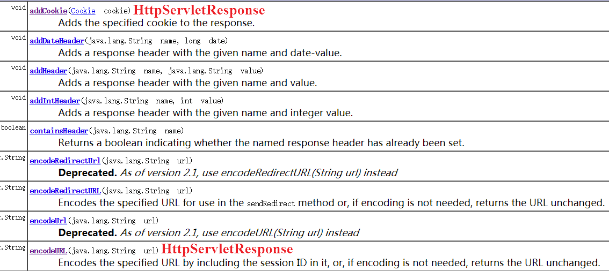
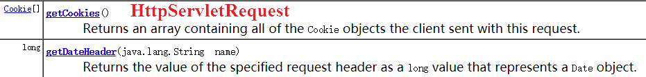
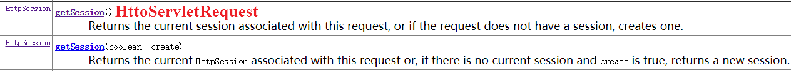

# 计算机网络面试题

## 第一章 网络模型

### OSI 全称

Opening System Interconnection - Reference Model

### OSI、TCP/IP 以及五层协议的体系结构之间的比较 ⭐

> OSI 分层（7 层）：物理层、数据链路层、网络层、传输层、会话层、表示层、应用层
>
> TCP/IP 分层（4 层）：网络接口层、网际层、运输层、应用层
>
> 五层协议（5 层）：物理层、数据链路层、网络层、运输层、应用层

如下图：


> 每一层的作用如下：

**物理层**：参考模型的最低层，也是 OSI 模型的第一层，实现了相邻计算机节点之间比特流的透明传送，并尽可能地屏蔽掉具体传输介质和物理设备的差异，为上层（数据链路层）协议提供了一个传输数据的物理媒体，使其上层（数据链路层）不必关心网络的具体传输介质。

**数据链路层**：这一层在物理层提供的比特流的基础上，通过差错控制、流量控制方法，使有差错的物理线路变为无差错的数据链路，即数据链路层在不可靠的物理介质上提供可靠的传输。该层的作用包括：物理地址寻址、数据的成帧、流量控制、数据的检错、重发等。

**网络层**：网络层负责对子网间的数据包进行路由选择。此外，网络层还可以实现拥塞控制、网际互连等功能。

**传输层**：第一个端到端，即主机到主机的层次。传输层负责将上层数据分段并提供端到端的、可靠的或不可靠的传输。此外，传输层还要处理端到端的差错控制和流量控制问题。

**会话层**：会话层管理主机之间的会话进程，即负责建立、管理、终止进程之间的会话。会话层还利用在数据中插入校验点来实现数据的同步。

**表示层**：表示层对来自应用层的命令和数据进行解释，以确保一个系统的应用层所发送的信息可以被另一个系统的应用层读取。表示层的数据转换包括数据的编码，压缩和解压缩，数据的加密和解密。

**应用层**：为操作系统或网络应用程序提供访问网络服务的接口。

> 简述每一层的作用（若简要回答，可参考下面）

物理层：通过媒介传输比特,确定机械及电气规范（比特Bit）

数据链路层：将比特组装成帧和点到点的传递（帧Frame）

网络层：负责数据包从源到宿的传递和网际互连（包PackeT）

传输层：提供端到端的可靠报文传递和错误恢复（段Segment）

会话层：建立、管理和终止会话（会话协议数据单元SPDU）

表示层：对数据进行翻译、加密和压缩（表示协议数据单元PPDU）

应用层：允许访问OSI环境的手段（应用协议数据单元APDU）

### 五层协议体系结构中，每一层对应的协议

* 物理层：RJ45、CLOCK、IEEE802.3 （中继器，集线器）
* 数据链路：PPP、HDLC、VLAN、MAC （网桥，交换机）
* 网络层 ： IP 协议、 ICMP 协议、 ARP 协议、 RARP 协议、IPX、RIP （路由器）。
* 传输层 ： UDP 协议、 TCP 协议。
* 应用层 ： FTP （文件传送协议）、 Telenet （远程登录协议）、 DNS （域名解析协议）、 SMTP （邮件传送协议）， POP3 协议（邮局协议）， HTTP 协议。


### 各种协议的介绍

ICMP协议： 因特网控制报文协议。它是TCP/IP协议族的一个子协议，用于在IP主机、路由器之间传递控制消息。

FTP协议： 是TCP/IP协议族中的一个用来在客户机与服务器之间进行简单文件传输的协议，提供不复杂、开销不大的文件传输服务。

HTTP协议： 超文本传输协议，是一个属于应用层的面向对象的协议，由于其简捷、快速的方式，适用于分布式超媒体信息系统。

NAT协议：网络地址转换属接入广域网(WAN)技术，是一种将私有（保留）地址转化为合法IP地址的转换技术，

DHCP协议：动态主机配置协议，是一种让系统得以连接到网络上，并获取所需要的配置参数手段，使用UDP协议工作。具体用途：给内部网络或网络服务供应商自动分配IP地址，给用户或者内部网络管理员作为对所有计算机作中央管理的手段。

RARP 协议：RARP是逆地址解析协议，作用是完成硬件地址到IP地址的映射，主要用于无盘工作站，因为给无盘工作站配置的IP地址不能保存。工作流程：在网络中配置一台RARP服务器，里面保存着IP地址和MAC地址的映射关系，当无盘工作站启动后，就封装一个RARP数据包，里面有其MAC地址，然后广播到网络上去，当服务器收到请求包后，就查找对应的MAC地址的IP地址装入响应报文中发回给请求者。因为需要广播请求报文，因此RARP只能用于具有广播能力的网络。

### 路由设备与相关层

* 物理层 ：中继器（ Repeater ，也叫放大器）、集线器。
* 数据链路层 ：网桥、交换机。
* 网络层 ：路由器。
* 网关 ：网络层以上的设备。

### Internet 采用哪种网络协议，该协议的主要层次结构是什么

TCP / IP 协议

应用层、传输层、网际层、网络接口层


### 常见的路由选择协议，以及它们的区别

> 常见的路由选择协议有： RIP 协议、 OSPF 协议。

* RIP 协议 ：底层是贝尔曼福特算法，它选择路由的度量标准（ metric) 是跳数，最大跳数是 15 跳，如果大于 15 跳，它就会丢弃数据包。

* OSPF 协议 ：底层是迪杰斯特拉算法，是链路状态路由选择协议，它选择路由的度量标准是带宽，延迟。

### 谈谈对 TCP/IP 协议的理解 ⭐

有 5 层结构，分层处理。


### 网络协议的三个核心要素是什么？各有什么作用？ ⭐

语法,定义了数据与控制信息的格式;

语义,定义了需要发出何种控制信息,完成何种响应动作以及作出何种响应;

同步,定义了事件实现顺序的详细说明;

### 点对点和端对端工作在哪层？工作机制是什么 ⭐

点对点协议(Point to Point Protocol)的缩写为PPP,是TCP/IP网络协议包的一个成员。PPP是TCP/IP的扩展,它增加了两个额外的功能组:

(1)它可以通过串行接口传输TCP/IP包;

(2)它可以安全登录。

端对端，点对点，只是称为问题，本质区别很小

端对端，主要服务于Application Layer,是说两台主机（终端），跨过网络直接连接

点对点，是说两台主机（终端）在局域网中传输。

## 第二章 物理层

### 谈一谈网络时延由哪几个部分组成？各产生于何处 ⭐

网络时延主要由发送时延，传播时延，处理时延组成。

发送时延=数据块长度/信道带宽

传播时延是指从发送端发送数据开始，到接收端收到数据（或者从接收端发送确认帧，到发送端收到确认帧），总共经历的时间。

处理时延是指计算机处理数据所需的时间，与计算机CPU的性能有关。

### 了解交换机、路由器、网关的概念，并知道各自的用途

1）交换机

在计算机网络系统中，交换机是针对共享工作模式的弱点而推出的。交换机拥有一条高带宽的背部总线和内部交换矩阵。交换机的所有的端口都挂接在这条背部总线上，当控制电路收到数据包以后，处理端口会查找内存中的地址对照表以确定目的MAC（网卡的硬件地址）的NIC（网卡）挂接在哪个端口上，通过内部交换矩阵迅速将数据包传送到目的端口。目的MAC若不存在，交换机才广播到所有的端口，接收端口回应后交换机会“学习”新的地址，并把它添加入内部地址表 中。

交换机工作于OSI参考模型的第二层，即数据链路层。交换机内部的CPU会在每个端口成功连接时，通过ARP协议学习它的MAC地址，保存成一张 ARP表。在今后的通讯中，发往该MAC地址的数据包将仅送往其对应的端口，而不是所有的端口。因此，交换机可用于划分数据链路层广播，即冲突域；但它不能划分网络层广播，即广播域。

2）路由器

路由器（Router）是一种计算机网络设备，提供了路由与转送两种重要机制，可以决定数据包从来源端到目的端所经过的路由路径（host到host之间的传输路径），这个过程称为路由；将路由器输入端的数据包移送至适当的路由器输出端(在路由器内部进行)，这称为转送。路由工作在OSI模型的第三层——即网络层，例如网际协议。

路由器的一个作用是连通不同的网络，另一个作用是选择信息传送的线路。 路由器与交换器的差别，路由器是属于OSI第三层的产品，交换器是OSI第二层的产品(这里特指二层交换机)。

3）网关

网关（Gateway），网关是连接两个网络的设备，

在传统TCP/IP术语中，网络设备只分成两种，一种为网关（gateway），另一种为主机（host）。网关能在网络间转递数据包，但主机不能转送数据包。在主机中，数据包需经过TCP/IP四层协议处理，但是在网关只需要到达网际层，决定路径之后就可以转送。

在现代网络术语中，网关（gateway）与路由器（router）的定义不同。网关（gateway）能在不同协议间移动数据，而路由器（router）是在不同网络间移动数据.

对于以太网中的网关只能转发三层以上数据包，这一点和路由是一样的。而不同的是网关中并没有路由表，他只能按照预先设定的不同网段来进行转发。网关最重要的一点就是端口映射，子网内用户在外网看来只是外网的IP地址对应着不同的端口，这样看来就会保护子网内的用户。

### hub,switch,router 属于 OSI 哪一层 ⭐

hub 是集线器属于物理层，交换机是数据链路层，router 是路由器，网络层的，负责不同网络结合。

### 中继器、集线器、网桥、交换机这4种网络互联设备的区别与联系 ⭐

这4种设备均用于互联、扩展局域网的连接设备，但他们工作的层次与实现的功能并不相同。

* 中继器：工作在物理层，用来连接两个速率相同且数据链路层也相同的网段，其功能是数字信号在基带传输中由于经过一长段电缆而造成信号失真与衰减，中继器使信号的波形和强度到达要求，其原理是信号再生；
* 集线器：工作在物理层，相当于一个多接口的中继器，可将多个节点连接成一个共享式的局域网，但任何时刻都只有一个节点在通过公共信道发送数据；
* 网桥：工作在数据链路层，可以互联不同的物理层、不同的mac层及不同速率的以太网，网桥具有过滤帧、存储转发帧的功能，可以隔离冲突域但不能隔离广播域；
* 交换机：工作在数据链路层，相当于一个多端口的网桥，是交换式局域网的核心设备，允许端口之间建立多个并发连接，实现多个节点之间的并发传输。

### 电路交换、报文交换、分组交换三种交换技术比较 ⭐

电路交换要求建立一条专用线路，报文交换和分组交换不需要建立专用线路，采用存储转发的方式，区别在于数据报的粒度大小。

* 电路交换 优点：传输时延小、没有冲突、实时性强； 缺点：独占式信道利用率低、建立连接时间长、灵活性差。
* 报文交换 优点：无需建立连接、信道利用率高； 缺点：转发时延长、要求的缓存空间大。
* 分组交换 优点：无需建立连接、信道利用率高、简化了存储管理、加速了传输； 缺点：存在发送时延、可能会存在分组失序、丢失、重复。

### 数据报服务和虚电路服务的区别 ⭐

数据报服务和虚电路服务属于物理层的分组交换

第一，数据报服务在传输前不需要与目的地址建立连接，虚电路必须要

第二，数据报每个分组都有完整的目的地址，虚电路服务仅在建立连接阶段使用，之后使用虚电路号

第三，数据报的每个分组独立进行路由选择和转发，虚电路服务属于同一条虚电路的分组按同一路由转换

第四、数据报服务不保证有序到达，虚电路服务保证有序到达

## 第三章 数据链路层

### 何为网桥？防火墙的端口防护是指什么？ ⭐

网桥：网桥（Bridge）像一个聪明的中继器。中继器从一个网络电缆里接收信号， 放大它们，将其送入下一个电缆。相比较而言，网桥对从关卡上传下来的信息更敏锐一些。网桥是一种对帧进行转发的技术，根据MAC分区块，可隔离碰撞。网桥将网络的多个网段在数据链路层连接起来。

网桥也叫桥接器，是连接两个局域网的一种存储/转发设备，它能将一个大的LAN分割为多个网段，或将两个以上的LAN互联为一个逻辑LAN，使LAN上的所有用户都可访问服务器。

防火墙端口防护：指通过对防火墙的端口开关的设置，关闭一些非必需端口，达到一定安全防护目的行为。

### 数据链路层成帧方式

字符填充法、字符计数法、比特填充法、违规编码法。


### 数据链路层协议可能提供的服务

成帧、链路访问、透明传输、可靠交付、流量控制、差错检测、差错纠正、半双工和全双工。最重要的是帧定界（成帧）、透明传输以及差错检测。

### 网关的基本工作原理 ⭐

网关工作在网络层，是在高层上实现多个网络互联的设备，如果互联的网络在高层采用不同的网络协议，就需要网关完成不同协议之间的转换，网关的作用是为了一种网络产生的报文加上必要的控制信息将它转换为另一种网络所支持的报文信息。

### 解释 ARP 协议（IP -> MAC）⭐ 

ARP 协议是用来解释 IP 地址所对应的 MAC 地址，因为在实际的数据链路上传送数据帧时，必须要使用硬件地址。

### 简述 ARP 的作用 ⭐ 


## 第四章 网络层

### 子网掩码和 IP 地址怎么理解 ⭐

在国际互联网(Internet)上有成千百万台主机（host），为了区分这些主机，人们给每台主机都分配了一个专门的“地址”作为标识，称为 IP 地址。子网掩码的作用是用来区分网络上的主机是否在同一网络段内。子网掩码不能单独存在，它必须结合 IP 地址一起使用。子网掩码只有一个作用，就是将某个 IP 地址划分成网络地址和主机地址两部分。

### IP 和 mac 的区别 ⭐

IP 是网络层，MAC 是数据链路层且地址是全球唯一的。

### ICMP 是什么协议？处于哪一层 ⭐

ICMP是（Internet Control Message Protocol）Internet控制报文协议。它是TCP/IP协议簇的一个子协议，用于在IP主机、路由器之间传递控制消息。属于网络层协议

控制消息是指网络通不通、主机是否可达、路由是否可用等网络本身的消息。这些控制消息虽然并不传输用户数据，但是对于用户数据的传递起着重要的作用。

### 解释 DHCP 协议 ⭐

DHCP 协议主要是为新加入到计算机网络中的计算机自动配置 IP 地址。这样一台主机就可以即插即用不需要人工配置 IP 地址。

### 路由器的基本工作原理 ⭐

路由器工作在网络层，是实现多个网络互联的设备，局域网的数据链路层与物理层可以是不同的，但数据链路层以上的高层要采用相同的谢意，路由器可以通过不同类型的网卡分别连接不同类型的局域网，尽管不同类型的局域网帧格式与mac方法不相同，但路由器可以不同网卡处理不同类型局域网的帧。


### IP 地址的分类

IP 地址是指互联网协议地址，是 IP 协议提供的一种统一的地址格式，它为互联网上的每一个网络和每一台主机分配一个逻辑地址，以此来屏蔽物理地址的差异。IP 地址编址方案将 IP 地址空间划分为 A、B、C、D、E 五类，其中 A、B、C 是基本类，D、E 类作为多播和保留使用，为特殊地址。

每个 IP 地址包括两个标识码（ID），即网络 ID 和主机 ID。同一个物理网络上的所有主机都使用同一个网络 ID，网络上的一个主机（包括网络上工作站，服务器和路由器等）有一个主机 ID 与其对应。 

**A ~ E 类地址的特点如下**：

> A 类地址：以 0 开头，第一个字节范围： 0~127 ；
>
> B 类地址：以 10 开头，第一个字节范围： 128~191 ；
>
> C 类地址：以 110 开头，第一个字节范围： 192~223 ；
>
> D 类地址：以 1110 开头，第一个字节范围为 224~239 ；
>
> E 类地址：以 1111 开头，保留地址。


### IP地址与物理地址

物理地址是数据链路层和物理层使用的地址，IP地址是网络层和以上各层使用的地址，是一种逻辑地址，其中ARP协议用于IP地址与物理地址的对应。


### IP 地址的编码分为哪几个部分

IP 地址由两部分组成：网络号和主机号，不过要和子网掩码按位与之后才能区分哪些是网络位哪些是主机位


### 特殊的 IP 地址

（ 1 ）网络地址：IP 地址由网络号（包括子网号）和主机号组成，网络地址的主机号为全 0 ，网络地址代表着整个网络。

（ 2 ）广播地址： 广播地址通常称为直接广播地址，是为了区分受限广播地址。广播地址与网络地址的主机号正好相反，广播地址中，主机号为全 1 。当向某个网络的广播地址发送消息时，该网络内的所有主机都能收到该广播消息。

（ 3 ）组播地址：D 类地址以 1110 开头，地址范围是 224.0.0.0~239.255.255.255 ， D 类地址作为组播地址（一对多的通信）

（ 4 ） 255.255.255.255：该 IP 地址指的是受限的广播地址。受限广播地址与一般广播地址（直接广播地址）的区别在于，受限广播地址之只能用于本地网络，路由器不会转发以受限广播地址为目的地址的分组；一般广播地址既可在本地广播，也可跨网段广播。例如：主机 192.168.1.1/30 上的直接广播数据包后，另外一个网段 192.168.1.5/30 也能收到该数据报；若发送受限广播数据报，则不能收到。

（ 5 ） 0.0.0.0：常用于寻找自己的 IP 地址，例如在我们的 RARP ， BOOTP 和 DHCP 协议中，若某个未知 IP 地址的无盘机想要知道自己的 IP 地址，它就以 255.255.255.255 为目的地址，向本地范围（具体而言是被各个路由器屏蔽的范围内）的服务器发送 IP 请求分组。

（ 6 ）回环地址：127.0.0.0/8 被用作回环地址，回环地址表示本机的地址，常用于对本机的测试，用的最多的是 127.0.0.1 。

（ 7 ） A 、 B 、 C 类私有地址：私有地址 (private address) 也叫专用地址，它们不会在全球使用，只具有本地意义。

   A 类私有地址： 10.0.0.0/8 ，范围是： 10.0.0.0~10.255.255.255

   B 类私有地址： 172.16.0.0/12 ，范围是： 172.16.0.0~172.31.255.255

   C 类私有地址： 192.168.0.0/16 ，范围是： 192.168.0.0~192.168.255.255

### Internet 物理地址和 IP 地址转换采用什么协议

ARP（Address Resolution Protocol）地址解析协议

### ARP是地址解析协议，简单语言解释一下工作原理

1：首先，每个主机都会在自己的ARP缓冲区中建立一个ARP列表，以表示IP地址和MAC地址之间的对应关系。

2：当源主机要发送数据时，首先检查ARP列表中是否有对应IP地址的目的主机的MAC地址，如果有，则直接发送数据，如果没有，就向本网段的所有主机发送ARP数据包，该数据包包括的内容有：源主机 IP地址，源主机MAC地址，目的主机的IP 地址。

3：当本网络的所有主机收到该ARP数据包时，首先检查数据包中的IP地址是否是自己的IP地址，如果不是，则忽略该数据包，如果是，则首先从数据包中取出源主机的IP和MAC地址写入到ARP列表中，如果已经存在，则覆盖，然后将自己的MAC地址写入ARP响应包中，告诉源主机自己是它想要找的MAC地址。

4：源主机收到ARP响应包后。将目的主机的IP和MAC地址写入ARP列表，并利用此信息发送数据。如果源主机一直没有收到ARP响应数据包，表示ARP查询失败。

广播发送ARP请求，单播发送ARP响应。


### CSMA协议

1）1-  坚持CSMA：发送数据时，先侦听信道，如果信道空闲就立即发送，如果信道忙则等待，同时继续侦听直至信道空闲；如果发送冲突，则随机等待一段时间后再重新侦听

2）   非-坚持CSMA：发送数据时，先侦听信道，如果信道空闲就立即发送，如果信道忙就放弃侦听，等待一个随机的时间后再侦听

3）   P-坚持CSMA：发送数据时，先侦听信道，如果信道忙则等到下一个时隙再侦听，如果信道空闲，便以概率P发送数据，以概率1-P推迟到下一个时隙

 

### CSMA/CD（ collision detection 碰撞检测）⭐

> 带冲突检测的多路载波监听技术

先听后发，边听边发，冲突停发，随机重发

 各工作站在发送数据之前会先监听信道是否空闲，若空闲，则立即发送数据，若忙碌，则等待一段时间至信道空闲再发送数据，若上一段信息发送结束后，同时有多个站点请求发送数据，则判定为冲突，则所有节点停止发送数据，待一段随机时间后，再重新尝试发送。

### CSMA/CA（ collision avoidance 碰撞避免）

1） 预约信道：发送方再发送数据的同时通知其他站点直接传输数据需要的时间长度，以便让其他站点在这段时间内不发送数据，从而避免碰撞

2） 所有站点在正确接收到发送给自己的数据帧后，都需要向发送方发回一个ACK数据帧。

### 如何实现可靠传输

1） 检验和

2） 定时器

3） 序号

4） 确认

### 流量控制与拥塞控制

流量控制：A与B连接建立后，B根据自己接收缓存的大小确定窗口值大小，然后告知A，A发送的数据不大于该窗口值，往往是点对点之间的通信量控制

拥塞控制是防止过多的数据注入网络中，根据整个网络的负载进行调整。

### 解释拥塞控制和解决方法 ⭐

当一个网络对资源的需求量超过了资源所能提供的时候，就会导致网络吞吐量大幅下降的情况，拥塞控制就是为了防止过多的数据注入到网络中导致路由器和链路不至于过载。

## 第五章 传输层

### 运输层协议与网络层协议的区别？

网络层协议负责的是提供主机间的逻辑通信
运输层协议负责的是提供进程间的逻辑通信


### TCP 与 UDP 的区别

TCP (Transmission Control Protocol) 和 UDP(User Datagram Protocol) 协议属于传输层协议，它们之间的区别包括：

* TCP 是面向连接的，UDP 是面向无连接的；
* TCP 是可靠的，UDP 是不可靠的；
* TCP 只支持点对点通信，UDP 支持一对一、一对多、多对一、多对多的通信模式；
* TCP 是面向字节流的，UDP 是面向报文的；
* TCP 有拥塞控制机制; UDP 没有拥塞控制，适合媒体通信；
* TCP 首部开销（20个字节）比 UDP 的首部开销（8个字节）要大；

> 简要版回答：

* UDP 是面向无连接的，不可靠的数据报服务；
* TCP 是面向连接的，可靠的字节流服务。


### TCP 对应的应用层协议

（ 1 ）   FTP ：定义了文件传输协议，使用 21 端口。常说某某计算机开了 FTP 服务便是启动了文件传输服务。下载文件，上传主页，都要用到 FTP 服务。

（ 2 ）   Telnet ：它是一种用于远程登陆的端口，用户可以以自己的身份远程连接到计算机上，通过这种端口可以提供一种基于 DOS 模式下的通信服务。如以前的 BBS 是 - 纯字符界面的，支持 BBS 的服务器将 23 端口打开，对外提供服务。

（ 3 ）   SMTP ：定义了简单邮件传送协议，现在很多邮件服务器都用的是这个协议，用于发送邮件。如常见的免费邮件服务中用的就是这个邮件服务端口，所以在电子邮件设置 - 中常看到有这么 SMTP 端口设置这个栏，服务器开放的是 25 号端口。

（ 4 ）   POP3 ：它是和 SMTP 对应， POP3 用于接收邮件。通常情况下， POP3 协议所用的是 110 端口。也是说，只要你有相应的使用 POP3 协议的程序（例如 Fo-xmail 或 Outlook ），就可以不以 Web 方式登陆进邮箱界面，直接用邮件程序就可以收到邮件（如是 163 邮箱就没有必要先进入网易网站，再进入自己的邮 - 箱来收信）。

（ 5 ） HTTP 协议：是从 Web 服务器传输超文本到本地浏览器的传送协议。

### UDP 对应的应用层协议

（ 1 ）   DNS ：用于域名解析服务，将域名地址转换为 IP 地址。 DNS 用的是 53 号端口。

（ 2 ）   SNMP ：简单网络管理协议，使用 161 号端口，是用来管理网络设备的。由于网络设备很多，无连接的服务就体现出其优势。

（ 3 ）  TFTP (Trival File Transfer Protocal) ，简单文件传输协议，该协议在熟知端口 69 上使用 UDP 服务。


> 图示：


### TCP 的可靠性如何实现

TCP 的可靠性是通过顺序编号和确认（ ACK ）来实现的。


### TCP 三次握手和四次挥手的全过程

(1). 三次握手(我要和你建立链接，你真的要和我建立链接么，我真的要和你建立链接，成功)：

* 第一次握手：客户端发送syn包(syn=x)到服务器，并进入SYN_SEND状态，等待服务器确认；

  第二次握手：服务器收到syn包，必须确认客户的SYN（ack=x+1），同时自己也发送一个SYN包（syn=y），即SYN+ACK包，此时服务器进入SYN_RECV状态；

  第三次握手：客户端收到服务器的SYN＋ACK包，向服务器发送确认包ACK(ack=y+1)，此包发送完毕，客户端和服务器进入ESTABLISHED状态，完成三次握手。

  握手过程中传送的包里不包含数据，三次握手完毕后，客户端与服务器才正式开始传送数据。理想状态下，TCP连接一旦建立，在通信双方中的任何一方主动关闭连接之前，TCP 连接都将被一直保持下去。


(2). 四次挥手(我要和你断开链接；好的，断吧。我也要和你断开链接；好的，断吧)：

* 与建立连接的“三次握手”类似，断开一个TCP连接则需要“四次握手”。

  第一次挥手：主动关闭方发送一个FIN，用来关闭主动方到被动关闭方的数据传送，也就是主动关闭方告诉被动关闭方：我已经不会再给你发数据了(当然，在fin包之前发送出去的数据，如果没有收到对应的ack确认报文，主动关闭方依然会重发这些数据)，但是，此时主动关闭方还可以接受数据。

  第二次挥手：被动关闭方收到FIN包后，发送一个ACK给对方，确认序号为收到序号+1（与SYN相同，一个FIN占用一个序号）。

  第三次挥手：被动关闭方发送一个FIN，用来关闭被动关闭方到主动关闭方的数据传送，也就是告诉主动关闭方，我的数据也发送完了，不会再给你发数据了。

  第四次挥手：主动关闭方收到FIN后，发送一个ACK给被动关闭方，确认序号为收到序号+1，至此，完成四次挥手。


动态图：


### 为什么TCP链接需要三次握手，两次不可以吗

建立连接的过程是利用客户服务器模式，假设主机A为客户端，主机B为服务器端。

（1）TCP的三次握手过程：主机A向B发送连接请求；主机B对收到的主机A的报文段进行确认；主机A再次对主机B的确认进行确认。

（2）采用三次握手是为了防止失效的连接请求报文段突然又传送到主机B，因而产生错误。失效的连接请求报文段是指：主机A发出的连接请求没有收到主机B的确认，于是经过一段时间后，主机A又重新向主机B发送连接请求，且建立成功，顺序完成数据传输。考虑这样一种特殊情况，主机A第一次发送的连接请求并没有丢失，而是因为网络节点导致延迟达到主机B，主机B以为是主机A又发起的新连接，于是主机B同意连接，并向主机A发回确认，但是此时主机A根本不会理会，主机B就一直在等待主机A发送数据，导致主机B的资源浪费。

（3）采用两次握手不行，原因就是上面说的失效的连接请求的特殊情况。

### 为什么要 4 次挥手

**TCP 协议是一种面向连接的、可靠的、基于字节流的传输层通信协议，是一个全双工模式：**
1、当主机A确认发送完数据且知道B已经接受完了，想要关闭发送数据口（当然确认信号还是可以发），就会发FIN给主机B。

2、主机B收到A发送的FIN，表示收到了，就会发送ACK回复。

3、但这是B可能还在发送数据，没有想要关闭数据口的意思，所以FIN与ACK不是同时发送的，而是等到B数据发送完了，才会发送FIN给主机A。

4、A收到B发来的FIN，知道B的数据也发送完了，回复ACK， A等待2MSL以后，没有收到B传来的任何消息，知道B已经收到自己的ACK了，A就关闭链接，B也关闭链接了。
**确保数据能够完成传输。**


### TCP协议如何来保证传输的可靠性

TCP提供一种面向连接的、可靠的字节流服务。其中，面向连接意味着两个使用TCP的应用（通常是一个客户和一个服务器）在彼此交换数据之前必须先建立一个TCP连接。在一个TCP连接中，仅有两方进行彼此通信；而字节流服务意味着两个应用程序通过TCP链接交换8bit字节构成的字节流，TCP不在字节流中插入记录标识符。

对于可靠性，TCP通过以下方式进行保证：

* 数据包校验：目的是检测数据在传输过程中的任何变化，若校验出包有错，则丢弃报文段并且不给出响应，这时TCP发送数据端超时后会重发数据；
* 对失序数据包重排序：既然TCP报文段作为IP数据报来传输，而IP数据报的到达可能会失序，因此TCP报文段的到达也可能会失序。TCP将对失序数据进行重新排序，然后才交给应用层；
* 丢弃重复数据：对于重复数据，能够丢弃重复数据；
* 应答机制：当TCP收到发自TCP连接另一端的数据，它将发送一个确认。这个确认不是立即发送，通常将推迟几分之一秒；
* 超时重发：当TCP发出一个段后，它启动一个定时器，等待目的端确认收到这个报文段。如果不能及时收到一个确认，将重发这个报文段；
* 流量控制：TCP连接的每一方都有固定大小的缓冲空间。TCP的接收端只允许另一端发送接收端缓冲区所能接纳的数据，这可以防止较快主机致使较慢主机的缓冲区溢出，这就是流量控制。TCP使用的流量控制协议是可变大小的滑动窗口协议。

### TCP的拥塞处理

计算机网络中的带宽、交换结点中的缓存及处理机等都是网络的资源。在某段时间，若对网络中某一资源的需求超过了该资源所能提供的可用部分，网络的性能就会变坏，这种情况就叫做拥塞。拥塞控制就是 防止过多的数据注入网络中，这样可以使网络中的路由器或链路不致过载。注意，拥塞控制和流量控制不同，前者是一个全局性的过程，而后者指点对点通信量的控制。拥塞控制的方法主要有以下四种：

1). **慢启动：**不要一开始就发送大量的数据，先探测一下网络的拥塞程度，也就是说由小到大逐渐增加拥塞窗口的大小;

------

2). **拥塞避免：**拥塞避免算法让拥塞窗口缓慢增长，即每经过一个往返时间RTT就把发送方的拥塞窗口cwnd加1，而不是加倍，这样拥塞窗口按线性规律缓慢增长


3). 快重传：快重传要求接收方在收到一个 失序的报文段 后就立即发出 重复确认（为的是使发送方及早知道有报文段没有到达对方）而不要等到自己发送数据时捎带确认。快重传算法规定，发送方只要一连收到三个重复确认就应当立即重传对方尚未收到的报文段，而不必继续等待设置的重传计时器时间到期。


4). 快恢复：快重传配合使用的还有快恢复算法，当发送方连续收到三个重复确认时，就执行“乘法减小”算法，把ssthresh门限减半，但是接下去并不执行慢开始算法：因为如果网络出现拥塞的话就不会收到好几个重复的确认，所以发送方现在认为网络可能没有出现拥塞。所以此时不执行慢开始算法，而是将cwnd设置为ssthresh的大小，然后执行拥塞避免算法。


### UDP 的优点

发送前无需连接，减少了开销和时延，首部开销小，无拥塞控制，方便实时应用，不保证可靠交付，无需维持连接状态表。UDP的可靠性要通过应用层来控制。


## 第六章 应用层

### Http 和 Https 的区别 ⭐

Http协议运行在TCP之上，明文传输，客户端与服务器端都无法验证对方的身份；Https是身披SSL(Secure Socket Layer)外壳的Http，运行于SSL上，SSL运行于TCP之上，是添加了加密和认证机制的HTTP。二者之间存在如下不同：
端口不同：Http与Http使用不同的连接方式，用的端口也不一样，前者是80，后者是443；
资源消耗：和HTTP通信相比，Https通信会由于加减密处理消耗更多的CPU和内存资源；
开销：Https通信需要证书，而证书一般需要向认证机构购买；
Https的加密机制是一种共享密钥加密和公开密钥加密并用的混合加密机制。

### 端口及对应的服务

| 服务                | 端口号 | 服务                | 端口号 |
| ------------------- | ------ | ------------------- | ------ |
| FTP                 | 21     | SSH                 | 22     |
| telnet              | 23     | SMTP                | 25     |
| Domain (域名服务器) | 53     | HTTP                | 80     |
| POP3                | 110    | NTP（网络时间协议） | 123    |
| MySQL 数据库服务    | 3306   | Shell 或 cmd        | 514    |
| POP-2               | 109    | SQL Server          | 1433   |


### DNS域名系统，简单描述其工作原理。

当DNS客户机需要在程序中使用名称时，它会查询DNS服务器来解析该名称。客户机发送的每条查询信息包括三条信息：指定的DNS域名，指定的查询类型，DNS域名的指定类别。基于UDP服务，端口53. 该应用一般不直接为用户使用，而是为其他应用服务，如HTTP，SMTP等在其中需要完成主机名到IP地址的转换。

1） 客户机向其本地域名服务器发出DNS请求报文

2） 本地域名服务器收到请求后，查询本地缓存，假设没有该记录，则以DNS客户的身份向根域名服务器发出解析请求

3） 根域名服务器收到请求后，判断该域名所属域，将对应的顶级域名服务器的IP地址返回给本地域名服务器

4） 本地域名服务器向顶级域名服务器发出解析请求报文

5） 顶级域名服务器收到请求后，将所对应的授权域名服务器的IP地址返回给本地域名服务器

6） 本地域名服务器向授权域名服务器发起解析请求报文

7） 授权域名服务器收到请求后，将查询结果返回给本地域名服务器

8） 本地域名服务器将查询结果保存到本地缓存，同时返回给客户机

### 在浏览器中输入 `www.baidu.com` 后执行的全部过程 ⭐

协议：ARP(获得网关地址) - DNS（获得IP地址） - TCP

> 现在假设如果我们在客户端（客户端）浏览器中输入 `http://www.baidu.com` , 而 baidu.com 为要访问的服务器（服务器），下面详细分析客户端为了访问服务器而执行的一系列关于协议的操作：

(1) 浏览器获取输入的域名www.baidu.com 
(2) 浏览器向DNS请求解析www.baidu.com的IP地址 
(3) 域名系统DNS解析出百度服务器的IP地址 
(4) 浏览器与该服务器建立TCP连接(默认端口号80) 
(5) 浏览器发出HTTP请求，请求百度首页 
(6) 服务器通过HTTP响应把首页文件发送给浏览器 
(7) TCP连接释放 
(8) 浏览器将首页文件进行解析，并将Web页显示给用户。

### Http 和 Https 的区别

Http 协议运行在 TCP 之上，明文传输，客户端与服务器端都无法验证对方的身份；

Https 是身披 SSL(Secure Socket Layer) 外壳的 Http，运行于 SSL 上，SSL 运行于 TCP 之上，是添加了加密和认证机制的 HTTP。

二者之间存在如下不同：

* 端口不同：Http 与 Https 使用不同的连接方式，用的端口也不一样，前者是 80，后者是 443；
* 资源消耗：和 Http 通信相比，Https 通信会由于加减密处理消耗更多的 CPU 和内存资源；
* 开销：Https 通信需要证书，而证书一般需要向认证机构购买；
* Https 的加密机制是一种共享密钥加密和公开密钥加密并用的混合加密机制。

### HTTP 协议包括哪些请求

GET ：请求读取由 URL 所标志的信息。

POST ：给服务器添加信息（如注释）。

PUT ：在给定的 URL 下存储一个文档。

DELETE ：删除给定的 URL 所标志的资源。


### 对称加密与非对称加密

* 对称密钥加密是指加密和解密使用同一个密钥的方式，这种方式存在的最大问题就是密钥发送问题，即如何安全地将密钥发给对方；而非对称加密是指使用一对非对称密钥，即公钥和私钥，公钥可以随意发布，但私钥只有自己知道。发送密文的一方使用对方的公钥进行加密处理，对方接收到加密信息后，使用自己的私钥进行解密。

* 由于非对称加密的方式不需要发送用来解密的私钥，所以可以保证安全性；但是和对称加密比起来，它非常的慢，所以我们还是要用对称加密来传送消息，但对称加密所使用的密钥我们可以通过非对称加密的方式发送出去。

### 


### 客户端不断进行请求链接会怎样？

> DDos(Distributed Denial of Service)攻击？

服务器端会为每个请求创建一个链接，并向其发送确认报文，然后等待客户端进行确认

1)、DDos 攻击

* 客户端向服务端发送请求链接数据包
* 服务端向客户端发送确认数据包
* 客户端不向服务端发送确认数据包，服务器一直等待来自客户端的确认

2)、DDos 预防 ( 没有彻底根治的办法，除非不使用TCP )

* 限制同时打开SYN半链接的数目
* 缩短SYN半链接的Time out 时间
* 关闭不必要的服务


### HTTP 中， POST 与 GET 的区别

GET 与 POST 是我们常用的两种 HTTP Method，二者之间的区别主要包括如下五个方面：

(1). 从功能上讲，GET 一般用来从服务器上获取资源，POST 一般用来更新服务器上的资源；

(2). 从 REST 服务角度上说，GET 是幂等的，即读取同一个资源，总是得到相同的数据，而 POST 不是幂等的，因为每次请求对资源的改变并不是相同的；进一步地，GET 不会改变服务器上的资源，而 POST 会对服务器资源进行改变；

(3). 从请求参数形式上看，GET 请求的数据会附在 URL 之后，即将请求数据放置在 HTTP 报文的 请求头 中，以 ? 分割 URL 和传输数据，参数之间以 & 相连。

(4). 就安全性而言，POST 的安全性要比 GET 的安全性高，因为 GET 请求提交的数据将明文出现在 URL 上，而且 POST 请求参数则被包装到请求体中，相对更安全。

(5). 从请求的大小看，GET 请求的长度受限于浏览器或服务器对 URL 长度的限制，允许发送的数据量比较小，而 POST 请求则是没有大小限制的。


### 从输入网址到获得页面的过程

(1). 浏览器查询 DNS，获取域名对应的IP地址:具体过程包括浏览器搜索自身的DNS缓存、搜索操作系统的DNS缓存、读取本地的Host文件和向本地DNS服务器进行查询等。对于向本地DNS服务器进行查询，如果要查询的域名包含在本地配置区域资源中，则返回解析结果给客户机，完成域名解析(此解析具有权威性)；如果要查询的域名不由本地DNS服务器区域解析，但该服务器已缓存了此网址映射关系，则调用这个IP地址映射，完成域名解析（此解析不具有权威性）。如果本地域名服务器并未缓存该网址映射关系，那么将根据其设置发起递归查询或者迭代查询；

(2). 浏览器获得域名对应的IP地址以后，浏览器向服务器请求建立链接，发起三次握手；

(3). TCP/IP链接建立起来后，浏览器向服务器发送HTTP请求；

(4). 服务器接收到这个请求，并根据路径参数映射到特定的请求处理器进行处理，并将处理结果及相应的视图返回给浏览器；

(5). 浏览器解析并渲染视图，若遇到对js文件、css文件及图片等静态资源的引用，则重复上述步骤并向服务器请求这些资源；

(6). 浏览器根据其请求到的资源、数据渲染页面，最终向用户呈现一个完整的页面。

### 常见状态码及原因短语

HTTP请求结构： 请求方式 + 请求URI + 协议及其版本
　　HTTP响应结构： 状态码 + 原因短语 + 协议及其版本

1×× : 请求处理中，请求已被接受，正在处理
2×× : 请求成功，请求被成功处理
200 OK
3×× : 重定向，要完成请求必须进行进一步处理
301 : 永久性转移
302 ：暂时性转移
304 ： 已缓存
4×× : 客户端错误，请求不合法
400：Bad Request,请求有语法问题
403：拒绝请求
404：客户端所访问的页面不存在
5×× : 服务器端错误，服务器不能处理合法请求
500 ：服务器内部错误
503 ： 服务不可用，稍等

## 第七章 网络安全

### Session、Cookie 与 Application

Cookie和Session都是客户端与服务器之间保持状态的解决方案，具体来说，cookie机制采用的是在客户端保持状态的方案，而session机制采用的是在服务器端保持状态的方案。


(1). Cookie及其相关API

　　Cookie实际上是一小段的文本信息。客户端请求服务器，如果服务器需要记录该用户状态，就使用response向客户端浏览器颁发一个Cookie，而客户端浏览器会把Cookie保存起来。当浏览器再请求该网站时，浏览器把请求的网址连同该Cookie一同提交给服务器，服务器检查该Cookie，以此来辨认用户状态。服务器还可以根据需要修改Cookie的内容。




(2). Session及其相关API

　　同样地，会话状态也可以保存在服务器端。客户端请求服务器，如果服务器记录该用户状态，就获取Session来保存状态，这时，如果服务器已经为此客户端创建过session，服务器就按照sessionid把这个session检索出来使用；如果客户端请求不包含sessionid，则为此客户端创建一个session并且生成一个与此session相关联的sessionid，并将这个sessionid在本次响应中返回给客户端保存。保存这个sessionid的方式可以采用 cookie机制 ，这样在交互过程中浏览器可以自动的按照规则把这个标识发挥给服务器；若浏览器禁用Cookie的话，可以通过 URL重写机制 将sessionid传回服务器。



(3). Session 与 Cookie 的对比

实现机制：Session的实现常常依赖于Cookie机制，通过Cookie机制回传SessionID；

大小限制：Cookie有大小限制并且浏览器对每个站点也有cookie的个数限制，Session没有大小限制，理论上只与服务器的内存大小有关；

安全性：Cookie存在安全隐患，通过拦截或本地文件找得到cookie后可以进行攻击，而Session由于保存在服务器端，相对更加安全；

服务器资源消耗：Session是保存在服务器端上会存在一段时间才会消失，如果session过多会增加服务器的压力。

Application（ServletContext）：与一个Web应用程序相对应，为应用程序提供了一个全局的状态，所有客户都可以使用该状态。

(4). Application

　　Application（Java Web中的ServletContext）：与一个Web应用程序相对应，为应用程序提供了一个全局的状态，所有客户都可以使用该状态。

### SQL 注入

　　SQL注入就是通过把SQL命令插入到Web表单提交或输入域名或页面请求的查询字符串，最终达到欺骗服务器执行恶意的SQL命令。

1). SQL注入攻击的总体思路

　　(1). 寻找到SQL注入的位置
　　(2). 判断服务器类型和后台数据库类型
　　(3). 针对不通的服务器和数据库特点进行SQL注入攻击

2). SQL注入攻击实例

　　比如，在一个登录界面，要求输入用户名和密码，可以这样输入实现免帐号登录：

```
用户名： ‘or 1 = 1 --
密 码：
```

　　用户一旦点击登录，如若没有做特殊处理，那么这个非法用户就很得意的登陆进去了。这是为什么呢?下面我们分析一下：从理论上说，后台认证程序中会有如下的SQL语句：String sql = “select * from user_table where username=’ “+userName+” ’ and password=’ “+password+” ‘”; 因此，当输入了上面的用户名和密码，上面的SQL语句变成：SELECT * FROM user_table WHERE username=’’or 1 = 1 – and password=’’。分析上述SQL语句我们知道，
username=‘ or 1=1 这个语句一定会成功；然后后面加两个-，这意味着注释，它将后面的语句注释，让他们不起作用。这样，上述语句永远都能正确执行，用户轻易骗过系统，获取合法身份。

3). 应对方法

(1). 参数绑定

　　使用预编译手段，绑定参数是最好的防SQL注入的方法。目前许多的ORM框架及JDBC等都实现了SQL预编译和参数绑定功能，攻击者的恶意SQL会被当做SQL的参数而不是SQL命令被执行。在mybatis的mapper文件中，对于传递的参数我们一般是使用`#`和 `$` 来获取参数值。当使用#时，变量是占位符，就是一般我们使用javajdbc的PrepareStatement时的占位符，所有可以防止sql注入；当使用 `$` 时，变量就是直接追加在sql中，一般会有sql注入问题。

(2). 使用正则表达式过滤传入的参数


### XSS 攻击

XSS是一种经常出现在web应用中的计算机安全漏洞，与SQL注入一起成为web中最主流的攻击方式。XSS是指恶意攻击者利用网站没有对用户提交数据进行转义处理或者过滤不足的缺点，进而添加一些脚本代码嵌入到web页面中去，使别的用户访问都会执行相应的嵌入代码，从而盗取用户资料、利用用户身份进行某种动作或者对访问者进行病毒侵害的一种攻击方式。

1). XSS攻击的危害

* 盗取各类用户帐号，如机器登录帐号、用户网银帐号、各类管理员帐号

* 控制企业数据，包括读取、篡改、添加、删除企业敏感数据的能力

* 盗窃企业重要的具有商业价值的资料

* 非法转账

* 强制发送电子邮件

* 网站挂马

* 控制受害者机器向其它网站发起攻击

2). 原因解析

　　主要原因：过于信任客户端提交的数据！

　　解决办法：不信任任何客户端提交的数据，只要是客户端提交的数据就应该先进行相应的过滤处理然后方可进行下一步的操作。

　　进一步分析细节：客户端提交的数据本来就是应用所需要的，但是恶意攻击者利用网站对客户端提交数据的信任，在数据中插入一些符号以及javascript代码，那么这些数据将会成为应用代码中的一部分了，那么攻击者就可以肆无忌惮地展开攻击啦，因此我们绝不可以信任任何客户端提交的数据！！！

3). XSS 攻击分类

(1). 反射性XSS攻击 (非持久性XSS攻击)

　　漏洞产生的原因是攻击者注入的数据反映在响应中。一个典型的非持久性XSS攻击包含一个带XSS攻击向量的链接(即每次攻击需要用户的点击)，例如，正常发送消息：

```
http://www.test.com/message.php?send=Hello,World！
```

接收者将会接收信息并显示Hello,World；但是，非正常发送消息：

```
http://www.test.com/message.php?send=<script>alert(‘foolish!’)</script>！
```

接收者接收消息显示的时候将会弹出警告窗口！

(2). 持久性XSS攻击 (留言板场景)

　　XSS攻击向量(一般指XSS攻击代码)存储在网站数据库，当一个页面被用户打开的时候执行。也就是说，每当用户使用浏览器打开指定页面时，脚本便执行。与非持久性XSS攻击相比，持久性XSS攻击危害性更大。从名字就可以了解到，持久性XSS攻击就是将攻击代码存入数据库中，然后客户端打开时就执行这些攻击代码。

```
例如，留言板表单中的表单域：
<input type=“text” name=“content” value=“这里是用户填写的数据”>
```

正常操作流程是：用户是提交相应留言信息 —— 将数据存储到数据库 —— 其他用户访问留言板，应用去数据并显示；而非正常操作流程是攻击者在value填写:

```
<script>alert(‘foolish!’)；</script> <!--或者html其他标签（破坏样式。。。）、一段攻击型代码-->
```

并将数据提交、存储到数据库中；当其他用户取出数据显示的时候，将会执行这些攻击性代码。


4). 修复漏洞方针

　　漏洞产生的根本原因是 太相信用户提交的数据，对用户所提交的数据过滤不足所导致的，因此解决方案也应该从这个方面入手，具体方案包括：

* 将重要的cookie标记为http only, 这样的话Javascript 中的document.cookie语句就不能
  获取到cookie了（如果在cookie中设置了HttpOnly属性，那么通过js脚本将无法读取到cookie信息，这样能有效的防止XSS攻击）；

* 表单数据规定值的类型，例如：年龄应为只能为int、name只能为字母数字组合。。。。

* 对数据进行Html Encode 处理

* 过滤或移除特殊的Html标签，例如: < script >, < iframe > , < for <, > for>, &quot for

* 过滤JavaScript 事件的标签，例如 “οnclick=”, “onfocus” 等等。

　　需要注意的是，在有些应用中是允许html标签出现的，甚至是javascript代码出现。因此，我们在过滤数据的时候需要仔细分析哪些数据是有特殊要求（例如输出需要html代码、javascript代码拼接、或者此表单直接允许使用等等），然后区别处理！

### 对称加密与非对称加密 ⭐

对称密钥加密是指加密和解密使用同一个密钥的方式，这种方式存在的最大问题就是密钥发送问题，即如何安全地将密钥发给对方；而非对称加密是指使用一对非对称密钥，即公钥和私钥，公钥可以随意发布，但私钥只有自己知道。发送密文的一方使用对方的公钥进行加密处理，对方接收到加密信息后，使用自己的私钥进行解密。
由于非对称加密的方式不需要发送用来解密的私钥，所以可以保证安全性；但是和对称加密比起来，它非常的慢，所以我们还是要用对称加密来传送消息，但对称加密所使用的密钥我们可以通过非对称加密的方式发送出去。

### DDos 攻击 ⭐

客户端向服务端发送请求链接数据包

服务端向客户端发送确认数据包

客户端不向服务端发送确认数据包，服务器一直等待来自客户端的确认