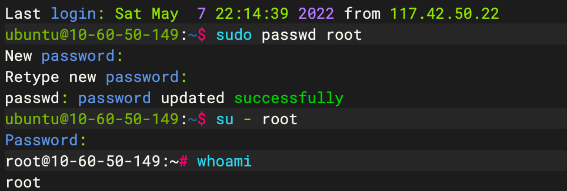

# 修改用户名字

Step 1: 创建root用户

```
sudo passwd root
```


Step 2: 切换至root用户

```
su - root
```





更改主机名：

Step 3: 在root用户下，打开/etc/hostname 文件进行修改

```text
vim /etc/hostname
```


Step 4: 修改完hostname后建议同时修改/etc/hosts文件

```
vim /etc/hosts
```


修改用户名

创建新用户

```
sudo adduser wugenqiang
```

登陆新用户

```
su wugenqiang
```

删除老用户

```
sudo deluser 老用户名
```


