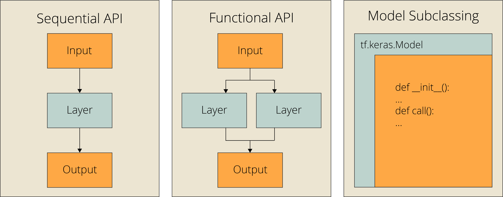
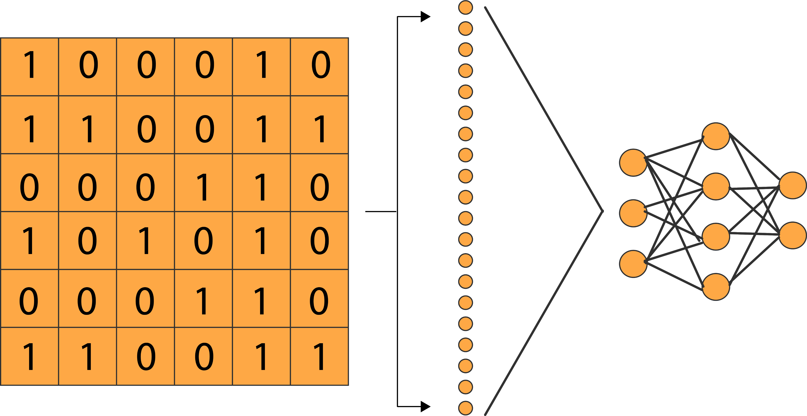
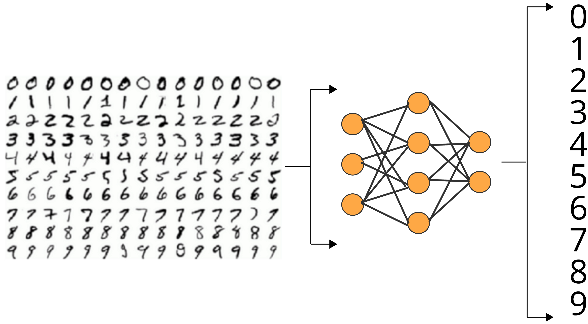

# keras构建模型的三种方式

> Keras API很可能成为构建TensorFlow模型的唯一标准API，有三种方法可以在TensorFlow中构建Keras模型，如下图所示：



* Sequential API
  * 当使用单个输入、输出和层分支构建简单模型时，这是最好的方法
  * 对于新手来说，这是一个很好的选择
* Functional API
  * 函数API是构建Keras模型最流行的方法。
  * 可以完成Sequential API所能做的一切。
  * 允许多个输入、多个输出、分支和层共享。
  * 简洁易用、定制灵活
* Model Subclassing（模型子类化）
  * 模型子类化是为需要完全控制模型、层和训练过程的高级开发人员设计的

对我而言，感觉函数API比较适合我。

> 假设要实现将二维矩阵转换为一维向量和两个全连接层，如下图所示：



## Sequential API

两种实现方式：

（1）方式一

```python
# Step 1: 构建模型
model = Sequential([ 
          # 展平层
          Flatten(input_shape=(28, 28)),
          # 全连接层
          Dense(256,'relu'), 
          # 全连接层
          Dense(10, "softmax"),
          ])
# Step 2: 编译模型
model.compile(optimizer='adam', 
              loss='sparse_categorical_crossentropy', 
              metrics=['accuracy'])
# Step 3: 训练模型
model.fit(x=x_train,y=y_train, epochs=10)
# Step 4: 评估模型
model.evaluate(x_test, y_test)
```

（2）方式二：

```python
# Step 1: 构建模型
model = Sequential()
model.add(Flatten(input_shape=(28, 28, 3)))
model.add(Dense(unit = 256, activation = 'relu'))
model.add(Dense(unit = 10, activation = 'softmax'))

# Step 2: 编译模型
model.compile(optimizer='adam', 
              loss='sparse_categorical_crossentropy', 
              metrics=['accuracy'])
# Step 3: 训练模型
model.fit(x=x_train,y=y_train, epochs=10)
# Step 4: 评估模型
model.evaluate(x_test, y_test)
```

## Functional API

> 这种方式需要我们单独定义我们的输入，然后创建一个输出对象，同时创建所有层，层之间相互关联并且与输出相关联。最后，创建一个接受输入和输出作为参数的模型对象。

```python
inputs = Input(shape=(28, 28)) 
x = Flatten()(inputs) 
x = Dense(256, "relu")(x) 
outputs = Dense(10, "softmax")(x) 

# Step 1: 构建模型对象
model = Model(inputs=inputs, outputs=outputs, name="mnist_model")

# Step 2: 编译模型
model.compile(optimizer='adam', 
              loss='sparse_categorical_crossentropy', 
              metrics=['accuracy'])
# Step 3: 训练模型
model.fit(x=x_train,y=y_train, epochs=10)
# Step 4: 评估模型
model.evaluate(x_test, y_test)
```

## Model Subclassing

模块子类化有两个关键功能：

* `__init__`函数充当构造函数，初始化模型的属性，比如，layer
  * super调用父构造函数
  * self用于引用实例属性
* call function是在定义层之后定义操作的地方

```python
class CustomModel(tf.keras.Model):

  def __init__(self, **kwargs):
    super(CustomModel, self).__init__(**kwargs)
    self.layer_1 = Flatten()
    self.layer_2 = Dense(256, "relu")
    self.layer_3 = Dense(10, "softmax")

  def call(self, inputs):
    x = self.layer_1(inputs)
    x = self.layer_2(x)
    x = self.layer_3(x)
    return x

# Step 1: 类实例化
model = CustomModel(name='mnist_model')

# Step 2: 编译模型
model.compile(optimizer='adam', 
              loss='sparse_categorical_crossentropy', 
              metrics=['accuracy'])
# Step 3: 训练模型
model.fit(x=x_train,y=y_train, epochs=10)
# Step 4: 评估模型
model.evaluate(x_test, y_test)
```


【附示例及完整代码】

`示例`：利用MNIST进行图像分类，训练一个识别手写数字的模型



`完整代码`：

```python
'''
利用MNIST进行图像分类，训练一个识别手写数字的模型
'''
import tensorflow as tf
from tensorflow.keras.models import Sequential
from tensorflow.keras.layers import Flatten, Dense
from tensorflow.keras import Input
from tensorflow.keras import Model
from tensorflow.estimator import DNNClassifier
from tensorflow.keras.datasets.mnist import load_data

(x_train, y_train), (x_test, y_test)= load_data( path="mnist.npz" )

# 确保这些值是浮点数，这样除法后就可以得到小数点
x_train = x_train.astype('float32')
x_test = x_test.astype('float32')
# 通过将RGB代码除以最大RGB值来规范化
x_train /= 255
x_test /= 255

inputs = Input(shape=(28, 28)) 
x = Flatten()(inputs) 
x = Dense(256, "relu")(x) 
outputs = Dense(10, "softmax")(x) 

# Step 1: 构建模型对象
model = Model(inputs=inputs, outputs=outputs, name="mnist_model")

# Step 2: 编译模型
model.compile(optimizer='adam', 
              loss='sparse_categorical_crossentropy', 
              metrics=['accuracy'])
# Step 3: 训练模型
model.fit(x=x_train,y=y_train, epochs=10)
# Step 4: 评估模型
model.evaluate(x_test, y_test)
```

【Reference】

* https://www.jianshu.com/p/cf7cfa619176

【说明一下】

* 训练模型之前，需要设置学习进程，通过compile方法实现，接受3个声明：

  * （1）优化器

  * （2）损失函数：模型要最小化的对象

    多分类：loss='categorical_crossentropy'

    二分类：loss='binary_crossentropy'

  * （3）度量列表：

    分类问题，一般来说是metrics=['accuracy']

【写在后面】

学习了Keras构建模型的三种方式，觉得函数API比较符合我们目前做的工作，这几天准备在Keras的基础上，构建CNN网络模型，后面实现之后，再跟大家分享学习心得。刚刚接触深度学习，如有不妥之处，欢迎告知 ☘️