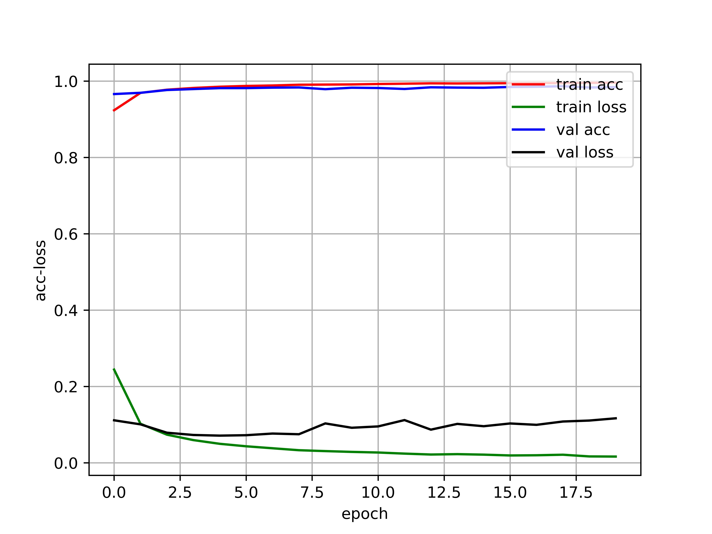
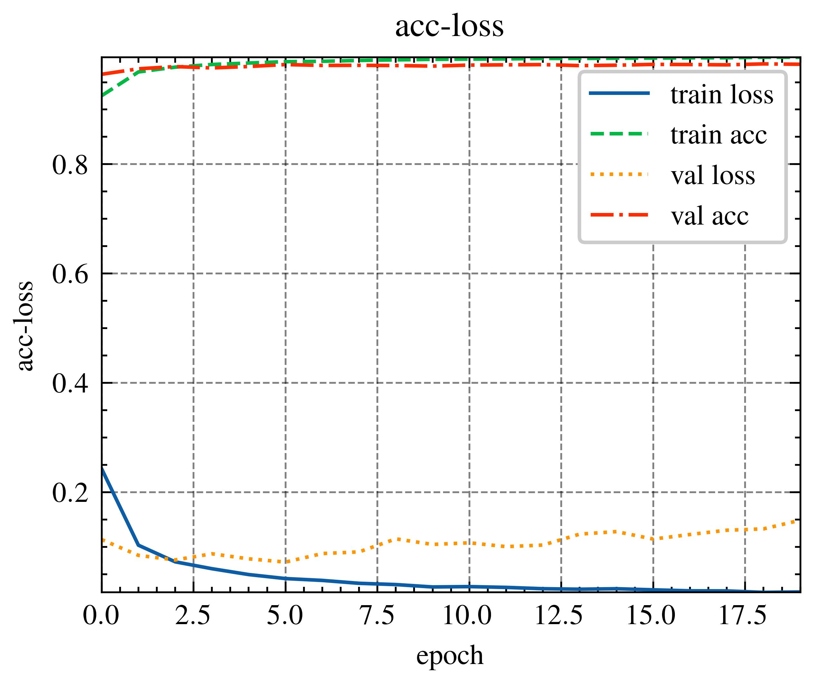

# Keras——绘制模型的acc-loss曲线

> keras版本：2.8.0

## 方法一

第一步：写一个LossHistory类，保存loss（err）和acc（score）并创建实例

```python
class LossHistory(keras.callbacks.Callback):
    def on_train_begin(self, logs={}):
        self.losses = {'batch': [], 'epoch': []}
        self.accuracy = {'batch': [], 'epoch': []}
        self.val_loss = {'batch': [], 'epoch': []}
        self.val_acc = {'batch': [], 'epoch': []}

    def on_batch_end(self, batch, logs={}):
        self.losses['batch'].append(logs.get('loss'))
        self.accuracy['batch'].append(logs.get('accuracy'))
        self.val_loss['batch'].append(logs.get('val_loss'))
        self.val_acc['batch'].append(logs.get('val_accuracy'))

    def on_epoch_end(self, batch, logs={}):
        self.losses['epoch'].append(logs.get('loss'))
        self.accuracy['epoch'].append(logs.get('accuracy'))
        self.val_loss['epoch'].append(logs.get('val_loss'))
        self.val_acc['epoch'].append(logs.get('val_accuracy'))

    def loss_plot(self, loss_type):
        iters = range(len(self.losses[loss_type]))
        #创建一个图
        plt.figure()
        # acc
        plt.plot(iters, self.accuracy[loss_type], 'r', label='train acc')#plt.plot(x,y)，这个将数据画成曲线
        # loss
        plt.plot(iters, self.losses[loss_type], 'g', label='train loss')
        if loss_type == 'epoch':
            # val_acc
            plt.plot(iters, self.val_acc[loss_type], 'b', label='val acc')
            # val_loss
            plt.plot(iters, self.val_loss[loss_type], 'k', label='val loss')
        plt.grid(True)#设置网格形式
        plt.xlabel(loss_type)
        plt.ylabel('acc-loss')#给x，y轴加注释
        plt.legend(loc="upper right")#设置图例显示位置
        plt.savefig('acc-loss.jpg', dpi=800)
        plt.show()

# 创建一个实例LossHistory
history = LossHistory()
```

第二步：变量初始化

```python
# 变量初始化
batch_size = 128
nb_classes = 10
nb_epoch = 20
```

第三步：准备数据

```python
# 准备数据
(X_train, y_train), (X_test, y_test) = mnist.load_data()
X_train = X_train.reshape(60000, 784)
X_test = X_test.reshape(10000, 784)
X_train = X_train.astype('float32')
X_test = X_test.astype('float32')
X_train /= 255
X_test /= 255
print(X_train.shape[0], 'train samples')
print(X_test.shape[0], 'test samples')
Y_train = np_utils.to_categorical(y_train, nb_classes)
Y_test = np_utils.to_categorical(y_test, nb_classes)
```

第四步：建立模型

```python
# 建立模型
model = Sequential()
model.add(Dense(512, input_shape=(784,)))
model.add(Activation('relu'))
model.add(Dropout(0.2))
model.add(Dense(512))
model.add(Activation('relu'))
model.add(Dropout(0.2))
model.add(Dense(10))
model.add(Activation('softmax'))
```

第五步：编译、训练和评估模型

```python
# 编译模型
model.compile(loss='categorical_crossentropy',
              optimizer=RMSprop(),
              metrics=['accuracy'])

# 训练模型
model.fit(X_train, Y_train,
            batch_size=batch_size, epochs=nb_epoch,
            verbose=1,
            validation_data=(X_test, Y_test),
            callbacks=[history])#callbacks回调，将数据传给history

# 模型评估
score = model.evaluate(X_test, Y_test, verbose=0)
print('Test score:', score[0])
print('Test accuracy:', score[1])
```

第六步：绘制acc-loss曲线

```python
# 绘制acc-loss曲线
history.loss_plot('epoch')
```

效果图：



完整代码如下：

```python
#!/usr/bin/python3
# -*- coding: utf-8 -*-

"""
@File: test_10_fold.py
@Time: 2022/4/5 12:40
@Author: genqiang_wu@163.com
@desc: 

"""
from keras.datasets import mnist
from keras.models import Sequential
from keras.optimizer_v2.rmsprop import RMSprop
from keras.utils import np_utils
from keras.layers import *
from matplotlib import pyplot as plt
from tensorflow import keras

class LossHistory(keras.callbacks.Callback):
    def on_train_begin(self, logs={}):
        self.losses = {'batch': [], 'epoch': []}
        self.accuracy = {'batch': [], 'epoch': []}
        self.val_loss = {'batch': [], 'epoch': []}
        self.val_acc = {'batch': [], 'epoch': []}

    def on_batch_end(self, batch, logs={}):
        self.losses['batch'].append(logs.get('loss'))
        self.accuracy['batch'].append(logs.get('accuracy'))
        self.val_loss['batch'].append(logs.get('val_loss'))
        self.val_acc['batch'].append(logs.get('val_accuracy'))

    def on_epoch_end(self, batch, logs={}):
        self.losses['epoch'].append(logs.get('loss'))
        self.accuracy['epoch'].append(logs.get('accuracy'))
        self.val_loss['epoch'].append(logs.get('val_loss'))
        self.val_acc['epoch'].append(logs.get('val_accuracy'))

    def loss_plot(self, loss_type):
        iters = range(len(self.losses[loss_type]))
        #创建一个图
        plt.figure()
        # acc
        plt.plot(iters, self.accuracy[loss_type], 'r', label='train acc')#plt.plot(x,y)，这个将数据画成曲线
        # loss
        plt.plot(iters, self.losses[loss_type], 'g', label='train loss')
        if loss_type == 'epoch':
            # val_acc
            plt.plot(iters, self.val_acc[loss_type], 'b', label='val acc')
            # val_loss
            plt.plot(iters, self.val_loss[loss_type], 'k', label='val loss')
        plt.grid(True)#设置网格形式
        plt.xlabel(loss_type)
        plt.ylabel('acc-loss')#给x，y轴加注释
        plt.legend(loc="upper right")#设置图例显示位置
        plt.savefig('acc-loss.jpg', dpi=800)
        plt.show()

# 创建一个实例LossHistory
history = LossHistory()

# 变量初始化
batch_size = 128
nb_classes = 10
nb_epoch = 20

# 准备数据
(X_train, y_train), (X_test, y_test) = mnist.load_data()
X_train = X_train.reshape(60000, 784)
X_test = X_test.reshape(10000, 784)
X_train = X_train.astype('float32')
X_test = X_test.astype('float32')
X_train /= 255
X_test /= 255
print(X_train.shape[0], 'train samples')
print(X_test.shape[0], 'test samples')
Y_train = np_utils.to_categorical(y_train, nb_classes)
Y_test = np_utils.to_categorical(y_test, nb_classes)

# 建立模型
model = Sequential()
model.add(Dense(512, input_shape=(784,)))
model.add(Activation('relu'))
model.add(Dropout(0.2))
model.add(Dense(512))
model.add(Activation('relu'))
model.add(Dropout(0.2))
model.add(Dense(10))
model.add(Activation('softmax'))

# 编译模型
model.compile(loss='categorical_crossentropy',
              optimizer=RMSprop(),
              metrics=['accuracy'])

# 训练模型
model.fit(X_train, Y_train,
            batch_size=batch_size, epochs=nb_epoch,
            verbose=1,
            validation_data=(X_test, Y_test),
            callbacks=[history])#callbacks回调，将数据传给history
# 模型评估
score = model.evaluate(X_test, Y_test, verbose=0)
print('Test score:', score[0])
print('Test accuracy:', score[1])

# 绘制acc-loss曲线
history.loss_plot('epoch')
```

## 方法二

第一步：变量初始化

```python
# 变量初始化
batch_size = 128
nb_classes = 10
nb_epoch = 20
```

第二步：准备数据

```python
# 准备数据
(X_train, y_train), (X_test, y_test) = mnist.load_data()
X_train = X_train.reshape(60000, 784)
X_test = X_test.reshape(10000, 784)
X_train = X_train.astype('float32')
X_test = X_test.astype('float32')
X_train /= 255
X_test /= 255
print(X_train.shape[0], 'train samples')
print(X_test.shape[0], 'test samples')
Y_train = np_utils.to_categorical(y_train, nb_classes)
Y_test = np_utils.to_categorical(y_test, nb_classes)
```

第三步：建立模型

```python
# 建立模型
model = Sequential()
model.add(Dense(512, input_shape=(784,)))
model.add(Activation('relu'))
model.add(Dropout(0.2))
model.add(Dense(512))
model.add(Activation('relu'))
model.add(Dropout(0.2))
model.add(Dense(10))
model.add(Activation('softmax'))
```

第四步：编译、训练和评估模型

```python
# 编译模型
model.compile(loss='categorical_crossentropy',
              optimizer=RMSprop(),
              metrics=['accuracy'])

# 训练模型
history = model.fit(X_train, Y_train,
            batch_size=batch_size, epochs=nb_epoch,
            verbose=1,
            validation_data=(X_test, Y_test),
            )

'''
verbose：日志显示
verbose = 0 为不在标准输出流输出日志信息
verbose = 1 为输出进度条记录
注意： 只能取 0 和 1；默认为 1
'''
loss, accuracy = model.evaluate(X_test, Y_test, verbose=1) # 模型评估
print('Test loss:', loss)
print('Test accuracy:', accuracy)
```

第五步：获取acc和loss值

```python
train_loss = history.history["loss"]
train_acc = history.history["accuracy"]
val_loss = history.history["val_loss"]
val_acc = history.history["val_accuracy"]
```

第六步：绘制acc-loss曲线图

```python
def acc_loss_plot(train_loss, train_acc, val_loss, val_acc):
    with plt.style.context(['wugenqiang', 'grid']):
        # 创建一个图
        plt.figure()
        plt.plot(train_loss, label='train loss')
        plt.plot(train_acc, label='train acc')
        plt.plot(val_loss, label='val loss')
        plt.plot(val_acc, label='val acc')
        # plt.grid(True, linestyle='--', alpha=0.5)  # 增加网格显示
        plt.title('acc-loss')  # 标题
        plt.xlabel('epoch')  # 给x轴加注释
        plt.ylabel('acc-loss')  # 给y轴加注释
        plt.autoscale(tight=True)  # 自动缩放(紧密)
        plt.legend(loc="upper right")  # 设置图例显示位置
        plt.savefig('./images/acc-loss.jpg', dpi=800, bbox_inches='tight')  # bbox_inches可完整显示
        plt.show()
        
acc_loss_plot(train_loss, train_acc, val_loss, val_acc)  # 绘制acc-loss图
```


效果如图：



完整代码如下：

```python
#!/usr/bin/python3
# -*- coding: utf-8 -*-

"""
@File: draw_acc_loss.py
@Time: 2022/4/6 08:23
@Author: genqiang_wu@163.com
@desc: 

"""
import numpy as np
from keras.datasets import mnist
from keras.models import Sequential
from keras.optimizer_v2.rmsprop import RMSprop
from keras.utils import np_utils
from keras.layers import *
from matplotlib import pyplot as plt

def acc_loss_plot(train_loss, train_acc, val_loss, val_acc):
    with plt.style.context(['wugenqiang', 'grid']):
        # 创建一个图
        plt.figure()
        plt.plot(train_loss, label='train loss')
        plt.plot(train_acc, label='train acc')
        plt.plot(val_loss, label='val loss')
        plt.plot(val_acc, label='val acc')
        # plt.grid(True, linestyle='--', alpha=0.5)  # 增加网格显示
        plt.title('acc-loss')  # 标题
        plt.xlabel('epoch')  # 给x轴加注释
        plt.ylabel('acc-loss')  # 给y轴加注释
        plt.autoscale(tight=True)  # 自动缩放(紧密)
        plt.legend(loc="upper right")  # 设置图例显示位置
        plt.savefig('./images/acc-loss.jpg', dpi=800, bbox_inches='tight')  # bbox_inches可完整显示
        plt.show()

# 变量初始化
batch_size = 128
nb_classes = 10
nb_epoch = 20

# 准备数据
(X_train, y_train), (X_test, y_test) = mnist.load_data()
X_train = X_train.reshape(60000, 784)
X_test = X_test.reshape(10000, 784)
X_train = X_train.astype('float32')
X_test = X_test.astype('float32')
X_train /= 255
X_test /= 255
print(X_train.shape[0], 'train samples')
print(X_test.shape[0], 'test samples')
Y_train = np_utils.to_categorical(y_train, nb_classes)
Y_test = np_utils.to_categorical(y_test, nb_classes)

# 建立模型
model = Sequential()
model.add(Dense(512, input_shape=(784,)))
model.add(Activation('relu'))
model.add(Dropout(0.2))
model.add(Dense(512))
model.add(Activation('relu'))
model.add(Dropout(0.2))
model.add(Dense(10))
model.add(Activation('softmax'))

# 编译模型
model.compile(loss='categorical_crossentropy',
              optimizer=RMSprop(),
              metrics=['accuracy'])

# 训练模型
history = model.fit(X_train, Y_train,
            batch_size=batch_size, epochs=nb_epoch,
            verbose=1,
            validation_data=(X_test, Y_test),
            )

train_loss = history.history["loss"]
train_acc = history.history["accuracy"]
val_loss = history.history["val_loss"]
val_acc = history.history["val_accuracy"]
acc_loss_plot(train_loss, train_acc, val_loss, val_acc)  # 绘制acc-loss图

'''
verbose：日志显示
verbose = 0 为不在标准输出流输出日志信息
verbose = 1 为输出进度条记录
注意： 只能取 0 和 1；默认为 1
'''
loss, accuracy = model.evaluate(X_test, Y_test, verbose=1) # 模型评估
print('Test loss:', loss)
print('Test accuracy:', accuracy)
```

