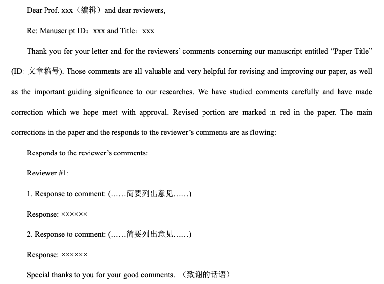

首先，**诚恳的态度是至关重要的**，提交文章修改后要附上一个cover letter。里面包含这些内容：

- 感谢编辑安排审稿以及审稿人提出的宝贵意见。
- 作者已经认真按照审稿人的要求对问题一一作答，并对文章进行了仔细的修改，文章的所有修改都着重标出。
- 因为你们的建议，经过修改后的文章变得更好，读者们可以获得更有价值的信息。
- 再次感谢编辑和审稿人的帮助。

虽然cover letter的内容也都是客套话，但是编辑跟审稿人看着也会舒心不少。特别是审稿人，需要认真地无偿地审阅文章，难能可贵的是还需要找出不足的地方。即便有时因为研究方向不是很一致，他们有的问题有点业余，又或者提意见时比较不客气，回复审稿意见的时候也一定要尊重他们。

**第二**，另外起草一个单独的response letter。 在这里用问答式一一列出每个审稿人的意见并且一一作答。对于文字的修改要求，直接接受就行了。有的审稿人要求增加参考文献，也许这是审稿人唯一显示他私心的地方——比如要求引用他的文章，不是很离谱的情况下也可以照办，或者打个折嘛，要求引用三篇最后加上一篇嘛。回答问题的时候，最好简洁和就事论事，不要拖泥带水。要注意不要为了回答某个问题而导致更多的疑问，尽量将讨论局限在有限的范围内。

**第三**，有的审稿人与文章的研究方向有差异，或者没有认真读文章，导致对文章的理解有误，从而提出一些莫名其妙的问题。回答这些问题的时候，可以首先引用一下文章的相关句子，然后指出文章的真正意思。接着承认是自己的表达出现问题了，让审稿人曲解了意思，最后指出句子已经重写，表达的意思已经更准确了。这样的回答，既巧妙地回答了该问题，也避免了让审稿人尴尬。

**第四**，如果遇到了非常难回答的问题，比如审稿人质疑文章的创新性有限，价值不大。这些是文章的硬伤，是没有办法修改的。赞同审稿人的意见肯定不好，但是用回避的方式不回答更不好，既不礼貌也侧面赞同了审稿人。这个问题尽管很难回答，但是还是要去争取一下，比如再强调一下文章里面相关的几个句子。要知道每个人的见解不同，虽然一个审稿人觉得意义不大，但是决定权毕竟是在编辑手里，只要编辑在综合多个审稿人意见之后还觉得文章有可取之处，也就没有问题。而response letter是所有审稿人都可以看到的，诚恳的回答会获得其他审稿人的好感。

**第五**，审稿意见里面经常出现的问题是要求补充信息，比如更多的实验结果或者与该文章相关的另外的一些信息。这样的问题需要仔细斟酌一下，如果仅仅是审稿人出于自己的好奇，是可以选择在response letter 里提供而不是直接添加到文章里面。而如果对所有读者都有用，则需要加到文章里面。对于审稿人提出的不合理的建议，可以心平气和地找个客观的理由委婉地拒绝或者提供一些参考资料，不要让审稿人觉得你对他的问题视而不见。最後,若还是不放心,可以请专业的论文润色公司如英论阁 [www.enago.cn](http://www.enago.cn/)提供协助

http://www.360doc.com/content/20/0613/05/4102591_918174830.shtml

