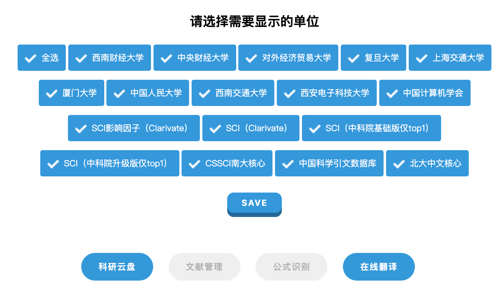
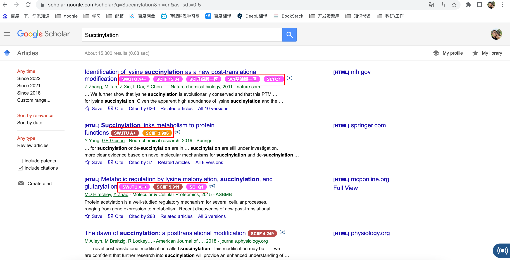

# easyScholar——超级实用且方便的学术插件

> 之前给大家推荐过scholarscope插件，这是一个用于显示期刊名、影响因子添加文献下载链接的插件，奈何`收费`了！！收费的当然不如免费的香啊，毕竟开源才能得到更好的发展！
>
> 在师兄的帮助下，找到了这款好用的插件，独乐乐不如众乐乐，特此也分享给大家使用 ☘️

其主要功能：

- 显示会议、期刊等级 ————支持在各大论文搜索网站，显示各种期刊、会议等级排名，浏览文献变得如此轻松。
- 科研云盘 ————支持云端存储各种文件，云上文件共享，免去携带U盘的烦恼。
- 在线翻译 ————翻译竟然如此方便，再也不用手动复制粘贴到翻译软件啦。

## 安装插件

下面介绍`chrome`平台安装插件：

### 1 下载插件

### 2 打开扩展程序，安装插件

在chrome网址中输入：chrome://extensions

解压，将下载好的crx插件拖进扩展程序中，会提示安装，点击添加即可。

目前已支持在线翻译和科研云盘，但是文献管理和公式识别还需要时间。

## 测试

> easyScholar不像Scholarscope和EasyPubmed只适配于PubMed，easyScholar`支持`多个中英文数据库/文献检索平台，比如`谷歌学术`，`中国知网`，`百度学术`等文献检索平台，当然也涵盖了`PubMed等外文数据库`。

下面以谷歌学术为例：

打开谷歌学术：https://scholar.google.com/

举个例子，假设搜索`Succinylation`

就会返回带有影响因子以及分区的标记啦，是不是很舒服～～🌹☘️ 希望可以帮助到你。

想要了解在其它浏览器平台安装此插件，或者想了解更多功能，可以到作者的博客和GitHub去了解该插件：

* 插件作者博客：https://blog.csdn.net/weixin_49328057/article/details/113148625
* 插件作者Github：https://github.com/nixiak-nan/easyscholar

