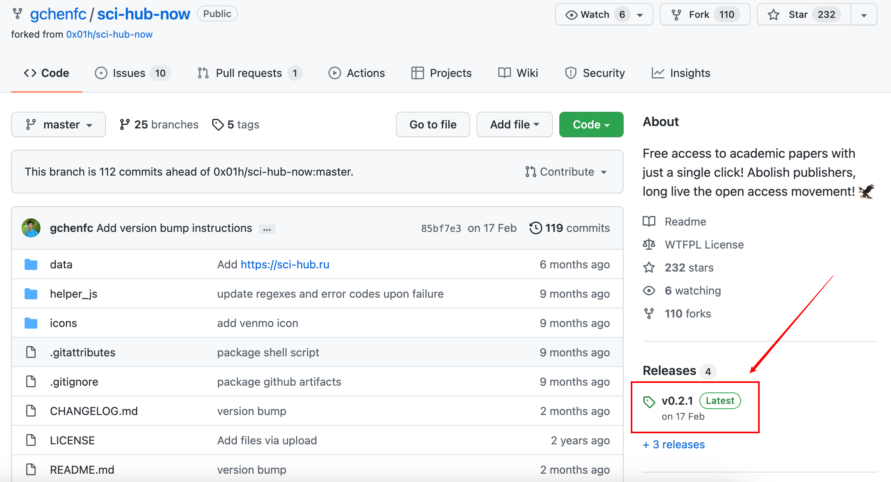
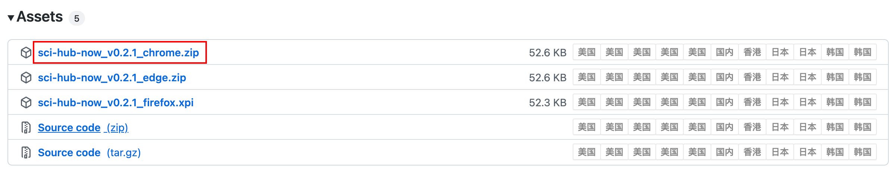
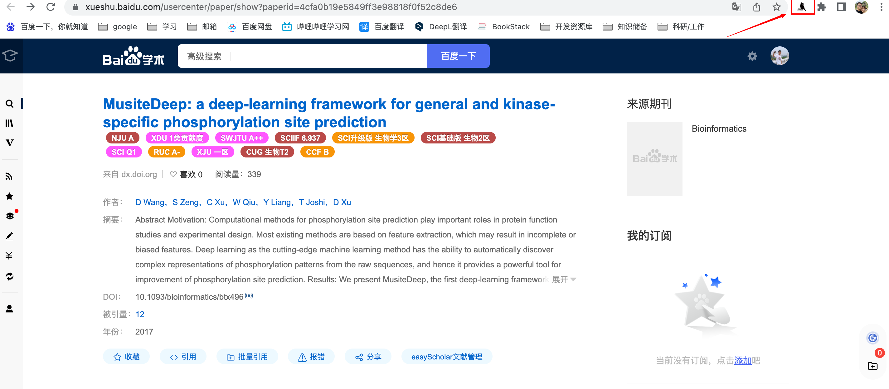
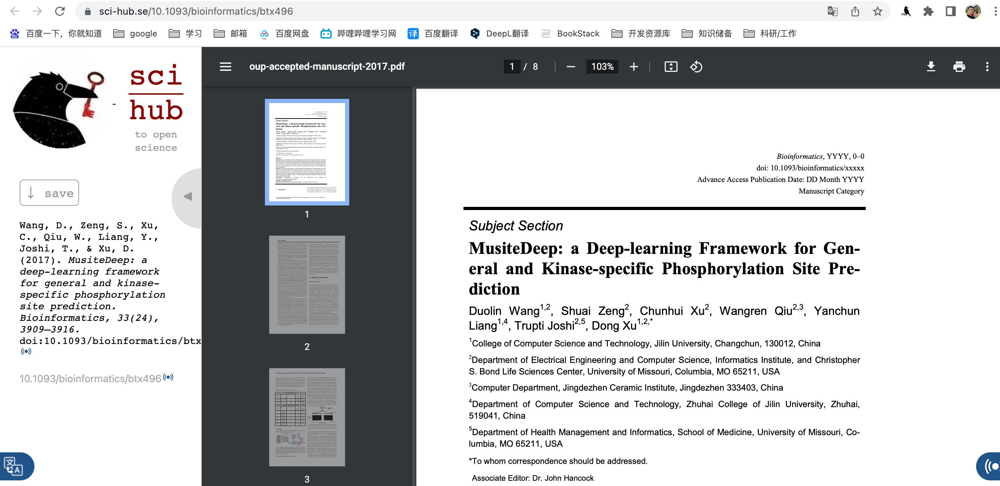

# Sci-Hub X Now

> ☘️ 文献下载对于一位初出茅庐的科研新手是一件非常棘手的事情，当然老手也希望可以有下载更方便的软件存在，这个时候我发现了`Sci-Hub X Now`插件，绝对是一把利器，可以试试！

## 插件下载

进入作者Github：https://github.com/gchenfc/sci-hub-now

点击Release这里的最新版本，跳转页面滑动到最下方，选择你需要的平台插件，目前支持Chrome、edge还有firefox，点击即可下载。

这里我以Chrome为例进行说明。

## 插件安装步骤

以Chrome为例：

1、将扩展下载的安装包文件（.zip）解压为文件夹

2、从Chrome浏览器设置->更多工具->扩展程序，打开扩展程序页面，或者地址栏输入 Chrome://extensions 按下回车打开扩展程序页面

(3) 打开扩展程序页面的“开发者模式”

(4) 点击“加载已解压的扩展程序”。选择解压后的文件夹，即可

> 或者通过百度云网盘直接下载crx文件，然后拖进扩展程序一键安装。
>
> 链接: https://pan.baidu.com/s/1R3d3T6--XOYCerG-k7niUA?pwd=vqo8 提取码: vqo8

## 测试

假设我们在百度学术上搜到这篇文章：[MusiteDeep: a deep-learning framework for general and kinase-specific phosphorylation site prediction](http://dx.doi.org/10.1093/bioinformatics/btx496)

只要点击右上角这个小鸟图案，立马会跳转至文献阅读页面，可以直接下载PDF：

是不是非常方便呢，希望可以帮助到你 🍄

