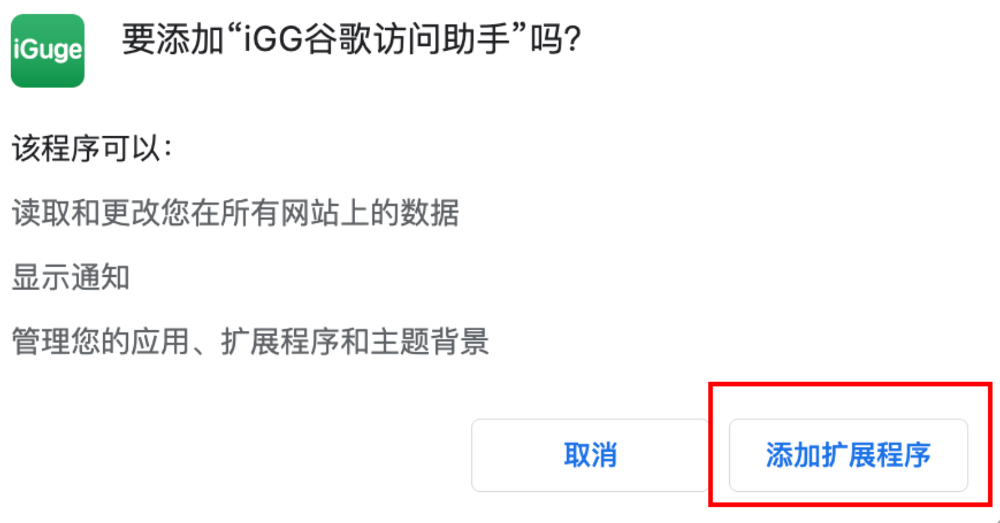
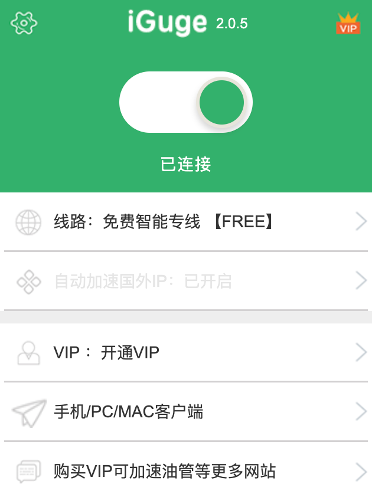
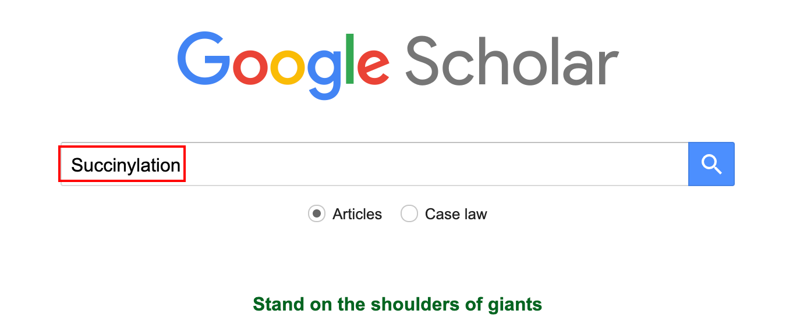
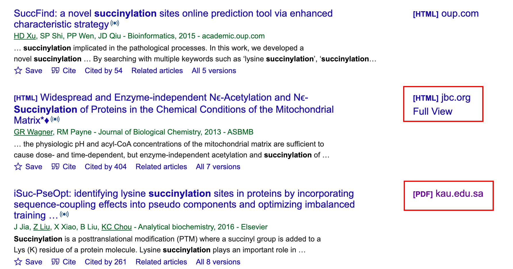

# iGG谷歌访问助手：一款秒进谷歌学术，无限制访问的插件

## 插件介绍

> iGG谷歌访问助手，可以帮助我们实现对谷歌学术、gmail邮箱等谷歌服务的访问。通过使用测试，可以快速的进行访问。

## 安装插件

### 1 下载插件

链接: https://pan.baidu.com/s/1wM92r9j9Ths15lr0yDEl5w 提取码: 59e0

### 2 打开扩展程序，安装插件

在chrome网址中输入：chrome://extensions

解压，将下载好的crx插件拖进扩展程序中，会提示安装，点击添加即可。

说明：

自我感觉，基础版已经符合需求啦，VIP版如果有需求，也可以自行尝试哈，希望可以帮到大家！

## 测试

打开谷歌邮箱、谷歌网页都能顺利访问，下面以谷歌学术举例

打开谷歌学术：https://scholar.google.com/，输入想搜索的内容，比如Succinylation

会跳转到搜索好的页面，页面右边会显示HTML或者PDF，点击HTML会进入官网文章页面，点击PDF会跳转到文章阅读页面，根本不用再翻墙啦！

是不是很方便、很nice ☘️

